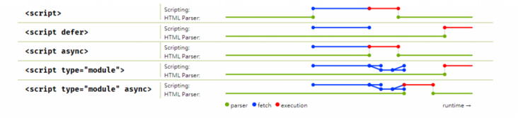

# HTML

## html 结构

**一个完整的 html 结构包含哪几部分结构？**

- 文档声明
- html 元素
- head 元素
- body 元素

### 文档声明

```html
<!DOCTYPE html>
```

- html 文档声明，告诉浏览器当前页面是**HTML5**页面，让浏览器用**HTML5 的标准**去**解析识别**html 文档
- 必须放 html 文档**最前面**，省略了会出现**兼容问题**

### html 元素

- 一个文档**只能有一个**，所有元素的根元素

- **w3c**标准建议为 html 元素增加一个**lang 属性**，作用：

  帮助**语音合成工具**确定要使用的**发音**

  帮助**翻译工具**确定要使用的**翻译规则**

### head 元素

**内容**是一些**元数据**（描述数据的数据）

一般用于**描述网页**的各种信息，比如字符编码、网页标题、网页图标等等

- **title**元素 **网页标题**

- **meta**元素 **字符编码**（常见 ASCll、Unicode、utf-8/16/32）(所有网页**目前**都需要采用**utf-8 编码**，为了浏览器在解析时能**正确解析**出来内容，因此我们要**告诉浏览器**用**utf-8 去解析/解码**)

- **link**元素 可以**设置图标**或**引入外部样式文件**

  link 元素的**rel 属性**不能省略，用来指定**文档与链接资源**的关系

  一般 rel 若确定，相应的**type 也会默认确定**，所以可以**省略 type**

  **网页图标**支持的图片格式：**ico、png**

- **base 元素** 与**a 元素**搭配使用

### body 元素

## body 内常用元素

### 列表

浮动**一开始不是**用来**设置布局**的（浮动的滥用）

是用来**图文混排**的

**3 组常用展示列表的元素**

- 有序列表 ol、li
- 无序列表 ul、li
- 定义列表 dl、dt、dd

**ol 和 ul 子元素只能是 li**

**dl 的子元素只能是 dt 和 dd**

### 表格

- table
- tr（table row）
- td （table define）

**table>tr>td**

**表格的其它元素**

tbody 表格内容

caption 表格标题

thead 表头

tfoot 页脚

#### 单元格合并

**td**设置这些属性

- colspan 跨行
- rowspan 跨列

记得**合并**后**删去原来**的单元格

### 表单

- form
- **input** 单标签
- textarea
- select、option
- button
- label 优化用户体验（for id）
- fieldset、legend 表单外围

**inupt 有多种 type**

**input 的 type="reset"时可以重置表单(记得在同一个 form 元素中)**

**input 的 autoFocus 属性，当页面加载时，自动聚焦**

**input 的 name 和 value 属性，提交到服务器时，当参数传递给服务器**

#### 模拟百度搜索引擎

```html
<form action="https://www.baidu.com/s">
  <input type="text" placeholder="请输入内容" name="wd" />
  <input type="submit" value="百度一下" />
</form>
```

#### 传统表单提交

- 将所有**input**包裹到**form**中
- form 的**action**属性=**服务器地址**
- **input/button**类型是**submit**
- **点击**submit，自动将所有**数据提交到服务器**

**弊端**：

1.提交会进行**页面**的**跳转**，这就意味着**服务器端**要提前将这个**页面写好**，并且将这个已经写好的页面**返回给前端**，前端直接展示（**服务端渲染**）

2.**不方便**进行**表单数据**的**验证**

#### 前后端分离表单提交

- 通过**js 获取**到所有**表单**的**内容**
- 通过**正则表达式**进行表单的**验证**
- 发送**ajax**请求，将数据传给服务器
- 验证成功后，服务器后会返回结果，需要**前端解析这个数据**，并且**决定显示**什么内容

而**大型公司**用**传统表单提交**更多见，因为大公司都希望做**SEO**，并且这种方式（**SSR**服务器渲染）**首屏渲染速度**更快

推荐个播放器 vlc

### h 元素

有助于网站的**SEO**（search engine optimization）**优化**，可以**促进关键词排名**

- 搜索引擎爬取网站数据时，选择的是**h1 标签**爬取关键词
- 建议一个网页**最多只有一个**h1 元素，多了有可能会被搜索引擎**认为作弊**，视为 k 站

魏则西事件，有家广告公司利用了这点害死了魏则西

### 字符实体

比较常用的

- 空格 &nbsp
- 大于号 &gt
- 小于号 &lt
- & &amp

### sapn 元素

- 区别普通文本，便于控制文本**样式**
- **行内元素**之间有**空格**是因为 html 代码中的**换行符**

### div 元素

### img 元素

- **单标签**
- alt 属性：图片加载失败时显示文本

**web 常用图片格式**

png：**静态**图片，支持**透明**

jpg：**静态**图片，**不支持**透明

gif: **动态**图片，支持**透明**

**像素**

图像显示的最小单位

每个像素都可以表示一种颜色

### a 元素

a 元素**不一定是跳转**：

如果 href 属性值是**资源**的**下载地址**的话就会**下载资源**

如果是**邮箱地址**也可能**发送邮箱**

- target 属性 **\_self**当前窗口打开 **\_blank**新窗口打开

#### 与**base 元素**搭配

- 抽取多个 a 元素**相同的属性**
- 当**a 元素**的**href 属性**没有值时，使用**base 元素**的 href 值，有的话就用 a 自己的

#### **锚点链接**

点击 a 元素在**网页内跳转**

- **定位元素**设 id
- **a 元素**的**href 属性值**为#id

#### **伪链接**

**没有**指明**具体链接**地址的链接

如果点击暂时不做任何事，可以写成下面这种形式

```html
<a href="#" onclick="return false"> </a>
```

```html
<a href="javascript:"></a>
```

所以有时候可以把**链接当做按钮**来使用

当`href="#"`时，点击会跳到顶部

#### 与**img 元素**结合

图片链接

### iframe 元素

网页里嵌套网页

### 标签语义化

好处：

- 维护成本低
- 组员沟通间成本低
- 让搜索引擎更好的识别更加重要的信息

**百度搜索引擎**只识别**后端渲染**

而谷歌搜索引擎**前端渲染和后端渲染**都识别

所以谷歌做的更好

## URL

全称 Uniform Resource Locator，**统一资源定位符**

### 基本格式

**协议://主机地址/路径**

protocol://hostname/path

更具体更完整的格式

`protocol://hostname[:port]/path/[;parameters][?query]#fragment`

http://www.baidu.com:80/s?wd=ios#page

http 默认端口是 80，ftp 默认端口是 21

端口可以理解为不同的服务窗口

### 协议

不同的协议，代表着不同的**资源查找**方式，**资源传输**方式

**常见协议**

**http** **超文本传输协议**，访问的是**远程**的**网络资源**，**https 协议**相当于 http 协议的安全版本

**file** 访问**本地计算机**上的**资源**，不用加主机地址

**ftp** 访问的是**共享主机**的**资源**

**mailto** 访问的是**电子邮件地址**

## Emmet 语法

可以理解理解**代码生成快捷键**

### html

生成子代元素 `div>span`

生成兄弟元素 `div+span`

生成分组 `()`

生成数字 `$`

生成内容 `{}`

生成多份 `*`

### css

- w100
- w100+h100
- 属性首字母

## html5

**狭义概念**

说的是 html 新的元素和特性

**广义**

html5 新的标准，包括最的 html 元素+css 新特性+js

### 新增语义化元素

- nav
- header
- section
- article
- footer
- aside
- datalist（选项列表，常与 input 一起使用）
- progress（进度条，value-已完成，max-总数）

### 媒体元素

在 h5 之前用 flash 插件

- video
- audio

#### **video**

- src
- control 工具栏
- autoplay （有兼容问题，谷歌不支持自动播放，加上 muted 就可以）
- muted 静音
- loop 循环

#### audio

- src
- control 工具栏
- autoplay （有兼容问题，谷歌不支持自动播放，加上 muted 就可以）
- muted 静音
- loop 循环

**source 元素**

- 如果存在**兼容性**问题，可以将**多个音/视频格式**的数据源放到**source**元素中
- 通过**src**指定数据来源

### input 元素拓展

- placeholder
- multiple
- autofocus

**对于 type 值也有拓展**

- date
- time
- number
- tel
- color
- email
- 等等

## 常用快捷键

- Ctrl+Enter **写完换行**
- Ctrl+F **搜索**（代码找变量/网页找元素）
- Alt+Shift+下 **向下复制当前行**
- Alt+Shift+F 代码**格式化**

## script

### data-main 属性

加载 src 部分的再加载 data-main 部分

```html
<script src="./hhh" data-main="./zsf"></script>
```

## img

```html

```

x-oss-process=image%2Fresize%2Cw_750%2Climit_0 有什么作用呢

**有什么作用呢**

1. `image/resize`：这部分指定了要进行的操作，即对图片进行调整大小的操作。
2. `w_750`：这是调整图片宽度的参数，将图片宽度调整为 750 像素。这个参数告诉 OSS 在显示这张图片时将其宽度限制为 750 像素。
3. `limit_0`：这个参数表示不对图片的文件大小进行限制。通常，OSS 会根据图片的处理操作和质量设置来控制文件大小，但 `limit_0` 表示不进行额外的限制。

综合来说，这个参数的作用是将图片调整为指定宽度，并且不对文件大小进行限制。这在网页设计中常用于确保图片在页面上的显示大小一致，并且不会因为文件大小而导致加载速度变慢。

这种方式允许你通过在图片 URL 中包含参数来对图片进行处理，而不必事先创建不同尺寸的图片副本。相同的原始图片可以通过不同的参数进行处理，以满足不同设备或布局的需求。

# 常见试题

## html5 新增了哪些特性？

- 新增了几个语义化元素（nav、header、aside、footer 等）
- 新增了两个媒体元素（video 和 audio）
- 等等

## script 标签

我们知道，解析 HTML 过程中如果遇到**script 元素**，要停止解析；同时**启动网络线程**下载 script 中的资源，并在下载完成后启动**js 引擎**解析并执行 script 中的代码，等 js 代码**执行完毕**再继续 HTML 的解析；

这样可能会出现的问题有：

- DOM 树在还**没有完全解析**时**就开始执行 JavaScript**，需要操作 DOM 的程序可能因此无法正确执行；
- 或是由于 `<script>` 中的**资源下载**、**执行时间**过程，用户会卡在白画面，并会产生觉得网站太慢不好用之类的体验；

而把 `<script>` 标签的位置都放到 **`<body>` 的最后一行**来避免 DOM 树解析不完全的问题；

但是在复杂的网站中，需要等到整个 DOM 树都载入完成才开始下载 `<script>` 内的资源并执行，依然会有一段等待时间；

从 HTML4 开始，`<script>` 多了 `defer` 属性；

而 HTML5 则多了 `async`；

两者都是用来帮助开发者控制 `<script>` 内**资源的载入及执行顺序**，以及避免 DOM 的解析被资源下载卡住的问题；

一张图理解两者作用



#### **async**

对于**普通脚本**，如果存在 `async` 属性，那么**下载脚本**和**DOM 解析** 会**并行**，并尽快解析和执行；

对于**模块脚本**，如果存在 `async` 属性，那么脚本及其**所有依赖**都会在**延缓队列**中执行，因此它们会被并行下载，并尽快解析和执行；

该属性能够**消除**解析阻塞的 Javascript；

解析阻塞的 Javascript 会导致浏览器**必须加载并且执行脚本**，之后才能继续解析；

`async` 比较特别，因为在**下载后会立刻执行**，且不**保证执行顺序**，一般常见的应用是设定在**完全独立的小小模块**中，例如**背景 Logo、页面广告**等，在避免造成使用者体验变差的同时，尽量早的产生效果。

#### **defer**（deferred，延迟）

这个布尔属性被设定用来通知浏览器该脚本将在文档**完成解析后**，触发 `DOMContentLoaded (en-US)` **事件前执行**；

有 `defer` 属性的脚本会**阻止** `DOMContentLoaded` 事件，直到**脚本被加载并且解析完成**；

也就是说，在加上 `defer` 属性后，浏览器会继续解析、渲染画面，而**不会因为需要载入`<script>` 内的资源而卡住**；实际执行时，会在 `DOMContentLoaded` 执行之前，由上到下的依照摆放顺序触发。

**`DOMContentLoaded` 事件**

当初始的 **HTML** 文档被**完全加载和解析完成**之后，**`DOMContentLoaded` **事件被触发，而无需等待样式表、图像和子框架的完全加载。

如果希望 DOM 在用户请求页面后尽可能快地解析

- js 异步化；
- 优化样式表的加载；

由于被**并行加载**而减慢页面加载，从主 html 文档“窃取”流量。

`defer` 由于**后台载入**、**不打断渲染**及**确保执行顺序**的特点，基本上在没特殊需求的情况下，在 `<script>` 中设置一下就行了；

`async` 及 `defer` 是 `<script>` 专属的属性；

对于网页中的**其他资源**，可以通过 `<link>` 的`preload`、`prefetch` 属性，来帮我们 **延迟加载** 未来才需要用到的资源。

# 疑难杂症

## The script has an unsupported MIME type ('text/html').

通常发生在尝试加载 JavaScript 文件时，但服务器实际上返回了 HTML 内容，而不是预期的 JavaScript 内容。
