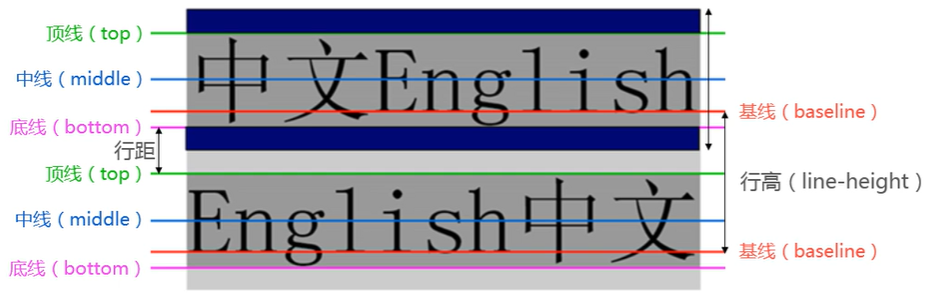
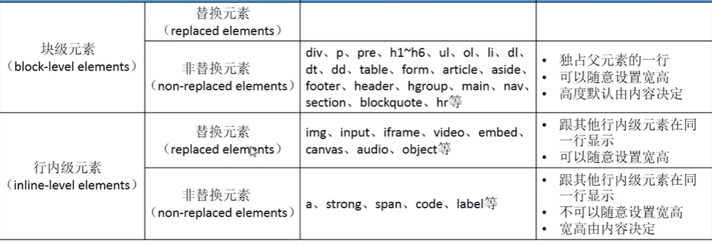
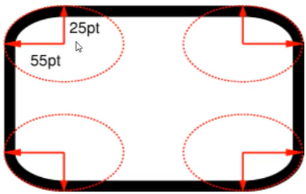
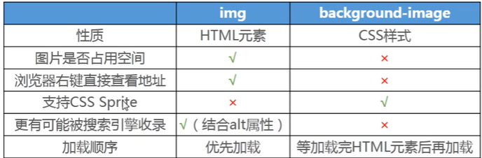

# CSS

## 初识 css

css 全称 Cascading Style Sheets，**层叠样式表**

修饰网页样式并不是只有 css，当时有个强力**竞争对手 svg**，但是**css**的**层叠性**让它脱颖而出

目前 css3 只是**某些模块**升级到**3**，**不是全部**，有些模块已经升级到**4**了

官方文档

https://www.w3.org/TR/CSS22/propidx.html

中文文档

https://developer.mozilla.org/zh-CN/docs/Web/CSS

查看 css 属性可用性

https://caniuse.com/

css 属性变成**标准 standard**需要经过**草稿 drafts**、**备选推荐**、**推荐**这几个步骤；

**谷歌**一般会在**草稿**里看看哪些属性好不好用，**好用就支持**，而别的浏览器可能不怎么做；

所以有时 css 有些**属性**出现**兼容性**问题

## css 引入

html 三种引入 css：

- 内联样式
- 文档样式表
- 外部样式表

现代开发网页要**结构与样式分离**

**外部样式表引入**

- link 元素
- style 元素里@import

```html
<style>
  @import url();
</style>
```

link 效率高一点

**css 引入 css**

```css
@import url();
```

### css 文件编码

指定单个 css 文件编码

```css
@charset "utf-8";
```

## 选择器

- 通配选择器
- 元素选择器
- 类选择器
- id 选择器
- 属性选择器
- 组合
- 伪类
- 伪元素

### 通配选择器

通用属性的设置，比如

```css
 {
  margin: 0;
  padding: 0;
}
```

通配符 **\*** ，但是**一般列出**需要使用这些通用属性的**元素**，因为\*内部原理是在**网页元素**中做个**遍历**，给每个元素**加上这些样式**，这样可能**影响网页运行效率**，因为**有些元素**是**不需要**这些属性的

### id 选择器

**id 名**一个页面**只能有一个**（规范）

### 类选择器

- **一个元素**可以**多个类选择器**，**空格**分开

```html
<h2 class="title">123</h2>
```

```css
.title {
}
```

### 伪类选择器

#### 动态伪类

- :link （a:link 未访问的链接）
- :visited （a:visited 已访问的链接）
- :focus （获取焦点时）
- :hover （a:hover 鼠标移动到）
- :active （a:active 点击未松手）

同时存在以上属性时，**推荐这个顺序**，不然会有很多问题

（女朋友看到**lv**包包后，**ha**ha 大笑）

:hover 和:active 也可以**应用到其它元素**上

**应用**

去掉 a 元素的焦点状态

```css
a:focus {
  outline: none;
}
```

或者

```HTML
<a tabindex="-1"></a>
```

tabindex 可以调整 tab 选中元素的顺序

#### **结构伪类**

- :nth-child() 正着数
- :nth-last-child() 倒着数
- :nth-of-type() （例子：p:nth-of-type(2) **只数 p 元素，且是第 2 个子元素**）
- :nth-last-of-type()
- :first-child
- :last-child
- :first-of-type
- :last-of-type
- :root **代表 html**
- :only-child（父元素中唯一子元素）
- :only-of-type
- :empty

#### **否定伪类**

- :not()

除了（）

#### 目标伪类

- :target 用于锚点链接

### 属性选择器

```css
<style>
    [title] {
      color: red;
    }
  </style>
```

```html
<div title="div">123</div>
<p title="p">111</p>
```

**div 和 p**都有**title 属性**，其它属性同理

### 元素选择器

```html
<h2>123</h2>
```

```css
h2 {
}
```

### 伪元素选择器

常用伪元素

- **::before**
- **::after**
- **::first-line**
- **::first-letter**

#### ::first-line

第一行

#### ::first-letter

第一个字母

#### ::before

在一个元素的内容之前插入内容

```css
span::before {
  content: "123";
  color: red;
}
```

```html
<span>hhh</span>
```

**hhh 前面**多出**123**并且是**红色**

除了文字，还可以**加图片**

```css
span::before {
  content: url();
  color: red;
}
```

```html
<span>hhh</span>
```

#### ::after

在一个元素的内容之后插入其它内容

**注意**：

- **伪元素**可以看成是**行内元素**
- **content**属性不能少

### 组合选择器

#### 后代选择器

```css
div sapn {
}
```

间接后代和直接后代

#### 子选择器

直接子代

```css
div > span {
}
```

#### 兄弟选择器

```css
div + span {
}
```

#### 交集选择器

1.同时符合两个条件的元素：**div 元素**、**class="one"**

```css
div.one {
}
```

2.同时符合 3 个条件的元素：**div 元素**、**class="one"**、**属性值 title="test"**

```css
div.one[title="test"] {
}
```

#### 并集选择器

只要符合任一条件即可：**div 元素**或**class="one"**

```css
div,
.one {
}
```

## 常用的 css 属性

- **color**，文字颜色，**前景色**更严谨
- **font-size**，文字大小
- **background-color**，背景颜色
- **width/height**，宽高

**颜色**

**rgb 颜色空间**

red: 0-255

green: 0-255

blue: 0-255

**rgba**

red: 0-255

green: 0-255

blue: 0-255

alpha: 0-1 透明度，0 完全透明

**16 进制**

两个一样写一个，缩小 css 体积

### div 的 outline 属性

**调试技巧**

在**开发者工具**加上这段样式

```css
div {
  outline: 2px solid red !important;
}
```

可以清晰地看出**网页的结构**，并且可以知道哪一块用的**div**

### line-height

文本的最小行高

行高：**两行文字**基线**baseline**之间的**间距**



行距会等分

应用：

**块级**元素**垂直居中**

### display

**元素类型**是**浏览器**赋予的，并且**可以更改**

display 常见 4 个属性可以更改

- **block** 变成块级
- **inline** 变成行内级
- **inline-block** 变成行内块（同时具备块级和行内级特点）
- **none** 隐藏

**巩固练习：**

- 邮箱下拉菜单
- 模拟百度分页列表

### visibility

控制元素可见性，有 2 个常用值，

- visible
- hidden

区别`display: none;`，它**还占据空间**，**display 不占据**

### overflow

控制内容溢出的行为

- visible
- hidden
- scroll

### cursor

鼠标样式

auto

default 跟随操作系统

pointer 小手

text 竖线

### 文字省略

三条件：

- 内容超出**不换行**（white-space）
- 内容超出**不显示**（overflow）
- 内容**溢出结尾省略号**（text-overflow）

#### white-sapce

内容超出是否换行

- normal 换
- wrap 不换

#### text-overflow

设置文字溢出部分行为

- clip 溢出裁剪
- ellipsis 溢出那行的结尾省略号表示

前提是 overflow 不为 visible

```css
white-space: wrap;
overflow: hidden;
text-overflow: ellipsis;
```

## 文本属性

### text-align

**元素内容**在**元素中**的**水平对齐**方式

- left
- right
- center

### text-decoration

装饰文字的装饰线

- none **去除 a 元素默认下划线**
- underline 下划线
- overline 上划线
- line-through 中划线（删除线）

### letter-spacing

字母间距

### word-spacing

单词间距

### text-transform

大小写转化

- capitalize 首字母大写
- uppercase 全部大写
- lowercase 全部小写

### text-indent

缩进

## 列表属性

- **list-style-type** 设置**li 元素**前面**标记的样式**（none 值用的多）
- list-style-image
- list-style-position

## 表格属性

- **border-collapse**

### 细线表格

```html
<table>
  <tr>
    <td>单元格1</td>
    <td>单元格2</td>
    <td>单元格3</td>
    <td>单元格4</td>
    <td>单元格5</td>
  </tr>
  <tr>
    <td>单元格1</td>
    <td>单元格2</td>
    <td>单元格3</td>
    <td>单元格4</td>
    <td>单元格5</td>
  </tr>
  <tr>
    <td>单元格1</td>
    <td>单元格2</td>
    <td>单元格3</td>
    <td>单元格4</td>
    <td>单元格5</td>
  </tr>
</table>
```

```css
table {
  /* 单元格合并 */
  border-collapse: collapse;
}
td {
  border: 1px solid #000;
  padding: 20px;
}
```

**为什么要进行单元格边框合并？**

给**单元格**设置**边框**时，单元格是**紧挨**着的，**两个**单元格会有**重叠**的部分，本来**1px**的重叠成**2px**，因此做出细线表格

`border-collapse: collapse;`这个属性**很重要**

## 表单属性

### 去除 input 的 tab 键选中效果

```css
input {
  outline: none;
}
```

### textarea 禁止缩放

```css
textarea {
  resize: none;
}
```

## 字体

### font-size

字体大小

### font-family

字体类型；

与操作系统有关系；

为了防止设置的字体操作系统**不存在**，一般**设置多个**，从左往右，找到为止；

### font-weight

字体粗细

normal：400

bold：700

### font-style

斜体

- normal
- italic 用**字体的斜体**显示（**前提**是这种字体**支持斜体**）
- oblique 文本倾斜

### 网络字体

要想使用 os 没有字体，怎么做？

```html
<div class="box">我是是</div>
```

```css
@font-face {
  /* 命名 */
  font-family: "zsf";
  /* 路径 */
  src: url();
}
.box {
  font-family: "zsf";
}
```

**常见字体种类**

- ttf
- otf
- eof
- svg
- woff

#### 字体图标

阿里巴巴字体图标库

在 font 文件夹里放需要字体

```html
<span>对应字符串</span>
```

```css
@font-face {
  /* 命名 */
  font-family: "zsf";
  /* 路径，可多个，为了兼容 */
  src: url();
}
span {
  font-family: "zsf";
}
```

或者使用附带的**css**文件（下载字体图标时有），**link**进来，就可以**省去@font-face**了，或者

```html
<span class="iconfont icon-arrow"></span>
```

(可以**去掉那对应字符串**了，因为那 css 文件设置了**伪元素::after**，会自动**加上**图标对应的**字符串编码**)

**使用图片方式比较**

| img 元素          | 网站重要组成部分                                  |
| ----------------- | ------------------------------------------------- |
| background-image  | 先加载 css 再解析 url；可以使用精灵图减少请求次数 |
| iconfont 字体图标 | 字体图标放大时不会失真；也可以减少请求次数        |

## CSS 特性

- 继承
- 层叠

### 继承性

**何为继承？**

一个元素要是**没有**设置某属性值，就**继承父元素**的值，**有**的话就**用自己**的

**可继承的属性**

不用死记硬背用多了就熟练了，直接**查文档**

https://developer.mozilla.org/zh-CN/docs/Web/CSS

那有些**不支持继承**的属性要是**想继承**呢？

- **100%**
- **inherit**

**注意**

**继承**过来的是**计算值**，而**不是字面值**，在使用**em 为单位**就会区别出来了

### 层叠性

- css 允许多个相同名字的 css 属性层叠在一个元素上

**基本层叠**

**后面**覆盖**前面**（**前提**是**同类型**选择器）

**带权重的层叠**

#### 选择器的权重

方便比较，数值不重要

权重高的生效

- **!important** 10000
- **内联样式** 1000
- **id** 100
- **类、属性、伪类** 10
- **元素、伪元素** 1
- **通配符** 0

比较的话也是从**权重大**的**开始**比较，有**一样权重**的就**比数量**

## 元素类型

根据元素能不能在**同一行**显示，html 元素主要分 2 类

- 块级元素
- 行内级元素

### 块级元素

- **独占**父元素**一行**

常见：div、p、h1-h6、table、form、列表等等

### 行内级元素

- **多个**行内级元素可以在父元素的**同一行**中显示

常见：a、img、span、input、button 等等

#### 元素之间的空格

只要是**行内级元素**之间都会**有空格**，产生的原因是代码的**换行符**

较好的解决方法：

**给元素加 float**

### **另一种分法**

根据内容（是否浏览器会替换掉元素）类型，html 元素可以主要分 2 大类元素

- 替换元素
- 非替换元素

#### **替换元素**

元素本身**没有实际内容**，**浏览器**根据元素**类型和属性**，来决定元素的**具体显示**内容

常见：img、input、video 等等

#### **非替换元素**

与替换元素相反

**宽高由内容决定**

**注意**

"**行内级元素不能设置宽高**"这种说法是**不准确**的

比如常见的**img 和 input**，可以设置宽高



**行内级非替换元素不能生效的属性：**

- width
- height
- margin-top
- margin-buttom

对**行内级非替换元素**特殊的属性

**padding**的上下（**上下**多出区域，但**不占据空间**）

**border**的上下（**上下**多出区域，但**不占据空间**）

## 盒子模型

每**一个元素**就是**一个盒子**

### 内容 content

min-width 最小宽度，确保内容能正常显示（尽管出现滚动条）

### 内边距 padding

内边距会撑开盒子

### 外边距 margin

#### margin 上下传递

如果**块级**元素的**顶部线**和**父元素**的顶部线**重叠**，那么这个**块级**元素的**margin-top**值会**传递给父元素**

```html
<div class="box1"></div>
<div class="box">
  <div class="inner"></div>
</div>
```

```css
.box1 {
  width: 100px;
  height: 100px;
  background-color: red;
}
.box {
  width: 200px;
  height: 200px;
  background-color: orange;
}
.inner {
  height: 100px;
  width: 100px;
  background-color: purple;
  margin-top: 20px;
}
```

#### 防止 margin 上下出现传递

- 给**父元素**设置**padding-top/padding-bottom**
- 给**父元素**设置**border**
- **触发 BFC**（最有效）

BFC：block format context，类似于结界

**如何触发 BFC？**

- **float**
- 设置一个元素**overflow**为非 visible

**建议**

- margin 一般用来设置兄弟元素间
- padding 一般用来设置父子元素间

#### margin 上下折叠

**垂直方向**上**相邻**的 2 个 margin**有可能**会合并为 1 个 margin，这种现象叫**collapse**

#### 防止 margin 上下折叠

- 只设置**其中一个**元素的 margin

**段落之间设置 margin 折叠有妙用**

### 边框 border

边框主要有三种属性：

- 宽度 width
- 样式 style
- 颜色 color

当边框远**大于**内容大小时，会出现一些**有趣的形状**

#### 圆角 border-radius



值为**50%**（这里的**%**是**当前元素**的**（padding+border+width）**）时，就是**圆**

### 盒子相关属性

#### box-shadow

盒子阴影

```
shadow= inset?&&<length>{2,4}&&<color>?
```

- \<\>:表示要具体的值
- \{2,4\}:2 到 4 位
- \&\&:且，对顺序没要求
- \？:有或没有

第一个 length：**水平**方向

第二个 length：**垂直**方向

第三个 length：**模糊**半径

第四个 length：**延伸**距离

**阴影练习**

#### text-shadow

文字阴影

类似盒子阴影

#### box-sizing

盒子尺寸

- **content-box**内容盒子（设置**宽高**时只是指定**内容的宽高**）
- **border-box**（设置**宽高**时是**内容+内边距+边框**的高度）

## 背景

### background-image

设置元素背景图片

会盖在（**不是覆盖**）background-color 上面

可以设置多张，默认显示前面一张（其它图片按顺序**层叠在下面**）

**img 和 background-image 都可满足需求，开发如何选择？**



**网页重要组成部分用 img**

### background-repeat

平铺

- repeat-x
- repeat-y
- no-repeat

- repeat

### background-size

背景图片大小

- **cover** **覆盖**整个盒子（拉伸图片），不保持宽高比
- **contain** 拉伸到较短一边为止，保持图片宽高比
- **值** 1 个%只是水平方向，2 个%才有垂直

### background-position

- 第 1 个值是水平方向
- 第 2 个值是垂直方向
- 如果只有 1 个值，另一个默认 center

#### css-sprite 精灵图（雪碧图）

是一种 css**图像合成**技术，将各种**小图片合并**到**一张图**片上，然后利用 css 的**背景图定位**来显示**对应图片**部分

**好处**

- **减少**向服务器**请求**的**数量**，**加快**网页的响应**速度**，并**减少服务器压力**
- 减少图片总大小

雪碧图制作：

- ps
- https://www.toptal.com/developers/css/sprite-generator

**练习：**

京东案例-多快好省

背景居中（无论屏幕大小多少，都能看到中间的**主要内容**，并且**居中**显示）

### background-attachment

- local **背景**会**随着 box 内容滚动**而滚动
- scroll **滚动**浏览器时**全部内容**会随着浏览器滚动
- fixed **背景**是**固定**的，**不会**随着 box 内容**滚动**而滚动

### background 简写

image position/size repeat attachment color

## 定位

### 标准流 normal-flow

在**标准流**中，可以使用**margin、padding**对元素**定位**

**缺点：**

- 设置一个**元素**的**margin**或者**padding**，通常会**影响**标准中**其他元素**的定位效果
- **不便**于实现元素的**层叠**效果

可以使用**定位**实现元素间层叠

### position

#### static

标准流（设置 4 方位的值没意义 ）

#### relative

相对（相对**原来**的位置，也就是**标准流**时的定位）

#### absolute

绝对

##### **原理**

检查**最近父元素**的是不是**非 position: static**，如果**是**，那就**相对于该父元素**定位；

如果**该父元素**并**没设置 position**（也就是**static**），那就继续往上检查；

如果**一直没找到**，那就**相对**于**浏览器视口**定位

##### **子绝父相**

希望**子元素**（absolute）相对于父元素进行**定位**，又**不希望父元素脱标**（relative）

##### 绝对定位技巧

绝对定位元素

position 值为**absolute 或 fixed**的元素

对于绝对定位元素来说：

**水平方向:**

$$
定位参照对象的宽度 = left + right + margin-left + margin-right + 绝对定位元素的实际占用宽度
$$

**垂直方向：**

$$
定位参考对象的高度 = top + bottom + margin-top + margin-bottom + 绝对定位元素实际占用高度
$$

**应用**

1.**完全占据父元素**

```css
out {
  position: relative;
  width: 600px;
  height: 600px;
}
inner {
  position: absolute;
  left: 0;
  right: 0;
}
```

2.**让内容水平居中**

```css
out {
  position: relative;
  width: 600px;
  height: 600px;
}
inner {
  position: absolute;
  width: 200px;
  height: 200px;
  margin: 0 auto;
  left: 0;
  right: 0;
}
```

**3.内容垂直居中**

```
out {
    position: relative;
    width: 600px;
    height: 600px;
}
inner {
    position: absolute;
    width: 200px;
    height: 200px;
    margin: auto;
    top: 0;
    bottom: 0;
}
```

**绝对定位练习**

考拉练习

#### fixed

固定（相对**浏览器视口**，当**画布滚动**时，**固定**不动）

**固定定位练习**

考拉侧栏

### 元素之间的层叠关系

- **父子**关系
- **定位元素**在**非定位元素**上
- **都是定位元素**时，**后面**的元素会**盖**上**前面**的元素

都是定位元素的情况下，要是希望**前面**的元素**盖上后面**的怎么做？

#### z-index

只对**定位元素**有效

## 浮动

- 浮动也会让元素**脱标**
- **浮动元素**与行内级元素重叠，**行内级元素**会被**浮动元素**推出、处于**块级的内容**也会被**浮动元素**推出（图文环绕）
- **行内级元素、inline-block 元素**浮动后，其**顶部**将**所在行顶部**对齐

**层叠关系：**

标准流元素 < 浮动元素 < 定位元素

**inline-block 水平布局的缺陷**

- 垂直有些属性会影响水平布局

- 父元素**空格产生空隙**（空隙大小由父元素字体大小决定）

**浮动可以解决这个问题**

### 高度坍塌

真实开发**父元素高度**是**不确定**的（auto），但是**浮动**会使子元素**脱标**，**不再**向父元素**汇报高度**，这时父元素**计算总高度**时，就**不会计算浮动子元素**的高度，导致了**高度坍塌**问题

解决父元素高度坍塌问题的过程，叫**清除浮动**

### 清除浮动

#### **空元素加入空白块**

```html
<div class="topDiv">
  <div class="textDiv">...</div>
  <div class="floatDiv">float left</div>
  <div class="blankDiv"></div>
</div>
<div class="bottomDiv">...</div>
```

```css
.topDiv {
  width: 500px;
  border: 2px solid black;
}

.floatDiv {
  width: 100px;
  height: 100px;
  border: 2px dotted red;
  color: red;
  margin: 4px;
  float: left;
  clear: both;
}

.bottomDiv {
  width: 500px;
  height: 100px;
  margin: 5px 0;
  border: 2px dotted black;
}

.textDiv {
  color: blue;
  border: 2px solid blue;
}

.blankDiv {
  clear: both;
}
```

`.blankDiv`告诉浏览器，**左右不允许**有浮动的元素存在；

然而，因为浮动元素（`.floatDiv`）**位置已经确定**，浏览器在计算`.blankDiv`的位置时，将`.blankDiv`渲染在浮动元素**下方**，保证了`.blankDiv`左右没有浮动元素；

同时可以看出，父元素的高度也被撑起来了，其**兄弟元素**的渲染也不再受到浮动的影响，这是因为`.blankDiv`仍然在文档流中，它必须在父元素的边界内，父元素只有**增加其高度**才能达到此目的；

#### **伪元素加入空白块**

```css
.clear-fix::after {
  content: "";
  clear: both;
  display: block;
}
```

同理

给**topDiv**加上**clear-fix 类**即可

```html
<div class="topDiv clear-fix">
  <div class="textDiv">...</div>
  <div class="floatDiv">float left</div>
  <div class="blankDiv"></div>
</div>
<div class="bottomDiv">...</div>
```

**浮动布局练习**

京东案例

## **脱标后元素的特点**

- 可以设置**宽高**
- 宽高默认由**内容决定**
- 不在受标准流束缚
- **不再**给父元素**汇报**宽高数据

**脱标后的元素和 inline-block 有什么区别？**

脱标后的元素不是**inline-block**，而是**block**，虽然脱标后**有时和块级元素在一行**，但这是因为脱标后，**很难知道父元素**是谁（没有父元素了），宽高都是 auto，这时的现象是**包裹内容**（宽高由内容决定）

## 形变

### **transform**

- 旋转 rotate(deg)
- 倾斜 skew(deg,deg)
- 平移 tanslate(x,y)
- 缩放 scale(x,y)

### 形变原点

**transform-origin**

### 过渡动画

**transition**

给形变加上首帧和尾帧

- **property**指定过渡属性（有 transform、width、height、all）
- **duration**指定过渡时间
- **timing-function**指定动画的变化曲线
- **delay** 延迟动画时间

### 关键帧动画

**transition**可以进行**过渡动画**，但是过渡动画只能控制首尾两个值：**第一帧**和**最后一帧**

要是希望有更多状态（帧）可以使用**关键帧动画**

```html
<div class="box"></div>
```

```css
.box {
  height: 150px;
  width: 150px;
  background-color: red;
}
.box:hover {
  animation: zsf 2s linear;
}
@keyframes zsf {
  0% {
    transform: translate(0, 0);
  }
  25% {
    transform: translate(200px, 0);
  }
  50% {
    transform: translate(200px, 200px);
  }
  75% {
    transform: translate(0, 200px);
  }
  100% {
    transform: translate(0, 0);
  }
}
```

- **@keyframes**创建规则

- **百分比**设置**各阶段**动画（形变）**from**相当于**0%**，**to**相当于**100%**

- 通过**animation**将动画添加到属性上一般只用三个值（值 1，值 2，值 3）：

  值 1：动画**名字**（@keyframes 创建的**规则**）

  值 2：执行**时间**

  值 3：动画**速率**

### 3D 动画

css 实现 3D 有两个属性：

- transform-style: perserve-3d
- perspective

**但是 css 实现 3d 有很多兼容性问题**

推荐一个 js 实现 3d 的库

**three.js**

稳定兼容

## flex 布局

除了**图文环绕**，**flex 完全可以替代 float**

### **两个重要的概念**

- **开启了 flex**布局的**元素**叫 **flex container**
- flex container 里面的**直接子元素**叫**flex items**

**开启**

- flex 块级
- inline-flex 行内级

```css
outer {
  display: flex;
  display: inline-flex;
}
```

### 布局模型

### flex container 上的 css 属性

**应用在 flex container 上的 css 属性**

- flex-flow
- flex-direction
- flex-wrap
- justify-content
- align-items
- align-content

#### flex-direction

默认 flex items 是沿着**main axis**（主轴）从**main start->main end**方向排布的

**决定主轴方向**

**有 4 个值：**

- **row** 默认
- **row-reverse**
- **column**
- **column-reverse**

#### justify-content

决定了**flex items**在**main axis**上的**对齐方式**

| flex-start        | 默认，与**main start**对齐                                                  |
| ----------------- | --------------------------------------------------------------------------- |
| **flex-end**      |                                                                             |
| **center**        | 居中对齐                                                                    |
| **space-between** | flex **items 间距离相等**，与 main start 和 main end**两端对齐**            |
| **space-evenly**  | flex **items 间距离相等**，且该距离**等于**flex items**到两端**距离         |
| **space-around**  | flex **items 间距离相等**，且该距离**等于**flex items**到两端**距离**2 倍** |

#### align-content

决定了**多行 flex items** 在**cross axis**上的**对齐方式**，用法与**justify-content**类似

| stretch           | 与 align-items 的 stretch 类似                                              |
| ----------------- | --------------------------------------------------------------------------- |
| **flex-start**    | 与 cross start 对齐                                                         |
| **flex-end**      |                                                                             |
| **center**        | 居中                                                                        |
| **space-between** | flex **items 间距离相等**，与 cross start 和 cross end**两端对齐**          |
| **space-evenly**  | flex **items 间距离相等**，且该距离**等于**flex items**到两端**距离         |
| **space-around**  | flex **items 间距离相等**，且该距离**等于**flex items**到两端**距离**2 倍** |

#### align-items

决定了**flex items**在**cross axis**上的**对齐方式**

| normal         | 默认，效果和 stretch 一样                                                                          |
| -------------- | -------------------------------------------------------------------------------------------------- |
| **stretch**    | 当**flex items**在**cross axis**方向的**size** 为**auto**时，会**自动拉伸**至**填充 flex contain** |
| **flex-start** | 与**cross start**对齐                                                                              |
| **flex-end**   | 与**cross end**对齐                                                                                |
| **center**     | 居中                                                                                               |
| **baseline**   | 基线对齐（**第一行**作为基线）                                                                     |

#### **flex-wrap**

默认情况，所有**flex items**都会放在**一行显示**

| no-wrap          | 默认         |
| ---------------- | ------------ |
| **wrap**         | 换行         |
| **wrap-reverse** | 在交叉轴反转 |

#### flex-flow

是**flex-direction || flex-wrap**的**简写**

顺序任意

### flex items 上的 css 属性

- flex
- flex-grow
- flex-basis
- flex-shrink
- order
- align

#### order

决定 flex items 的**排布顺序**，值越**小**，排越**前**

- **默认是 0**

#### align-self

通过 align-self**覆盖 flex container**设置的**align-items**

- auto 默认，遵从 flex container 的 align-items
- stretch、flex-start、flex-end、center、baseline 效果跟 align-items 一样

#### flex-grow

决定了 flex items 如何拓展

- 默认值 0
- 当**flex container**在**main axis**方向上有**剩余 size**时，**flex-grow**属性才会**有效**
- flex-grow 总和**大于等于 1**时，等比拓展（加上乘以 size 的值，用完剩余 size）；**小于 1**时，各自乘以小数（有剩余 size）

#### flex-shrink

决定了 flex items 如何收缩

- 默认 1
- 当 flex items 在**main axis**方向上超过了**flex container**的**size**时（oversize），**flex-grow**属性才会**有效**
- 当 flex items 的**flex-shrink 总和大于 1 时，**等比收缩（减去乘以 oversize 的值）；小于 1 时就用得少，因为还是溢出

#### flex-basis

决定**flex items**在**main axis**主轴上的**base size**

- auto 自身宽/高
- 具体值

**决定 flex items 在 main axis 主轴上的 base size 的优先级**

- max-size...
- flex-base
- size
- 内容本身的 size

#### flex

**是 flex-grow || flex-shrink || flex-basis 的简写**

## 网格布局

### 容器

元素上声明 `display：grid` 或 `display：inline-grid` 来创建一个*网格容器*；

这个元素的**所有直系子元素**将成为*网格项目*；

### 网格轨道

网格上任意**两条相邻线**之间的空间；

可以使用 [`grid-template-rows`](https://developer.mozilla.org/zh-CN/docs/Web/CSS/grid-template-rows) 和 [`grid-template-columns`](https://developer.mozilla.org/zh-CN/docs/Web/CSS/grid-template-columns) 属性定义网格上的行和列，这些属性定义了网格轨道

> 基本示例

```html
<div class="wrapper">
  <div>一</div>
  <div>二</div>
  <div>三</div>
  <div>四</div>
  <div>五</div>
</div>
```

```css
.wrapper {
  display: grid;
  grid-template-columns: 200px 200px 200px;
}
```


三个200px的轨道

### fr单位

代表网格容器中**可用空间**的x等分；

比如三等分可以这样写：

```css
.wrapper {
  display: grid;
  grid-template-columns: 1fr 1fr 1fr;// 也可以写成 repeat(3, 1fr);
}
```


repeat表示**重复模式**，上面表示以一个轨道1fr的模式，重复3次；

它还支持传入轨道列表；

```css
grid-template-columns: repeat(5, 1fr 2fr);
```

这个则表示，共10个轨道，一个1fr轨道后面跟一个2fr轨道的模式，重复5次；

### 轨道高度


## 移动端适配

### 视口

**meta**

- name
- content

```html
<meta name="viewport" content="width=device-width, initial-scale=1.0" />
```

### rem 适配

root em，rem 总是相对于**html 的 font-size**

#### 原理

**如何做移动端适配的？**

1. 根据**不同手机**屏幕，设置**不同 html 的 font-size**大小
2. 将所有**需要适配**的图片、元素、字体大小的单位，**统一用 rem**

**如何根据不同手机屏幕，设置不同 html 的 font-size 大小？**

2 种做法：

- 媒体查询
- js 动态计算（用的最多）

##### 动态计算 rem 值

如何**直接**根据**html 的 font-size**大小**动态**的计算出对应的**rem**值？

- vscode 插件 px to rem（快捷键 Alt+Z）（不推荐）
- postcss-pxtorem 插件（响应式项目，移动端用了 px 包转 rem，pc 端样式用 `/*no*/` 声明该样式不转 rem）
- 利用 less 的计算能力（可以**定义变量**和**计算**）

**less**需要**转化成 css**才能生效，而转化成 less 有 2 种方案：

- easy less 插件（写完保存）
- node 安装（npm）

#### 媒体查询

```css
/* ipone5 320px*/
@media screen and (min-width: 320px) {
  html {
    font-size: 9px;
  }
}
/* ipone6 375px*/
@media screen and (min-width: 375px) {
  html {
    font-size: 10px;
  }
}
/* ipone6 plus 414px */
@media screen and (min-width: 414px) {
  html {
    font-size: 11px;
  }
}
```

#### js 动态计算

学会引入即可

**文字大小单位**

| px  | 像素                                                   |
| --- | ------------------------------------------------------ |
| em  | 相对于父元素字体的大小，2em 就是**2 倍**父元素字体大小 |
| %   | 相对于父元素的字体                                     |

**宽度**

| px  | 像素                                                                                           |
| --- | ---------------------------------------------------------------------------------------------- |
| em  | 自己**有**设置 font-size，那就**相对于自己**的 font-size；**没有**则**相对父元素**的 font-size |
| %   | 父元素宽度                                                                                     |

## 常见技巧

### 水平居中

```html
<div class="box">...</div>
```

**普通文本、行内级元素**

```css
.box {
  text-align: "center";
}
```

**行内块级元素**

```css
.box {
  text-align: "center";
}
选择器 {
  display: inline-block;
}
```

**块级元素**没有宽高时

他占据了父元素整个宽

```css
.box {
    text-align: "center";
}
选择器 {
    没有宽高
}
```

与**父元素**一样**宽高**的元素，给他**父元素**设置 `text-align: "center";`没有意义，但是由于**继承**了父元素属性，也可以使其内容居中

**块级元素**即使有宽高

也占据了父元素整个宽（独占一行）

```css
.box {
    text-align: "center";
}
该盒子选择器 {
    宽高
}
```

与**父元素**一样**宽高**的元素，给他**父元素**设置 `text-align: "center";`没有意义，但是由于**继承**了父元素属性，也可以使其内容居中，但**该盒子**不会相对**父元素**居中，只是**该盒子的内容**在该盒子里**居中**

**怎么让该盒子在父盒子里水平居中呢？**

```css
该盒子选择器 {
  margin: 0 auto;
}
```

#### 原理

那**垂直方向**可以用**auto**居中吗？

**不可以**，垂直意味着**父元素高度**是**auto**，而父元素高度 auto 的话，那父元素高度是**内容撑起来**的，也就**没有垂直居中**之说；

为什么**水平方向可以**呢？

因为**不给**父元素设置**宽度**，它的值是**auto**，这样子元素的**margin 左右**设置**auto**就可以**等分**

**注意**：**margin-top**的**%**参照的**是宽度**而**不是高度**

### margin 负值

进行布局时，**同一行多个元素**摆放后，设置**margin-right**让他们之间产生**间距**，那么**最后一个**元素设置的 margin-right 总是**多余**的

**解决方法**

- 每一行的最后一个元素，总是加一个 class，去除 margin-right
- 伪类选择器（会有兼容性问题）
- .outer 固定宽度=.inner+负 margin(**最优**)

## 补充

### 浏览器的私有前缀

**为什么要加浏览器前缀？**

为了兼容。。。

**如何加上浏览器前缀？**

打包工具会帮我们添加上去，无需手动

## css 属性使用经验

**设置的 css 属性不生效**

- 选择器**优先级低**
- 选择器**没选中**
- 使用**形式不对**
- **浏览器不支持**该属性

**多使用开发者工具调试**

好看的颜色网站：

https://flatuicolors.com/

## 爬取数据技巧

斗鱼 f12 切换成移动到 刷新 network

fetch/xhr 复制链接地址在别的窗口打开，会有 json 格式的数据

## 预处理器

### less

> &&

类似于&，父选择器

## 属性

### gap

`gap` 是 CSS 中 Flexbox 和 Grid 布局中的属性，用于设置子元素之间的间距。它是 `row-gap` 和 `column-gap` 的缩写，用于定义 Flexbox 容器或 Grid 容器中行和列之间的间距。

> flex

```css
.flex-container {
  display: flex;
  gap: 10px; /* 设置子元素之间的间隔为10像素 */
}
```

> grid

```css
.grid-container {
  display: grid;
  gap: 10px; /* 设置子元素之间的间隔为10像素 */
}
```

### inset

用于设置元素偏移的新属性，它是 `top`、`right`、`bottom` 和 `left` 属性的集合。

```css
element {
  inset: top right bottom left;
}
```

## 样式积累

### 子元素写>与不写的区别

```css
li>a
```

表示 li 的直接子元素 a

```css
li a
```

表示 li 的**间距**子元素（有可能是子孙）

### flex 控制顺序

**order**，数字越小越靠前；

### 遮罩层

```html
<div class="container">
  <!-- 其他内容 -->
  <div class="overlay"></div>
</div>
```

```css
/* 初始时，遮罩层不可见 */
.overlay {
  display: none;
  position: absolute;
  top: 0;
  left: 0;
  width: 100%;
  height: 100%;
  background-color: rgba(0, 0, 0, 0.5); /* 半透明黑色背景 */
}

/* 当包含遮罩层的容器被悬停时，显示遮罩层 */
.container:hover .overlay {
  display: block;
}

/* 假设要悬停的元素位于一个包含遮罩层的容器中 */
.container {
  position: relative;
  width: 300px;
  height: 200px;
  background-color: #ccc;
}
```

```
<!DOCTYPE html>
<html lang="en">
<head>
  <meta charset="UTF-8">
  <meta name="viewport" content="width=device-width, initial-scale=1.0">
  <style>

  </style>
</head>
<body>


</body>
</html>

```

### hint 效果

```css
.hint {
  background-color: #f5f7f9;
  border-radius: 4px;
  border: 1px solid #dcdcdc;
  border-left: 4px solid #346ddb;
  padding: 20px;
  margin: 10px 0;
}
```

使用

```html
<div class="hint" markdown="1"></div>
```

### 白天/黑夜模式切换，匹配内容不同样式

**方案一**

两种文件，监听切换事件，切换 link 的 href

假设是 react

```jsx
import React, { useState } from "react";

const ExamplePage = () => {
  const [isDarkMode, setIsDarkMode] = useState(false);

  const handleModeChange = () => {
    setIsDarkMode(!isDarkMode);
    const themeLink = document.getElementById("theme-link");
    themeLink.href = isDarkMode ? "/path/to/light.css" : "/path/to/dark.css";
  };

  return (
    <div>
      <h1>Example Page</h1>
      <button onClick={handleModeChange}>
        {isDarkMode ? "Switch to Light Mode" : "Switch to Dark Mode"}
      </button>
    </div>
  );
};

export default ExamplePage;
```

使用了 React 的 `useState` 钩子来管理当前的模式状态，初始状态为白天模式（`isDarkMode` 为 `false`）；

`handleModeChange` 函数会在按钮点击时触发，它会根据当前模式状态切换到相应的模式，并更新样式文件的链接。

接下来，你需要在你的项目中的某个布局文件（比如说是 `src/theme/Layout.js`）中添加以下代码，以引入样式文件：

```jsx
import React from "react";

const Layout = () => {
  return (
    <div>
      <head>
        <link id="theme-link" rel="stylesheet" href="/path/to/light.css" />
      </head>
      {/* 布局的其他内容 */}
    </div>
  );
};

export default Layout;
```

在上述代码中，我们在 `<head>` 元素中添加了一个带有 `id` 为 `"theme-link"` 的链接标签，初始时它的 `href` 属性指向白天模式的样式文件。

现在，当你在浏览器中打开该示例页面时，你会看到一个标题和一个切换模式的按钮。点击按钮时，样式文件的链接将会根据当前模式状态切换。

需要将 `/path/to/light.css` 和 `/path/to/dark.css` 替换为实际的样式文件路径。

**方案二**

使用 html 的属性切换（data-theme）

这是 light 模式下

```css
.hint {
  background-color: #f5f7f9;
  border-radius: 4px;
  border: 1px solid #dcdcdc;
  border-left: 4px solid #346ddb;
  padding: 20px;
  margin: 10px 0;
}
```

这是 dark 模式

```
html[data-theme='dark'] .hint {
  background-color: #a1bba8;
  border-radius: 4px;
  border: 1px solid #dcdcdc;
  border-left: 4px solid #346ddb;
  padding: 20px;
  margin: 10px 0;
}
```

### 修改滚动条背景

```css
::-webkit-scrollbar-track: transparent;
```

### 样式文件

- 如果在元素里找不到应该出现的类，那很有可能没有导入样式文件；

### 背景图

1. **JPEG（.jpg）**:
   - 适用于照片和图像，特别是具有丰富颜色和渐变的图像。
   - 支持压缩，可以减小文件大小，但可能会降低图像质量。
   - 不支持透明度。适用于不需要透明背景的情况。
2. **PNG（.png）**:
   - 适用于具有透明度（透明背景）需求的图像，如图标和图形。
   - 支持无损压缩，图像质量不会受损。
   - 文件大小通常较大，对于复杂的图像可能不是最佳选择。
3. **GIF（.gif）**:
   - 适用于简单的动画和图像，如小图标和动画徽标。
   - 支持透明度和动画。
   - 文件大小相对较小，但色彩深度有限。
4. **WebP（.webp）**:
   - 一种现代的图像格式，支持无损和有损压缩。
   - 通常提供较小的文件大小和较好的图像质量。
   - 适用于网页性能优化。
5. **SVG（.svg）**:
   - 适用于矢量图形，如图标和简单的图形，而不是照片。
   - 可无限缩放而不失真，因为它们是基于矢量的。
   - 通常是文本文件，因此文件大小较小。

当选择背景图像格式时，考虑图像的内容、质量需求和性能要求。对于照片背景，JPEG 通常是一个不错的选择。对于需要透明度的图像，PNG 可能更合适。对于图标和图形，SVG 或 WebP 可能是更好的选择，以提供较小的文件大小和高质量。根据您的具体需求，您还可以选择其他格式。

### 超出内容省略号

```css
display: -webkit-box;
overflow: hidden;
text-overflow: ellipsis;
-webkit-box-orient: vertical;
-webkit-line-clamp: 1;
word-wrap: break-word; /* 兼容性设置，用于处理长单词或URL的换行 */
```

## 动画

### 使用 json 渲染动画（react 项目）

1.安装 lottie 库

```
npm install lottie-react
```

2.使用

```tsx
import React from "react";
import Lottie from "lottie-react";

function MyLottieAnimation() {
  return (
    <div>
      <Lottie
        options={{
          animationData: yourAnimationData, // JSON动画数据
          loop: true, // 是否循环播放
          autoplay: true, // 是否自动播放
        }}
      />
    </div>
  );
}

export default MyLottieAnimation;
```

## 疑难杂症

### 背景图片展示部分区域

### 修改某个库的动画效果

比如修改 antd 消息弹出框的动画细节（入场时间、退场时间等等）

### 固定宽度文本换行

max-width 属性

### 如何覆盖掉第三方模块中样式里的变量值？

在 index.css 中使用:root 伪类选择器（匹配 html 元素），重新设置该变量的值。

### img 不受盒子高度拉伸？

```css
 {
  object-fit: contain;
}
```

保持图像的纵横比，确保整个图像都可见，图像将被**缩放**以适应容器。

而 cover，保持图像的纵横比，尽量填充整个容器，图像将在垂直或水平方向上被**裁剪**。

### 如何覆盖掉用户代理样式表中输入框自动填充后的样式

### @rjsf 中的 form 组件

有个注意点

> https://rjsf-team.github.io/react-jsonschema-form/docs/api-reference/form-props#children

当有这样的样式：

```css
position: relative;
&:after {
  content: "";
  top: 0;
  left: 0;
  right: 0;
  bottom: 0;
  position: absolute;
}
```

触发 form 提交事件时，校验不会触发(去掉这段样式则可以)。
这是为何？

### 原图片很小，盒子宽高很大导致图片很模糊
