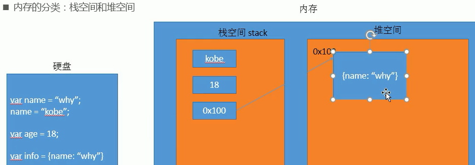
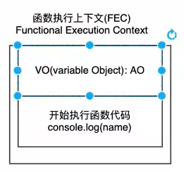
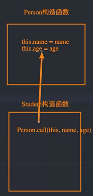
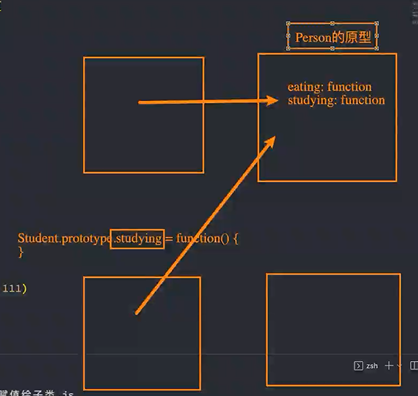

# JavaScript

## 计算机基础

### 数据存储

计算机内部使用**二进制 0 和 1**来表示数据；

所有**数据**，包括文件、图片等最终都是以二进制数据（0 和 1）的形式存放在**硬盘**中的；

所有**程序**，包括操作系统，**本质都是各种数据**，也以二进制数据的形式存放在硬盘中；

平时我们所说的安装软件，其实就是把程序文件复制到硬盘中；

**硬盘、内存**都是保存的二进制数据；

### 数据存储单位

```
大小关系：bit < byte < kb < GB < TB<.....
```

- 位(bit)： 1bit 可以保存一个 0 或者 1 （最小的存储单位）
- 字节(Byte)：1B = 8b
- 千字节(KB)：1KB = 1024B
- 兆字节(MB)：1MB = 1024KB
- 吉字节(GB): 1GB = 1024MB
- 太字节(TB): 1TB = 1024GB

### 程序运行

计算机运行软件的过程：

打开某个**程序**时，先从**硬盘**中把程序的代码加载到**内存**中；

**CPU**执行内存中的代码；

之所以要内存的一个重要原因，是因为 **cpu 运行太快**了，如果只从硬盘中读数据，会**浪费 cpu 性能**；

所以，才使用存取速度更快的**内存**来保存运行时的数据；

## 初识 JavaScript

### 是什么

- 起源：**网景公司**，由**Brendan Eich**设计出，本来叫**liveScript**，后来为了**蹭热度**改成 JavaScript
- 当时微软也推出一门语言叫 JScript
- JavaScript 成为了 ECMAScript 最著名的实现之一（ECMAScript 是一种语言标准）
- 中国也有自己设计的语言--**易语言**（写外挂）
- JavaScript 是世界上最流行的语言之一，是一种运行在客户端的脚本语言 （Script 是脚本的意思）
- 现在也可以基于 Node.js 技术进行服务器端编程

### 特点

- 它是一种解释型语言，一行行读取，一行行执行（而编译型语言是一次性编译完，在执行）
- 同时它也是一门动态类型语言，可以在执行过程中改变变量的类型，灵活但不安全（静态类型的变量不能改类型）
- 后来推出 TypeScript，提供了类型检测

### 作用

- 表单动态校验（密码强度检测） （ JS 产生最初的目的 ）
- 网页特效
- 服务端开发(Node.js)
- 桌面程序(Electron)（而 Vscode 是由 ts 开发的，然后 ts 转换成 js ）
- App(Cordova)
- 控制硬件-物联网(Ruff)
- 游戏开发(cocos2d-js)

### 编写位置

- **在 HTML 元素中直接执行 js 代码**

  ```html
  <a href="" onClick="alert(123)"></a>
  ```

  ```html
  <a href="javascript:alert(123)"></a>
  ```

  **但是这种写法不推荐**

- **写到 script 标签中**

- **从外部引入 js 文件**（script 的 src 属性引入）

以前代码中 script 标签还会使用 type="text/javascript"属性，现在省略了，因为 js 是所有现代浏览器以及 HTML5 的**默认脚本**啦（以前还有其他脚本语言）

**推荐把 js 放在 body 元素的最后一个子元素**（写在前面的话有些 DOM 节点还没加载出来，可能造成不必要的错误）

注意：

**js 严格区分大小写**（而 HTML 和 css 不区分）

### 2.5 js 与浏览器的交互

- **浏览器弹出窗口**

  `alert()`

- **在控制台打印**

  `console.log()`

- **DOM 操作时**

  `document.write("<h2>hhh</h2>")`

- **接收用户输入**

  `var age = prompt("提示")`

  `console.log(age)// 18`

### 2.6 浏览器执行 JS

**浏览器分成两部分：渲染引擎和 JS 引擎**

```
	浏览器本身并不会执行JS代码，而是通过内置 JavaScript 引擎(解释器) 来执行 JS 代码 。JS 引擎执行代码时逐行解释每一句源码（转换为机器语言），然后由计算机去执行，所以 JavaScript 语言归为脚本语言，会逐行解释执行。
```

### 2.7 组成

1.  #### **ECMAScript**

        ECMAScript 是由ECMA 国际（ 原欧洲计算机制造商协会）进行标准化的一门编程语言，这种语言在万维网上应用广泛，它往往被称为 JavaScript或 JScript，但实际上后两者是 ECMAScript 语言的实现和扩展。

    ECMAScript：规定了**JS 的编程语法**和**基础核心知识**，是所有**浏览器厂商**共同遵守的一套 JS 语法工业标准。

    更多参看 MDN: [MDN 手册](https://developer.mozilla.org/zh-CN/docs/Web/JavaScript/JavaScript_technologies_overview)

2.  #### **DOM——文档对象模型**

    **文档对象模型**（DocumentObject Model，简称 DOM），是 W3C 组织推荐的处理可扩展标记语言的标准编程接口。**通过 DOM 提供的接口**可以对页面上的各种**元素**进行操作（大小、位置、颜色等）

3.  #### **BOM——浏览器对象模型**

    **浏览器对象模型**(Browser Object Model，简称 BOM) 是指浏览器对象模型，它提供了独立于内容的、可以与浏览器窗口进行互动的对象结构。**通过 BOM 可以操作浏览器窗口**，比如弹出框、控制浏览器跳转、获取分辨率等。

## JavaScript 注释

### 单行注释

单行注释的注释方式如下：

```html
// 我是一行文字，不想被 JS引擎 执行，所以 注释起来
```

```
// 用来注释单行文字（  快捷键   ctrl  +  /   ）
```

### 多行注释

多行注释的注释方式如下：

```html
/* 获取用户年龄和姓名 并通过提示框显示出来 */
```

```
/* */  用来注释多行文字（ 默认快捷键  alt +  shift  + a ）
```

**快捷键修改**为： ctrl + shift + /

vscode → 首选项按钮 → 键盘快捷方式 → 查找 原来的快捷键 → 修改为新的快捷键 → 回车确认

### 文档注释

用于提示其它开发人员某个函数的参数、返回值、功能

```js
/**
 *提示文本
 */
```

## 变量

### 为什么需要变量？

**保存和复用**

### 什么是变量？

白话：变量就是一个装东西的盒子。

通俗：变量是用于存放数据的容器。 我们通过 变量名 获取数据，甚至数据可以修改。

### 变量存储的本质

打开某个**程序**时，先从**硬盘**中把程序的**代码**加载到**内存**中

**而内存分两类：**

- 栈空间 stack
- 堆空间

**基本数据类型**都是放在**栈空间**里的

而**引用数据类型**都是放**堆空间**里的



​ **本质**：**变量**是**程序**在**内存中**申请的一块用来**存放数据的空间**。类似我们酒店的房间，一个房间就可以看做是一个变量。

### 命名规范

**规则：**

- 由**字母 A-Za-z**、**数字 0-9**、**下划线\_**、**美元符号$**组成，如：usrAge, num01, \_name；
- 严格**区分大小写**，var app; 和 var App; 是两个变量；
- **不能 以数字开头**， 18age 是错误的；
- 不能 是**关键字、保留字**。例如：var、for、while；
- 变量名必须**有意义**， MMD BBD nl → age ；
- 遵守**驼峰命名法**。首字母小写，后面单词的首字母需要大写。myFirstName

**推荐翻译网站： 有道 爱词霸**

具体可以去官方 MDN 文档查看

### 标识符

标识符：就是指开发人员为**变量、属性、函数、参数**取的名字。

标识符不能是关键字或保留字。

### 关键字

关键字：是指 JS 本身**已经使用**了的字，不能再用它们充当变量名、方法名。

包括：break、case、catch、continue、default、delete、do、else、finally、for、function、if、in、instanceof、new、return、switch、this、throw、try、typeof、var、void、while、with 等。

### 保留字

保留字：实际上就是预留的“关键字”，意思是现在虽然还不是关键字，但是未来可能会成为关键字，同样不能使用它们当变量名或方法名；

包括：boolean、byte、char、class、const、debugger、double、enum、export、extends、fimal、float、goto、implements、import、int、interface、long、mative、package、private、protected、public、short、static、super、synchronized、throws、transient、volatile 等。

注意：如果将保留字用作变量名或函数名，那么除非将来的浏览器实现了该保留字，否则很可能收不到任何错误消息。当浏览器将其实现后，该单词将被看做关键字，如此将出现关键字错误。

## 数据类型

### 为什么需要数据类型？

在计算机中，不同的数据所需占用的存储空间是不同的，为了便于把数据分成所需内存大小不同的数据，充分利用存储空间，于是定义了不同的数据类型；

简单来说，数据类型就是数据的类别型号。比如姓名“张三”，年龄 18，这些数据的类型是不一样的；

**数据类型的分类**

- 基本数据类型

  **Number**

  **String**

  **Boolean**

  **Undefined**

  **Null**

- 复杂数据类型

  **object**

### 基本数据类型

#### 数值型 **Number**

JavaScript 数字类型既可以保存整数，也可以保存小数(浮点数）。

```js
const age = 21; // 整数
const Age = 21.3747; // 小数
```

#### **进制**

在 JS 中**8 进制前面加 0**，**16 进制前面加 0x**

#### **数值型范围**

- 最大值：**Number.MAX_VALUE**，这个值为： 1.7976931348623157e+308

- 最小值：**Number.MIN_VALUE**，这个值为：5e-32

#### **三个特殊值**

- **Infinity** ，代表无穷大，大于任何数值

- **-Infinity** ，代表无穷小，小于任何数值

- **NaN** ，Not a number，js 中当对数值进行计算时没有结果返回，则返回 NaN

#### **isNaN**

用来判断一个变量是否为非数值类型，返回 true 或者 false

```js
const usrAge = 21;
console.log(isNaN(userAge)); // false
```

### 字符型 String

字符串型可以是引号中的任意文本，其语法为 **双引号 ""** 和 **单引号''**

```js
const strMsg = "我爱北京天安门~";
```

因为 HTML 标签里面的属性使用的是双引号，JS 这里我们更推荐使用单引号。

#### 字符串引号嵌套

外单内双

```js
const strMsg = '我是"高帅富程序猿'; // 我是"高帅富程序猿
```

#### 字符串转义符

类似 HTML 里面的特殊字符，字符串中也有特殊字符，我们称之为转义符。

| 转义符 | 解释说明                    |
| ------ | --------------------------- |
| \n     | 换行符，n 是 newline 的意思 |
| \ \    | 斜杠 \                      |
| \\'    | ' 单引号                    |
| \\"    | ”双引号                     |
| \t     | tab 缩进                    |
| \b     | 空格 ，b 是 blank 的意思    |

#### 字符串长度.length

```js
const strMsg = "我是帅气多金的程序猿！";
alert(strMsg.length); // 显示 11
```

#### 字符串拼接

**+ 号总结口诀：数值相加 ，字符相连**

### 布尔型 Boolean

布尔类型有两个值：true 和 false ，其中 true 表示真（对），而 false 表示假（错）;

布尔型和数字型相加的时候， true 的值为 1 ，false 的值为 0;

```js
console.log(true + 1); // 2
console.log(false + 1); // 1
```

### Undefined 和 Null

一个**声明后没有被赋值**的变量会有一个默认值是**undefined**

但是**转化成数字**时，**undefined 为 NaN，null 为 0**

```js
const variable;
console.log(variable);           // undefined
console.log('你好' + variable);  // 你好undefined
console.log(11 + variable);     // NaN
console.log(true + variable);   //  NaN
```

一个声明变量给 null 值，里面存的值为空（学习对象时，我们继续研究 null)

```js
const vari = null;
console.log("你好" + vari); // 你好null
console.log(11 + vari); // 11
console.log(true + vari); //  1
```

undefined 值实际上是由 null 值衍生出来的，所以如果**比较 undefined 和 null 是否相等时，返回 true**

```js
console.log(undefined == null); // true
```

### 判断数据类型

如何获取变量的数据类型?

**typeof** 操作符（也可以用**typeof()**这种格式）

```js
const num = 18;
console.log(typeof num); //number
```

**缺点**

- 判断**Array、Object、null**或**其它对象**得出的结果都是 'object'；

**instanceof**（原型链检测）

检测某个**实例对象**的原型链上是否出现**构造函数**的 **`prototype` 属性**;

```js
function C() {}
const o = new C();
o instanceof C; // true，因为 Object.getPrototypeOf(o) === C.prototype
```

**Object.prototype.toString.call()**

- Object.prototype.toString()返回的是调用者的类型；

- 而 call()可以改变 this 指向，使得可以判断传入数据的类型；

### 数据类型转换

**使用表单、prompt 获取过来的数据默认是字符串类型的**，此时就不能直接简单的进行加法运算，而需要转换变量的数据类型。

通常会实现 3 种方式的转换：

- 转换为字符串类型
- 转换为数字型
- 转换为布尔型

### 转换为数字型

- Number(其它类型)
- parseInt（字符串类型）转成整型
- parseFloat（字符串类型）转成浮点型

#### **将 string 转换成数值型**

**Number()**

```js
const message1 = "123"
const num1 = Number(message1)
console.log(typeoof num1)// 123

const message2 = "abc"
const num2 = Number(message2)
console.log(typeoof num2)// NaN
```

注意：**Number()**虽然可以将字符串转化成数字类型，但只限于能转化成数字类型的如"123"，而转化**"abc"**,会返回**NaN**，虽然类型转化成功了，但是**abc 不是数值**，所以返回**NaN**这种特殊的数值类型

**parseInt(string, radix)**函数

只要找到一个**非数值类型**的就停止解析并返回**NaN**

如果**数字在前**，有多少数字就转换多少

```js
parseInt("123.33"); // 123
```

```js
parseInt("123ab"); // 123
parseInt("ab123"); // NaN
```

**parseFloat()**函数

只要找到第一个小数点，后面不解析了

```js
parseFloat("123.33"); // 123.33
parseFloat("123.33.12"); // 123.33
```

#### **将 Boolean 转换成数值类型**

**Number()**

- false 0
- true 1

#### **将 undefined 转换成数字类型**

**Number()**

NaN

#### **将 null 转换成数字类型**

**Number()**

0

注意 parseInt 和 parseFloat 单词的大小写

- 隐式转换是我们在进行算数运算的时候，JS 自动转换了数据类型

- 转换为布尔型

  - 代表空、否定的值会被转换为 false ，如 ''、0、NaN、null、undefined

  - 其余值都会被转换为 true

```js
console.log(Boolean("")); // false
console.log(Boolean(0)); // false
console.log(Boolean(NaN)); // false
console.log(Boolean(null)); // false
console.log(Boolean(undefined)); // false
console.log(Boolean("小白")); // true
console.log(Boolean(12)); // true
```

### 转化成字符串类型

- **变量.toString()**
- **String(变量)**
- **字符串拼接**(变量 + "")(**隐式转换**，**其他数据类型**通过**+运算符**进行拼接时，会**自动**转换成**字符串类型**)

```js
const num = 123;
const obj = null;
const msg = undefined;
const flag = true;
num.toString(); //"123"
obj.toString(); //不适用
msg.toString(); //不适用
flag.toString(); //"true"
```

null 和 undefined 没有 toString()方法

```js
const num = 123;
const obj = null;
const msg = undefined;
const flag = true;
String(num); //"123"
String(obj); //"null"
String(msg); //"undefined"
String(flag); //"true"
```

```js
const num = 123;
const obj = null;
const msg = undefined;
const flag = true;
num + ""; // "123"
obj + ""; // "null"
msg + ""; // "undefined"
flag + ""; // "true"
```

### 转换成布尔类型

**Boolean()**

除了这五种常见特殊值

- **""**(空字符串)
- **0**(或者-0)
- **undefined**
- **null**
- **NaN**

返回**false**

其它值返回**true**

## 运算符

**运算符**（operator）也被称为操作符，是用于实现**赋值**、**比较**和**执行算数运算**等功能的符号。

JavaScript 中常用的运算符有：

- **算数**运算符
- **递增和递减**运算符
- **比较**运算符
- **逻辑**运算符
- **赋值**运算符

### 算数运算符

- 算术运算符概述

  概念：算术运算使用的符号，用于执行两个变量或值的算术运算。

- **浮点数的精度问题**

  浮点数值的最高精度是 17 位小数，但在进行算术计算时其精确度远远不如整数。

```js
const result = 0.1 + 0.2; // 结果不是 0.3，而是：0.30000000000000004
console.log(0.07 * 100); // 结果不是 7，  而是：7.000000000000001
```

**所以：不要直接判断两个浮点数是否相等 !**

### 自增和自减运算符

- 前置自增运算符

**先自加，后返回值**

```js
const num = 10;
alert(++num + 10); // 21
```

- 后置自增运算符

**先返回原值，后自加**

```js
const num = 10;
alert(10 + num++); // 20
```

### （关系）比较运算符

- 等号比较

```js
console.log(18 == "18"); //true，默认转换类型
console.log(18 === "18"); //false，一模一样才行
```

**==** 当两边**类型不一样**时，会进行**隐式转换**，转换成相同类型再进行值的比较，而隐式转换时**转左边还是转右边呢？**，查**MDN**（很多情况）

### 逻辑运算符

- 逻辑与**&&**

  两边都是 true 才返回 true，否则返回 false

- 逻辑或 **||**

  只要有一边是 true 就返回 true

- 逻辑非 **！**

  逻辑非（!）也叫作取反符，用来取一个布尔值相反的值，如 true 的相反值是 false

  ```js
  const isOk = !true;
  console.log(isOk); // false
  ```

  **&& 特殊用法**：当访问了对象不存在的成员（如某个函数）时，要这样写 `a.eat && a.eat()`，等价于

  ```js
  if (a.eat) {
    a.eat();
  }
  ```

  如果不这么做，那 js 会**报错**，**不会执行后面的代码**，因为 js 是**解释型语言**，读一行执行一行

  这叫**短路与**，有**一个条件为 false**就不做后续判断

  **|| 特殊用法** ：当需要从多个变量中取一个能用的时，可以这样

  ```js
  const a = b || c || d;
  ```

  这叫**短路或**，只要**有一个条件为 true**就不做后续判断

### 赋值运算符

```js
const age = 10;
age += 5; // 相当于 age = age + 5;
age -= 5; // 相当于 age = age - 5;
age *= 10; // 相当于 age = age * 10;
```

### 优先级

有张表，**（）**很高

## js 执行顺序

- 顺序
- 分支
- 循环

**代码块** 多行代码的集合。放**{}**里

### 顺序

### 分支

- if
- switch

**if**

- 有简写的**三元表达式**`表达式1? : 表达式2: 表达式3`（只有 3 个元素）
- if()**括号**里边的值会进行**隐式转换**成**Boolean 类型**

**switch**

```js
switch (表达式) {
  case value1:
    // 表达式 等于 value1 时要执行的代码
    break;
  case value2:
    // 表达式 等于 value2 时要执行的代码
    break;
  default:
  // 表达式 不等于任何一个 value 时要执行的代码
}
```

如果所有的 case 的值都和表达式的值不匹配，则执行 default 里的代码

**注意： 执行 case 里面的语句时，如果没有 break，则继续执行下一个 case 里面的语句**，这叫**case 穿透**

switch 语句和 if else if 语句的区别

**当分支比较少时，if… else 语句的执行效率比 switch 语句高。**

**当分支比较多时，switch 语句的执行效率比较高，而且结构更清晰。**

### 循环

### for 循环

```js
for (初始化变量; 条件表达式; 操作表达式) {
  //循环体
}
```

执行过程：

1. **初始化变量**，初始化操作在整个 for 循环只会执行一次。**执行条件表达式，如果为 true，则执行循环体语句**，否则退出循环，循环结束。
2. 执行操作表达式，此时第一轮结束。
3. 第二轮开始，直接去**执行条件表达式**（**不再初始化变量**），如果为 true ，则去执行循环体语句，否则退出循环。
4. 继续执行操作表达式，第二轮结束。
5. 后续跟第二轮一致，直至条件表达式为假，结束整个 for 循环。

**for 循环嵌套**

打印五行五列星星

```js
let star = "";
for (let j = 1; j <= 3; j++) {
  for (var i = 1; i <= 3; i++) {
    star += "☆";
  }
  // 每次满 5个星星 就 加一次换行
  star += "\n";
}
console.log(star);
```

核心逻辑：

1.内层循环负责一行打印五个星星

2.外层循环负责打印五行

### while 循环

```js
while (条件表达式) {    // 循环体代码 }
```

执行思路：

**先执行条件表达式，执行循环体代码**

注意：

**必须要有退出条件**，否则会成为**死循环**

**do-while**

```js
do {
    循环体代码 - 条件表达式为 true 时重复执行循环体代码
} while(条件表达式);
```

**先再执行循环体，再判断**，

### continue、break

continue 关键字用于立即**跳出本次**循环，**执行下一次**循环

break 关键字用于**立即跳出整个循环**（循环结束）。

### **断点调试**

断点调试可以帮助**观察**程序的**运行过程**

**技巧：**当需要在**多个文件**中找要调试的文件，可以在**要调试的文件**里代码的某一**空行**写上 `debugger` 这样调试时浏览器会**自动**帮你找到你要调试的文件

**流程：**
浏览器中按 **F12**--> **sources** -->找到需要调试的文件-->在程序的**某一行**设置断点（**鼠标左键**） --> **刷新网页** -->**鼠标**移动到需要观察的**变量**上

或者在**Watch**里输入想要观察的**变量**，通过 watch 可以监视变量的值的变化，非常的常用。

摁下**F11**（或者点击**第二个图标**），程序**单步执行**，让程序一行一行的执行，这个时候，观察 watch 中变量的值的变化。

**第一个图标** 跳过当前断点，执行下一个断点，如果没有下一个断点，程序运行结束

## 代码规范

### 标识符命名规范

- **见名知义**
- **变量**的名称一般用**名词**
- **函数**的名称一般用**动词**

### 操作符规范

操作符的**左右两侧**各保留**一个空格**

```js
// 操作符的左右两侧各保留一个空格
for (let i = 1; i <= 5; i++) {
  if (i == 3) {
    break; // 直接退出整个 for 循环，跳到整个for循环下面的语句
  }
  console.log("我正在吃第" + i + "个包子呢");
}
```

### 单行注释规范

单行注释前面注意有个空格

```js
for (let i = 1; i <= 5; i++) {
  if (i == 3) {
    break; // 单行注释前面注意有个空格
  }
  console.log("我正在吃第" + i + "个包子呢");
}
```

### 其他规范

关键词、操作符之间后加空格

## 数组

**为什么需要数组这种数据结构？**

- 保存大量数据
- 虽然 js 可以放**不同类型**数据进数组，但**建议**数组中**同类型**，因为在真实开发中，往往需要**对数组元素进行统一处理**，比如要对数组元素按**字符串的方式**处理，但某个元素是**数值型**，可能**不支持**这种处理方式，这样的话会造成意外的麻烦

### 创建数组

JS 中创建数组有两种方式：

- 使用 **Array 对象**

  ```js
  var arr = new Array(); // 创建一个新的空数组
  ```

- 利用数组**字面量**

  ```js
  var  数组名 = []；
  var  数组名 = ['小白','小黑','大黄','瑞奇'];
  ```

### 数组常见操作

### 获取长度

`数组.length`

### 获取元素

**获取某个位置的元素**

索引值

```js
// 定义数组
var arrStus = [1, 2, 3];
// 获取数组中的第2个元素
alert(arrStus[1]);
```

**注意：**

- 如果访问时数组**不存在**的**索引值**，不会报错，得到的值是**undefined**
- **js 数组**索引值**不支持负数**

### 遍历

又叫**迭代**

- 使用**for 循环**
- 数组**高阶函数**

### 新增元素

数组中可以通过以下方式在数组的末尾插入新元素：

```js
数组[数组.length] = 新数据;
```

### 合并

## 高阶函数

支持链式调用

### every()

测试一个数组内**所有元素**是否能通过**某个指定函数的测试**;

**返回值：**

一个布尔值

```js
const isBelowThreshold = (currentValue) => currentValue < 40;
const array1 = [1, 30, 39, 29, 10, 13];
console.log(array1.every(isBelowThreshold)); // true
```

### some()

测试数组中是不是**至少有 1** 个元素通过了被提供的**函数测试**

**返回值：**

一个布尔值

```js
const array = [1, 2, 3, 4, 5];

// checks whether an element is even
const even = (element) => element % 2 === 0;

console.log(array.some(even));
// expected output: true
```

### filter()

**返回值**：

一个**新的、符合条件**的元素组成的**数组**；

如果没有任何数组元素通过测试，则返回**空数组**；

```js
// 需求：取出小于100的数字
// 10 20 40 50
const nums = [10, 20, 111, 222, 444, 40, 50];

let newNums = num.filter(function (n) {
  return n < 100;
});
```

### map()

**返回值：**

一个由原数组每个元素执行回调函数的结果组成的**新数组**

```js
// 需求: 使数组里每一个元素乘以2得到一个新数组
// 20 40 80 100
let new2Num = newNum.map(function (n) {
  return n * 2;
});
```

### reduce()

**应用场景**

需要利用**上一次处理结果**当下一次操作元素

```js
// 需求：将新数组求和
// new2Num 20 40 80 100
let total = new2Num.reduce(function (preValue, n) {
  return preValue + n;
}, 0);
// 一开始：preValue--0，n--20
// 第1次：preValue--0+20，n--40
// 第2次：preValue--0+20+40，n--80
// 第3次：preValue--0+20+40+80，n--100
// 第4次：preValue--0+20+40+80+100
// 240
```

**需求汇总：取出小于 100 的元素，并将他们\*2 并求和**

链式调用

```js
const nums = [10, 20, 111, 222, 444, 40, 50];

let total = nums
  .filter(function (n) {
    return n < 100;
  })
  .map(function (n) {
    return n * 2;
  })
  .reduce(function (pre, n) {
    return pre + n;
  }, 0);
```

箭头函数写法

```js
const nums = [10, 20, 111, 222, 444, 40, 50];

let total = nums
  .filter((n) => n < 100)
  .map((n) => n * 2)
  .reduce((pre, n) => pre + n);
```

### forEach()

**返回值：**

总是返回 undefined，所以**不支持链式调用**，一般是放在一个调用链的**最后**执行副作用；

不会**直接改变**调用它的对象，但是那个对象可能会被 `callback` 函数改变；

除了抛出异常以外，没有办法**中止或跳出** `forEach()` 循环；

```js
const array1 = ["a", "b", "c"];
array1.forEach((element) => console.log(element));
// expected output: "a"
// expected output: "b"
// expected output: "c"
```

### 总结

|  函数   |                                                    应用案例                                                    | 区别、注意事项 |
| :-----: | :------------------------------------------------------------------------------------------------------------: | :------------: |
| every() |                                       检测所有元素的的大小（全体性检查）                                       |  可以中断遍历  |
| some()  |             1.判断数组中是否存在某个值（存在判断）；<br />2.将任意值转化为布尔值（转化为布尔值）；             |                |
|  map()  | 1.格式化数组中的对象（格式化）；<br />2.获取字符串中每个字符所对应的 ASCII 码组成的数组（字符串的 ASCLL 码）； |  不可中断遍历  |

**存在判断**

```js
const fruits = ["apple", "banana", "mango", "guava"];
function checkAvailability(arr, val) {
  return arr.some((arrVal) => val === arrVal);
}
checkAvailability(fruits, "kela"); // false
checkAvailability(fruits, "banana"); // true
```

**转化为布尔值**

```js
const TRUTHY_VALUES = [true, "true", 1];
function getBoolean(value) {
  if (typeof value === "string") {
    value = value.toLowerCase().trim();
  }
  return TRUTHY_VALUES.some((t) => t === value);
}
getBoolean(false); // false
getBoolean("false"); // false
getBoolean(1); // true
getBoolean("true"); // true
```

**全体性检查**

```js
function isBigEnough(element, index, array) {
  return element >= 10;
}
[12, 5, 8, 130, 44].every(isBigEnough); // false
[12, 54, 18, 130, 44].every(isBigEnough); // true
```

**格式化**

```js
const kvArray = [{key: 1, value: 10},
               {key: 2, value: 20},
               {key: 3, value: 30}];
const reformattedArray = kvArray.map(function(obj) {
   cosnt rObj = {};
   rObj[obj.key] = obj.value;
   return rObj;
});

// reformattedArray 数组为： [{1: 10}, {2: 20}, {3: 30}],

// kvArray 数组未被修改：
// [{key: 1, value: 10},
//  {key: 2, value: 20},
//  {key: 3, value: 30}]

```

**字符串的 ASCLL 码**

```js
const map = Array.prototype.map;
const a = map.call("Hello World", (x) => x.charCodeAt(0));
console.log(a);
// a 的值为 [72, 101, 108, 108, 111, 32, 87, 111, 114, 108, 100]
```

## 常用方法

### join()

将一个数组（或一个[类数组对象](https://developer.mozilla.org/zh-CN/docs/Web/JavaScript/Guide/Indexed_collections#working_with_array-like_objects)）的所有元素连接成一个**字符串**并返回这个字符串;

如果数组只有一个元素，那么将返回该项目而不使用**分隔符**;

如果缺省该值，数组元素用逗号（`,`）分隔；

如果`separator`是空字符串 (`""`)，则所有元素之间都没有任何字符；

如果一个元素为 `undefined` 或 `null`，它会被转换为空字符串；

**返回值：**

一个所有数组元素连接的字符串。如果 `arr.length` 为 0，则返回空字符串；

```js
const elements = ["Fire", "Air", "Water"];
console.log(elements.join());
// expected output: 'Fire,Air,Water'
console.log(elements.join(""));
// expected output: 'FireAirWater'
console.log(elements.join("-"));
// expected output: 'Fire-Air-Water'
```

### reverse()

```

```

# 作用域

## 提升原理（早期 ECMA）

### 作用域

当前的**执行上下文**，值和表达式在其中“可见”或可被访问；

子作用域可以访问父作用域；

在 es6 之前，只有这几种作用域：

- 全局作用域
- 函数作用域
- with 语句形成的

es6 之后，引进**块级作用域**（let const 声明所在的块，如 if 语句，for 循环等，块外无法访问）

**为什么会出现变量\函数提升？**

这与全局代码执行过程有关

### 全局代码执行过程

例如这段代码

```js
var name1 = 20;
var name2 = 30;
var res = name1 + name2;
```

#### 1.代码被解析

v8 引擎内部会帮助我们创建一个**全局对象**（GlobalObject->GO）

并且会将这些**全局变量**放到该**全局对象**中，还未进行赋值操作

```js
var name1 = 20
var name2 = 30
var res = name1 + name2

var globalObject = {
    String: '类',
    Date: '类',
    setTimeout: "函数"
    window: this,
    name1: undefined,
    name2: undefined,
    res: undefined
}
```

#### 2.运行代码

为了执行代码，v8 引擎内部会有一个**执行上下文 execute context stack**（函数调用栈）；

而我们执行的是全局代码，为了全局代码能够正常执行，需要创建**全局执行上下文**（Global Execution context）（全局代码需要被执行时才会被创建）；

而**全局执行上下文**里面有个 variable object（VO）指向的是 GO；

开始执行代码；

**作用域提升**的原理就是这样：

**name1、name2、res**一开始被放进了**全局对象 GO**，并且值都为**undefined**，此时代码还未执行（编译阶段）；

然后**执行**代码，为他们分别赋值；

要是在执行代码之前前想获取他们的值，只会是 undefined；

**变量是这样提升的，那函数呢？**

### 函数执行过程

```js
var name = 'zsf'
foo(123)
function (num) {
    console.log(m)
    var m = 10
    var n = 20
}
```

同样，解析到函数时，会在调用栈里创建一个**函数执行上下文**（FEC），FEC 包含 2 部分：

- VO：指向 AO
- 执行代码

然后将**num、m、n 变量**放到**AO 对象**中，并赋值为 undefined

**执行代码**后才会给 num、m、n**赋值**

在此之前打印会是**undefined**



### 作用域链

**查找**一个**变量**时，真实的查找路径是**沿着作用域链**找的

```js
var name = 'zsf'
foo(123)
function (num) {
    console.log(m)
    var m = 10
    var n = 20
    console.log(name)//zsf
}
```


其实 AO 有两部分组成：

- AO 本身
- 父级作用域（这里是 GO）

**当在 AO 里面找不 name 时，会去 GO 里找**

父级作用域在**编译时**已经确定了,与**定义时**位置有关系，而与**调用时**位置没有关系

当**函数里嵌套函数**同理

```js
var name = 'zsf'
foo(123)
function (num) {
    console.log(m)
    var m = 10
    var n = 20
    function bar() {
        console.log(name)
    }
    bar()//zsf
}
```


函数**执行完**对应的**FEC**就会**弹出栈**

### 面试题

```js
var n = 100;
function bar() {
  n = 200;
}
bar();
console.log(n); //200
```

```js
function foo() {
  console.log(n); //undefined
  var n = 200;
  console.log(n); //200
}
var n = 100;
foo();
```

```js
var a = 100;
function bar() {
  console.log(a); //undefined
  return;
  var a = 10;
}
bar(); // return是执行阶段的，编译阶段依然会有a:undefined放VO中
```

## this

### 为什么需要 this？

没有 this，平常写代码很不方便，拷贝一个对象时，很多地方可能都需要修改

### this 的指向

与函数**定义时位置**无关，与**函数调用时位置**有关

```js
function foo() {
  console.log(this);
}
// 1.直接调用这函数
foo(); //window对象

var obj = {
  name: "zsf",
  fn: foo,
};
// 2.创建一个对象，对象中的函数指向foo
obj.fn(); //obj对象
// 3.apply调用
foo.apply("123"); //String对象
```

### 绑定规则

#### 默认绑定

**独立函数**调用，指向 window

函数调用时没有调用主体

```js
function foo() {
  console.log(this);
}

foo(); //window对象
```

```js
var obj = {
  name: "zsf",
  fn: function foo() {
    console.log(this);
  },
};

var bar = obj.fn;
bar(); //window,依然没有调用主题
```

#### 隐式绑定

v8 引擎绑定的

函数通过**某个对象**进行调用的，this 绑定的就是该对象

**前提条件：**

- 必须在**调用的对象内部**有一个**对函数的引用**（比如一个**属性**）
- 如果没有这样的引用，在进行调用时，会报找不到该函数的错误
- 正是通过**这个引用**，**间接**的将 this 绑定到了这个对象上

```js
var obj = {
  name: "zsf",
  fn: function foo() {
    console.log(this);
  },
};
obj.fn(); //obj对象
```

```js
var obj1 = {
  name: "zsf",
  fn: function foo() {
    console.log(this);
  },
};
var obj2 = {
  name: "obj2",
  fn: obj1.fn,
};

obj2.fn(); // obj2
```

#### 显式绑定

如果不希望在**对象内部**包含这个函数的引用，同时又希望在这个对象上进行**强制调用**，怎么做？

**每个函数**对象都有这 2 个方法

- call()
- apply()
- bind()

```js
function foo() {
  console.log("被调用了", this);
}
// 直接调用和call()/apply()调用的区别在于this绑定不同
// 直接调用this指向window
foo();
// call()/apply()调用会指定this绑定对象
var obj = {
  name: "obj",
};
foo.call(obj); //obj
foo.apply(obj); //obj
foo.apply("aaa"); //aaa
```

直接调用和 call()/apply()调用的区别在于**this 绑定不同**：

- 直接调用 this**指向 window**
- call()/apply()调用会**指定 this 绑定对象**

#### call 和 apply 的区别

传参方式不同，call 接收**多个参数是以逗号分开**，而**apply**会将多个**参数放数组**里

```js
function sum(num1, num2) {
  console.log(num1 + num2, this);
}

foo.call("call", 20, 30);
foo.apply("qpply", [20, 30]);
```

**bind 的显示绑定**

```js
function foo() {
  console.log(this);
}
foo.call("aaa");
foo.call("aaa");
foo.call("aaa");
foo.call("aaa");
```

等价于

```js
function foo() {
  console.log(this);
}
// 隐式绑定和显式绑定冲突了，根据优先级，显式绑定
var newFoo = foo.bind("aaa");
newFoo(); // aaa
```

bind 绑定之后会生成一个**新的函数**返回

#### new 绑定

js 中的**函数**可以当做一个**类的构造函数**来使用，也就是使用**new**关键字

```js
function Person(name, age) {
  this.name = name;
  this.age = age;
}

var p1 = new Person("zsf", 18);
console.log(p1); // Person
```

通过一个**new**关键字**调用函数**时（构造器），这个时候**this**是在**调用这个构造器时创建**出来的，并且**this = 创建出来的对象**

### 规则之外

#### 忽略显式绑定

```js
function foo() {
  console.log(this);
}

foo.call(null); // window
foo.call(undefined); // window
```

call、apply、bind 当传入参数为**null 或 undefined**时，自动将**this 绑定到 window 对象**

#### 间接函数引用

```js
var obj1 = {
  name: 'obj1',
  foo: function () {
    console.log(this)
  }
}

var obj2 = {
  name: 'obj2'
  bar: null
};

(obj2.bar = obj1.foo)()// 独立函数调用，window， 为啥
(obj1.foo)()//报错，为啥
```

这属于**独立函数调用**（无等号就是**隐式绑定**）

#### 箭头函数

#### 基础语法

箭头函数**不会绑定 this、arguments**属性

箭头函数**不能作为构造函数**来使用（不能和 new 关键字一起使用）

- ()
- =>
- {}

**简写：**

- 只有一个参数可以**省()**
- 只有一行执行提可以**省{}**,并且会将该行代码**当结果返回**
- 执行体只有一行且返回的是一个对象,**小括号()括起来**

```js
var nums = [1, 2, 3];
nums.forEach((item) => {
  console.log(item);
});
```

```js
var nums = [1, 2, 3];
nums.filter((item) => item % 2 === 0);
```

```js
var bar = () => ({ name: "zsf", age: 18 });
```

#### 规则

箭头函数**不绑定 this**，而是根据**外层作用域**来决定 this

```js
var foo = () => {
  console.log(this);
};

foo(); //window

var obj = {
  fn: foo,
};
obj.fn(); //window

foo.call("abc"); //window
```

**这样有什么应用呢？**

在箭头函数出来**之前**

```js
var obj = {
  data: [],
  getDate: function () {
    // 发送网络请求，将结果放上面的data属性中
    var _this = this;
    setTimeout(function () {
      var result = ["abc", "bbv", "ccc"];
      _this.data = result;
    }, 2000);
  },
};
// 由于这里的隐式绑定，第5行的this绑定了obj对象。才有了，第8行的写法
obj.getDate();
```

箭头函数出来**之后**

```js
var obj = {
  data: [],
  getDate: function () {
    // 发送网络请求，将结果放上面的data属性中
    setTimeout(() => {
      var result = ["abc", "bbv", "ccc"];
      this.data = result;
    }, 2000);
  },
};
obj.getDate();
```

箭头函数**不绑定 this**，相当于**没有 this**，会寻找**上层作用域**寻找 this;

也就是在**getData 的作用域**里找 this，而**obj.getData**已经**隐式绑定了 getData 里的 this**指向**obj**

### 一些函数的 this 分析

**setTimeout**

```js
setTimeout(function () {
  console.log(this); //window
}, 1000);
```

setTimeout 内部使用的**独立函数调用**，所以**this 默认绑定 window 对象**

### 规则优先级

- 默认最低
- 显式高于隐式
- new 高于隐式
- new 高于显式

```js
var obj = {
  name: "obj",
  fn: function foo() {
    console.log(this);
  },
};

obj.fn.call("abc"); //abc
```

```js
function foo() {
  console.log(this);
}
var obj = {
  name: "obj",
  fn: foo.bind("abc"),
};

obj.fn(); //abc
```

```js
var obj = {
  name: "obj",
  fn: function () {
    console.log(this);
  },
};

var p = new obj.fn(); //fn函数对象
```

```js
function foo() {
  console.log(this);
}
var bar = foo.bind("aa");
var p = new bar(); //foo
```

由于 call 和 apply 都是主动调用函数，所以不能和 new 一起使用

### 实现 apply、call、bind

#### call

补充：

**展开运算符...**(类似遍历)

```js
var names = ["abc", "abb", "ccc"];
function foo(n1, n2, n3) {}
foo(...names);
```

自己实现

```js
// 给所有函数加上一个自定义call
Function.prototype.sfcall = function (thisArg, ...args) {
  // 在这里可以执行调用者（函数）
  // 问题1：如何获取到是哪个函数调用了sfcall?
  var fn = this;
  // 边界情况edge case1 对thisArg转成对象类型（防止传入非对象类型报错）

  // 边界情况edge case2 传入参数null/undefined
  thisArg = thisArg ? Object(thisArg) : window;
  // 边界情况edge case2 调用者（函数）有一个或多个参数时
  // 如何执行调用者（函数）?
  thisArg.fn = fn;
  // 边界情况edge case3 调用者有返回值
  var result = thisArg.fn(...args);
  delete thisArg.fn;
  // 返回调用者的返回值
  return result;
};

function foo(n1, n2) {
  console.log("foo执行了", this, n1, n2);
  console.log(n1 + n2);
}

foo.sfcall("sss", 1, 2);
```

#### apply

有时间再补

#### bind

有时间再补

## 内存管理

### 内存泄漏

存在**该释放**内存空间**没有回收**

### 垃圾回收

（Garbage Collection）GC

**不再使用的对象**，都称之为**垃圾**，需要被**回收**

那 GC 怎么知道哪些对象不再使用呢？

**GC 算法**

- 引用计数
- 标记清除

#### 引用计数

每个对象会有个 count 只要有引用指向，就+1；当 count=0 时，就回收该对象

但是这种算法会存在**循环引用**的问题（**两个相互引用**），count 永不为 0

#### 标记清除

设置一个（root object）**根对象**，垃圾回收器会**定期**从这个**根开始**，找所有**从根开始有引用**到的对象，对于那些**没有引用到**的对象，就认为是**不可用**对象


这种算法会解决循环引用问题

## 补充

### with

with 语句可以形成自己的作用域

```js
var obj = {
  name: "zsf",
};
with (obj) {
  console.log(name);
}
```

现在已经**不推荐了**

### eval

全局函数

```js
var str = "console.log(123)";
eval(str); //123
```

不建议：

- 可读性差
- 可能会被修改内容，被攻击
- 必须经过 js 解释器，不能 js 引擎优化，执行效率低

### 严格模式

es5 提出

严格模式的限制：

- 通过**抛出错误**来消除一些原有的静默（silent）错误
- 让**js 引擎**执行代码时可以进行**更多的优化**
- **禁用**了**ECMAScript 未来版本**可能会定义的**语法**

#### 开启

- js 文件
- 某个函数中

**js 文件**

文件顶部写上 `use strict`

**某个函数中**

```js
function () {
    'use strict'
    ...
}
```

#### 严格模式常见限制

- 意外创建全局变量
- **不允许**函数有**相同参数名称**
- 静默错误
- **不允许**使用原先的**8 进制**格式
- 不允许**with 语句**
- **eval**函数**不会向上引用变量**
- **独立函数**（自执行）的 this 指向**undefined**
- **setTimeout**的 this 指向**依然是 window**

# 函数与闭包

## 函数

函数：就是**封装了一段可被重复调用执行的代码块**。通过此代码块可以**实现某段代码的重复使用**。

**调用函数，是享受封装的成果**

### 声明函数

利用关键字 **function**

```js
function fn() {...}
```

利用**函数表达式**

```js
const fn = function(){...}
```

每个函数都有一个属性**name**；

**命名函数**和**function 定义的函数**，这两种函数的 name 属性**是定义时函数的名字**；

而**匿名函数**的 name 属性是**赋值**操作**左边**那个变量名；

### 调用函数

```js
// 调用函数
函数名(); // 通过调用函数名来执行函数体代码
```

注意：声明函数**本身**并**不会执行**代码，只有**调用**函数时**才会执行**函数体代码。

### 参数

函数的**参数**是函数与**调用者**的**交流**渠道

- **形参**：函数**定义时**设置接收调用时传入

- **实参**：函数**调用时**传入小括号内的真实数据

```js
// 带参数的函数声明
function 函数名(形参1, 形参2 , 形参3...) { // 可以定义任意多的参数，用逗号分隔
// 函数体
}
// 带参数的函数调用
函数名(实参1, 实参2, 实参3...);
```

**函数形参和实参数量不匹配时**

注意：在 JavaScript 中，**形参**的**默认值**是**undefined**。

#### arguments

当**不确定**有**多少个参数**传递的时候，可以用 **arguments** 来获取；

JavaScript 中，arguments 实际上它是当前函数（**箭头函数除外**）的一个**内置对象**；

所有函数都内置了一个 arguments 对象，arguments 对象中**存储**了传递的**所有实参**；

arguments 展示形式是一个**伪数组**，因此可以进行遍历。**伪数组**具有以下特点：

- 具有 **length** 属性；
- 按索引方式储存数据；
- **不具有**数组的 **push , pop 等**方法；

注意：**只能在函数内部使用该对象**，用此对象获取函数调用时传的实参；

**把类数组（array-like）对象 arguments 转化成 array**

- Array.prototype.slice.call(arguments)
- Array.from(arguments) es6
- [...arguments]

#### **值传递**

```js
function foo(name) {
  name = "kobe";
}
const temp = "hhh";
test(temp);
console.log(temp); // hhh
```

`const temp = 'hhh'`这会在内存的**栈空间**开辟一块内存空间；

`test(temp)`也会在内存的**栈空间**开辟一块专门**供函数执行**的内存空间（**函数栈**），并将**test()**相关的变量压入这**函数栈**；

等函数执行完，test()相关的弹出栈（释放内存）；

打印结果**是 hhh 而不是 kobe**；

#### 引用传递

```js
function test(arr) {
  arr[0] = "kobe";
}
const temp = [1, 2, 4];
test(temp);
console.log(temp); // ['kobe', 2, 4]
```


`const temp = [1, 2, 4]`数组是引用类型，这会在堆空间开辟一块连续的内存空间；

而`temp`这变量放在**栈空间**里，temp 存的是该**数组**在**堆空间**中的**内存地址 0x100**；

`test(temp)`这也会在内存的**栈空间**开辟一块专门**供函数执行**的内存空间（**函数栈**），并将**test()**相关的变量压入这**函数栈**；

执行**test()**，**temp 将该数组的引用传递给了 arr**，所以**arr 指向**了数组在**堆空间**的**内存地址**（arr**可以访问该数组**了）

执行 `arr[0] = 'kobe'`，修改数组的第一个元素内容，**test()**函数执行完，test()相关的弹出栈（释放内存）；

打印结果是`['kobe', 2, 4]`而不是 `[1, 2, 4]`；

**引用传递**说白了就是**提供权利**（**内存地址**）给你**修改内容**

小结：

- 函数可以带参数也可以不带参数
- 声明函数的时候，函数名括号里面的是形参，形参的默认值为 undefined
- 调用函数的时候，函数名括号里面的是实参
- 多个参数中间用逗号分隔
- 形参的个数可以和实参个数不匹配，但是结果不可预计，我们尽量要匹配

### 返回值

#### return

```js
// 声明函数
function 函数名（）{
    ...
    return  需要返回的值；
}
// 调用函数
函数名();    // 此时调用函数就可以得到函数体内return 后面的值
```

- 在使用 **return** 语句时，函数会**停止**执行，并**返回**指定的值
- 如果函数**没有 return** ，**返回值**是 **undefined**
- 如果**return 后面没内容**，**返回值**也是**undefined**

### 调用栈

函数的**调用过程**是一个**圧栈**的过程，所以才会出现**函数递归调用**导致**栈空间**不足的错误

**经验**

报错 RangeError：Maximum call stack size exceed

**大概率**是出现**函数递归调用**啦

### 立即执行函数

（IIFE 立即调用函数表达式）

```js
(function foo () {
    ...
})()
// 这种也行
(function foo () {
    ...
}())
// 或者
var demo = function(){
    ...
}()
```

执行完后会**立即销毁**，想通过**函数名调用**时不行的，所以 foo()没有意义了

上面的也可以这样写

```js
(function () {
    ...
})()
```

**这样有什么用呢？**

这会创建一个**独立**的执行上下文环境，可以**避免外界访问或修改**内部的变量，并且也不会污染外部作用域

## 函数的灵活

### 当参数

函数的参数可以传函数

```js
function calc(num1, num2, calcFn) {
  console.log(calcFn(num1, num2));
}
function add(n1, n2) {
  return n1 + n2;
}
function decrease(n1, n2) {
  return n1 - n2;
}
var num1 = 30;
var num2 = 20;
calc(num1, num2, add); //50
calc(num1, num2, decrease); //10
```

### 当返回值

```js
function foo() {
  function bar() {
    console.log("bar");
  }
  return bar;
}
var fn = foo();
fn(); //bar
```

## 高阶函数

接收**另外一个函数为参数**，或者**返回值是另一个函数**时，这种函数叫**高阶函数**

js 常见高阶函数：

数组的

- **filter()**
- **map()**
- **forEach()**
- **reduce()**
- **find()**
- **findindex()**

## 纯函数

掌握**纯函数**对于理解很多**框架的设计**是非常有帮助的

**纯函数**特点：

- **确定的输入**，一定会产生**确定的输出**
- 不能产生**副作用**

### 副作用

副作用（side effect）

执行一个函数时，除了**返回结果值**以外，函数还进行其它的操作；

比如**修改了全局变量**，**修改参数**或者改变**外部的存储**；

副作用，往往是产生 bug 的温床！

**纯函数举例**

- slice 截取数组不会对**原函数**进行任何操作，而是产生一个**新的数组**（**不会修改传入的参数**）

而 splice 截取数组，返回新数组，同时也**会对原数组进行修改**

```js
var list = ["a", "b", "c"];

var newList = list.slice(0, 2);
console.log(newList); // ['a', 'b']
console.log(list); // ['a', 'b', 'c']
```

```js
var list = ["a", "b", "c", "d"];

var newList = list.splice(2);
console.log(newList); // ['c', 'd']
console.log(list); // ['a', 'b']
```

这也是一个纯函数

```js
var obj = {
  name: "zsf",
  age: 18,
};

function foo(info) {
  return {
    ...info,
    age: 100,
  };
}

foo(obj);
console.log(obj);
```

**...info**拿的只是**obj**的一个**副本**，并没有修改 obj

**react 组件要求是一个纯函数**

### 优势

为什么纯函数在函数式编程中非常重要呢?

- 纯函数可以**安心的编写**和**安心的使用**，只需要关心**参数**和**返回值**
- 让函数的**职责单一**
- 可以进行**逻辑的复用**，复用之后可以定制一些东西，拓展性强

**柯里化逻辑复用例子**

```js
// 假如有这样一个需求: 把5和另外的一个数字相加
console.log(sum(5, 10));
console.log(sum(5, 149));
console.log(sum(5, 106));
console.log(sum(5, 199));

// 柯里化的可以进行逻辑的复用,参数5多次使用，可以复用
function makeAdder(count) {
  return function (num) {
    return count + num;
  };
}
var adder5 = makeAdder(5);
adder5(10);
adder5(149);
adder5(106);
adder5(199);
```

### 柯里化 Currying

只**传递给函数一部分参数来调用它**，让它**返回一个函数去处理剩余的参数**，这个过程就叫柯里化

只要是将**多个参数**的**一次函数调用**拆分成**多次函数调用**

```js
function foo(a, b, c) {
  return a + b + c;
}
foo(1, 2, 3);

// 柯里化
function bar(a) {
  return function (b) {
    return function (c) {
      return a + b + c;
    };
  };
}
bar(1)(2)(3);
```

**简化柯里化**

```js
var bar = (a) => (b) => (c) => {
  return a + b + c;
};
```

### 实现柯里化

传入一个函数，返回一个函数；

需要判断该接收的参数是否接收完毕；

使用 apply()防止被人调用时修改**this 指向**，导致错误;

```js
function add(a, b, c) {
  return a + b + c;
}
function sfCurrying(fn) {
  // 1.传入一个函数，返回一个函数
  function curried(...args) {
    // 2.需要判断该接收的参数是否接收完毕
    // 2.1 如何知道传入函数需要多少参数 函数名.length
    if (args.length >= fn.length) {
      // 使用apply防止被人调用时修改this指向，导致错误
      return fn.apply(this, args);
    } else {
      // 参数还不够，返回新函数
      return function curried2(...args2) {
        // 使用递归，拼接参数
        return curried.apply(this, [...args, ...args2]);
      };
    }
  }
  return curried;
}
// 对add柯里化
var curryingFn = sfCurrying(add);

// add(10, 20, 30)
console.log(curryingFn(10, 20, 30));
console.log(curryingFn(10, 20)(30));
console.log(curryingFn(10)(20)(30));
```

### 应用场景

vue3 源码的**渲染器**里的最后用到

## 组合函数

组合函数是 js 开发过程中一种对**函数使用的技巧，模式**

当一个**数据**需要**依次调用多个函数**时可以应用这个技巧

例子

```js
function double(n) {
  return n * 2;
}

function square(m) {
  return m ** 2;
}
// 需求：square(double(count))
function composFn(fn1, fn2) {
  return function (count) {
    // 取决于调用顺序
    return fn2(fn1(count));
  };
}

var newFn = composFn(double, square);
console.log(newFn(10)); //400
```

### 通用组合函数的实现

```js
function double(n) {
  return n * 2;
}

function square(m) {
  return m ** 2;
}
// 需求：通用组合函数
function sfCompos(...fns) {
  // 边界情况1 参数传入非函数
  var length = fns.length;
  for (let i = 0; i < length; i++) {
    if (typeof fns[i] !== "function") {
      throw new TypeError("期望参数是函数");
    }
  }
  return function compos(...args) {
    var index = 0;
    var result = length ? fns[index].apply(this, args) : args;
    while (++index < length) {
      result = fns[index].call(this, result);
    }
    return result;
  };
}

var newFn = sfCompos(double, square);
console.log(newFn(10)); //400
```

## 错误处理

### 抛出异常

调用一个函数时，如果出现了错误，应该去修复这个错误~

不然返回结果不是预期结果

当函数**出现错误**时，应该**告诉调用者**出现了什么错误

比如

```js
function sum(num1, num2) {
  if (typeof num1 !== "number" || typeof num2 !== "number") {
    throw "error";
  }

  return num1 + num2;
}

console.log(sum({ name: "zsf" }, "hhh"));
```

当参数不是**number**类型，就**告诉调用者错误**，如果调用者**不进行错误处理**，就**终止**程序

一般抛出的是**对象**，能放更多信息

#### Error 类

```js
function sum(num1, num2) {
  if (typeof num1 !== "number" || typeof num2 !== "number") {
    throw new Error("不能传入非数字类型~");
  }

  return num1 + num2;
}

console.log(sum({ name: "zsf" }, "hhh"));
```

##### 属性

- message
- name
- stack

stack 可以看到**函数调用栈**

```js
function foo(params) {
  throw new Error("error");
}

function bar(params) {
  foo();
}

function test(params) {
  bar();
}

function demo(params) {
  test();
}

demo();
```

```js
// Uncaught Error: error
//    at foo
//    at bar
//    at test
//    at demo
//    at index.js:17:1
```

#### Error 的子类

- **TypeError** 类型错误
- **RangeError **下标越界
- **SyntaxError **语法错误

### 处理异常

#### 不处理

会将异常**抛给调用者**，最终会抛给顶层调用者，如果**顶层不处理**，**程序终止**，并且报错

```js
function foo(params) {
  throw new Error("error");
}

function bar(params) {
  foo();
}

function test(params) {
  bar();
}

function demo(params) {
  test();
}

demo();
console.log("后续代码");
```

#### 捕获异常

在**可能出现异常的代码片段**使用**try...catch**

```js
function foo(params) {
  throw new Error("error");
}

function bar(params) {
  try {
    foo();
  } catch (error) {
    console.log(error);
  }
}

function test(params) {
  bar();
}

function demo(params) {
  test();
}

demo();
console.log("后续代码");
```

处理了异常--打印异常信息，

后续代码正常执行~

**finally**

类似 promise 的 finally，不管有没有异常都会执行里面代码

## 闭包

一个**函数**能够记住并访问其**词法作用域**，即使该函数在词法作用域之外执行。

**案例**

```js
function outer() {
  let count = 0;
  return function inner() {
    count++;
    return count;
  };
}

let counter = outer();
console.log(counter()); // 输出：1
console.log(counter()); // 输出：2
```

在这个例子中，`outer` 函数返回了 `inner` 函数。`inner` 函数引用了 `outer` 函数的 `count` 变量，即使 `outer` 函数已经执行完毕，`inner` 函数仍然能够访问 `count` 变量。这就是闭包。

### 用途

- 模块化（创建私有成员）
- 函数柯里化
- 事件处理

> 模块化

每个模块都有自己的私有作用域，只暴露出需要公开的接口。这可以防止全局作用域被污染，避免命名冲突。

```js
var myModule = (function () {
  var privateVar = "I am private...";
  return {
    publicMethod: function () {
      console.log(privateVar);
    },
  };
})();

myModule.publicMethod(); // 输出："I am private..."
```

> 函数柯里化

柯里化是一种将使用多个参数的函数转换成一系列使用一个参数的函数的技术。闭包在这里的作用是保存每一步的参数。

```js
function curryAdd(a) {
  return function (b) {
    return function (c) {
      return a + b + c;
    };
  };
}

var add = curryAdd(1)(2)(3); // 输出：6
```

> 事件处理

在 JavaScript 的事件处理中，闭包常常被用来绑定或者保存事件触发时需要使用的信息。

```js
for (var i = 0; i < 5; i++) {
  (function (i) {
    setTimeout(function () {
      console.log(i);
    }, i * 1000);
  })(i);
}
```

在这个例子中，闭包被用来保存循环中的当前值 `i`。如果没有闭包，所有的 `setTimeout` 回调函数都会共享同一个 `i`，结果会不如预期。

这段代码通过使用闭包，使得异步函数能够访问到它们被**创建时**的环境，而不是它们**执行时**的环境。

### 问题

- 内存泄漏
- 代码可读性

> 内存泄漏

闭包对于保存状态非常有用，但是，如果再需要这些状态而忘记（或无法）解除引用，那这些数据将一直存在于内存之中，导致内存泄漏。

### 闭包陷阱

```js
function foo(name) {
  function bar() {
    console.log(name);
  }
  return bar;
}
const bar1 = foo("zsf");
bar1(); // zsf

const bar2 = foo("hhh");
bar2(); // hhh

bar1(); // zsf
```

闭包在捕获**外层作用域**的变量时，捕获的是在定义那一刻的变量；

### 闭包产生的问题

本应该 foo()应该销毁，但是闭包阻止了 foo()的回收,**为什么?**

```js
function foo() {
  var name = "zsf";
  function bar() {
    console.log("bar", name);
  }
  return bar;
}
var fn = foo();
fn(); //bar
```


因为 bar()创建的**AO 对象**还有对**父级作用域**（也就是**foo()**）的**引用指向**

但是，bar()**被 GO 的成员指向**了，这样只要**GO 对象不销毁**，那**bar()内存空间就会一直占用**，要是一直使用 fn()还好，但我们**只想要执行一次 fn()**的话就存在**内存泄露**了！不需要 fn()了但它不被销毁

所以说闭包**可能会产生内存泄漏**，取决于你要不要**继续使用那个函数对象**

### 解决闭包产生的内存泄漏

怎么解决？

**fn = null**就行了


按照 GC 的**清楚标记**算法，由于**bar()不可达**，虽然 bar 对象和 foo 对象存在循环引用，但也**会销毁**

### 补充一点

```js
function foo() {
  var name = "zsf";
  var age = 18;
  function bar() {
    debugger;
    console.log(name);
  }
  return bar;
}
var fn = foo();
fn(); //bar
```

v8 引擎会删掉 `var age = 18`这行，因为闭包时没有使用 age（开发者工具中可观察到-closure）

v8 引擎正是做了很多细节的优化，所以性能很高

# 面向对象与原型

## 面向对象

### 创建对象

创建对象方式：

- 字面量
- new Object

**字面量**

```js
var obj = {
    ...
}
```

**new**

```js
var obj = new Object();
obj.name = "zsf";
```

### 创建多个对象的方案

#### **工厂模式**

```js
function Person(name, age) {
  var p = {};
  p.name = name;
  p.age = age;
  p.run = function run() {
    console.log("跑步");
  };
  return p;
}
var p1 = new Person("zsf", 18);
var p2 = new Person("hhh", 19);

console.log(p1);
console.log(p2);
```

**缺点：**

打印对象时，**都是 Object 类型**，获取不到对象**真实的类型**

#### 构造函数（构造器）

当使用 new 调用函数时，和普通调用函数有什么区别？

new 调用函数时，发生了什么？

1. 在内存中**创建一个新对象**（空）
2. 将**构造函数**的**显式原型 prototype**赋值给前面创建出来的**对象**的**隐式原型\*\***proto\*\*
3. **构造函数**内部的**this**，会**指向**创建出来的**新对象**
4. **执行**函数代码
5. 如果构造函数没有**返回非空对象**，这**返回**创建出来的**新对象**

用代码表示

```js
function Person() {}
var p = new Person();
```

**内部原理**

```js
function Person() {
  var moni = {}
  this = moni
  this.__proto__ = Person.prototype
  执行代码
  return moni
}
var p = new Person()
```

**moni 对象变成了 `{ __proto__: Person.prototype }`**

```js
function Person(name, age) {
  this.name = name;
  this.age = age;
}
var p1 = new Person("zsf", 18);
console.log(p1);
```

弥补了工厂模式的不足

但是也有**缺点**

当对象内某个**属性的值是函数**的时候，相当于**重复的创建**了

#### 原型和和构造函数结合

```js
function Person(name, age) {
  this.name = name;
  this.age = age;
}
// 函数放原型
Person.prototype.eat = function () {
  console.log(this.name + "吃东西");
};

var p1 = new Person("zsf", 18);
var p2 = new Person("hhh", 19);

p1.eat();
p2.eat();
```

### 对操作属性的控制

需求：对**一个属性**进行比较**精准的操作控制**

需要使用**属性修饰符**：

- 可以**精准地添加或修改**对象的属性
- 使用**Object.definedProperty**()添加或修改属性

#### Object.definedProperty

Object.definedProperty()会直接在**一个对象**上**定义一个新属性**，或者**修改**一个对象的**现有属性**，并**返回此对象**

**可接收 3 个参数：**

- obj 要操作的**对象**
- prop 要定义或修改的**属性名**称或**Symbol**
- description 要定义或修改的**属性描述符**

**返回值**

传递给函数的对象

```js
var obj = {
  name: "zsf",
  age: 18,
};
// 属性描述符是一个对象
Object.defineProperty(obj, "height", {
  value: 1.88,
});

console.log(obj);
```

### 属性描述符

分 2 类：

- **数据属性**描述符
- **存取属性**描述符


#### Configurable

是否可以通过**delete**删除属性，是否可以**修改它的属性**，或者是否可以将它修改成**存取属性**，默认 false

#### Enumerable

是否可以通过**for-in**或**Object.keys**返回该属性，默认 false

#### Writable

是否可以**修改属性的值**，默认 false

#### value

**属性的值**，默认 undefined

```js
var obj = {
  name: "zsf",
  age: 18,
  _address: "广州市",
};
// 存取属性描述符
Object.defineProperty(obj, "address", {
  enumerable: true,
  configurable: true,
  // 私有属性
  get: function () {
    return this._address;
  },
  set: function (value) {
    this._address = value;
  },
});

console.log(obj.address);
```

**存取属性描述符应用场景：**

- 隐藏私有属性**不希望**被外界**使用和赋值**
- 如果希望截获一个属性它访问和设置过程

```js
var obj = {
  name: "zsf",
  age: 18,
  _address: "广州市",
};
// 存取属性描述符
Object.defineProperty(obj, "address", {
  enumerable: true,
  configurable: true,
  // 私有属性
  get: function () {
    foo();
    return this._address;
  },
  set: function (value) {
    this._address = value;
  },
});
function foo() {
  console.log("被使用了");
}
console.log(obj.address);
```

#### 定义多个属性描述符

```js
var obj = {};
// 多个属性描述符
Object.defineProperties(obj, {
  name: {
    enumerable: true,
    configurable: true,
    value: "zsf",
  },
  age: {
    value: 19,
  },
});

console.log(obj);
```

### 对象的其它方法

- preventExtends(obj) 阻止拓展（添加属性）
- getOwnPropertyDescriptors 获取对象**所有**的**属性的描述符**
- seal 设置所有属性描述符为 false

## 原型

每个对象都有一个**原型**，原型本身也是一个对象；

可以通过**Object.getPrototypeOf(obj)**获取或已经被弃用的`__proto__`获取；

### 原型链

访问一个对象的属性时，js 首先会在对象自身的属性中查找；

如果找不到，会在对象的原型中查找；

然后是原型的原型，以此类推，直到找到属性或到达原型链的末端（null）；

这个查找的过程就叫做**原型链**。

```js
var obj = {
  name: "zsf",
  age: 18,
};

obj.__proto__ = {};

console.log(obj.address); // undefined

obj.__proto__.__proto__ = {
  address: "广州",
};

console.log(obj.address); // 广州
```

### 构造函数

每个**构造函数**都有一个`prototype`属性，指向一个**对象**；

这个对象就是通过该构造函数创建的**所有实例**的**原型**；

同时，这个对象也有一个`constructor`属性，指回构造函数本身；

### 原型继承

js 的继承是通过**原型链**实现的；

当创建一个新的**对象实例**时，可以选择一个对象作为它的**原型**；

新对象回继承原型的所有属性。

> 案例

```js
function Person(name) {
  this.name = name;
}

Person.prototype.sayHello = function () {
  console.log("Hello, my name is " + this.name);
};

let alice = new Person("Alice");
alice.sayHello(); // 输出：Hello, my name is Alice

console.log(alice instanceof Person); // 输出：true
```

在这个例子中，`Person` 是一个构造函数;

`Person.prototype` 是构造函数的原型对象；

在 `Person.prototype` 上定义了一个 `sayHello` 方法，所以通过 `Person` 构造函数创建的所有实例（如 `alice`）都可以访问这个方法

### new 的过程

1. **创建新对象**：js 会创建一个新对象；
2. **设置原型**：新对象的`__proto__`被设置为构造函数的`prototype`对象。这样**新对象**就可以访问**构造函数原型**中的属性和方法；
3. **绑定 this**：在构造函数内部，this 关键字会被绑定到刚**创建的新对象**。这意味着在构造函数中使用 this 时，你实际上是在引用新创建的对象。
4. **执行构造函数的代码**：**构造函数**内部的代码会被执行，通常这些代码会初始化**新对象**的属性；
5. **返回新对象**：如果**构造函数**没有显式返回一个对象，那么**新创建的对象**会被隐式地返回（大部分）。如果构造函数返回的是一个**非对象类型**，那么这个返回值会被忽略，仍然会返回新创建的对象。如果构造函数有返回的是一个对象，那这个对象会被返回。

```js
function Person(name) {
  this.name = name;
}

Person.prototype.sayHello = function () {
  console.log("Hello, my name is " + this.name);
};

let alice = new Person("Alice");
alice.sayHello(); // 输出：Hello, my name is Alice
```

在这个例子中，`new Person('Alice')` 创建了一个新的 `Person` 对象，并将 `name` 属性初始化为 `'Alice'`。新对象的 `__proto__` 属性被设置为 `Person.prototype`，所以它可以访问 `sayHello` 方法。

## 继承

**为什么需要继承？**

当多个类有很多重复的代码，应该把公共的部分抽离出来封装成父类，子类继承

```js
function Student(name, age) {
  this.name = name;
  this.age = age;
}

Student.prototype.run = function () {
  console.log(this.name + "跑步");
};

function Teacher(name, age) {
  this.name = name;
  this.age = age;
}

Teacher.prototype.run = function () {
  console.log(this.name + "跑步");
};
```

### 直接使用原型链继承

**继承例子**

```js
function Person(name, age) {
  this.name = "zsf";
  this.age = age;
}

Person.prototype.run = function () {
  console.log(this.name + "跑步");
};

function Teacher(name) {
  this.age = "t";
}

var p = new Person();
Teacher.prototype = p;

Teacher.prototype.eat = function () {
  console.log(this.name + "吃");
};

var t1 = new Teacher();

console.log(t1.name);
t1.run();
console.log(p);
```

本来 t1 是没有 name 和 run()的，加上

```js
var p = new Person();
Teacher.prototype = p;
```

之后，就有了


#### 弊端

这种继承有 3 种弊端

- 打印 t1 对象，继承属性是看不到的
- 当修改父类中的属性时，多个子类都会受到影响
- 实现类的过程都没有传参数

### 借用构造函数继承

#### 原理



为了能**复用 age，name**这些属性，**借用了构造函数 Person()**，把它**当成普通函数**去调用，通过**call 绑定 this 与 Student**，这样就是**给 Student 添加**age，name 这些属性，而**不是给 Person 添加**


为了能**复用 running 这些**方法，**new Person()时**创建出来一个**p 对象** ，p 对象的**隐式原型`__proto__`**又指向**Person 显式原型 prototype**，然后将**Student 的显式原型**prototype**指向 p 对象**，这样就做到了**Student 的显式原型**prototype**指向 Person 显式原型**prototype（但是**不能直接**Student 的显式原型 prototype**指向**Person 显式原型 prototype！！！）

这样，当**stu.running()**的时候就会**沿着原型链**找到这个方法，从而**实现复用**

如果直接 `Student.prototype = Person.prototype`



那当`Student.prototype.studying = function(){}`的时候，就是给 Person 添加 studying 方法了，显然，**本来是给子类添加方法**，**现在把方法添加给了父类**，这**不符合面向对象**的原则

```js
function Person(name, age) {
  this.name = name;
  this.age = age;
}

Person.prototype.run = function () {
  console.log(this.name + "跑步");
};

function Teacher(name, age) {
  Person.call(this, name, age);
  this.tno = 102;
}

var p = new Person();
Teacher.prototype = p;

Teacher.prototype.eat = function () {
  console.log(this.name + "吃");
};

var t1 = new Teacher("zsf", 18);

console.log(t1);
```


#### 弊端

**解决了原型链继承的弊端，但是这种也有 2 种弊端：**

- 父类构造函数至少被调用 2 次
- t1 原型对象（p）有多余的属性（子类已经有了）

### 寄生式继承

道格拉斯

**原型式继承+工厂函数**

```js
var personObj = {
  running: function () {
    console.log("跑");
  },
};

function createStudent(name) {
  var stu = Object.create(personObj);
  stu.name = name;
  stu.stufying = function () {
    console.log("study");
  };

  return stu;
}

var stuObj1 = createStudent("zsf");
var stuObj2 = createStudent("hhh");
```

**这种方式有原型式继承和工厂函数的弊端**

### 寄生组合式继承

```js
function Person(name, age, friends) {
  this.name = name;
  this.age = age;
  this.friends = friends;
}

Person.prototype.running = function () {
  console.log("running");
};

Person.prototype.eating = function () {
  console.log("eating");
};
// 创建出一个对象，并指向Person的显式原型（prototype），然后赋值给Student的prototype
Student.prototype = Object.create(Person.prototype);
// 修改准确描述符，不然打印出来的是Person类型，因为刚刚创建出来的对象没有constructor，所以会上去找Person的constructor，而constructor指向构造函数本身，因此是Person类
Object.defineProperty(Student.prototype, "constructor", {
  enumerable: false,
  configurable: true,
  writable: true,
  value: Student,
});

function Student(name, age, friends, sno, score) {
  Person.call(this, name, age, friends);
  this.sno = sno;
  this.score = score;
}

Student.prototype.studying = function () {
  console.log("studying");
};
```

这样不具有通用性

因此可以**封装一个工具函数**

```js
// 当然，要是觉得Object.create太新，也可以自定义,换掉就行
function createObject(o) {
  function fn() {}
  fn.prototype = 0;
  return new fn();
}

// 封装成工具类函数
function inheritPrototype(SubType, SuperType) {
  // 创建出一个对象，并指向Person的显式原型（prototype），然后赋值给Student的prototype
  SubType.prototype = Object.create(SuperType.prototype);
  // 修改准确描述符，不然打印出来的是Person类型，因为刚刚创建出来的对象没有constructor，所以会上去找Person的constructor，而constructor指向构造函数本身，因此是Person类
  Object.defineProperty(SubType.prototype, "constructor", {
    enumerable: false,
    configurable: true,
    writable: true,
    value: SubType,
  });
}

function Person(name, age, friends) {
  this.name = name;
  this.age = age;
  this.friends = friends;
}

Person.prototype.running = function () {
  console.log("running");
};

Person.prototype.eating = function () {
  console.log("eating");
};

function Student(name, age, friends, sno, score) {
  Person.call(this, name, age, friends);
  this.sno = sno;
  this.score = score;
}
// 寄生组合式继承
inheritPrototype(Student, Person);

Student.prototype.studying = function () {
  console.log("studying");
};
```

## 原型继承关系


### 函数的特殊

- foo 是一个**函数**，有个**显示原型**prototype
- foo**也是一个对象**，也会有一个**隐式原型**`__proto__`
- 这两个原型不相等
- **prototype 来自哪里？**首先，我们创建了一个函数 `foo`，然后我们设置 `foo.prototype = {constructor: foo }`：

```javascript
function foo() {}
foo.prototype = { constructor: foo };
```

- **`__proto__`来自哪里？** **new Function()**, foo.`__proto__` = Function.prototype, 而 `Function.prototype = { constructor: Function }`
- 特殊：Function.`__proto__` = Function.prototype

```js
function foo() {}
// 等同于
var foo = new Function();
```

# es6+

## 类

- 使用 class 关键字
- 构造函数，原型链的语法糖

### 定义

```js
class Person {}
```

类中的代码会自动使用**严格模式**，独立调用的函数中的**this**指向**undefined**

### 构造方法

- constructor
- 只能有一个

```js
class Person {
  // 构造方法,只能有一个
  constructor(name, age) {
    this.name = name;
    this.age = age;
  }
}

var p1 = new Person("zsf", 18);

console.log(p1);
```

### 其它方法

- 实例方法
- 访问器
- 静态方法

```js
class Person {
  // 构造方法,只能有一个
  constructor(name, age) {
    this.name = name;
    this.age = age;
    this._address = "广州";
  }

  eating() {
    console.log("eat");
  }
  // 类的访问器
  get_address() {
    return this._address;
  }

  // 类的静态方法
  static createPerson() {
    console.log("静态方法");
  }
}

var p1 = new Person("zsf", 18);

console.log(p1);
Person.createPerson();
```

### 继承

extends

#### super

在子类构造方法中**使用 this 或者 return 默认对象之前**，必须通过**super 调用父类的构造方法**

**super 作用：**

- 使用父类构造方法
- 继承式重写父类方法（复用父类逻辑）

```js
class Person {
  // 构造方法,只能有一个
  constructor(name, age) {
    this.name = name;
    this.age = age;
  }
  eating() {
    console.log(1);
  }
}

class Student extends Person {
  constructor(name, age, sno) {
    // 使用父类构造方法
    super(name, age);
    this.sno = sno;
  }
  // 可以重写父类方法
  eating() {
    super.eating();
    console.log(2);
  }
}

var stu = new Student("zsf", 18, 102);

stu.eating(); // 1 2
```

### 继承内置类

```js
class MyArray extends Array {
  fiestItem() {
    return this[0];
  }
}

var arr = new MyArray(1, 2, 3);
console.log(arr.fiestItem());
```

### 混入 mixin

js 中只能**单继承**，但又想**复用除父类外其它类代码**，怎么办？

- 方式 1-**借助函数**（混入属性、和带参不好做）
- **react**高阶组件

```js
class Runner {
  running() {}
}
function mixinRunner(BaseClass) {
  class NewClass extends BaseClass {
    running() {
      console.log("run");
    }
  }

  return NewClass;
}

var NewStudent = mixinRunner(Student);
var ns = new NewStudent();
ns.running();
```

## 多态

**传统意义多态条件：**

- 有继承
- 有重写
- 有父类引用指向子类对象

**但 js 多态条件**：

- **不同的数据类型**
- 进行**同一操作**
- 表现出**不同的行为**

多态的目的是写出更加通用的代码~

```js
function calcArea(foo) {
  console.log(foo.getArea());
}

var obj1 = {
  name: "zsf",
  getArea: function () {
    return 1000;
  },
};

class Person {
  getArea() {
    return 100;
  }
}

var p = new Person();

calcArea(obj1);
calcArea(p);
```

这也是 js 中多态的体现

```js
function sum(m, n) {
  return m + n;
}

sum(20, 30);
sum("ab", "c");
```

## es6 新增

### 对象的字面量增强写法

- 属性简写
- 方法简写
- 计算属性

```js
var name1 = "zsf";
var age = 18;
var address = "广州市";

var obj = {
  // 属性的简写
  name1,
  age,
  address,
  // 方法的简写
  bar() {},

  baz: () => {
    console.log(this); // window
  },

  [name1 + 123]: "hhh",
};
```

### 解构

- 数组的解构
- 对象的解构

**数组**

```js
var names = [1, 2, 3];
var [item1, item2, item3] = names;
console.log(item1, item2, item3); // 1 2 3
```

**对象**

```js
var obj = {
  name1: "zsf",
  age: "18",
  height: 1.88,
};

var { name1, age, height } = obj;
console.log(name1, age, height); // zsf 18 1.88
// 改名
var { age: newAge } = obj;
console.log(newAge); // 18
```

**应用场景**：

对函数的参数解构

```js
var obj = {
  name1: "zsf",
  age: "18",
};

function foo({ name1, age }) {
  console.log(name1, age);
}

foo(obj); // zsf 18
```

### let/const

#### 注意事项

**注意 1**：

const 声明常量的**值不能修改**；

const 声明常量要求一个**初始值**；

要是传递的是**引用类型**（**内存地址，比如对象**），可以**通过引用找到对象**，去**修改对象内部的属性**，这是**可以**的

使用 Object.freeze()也可以使一个对象**不可重新赋值**；

```js
const obj = {
  name1: "zsf",
  age: "18",
};

obj = {}; // 报错
obj.name1 = "hhh"; // 可以

console.log(obj.name1); // hhh
```

**注意 2：**

**let/const 不能定义同一变量，var 可以**

#### 不能作用域提升

如果使用**let/const 声明**的变量，在**声明之前访问**就会**报错**

```js
console.log(foo);
let foo = "foo";
```

那么是不是意味着**foo 变量**只有在代码**执行阶段**才会创建呢？

不是。已经**创建了**，但是**不能访问**

一个**变量**在**声明之前能被访问**，我们称之为**作用域提升**

所以 let/const**不能作用域提升**！

#### 暂时性死区

从一个**代码块**的**开始**直到代码执行**声明变量**的行之前，let 或 const 声明的变量都处于“暂时性死区”；

当**变量**处于**暂时性死区**中，其尚未被初始化，**尝试访问**变量将抛出 ReferenceError；

当代码执行到**声明变量**所在的**行**，变量**被初始化**为一个值；

若声明中**未指定**初始值，初识值为**undefined**；

```js
var h = "test";
function foo() {
  console.log(h);
  let h = "cms";
}
foo();
```

抛出 ReferenceError

**与词法作用域**

```js
function test() {
  var foo = 33;
  if (foo) {
    let foo = foo + 55; // ReferenceError
  }
}
test();
```

抛出 ReferenceError

由于外部变量 `foo` 有值，因此会执行 `if` 语句块；

但是由于词法作用域，该值在**块内**不可用：`if` 块内的标识符 `foo` 是 `let foo`；

表达式 `(foo + 55)` 会抛出 `ReferenceError` 异常，是因为 `let foo` 还没完成初始化，它仍然在暂时性死区里。

#### 与 window 之间的关系

- 在全局通过**var 来声明一个变量**，事实上会**在 window 上添加一个属性**
- 但是**let/const**是**不会给 window 上添加任何属性的**

那 let/const 声明的变量保存在哪里呢？

放在一个**variableMap**的数据结构里，已经**不完全等于 window**了

#### var、let、const 的选择

| var             | let                            | const            |
| --------------- | ------------------------------ | ---------------- |
| 作用域提升      | 明确知道变量后续会被赋值在使用 | 优先使用         |
| 没有块级作用域  |                                | 保证数据的安全性 |
| window 全局对象 |                                |                  |
| 不要使用了      |                                |                  |

### 块级作用域

注意：只对**let、const、class、function**声明的类型有效

```js
{
  var v1 = "v1";
  let foo = "foo";
  console.log(foo); // foo
}
console.log(v1); //v1
console.log(foo); //找不到
```

但是**function**特殊，不同浏览器有不同实现（**大部分浏览器**为了**兼容**以前的代码，让 function 是没有块级作用域的，**但要是有浏览器只支持 es6**，那 function 也是**有块级作用域的**）

**常见块级作用域**

- `for () {}`
- `if () {}`
- `switch`

#### 应用

**没有块级作用域之前**

```html
<button>1</button>
<button>2</button>
<button>3</button>
<button>4</button>
<button>5</button>
```

```js
const btns = document.getElementsByTagName("button");

for (var i = 0; i < btns.length; i++) {
  btns[i].onclick = function () {
    console.log("第" + i + "个被点击");
  };
}
```

**不论点击哪个按钮，都是打印“第 5 个被点击”**

因为**点击处理函数的作用域没有 i**，他要去**上层作用域找 i**，也就是去**全局作用域里找**，而全局作用域的 i 在不断地进行++的时候已经变成**5**了

没有块级作用域之前，是这样解决的

```js
const btns = document.getElementsByTagName("button");

for (var i = 0; i < btns.length; i++) {
  (function (n) {
    btns[i].onclick = function () {
      console.log("第" + n + "个被点击");
    };
  })(i);
}
```

通过**函数多形成了一层作用域**，**暂存了 i 的值**，就**不用去全局作用域**里找了

块级作用域出来之后

```js
const btns = document.getElementsByTagName("button");

for (let i = 0; i < btns.length; i++) {
  btns[i].onclick = function () {
    console.log("第" + i + "个被点击");
  };
}
```

**let 使 for 具有块级作用域，不会去全局作用域里找 i**

#### 暂时性死区

使用**let、const**声明的变量。在**声明之前**，变量都是**不可以访问**的，这种现象叫暂时性死区

### 模板字符串

es6 之前，变量和字符串拼接时，书写**不方便**和**可读性差**

- 可以计算
- 可以放函数

```js
const name1 = "zsf";
const age = 18;
function doubleAge() {
  return age * 2;
}
const msg = `我是 ${name1}, ${age + 2} 岁, ${doubleAge()}`;
console.log(msg);
```

#### 另外的用法

**标签模板字符串**

- **第一个参数**是字符串中**整个字符串**(**不包含模板字符串**的内容)，只是被**切成多块**，放到**数组**中
- **第二参数**是字符串中,**第一个${}**

```js
function foo(m, n) {
  console.log(m, n);
}

const name1 = "zsf";
const age = 18;
// 标签模板字符串
foo`hello ${name1} hh ${age} h`;
```

**应用场景：**

我们自己是很少这样写，但是在 react 中，遵循**all(html css) in js**, 有个**styled-component 库**，会用到标签模板字符串

### 函数

#### 参数的默认值

es6 之前，参数的默认值是这样的

```js
function foo(m, n) {
  m = m || "zsf";
  n = n || "hhh";
  console.log(m, n);
}

foo(0, ""); // zsf hhh
```

**缺点：**

- 可读性差
- 有 bug，要是传 0 和空字符串

es6 后可以这样写

```js
function foo(m = "zsf", n = "hhh") {
  console.log(m, n);
}

foo(0, ""); // 0 ''
```

**注意：**

函数有默认值的形参，不算入 length 属性

**对象解构也可以当默认值**

```js
function foo({ name1, age } = { name1: "zsf", age: 18 }) {
  console.log(name1, age);
}

foo();
```

**建议**

**有默认值的形参**最后放到**最后**

#### 剩余参数

rest 参数必须**放参数最后**

```js
function foo(m, n, ...args) {
  console.log(m, n);
  console.log(args);
}

foo(1, 2, 3, 4); // 1 2 [3, 4]
```

##### 与 arguments 的区别

- **arguments 对象**包含了**所有实参**
- **arguments 对象**是个**伪数组**，**rest 参数**是一个**真数组**
- es6 就希望**rest 参数**来替代**arguments**

#### 箭头函数

箭头函数是**没有显式原型**的，**不能作为构造函数**

### 展开语法

**使用场景：**

- **函数调用**时使用
- **数组构造**时使用
- **构建对象字面量**时使用 es9 新增

```js
const nums = [1, 2, 3];
const name1 = "zsf";

function foo(x, y, z) {
  console.log(x, y, z);
}
// 函数调用时
foo(...nums); // 1 2 3
foo(...name1); // z s f

// 构造数组时
const newNums = [...nums];
console.log(newNums); // 1 2 3

// es9构建对象字面量时
const info = { name: "zsf", age: 18 };
const obj = { ...info, address: "广州市" };
console.log(obj); // {name: 'zsf', age: 18, address: '广州市'}
```

#### 本质

展开运算符进行的是**浅拷贝**

```js
const info = {
  name: "why",
  friend: { name: "kobe" },
};

const obj = { ...info, name: "coderwhy" };
obj.friend.name = "james";

console.log(info.friend.name); // james
```

**改的是 obj 的，但是 info 的也被改了**

**浅拷贝**内存图


而**深拷贝**会重新开辟一块新内存，防止原数据被修改

### 数值

- ob 2 进制
- 0o 8 进制
- ox 16 进制
- 大数值连接符\_(100_000_000)

### Symbol

#### 没有 Symbol 的弊端

**为什么需要 Symbol 呢？**

- es6 之前，对象的属性名都是**字符串形式**，容易造成**属性名的冲突**
- 当我们希望给一个对象**添加一个新属性和值**的时候，但是**不确定它原来内部**有什么内容的情况下，很容易造成属性名冲突，从而**覆盖掉它内部的某个属性**

**新增数据类型**，es6 之后，对象的属性名**可以是字符串**，也可以**是 Symbol 值**

#### 基本使用

它是一个函数，用于生成唯一的值

```js
const s1 = Symbol();
const s2 = Symbol();

console.log(s1 === s2); // false
```

#### 作为对象的 key

- 定义对象字面量时使用
- 新增属性

```js
// 写法1 定义对象字面量时使用
const obj = {
  [s1]: "zsf",
  [s2]: "hhh",
};

//写法2 新增属性

obj[s3] = "nba";
const s4 = Symbol();
Object.defineProperty(obj, s4, {
  enumerable: true,
  configurable: true,
  writable: true,
  value: "cba",
});
// 获取 不能通过.语法获取
console.log(obj[s1], obj[s2], obj[s3], obj[s4]);
```

#### 遍历所有 Symbol

- 使用 Symbol 作为 key 的属性名，在**遍历 Object.keys 等**中是**获取不到**这些 Symbol 值的
- 可以使用**Object.getOwnPropertySymbols()**获取**所有的 Symbol 值**

#### 补充

Symbol 也可以生成相同的 key

```js
// Symbol也可以生成相同的key
const sa = Symbol.for("aaa");
const sb = Symbol.for("aaa");
console.log(sa === sb); // true
```

### Set

es6 之前，js 存储数据的结构主要有 2 种：**数组、对象**

es6 新增了 2 种数据结构：**Set、Map**

另外形式**WeakSet、WeakMap**

#### 基本使用

Set 类似于数组，但**元素不能重复**

通过**构造函数 Set 创建**

```js
const set = new Set();
set.add(10);
set.add(11);
set.add(12);

set.add(10);
// 地址不一样，也是不同元素，注意
set.add({});
set.add({});

console.log(set); // 10 11 12 {} {}
```

#### 应用场景

- 不希望有重复数据
- 数组去重

```js
const arr = [33, 10, 26, 30, 33, 26];

const arrSet = new Set(arr);
// const newArr = Array.from(arrSet)
// 或者，Set也支持展开运算符
const newArr = [...arrSet];
console.log(newArr);
```

#### 常见属性、方法

- size 返回元素个数
- add() 添加某个元素
- delete() 删除元素
- has() 是否包含某元素
- clear() 清空
- forEach() 遍历

#### WeakSet

与 Set 区别：

- 只能**存放对象类型**
- 对元素的引用是**弱引用**，若**没有其它引用**对该对象进行引用，那么**GC 可以对该对象进行回收**（GC 不认识弱引用，当**没有强引用指向某个对象**时，**就算有弱引用指向该对象，GC 也会回收该对象**）

**set 对象**对某个对象的引用是**强引用**

```js
let obj = { name: "why" };

const set = new Set();
set.add(obj);
```


当执行`obj = null`，obj 对象**不会被销毁掉**，因为 set 对象中**还有属性对 obj 强引用**

##### 常见方法

- add()
- delete()
- has()

WeakSet 不能遍历！

##### 应用场景

不能通过非构造方法创建出来的对象调用类的方法

```js
const personSet = new WeakSet();

class Person {
  constructor() {
    personSet.add(this);
  }

  running() {
    if (!personSet.has(this)) {
      throw new Error("不能通过非构造方法创建出来的对象调用running方法");
    }
    console.log("running", this);
  }
}

const p = new Person();
p.running();

p.running.call({ name: "why" }); // 抛出异常
```

### Map

**补充:**

js 中是**不能使用对象作为 key**的，使用对象作为 key，会**将 object 转化为字符串**，即使多个不同对象，但都会转换成**object 这一个字符串**

**Map 与对象的区别：**

- Map 可以使用**对象类型**或者**其它类型**作为 key

#### 使用

使用更多的，还是**使用对象类型作为 key**

```js
const obj1 = { name: "zsf" };
const obj2 = { name: "hhh" };

const map = new Map();

map.set(obj1, "aaa");
map.set(obj2, "bbb");
map.set(1, "ccc");

console.log(map);
```

#### 常见属性、方法

- size
- set()
- get()
- has()
- delete()
- clear()
- forEach()

#### WeakMap

类似于 WeakSet

- 只能是对象类型作为 key
- 弱引用

##### 常见方法

- get()
- set()
- has()
- delete()

##### 应用场景

**vue3 响应式原理**

监听**对象的改变**，并且有**某些函数做出对应的响应**

如何将**函数和对象的属性**关联在一起呢？


1. 将 obj1 的 name**属性**和 name 属性**对应的响应函数**(多个放数组)用**Map**关联起来，map 保存
2. 然后将**obj1**和这个**map**用**WeakMap**关联起来，weakmap 保存
3. 当**obj1.name 发生改变**时，用**weakMap.get(obj1)获取 map**，再用**map.get(name)获取到对应的响应函数数组**，然挨个执行
4. 其它对象属性同理

**为什么第五行使用 weakMap 不用 map？**

要是哪一天`obj1 = null`了，weakmap 是弱引用，该对象会自动销毁，用**map**的话，**强引用**，**obj1 不会被销毁**

## es6 转 es5

在线转网站：https://babeljs.io/

## es7

### Array Includes

**es7 之前**，想判断一个**数组**中是**否包含某个元素**，需要通过**indexOf**获取结果，并且**判断是否为-1**.

```js
const arr = [1, 2, 3, 4];
if (arr.indexOf(1) !== -1) {
  console.log("包含1");
}
```

**es7 使用 includes()**

第 2 个参数还可以**设置从第几个开始查找**

```js
// es7
if (arr.includes(1)) {
  console.log("包含1");
}
```

#### 与 indexOf 的区别

对 NaN 的判断，indexOf 判断不出

```js
const arr = [1, 2, 3, 4, NaN];
if (arr.indexOf(NaN) !== -1) {
  console.log("包含NaN");
} else {
  console.log("找不到"); // 打印找不到
}
// es7
if (arr.includes(NaN)) {
  console.log("包含NaN"); // 包含NaN
}
```

### 指数运算

```js
const result1 = Math.pow(2, 3);
console.log(result1); // 8

// es7

const result2 = 2 ** 3;
console.log(result2); // 8
```

## es8

### Object.values

es5 之前可以通过 Object.keys 获取一个对象所有的 key，**在 es8 中，提供了 Object.values 来获取所有的 value 值**

```js
const obj = {
  name: "zsf",
  age: 18,
};
console.log(Object.values(obj));
```

### Object.entries

可以获取到一个**数组**，数组中会存放**可枚举属性**的**键值对数组**

```js
const obj = {
  name: "zsf",
  age: 18,
};
console.log(Object.entries(obj)); // [['name', 'zsf'], ['age', 18]]
```

### String padding

某些字符串需要对其**前后进行填充**，来实现**某种格式化效果**

- padStart
- padEnd

```js
const msg = "hello world";
const newMsg = msg.padStart(15, "*").padEnd(20, "-");
console.log(newMsg); // ****hello world-----
```

## es10

### flat

数组降维

```js
const nums = [
  10,
  20,
  [2, 8],
  [
    [30, 40],
    [20, 45],
  ],
  78,
];
const newNums = nums.flat();
console.log(newNums);
// [10, 20, 2, 8, Array(2), Array(2), 78]
```

#### flatMap()

按照**可指定的深度**递归遍历数组，并将**所有元素**与**遍历所有元素到子数组中的元素**合并为一个新数组

- 先是 map 操作，再做 flat 操作
- 相当于深度为 1

```js
const msg = ["hello world", "你好啊，李银河", "my name is coderwhy"];
const words = msg.flatMap((item) => {
  return item.split(" ");
});
console.log(words);
// ['hello', 'world', '你好啊，李银河', 'my', 'name', 'is', 'coderwhy']
```

## es11

可选链

es11 之前，**防止某些属性是 undefined**而**阻止后续代码的执行**，一般是这样做的

```js
const info = {
  name: "zsf",
};

if (info && info.friend && info.friend.girlFriend) {
  console.log(info.friend.girlFriend);
}

console.log("其它代码逻辑"); // 不会前面阻止这里的打印
```

有了可选链，代码更加严谨，**不会因为某个属性是 undefined 而影响后面代码的执行**

```js
const info = {
  name: "zsf",
};

console.log(info.friend?.girlFriend?.name); // undefined

console.log("其它代码逻辑"); // 不会前面阻止这里的打印
```

### 全局对象

globalThis

在浏览器或者 node 环境下获取全局对象

```js
console.log(globalThis); // 浏览器: window node: global
```

## es12

### FinalizationRegistry

需要监听对象被销毁并回调一个函数时，可以用**FinalizationRegistery**这构造方法（类）

```js
let info = {
  name: "zsf",
};
const finalRegistry = new FinalizationRegistry(() => {
  console.log("注册在finalRegistery的对象，被销毁了");
});

finalRegistry.register(info);

info = null;
```

### WeakRef

要是想用 WeakRef 创建出来的弱引用去**拿到原来对象的属性**，**要用 deref()**

```js
const obj = {
  name: "zsf",
};
let info = new WeakRef(obj);
obj = null;
// 直接info.name拿不到
console.log(info.deref().name); // zsf
```

在**WeakRef(obj)**的作用下，i**nfo 是弱引用**，**obj**不久就会被**销毁**

# Proxy-Reflect

**需求：**

有个对象，希望**监听**这个对象的属性**被设置**或**获取**、**删除**、**新增**的过程

**属性描述符方式**

用**属性描述符**中的**存储属性描述符**可以做到

`Object.defineProperty(obj, key, {get/set})`

其中**get/set**可以监听**对象属性**的**获取或设置**

```js
const obj = {
  name: "zsf",
  age: 18,
};

Object.keys(obj).forEach((key) => {
  let value = obj[key];

  Object.defineProperty(obj, key, {
    get: function () {
      console.log(`${key}属性被获取了`);
      return value;
    },

    set: function (newValue) {
      console.log(`${key}属性被设置值了`);
      value = newValue;
    },
  });
});

console.log(obj.name);
obj.name = "hhh";
console.log(obj.name);
```

但是，这种方式存在比较大**缺点**：

- **Object.defineProperty**设计的**初衷**，**不是为了监听一个对象中所有属性的**，而是**定义普通的属性**
- 但是想**监听其它操作**，如**新增、删除**属性，Object.defineProperty**做不到**

## Proxy

es6 新增，**是个类**

- **监听一个对象的操作**
- **创建**一个**代理对象**
- 该对象的所有操作，都是**通过代理对象完成**
- **代理对象**可以**监听原对象**进行了**哪些操作**

### 基本使用

- 第 2 个参数是捕获器对象，会重写原的对象 set 和 get 方法
- target 参数：代理的对象
- key 参数：代理的对象的 key

```js
const obj = {
  name: "zsf",
  age: 18,
};

const objProxy = new Proxy(obj, {
  // 获取值时捕获器
  get: function (target, key, receiver) {
    console.log("获取");
    return target[key];
  },
  // 设置值时的捕获器
  set: function (target, key, newValue, receiver) {
    console.log("设置");
    target[key] = newValue;
  },
});
objProxy.age = 20;
console.log(objProxy.age);
```

### 其它捕获器

- has-in 的捕获器
- deleteProperty 捕获器

```js
const obj = {
  name: "zsf",
  age: 18,
};

const objProxy = new Proxy(obj, {
  // has-in捕获器
  has: function (target, key) {
    console.log("存在");
    return key in target;
  },
  // deleteProperty捕获器
  deleteProperty: function (target, key) {
    console.log("删除");
    delete target[key];
  },
});

console.log("name" in objProxy);
delete objProxy.age;
```

**还有其它捕获器**

| **getPropertyOf()**            | **Object.getPropertyOf()的捕获器**        |
| ------------------------------ | ----------------------------------------- |
| **setPropertyOf()**            | **Object.setPropertyOf()的捕获器**        |
| isExtensible()                 | Object.isExtensible()的捕获器             |
| preventExtensions()            | Object.preventExtensions()的捕获器        |
| **getOwnPropertyDescriptor()** | Object.getOwnPropertyDescriptor()的捕获器 |
| **defineProperty()**           | **Object.defineProperty()的捕获器**       |

其它就不列啦

## Reflect

es6 新增，**是个对象**，反射

**这个 reflect 有什么用呢？**

**提供**很多**操作 js 对象**的**方法**，有点像**Object**操作对象的方法

**已经有 Object 了，为什么还要 reflect 呢？**

- **早期 ECMA 规范**没有考虑到对**对象本身**的一些**操作如何设计更加规范**，所以将这些 api 都放到 Object 上
- 但是 Object 作为**构造函数**，这些操作放在它身上并**不合适**
- 所以，**es6 新增了 reflect 对象，**将这些**操作集中到 reflect**身上

具体哪些方法放到 reflect，去 MDN

### 常见方法

**Proxy 有哪些捕获器，Reflect 就有哪些方法**

### 基本使用

Proxy 出现的本意是**不对原对象进行操作**，但是这两个操作就是对原对象的操作

- `return target[key]`
- `target[key] = newValue`

所以需要 Reflect**对原对象做一个映射**，并且**有操作对象那些方法**

```js
const obj = {
  name: "zsf",
  age: 18,
};

const objProxy = new Proxy(obj, {
  // 获取值时捕获器
  get: function (target, key) {
    return Reflect.get(target, key, receiver);
  },
  // 设置值时的捕获器
  set: function (target, key, newValue, receiver) {
    Reflect.set(target, key, newValue, receiver);
  },
});
objProxy.age = 20;
console.log(objProxy.age);
```

### 参数 receiver 的作用

将指向**原对象 obj**的**this**改成**指向代理对象 objProxy**，这样让代理对象变得有意义，不然会直接绕过代理对象去使用原对象

看这段代码

```js
const obj = {
  _name: "zsf",
  get_name() {
    return this._name;
  },
  set_name(newName) {
    this._name = newName;
  },
};

const objProxy = new Proxy(obj, {
  get(target, key) {
    return Reflect.get(target, key);
  },
  set(target, key, newValue) {
    Reflect.set(target, key, newValue);
  },
});
console.log(objProxy.name); // hhh
console.log(obj._name); // zsf
```

1. 访问**objProxy.name**
2. 来到**get 捕获器**里面
3. get 捕获器通过**reflect.get(target, key)**会去**访问 obj.get_name()**
4. 注意，可**不是访问\_name**

### reflect 的 construct

**应用场景**

es6 转 es5

```js
function Student(name, age) {
  this.name = name;
  this.age = age;
}

function Teachear() {}

const stu = new Student("zsf", 18);
console.log(stu);
```

打印出来的 stu 是 Student 类型，但是现在有这样一个**需求**：

依然使用**Student()创建出 stu 对象**，但是希望是**Teacher 类型**

3 个参数：

- 1**构造类型**
- 2**参数列表[]**
- 3**目标类型**

```js
function Student(name, age) {
  this.name = name;
  this.age = age;
}

function Teachear() {}

const obj = Reflect.construct(Student, ["zsf", 18], Teachear);
console.log(obj); //Teachear {name: 'zsf', age: 18}
```

# Promise

## 异步请求处理方式

场景：

- **调用**一个**函数**，在函数中**发送网络请求**（定时器模拟）
- 如果**请求发送成功**，告知调用者，并**返回相关数据**
- 如果**请求发送失败**，告知调用者，并告知**错误信息**

### 返回结果问题

```js
// request.js
function requestData(url) {
  // 模拟
  setTimeout(() => {
    // 拿到请求结果
    if (url === "ok") {
      let names = ["abc", "ccc", "cbc"];
    } else {
      let msg = "请求失败，url错误";
    }
  }, 3000);
}

// other.js
// 假设url是ok代表请求成功 bad代表不成功
requestData("ok");
```

不管调用成功还是失败，都**需要有返回结果**;

但是由于 requestData 内部的**setTimeout 是异步函数**，想在 if 里面 return 出结果是不可能的;

也就是说**requestData 拿不到 setTimeout 返回的结果**;

### **解决方案**

requestData 加两个函数参数，**通过回调函数拿到结果**

```js
// request.js
function requestData(url, successCallback, failtureCallback) {
  // 模拟
  setTimeout(() => {
    // 拿到请求结果
    if (url === "ok") {
      let names = ["abc", "ccc", "cbc"];
      successCallback(names);
    } else {
      let msg = "请求失败，url错误";
      failtureCallback(msg);
    }
  }, 3000);
}

// other.js
// 假设url是ok代表请求成功 bad代表不成功
requestData(
  "ok",
  (res) => {
    console.log(res);
  },
  (err) => {
    console.log(err);
  }
);
```

### 弊端

- **自己**封装 requestData 时，必须**设计好 callback**名称，并且**好使用**
- **使用别人**封装 requestData 的或者第三库时，必须**看别人源码或者文档**，**才知道这函数要怎么获取到结果**（第一个参数传什么。第二个参数传什么等等）

## Promise

**es6 新增**

**规范好了所有代码的编写规范**，无需查看源码或者文档就可以使用，因为这是**承诺~**

### 使用

1. 通过 new Promise 对象时，需要传入一个回调函数，称之为 executor
2. 这个**executor 会被立即执行**，并且给传入另外两个回调函数 resolve、reject
3. **then 方法**传入的**回调函数**，会在 Promise**执行 resolve 函数时**，**被回调**
4. **catch 方法**传入的**回调函数**，会在 Promise**执行 reject 函数时**，**被回调**
5. 当**then 方法放 2 个参数**时，**第 1 个参数**是**执行 resolve 的回调函数**，**第 2 个参数**是**执行 reject 的回调函数**

```js
const promise = new Promise(() => {
  console.log(123);
});
```

直接打印 123（executor 立即执行了）

#### **成功时**

```js
const promise = new Promise((resolve, reject) => {
  resolve();
});
promise.then(() => {
  console.log("成功了");
});
```

```js
const promise = new Promise((resolve, reject) => {
  resolve();
});
promise
  .then(() => {
    console.log("成功了");
  })
  .catch(() => {
    console.log("失败了");
  });
```

打印成功了

#### 失败时

```js
const promise = new Promise((resolve, reject) => {
  reject();
});
promise.catch(() => {
  console.log("失败了");
});
```

```js
const promise = new Promise((resolve, reject) => {
  reject();
});
promise
  .then(() => {
    console.log("成功了");
  })
  .catch(() => {
    console.log("失败了");
  });
```

打印失败了

### **重构**传统异步请求

```js
// request.js
function requestData(url) {
  return new Promise((resolve, reject) => {
    // 模拟
    setTimeout(() => {
      // 拿到请求结果
      if (url === "ok") {
        let names = ["abc", "ccc", "cbc"];

        resolve(names);
      } else {
        let msg = "请求失败，url错误";

        reject(msg);
      }
    }, 1000);
  });
}

// other.js
// 假设url是ok代表请求成功 bad代表不成功
const promise = new requestData();
promise
  .then((res) => {
    console.log(res);
  })
  .catch((err) => {
    console.log(err);
  });
```

### promise3 种状态

| Pending            | 待定   | 执行 executor，还没有结果 |
| ------------------ | ------ | ------------------------- |
| fulfilled/resolved | 已兑现 | 中执行了 resolve          |
| rejected           | 已拒绝 | 中执行了 reject           |

**注意：**

**状态**一旦**确定下来**，就是**不可更改**的。也就是说，**当已兑现时，reject 是不会执行了**，反之亦然

### resolve 详解

#### 参数

- **普通值或对象**
- **Promise 对象**
- **一个对象**，且该对象**有实现 then 方法**

**传入普通值或对象时**，打印

```js
new Promise((resolve, reject) => {
  resolve({ name: "zsf" });
}).then(
  (res) => {
    console.log("res:", res);
  },
  (err) => {
    console.log("err:", err);
  }
);
```

**传入 Promise 对象时**，什么也没打印（**特殊**）

因为**传入 Promise 对象**时，当前的 Promise 的**状态由传入的 Promise 的状态决定**（状态移交）

```js
const newPromise = new Promise((resolve, reject) => {});
new Promise((resolve, reject) => {
  resolve(newPromise);
}).then(
  (res) => {
    console.log("res:", res);
  },
  (err) => {
    console.log(":", err);
  }
);
```

**传入一个对象，且该对象有实现 then 方法**

会**执行 then**方法，并且**由 then 方法决定后续状态** (可以理解为第 2 种情况的普通情况)

打印**res: 执行 obj 的 then**

```js
new Promise((resolve, reject) => {
  const obj = {
    then(resolve, reject) {
      resolve("执行obj的then");
    },
  };
  resolve(obj);
}).then(
  (res) => {
    console.log("res:", res);
  },
  (err) => {
    console.log(":", err);
  }
);
```

### 对象方法

#### then 方法

它是一个对象方法，放在**Promise 的显示原型 prototype 上**，通过 Promise.prototype.then 可查看

##### 参数

- 1 个回调函数
- 2 个回调函数

##### 特点

同一个 promise 对象可以**调用多次 then 方法**

**多次调用 then 方法**会有什么**现象**？

执行 resolve 时，**所有**传入 then 方法的回调函数都会**被回调**

```js
const promise = new Promise((resolve, reject) => {
  resolve("hhh");
});

promise.then((res) => {
  console.log("res1:", res); // hhh
});

promise.then((res) => {
  console.log("res2:", res); // hhh
});
```

**注意**

多次调用不是这意思：

```js
promise
  .then((res) => {
    console.log("res1:", res);
  })
  .then((res) => {
    console.log("res2:", res);
  });
```

##### 返回值

then 方法**传入的回调函数**是**可以有返回值**的

分情况：

- **没有返回**
- **普通值**或**普通对象**
- 一个**Promise**
- **一个对象**，且该对象**有实现 then 方法**

**没有返回**

相当于返回 undefined(函数特点)

```js
const promise = new Promise((resolve, reject) => {
  resolve("hhh");
});

promise
  .then((res) => {})
  .then((res) => {
    console.log(res); // undefined
  });
```

**返回普通值或普通对象**

那这个**普通值**会被包装成**Promise 对象**，作为一个**新的 Promise 的 resolve 值**（**链式调用**）

```js
const promise = new Promise((resolve, reject) => {
  resolve("hhh");
});

promise
  .then((res) => {
    return 111;
  })
  .then((res) => {
    console.log(111); // 111
  });
```

**返回 Promise**

```js
const promise = new Promise((resolve, reject) => {
  resolve("hhh");
});

promise
  .then((res) => {
    return new Promise((resolve, reject) => {
      setTimeout(() => {
        resolve(111);
      }, 1000);
    });
  })
  .then((res) => {
    console.log("res:", res); // res: 111
  });
```

**一个对象，且该对象有实现 then 方法**

```js
const promise = new Promise((resolve, reject) => {
  resolve("hhh");
});

promise
  .then((res) => {
    return {
      then(resolve, reject) {
        resolve(111);
      },
    };
  })
  .then((res) => {
    console.log(res); // 111
  });
```

#### catch 方法

then()的第 2 个参数

```js
const promise = new Promise((resolve, reject) => {
  reject("error");
});

promise.then(undefined, (err) => {
  console.log(err); // error
});
```

**另一个种写法**

当**executor 抛出异常**时，也会**调用错误捕获**的**回调函数**（then()的第 2 个参数），不仅可以捕获 reject，也会捕获异常

```
const promise = new Promise((resolve, reject) => {
  throw new Error('error')
})


promise.then(undefined, (err) => {
  console.log('err:', err)
})
```

##### **推荐写法**

es6 为了可读性，提出 catch 方法，

但是这**不符合 promise 的 a+规范**

```js
const promise = new Promise((resolve, reject) => {
  reject(111);
});

promise
  .then((res) => {
    console.log("res:", res);
  })
  .catch((err) => {
    console.log(err);
  });
```

**注意**：

这里的 catch**捕获的是 promise 的异常或 reject**，不是 promise.then(...)

##### 返回值

**与 then 一样，同样是包装成新的 promise，还是 resolve 值**

#### finally 方法

**不管**promise 对象是**fulfilled 状态还是 rejected 状态**，最终都会被执行的代码

##### 特点

**无参数**

```js
const promise = new Promise((resolve, reject) => {
  reject(111);
});

promise
  .then((res) => {
    console.log("res:", res);
  })
  .catch((err) => {
    console.log(err);
  })
  .finally(() => {
    console.log("final");
  });
```

##### 应用

**清除工作**

### 类方法

#### resolve

**需求：**

已经有现成内容了，希望将它**转成 Promise**来使用

**Promise.resolve**相当于**new Promise**，并且**执行 resolve 操作**

```js
const promise = Promise.resolve({ name: "zsf" });
```

相当于

```js
const promise2 = new Promise((resolve, reject) => {
  resolve({ name: "zsf" });
});
```

#### reject

不同于 resolve，**不分情况**，不管传入什么，**直接打印**

#### all

创建多个 promise

```js
const p1 = new Promise((resolve, reject) => {
  setTimeout(() => {
    resolve(111);
  }, 1000);
});

const p2 = new Promise((resolve, reject) => {
  setTimeout(() => {
    resolve(222);
  }, 2000);
});

const p3 = new Promise((resolve, reject) => {
  setTimeout(() => {
    resolve(333);
  }, 3000);
});
```

看这一段代码

**需求:**

所有 promise 都变成 fulfilled 状态，再拿到结果，并且结果按照顺序合并一起

如果数组中不是 Promise，会自动转换成 Promise

```js
const p1 = new Promise((resolve, reject) => {
  setTimeout(() => {
    resolve(111);
  }, 1000);
});

const p2 = new Promise((resolve, reject) => {
  setTimeout(() => {
    resolve(222);
  }, 2000);
});

const p3 = new Promise((resolve, reject) => {
  setTimeout(() => {
    resolve(333);
  }, 3000);
});

Promise.all([p1, p2, p3, "zsf"]).then((res) => {
  console.log(res);
}); // 等待3秒多 [111, 222, 333, 'zsf']
```

##### 意外情况

**拿到所有结果之前**，有**一个**promise**变成了 rejected 状态**

那么**整个 promise 是 rejected**

```js
const p1 = new Promise((resolve, reject) => {
  setTimeout(() => {
    resolve(111);
  }, 1000);
});

const p2 = new Promise((resolve, reject) => {
  setTimeout(() => {
    reject(222);
  }, 2000);
});

const p3 = new Promise((resolve, reject) => {
  setTimeout(() => {
    resolve(333);
  }, 3000);
});

Promise.all([p1, p2, p3, "zsf"])
  .then((res) => {
    console.log(res);
  })
  .catch((err) => {
    console.log(err);
  }); //2秒之后，打印222
```

#### allSettled

es11 新增，**接收一个数组**

**需求：**

不希望 rejected 的影响其它的结果

#### race

**接收一个数组**

只要有一个 promise 是**fulfilled**，就以**该结果为总结果**

#### any

es12 新增

**至少**等到一个 promise 是 fulfilled，

就以**该结果为总结果**，如果都是 rejected，那就等完所有 promise 再 catch

### 实现简单 promise

#### 符合规范

参考 Promise/A+

#### 封装 SFPromise 类

函数也行

```js
class SFPromise {
  constructor(executor) {
    const resolve = () => {};
    const reject = () => {};

    executor(resolve, reject);
  }
}
```

这样就可以调用 resolve 和 reject 了

但是，调完 resolve 是不能调 reject 的

所以

#### 确定状态

- pending 待定
- fulfilled 已兑现
- rejected 已拒绝

```js
const PROMISE_STATUS_PENDING = "pending";
const PROMISE_STATUS_FULFILLED = "fulfilled";
const PROMISE_STATUS_REJECTED = "rejected";

class SFPromise {
  constructor(executor) {
    // 默认pending
    this.status = PROMISE_STATUS_PENDING;

    const resolve = () => {
      // 只有是pending才能改变状态
      if (this.status === PROMISE_STATUS_PENDING) {
        this.status = PROMISE_STATUS_FULFILLED;
        console.log("resolve");
      }
    };
    const reject = () => {
      // 只有是pending才能改变状态
      if (this.status === PROMISE_STATUS_PENDING) {
        this.status = PROMISE_STATUS_REJECTED;
        console.log("reject");
      }
    };

    executor(resolve, reject);
  }
}

const promise = new SFPromise((resolve, reject) => {
  resolve();
});
```

#### 参数的传递

```js
class SFPromise {
  constructor(executor) {
    // 默认pending
    this.status = PROMISE_STATUS_PENDING;
    // 保存传进来的参数
    this.value = undefined;
    this.reason = undefined;

    const resolve = (value) => {
      // 只有是pending才能改变状态
      if (this.status === PROMISE_STATUS_PENDING) {
        this.status = PROMISE_STATUS_FULFILLED;
        this.value = value;
        console.log("resolve");
      }
    };
    const reject = (reason) => {
      // 只有是pending才能改变状态
      if (this.status === PROMISE_STATUS_PENDING) {
        this.status = PROMISE_STATUS_REJECTED;
        this.reason = reason;
        console.log("reject");
      }
    };

    executor(resolve, reject);
  }
}
```

#### then 方法（难点）

执行 resolve 或 reject 后调用 then 传进来的回调函数

开始的想法

```js
const PROMISE_STATUS_PENDING = "pending";
const PROMISE_STATUS_FULFILLED = "fulfilled";
const PROMISE_STATUS_REJECTED = "rejected";

class SFPromise {
  constructor(executor) {
    // 默认pending
    this.status = PROMISE_STATUS_PENDING;
    // 保存传进来的参数
    this.value = undefined;
    this.reason = undefined;

    const resolve = (value) => {
      // 只有是pending才能改变状态
      if (this.status === PROMISE_STATUS_PENDING) {
        this.status = PROMISE_STATUS_FULFILLED;
        this.value = value;
        // 执行then传进来的第1个回调函数
        this.onfulfilled();
        console.log("resolve");
      }
    };
    const reject = (reason) => {
      // 只有是pending才能改变状态
      if (this.status === PROMISE_STATUS_PENDING) {
        this.status = PROMISE_STATUS_REJECTED;
        this.reason = reason;
        // 执行then传进来的第2个回调函数
        this.onrejected();
        console.log("reject");
      }
    };

    executor(resolve, reject);
  }

  then(onfulfilled, onrejected) {
    this.onfulfilled = onfulfilled;
    this.onrejected = onrejected;
  }
}

const promise = new SFPromise((resolve, reject) => {
  resolve(111);
});

promise.then(
  (res) => {},
  (err) => {}
);
```

报错：**Uncaught TypeError: this.onfulfilled is not a function**

因为会**立即执行 resolve**方法，这时**还没有执行 then**方法，所以**this.onfulfilled 还没接收到**传进 then 的**回调函数**

用**定时器**，将那些代码放进**宏任务**，等**下一次事件循环**再执行，**不会阻塞主线程**的执行

```js
const PROMISE_STATUS_PENDING = "pending";
const PROMISE_STATUS_FULFILLED = "fulfilled";
const PROMISE_STATUS_REJECTED = "rejected";

class SFPromise {
  constructor(executor) {
    // 默认pending
    this.status = PROMISE_STATUS_PENDING;
    // 保存传进来的参数
    this.value = undefined;
    this.reason = undefined;

    const resolve = (value) => {
      // 只有是pending才能改变状态
      if (this.status === PROMISE_STATUS_PENDING) {
        setTimeout(() => {
          this.status = PROMISE_STATUS_FULFILLED;
          this.value = value;
          // 执行then传进来的第1个回调函数
          this.onfulfilled(this.value);
          console.log("resolve");
        }, 0);
      }
    };
    const reject = (reason) => {
      // 只有是pending才能改变状态
      if (this.status === PROMISE_STATUS_PENDING) {
        setTimeout(() => {
          this.status = PROMISE_STATUS_REJECTED;
          this.reason = reason;
          // 执行then传进来的第2个回调函数
          this.onrejected(this.reason);
          console.log("reject");
        }, 0);
      }
    };

    executor(resolve, reject);
  }

  then(onfulfilled, onrejected) {
    this.onfulfilled = onfulfilled;
    this.onrejected = onrejected;
  }
}

const promise = new SFPromise((resolve, reject) => {
  resolve(111);
});

promise.then(
  (res) => {
    console.log(res); // 111
  },
  (err) => {}
);
```

将那些代码放进**微任务**更好，用**queueMicrotask**

```js
const PROMISE_STATUS_PENDING = "pending";
const PROMISE_STATUS_FULFILLED = "fulfilled";
const PROMISE_STATUS_REJECTED = "rejected";

class SFPromise {
  constructor(executor) {
    // 默认pending
    this.status = PROMISE_STATUS_PENDING;
    // 保存传进来的参数
    this.value = undefined;
    this.reason = undefined;

    const resolve = (value) => {
      // 只有是pending才能改变状态
      if (this.status === PROMISE_STATUS_PENDING) {
        queueMicrotask(() => {
          this.status = PROMISE_STATUS_FULFILLED;
          this.value = value;
          // 执行then传进来的第1个回调函数
          this.onfulfilled(this.value);
          console.log("resolve");
        }, 0);
      }
    };
    const reject = (reason) => {
      // 只有是pending才能改变状态
      if (this.status === PROMISE_STATUS_PENDING) {
        queueMicrotask(() => {
          this.status = PROMISE_STATUS_REJECTED;
          this.reason = reason;
          // 执行then传进来的第2个回调函数
          this.onrejected(this.reason);
          console.log("reject");
        }, 0);
      }
    };

    executor(resolve, reject);
  }

  then(onfulfilled, onrejected) {
    this.onfulfilled = onfulfilled;
    this.onrejected = onrejected;
  }
}

const promise = new SFPromise((resolve, reject) => {
  resolve(111); // 111
});

promise.then(
  (res) => {
    console.log(res);
  },
  (err) => {}
);
```

#### 完整代码

```js
const PROMISE_STATUS_PENDING = "pending";
const PROMISE_STATUS_FULFILLED = "fulfilled";
const PROMISE_STATUS_REJECTED = "rejected";

class SFPromise {
  constructor(executor) {
    // 默认pending
    this.status = PROMISE_STATUS_PENDING;
    // 保存传进来的参数
    this.value = undefined;
    this.reason = undefined;

    const resolve = (value) => {
      // 只有是pending才能改变状态
      if (this.status === PROMISE_STATUS_PENDING) {
        this.status = PROMISE_STATUS_FULFILLED;
        queueMicrotask(() => {
          this.value = value;
          // 执行then传进来的第1个回调函数
          this.onfulfilled(this.value);
          console.log("resolve");
        }, 0);
      }
    };
    const reject = (reason) => {
      // 只有是pending才能改变状态
      if (this.status === PROMISE_STATUS_PENDING) {
        this.status = PROMISE_STATUS_REJECTED;
        queueMicrotask(() => {
          this.reason = reason;
          // 执行then传进来的第2个回调函数
          this.onrejected(this.reason);
          console.log("reject");
        }, 0);
      }
    };

    executor(resolve, reject);
  }

  then(onfulfilled, onrejected) {
    this.onfulfilled = onfulfilled;
    this.onrejected = onrejected;
  }
}

const promise = new SFPromise((resolve, reject) => {
  reject(222);
  resolve(111);
});

promise.then(
  (res) => {
    console.log(res);
  },
  (err) => {
    console.log(err);
  }
);
```

那些边界情况 edge case 就先不考虑啦~（多次调用、链式调用）

#### 多次调用

思路：将多次传入的函数放进数组，遍历调用

待补充~

#### 链式调用

主要分情况和参数传递问题

待补充~

#### catch 方法

待补充~

#### finally 方法

待补充~

#### resolve 方法

待补充~

#### reject 方法

待补充~

#### all 方法

```js
class SFPromise {
  ...
  static all(promises) {

  }
}
```

所有 promise 都变成 fulfilled 状态，再拿到结果，并且结果按照顺序合并一起

如果数组中不是 Promise，会自动转换成 Promise

**预期**

```js
const p1 = new Promise((resolve) => {
  setTimeout(() => {
    resolve(111);
  }, 1000);
});
const p2 = new Promise((resolve, reject) => {
  setTimeout(() => {
    resolve(222);
  }, 2000);
});
const p3 = new Promise((resolve) => {
  setTimeout(() => {
    resolve(333);
  }, 3000);
});

SFPromise.all([p1, p2, p3])
  .then((res) => {
    console.log(res);
  })
  .catch((err) => {
    console.log(err);
  });
```

all()既然可以调用 then，那它必须返回一个 promise

```js
static all(promises) {
    return new SFPromise((resolve, reject) => {

    })
  }
```

**核心问题--什么时候调 resolve 呢？**

所有 promise 都变成 fulfilled 状态

遍历 promises 数组

拿到结果，并且结果按照顺序合并一起

```js
static all(promises) {
    return new SFPromise((resolve, reject) => {
      // 收集所有fulfilled状态的promise结果
      const values = []
      promises.forEach((promise) => {
        promise.then((res) => {
          values.push(res)
          // 说明所有promise都fullfilled了
          if (values.length === promises.length) {
            resolve(values)
          }
        }).catch((err) => {
          // 只要有一个rejected就
          reject(err)
        })
      })
    })
  }
```

#### allSettled 方法

所有 promise 的结果都要拿到，不管什么状态

**预期**

```js
const p1 = new Promise((resolve) => {
  setTimeout(() => {
    resolve(111);
  }, 1000);
});
const p2 = new Promise((resolve, reject) => {
  setTimeout(() => {
    reject(222);
  }, 2000);
});
const p3 = new Promise((resolve) => {
  setTimeout(() => {
    resolve(333);
  }, 3000);
});

SFPromise.allSettled([p1, p2, p3]).then((res) => {
  console.log(res);
});
```

**核心--不管什么状态都要收集结果，收集完就执行 resolve**

```js
static allSettled(promises) {
    return new SFPromise((resolve) => {
      // 收集所有promise结果
      const values = []
      promises.forEach(promise => {
        promise.then((res) => {
          values.push({status: PROMISE_STATUS_FULFILLED, value: res})
          // 收集完就执行resolve
          if (values.length === promises.length) {
            resolve(values)
          }
        }).catch((err) => {
          values.push({status: PROMISE_STATUS_REJECTED, value: err})
          // 收集完就执行resolve
          if (values.length === promises.length) {
            resolve(values)
          }
        })
      })
    })
  }
```

#### race 方法

待补充~

#### any 方法

待补充~

# Fetch

- Fetch API 是新的 ajax 解决方案 Fetch 会返回 Promise
- **fetch 不是 ajax 的进一步封装，而是原生 js，没有使用 XMLHttpRequest 对象**。
- fetch(url, options).then(）

```html
<script type="text/javascript">
  /*
      Fetch API 基本用法
      	fetch(url).then()
     	第一个参数请求的路径   Fetch会返回Promise   所以我们可以使用then 拿到请求成功的结果
    */
  fetch("http://localhost:3000/fdata")
    .then(function (data) {
      // text()方法属于fetchAPI的一部分，它返回一个Promise实例对象，用于获取后台返回的数据
      return data.text();
    })
    .then(function (data) {
      //   在这个then里面我们能拿到最终的数据
      console.log(data);
    });
</script>
```

## fetch API 中的 HTTP 请求

- fetch(url, options).then(）
- HTTP 协议，它给我们提供了很多的方法，如 POST，GET，DELETE，UPDATE，PATCH 和 PUT
  - 默认的是 GET 请求
  - 需要在 options 对象中 指定对应的 method method:请求使用的方法
  - post 和 普通 请求的时候 需要在 options 中 设置 请求头 headers 和 body

```html
<script type="text/javascript">
    /*
          Fetch API 调用接口传递参数
    */
   #1.1 GET参数传递 - 传统URL  通过url  ？ 的形式传参
    fetch('http://localhost:3000/books?id=123', {
        	# get 请求可以省略不写 默认的是GET
            method: 'get'
        })
        .then(function(data) {
        	# 它返回一个Promise实例对象，用于获取后台返回的数据
            return data.text();
        }).then(function(data) {
        	# 在这个then里面我们能拿到最终的数据
            console.log(data)
        });

  #1.2  GET参数传递  restful形式的URL  通过/ 的形式传递参数  即  id = 456 和id后台的配置有关
    fetch('http://localhost:3000/books/456', {
        	# get 请求可以省略不写 默认的是GET
            method: 'get'
        })
        .then(function(data) {
            return data.text();
        }).then(function(data) {
            console.log(data)
        });

   #2.1  DELETE请求方式参数传递      删除id  是  id=789
    fetch('http://localhost:3000/books/789', {
            method: 'delete'
        })
        .then(function(data) {
            return data.text();
        }).then(function(data) {
            console.log(data)
        });

   #3 POST请求传参
    fetch('http://localhost:3000/books', {
            method: 'post',
        	# 3.1  传递数据
            body: 'uname=lisi&pwd=123',
        	#  3.2  设置请求头
            headers: {
                'Content-Type': 'application/x-www-form-urlencoded'
            }
        })
        .then(function(data) {
            return data.text();
        }).then(function(data) {
            console.log(data)
        });

   # POST请求传参
    fetch('http://localhost:3000/books', {
            method: 'post',
            body: JSON.stringify({
                uname: '张三',
                pwd: '456'
            }),
            headers: {
                'Content-Type': 'application/json'
            }
        })
        .then(function(data) {
            return data.text();
        }).then(function(data) {
            console.log(data)
        });

    # PUT请求传参     修改id 是 123 的
    fetch('http://localhost:3000/books/123', {
            method: 'put',
            body: JSON.stringify({
                uname: '张三',
                pwd: '789'
            }),
            headers: {
                'Content-Type': 'application/json'
            }
        })
        .then(function(data) {
            return data.text();
        }).then(function(data) {
            console.log(data)
        });
</script>
```

## fetchAPI 中 响应格式

- 用 fetch 来获取数据，如果响应正常返回，我们首先看到的是一个 response 对象，其中包括返回的一堆原始字节，这些字节需要在收到后，需要我们通过调用方法将其转换为相应格式的数据，比如`JSON`，`BLOB`或者`TEXT`等等

```js
    /*      Fetch响应结果的数据格式    */    fetch('http://localhost:3000/json').then(function(data){      // return data.json();   //  将获取到的数据使用 json 转换对象      return data.text(); //  //  将获取到的数据 转换成字符串     }).then(function(data){      // console.log(data.uname)      // console.log(typeof data)      var obj = JSON.parse(data);      console.log(obj.uname,obj.age,obj.gender)    })
```

# 迭代器&生成器

## 迭代器

**iterator**

- 是个**对象**
- 符合**迭代器协议**

对某种**数据结构**进行**遍历**的**对象**

### 迭代器协议

iterator protocol

- **有 next()**

### next()

**无参或有一个参数的函数**

#### 返回值

返回值是一个有**2 个属性**的**对象**：

- done
- value

**done**

如果迭代器**可以产生下一个值**，则为**false**，否则为 true（遍历完）

**value**

js 中任何值，done 为 true 可省略

**迭代器例子**

```js
const iterator = {
  next() {
    return {
      done: true,
      value: 123,
    };
  },
}; // 没啥用的迭代器
```

有用的迭代器

```js
const names = ["abc", "cba", "nba"];

let index = 0;
const namesIterator = {
  next() {
    if (index < names.length) {
      return {
        done: false,
        value: names[index++],
      };
    } else {
      return {
        done: true,
        value: undefined,
      };
    }
  },
};

console.log(namesIterator.next());
console.log(namesIterator.next());
console.log(namesIterator.next());
console.log(namesIterator.next());
console.log(namesIterator.next());
console.log(namesIterator.next());
```

#### 实现通用迭代器

```js
const names = ["abc", "cba", "nba"];
const nums = [1, 2, 3, 33];

function ArrayIterator(arr) {
  let index = 0;
  return {
    next() {
      if (index < arr.length) {
        return {
          done: false,
          value: arr[index++],
        };
      } else {
        return {
          done: true,
          value: undefined,
        };
      }
    },
  };
}

const namesIterator = new ArrayIterator(names);

console.log(namesIterator.next());
console.log(namesIterator.next());
console.log(namesIterator.next());
console.log(namesIterator.next());
console.log(namesIterator.next());

const numsIterator = new ArrayIterator(nums);

console.log(numsIterator.next());
console.log(numsIterator.next());
console.log(numsIterator.next());
console.log(numsIterator.next());
console.log(numsIterator.next());
```

无限迭代器可以了解下~

### 可迭代对象

当一个**对象**实现了**iterable protocol**（**不是 iterator protocol**）时，就是**可迭代对象**

#### 可迭代协议

- 实现[Symbol.iterator]函数

#### [Symbol.iterator]函数

##### 返回值

返回一个迭代器

**可迭代对象例子**

```js
const iterableObj = {
  names: ["abc", "cba", "nba"],

  [Symbol.iterator]() {
    let index = 0;

    return {
      next: () => {
        if (index < this.names.length) {
          return {
            done: true,
            value: this.names[index++],
          };
        } else {
          return {
            done: true,
            value: undefined,
          };
        }
      },
    };
  },
};

const iterator = iterableObj[Symbol.iterator]();

console.log(iterator.next());
console.log(iterator.next());
console.log(iterator.next());
console.log(iterator.next());
```

**注意:**

这里面的**next 是箭头函数**，不然由于**this 的隐式绑定**，**调用 next**时会指向**return 那个对象**，而**不是 iterableObj**，从而**this.names**时没有值

这样，当执行这代码时

```js
const iterator1 = iterableObj[Symbol.iterator]();
```

会生成**新的迭代器**，**不受**其它迭代器**影响**

#### 应用

- **for(...of...)**
- 展开运算符**...**
- 解构
- 创建一些对象时（比如 new Set()传的参数就是要可迭代对象）

补充：

**普通对象**能使用**展开运算符解构**，用的是**别的语法**，普通对象**不是可迭代对象**，**数组解构**才是因为**它是可迭代对象**

遍历的必须是一个**可迭代对象**

```js
const iterableObj = {
  names: ["abc", "cba", "nba"],

  [Symbol.iterator]() {
    let index = 0;

    return {
      next: () => {
        if (index < this.names.length) {
          return {
            done: false,
            value: this.names[index++],
          };
        } else {
          return {
            done: true,
            value: undefined,
          };
        }
      },
    };
  },
};
for (const item of iterableObj) {
  console.log(item);
}
```

#### 原生可迭代对象

- String
- Array
- arguments 参数
- Set
- Map
- NodeList 集合

**Array**

```js
const names = ["abc", "vvv", "vcs"];

const iterator = names[Symbol.iterator]();

console.log(iterator.next());
console.log(iterator.next());
console.log(iterator.next());
console.log(iterator.next());
```

#### 自定义类的可迭代性

需求：

创建出来的对象是个可迭代对象

```js
class Classroom {
  constructor(name, students) {
    this.name = name;
    this.students = students;
  }

  [Symbol.iterator]() {
    let index = 0;

    return {
      next: () => {
        if (index < this.students.length) {
          return {
            done: false,
            value: this.students[index++],
          };
        } else {
          return {
            done: true,
            value: undefined,
          };
        }
      },
    };
  }
}

const classroom = new Classroom("zsf", ["james", "kobe", "curry"]);

for (const stu of classroom) {
  console.log(stu);
}
```

## 生成器

- 特殊的迭代器
- es6 新增
- 函数控制、使用的方案

可以**灵活控制函数**什么时候执行、暂停执行

es6 之前，普通函数之前只能用**return 终止**，而**做不到暂停和恢复执行**

### 生成器函数

- function 后面有\*
- 可以通过 yield 暂停
- 返回值是一个 Generator（生成器）

```js
function* foo(params) {
  console.log("开始");

  const value1 = 100;
  console.log(value1, "第一段代码");
  yield;

  const value2 = 200;
  console.log(value2, "第一段代码");
  yield;

  console.log("结束");
}

const generator = foo();
generator.next();
generator.next();
generator.next();
```

分段执行

#### 生成器执行流程

- 遇到**yield 暂停**函数的执行
- 遇到**return 生成器停止**

**那暂停时想返回值呢？**

```
function* foo(params) {
  console.log('开始')

  const value1 = 100
  console.log(value1, '第一段代码')
  yield value1

  const value2 = 200
  console.log(value2, '第一段代码')
  yield

  console.log('结束')
}

const generator = foo()
console.log('返回值1：', generator.next())// 返回值1： {value: 100, done: false}
```

### 生成器的 next

#### 传参

要是想**给一段代码传参数**呢？

**用上一段代码的 yield 赋值**

```
function* foo(params) {
  console.log('开始')

  const value1 = 100
  console.log(value1, '第一段代码')
  const n = yield value1

  const value2 = 200 * n
  console.log(value2, '第一段代码')
  yield

  console.log('结束')
}

const generator = foo()
console.log('返回值1：', generator.next())
console.log('返回值2：', generator.next(10))
```

### 生成器的 return

终止执行

```js
function* foo(params) {
  console.log("开始");

  const value1 = 100;
  console.log(value1, "第一段代码");
  const n = yield value1;

  const value2 = 200 * n;
  console.log(value2, "第一段代码");
  yield;

  console.log("结束");
}

const generator = foo();
console.log("返回值1：", generator.next());
console.log("返回值2：", generator.return(10)); // 返回值2： {value: 10, done: true}
```

### 生成器的 throw

```js
function* foo(params) {
  console.log("开始");

  const value1 = 100;
  try {
    yield value1;
  } catch (error) {
    console.log("捕获到异常：", error);
  }

  const value2 = 200;
  yield value2;

  console.log("结束");
}

const generator = foo();
console.log(generator.next());
console.log(generator.throw());
```

### 生成器替代迭代器

通用迭代器

```js
const names = ["abc", "cba", "nba"];

function ArrayIterator(arr) {
  let index = 0;
  return {
    next() {
      if (index < arr.length) {
        return {
          done: false,
          value: arr[index++],
        };
      } else {
        return {
          done: true,
          value: undefined,
        };
      }
    },
  };
}

const namesIterator = new ArrayIterator(names);

console.log(namesIterator.next());
console.log(namesIterator.next());
console.log(namesIterator.next());
console.log(namesIterator.next());
console.log(namesIterator.next());
```

生成器替代

```js
const names = ["abc", "cba", "nba"];

function* ArrayIterator(arr) {
  let index = 0;
  // 依次返回元素
  yield arr[index++];
  yield arr[index++];
  yield arr[index++];
  yield arr[index++];
}

const namesIterator = ArrayIterator(names);

console.log(namesIterator.next());
console.log(namesIterator.next());
console.log(namesIterator.next());
console.log(namesIterator.next());
```

优化

```js
const names = ["abc", "cba", "nba"];

function* ArrayIterator(arr) {
  for (const item of arr) {
    yield item;
  }
}

const namesIterator = ArrayIterator(names);

console.log(namesIterator.next());
console.log(namesIterator.next());
console.log(namesIterator.next());
console.log(namesIterator.next());
```

再优化

```js
const names = ["abc", "cba", "nba"];

function* ArrayIterator(arr) {
  yield* arr;
}

const namesIterator = ArrayIterator(names);

console.log(namesIterator.next());
console.log(namesIterator.next());
console.log(namesIterator.next());
console.log(namesIterator.next());
```

#### 语法糖

```js
yield * arr;
```

就是下面代码的语法糖

```js
for (const item of arr) {
    yield item
}
```

#### 其它应用

##### 迭代一个范围的数字

```js
function* NumIterator(start, end) {
  let index = start;
  while (index < end) {
    yield index++;
  }
}

const numIterator = NumIterator(10, 20);

console.log(numIterator.next());
console.log(numIterator.next());
console.log(numIterator.next());
console.log(numIterator.next());
```

## 应用

### 多步网络请求

**多次发送网络请求**，并且**上一次的返回结果**作为**下一次请求发送**

类似于**累加拼接**

类似实际开发中，需要**多步请求**才能**拿到想要的数据**

#### 常规方案

```js
// request.js
function requestData(url) {
  return new Promise((resolve, reject) => {
    // 模拟
    setTimeout(() => {
      resolve(url)
    }, 1000)
  })

}

// other.js
// 假设url是ok代表请求成功 bad代表不成功
requestData('zsf').then((res) => {
  requestData('zsf' + 'hhh').then((res) => {
    ...
  })
})
```

不难发现，这段代码……

- 回调地狱

#### **解决回调地狱**

promise 链式调用，promise 获取到**结果不处理**，**返回给下一个 promise 处理**，以此类推，给**最后一个 promise 处理**

```
// request.js
function requestData(url) {
  return new Promise((resolve, reject) => {
    // 模拟
    setTimeout(() => {
      resolve(url)
    }, 1000)
  })

}

// other.js
// 假设url是ok代表请求成功 bad代表不成功
requestData('zsf').then((res) => {
  return requestData(res + 'hhh')
}).then((res) => {
  return requestData(res + 'lll')
}).then((res) => {
  console.log(res)
})
```

但是，这种方案的**可读性不好**

#### promise+generator 实现

1. **generator.next()**拿到**yield requestData('zsf')**的返回值
2. 所以 generator.next()返回的是**`{value: promise 对象, done: ...}`对象**
3. **generator.next().value**拿到 promise 对象，接着**调用 then**方法
4. then 的回调函数**拿到结果不处理**，通过**generator.next(res)**把结果**传给 getData**（const res1 = yield requestData('zsf')）
5. **getData**将**拿到 res1**，**处理**，当参数**发送下一次请求**
6. 同理**generator.next(res).value.then**()重复上述 1-4 操作
7. 。。。

```js
// request.js
function requestData(url) {
  return new Promise((resolve, reject) => {
    // 模拟
    setTimeout(() => {
      resolve(url);
    }, 1000);
  });
}

// other.js
function* getData() {
  const res1 = yield requestData("zsf");
  yield requestData(res1 + "hhh");
}

const generator = getData();
generator.next().value.then((res) => {
  generator.next(res).value.then((res) => {
    console.log(res);
  });
});
```

这时，代码**结构变得清晰**了：

**一次 yield，发送一次请求**

不过 generator 部分依然有**多层嵌套**的问题，但是非常**有规律**，因此可以封装成一个函数，然后**递归**，**自动执行**

```js
// request.js
function requestData(url) {
  return new Promise((resolve, reject) => {
    // 模拟
    setTimeout(() => {
      resolve(url);
    }, 1000);
  });
}

// other.js
function* getData() {
  const res1 = yield requestData("zsf");
  const res2 = yield requestData(res1 + "aaa");
  console.log(res2);
}

function execGenerator(genFn) {
  const generator = genFn();
  function exec(res) {
    const result = generator.next(res);
    if (result.done) return result.value;
    result.value.then((res) => {
      exec(res);
    });
  }
  exec();
}

execGenerator(getData);
```

当然，开发中不会这样写，只是提供一中思路，突然觉得 promis 的链式调用挺好的~

TJ 大神写了一个 node 的 co 包，就是这个函数的功能

```js
const co = request("co");
co(getDate);
```

#### async+await

es8 新增

本质是**generator+promise**的**语法糖**

```js
// request.js
function requestData(url) {
  return new Promise((resolve, reject) => {
    // 模拟
    setTimeout(() => {
      resolve(url);
    }, 1000);
  });
}

// other.js
async function getData() {
  const res1 = await requestData("zsf");
  const res2 = await requestData(res1 + "aaa");
  console.log(res2);
}

getData();
```

## async

es8 新增

async 用于声明一个异步函数

### 异步函数

#### 和普通函数的区别

##### 返回值

返回值一定是个 promise

```js
async function foo(params) {
  console.log("start");
  console.log("end");
}

foo().then((res) => {
  console.log(res); // undefined
});
```

foo()返回值是个 promise，**函数体没有返回值时**，默认**返回 undefined**，然后**执行 then 里面的回调函数**，将**undefined 传给 res**

##### 异常

会被**作为返回 promise 的 reject 值**，catch 捕获，后续代码依旧运行

要是普通函数，就会终止运行，不会运行后续代码

```js
async function foo(params) {
  console.log('start')
  throw new Error('error')

  console.log('end')
}

foo().catch((err) => {
  console.log(err)
})

console.log('后续代码')// start
后续代码
Error: error
  at foo (test.js:3:9)
  at test.js:8:1
```

##### 内部使用 await 关键字

```js
async function foo() {
  const res = await getData();
  // 当await getData()没结果，后面代码不会执行
  console.log("后面的代码", res); // 111
}

function getData() {
  return new Promise((resolve, reject) => {
    setTimeout(() => {
      resolve(111);
    }, 1000);
  });
}

foo();
```

**getData**返回**promise**，执行**resolve**

但是 getData 并**没有调用 then**方法

所以**getData 后面的代码**相当于**在 then 里面执行**的

**await 跟上其他值，分情况，和 then 返回值一样**

# 模块化

## 模块化

**什么是模块化？**

- 目的是将程序划分成**一个个小的结构**
- 这个结构有**独立的作用域**，**独立的逻辑**（避免命名冲突）
- 这个结构当希望另外结构使用自己的**变量、函数、对象**时，可以**导出**
- 这个结构想使用另外结构的变量、函数、对象时，可以**导入**

一般的，**一个文件**就是**一个模块**

早期 js 是没有模块化的，**es6 后 js 支持模块化啦~**

**js 为什么需要模块化？**

1. **ajax**的出现，**前后端开发分离**，意味着后端返回数据后，需要**js 进行前端页面的渲染**
2. **SPA**的出现，前端页面变得更加复杂，包括**前端路由、状态管理**等等，一系列复杂的需求需要通过 js 来实现
3. 包括**node**的出现，js 编写**复杂的后端程序**，没有模块化是的话，就很难~

**模块化的核心是导入和导出**

## 模块化规范

在**es6 之前**，为了让 js 支持模块化，涌现出不同模块化的规范：

- AMD
- CMD
- CommonJS

类似于 Promise/A+规范，在 es6 之前，社区已经有了

**AMD、CMD 规范用的越来越少**，但是**CommonJS 依然非常流行**，node、webpack、vue cli 都是基于它的

现在项目使用比较多的是**es6 和 CommonJS 的模块化**

以前是用**立即执行函数**来避免**命名冲突**的

但是这样又会导致**全局作用域访问不了立即执行函数的变量**

以前是这样解决的

**aaa.js**

```js
const moduleA = (function (params) {
  const name = "zsf";
  const age = 18;
  const isFlag = true;

  return {
    name: name,
    isFlag: isFlag,
  };
})();
```

**bbb.js**

```js
(function (params) {
  if (moduleA.isFlag) {
    console.log(moduleA.name);
  }
})();
```

- **这种方式依然可能有命名冲突**
- **而且使用时还要规定名字**

不过这种方式是模块化的雏形~

## CommonJS 规范

**最初**提出来是在**浏览器以外**的地方使用，当时被命名为**SeverJS**，后来为了体现他的广泛性，修改为 CommonJS，也会被简称**CJS**

**node**是 commonjs 一种实现~

### 导入导出

- module.exports 导出
- require() 导入

index.js

```js
const zsf = require("./zsf.js");

console.log(zsf.name);
zsf.foo();
```

zsf.js

```js
const name = "zsf";
function foo() {
  console.log(123);
}

module.exports = {
  name: name,
  foo: foo,
};
```

**index.js 如何使用 zsf.js 里面的东西呢？**

zsf.js 通过**module.exports 导出**

index.js 通过**require()导入**

**他们通信的东西，是对象~**

所以也可以做个**解构**~

```js
const { name, foo } = require("./zsf.js");

console.log(name);
foo();
```

### 内部原理

```js
const zsf = {
  name: "zsf",
  age: 18,
  foo() {
    console.log("foo");
  },
};
module.exports = zsf;
```

```js
const zsf = require("./zsf.js");

console.log(zsf);
```

**module.exports 指向 zsf** 时，就将 zsf 暴露出去了，而

require 函数内部类似于

```js
function require(id) {
  return module.exports;
}
```

所以**zsf = require('./zsf.js')** 时，**zsf 就指向了 module.exports**。

这样，**不同文件指向同一对象**，也就可以共享该对象啦~

#### **require 查找规则**

**require(X)**

##### 核心模块

X 是一个**Node 核心模块**，如 path、http，直接**返回**核心模块，并**停止查找**

##### 路径

如果**有后缀名**，按照后缀名格式查找对应文件

如果**没有后缀名**会按照以下顺序：

1. 直接查找文件 X
2. 查找 X.js
3. 查找 X.json
4. 查找 X.node

**没有找到**对应的文件，将 X 作为一个**目录**

查找目录下面的 index 文件：

1. 查找 X/index.js
2. 查找 X/index.json
3. 查找 X/index.node

如果还没找到就报错啦~

##### 不是路径，不是核心模块

会一层一层往上找 node_modules 文件夹

### 模块加载过程

#### 第一次引入

**模块在被第一次引入时，模块中的 js 代码会被运行一次**

```js
// zsf.js
const name = "zsf";

console.log("zsf模块被运行~");

module.exports = {
  name,
};

// foo.js
require("./zsf"); // zsf模块被运行~
```

只是将 name 导入，但 zsf.js 模块里的打印也运行了~

#### 多次引入

**模块被多次引入时，会缓存，最终只加载一次**

为什么只加载一次？

- 因为每个模块对象 module 都有一个属性：loaded
- 为 false 表示没有加载。为 true 表示已经加载

```js
// zsf.js
const name = "zsf";

console.log("zsf模块被运行~");

module.exports = {
  name,
};

// foo.js
require("./zsf");
require("./zsf");
require("./zsf"); // zsf模块被运行~
```

你会发现，只打印了一次

#### 循环引入

加载顺序采用**深度优先**算法：

main -> aaa -> ccc -> ddd -> eee -> bbb

### 缺点

#### 加载模块是同步的

只有**等到引入的模块加载完毕**，**当前模块**中的代码才能被运行

这个**放服务器不会有什么问题**，因为服务器加载的**js 文件都是本地的**，加载速度非常快

但是要是**放浏览器**，如果有的模块需要**网络请求**才能加载，那将会**阻塞**代码的执行

## ES Module

ES Module 相比于 CommonJS：

- 使用**import**和**export**关键字
- **编译期的静态分析**，也加入了**动态引用**的方式

**es module 自动采用严格模式**

那，下面的例子能使用模块吗

```html
<script src="./foo.js"></script>
```

```js
// zsf.js
export const name = "zsf";
export const age = 18;

// foo.js
import { name, age } from "./zsf.js";

console.log(name, age);
```

会报错：`SyntaxError: Cannot use import statement outside a module`

不能在模块外使用 import~

**得给 script 元素加上`type="module"`属性**才支持模块化

```html
<script src="./foo.js" type="module"></script>
```

```js
// zsf.js
export const name = "zsf";
export const age = 18;

// foo.js
import { name, age } from "./zsf.js";

console.log(name, age); // zsf 18
```

还有一个需要**注意**，使用模块的时候，不能直接打开 html，要使用本地服务器（live server）打开，不然会报错，因为**加载模块文件其实需要发送网络请求的**，而且是用**http 协议**去加载模块文件的~本地打开用的是**file 协议**去加载文件（CORS 协议）

### 导出

#### export 声明语句

```js
export const name = "zsf";
export function foo() {}
export class Person {}
```

#### export 和声明分开

```js
const name = "zsf";
function foo() {}
class Person {}
export { name, foo };
```

注意，**export {}** 是固定语法，不可以写键值对

#### 导出时起别名

```js
const name = 'zsf'
function foo() {

}
class {

}
export {
  name as fname,
  foo as hhhfoo
}
```

导入也要用别名

#### 默认导出

只能有一个~

希望以某个成员作为默认导出时

```js
const name = "zsf";
function foo() {
  console.log("foo");
}

export { name, foo as myFoo };
```

而**常见写法**是这样

```js
const name = "zsf";
function foo() {
  console.log("foo");
}

export default foo;
```

导入方要是用其它名字（导出方不存在），拿到的是默认导出的

```js
import zsf from "./bar.js";
zsf(); // foo
```

### 导入

#### 普通导入

```js
import { name, age } from "./zsf.js";
```

#### 起别名导入

常见

```js
import { name as fname, age as fage } from "./zsf.js";
```

#### 将导出的所有内容放到一个标识符中

```js
import * as foo from "./zsf.js";

console.log(foo.name, foo.age);
```

#### import

```js
import foo from "./zsf.js";
```

这种格式的导入是**同步**的，得等到导入成功、解析完、且赋值时才会执行后续代码

那要想**异步导入**，不阻塞后续代码，怎么做？

**import()**

```js
import("./zsf.js");
```

但这样有个问题，**怎么拿到 foo 里面的一系列成员？**

**import()返回的是一个 promise**

```js
import("./foo").then((res) => {
  console.log(res);
});
```

res 拿到的，就是原来 foo 里面的内容

##### es11 新增

**import.meta**

meta 本身也是个对象，里面有个人**url**属性，是**当前模块所在的路径**

### 导入导出结合

#### 一般情况

```js
// add.js
export function add() {}

// sub.js
export function sub() {}

// index.js
import { add } from "./add.js";
import { sub } from "./sub.js";

export { add, sub };

// user.js
import { add, sub } from "./index.js";
```

类似于这种工具的封装，我们**不会一个一个导入 user.js**

而是将那些**子模块全放进 index.js**（统一出口）里，再全部导出，user.js**按需导入**~

#### 结合

```js
// add.js
export function add() {}

// sub.js
export function sub() {}

// index.js
export { add } from "./add.js";
export { sub } from "./sub.js";

// user.js
import { add, sub } from "./index.js";
```

骚~

#### 结合改进

```js
// add.js
export function add() {}

// sub.js
export function sub() {}

// index.js
export * from "./add.js";
export * from "./sub.js";

// user.js
import { add, sub } from "./index.js";
```

如果导入的东西不使用（像这种**统一出口**），可以使用这种方式

这个更骚~

### 解析流程

推荐文章：https://hacks.mozilla.org/2018/03/es-modules-a-cartoon-deep-dive/

**阶段一，构建（construction）**

根据地址查找 js 文件，并且下载，将其解析成模块记录（module record）**（静态分析）**

**阶段二，实例化（Instantiation**）

对模块记录进行实例化，并且分配内存空间，解析模块的导入导出语句，把模块指向对应的内存地址

**阶段三，运行（Evaluation）**

运行代码，计算值，并且将值填充到内存地址中**（动态运行）**

#### 构建

#### **补充**

CommonJS 与 es modules 之间的相互导入导出

1）**在浏览器中**

不能！因为浏览器默认不支持 CommonJS

2）**在 node 中**

版本区分，有的开始支持，并且可能要写一些配置

3）**平时开发**（webpack）

Vue-CLI->webpack

create-react-app->webpack

任意使用！

## 包管理工具

**为什么需要包管理工具？**

方便代码共享和管理！

你可以 npm publish 你的工具到一个库（registry）中，别人就可以 npm install 使用你的工具啦~

就不用所有代码都放到 github 上，你说是不是？

- npm
- yarn
- cnpm
- npx

### npm

**如何下载 npm 工具呢？**

npm 属于 node 的一个管理工具，需要先安装 node~

node 官网走起~

尽量使用 LTS(长期支持)版本

**npm 管理的包可以在哪里查看呢？**

https://www.npmjs.org

这个网站会**检索**出上面提到的 registry 库里面有哪些包，供查看。

但是我们发布的包实际是放 registry 库里面

#### 安装语法

`npm instal 包名`

**如果有很多依赖的包，那是不是要一个东西来记录一下呢？**

**packag.json**

#### 创建你的包

命令 `npm init` 可以创建一个**package.json**, `npm init -y` 表示所有东西是 yes。

执行 `npm init` 之后，会有以下信息需要写：

package name（包名）

version（版本号）

description（描述）

entry point（项目入口）

test command（测试命令）

git respository (git 仓库)

keywords （仓库关键字）

author （作者）

license （开源协议）

```json
{
  "name": "test",
  "version": "1.0.0",
  "description": "'hhh'",
  "main": "index.js",
  "scripts": {
    "test": "echo \"Error: no test specified\" && exit 1"
  },
  "author": "'zsf'",
  "license": "ISC"
}
```

更多时候是脚手架创建出来的~

#### package.json 常见属性

**name、version**必填

- name
- version
- description
- author
- license
- **private**
- **main**
- **scripts**
- **dependencies**
- **devDependencies**

**private**

记录当前的项目是否是私有的，

当值为 true 时，npm 是不能发布它的，防止私有项目或模块发布出去，造成公司的损失~

**main**

指向包的入口文件，方便别人使用，一般开源的项目才需要这属性

**scripts**

可以定制化命令

比如

```json
"scripts": {
    "zsf": "node ./index.js"
}
```

你在终端运行 `npm run zsf` 时，实际上就是执行 `node ./index.js` 命令。

**dependencies**

记录生产环境和开发环境都需要依赖的包信息

**devDependencies**

记录开发环境需要依赖包的信息

**peerDependencies**

对等依赖，比如 element-plus 是依赖于 Vue3 的，ant design 是依赖于 react、react-dom 的

#### 包的版本

npm 的包通常要遵从 semver 版本规范：

semver：https://semver/lang/zh-CN/

- 3 位版本号：主版本号（major）、次版本号（minor）、修订号（patch）
- ^ 版本号（minor）、修订号（patch）尽可能最新
- ~ 修订号（patch）尽可能最新

一般的，

主版本是是大改~

次版本是添加了新特性，并且向下兼容

而修订，一般是修改了某个 bug

#### npm 命令

就说说常用的

| 命令                         | 参数 | 例子                   |
| ---------------------------- | ---- | ---------------------- |
| 全局安装                     | -g   | npm install webpack -g |
| 局部安装                     | 无   | npm install webpack    |
| 安装开发和生产依赖           | 无   | npm install webpack    |
| 安装开发依赖                 | -D   | npm install webpack -D |
| 安装 package.json 里所有依赖 | 无   | npm install            |
| 清除缓存                     | 无   | npm cache clean        |

**卸载类似~**，其它官网走起~

#### npm install 原理

早期`npm` 安装的包**没有缓存**机制和**package-lock**.json 等等，所以才会出现`yarn` 解决 npm 早期的弊端

**你想过执行 `npm install` ，发生了什么吗**？

1.检查是否有**lock 文件**。

2.1 如果没有，那就**构建依赖关系**

2.2 然后去**registry 仓库**找

2.3 找到就下载成**压缩包**，并且放到**缓存**里

2.4 然后解压到**node_modules**文件夹

2.5 最后会生成一个**lock 文件**（package-lock.json）

3.如果有， 那就检查**版本的一致性**

3.1 如果不一致，会**重新构建依赖关系**，并执行第 2.2 ~ 2.5 步

3.2 如果一致，会**查找缓存**（npm get cache 可以查看缓存的包存放的位置）

3.3 如果没有缓存，会去**registry 仓库**下载

3.4 如果有缓存， 会**获取压缩包**，并解压到 node_modules 文件夹下，**更新 lock 文件**

#### npx

npm5.2 后自带的命令

比较常见是使用它来**调用**项目中的某个**模块**的指令

举个例子，你想自定义个脚本 zsf，脚本内容是查看 webpack 版本 `webpack --version`

这时你会去 package.json 中，添加上这么一段，对吧？

```json
"scripts": {
    "zsf": "webpack --version"
}
```

但是你不想这么做，想直接运行，而且 webpack 还是安装在别的路径，你觉得 cd 一下再执行太麻烦啦，这时你就可以使用

`npx webpack --version`

不用 cd 了~

### yarn

与 npm 类似，一些细节不同，想了解官网走起~

### cnpm

某些情况，我们无法从 https://registry.npmjs.org 下载下来一些需要的包，或者下载速度比较慢（毕竟是国外的网站）

**怎么解决？**

**方法一**

拷贝一份国外的 registry 仓库，放到国内服务器（淘宝镜像），然后使用 `npm config set registry https://registry.npm.taobao.org` 命令修改访问源 （查看 npm config get registry）

但是，**不推荐**这种方法，因为这个镜像对 registry 的同步可能不是实时的，说不定是 10 分钟才更新 1 次。。。而且这个镜像有可能不再维护。。。

**方法二**

全局安装 cnpm

`npm install cnpm -g`

然后使用 `cnpm config set registry https://registry.npm.taobao.org` 命令修改访问源

和方法一同理，**不推荐**。

**小技巧**

遇到实在不能安装的包，使用手机热点，嘿嘿，管用哟。

### 发布

**如何发布自己的包？**

1.先 `npm init` 创建，填一下基本信息

2.然后新建一个 index.js

3.在里面写内容

```js
function add(num1, num2) {
  return num1 + num2;
}

module.exports = {
  add,
};
```

4.前提是你在 npm 在有账号，然后使用 `npm login` 填写账号信息

5.最后 `npm publish`

最后可以 npm install xxx 验证一下~

### 更新

当你想修改你的包

要先修改版本号，然后再 `npm publish` 发布

### 删除、过期

**npm unpublish 删除**

**npm deprecate 过期**

# 手写工具函数

## 防抖与节流

**为什么需要防抖和节流？**

js 是事件驱动的，大量的操作会触发事件，加入到事件队列中去

而对于某些**频繁的事件处理**会造成**性能损耗**

我们就可以通过防抖和节流来**限制**事件频繁的发生

比如输入框的联想，如果每次输入一个字符都需要请求一次（输入的很快），那将对服务器压力非常大；

我们应该做一个**限制**：设置一个等待计时器，当用户 500ms 内有新输入，就清空等待时间，重新计时，再等待 500ms，只有计数器超过 500ms 才会发送请求~

这是防抖的一个典型应用

### 防抖

debounce

往后推延

#### 应用场景

- 输入框的联想
- 回城挑衅
- 频繁点击按钮
- 监听浏览器滚动事件，完成某些特定操作
- 用户缩放浏览器的 resize 事件
- 等待

#### 手写

设置一个计时器

如果在规定时间内有重复事件触发，则清空计时器，重新计时。

直到超出规定时间，才会触发事件

##### 基本实现

```js
const debounceElement = document.getElementById("debounce");
const handleClick = function (e) {
  console.log("点击了一次");
};
// debounce防抖函数
function debounce(fn, delay) {
  // 定一个定时器对象，保存上一次的定时器
  let timer = null;
  // 真正执行的函数
  function _debounce() {
    // 取消上一次的定时器
    if (timer) {
      clearTimeout(timer);
    }
    // 延迟执行
    timer = setTimeout(() => {
      fn();
    }, delay);
  }
  return _debounce;
}
debounceElement.onclick = debounce(handleClick, 300);
```

##### this-参数

```js
function debounce(fn, delay) {
  let timer = null;

  const _debounce = function (...args) {
    // 重置上一次的计时器,前提timer有值
    if (timer) clearTimeout(timer);
    // 重新计时
    timer = setTimeout(() => {
      // 显示绑定this，防止独立调用this指向window，这个工具函数的this应该指向事件对象
      fn.apply(this, args);
    }, delay);
  };

  return _debounce;
}
```

##### 立即执行

```js
function debounce(fn, delay, immediate = false) {
  let timer = null;
  let isInvoke = false;

  const _debounce = function (...args) {
    // 重置上一次的计时器,前提timer有值
    if (timer) clearTimeout(timer);

    // 判断是否是立即执行
    if (immediate && !isInvoke) {
      fn.apply(this, args);
    }
    // 重新计时
    timer = setTimeout(() => {
      // 显示绑定this，防止独立调用this指向window，这个工具函数的this应该指向事件对象
      fn.apply(this, args);
      isInvoke = true;
    }, delay);
  };

  return _debounce;
}
```

##### 取消

```js
function debounce(fn, delay, immediate = false) {
  let timer = null;
  let isInvoke = false;

  const _debounce = function (...args) {
    // 重置上一次的计时器,前提timer有值
    if (timer) clearTimeout(timer);

    // 判断是否是立即执行
    if (immediate && !isInvoke) {
      fn.apply(this, args);
    }
    // 重新计时
    timer = setTimeout(() => {
      // 显示绑定this，防止独立调用this指向window，这个工具函数的this应该指向事件对象
      fn.apply(this, args);
      isInvoke = true;
      timer = null;
    }, delay);
  };

  // 取消功能
  _debounce.cancel = function () {
    if (timer) {
      clearTimeout(timer);
    }
    timer = null;
    isInvoke = false;
  };

  return _debounce;
}
```

### 节流

throttle

固定频率处理

#### 应用场景

- 游戏中的一些设计（无论你点击多少次，只会以固定的频率触发事件）
- 监听页面的滚动事件
- 鼠标移动事件
- 用户频繁的点击按钮操作

#### 手写

第一个要不要立即执行？

需要计算剩余时间（remainTime = interval - （nowTime - startTime））

**nowTime 怎么来？**

事件触发的时间 nowTime = new Date().getTime()

**interval 是什么？**

时间间隔，传入的参数

当**剩余时间**小于等于 0 的时候要执行一次，而且 startTime 要重新赋值为 nowTime

##### **基本实现**

```js
function throttle(fn, interval) {
  let startTime = 0;

  const _throttle = function () {
    // 触发事件但当前时间
    const nowTime = new Date().getTime();
    // 剩余时间
    const remainTime = interval - (nowTime - startTime);

    if (remainTime <= 0) {
      fn();
      // startTime重新计时
      startTime = nowTime;
    }
  };

  return _throttle;
}
```

### 第三方库

当然，这两个工具函数也可以使用别人写好的，放在第三方库里

- lodash
- underscore

虽然 lodash 是 underscore 的升级版，更重量级，功能也更多；

但是目前 underscore 还在维护，lodash 已经很久没有更新了

#### 模拟防抖与节流的区别

**防抖**

当输入新字符等待 1.5s 后才会发请求，等待时间没超过 1.5s 输入就会清空等待时间，重新计时

```html
<input type="text" />
<!-- cdn引入 -->
<script src="https://cdn.jsdelivr.net/npm/underscore@1.13.2/underscore-umd-min.js"></script>
<script>
  const inputEl = document.querySelector("input");
  let counter = 0;

  const inputChange = () => {
    console.log(`发送了${++counter}次网络请求`);
  };
  inputEl.oninput = _.debounce(inputChange, 1500);
</script>
```

**节流**

以固定 1.5s 的频率发请求

```js
<input type="text">
  <!-- cdn引入 -->
  <script src="https://cdn.jsdelivr.net/npm/underscore@1.13.2/underscore-umd-min.js"></script>
  <script>
    const inputEl = document.querySelector('input')
    let counter = 0

    const inputChange = () => {
      console.log(`发送了${ ++counter }次网络请求`)
    }
    inputEl.oninput = _.throttle(inputChange, 1500)

  </script>
```

## 快速排序

```js
const sortArray = function (nums) {
  // 边界
  if (nums.length <= 1) return nums;
  // 中间下标
  const midIndex = Math.floor(nums.length / 2);
  // 以中间为基准截取
  const midValue = nums.splice(midIndex, 1)[0];

  const left = [];
  const right = [];

  // 分类，大的放基准右边，小的放左边
  nums.forEach((item) => {
    if (item < midValue) {
      left.push(item);
    } else {
      right.push(item);
    }
  });

  // 递归+连接
  return [...sortArray(left), midValue, ...sortArray(right)];
};
```

## 深拷贝

### 简单版

```js
const newObj = JSON.parse(JSON.stringify(oldObj));
```

- ⽆法实现对函数 、RegExp 等特殊对象的克隆

### 复杂版

先判断拷贝的类型：

**基本类型**，直接拷贝

**引用类型**，分情况讨论（object、array、Date、Function）

基本类型

```js
function deepClone(source) {
  return source;
}
```

引用类型之 object，遍历每个属性，并克隆

```js
function deepClone(source) {
  if (source instanceof Object) {
    let dist = new Object();
    for (let key in source) {
      dist[key] = deepClone(source[key]);
    }
    return dist;
  }
  return source;
}
```

引用类型之 Function，**怎么拷贝函数的函数体和参数呢？**直接调用

# window 对象

## 滚动到顶部--整个页面的顶部

```html
<!DOCTYPE html>
<html lang="ch-ZN">
  <head>
    <meta charset="UTF-8" />
    <meta name="viewport" content="width=device-width, initial-scale=1.0" />
    <title>js实现页面滚动返回顶部</title>
    <style>
      * {
        padding: 0px;
        margin: 0px;
      }

      div {
        width: 1200px;
        height: 300px;
        margin: 50px auto;
        font-size: 120px;
        line-height: 300px;
        text-align: center;
        color: #ffffff;
        background-color: #999999;
      }

      button {
        position: fixed;
        bottom: 40px;
        right: 40px;
        width: 60px;
        height: 60px;
        border: 0px;
        border-radius: 10px;
        font-size: 24px;
        line-height: 30px;
        text-align: center;
        color: #000;
        background-color: #c5e4ff;
        outline: none;
        cursor: pointer;
      }

      button:hover {
        color: #fff;
        background-color: #5fb4ff;
      }
    </style>
  </head>

  <body>
    <div>模块1</div>
    <div>模块2</div>
    <div>模块3</div>
    <div>模块4</div>
    <div>模块5</div>
    <div>模块6</div>
    <div>模块7</div>
    <div>模块8</div>
    <div>模块9</div>
    <button>返回顶部</button>
    <script>
      var btn = document.querySelector("button"); // 获取元素
      var timer; // 用来储存计时器的变量
      btn.addEventListener("click", function () {
        clearInterval(timer); // 先停止上次的计时器（防止连点）
        timer = setInterval(function () {
          // 判断是否已经滚动到了顶部
          if (window.pageYOffset != 0) {
            // 如果没到顶部就再移动一点距离（我这里是一次移动了50像素）
            window.scroll(0, Math.max(window.pageYOffset - 50, 0));
          } else {
            // 如果到顶部了就停止计时器
            clearInterval(timer);
          }
        }, 10);
      });
    </script>
  </body>
</html>
```

## 滚动到顶部--容器内

```js
function toTop() {
  var sidebar = document.querySelector(".sidebar-nav");
  var content = document.querySelector(".markdown-section");

  sidebar.addEventListener("click", function () {
    content.scroll(0, -content.scrollHeight);
  });
}
```

## 打开新窗口

```ts
const features =
  "height=400,width=300,left=100,top=100,status=yes,toolbar=no,menubar=no,location=no";
const newWindow: any = window.open(url, "_blank", features);
newWindow.opener = null; // 设置新窗口的 opener 为 null，使其半开状态
newWindow.focus();
```

# 常见函数

## Array

- concat 连接

### concat

**`concat()`** 方法用于合并两个或多个数组。此方法不会更改现有数组，而是返回一个新数组。

等效于 `[...arr1, arr2]`

### from

从类似数组或可迭代对象创建一个新的数组实例。

```js
// 从字符串创建数组
const str = "hello";
const arrFromStr = Array.from(str);
console.log(arrFromStr); // ['h', 'e', 'l', 'l', 'o']

// 从可迭代对象创建数组
const set = new Set([1, 2, 3, 4, 5]);
const arrFromSet = Array.from(set);
console.log(arrFromSet); // [1, 2, 3, 4, 5]

// 使用映射函数
const arr = [1, 2, 3];
const arrSquared = Array.from(arr, (x) => x * x);
console.log(arrSquared); // [1, 4, 9]
```

### isArray

检查一个值是否为数组

```js
const arr = [1, 2, 3];

console.log(Array.isArray(arr)); // 输出 true

const obj = { key: "value" };

console.log(Array.isArray(obj)); // 输出 false
```

优势是在处理多种数据类型时更加安全，因为有时我们可能会遇到类似数组的对象（array-like objects）或者其他类似数组的数据结构，而这些并不是真正的数组。使用 `Array.isArray` 可以明确判断一个值是否为数组。

`Array.isArray()` 也拒绝原型链中带有 `Array.prototype`，而实际不是数组的对象，但 `instanceof Array` 会接受。

```js
// 创建一个普通对象
const notAnArray = {};

// 将原型链设置为 Array.prototype
Object.setPrototypeOf(notAnArray, Array.prototype);

// 此时 notAnArray 具有 Array 的原型链，但它并不是一个数组
console.log(Array.isArray(notAnArray)); // 输出: false
console.log(notAnArray instanceof Array); // 输出: true

// 添加一些属性，使其看起来更像一个对象
notAnArray.foo = "bar";
notAnArray.length = 1;

// 尝试使用数组的一些方法，会发现它并不是真正的数组
console.log(notAnArray.join(",")); // 输出: "[object Object]"
console.log(notAnArray.push("baz")); // 抛出 TypeError: notAnArray.push is not a function
```

## Object

### freeze

冻结一个对象相当于[阻止其扩展](https://developer.mozilla.org/zh-CN/docs/Web/JavaScript/Reference/Global_Objects/Object/preventExtensions)然后将所有现有[属性的描述符](https://developer.mozilla.org/zh-CN/docs/Web/JavaScript/Reference/Global_Objects/Object/defineProperty#描述)的 `configurable` 特性更改为 `false`——对于数据属性，将同时把 `writable` 特性更改为 `false`。无法向被冻结的对象的属性中添加或删除任何内容。任何这样的尝试都将失败，可能是静默失败，也可能抛出一个 [`TypeError`](https://developer.mozilla.org/zh-CN/docs/Web/JavaScript/Reference/Global_Objects/TypeError) 异常（通常情况下，在[严格模式](https://developer.mozilla.org/zh-CN/docs/Web/JavaScript/Reference/Strict_mode)中抛出）。

```js
const obj = {
  prop: 42,
};

Object.freeze(obj);

obj.prop = 33;
// Throws an error in strict mode

console.log(obj.prop);
// Expected output: 42
```

### assign

如果目标对象与源对象具有相同的[键（属性名）](https://developer.mozilla.org/zh-CN/docs/Web/JavaScript/Reference/Global_Objects/Object/keys)，则目标对象中的属性将被源对象中的属性覆盖，后面的源对象的属性将类似地覆盖前面的源对象的同名属性。

```js
const target = { a: 1, b: 2 };
const source = { b: 4, c: 5 };

const returnedTarget = Object.assign(target, source);

console.log(target);
// Expected output: Object { a: 1, b: 4, c: 5 }

console.log(returnedTarget === target);
// Expected output: true
```

`Object.assign()` 方法只会拷贝源对象*可枚举的*的*自有属性*到目标对象。该方法在源对象上使用 `[[Get]]`，在目标对象上使用 `[[Set]]`，因此它会调用 [getter](https://developer.mozilla.org/zh-CN/docs/Web/JavaScript/Reference/Functions/get) 和 [setter](https://developer.mozilla.org/zh-CN/docs/Web/JavaScript/Reference/Functions/set)。故它对属性进行*赋值*，而不仅仅是复制或定义新的属性。如果合并源对象包含 getter 的新属性到原型中，则可能不适合使用此方法。

### entries

## 类型

如何给一个第三方库的类型添加属性？比如 Tree 组件的 DataNode 添加属性

```ts
type DataNodeWithExtraProperty = DataNode & {
  extraProperty: string;
};

// 示例用法
const node: DataNodeWithExtraProperty = {
  id: 1,
  name: "Node 1",
  extraProperty: "Extra Data",
};
```

# 常见算法

## 树的扁平化

## 计算属性个数

```js
const obj = {
  name: "John",
  age: 30,
  city: "New York",
};

const propertyCount = Object.keys(obj).length;

console.log(propertyCount); // 输出 3
```

`Object.keys()`方法只会返回对象**自身的可枚举属性**，不包括继承的属性。如果需要计算包括继承属性在内的属性个数，可以使用`for...in`循环结合计数器进行计算。

```js
const obj = {
  name: "John",
  age: 30,
  city: "New York",
};

let count = 0;
for (let key in obj) {
  if (obj.hasOwnProperty(key)) {
    count++;
  }
}

console.log(count); // 输出 3
```

## 时间格式化

2023-09-08T03:46:42.06938545Z
格式化成 24 小时

使用 dayjs 库处理

```js
moment(info.inspectTime).utcOffset(8).format("YYYY-MM-DD HH:mm:ss");
// 输出 "17:46:42"
```

#

# 优雅写法

检查是否有值

```js
!!a;
```

有值返回 true，否则 false

# 经验

> **取值路径**较深时，推荐可选链或者 lodash 的 get 方法

> 某个变量接收 string 类型，如何传递`{ type: "LOGOUT" }`给他

```js
JSON.stringify({ type: "LOGOUT" });
```

# 常见第三方库

## lodash

- pick

> pick

从**对象**中挑选指定属性

基本用法：

```js
const _ = require("lodash");

const sourceObject = {
  name: "John",
  age: 25,
  city: "New York",
  country: "USA",
};

const pickedObject = _.pick(sourceObject, ["name", "age"]);

console.log(pickedObject);
// Output: { name: 'John', age: 25 }
```

注意事项：

1. **不会修改原对象：** `_.pick` 不会修改传入的原始对象，而是返回一个新的对象。

2. **不存在的属性：** 如果指定的属性在原对象中不存在，它们会被忽略。

3. **数组作为属性列表：** 第二个参数是一个包含属性名的数组，你也可以传递多个参数，每个参数都是一个属性名。例如：

   ```js
   const pickedObject = _.pick(sourceObject, "name", "age");
   ```

4. **回调函数：** 你也可以传递一个回调函数，它决定了挑选哪些属性。例如：

   ```js
   const pickedObject = _.pick(sourceObject, (value, key) => key === "name");
   ```

5. **深度挑选：** `_.pick` 默认只进行浅层次的挑选。如果你希望进行深度挑选，可以使用 `_.pick` 的 `deep` 参数：

   ```js
   const deepPickedObject = _.pick(sourceObject, ["name", "address"], {
     deep: true,
   });
   ```

# 疑难杂症

> Module not found

报错信息：

```bash
Module not found: Error: Can't resolve 'xxx' in 'D:\workspace\pp\ce\b_d\app\client\node_modules\@taroify\core\picker'
```

排查思路：

1. 正确安装模块？
2. 模块路径正确？

我已经安装，去**node_modules**检查发现有；

所以应该是**路径别名**不对导致，我的项目用了 ts，有个**tsconfig.path.json**配置文件，该配置文件与报错模块的相对路径是否正确

```json
{
  "compilerOptions": {
    "baseUrl": "src",
    "paths": {
      "test/*": ["../test/*"],
      "@n/*": ["../../node_modules/*"],
      "@tarojs/components$": [
        "../node_modules/@tarojs/components/dist-h5/react"
      ],
      "@tarojs/taro$": ["../node_modules/@tarojs/taro-h5/dist/index.cjs.js"]
    }
  }
}
```

> Refused to set unsafe header "Expect"

这个错误是因为浏览器不允许通过 JavaScript 设置某些 HTTP 头部，"Expect" 就是其中之一。这是由于安全原因，防止某些类型的网络攻击。
