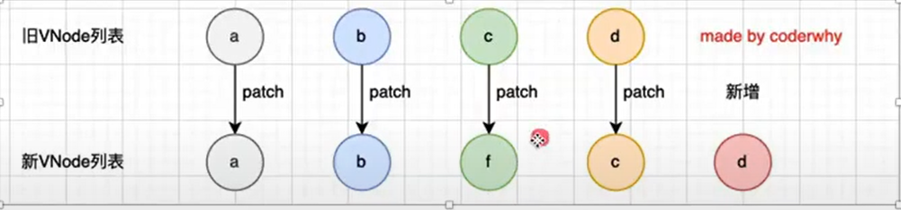
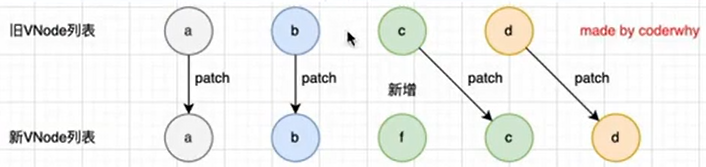
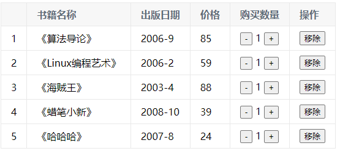
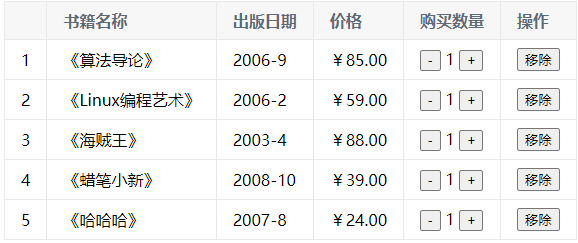
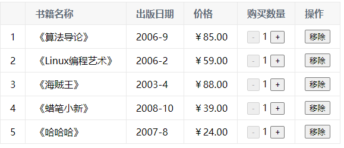
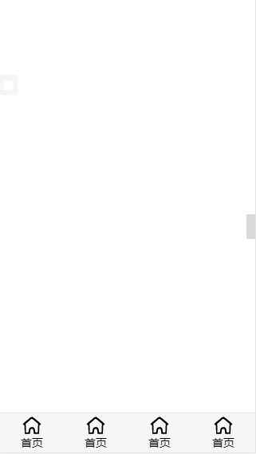
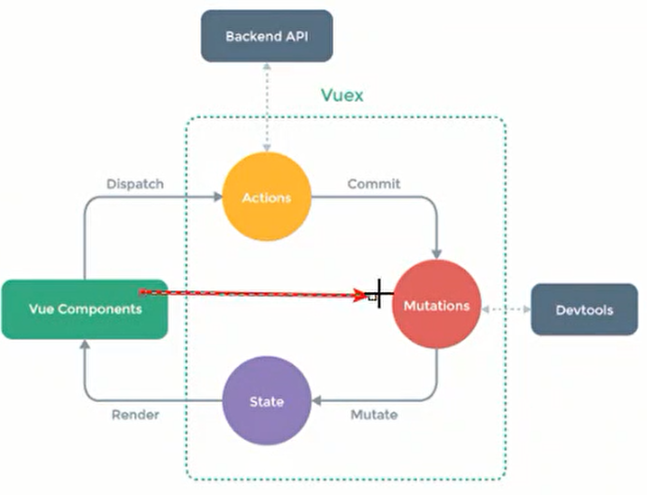
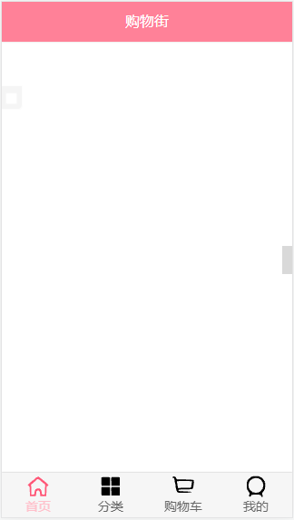
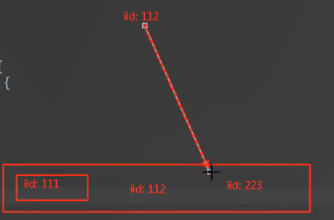
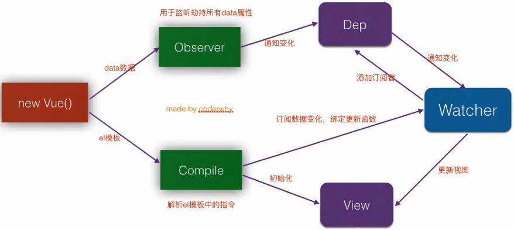

# Vue

## 基础语法

### **mustache 语法**

```html
<h2>{{ one + '' + two }}</h2>
<h2>{{ one }} {{ two }}</h2>
<h2>{{ three * 2 }}</h2>
```

```js
data() {
	return {
	  one: '一',
	  two: '二',
	  three: 3
	}
}
```

通过`{{}}`，**template**里既可以使用**data()**里面定义的数据啦

### 低频指令

- 本质就是自定义属性

这些指令很少使用~

#### v-cloak

防止页面加载时出现**闪烁**问题

```html
<div v-cloak>{{ msg }}</div>
```

```js
data() {
    return {
        msg: 'hello'
    }
}
```

```css
[v-cloak] {
  display: none;
}
```

#### v-text

- 用于**将数据填充到标签中**，作用与插值表达式**类似**，但是**没有闪动**问题
- 如果数据中有 HTML 标签会将 html 标签一并输出
- 注意：此处为**单向数据绑定**，数据对象上的值改变，插值会发生变化；但是当插值发生变化并不会影响数据对象的值

```html
<p v-text="msg"></p>
```

```js
data() {
    return {
        msg: 'hello'
    }
}
```

#### v-html

- 用法和 v-text 相似 但是他**可以将 HTML 片段填充到标签**中
- **可能有安全问题, 一般只在可信任内容上使用 `v-html`，永不用在用户提交的内容上**
- 它与 v-text 区别:**v-text**输出的是**纯文本**，浏览器不会对其再进行 html 解析，但 v-html 会将其当 html 标签解析后输出。

```html
<p v-html="html"></p>
<p v-text="text"></p>
<p>{{ message }}</p>
```

```js
data() {
    return {
        message: '<span>通过双括号绑定</span>',
        html: '<span>html标签在渲染的时候被解析</span>',
        text: '<span>html标签在渲染的时候被源码输出</span>',
    }
}
```

#### v-pre

- 显示原始信息跳过编译过程
- 跳过这个元素和它的子元素的编译过程。
- **一些静态的内容不需要编译加这个指令可以加快渲染**

```html
<span v-pre>{{ this will not be compiled }}</span> <span v-pre>{{ msg }}</span> 
```

```js
data() {
    return {
        msg: 'Hello'
    }
}
```

#### v-once

- 执行一次性的插值(当数据改变时，插值处的内容不会继续更新)

```html
<span v-once>{{ msg }}</span>
```

```js
data() {
    return {
        msg: 'Hello'
    }
}
```

#### 插值表达式 v-text v-html 三者区别

| 差值表达式 | 闪动问题---v-cloak 解决 |
| ---------- | ----------------------- |
| v-text     | 没有闪动问题            |
| v-html     | 安全问题                |

#### 自定义指令

除了 v-for、v-show、v-model 等等指令，**vue 也允许我们自定义指令**

在某些情况下，需要**对元素进行 DOM 操作**，这时就需要用到自定义指令了

通过**directives 选项**（**局部**，只能在**当前组件使用**；**全局**的要使用 app 的**directive()**）

**案例-某个元素挂载完成后自动获取焦点**

```html
<input type="text" ref="input" />
```

```js
import { ref } from 'vue'

setup() {
    const inputRef = ref(null)
    onMounted(() => {
        inputRef.value.focus()
    })
    return {
        input
    }
}
```

这是当前输入框，要是想**其它输入框也能挂载完成之后获取焦点呢？**

你可能会想到**复用**。非常棒！

vue 中复用代码的形式**主要是组件**，当然还有**Composition API**抽取成一个**hook 函数**

还有一个**更简单**的方法：**自定义指令**

我们来自定义一个**v-focus**指令（当然，vue 中并没有这个指令哦）

```html
<input type="text" v-focus />
```

```js
directives: {
    focus: {
        mounted(el) {
            el.focus()
        }
    }
}
```

这是**局部**的，当**input**被挂载完成后，执行**input.focus()**

来看看**全局**是怎么做的

```js
import { createApp } from "vue";
const app = createApp(根组件);
app.directive("focus", {
  mounted(el) {
    el.focus();
  },
});
```

##### **指令的生命周期**

和组件的生命周期类似都是在特定时间节点回调对应函数

##### 自定义指令的修饰符

**自定义指令的修饰符放在哪里呢？**

指令生命周期函数的**第二参数**

```html
<input type="text" v-focus.test="hhh" />
```

```js
directives: {
    focus: {
        mounted(el, bindings) {
            el.focus()
            console.log(bindings.modifiers)
        }
    }
}
```

你就会在控制台看到 hhh

##### 案例-转化时间戳

在开发中，大多数情况下从**服务器**获取到都是**时间戳**；

需要**将时间戳转化成具体格式的时间**来展示；

vue2 可以使用**过滤器**来完成（vue3 已移除啦）；

vue3 中可以通过**computed()**或者**自定义一个方法**完成；

其实还可以通过**自定义指令**

可以指定一个**v-format-time**的指令

```html
<h2 v-format-time>{{ timestamp }}</h2>
```

```js
setup() {
    const timestamp = 1623352193
    return {
        timestamp
    }
}
```

来全局注册这个指令

```js
import { createApp } from "vue";
import dayjs from "dayjs";
const app = createApp(根组件);
app.directive("format-time", {
  mounted(el) {
    const textContent = el.textContent;
    let timestamp = parseInt(textContent);
    // 如果是10位，那就是s，需转化为ms
    if (textContent.length === 10) {
      timestamp = timestamp * 1000;
    }

    el.textContent = dayjs(timestamp).format("YYYY-MM-DD HH:mm:ss");
  },
});
```

这里使用第三方库**dayjs**进行转化

如果用户想**自己设置格式**，可以**传参**进来

```html
<h2 v-format-time="YYYY/MM/DD">{{ timestamp }}</h2>
```

```js
import { createApp } from "vue";
import dayjs from "dayjs";

const app = createApp(根组件);

app.directive("format-time", {
  mounted(el, bindings) {
    let formatString = bindings.value;
    // 如果没传就用默认的
    if (!formatString) {
      formatString = "YYYY-MM-DD HH:mm:ss";
    }
    const textContent = el.textContent;
    let timestamp = parseInt(textContent);
    // 如果是10位，那就是s，需转化为ms
    if (textContent.length === 10) {
      timestamp = timestamp * 1000;
    }

    el.textContent = dayjs(timestamp).format(formatString);
  },
});
```

### 数据绑定 v-bind

**v-bind:class，语法糖-->:class**

```html
 
```

```js
data() {
    return {
        url: 'https://pics5.baidu.com/feed/63d9f2d3572c11df69f722f63ced03d9f603c211.jpeg?token=447e2f91bfb2194ae769094c0ba5c2a5'
    }
}
```

#### 动态绑定 class

##### 对象形式

```html
<h2 :class="{ active: isActive }">你好</h2>
<button v-on:click="btnClick">点击</button>
```

```js
data() {
    return {
        isActive: false
    }
},
methods: {
    btnClick: function () {
        this.isActive = !this.isActive
    }
}
```

当你点击按钮，你会发现 h2 出现一个叫 active 的类

##### 数组形式

```html
<h2 :class="[active, line]">你好</h2>
```

```js
data() {
    return {
        active: 'aa',
        line: 'bb'
    }
}
```

你会发现 h2 有**aa,bb**这两个类名了

#### 动态绑定 style

##### 对象形式

```html
<h2 :style="{ color: finalColor }">你好</h2>
```

```js
data() {
    return {
        finalColor: 'red'
    }
}
```

#### 案例-点击列表项自动变红

```html
<ul>
  <li
    v-for="(item, index) in list"
    v-on:click="listClick(index)"
    :class="{ active: current === index }"
  >
    {{ index }}-{{ item }}
  </li>
</ul>
```

```js
data() {
    return {
        current: 0,
        list: ['海贼王', 'abs', '666']
    }
},
methods: {
    listClick(index) {
        this.current = index
    }
}
```

```css
.active {
  color: red;
}
```

### 计算属性 computed

当数据**需要经过处理再显示**时，需要用到计算属性

#### 基本使用

```html
<h2>{{ getFullName }}</h2>
```

```js
data() {
    return {
        firstName: 'first',
        lastName: 'last'
    }
},
computed: {
    getFullName() {
        return this.firstName + ' ' + this.lastName
    }
}
```

#### set 和 get

computed 原理是这样的

```html
<h2>{{ fullName }}</h2>
```

```js
data() {
    return {
        firstName: 'first',
        lastName: 'last'
    }
},
computed: {
    // 简写
    // fullName() {
    //     return this.firstName + ' ' + this.lastName
    // }
    // 完整写法
    // 而一般情况下是不用set方法的，只读属性
    fullName: {
        set() {},
        get() {
            return this.firstName + ' ' + this.lastName
        }
    }
}
```

#### computed 和 methods 的对比--掌握

**methods 和 computed 看起来都可以实现我们的功能，他们的区别在哪里？**

计算属性会进行缓存，如果多次使用，计算属性只会调用一次。

```html
<!-- methods -->
<h2>{{ getFullName() }}</h2>
<h2>{{ getFullName() }}</h2>
<h2>{{ getFullName() }}</h2>
<h2>{{ getFullName() }}</h2>

<!-- 计算属性 -->
<h2>{{ fullName }}</h2>
<h2>{{ fullName }}</h2>
<h2>{{ fullName }}</h2>
<h2>{{ fullName }}</h2>
```

```js
data() {
    return {
        firstName: 'first',
    	lastName: 'last'
    }
},
computed: {
    fullName: function () {
        // 只打印一次
        console.log('fullName')
        return this.firstName + ' ' + this.lastName
    }
},
methods: {
    getFullName: function () {
        // 每打印4次
        console.log('getFullName')
        return this.firstName + ' ' + this.lastName
    }
}
```

### 侦听器 watch

Vue 提供了一种更通用的方式来**观察和响应**当前活动的实例上的**数据变动**：**侦听属性(watch)**。

当需要在数据变化时执行异步或开销较大的操作时，这个方式是最有用的;

默认情况下，当一个对象发生改变时可以监听到，但是**对象内部成员**发生改变则**监听不到**

```js
data() {
 return {
   info: { name: 'zsf', age: '18'}
 }
},
watch: {
  info(newInfo, oldInfo) {
  	console.log('newValue:', newInfo, 'oldValue:', oldInfo )
  }
},
methods: {
  changeInfo() {
    this.info = {name: 'kobe'}
  }
  changeInfoName() {
    this.info.name = 'kobe'
  }
}
```

当触发某个事件执行**changeInfoName()**时，改变**info**成员**name**的值，**watch**监听不到，所以控制台没打印。

#### 深度侦听

**但是要是有这需求呢？**

这就需要**深度侦听**了。

**方法一**

```js
data() {
 return {
   info: { name: 'zsf', age: '18'}
 }
},
watch: {
  info:{
    handler: function(newInfo, oldInfo) {
      console.log('newValue:', newInfo, 'oldValue:', oldInfo )
    },
    deep: true
  }
},
methods: {
  changeInfo() {
    this.info = {name: 'kobe'}
  }
  changeInfoName() {
    this.info.name = 'kobe'
  }
}
```

**方式二**

```js
watch: {
  info:{
    'info.name': function(newInfo, oldInfo) {
      console.log('newValue:', newInfo, 'oldValue:', oldInfo )
    },
    deep: true
  }
}
```

但是这种方式在 vue3 官方文档上已经看不到了。

#### 立即执行

当如果需要页面渲染后，不管数据有没有发生改变，都要执行一次侦听器，这时就需要用到**immediate**属性了

```js
watch: {
  info:{
    handler: function(newInfo, oldInfo) {
      console.log('newValue:', newInfo, 'oldValue:', oldInfo )
    },
    deep: true,
    immediate: true
  }
}
```

### 事件监听 v-on

**v-on:click，语法糖@click**

#### 参数传递

1.事件绑定的方法可以不带小括号（如果不需要参数）；

2.函数定义的时候需要参数，但是事件触发时绑定的函数没有()，vue 会默认将浏览器产生的**event**事件对象作为参数传入方法中；

3.需要**event 对象**，同时又需要**其它参数**,这是需要手动传入$event;

```html
<button @click="btn1Click">按钮1</button>
<button @click="btn2Click">按钮2</button>
<button @click="btn3Click(abc, $event)">按钮3</button>
```

```js
methods: {
    btn1Click () {
        console.log(123);
    },
    btn2Click (name) {
        console.log(name);
    },
    btn3Click (abc, event) {
        console.log(abc, event);
    }
}
```

#### 修饰符

- .stop 的使用---防止**事件冒泡**
- .prevent 的使用---防止事件的**默认行为**，如表单 submit 的默认行为
- .enter 的使用---当输入回车才会触发事件（其它特殊键帽类似）
- .once 的基本使用---只触发**一次回调**

```html
<div @click="divClick()">
  12345
  <button @click.stop="btnClick()">点击</button>
</div>
```

```js
methods: {
    divClick () {
        console.log('div');
    },
    btnClick () {
        console.log('btn');
    }
}
```

### 双向数据绑定 v-model

#### 原理

v-model 背后有两个操作：

- v-bind 绑定 value 属性的值；
- v-on 绑定 input 事件监听的函数中，函数会获取最新的值赋值到绑定的属性中；

```html
<input v-model="msg" />
```

等价于

```html
<input v-bind="msg" v-on="msg = $event.target.value" />
```

#### 应用场景

**表单**

- checkbox
- radio
- select

**checkbox**

当多个 checkbox 用 v-model 绑定一个数据（hobbies）时（记得每个加上 value 哦），修改选中的数量的时候，hobbies 会动态的增删

```html
<form action="">
  <label for="basketball">
    <input
      type="checkbox"
      name=""
      id="basketball"
      v-model="hobbies"
      value="basketball"
    />篮球
  </label>
  <label for="football">
    <input
      type="checkbox"
      name=""
      id="football"
      v-model="hobbies"
      value="football"
    />足球
  </label>
  <label for="tennis">
    <input
      type="checkbox"
      name=""
      id="tennis"
      v-model="hobbies"
      value="tennis"
    />网球
  </label>
</form>
```

**radio**

和多选框不同，两个**radio**用**v-model**绑定一个数据（gender），由于互斥，**gender**最终只能有一个**value**

```html
<label for="male">
  <input type="radio" id="male" v-model="gender" value="male" />男
</label>
<label for="female">
  <input type="radio" id="female" v-model="gender" value="female" />女
</label>
```

sellect 同理

#### 修饰符

由于 v-model 是集成了 v-bind 和 v-on，所以他也有修饰符

- lazy
- number
- trim

**lazy 修饰符有什么作用呢？**

默认情况下，**v-model**在进行双向绑定时，绑定的是**input**事件，每次内容输入后就将**最新的值和绑定的属性同步**；

如果**v-model**加上**lazy**修饰符，会将绑定的事件切换为**change**事件，只有在提交时（比如回车），才会触发（类似于防抖）

**number 修饰符有什么作用呢？**

给**v-model 赋**值时，不管**内容**是什么类型，都会转换成**String**类型，**但要是希望数字类型不要被转换呢?**

用**number**修饰符。

**trim**

去空格。。。

### 条件判断 v-if

#### 案例--登陆切换

```html
<span v-if="isUssr">
  <label for="username">用户账号</label>
  <input type="text" id="uername" placeholder="用户账号" />
</span>
<span v-else>
  <label for="email">用户邮箱</label>
  <input type="text" id="email" placeholder="用户邮箱" />
</span>
<button @click="isUssr = !isUssr">切换类型</button>
```

```js
data() {
    return {
        isUser: true
    }
}
```

#### v-show 和 v-if 的区别

**v-if **确保在切换过程中条件块内的事件监听器和子组件**适当地被销毁和重建**。;

**v-if** 也是**惰性的**：如果在初始渲染时条件为假，则什么也不做——直到条件第一次变为真时，才会开始渲染条件块;

相比之下，**v-show** 就简单得多——不管初始条件是什么，元素**总是会被渲染**，并且只是简单地基于 **CSS 的 display**进行切换；

注意，**v-show 不支持 template**；

一般来说，**v-if** 有**更高的切换开销**，而 **v-show** 有**更高的初始渲染开销**；

因此，如果需要非常**频繁地切换**，则使用 **v-show** 较好；

如果在运行时**条件很少改变**，则使用 **v-if** 较好；

### 遍历 v-for

```html
<li v-for="item in list" :key="item">{{ item }}</li>
```

```js
data() {
    return {
        list: [1,2,3,4,5]
    }
}
```

#### v-for 中 key 有什么作用？

- key 属性主要用在 Vue 的**虚拟 DOM 的 diff 算法**，在**新旧 nodes**对比是辨识**VNodes**
- 如果**不使用 key**，Vue 会使用一种最大限度减少动态元素并且尽可能的尝试就地**修改/复用相同类型元素**的算法
- 而**使用 key**时，它会基于 key 的变化**重新排列元素顺序**，并且会**移除/销毁**key 不存在的元素

这时候你可能要问：**啥是 VNode？**

- 在 Vue 中，无论是组件还是元素，最终表现出来的都是一个个 VNode
- VNode 的本质是一个 js 对象

比如

```html
<div class="my" style="font-size: 30px; color: red">hhh</div>
```

转化成 VNode 形式

```js
const vnode = {
    type: 'div',
    prop: {
        class: 'my',
        style: {
            font-size: 30px,
            color: red
        }
    },
    children: 'hhh'
}
```

所以你知道为什么`v-bind`支持**对象绑定**了吧！

所以 Vue 的渲染过程大致理解为：template -> VNode -> 真实 DOM

使用 VNode 有一个很重要的原因：**跨平台！**

可以在浏览器上渲染，可以在移动端渲染

那，**啥是虚拟 DOM？**

VNode 组成的 VNode Tree

好了，接下来**举例体现 v-for 中 key 的作用**

假设一开始要遍历数组 arr = [a, b, c, d]

现在要在 bc 之间插入一个 f

当数组变化了之后，要重新遍历了

那有个问题来了：**要怎么做，才能让这个插入性能最高效？**

**方案一，**把原来的数组去掉，用新的数组（ps：狗都不用）

**方案二，**ab 不变，用原来的位置，之前 c 位置换成 f，之前 d 的位置放 c，依次类推。。。要是放的位置很靠前，并且这数组巨大，那还不如用方案一呢

**方案三，**diff 算法，原来的元素不变，对比新旧 VNode 有哪些需要发生变化再变化，但是 Vue 会根据你有没有 key 采取不同的更新策略：

如图，这里引用 coderwhy 老师的一张图，当没有 key 时，它是这样更新的（具体看源码）

用方案二更新



当有 key 时，这就相对复杂了：

先从头开始，while 循环找出哪些不变；

剩下部分从尾开始，whil 循环找出哪些不变；

那剩下的是没有与之匹配的节点 f，这时直接新增一个节点

这里又引用 coderwhy 老师的一张图：



这还是比较简单的情况。。。

源码就先到这里，我只是想举出有 key 和没 key 对性能的影响

#### 数组中响应式的方法

1. push()
   `this.list.push('aaa')`

2. pop():删除数组最后一个
   `this.list.pop('aaa')`

3. shift():删除数组第一个
   `this.list.shift()`

4. unshift():在数组最前面添加
   `this.list.unshift()`

5. **splice(): 删除/插入/替换**
   **第一个参数是开始位置**

   **删除元素：第二个参数传入你要删除几个元素（如果没有传，就删除后面的所有元素）**

   **替换元素：第二个参数，表示我们要替换几个元素，后面是用于替换前面的元素**

   **插入元素：第二个参数，传入 0，并且后面跟上要插入的元素**
   `this.list.splice(1, 3, 'a', 'b', 'c')`

6. sort()
   `this.list.sort()`

7. reverse()

`this.list.reverse`

### 图书购物车

#### 结构样式初始化

```html
<table>
  <thead>
    <tr>
      <th></th>
      <th>书籍名称</th>
      <th>出版日期</th>
      <th>价格</th>
      <th>购买数量</th>
      <th>操作</th>
    </tr>
  </thead>
  <tbody>
    <tr v-for="item in books" :key="item">
      <td>{{ item.id }}</td>
      <td>{{ item.name }}</td>
      <td>{{ item.date }}</td>
      <td>{{ item.price }}</td>
      <td>
        <button>-</button>
        {{ item.count }}
        <button>+</button>
      </td>
      <td>移除</td>
    </tr>
  </tbody>
</table>
```

```js
data() {
    return {
        books: [
            {
                id: 1,
                name: '《算法导论》',
                date: '2006-9',
                price: 85.00,
                count: 1
            },
            {
                id: 2,
                name: '《Linux编程艺术》',
                date: '2006-2',
                price: 59.00,
                count: 1
            },
            {
                id: 3,
                name: '《海贼王》',
                date: '2003-4',
                price: 88.00,
                count: 1
            },
            {
                id: 4,
                name: '《蜡笔小新》',
                date: '2008-10',
                price: 39.00,
                count: 1
            },
            {
                id: 5,
                name: '《哈哈哈》',
                date: '2007-8',
                price: 24.00,
                count: 1
            }
        ]
    }
}
```

```css
table {
  border: 1px solid #e9e9e9;
  border-collapse: collapse;
  border-spacing: 0;
}

th,
td {
  padding: 8px 16px;
  border: 1px solid #e9e9e9;
  text-align: left;
}

th {
  background-color: #f7f7f7;
  color: #5c6b77;
  font-weight: 600;
}
```

**效果**



#### 价格格式处理

在价格前面加‘￥’；

需要保留两位小数，**toFixed()**可以把小数点后的 00 显示出来；

**使用过滤器**

```js
filters: {
    showPrice (price) {
        return '￥' + price.toFixed(2)
    }
}
```

价格那一栏用 `item.price | showPrice`

过滤器语法：会把 `item.price` 当成参数传进 showPrice 函数，类似 linux 的管道

```html
<tr v-for="item in books" :key="item.id">
  <td>{{ item.id }}</td>
  <td>{{ item.name }}</td>
  <td>{{ item.date }}</td>
  <td>{{ item.price | showPrice }}</td>
  <td>
    <button>-</button>
    {{ item.count }}
    <button>+</button>
  </td>
  <td><button>移除</button></td>
</tr>
```

**效果**



#### 加减按钮的事件

**如何保证操作的是当前书籍？**

index.html+

v-for 遍历的时候加上 index 参数

```html
<tr v-for="(item, index) in books" :key="item.id">
  <td>{{ item.id }}</td>
  <td>{{ item.name }}</td>
  <td>{{ item.date }}</td>
  <td>{{ item.price | showPrice }}</td>
  <td>
    <button @click="decrement(index)">-</button>
    {{ item.count }}
    <button @click="increment(index)">+</button>
  </td>
  <td><button>移除</button></td>
</tr>
```

```js
methods: {
    increment (index) {
        this.books[index].count++
    },
    decrement (index) {
        this.books[index].count--
    }
}
```

**怎么做使书籍数量为 1 的时候不能减？**

当书籍数量小于或等于 1 时禁用 button

```html
<button @click="decrement(index)" :disabled="item.count <= 1">-</button>
```

**效果**



#### 移除按钮的事件

**如何确保移除的是当前书籍？**

同上，传 index

index.html+

```html
<td><button @click="remove(index)">移除</button></td>
```

```js
methods: {
    ...
    remove (index) {
        this.books.splice(index, 1)
    }
}
```

**当移除完购物车，显示购物车为空怎么实现？**

**用 v-if 和 v-else**

当 books 有长度时才显示表格

```html
<div v-if="books.length">...</div>
<h2 v-else>购物车空啦</h2>
```

#### 计算总价

**用计算属性 computed + 过滤器**

```js
computed: {
    totalPrice () {
        let totalPrice = 0
        for (let i = 0; i < this.books.length; i++) {
            totalPrice += this.books[i].count * this.books[i].price
        }
        return totalPrice
    }
}
```

**效果**


### 封装 TabBar 组件

#### 初始化结构

###### App.vue

```html
<div id="app">
  <TabBar></TabBar>
</div>
```

```js
import TabBar from "./components/tabbar/TabBar.vue";

components: {
  TabBar;
}
```

###### TabBar.vue

```html
<div id="tab-bar">
  <div class="tab-bar-item">首页</div>
  <div class="tab-bar-item">分类</div>
  <div class="tab-bar-item">购物车</div>
  <div class="tab-bar-item">我的</div>
</div>
```

```css
#tab-bar {
  display: flex;
  position: fixed;
  left: 0;
  right: 0;
  bottom: 0;
  background-color: #f6f6f6;
  box-shadow: 0 -1px 1px rgba(100, 100, 100, 0.2);
}
.tab-bar-item {
  flex: 1;
  text-align: center;
  height: 49px;
}
```

#### TabBar 进一步抽离出 TarBarItem

新增一个 TarBarItem 组件

##### TarBarItem.vue

```html
<div class="tab-bar-item">
  
  <div>首页</div>
</div>
```

```css
.tab-bar-item {
  flex: 1;
  text-align: center;
  height: 49px;
  font-size: 14px;
}
.tab-bar-item img {
  vertical-align: middle;
  height: 24px;
  width: 24px;
  margin-top: 3px;
}
```

##### TabBar.vue

```html
<div id="tab-bar">
  <slot></slot>
</div>
```

```css
#tab-bar {
  display: flex;
  position: fixed;
  left: 0;
  right: 0;
  bottom: 0;
  background-color: #f6f6f6;
  box-shadow: 0 -1px 1px rgba(100, 100, 100, 0.2);
}
```

##### App.vue

```html
<div id="app">
  <TabBar>
    <TabBarItem></TabBarItem>
    <TabBarItem></TabBarItem>
    <TabBarItem></TabBarItem>
    <TabBarItem></TabBarItem>
  </TabBar>
</div>
```

```js
import TabBarItem from "./components/tabbar/TabBarItem.vue";

components: {
  TabBarItem;
}
```

##### 效果



**问题：同一个图片，一样的文字**

**TarBarItem.vue 的内容是写死的吗?**

不是，加入具名插槽

TarBarItem.vue

```html
<div class="tab-bar-item">
  <solt name="item-icon"></solt>
  <solt name="item-text"></solt>
</div>
```

App.vue

```html
<div id="app">
  <tab-bar>
    <tab-bar-item>
      
      <div slot="item-text">首页</div>
    </tab-bar-item>
    <tab-bar-item>
      
      <div slot="item-text">分类</div>
    </tab-bar-item>
    <tab-bar-item>
      
      <div slot="item-text">购物车</div>
    </tab-bar-item>
    <tab-bar-item>
      
      <div slot="item-text">我的</div>
    </tab-bar-item>
  </tab-bar>
</div>
```

#### 处于激活状态的图片和文字

##### **TabBarItem.vue**

新增:一个数据 isActive、一个类 active

```html
<div class="tab-bar-item">
  <div v-if="!isActive">
    <slot name="item-icon"></slot>
  </div>
  <div v-else>
    <slot name="item-icon_active"></slot>
  </div>
  <div :class="{active: isActive}">
    <slot name="item-text"></slot>
  </div>
</div>
```

```js
data () {
  return {
    isActive: true
  }
}
```

```css
.active {
  color: lightcoral;
}
```

##### **经验：**

**当插槽有属性时，为了防止使用时覆盖掉 slot 的属性，一般都是在 slot 标签外面包一层 div，然后那些属性放到 div 的属性上**

例如

这样的插槽被使用时可能会被覆盖掉 v-if 属性

```vue
<slot v-if="!isActive" name="item-icon"></slot>
```

而这样就不会

```vue
<div v-if="!isActive"><slot name="item-icon"></slot></div>
```

##### 效果


#### 点击每一个 item 对应一个路由

components 文件夹和 view 的区别

components 放的是公共组件

而 view 放的是单独组件

##### 新建四个组件

在双 src 文件夹下新建 view 文件夹，然后分别新建 home、category、shopcar、profile 文件夹放对应组件

比如

home 文件夹下的 Home.vue

```html
<div>首页</div>
```

##### 新增路由

在 src 文件夹下新建一个 router 文件夹并在该文件夹下新建一个 index.js

**index.js**

```js
// 1.导入
import Vue from "vue";
import VueRouter from "vue-router";
// 2.挂载
Vue.use(VueRouter);
// 懒加载
const Home = () => import("../view/home/Home.vue");
const Category = () => import("../view/Category/Category.vue");
const ShopCar = () => import("../view/shopcar/ShopCar.vue");
const Profile = () => import("../view/profile/Profile.vue");
// 3.创建路由配置对象
const routes = [
  {
    path: "",
    redirect: "/home",
  },
  {
    path: "/home",
    components: Home,
  },
  {
    path: "/category",
    components: Category,
  },
  {
    path: "/shopcar",
    components: ShopCar,
  },
  {
    path: "/profile",
    components: Profile,
  },
];
// 4.实例化路由对象
const router = new VueRouter({
  routes,
});
// 5.默认导出
export default router;
```

##### main.js 导入路由

```js
import Vue from "vue";
import App from "./App.vue";
import router from "./router";

// 导入组件库
import ElementUI from "element-ui";
// 导入组件相关样式
import "element-ui/lib/theme-chalk/index.css";
// 配置Vue插件
Vue.use(ElementUI);

Vue.config.productionTip = false;

new Vue({
  router,
  render: (h) => h(App),
}).$mount("#app");
```

##### 父组件给子组件传路径

**App.vue**

```html
<div id="app">
  <router-view></router-view>
  <tab-bar>
    <tab-bar-item path="/home">
      
      
      <div slot="item-text">首页</div>
    </tab-bar-item>
    <tab-bar-item path="/category">
      
      
      <div slot="item-text">分类</div>
    </tab-bar-item>
    <tab-bar-item path="/shopcar">
      
      
      <div slot="item-text">购物车</div>
    </tab-bar-item>
    <tab-bar-item path="/profile">
      
      
      <div slot="item-text">我的</div>
    </tab-bar-item>
  </tab-bar>
</div>
```

**TabBarItem.vue**

```js
props: {
  path: String
},
methods: {
  itemClick () {
    this.$router.push(this.path)
  }
}
```

#### 点击 item 才激活

将 TabBarItem 的 isActive 改成计算属性

```js
computed: {
    isActive () {
      return this.$route.path.indexOf(this.path) !== -1
    }
  }
```

**如何让使用者修改激活样式？**

比如想修改激活文字样式 activeColor="blue"

```vue
<tab-bar-item path="/home" activeColor="blue">
  
  
  <div slot="item-text">首页</div>
</tab-bar-item>
```

先在 TabBarItem 里添加一个自定义属性 activeColor

修改控制文字的那个插槽绑定的样式

TabBarItem.vue

```html
<div :style="activeStyle">
  <slot name="item-text"></slot>
</div>
```

```js
props: {
  activeColor: {
    type: String,
    default: 'red'
  }
},
computed: {
  activeStyle () {
    return this.isActive ? { color: this.activeColor } : {}
  }
}
```

## 组件化开发

### 组件中的 data

**为什么组件中的 data 是函数？**

- 当 data 是函数时，每次使用组件都会返回一个**新的 data 对象**，使用**独立的地址空间**
- 如果不是函数，那复用组件时 将共用数据源，不符合组件化思想

### props

用于父组件向子组件传数据

**本质就是给子组件添加自定义属性**

#### 对象形式

父组件

```html
<son :msg="msg"></son>
```

```js
data() {
    return {
        msg: ['a', 'b', 'c']
    }
}
```

子组件 son.vue

```html
<span v-for="item in msg" :key="item">{{ item }}</span>
```

```js
props: {
    msg: {
        type: Array,
            default() {
                return []
            }
    }
}
```

这样，子组件就可以使用父组件传过来的数据啦

### emits（vue3）

**vue3 新增**，用来定义一个组件**可以向其父组件发射的事件**。用法与 props 类似

**数组 | 对象**

#### vue2 的做法

1. 在**子组件**中，通过**$emit()**来发射事件
2. 在**父组件**中，通过**v-on**来监听子组件事件

子组件`son.vue`

```html
<buttom @click="increment">+1</buttom>
```

```js
emits: ['add'],
methods: {
    increment() {
        this.$emit('add')
    }
}
```

父组件

```html
<h2>{{ counter }}</h2>
<son @add="addOne"></son>
```

```js
data() {
    return {
        counter: 0
    }
},
methods: {
    addOne() {
        this.counter ++
    }
}
```

#### vue3 的做法

##### 数组形式

子组件`son.vue`

```html
<buttom @click="increment">+1</buttom>
```

```js
emits: ['add'],
methods: {
    increment() {
        this.$emit('add')
    }
}
```

父组件

```html
<h2>{{ counter }}</h2>
<son @add="addOne"></son>
```

```js
data() {
    return {
        counter: 0
    }
},
methods: {
    addOne() {
        this.counter ++
    }
}
```

##### 对象形式

对象写法的目的是进行**参数验证**

子组件`son.vue`

```html
<buttom @click="increment">+1</buttom>
```

```js
emits: {
    add: null
},
methods: {
    increment() {
        this.$emit('add')
    }
}
```

父组件

```html
<h2>{{ counter }}</h2>
<son @add="addOne"></son>
```

```js
data() {
    return {
        counter: 0
    }
},
methods: {
    addOne() {
        this.counter ++
    }
}
```

null 表示无参

当有参数时

```js
emits: {
  add: (num1, num2) => {
    return true;
  };
}
```

对参数有限制时（比如大于第一个参数得大于 10）

```js
emits: {
  add: (num1, num2) => {
    if (num1 > 10) {
      return true;
    }
    return false;
  };
}
```

虽然还是能传过去，但是会有警告；这样会清楚地知道**传递的参数是有问题的**

**提示**

**官网强烈建议使用 `emits` 记录每个组件所触发的所有事件。**

这尤为重要，因为**移除了 `.native` 修饰符**。任何未在 `emits` 中声明的**事件监听器**都会被算入组件的 `$attrs` 中，并将默认绑定到**组件的根节点**上。

### provide 和 inject

用于**非父子**组件之间共享数据

如果通过 props 逐级往下传，将会非常麻烦。

无论**层级结构**有多深，父组件都可以作为其所有子组件的**依赖提供者**

父组件有一个**provide**选项来提供数据

子组件有一个**inject**选项来使用这些数据

**这个和 props 有什么区别呢？**

- 父组件不需要知道**哪些子组件使用**了 provide 的 property
- 子组件不需要知道 inject 的 property**来自哪里**

#### 基本用法

父组件

```js
provide: {
    name: 'zsf',
    age: 18
}
```

子孙组件

```html
<h3>{{ name }} {{ age }}</h3>
```

```js
inject: ["name", "age"];
```

#### 使用 data 里面的数据

要想 provide 使用 data 里面的数据，并且通过 this 拿到

```js
data() {
  return {
    names: ['zsf','aaa']
  }
},
provide() {
    return {
      length: this.name.length,
    }
}
```

如果不写成函数，那**this**指向的就不是**组件实例**

#### 处理响应式

如果改变 names 的长度，你会发现 provide 里面的 length 没有更新。

那要想它能做到更新，需要用到 vue 的 computed()

```js
import { computed } from 'vue'
provide() {
    return {
      length: computed(() => this.name.length),
    }
}
```

### 事件总线

#### vue2 的事件总线

##### 初始化

**第一种方式**

将一个空的 vue 对象挂载到 Vue 原型上，这样每个组件对象都可以使用~

```js
Vue.prototype.$EventBus = new Vue();
```

**第二种方式**

创建一个模块 Bus.js，导出一个空的 vue 对象，需要就导入

```js
// Bus.js
import Vue from "vue";
export const EventBus = new Vue();
```

实质上，它是一个不具备 DOM 的组件，它具有的仅仅只是组件的**实例方法**而已，因此它非常的**轻便**。

##### 发送和接收事件

- `EventBus.$emit('emit事件名'，数据)`发送
- `EventBus.$on("emit事件名", callback(payload1,…))` 接收

举例导入 Bus.js 模块的方式通过事件总线传递信息

A.vue

```html
<p>{{msgB}}</p>
<button @click="sendMsgA()">-</button>
```

```js
import { EventBus } from "../Bus.js"

data(){
    return {
    msg: ''
    }
},
mounted() {
    EventBus.$on("bMsg", (msg) => {
        // a组件接受 b发送来的消息
        this.msg = msg;
    });
},
methods: {
    sendMsgA() {
        EventBus.$emit("aMsg", '来自A页面的消息'); // a 发送数据
    }
}
```

B.vue

```html
<p>{{msgA}}</p>
<button @click="sendMsgB()">-</button>
```

```js
import { EventBus } from "../event-bus.js"

data(){
    return {
    msg: ''
    }
},
mounted() {
    EventBus.$on("aMsg", (msg) => {
        // b组件接受 a发送来的消息
        this.msg = msg;
    });
},
methods: {
    sendMsgB() {
        EventBus.$emit("bMsg", '来自b页面的消息'); // b发送数据
    }
}
```

如果只想接收一次，可以使用`EventBus.$once('事件名', callback(payload1,…)`

##### 优缺点

**优点**

- 解决了多层组件之间繁琐的事件传播。
- 使用原理十分简单，代码量少。

**缺点**

- vue 是单页面应用，如果在某一个页面刷新了之后，与之相关的 EventBus 会被移除，这样可能出现一下意外 bug
- 如果有反复操作的页面，EventBus 在监听的时候就会**触发很多次**，也是一个非常大的隐患。通常会用到，在 vue 页面**销毁时**，同时**移除 EventBus**事件监听。
- 由于是都使用一个 Vue 实例，所以容易出现**重复触发**的情景，两个页面都定义了**同一个事件名**，并且没有用$off 销毁（常出现在路由切换时）。

#### vue3 的事件总线

vue3 从实例中**移除了$on、$off、$once**方法，如果想使用**全局事件总线**，要通过**第三方库**

官方推荐**mitt**或**tiny-emitter**

##### 使用 mitt（vue3）

**安装**

`npm instal mitt`

**封装一个工具 eventBus.js**

```js
import mitt from "mitt";
const emitter = mitt();
export default emitter;
```

发送组件 sent.vue

```html
<buttom @click="btnClick"></buttom>
```

```js
import emitter from './eventBus.js'
methods: {
    btnClick() {
        emitter.emit('zsf',参数)
    }
}
```

接收组件 accept.vue

```js
import emitter from './eventBus.js'
created() {
    emitter.on('zsf', (参数) => {
        拿到参数
    })
}
```

写法与 Vue2 类似，不过是使用了第三方库

##### 多个事件的发射与监听

发送组件 sent.vue

```js
import emitter from './eventBus.js'
methods: {
    btnClick() {
        emitter.emit('zsf',参数)
        emitter.emit('aaa',参数)
    }
}
```

接收组件 accept.vue

```js
import emitter from './eventBus.js'
created() {
    emitter.on('zsf', (参数) => {
        拿到参数
    })
    emitter.on('aaa', (参数) => {
        拿到参数
    })
}
```

### $refs

这种方式只需要在**需要访问的子组件或元素上加个 ref="xxx"**的属性

可以通过**this.$refs**访问到**子组件或元素**的信息

#### ref 在元素上

父组件

```html
<h2 ref="h"></h2>
```

这样，父组件就可以通过**this.$refs.h**获取到**h2 的元素对象**

#### ref 在组件上

父组件

```html
<son ref="item"></son>
```

这样，父组件就可以通过**this.$refs.item**获取到**组件 son 的实例对象**啦，子组件的信息都可以拿到（data、methods 等等）

### 插槽

#### 动态插槽名

后面补充~

#### 作用域插槽

先来看看什么是**渲染作用域**

- 父级模板里的所有内容都是**在父级作用域中编译**的
- 子级模板里的所有内容都是**在子级作用域中编译**的

比如有个**父组件包了一个子组件**，**子组件**有个**title**数据，想**直接**在父组件里面**显示 title**，这是不可以的。

这就是**渲染作用域**

但是，有时候我们希望**插槽可以访问到子组件中的内容**

**常见应用：**

当一个组件用来渲染一个**数组元素**时，**又想使用插槽**，并且**希望插槽中显示每项内容**

父组件

```html
<son :names="names"></son>
```

```js
data() {
    return {
        names: ['zsf', 'abc', 'sss']
    }
}
```

展示组件 son.vue

```html
<template v-for="item in names" :key="item">
  <span>{{ item }}</span>
</template>
```

```js
props: {
    names: {
        type: Array,
        default: () => []
    }
}
```

一般情况是这样的。但是，要是父元素不想使用 span 展示，想用其它元素展示（换句话说，父元素使用 son 组件时，可以决定使用什么元素展示）

展示组件 son.vue

```html
<template v-for="item in names" :key="item">
  <slot>{{ item }}</slot>
</template>
```

**父组件这样写对吗？**

```html
<son :names="names">
  <button>{{ item }}</button>
</son>
```

**不对**。由于存在渲染作用域，**button 访问不到 slot 内部的 item**

这时你可能会问：**为什么不直接在父组件遍历并展示？**

上面有说到：我们希望通过**复用其它组件**展示，又想使用**插槽**。。。

这就用到**作用域插槽**了

##### 用法

展示组件 son.vue，在定义插槽时声明

```html
<template v-for="(item, index) in names" :key="item">
  <slot :item="item" :index="index">{{ item }}</slot>
</template>
```

父组件这样写

```html
<son :names="names">
  <template v-slot="slotPros">
    <button>{{ slotPros.item }}</button>
  </template>
</son>
```

这样，**slotPros**可以拿到 slot 定义的那些属性（item、index）

### 动态组件

#### 基本用法

使用**component**这个内置组件的**is**属性

is 的值可以是**局部注册**过的组件，或者**全局注册**过的。

标签栏切换案例

```html
<div id="dynamic-component-demo">
  <button
    v-for="tab in tabs"
    :key="tab"
    :class="{ active: currentTab === tab }"
    @click="currentTab = tab"
  >
    {{ tab }}
  </button>

  <component :is="currentTab"></component>
</div>
```

```js
components: {
    Home,
    Posts,
    Archive
},
data() {
    return {
      currentTab: 'Home',
      tabs: ['Home', 'Posts', 'Archive']
    }
  }
```

#### 给动态子组件传值

直接在 component 组件**加上属性**即可，就是把要传的值当 component 的属性

```html
<component :is="currentTab" name="zsf" :age="18"></component>
```

这样，切换到的组件都会拿到 name 和 age，通过**props**拿到；

当然，动态子组件也可以通过**emits**给父组件传**事件**

#### 状态缓存

你有没有想过这样一个问题：**切换子组件时，要想再切回去，以前的状态会保留吗？**

不会。一旦切换，上一个子组件就会被**销毁**，状态没了；切换回去时，是**重新创建**。

每一次的切换来切换去都是**销毁-重建**的过程，这是**耗性能**的一件事

**能不能将组件的状态缓存起来呢？**

可以。使用内置组件**keep-alive**包裹起来

```html
<keep-alive>
  <component :is="currentTab" name="zsf" :age="18"></component>
</keep-alive>
```

**keep-alive 的三个属性**

##### include

string | RegExp | Array

只有**名称匹配**的组件才会被**缓存状态**

##### exclude

string | RegExp | Array

**匹配名称**的组件**不会缓存状态**

##### max

number | string

最多可以缓存组件数量，一旦到达这数字，缓存组件**最近没有被访问**的实例会被销毁

**提示**

由于 include 和 exclude 都是根据**名称匹配**，所以要给对应组件加上**name 选项**

### 异步组件

某些组件在一开始用不上，打包他们时，可以进行**分包**，优化**首屏渲染**时间

#### defineAsyncComponent（vue3）

Vue3 提供了一个 api：**defineAsyncComponent**

接收两种类型参数：

- 工厂函数，该工厂函数需要返回一个 promise 对象
- 对象，可以对异步组件进行更多配置

利用 webpack 的特性在 Vue 中使用异步组件

**接收工厂函数写法**

```js
import { defineAsyncComponent } from "vue";
const AsyncDetail = defineAsyncComponent(() => import("./AsyncDetail.vue"));
```

import()返回的就是 promise，并且会在打包时进行分包操作

**接收对象的写法**

```js
import { defineAsyncComponent } from 'vue'
const AsyncDetail = defineAsyncComponent({
    loader: () => import('./AsyncDetail.vue'),
    ...
})
```

更多配置可以查看官网

#### 和 suspense 一起使用

Suspense 是一个内置的**全局组件**，该组件有**两个插槽**

- default 如果 default 可以显示，就显示 default 插槽的内容
- fallback 如果 default 无法显示，就显示 fallback 插槽的内容

```html
<suspense>
  <template #default>
    <async-home></async-home>
  </template>
  <template #fallback>
    <loading></loading>
  </template>
</suspense>
```

### 组件使用 v-model

能不能封装一个组件，使用的时候可以使用**v-model**实现**双向数据绑定**呢？

#### input 使用

input 元素可以直接使用 v-model

```html
<input v-model="message" />
<h2>{{ message }}</h2>
```

```js
data() {
    return {
        message: 'hhh'
    }
}
```

v-model 的本质是

```html
<input :value="message" @input="message = $event.taget.value" />
```

**v-bind**绑定 input 的**value**属性，然后**监听**input 的**input 事件**，当 input 事件触发时，就将输入框中的 value**赋值**给 message。这样，就是实现了双向数据绑定。

#### 自定义组件上使用

**那我要是想在自定义组件上使用呢？**

父组件

```html
<Sf v-model="message"></Sf>
```

```js
data() {
    return {
        message: 'hhh'
    }
}
```

`<Sf v-model="message"></Sf>`也可以写成

```html
<Sf :modelValue="message" @update:model-value="message = $event"></Sf>
```

由于是自定义组件，通过**$event**就可以拿到（不是$event.target.value）

Sf.vue

```html
<input v-model="value" />
<h2>{{ modelValue }}</h2>
```

```js
props: {
    modelValue: String
},
emits: ['update:model-value'],
computed() {
    value: {
        get() {
            return this.modelValue
        },
        set(value) {
            this.emit('update:modelValue', value)
        }
    }
}
```

#### 自定义 v-model 绑定多个

父组件

```html
<Sf v-model="message" v-model:title="title"></Sf>
<h3>{{ message }}-{{ title }}</h3>
```

Sf.vue

```html
<input v-model="value" /> <input v-model="zsf" />
```

```js
props: {
    modelValue: String,
    title: String
},
emits: ['update:model-value', 'update:title'],
computed() {
    value: {
        get() {
            return this.modelValue
        },
        set(value) {
            this.emit('update:modelValue', value)
        }
    },
	zsf: {
		set(zsf) {
			this.emit('update:title', zsf)
		},
		get() {
			return this.title
		}
	}
}
```

### render 函数

vue 推荐在**绝大多数**情况下使用**模板**来创建**html**，只有一些**特殊的场景**，才需要 js 的**完全编程能力**。

这时，可以使用**render 函数**，它**比模板更接近编译器**

#### VNode

vue 在生成真实的 DOM 之前，会**将节点转成 VNode**，而 VNode 组合在一起形成一颗**树结构**，也就是虚拟 DOM（VDOM）

#### template 变真实 DOM

**template 的里的 html 是怎么变成真实 DOM 的呢？**

看这么一段代码

```html
<template>
  <div>哈哈哈</div>
</template>
```

经过 compiler，将 template 转化成**render 函数**

然后执行 render 函数，生成**VNode**

```js
const vnode = {
  tag: "div",
  children: "哈哈哈",
};
```

VNode 最终变成**真实 DOM**

```html
<div>哈哈哈</div>
```

然后浏览器经过渲染真实 DOM，显示**哈哈哈**

#### h 函数

如果想充分利用 js 的编程能力，可以自己来编写**createdVNode**函数，生成**对应的 VNode**

**怎么做呢？**

使用**h 函数**

- h 函数用于创建 VNode
- 更准确应该叫**createdVNode()**,vue 将它简化为**h()**

##### 参数

**参数 1** html 标签 | 组件, 'div'

**参数 2** 属性, {}

**参数 3** 子节点(内容), 'hello'

使用**render()**创建 VNode 就不需要 template 啦

```js
import { h } from 'vue'
render() {
    return h('h2', {class: 'title'}, 'hello world')
}
```

(vue2**把 h()当参数**传给 render()函数)

#### 实现计数器

**怎么使用 render 函数实现计数器呢？**

```js
import { ref, h } from 'vue'

setup() {
    const counter = ref(0)
    return {
        counter
    }
},
render() {
    return h('div', {class: 'app'}, [
        h('h2', null, `当前计数：${this.counter}`),
        h('button', {
            onClick: () => this.counter++
        }, '+1')
        h('button', {
            onClick: () => this.counter--
        }, '-1')
    ])
}
```

**为什么 render()里面可以使用 this.counter 获取 counter？**

render()内部是有**绑定 this**的，且**this 指向当前组件实例**

**setup 还可以替换掉 render()这个选项**

所以还可以这样写

```js
import { ref, h } from 'vue'

setup() {
    const counter = ref(0)
    return () => {
        return h('div', {class: 'app'}, [
            h('h2', null, `当前计数：${counter.value}`),
            h('button', {
                onClick: () => counter.value++
            }, '+1')
            h('button', {
                onClick: () => counter.value--
            }, '-1')
        ])
    }
}
```

在 setup 内部，所以就可以省掉 this 啦

注意了，在 setup 里面是不会自动解包的，所以要使用**counter.value**才能拿到 counter

#### jsx

如果希望在项目中使用 jsx，那么需要**添加对 jsx 的支持**

通常使用**Babel**来进行转换

来看个案例

```html
<h2 class="title">hello</h2>
```

使用**render()**是这样写的

```js
import { h } from 'vue'
render() {
    return h('h2', {class: 'title'}, 'hello world')
}
```

使用 jsx 之后，render()是这样写的

```js
import { h } from 'vue'
render() {
    return <h2 class="title">hello</h2>
}
```

如果你的脚手架不支持 jsx，**安装相关插件**并在**Babel.config.js**填写相关配置即可

`npm install @vue/babel-plugin-jsx -D`

Babel.config.js

```js
module.exports = {
  presets: ["@vue/cli-plugin-babel/preset"],
  plugins: ["@vue/babel-plugin-jsx"],
};
```

### vue 插件

通常向 vue**全局添加一些功能**时，会采用**插件**的模式，它有**两种**编写方式：

- 对象，必须包含一个**install 函数**，该函数会在**安装插件时执行**
- 函数，在**安装插件时自动执行**

#### 插件的强大

完成的功能没有限制：

- 添加**全局方法或属性**，通过把方法或属性添加到**config.globalProperties**上实现；
- 添加**全局资源**：**指令/过滤器/过渡**等
- 通过**全局 mixin**来添加一些**组件选项**
- 一个**库**，提供自己的**API**

#### 对象形式

```js
export default {
  install(app) {
    app.config.globalProperties.$name = "zsf";
  },
};
```

为了防止冲突，一般给添加的属性命名加上$

**怎么使用呢？**

main.js

```js
import myPlugin from "./plugins";

import { createApp } from "vue";

const app = createApp(根组件);
app.use(myPlugin);
```

**怎么获取到刚刚添加的 name 呢？**

vue2 是这样获取的

```js
mounted() {
    console.log(this.$name)
}
```

换成其它生命周期或选项也是通过**this.$name**获取

**vue3 怎么获取呢？**

由于 setup 中 this 没有指向当前组件实例，获取到刚刚添加的 name 有点麻烦,要借助一个 vue 得 API

```js
import { getCurrentInstance } from 'vue'
setup() {
    const instance = getCurrentInstance()
    console.log(instance.appContext.config.globalProperties.$name)
}
```

那么长一段才能获取~

#### 函数形式

```js
export default function (app) {
  app.config.globalProperties.$name = "zsf";
}
```

**main.js**

```js
import myPlugin from "./plugins";

import { createApp } from "vue";

const app = createApp(根组件);
app.use(myPlugin);
```

你会发现这种形式和对象形式差别不大，无非就是通过传入 app，然后进行一系列操作~

### nextTick

#### 基本使用

有这么一个**需求**：

点击一个**按钮**，会修改在**h2**中显示的 message；

message 修改后，获取 h2 的**高度**；

实现有三种方式：

- 方式一，在点击按钮后立即获取 h2 的高度；
- 方式二，在 updated 生命周期中获取 h2 高度；
- 方式三，使用 nextTick();

方式一是**错误**的。此时**DOM 并没有更新**，这样获取的 h2 高度是不对的；

方式二确实**能获取**准确的 h2 高度，但其它节点更新，也会获取 h2 高度，这样做**不妥**；

方式三就可以，等下一次 DOM 更新完再获取 h2 高度。

#### 原理

**nextTick 是如何做到的呢？**

Vue 在更新 DOM 时是**异步**执行的；

每个数据，都会有对应的 watch，当**数据更新**，就会执行 watch()中的**回调函数**；

比如某个**数据连续更新了 100 次（同步代码），界面是不会刷新 100 次的**；

原因是 Vue 内部将**watch()**中的回调函数放入**微任务队列**中；

等**主线程**的同步代码都执行完，再去执行**watch()**中的回调函数；

这样的调度大大**提高了性能**；

`nextTick()` 内部是使用`Promise` 的，把 DOM 更新完要做的操作放到**微任务队列**队尾；

等 DOM 更新完（主线程同步代码），在执行 nextTick()中的回调函数；

这样就能确保获取最新 DOM 的信息是**准确**的；

通俗一点来讲就是：

DOM 的更新，获取 DOM 的信息，这**两个操作**需要排队，**更新在前，获取在后**。

## 路由

### web 发展阶段

- 后端路由阶段；
- 前后端分离阶段；
- 单页面富应用（SPA）；

#### 后端路由阶段

在早期的网站开发，整个 html 页面由**服务器来渲染**，服务器直接渲染好对应的 html 页面，返回给客户端进行展示；

一个**页面有对应的网址**，也就是**URL**，统一资源定位符；

URL 会发送到服务器，服务器通过**正则表达式**对该 URL 进行**匹配**，最后**交给一个 Controller 进行处理**；

Controller 最终进行各种处理，最终生成**html 或者数据**，返回给客户端；

这就是**后端路由**，后端路由**有利于 SEO**。

但是，后端路由**缺点**也非常明显：

- 整个页面的模块由**后端人员**来编写；
- 前端开发人员如果要开发页面，需要通过**PHP 和 Java**等语言来编写页面代码；
- html 代码和数据的处理逻辑会混在一起，编写和维护的**体验都很糟糕**；

#### 前后端分离阶段

随着**Ajax 技术的**出现，有了**前后端分离**的开发模式；

**后端**只提供**API**来返回数据，**前端通过 Ajax 获取数据**，并且可以**通过 js 将数据渲染到页面**中；

这样前后端责任清晰，**后端**专注于**数据**上，**前端**专注于**交互和可视化**上；

#### 单页面富应用

SPA（single page application）

- SPA 单页面应用程序：整个网站只有一个页面，内容的变化通过 Ajax 局部更新实现、同时支持浏览器地址栏的后退操作
- SPA 实现原理之一：**基于 url 地址的 hash**（hash 的变化会导致浏览器记录访问历史的变化，但是 hash 的变化不会触发新的 url 请求）
- 在实现 SPA 过程中，最核心的技术点就是**前端路由**

### 前端路由

**什么叫前端渲染？**

每次请求涉及到的静态资源都会从**静态服务器获取**，这些资源**包括 HTML+CSS+JS**，然后在**前端对这些请求回来的资源进行渲染**；

前端路由其实就是由**前端负责**维护**路径和组件**之间的**映射关系**

#### 改变路径而不刷新

##### url 的 hash

也叫锚点（#），本质的改变**window.location 的 hash 属性**

可以通过直接赋值**location.hash**来改变 href，但**页面不发生刷新**

**案例**

```html
<div id="app">
  <a href="#/home">home</a>
  <a href="#/about">about</a>
  <div class="content"></div>
</div>
```

```js
const contentEl = document.querySelector(".content");
window.addEventListener("hashchange", () => {
  switch (location.hash) {
    case "#/home":
      contentEl.innerHTML = "Home";
      break;
    case "#/about":
      contentEl.innerHTML = "about";
      break;
    default:
      contentEl.innerHTML = "Default";
      break;
  }
});
```

监听 hash 值的改变，当点击 home 或 about 的链接，**location.hash**会发生改变，根据不同 hash 显示不同内容~

##### html5 的 history

history 是 html5 新增，有 6 种方式改变 URL 而不刷新页面

###### pushState(栈结构)

使用**新的路径**，**旧的路径**压入历史记录栈中，所以**可以回退**

`history.pushState({},'','home')`

###### replaceState

新路径**替换**旧的路径，所以**没有后退**

`replaceState({},'','home')`

###### popState

路径的**回退**，在**历史记录栈**中找路径

###### go、forward、back

`history.go(-1) = history.back()`

`history.go(1) = history.forward()`

### Vue Router

vue router（官网 https://router.vuejs.org/zh）是vue.js 官方的**路由管理器**

vue router 包含的功能：

支持**html5 的 history**模式或**hash**模式

- 支持嵌套路由
- 支持路由参数
- 支持编程式路由
- 支持命名路由

#### 基本使用

##### 方式一：引入相关的库文件

```html
<!-- 导入vue文件，为全局window对象挂载vue构造函数 -->
<script src="lib/vue_2.5.22.js"></script>

<!-- 导入vue-router文件，为全局window对象挂载vueRouter构造函数 -->
<script src="lib/vue-router_3.0.2.js"></script>
```

**或者**

##### 方式二：npm 安装

`npm install vue-router -s`

##### 模块工程中使用它

1. **导入**路由对象，并且调用**Vue.use(VueRouter)**
2. 创建**router 实例**，传入路由**映射配置**routes
3. 导出 router 实例
4. 在**Vue 实例**中挂载**router 实例**
5. 通过`<router-link>`和`<router-view>`使用

文件夹 router 下**index.js**

```js
import VueRouter from 'vue-router'

const routes = [
    {
        path: '/',
        components: ...
    }
]
const router = new VueRouter({
    routes
})
export default router
```

vueRouter**3.x**使用**vueRouter()**创建可以被 vue 应用程序使用的**路由实例**

而 vueRouter**4.x**使用**createRouter()**创建**路由实例**

```js
import { createRouter } from 'vue-router'

const routes = [
    {
        path: '/',
        components: ...
    }
]
const router = new createRouter({
    routes
})
export default router
```

**main.js**

**vue2.x 写法**

```js
import Vue from "vue";
import App from "./App.vue";
import router from "./router";

Vue.use(router);
new Vue({
  router,
  render: (h) => h(App),
}).$mount("#app");
```

**vue3.x 写法**

```js
import { creatApp } from "vue";
import { router } from "./router";
import App from "./App.vue";

const app = creatApp(App);
app.use(router);
app.mount("#app");
```

**为什么 url 上有#？**

默认情况下，路径的改变使用的是 url 的 hash

**怎么去掉#？**

路径的改变换成 HTML5 的 history 模式

创建 router 实例的时候再添加一个属性 mode

**VueRouter3.x 写法**

```js
const router = new VueRouter({
  routes,
  mode: "history",
});
```

**VueRouter4.x 写法**

```js
import { createRouter, createWebHistory } from 'vue-router'

const routes = [
    {
        path: '/',
        components: ...
    }
]
const router = new createRouter({
    routes,
    history: createWebHistory()
})
export default router
```

**路由和组件的对应关系**就搞定了；

但这还没完，还得告诉页面**哪个地方显示**不同路由对应的组件内容，只有这样，当你**切换路由**时，页面才知道**哪个地方**显示不同组件内容，这是就要用到**router-view**了；

#### router-view

是 vue 提供的**内置组件**，**路由占位符**，当路由切换时，会动态的显示不同内容

```html
<router-link to="/home">首页</router-link>
<router-link to="/about">关于</router-link>
<router-view></router-view>
```

当点击**首页**，router-view 中的内容变成**/home**对应的组件；

当点击**关于**，router-view 中的内容变成**/about**对应的组件；

##### 增强

router-view 也有**作用域插槽**，将**props.Componet**传给子组件；

搭配**transition**这个内置组件，可以实现路由**跳转时动画效果**；

```html
<router-view v-slot="props">
  <transition name="zsf">
    <component :is="props.Component"></component>
  </transition>
</router-view>
```

```css
.zsf-enter-from,
.zsf-leave-to {
  opacity: 0;
}

.zsf-enter-to,
.zsf-leave-from {
  opacity: 1;
}

.zsf-enter-active,
.zsf-leave-active {
  transition: opacity 2s ease;
}
```

##### 与 keep-alive 搭配

路由跳转的时候，组件内部的状态是**没有被保存下来**的，**每次切换回来的时候都是重新渲染**(重复执行组件的那些生命周期函数)，**如果不希望重新渲染呢？**

```html
<keep-alive>
  <router-view></router-view>
</keep-alive>
```

只有组件保持了状态使用了**keep-alive**时，生命周期函数**activated()**和**deactivated()**才是有效的

#### router-link

router-link 默认会渲染成 a 标签

**但要是想渲染成其它标签呢？**

比如 button

##### tag

添加一个 tag="button"属性，会渲染成 button 元素

```vue
<router-link to="/home" tag="button">首页</router-link>
```

**Vue Router4.x**已经删除这个属性了

##### replace

添加一个 replace 属性

```vue
<router-link to="/home" replace>首页</router-link>
```

设置 replace 属性的话，点击时，会调用**router.replace()**,新路径**替换**旧路径，且**没有后退**；

当然这个用的比较少，因为允许用户返回体验更好~

**如果点击到某个按钮时，希望它是红色（激活），怎么做？**

##### active-class

添加一个**active-class="active"**属性

```vue
<router-link to="/home" active-class="active">首页</router-link>
```

```css
.active {
  color: red;
}
```

**运用场景**：

**导航栏菜单**或者**底部 tabbar**需要**高亮**显示时会用到

##### v-slot

**Vue Router4.x**已经删除了**tag**属性，要是渲染成其它**元素或组件**，直接写，内部用的是**插槽**的原理

**元素**

```html
<router-link to="/home">
  <button>首页</button>
</router-link>
```

要想给 router-link 包裹的**子组件或元素**传递某些数据，可以使用**作用域插槽**

```html
<router-link to="/home" v-slot="props">
  <button>首页</button>
</router-link>
```

props 中属性很多，详情可查看官网~

#### 路由重定向

用户在访问地址 a 的时候，强制用户跳转到地址 c，从而展示特定的组件页面

通过路由规则的 redirect 属性，指定一个新的路由地址，可以很方便地设置路由的重定向**（路由的默认路径）**

```js
const routes = [
  { path: "/", redirect: "/user" },
  { path: "/user", component: User },
];
```

#### 路由懒加载

打包构建应用时，如果所有所有的打包结果都放**app.[hash].js**这个文件，会变得非常大，影响**首屏加载时间**

所以我们需要对某些打包结果进行**分包**，放到别的文件~，这就需要使用**webpack**提供的**import()**

路由懒加载的作用：**将路由对应的组件打包成一个个的 js 文件，只有在这个路由被访问到时才加载对应组件**

简而言之，**用到时再加载**

##### 方式

方式一：结合 vue 的异步组件和 webpack 的代码分割**（老、长）**

```js
const Home = (resolve) => {
  require.ensure(["../components/Home.vue"], () => {
    resolve(require("../components/Home.vue"));
  });
};
```

方式二：AMD 写法

```js
const About = (resolve) => require(["../components/About.vue"], resolve);
```

方式三：es6**（推荐）**

```js
const Home = () => import("../components/Home.vue");
```

##### 使用

```js
const routes = [
  {
    path: "/",
    componenet: () => import("../components/Home.vue"),
  },
];
```

**componenet**属性可以是个**函数**，但这函数必须**返回一个 Promise**，而**import()**返回值恰好是 Promise；

不过打包之后，由于使用了**hash 值命名**，不知道是哪个组件对应的打包结果；

如果想对**打包结果命名**，可以使用**魔法注释**（magic comment），给**import()**传入注释；

```js
const routes = [
  {
    path: "/",
    componenet: () =>
      import(/* webpackChunkName: '名字' */ "../components/Home.vue"),
  },
];
```

`/* webpackChunkName: '名字' */` 是固定格式，只有名字是自定义的，不过一般会在自定义名字的基础上，加上 `-chunk`，比如

`/* webpackChunkName: 'home-chunk' */` 个人习惯~

#### 动态路由匹配

某些情况下，一个页面的 path 路径可能是不确定的，比如进入用户界面时，希望是如下路径：

- user/aaa 或 user/bbb
- user/用户 id

**如果希望组件获取到那个用户 id 并展示，怎么做？**

文件夹 router 下的**index.js**

```js
routes: [
  // 动态路径参数，以冒号开头
  {
    path: "/user/:username",
    component: User,
  },
];
```

##### vue2 写法

**App.vue**

```html
<router-link :to="'/user/'+ userId">用户</router-link> {{ userId }}
```

```js
created() {
    userId () {
        return this.$route.params.id
    }
}
```

**this.$route**获取到的处于**活跃状态**的路由信息；

上面例子中，处于活跃的路由是`{ path: "/user/:username", component: User }`；

##### vue3 写法

由于**setup()**中 this 获取不到当前组件实例，所以**this.$route 不可行**;

**Vue Router4.x**提供了一个 hook 函数，**useRoute()**，它返回**当前组件**对应的**路由对象**;

**App.vue**

```html
<router-link :to="'/user/'+ username">用户</router-link> {{
route.params.username }}
```

```js
import { useRoute } from 'vue-router'

setup() {
    const route = useRoute()
    return {
        route
    }
}
```

**注意**

是**$route**，不是**$router**!

##### 多条件匹配

当然，不止支持一个条件匹配，也支持**多条件**；

```js
routes: [
  // 动态路径参数，以冒号开头
  {
    path: "/user/:username/id/:id",
    component: User,
  },
];
```

##### NotFound

当某个路由**没有对应组件**时，页面会显示**空白**；

这对**用户体验非常不友好**，应该给出**提示**；

应该有个**NotFound 信息提示**的组件；

```js
routes: [
  // 动态路径参数，以冒号开头
  {
    path: "/:pathMatch(.*)",
    component: () => import("./NotFound.vue"),
  },
];
```

NotFound 页面也可以获取到**对应的路由信息**，通过**$route.params.pathMatch**；

如果路径匹配时在使用 `:pathMatch(.*)` 的基础上再加个**\***，获取到的路由信息将**以/为分隔符**，放入一个数组中；

```js
routes: [
  // 动态路径参数，以冒号开头
  {
    path: "/:pathMatch(.*)*",
    component: () => import("./NotFound.vue"),
  },
];
```

**Vue Router3.x**使用通配符\*

#### 路由嵌套

在 home 页面中，我们希望通过/home/news 和/home/messages 访问一些内容。

**怎么做？**

##### 使用

router 文件夹下的**index.js**

```js
const routes = [
  {
    path: "/home",
    componenet: () => import("../components/Home.vue"),
    children: [
      {
        path: "news",
        component: () => import("../components/HomeNews.vue"),
      },
    ],
  },
];
```

**Home.vue**

```html
<div>
  <h2>Home组件</h2>
  <router-link to="/home/news"></router-link>
  <router-view>给HomeNews组件的占位符</router-view>
</div>
```

#### 编程式导航

##### 页面导航方式

- **声明式导航**：通过**点击链接**实现导航的方式，叫做声明式导航

  例如：普通网页中的<a></a>链接或 vue 中的<router-link></router-link>

- **编程式导航**：通过**调用 javascript 形式的 api**实现导航的方式，叫做编程式导航

  例如：普通网页中的 location.href

##### 编程式导航

使用**$router 对象**

**vue2 写法**

```html
<button @click="goRegister">跳转到注册页面</button>
```

```js
methods: {
    goRegister() {
        this.$router.push('/register');
    }
}
```

**为什么 this.$router 没有定义却能使用？**

因为 vue-router 给**所有组件**都添加了**$router**属性,所有组件可以通过**this.$router**拿到

**通过源码发现，所有 vue 组件都继承了 vue 的原型（prototype），当执行 `Vue.prototype.name = 'zsf'` 时，所有 vue 组件都有了 name 这个属性，方法同理，$router和$route 就是这样给所有组件加上去的**

**router.push()**的参数规则

```js
// 字符串（路径名称）
router.push("/home");
// 对象
router.push({ path: "/home" });
// 命名的路由
router.push({ name: "/user", params: { userid: 123 } });
// 带查询参数，变成/register?uname=lisi
router.push({ path: "/register", query: { uname: "lisi" } });
```

**vue3 写法**

```html
<button @click="goRegister">跳转到注册页面</button>
```

```js
import { useRouter } from 'vue-router'

setup() {
    const router = useRouter()
    const goRegister = () => {
        router.push('/register')
    }
    return {
        goRegister
    }
}
```

#### 动态添加路由

##### 一级

一般情况，路由对象的 routes 属性是**内容固定**的，路由规则已经写好；

但某些情况下，希望 routes 的**路由规则**是**动态**的，这时就需要**动态添加路由**了；

使用路由对象的**addRoute()**

```js
// 假设路由对象router已创建
const routes = [...]
const homeRoute = {
	path: '/home',
    component: () => import('./Home.vue')
}
router.addRoute(homeRoute)
```

##### 二级

**二级路由呢？**

**addRoute()**如果有两个参数，第一个是一级路由

```js
// 假设路由对象router已创建
const routes = [...]
const homeRoute = {
	path: '/home',
    component: () => import('./Home.vue')
}
router.addRoute('app', homeRoute)
```

效果与下面同理，不过这是**动态添加**的

```js
const routes = [
    {
    	path: '/app',
        name: 'app'
    	componenet: () => import('./App.vue'),
    	children: [
    		{
    			path: '/home',
    			component: () => import('./Home.vue')
			}
    	]
	}
]
```

#### 导航守卫

通过**跳转或取消**的方式守卫某一次导航；

比如一个**登陆页面**，当你填写完信息，点击登陆；

导航守卫会**拦截**你这次跳转，判断你的信息是否正确；

信息正确，导航到主页；

信息错误，导航到登陆页；

##### 前置路由守卫

**router.beforEach()**在**导航时**会触发回调

**Vue Router3.x**时，该回调函数传入三个参数：

- to，即将跳转的**route 对象**
- from，当前**route 对象**
- next，next()

```js
router.beforEach((to, from, next) => {});
```

**Vue Router4.x**时,第三个参数**不推荐使用**了，因为会**执行 next()多次**

**router.beforEach()返回值有四种类型**

- **false**，不进行导航；
- **undefined**，进行默认导航；
- **字符串**，跳转到对应路由；
- **对象**，类似 `router.push({...})`;

##### **简单实现登陆逻辑**

- 登陆成功在**localStorage**设置**token**；
- 每次导航**非登录页**时，进行**导航守卫**；
- 如果**localStorage**的**token**有值，返回**undefined**，允许导航（默认）；
- 如果**localStorage**的**token**没有值，返回**字符串**（'/login'）,导航到登录页；

登陆成功时

```js
const token = window.localStorage.setItem("token", "zsf");
```

登陆导航守卫

```js
router.beforEach((to, from) => {
  if (to.path !== "/login") {
    const token = window.localStorage.getItem("token");
    if (!token) {
      return "/login";
    }
  }
});
```

##### 案例-改变网页标题

**在一个 SPA 应用中，如何改变网页的标题？**

网页标题是通过 title 标签来显示的，但是 SPA 只有一个固定的 HTML，切换不同页面时，标题不会改变

但是可以通过 javaScript 来修改 title 的内容： `window.document.title = '新标题'`

**那在 vue 项目中，在哪里修改？什么时候修改比较合适呢？**

在生命周期函数 created()中

```js
created () {
    document.title = '首页'
}
```

**但是页面多了或者需求更改之后这个做法不好维护**

既然页面通过路由跳转，那能不能监听一下路由跳转的过程？当每次监听发生跳转的时候，改成对应的标题就可以了

```js
const routes = [
    {
    	path: '/',
        meta: {
    		title: '首页'
		}
    	componenets: Home,
    	childern: [
    		{
    			path: 'news',
    			components: HomeNews
			}
    	]
	}
]
router.beforEach((to, from, next) => {
    document.title = to.matched[0].meta.title
    next()
})
```

- 一定要调用**next()**,不然页面不发生跳转
- 要给每个 route 对象加个**元数据 meta**

当然，还有其它守卫，详情看官方文档；

#### historyAPIFallback

主要作用是解决 SPA 页面在路由跳转之后，进行页面刷新时，返回 404 的错误；

**默认值**是 false，如果设置为 true，那么刷新时，返回 404 错误时，会自动返回**index.html**的内容；

事实上 devServer 中实现**historyApiFallback**功能时通过**connect-history-api-fallback**库的；

**如何修改这个配置？**

- 修改**cli-service**源码
- 在**vue.config.js**中配置

这里只说 vue.config.js 中配置

```js
module.exports = {
  configureWebpack: {
    devServer: {
      historyAPIFallback: true,
    },
  },
};
```

## 状态管理

### 状态管理

**vuex 是什么？**

状态管理工具

**状态管理是什么？**

可以简单看成**多个组件**需要**共享的变量**全部存储到**一个对象**里面

**为什么官方还要专门出一个 vuex 插件？**

能共享、响应式

**管理什么状态呢？**

- 用户的登陆状态
- 用户名称、头像、位置等等
- 购物车等等

#### 基本使用

**多个组件之间怎么共享状态的呢？**



**Vue Compents**就是**组件树**；

需要进行**共享和管理**的状态放**State 对象**里面；

当需要修改某个状态时，**commit**一个**mutation**（不要直接改！），就会执行**Mutations**中对应的函数，修改状态；

但**Mutations**中是不允许有**异步请求**的；

当修改某个状态需要发起**异步请求**时，就需要**dispatch**到**Actions**，然后由 Actions 去**commit**到 Mutations；

##### 创建 store

**vuex3.x 的写法**

安装

`npm install vuex -s`

store 文件夹下的**index.js**；

使用**Vuex.Store()**创建,**state**是个对象;

```js
import vuex from "vuex";

const store = new vuex.Store({
  state: {
    counter,
  },
});

export default store;
```

**vuex4.x 写法**

安装

`npm install vuex@next -S`

store 文件夹下的**index.js**；

使用**createStore()**创建，**state**是个函数，类似 vue2.x 中的 data 选项;

```js
import { createStore } from "vuex";

const store = createStore({
  state() {
    return {
      counter: 0,
    };
  },
});

export default store;
```

**main.js**

vue2.x 写法

```js
import Vue from "vue";
import App from "./App.vue";
import store from "./store";

Vue.use(store);

new Vue({
  store,
  render: (h) => h(App),
}).$mount("#app");
```

vue3.x 写法

```js
import { createApp } from "vue";
import App from "./App.vue";
import store from "./store";

const app = createApp(App);
app.use(store);
app.mount("#app");
```

**HelloWorld.vue**

```html
<h3>{{ $store.state.counter }}</h3>
```

##### 提交修改

- 直接改 devtools 跟踪不到是哪个组件修改了状态
- 也可以从**vue components**直接到**mutations**，devtools 只会跟踪同步操作
- 是要是有异步操作（如网络请求）就不能绕过 actions，actions 会跟踪异步操作

store 目录下的**index.js**;

mutations 里面的方法会默认**传入 state**参数;

```js
import { createStore } from "vuex";

const store = createStore({
  state() {
    return {
      counter: 0,
    };
  },
  mutations: {
    increment(state) {
      state.counter;
    },
  },
});

export default store;
```

**vue2.x 写法**

HelloWorld.vue

```html
<h2>{{ $store.state.counter }}</h2>
<button @click="add()">+</button>
```

```js
methods: {
  add () {
    this.$store.commit('increment')
  }
}
```

- 使用**commit()**提交
- commit()的**参数**是在 vuex 实例中**mutations 的方法名**

### vuex 核心

- state
- getters
- mutations
- action
- module

#### state

##### 单一状态树

用**一个对象**包含全部应用的状态；

SSOT, Single Source Of Truth,**单一数据源**；

为了方便管理和维护、**模块化**，vuex 提供了**module**；

##### 辅助函数 mapX()

vuex 提供了一种**辅助函数**，方便获取状态，mapX(X 可以是 state、mutations 等等)；

如果想将某些状态放入**计算属性**，可以使用 mapX；

mapX()返回的是一个**对象**；

有**数组写法**，如果想**自定义名字**可以使用**对象写法**；

store 目录下的**index.js**

```js
import { createStore } from "vuex";
const store = createStore({
  state() {
    return {
      counter: 0,
      name: "zsf",
    };
  },
});
export default store;
```

HelloWorld.vue

```html
<h2>{{ counter }}</h2>
<h2>{{ name }}</h2>
```

```js
import { mapState } from 'vuex'

computed: {
  // 其它计算属性省略
  ...mapState(['counter', 'name'])
}
```

#### getters

某些属性需要变化后才能使用，这个时候可以用**getters**；

类似计算属性**computed**；

getters 里面的方法接收两个参数，第一个是**state 对象**，第二个是**其它 getters 对象**；

store 文件夹下的**index.js**

```js
import { createStore } from "vuex";
const store = createStore({
  state() {
    return {
      counter: 0,
      name: "zsf",
    };
  },
  getters: {
    powerCounter(state) {
      return state.counter * state.counter;
    },
  },
});
export default store;
```

##### 传参

**如果希望 getters 里的函数传参呢？**

```js
getters: {
	moreAgeStu(age) {
        return function (age) {
            return state.student.filter((s) => s.age > age)
        }
    }
}
```

##### 辅助函数

同样，getters 也有对应的辅助函数**mapGetters()**，用法与 state 的类似~;

#### mutations

##### 传参

mutations 里的函数的第二个参数**payload**，负载；

payload 是通过**$store.commit()**的**第二个参数**传进来的；

Home.vue

```html
<button @click="addCount(5)">+5</button>
```

```js
methods: {
  addCount (count) {
    return this.$store.commit('increment', count)
  }
}
```

store 目录下的**index.js**

```js
mutations: {
    increment(state, payload) {
      state.counter += payload
    }
}
```

##### 提交风格

一般风格

```js
addCount (count) {
	return this.$store.commit('increment', count)
}
```

另一种风格

```js
addCount (count) {
	return this.$store.commit({
        type: 'increment',
        count: count
    })
}
```

##### 常量

在 mutations 中使用常量，能减少一些**commit()**和**mutations**中函数名不一致的错误；

以上面的**increment**为例

store 文件夹下的**mutations-types.js**

```js
export const INCREMENT = "increment";
```

Home.vue

```html
<h2>{{ $store.state.counter }}</h2>
<button @click="add()">+</button>
```

```js
import {
  INCREMENT
} from './store/mutations-types'

methods: {
  add () {
    this.$store.commit(INCREMENT)
  }
}
```

store 文件夹下的**index.js**

使用 **[]** 获取常量中的值

```js
import {
  INCREMENT
} from './mutations-types'

mutations: {
  [INCREMENT] (state) {
    state.counter++
  }
}
```

##### 辅助函数

当然，mutations 也有对应的辅助函数**mapMutations()**,用法与上面的辅助函数类似；

#### actions

action**类似**于 mutation；

但 action 提交的是**mutation**，而不是直接变更状态；

action 可以包含任意**异步操作**；

action 中的函数的第一个参数**context**，是一个**和 store 实例有相同方法和属性**的 context**对象**；

**dispatch()**可以返回一个**Promise 对象**；

##### 基本使用

Home.vue

```html
<h2>{{ $store.state.counter }}</h2>
<button @click="add()">+</button>
```

```js
methods: {
  add () {
    this.$store.dispatch('increment')
  }
}
```

store 目录下的**index.js**

```js
state() {
    return {
        counter: 0
    }
},
mutations: {
    increment(state) {
        state.counter++
    }
},
action: {
    // 这里使用定时器模拟异步操作
    incrementAction(context) {
        setTimeout(() => {
            context.commit('increment')
        }, 1000)
    }
}
```

当你点击+按钮，会过一秒 counter 才加 1~

##### dispatch()

在组件中要是想知道**某一次派发有没有完成**，这就需要组件对**请求成功之后提示**，而不是全部交给 action；

这时就可以使用**dispatch()**返回**Promise**啦；

Home.vue

```html
<h2>{{ $store.state.counter }}</h2>
<button @click="add()">+</button>
```

```js
methods: {
  add () {
    this.$store.dispatch('increment').then((res) => {
        console.log(res)
    }, (err) => {
        console.log(err)
    })
  }
}
```

store 目录下的**index.js**

```js
state() {
    return {
        counter: 0
    }
},
mutations: {
    increment(state) {
        state.counter++
    }
},
action: {
    // 这里使用定时器模拟异步操作
    incrementAction(context) {
        return new Promise((resolve, reject) => {
            setTimeout(() => {
                context.commit('increment')
                resolve('提交成功！')
            }, 1000)
        }).catch((err) => {
            reject(err)
        })
    }
}
```

increment 这个 mutation 提交成功之后，执行 resolve(),将提交成功的结果交给组件处理~

##### 辅助函数

同样，action 也有对应的辅助函数**mapAction()**,用法与上面的辅助函数类似；

#### module

由于使用单一状态树，应用的**所有状态**都会**集中**到 store 对象中；

当应用变得复杂，store 对象就会变得相当**臃肿**；

为了解决这一问题，Vuex 允许将 store 对象分成**模块（module）**；

每个模块有自己的 state、mutation、action、getters 等等；

在 modules 目录下的**home.js**

```js
const home = {
	state() {
		return {
            counter: 0
        }
	},
    ...
}
```

在 modules 目录下的**user.js**

```js
const home = {
	state() {
		return {
            counter: 1
        }
	},
    ...
}
```

store 目录下的**index.js**

```js
module: {
  home, user;
}
```

Home.vue

```html
<h2>{{ $store.state.home.counter }}</h2>
<h2>{{ $store.state.user.counter }}</h2>
```

最后屏幕显示 0 和 1

##### 命名空间

默认情况下，模块内部的 action 和 mutations 仍是注册在**全局命名空间**的；

这样使得多个模块能够对**同一个 action 或 mutations** 作出响应；

**getters** 同样也默认注册在**全局命名空间**，但是目前这并非出于功能上的目的；

如果希望**使用或修改**某个模块的状态时，**不影响**全局命名空间的**其它状态**；

这时就需要给模块**带上命名空间**了，模块内新增一个`namespaced: true`属性；

使用带有**命名空间**的模块里的状态，需要用**类似路径**的方式；

如果需要 commit 提交修改，类似~；

```js
const home = {
    namespaced: true
	state() {
		return {
            counter: 1
        }
	},
    ...
}
```

store 目录下的**index.js**

```js
module: {
  home;
}
```

Home.vue

```html
<h2>{{ $store.getters[home/counter] }}</h2>
```

最后显示 1

##### 辅助函数

同样，模块中也可以使用辅助函数；

但是注意：上面使用的辅助函数的前提是在**全局命名空间**中，**局部命名空间**使用辅助函数写法有所不同，详情看官网~；

## 网络模块封装

### 网络请求的方式

| 传统的 Ajax  | 基于 XMLHttprequest（XHR）       | 配置和调试混乱                     |
| ------------ | -------------------------------- | ---------------------------------- |
| jQuery-Ajax  |                                  | 为了引入 ajax 而引入 jquery 不必要 |
| Vue-resource | 相对 jq，Vue-resource 体积小很多 | Vue2.0 后就不更新了                |
| Jsonp        | 解决跨域问题                     |                                    |
| axios        |                                  |                                    |
| fetch        | 趋势                             |                                    |

**jsonp**：项目的部署在 domain1.com 服务器上，不能直接访问 domain2.com 服务器上的资料。这个时候，利用 script 标签的 src 来请求数据，**将数据当成一个 js 函数来执行**，并且执行过程中传入我们需要 json

封装 Jsonp 的**核心就在于监听 window 上的 jsonp 进行回调时的名称**

### 为什么选 axios？

- 在浏览器中发送 XMLHttpRequests 请求
- 在 node.js 中发送 http 请求
- 支持 Promise API
- 拦截请求和响应
- 转换请求和响应数据

### axios 基本使用

#### 安装

`npm i -s axios`

#### 引入

```js
import axios from "axios";
```

#### 测试

```js
axios({
  url: "xxx",
}).then((res) => {
  console.log(res);
});
```

**为什么可以用.then()?**

axios 函数的返回值是个 Promise 对象

**为什么不写请求方式？**

axios 默认请求方式是 get

测试网站http://httpbin.org/

测试接口http://123.207.32.32:8000/home/multidata

### axios 的请求方式

#### get

可以放参数里

也可以直接 axios.get()

```js
axios({
  url: "xxx",
  method: "get",
}).then((res) => {
  console.log(res);
});
```

```js
axios.get();
```

##### 带参

```js
axios({
  url: "xxx",
}).then((res) => {
  console.log(res);
});
```

等价于

```js
axios({
	url: 'xxx',
    // 专门针对get请求参数拼接
    params: {
        type: sell
        page: 3
    }
}).then(res => {
	console.log(res)
})
```

#### post

同理

post 请求有请求体

`data: {id: 2}`

### axios.all()

- 返回结果是个数组
- axios.spread 可以将数组[res1,res2]展开为 res1,res2

**同时发送两个请求怎么办？**

```js
axios.all([ axios({
    url: 'xxx'
}), axios(
    url: 'xxx',
    params: {
    	type: 'sell',
    	page: 3
    }
)]).then(res => {consloe.log(res)})
```

返回结果展开

```js
axios.all([axios({
    url: 'xxx'
}),axios(
    url: 'xxx',
    params: {
    	type: 'sell',
    	page: 3
    }
)]).then(axios.spread((res1, res2) => {
    console.log(res1)
    console.log(res2)
}))
```

### 全局配置

当参数固定时，可以抽取出来全局配置

```js
axios.defaults.baseURL = "xxx";
axios.defaults.headers.post[Content - Type] =
  "application/x-www-form-urlencoded";
```

### axios 实例

```js
const instance1 = axios.create({
  baseURL: "xxx",
});
instance1({
  url: "/home/multidata",
}).then((res) => {
  console.log(res);
});
```

### axios 封装

项目根目录下新建一个 network 文件夹，并在该文件夹下新建一个文件 request.js

request.js

```js
import axios from "axios";

export function request(config, success, failure) {
  // 1.创建axios实例
  const instance = axios.create({
    baseURL: "xxx",
    timeout: 5000,
  });
  // 发送真正的网络请求
  instance(config)
    .then((res) => {
      success(res);
    })
    .catch((err) => {
      failure(err);
    });
}
```

在需要用网络请求处

```js
// 引入request模块
import { request } from "./network/request";
request(
  {
    url: "/home/multidata",
  },
  (res) => {
    console.log(res);
  },
  (err) => {
    console.log(err);
  }
);
```

#### Promise 方式

request.js

```js
import axios from "axios";

export function request(config) {
  return new Promise((resolve, reject) => {
    // 1.创建axios实例
    const instance = axios.create({
      baseURL: "xxx",
      timeout: 5000,
    });
    // 发送真正的网络请求
    instance(config)
      .then((res) => {
        resolve(res);
      })
      .catch((err) => {
        reject(err);
      });
  });
}
```

在需要用网络请求处

```js
// 引入request模块
import { request } from "./network/request";
request({
  url: "/home/multidata",
})
  .then((res) => {
    console.log(res);
  })
  .catch((err) => {
    console.log(err);
  });
```

**为什么 axios.create 创建出来的 instance 实例有.then 方法？**

因为这个方法创建出来的实例是 Promise 对象实例

所以

#### 最终方案

request.js

```js
import axios from "axios";

export function request(config) {
  // 1.创建axios实例
  const instance = axios.create({
    baseURL: "xxx",
    timeout: 5000,
  });
  // 发送真正的网络请求
  return instance(config);
}
```

在需要用网络请求处

```js
// 引入request模块
import { request } from "./network/request";
request({
  url: "/home/multidata",
})
  .then((res) => {
    console.log(res);
  })
  .catch((err) => {
    console.log(err);
  });
```

#### 经验

组件对于第三方模块的**依赖性不能太强**

假如有 50 组件引入了 axios，万一哪一天 axios 不维护了，那要改 50 个组件，这种行为很危险

**但是一定要用它，怎么办？**

封装成独立的模块，组件想用引入就行

当 axios 哪一天不维护了，也不用全部组件一个一个改

**只要修改封装的那一部分代码（换成别的第三方模块）即可**

### axios 拦截器

用于每次发送请求或得到响应之后进行相应的处理

#### 请求拦截

请求拦截一定要返回 config，不然请求发不出去啦……

**请求拦截一般会有哪些操作？**

- 比如 config 中的一些信息不符合服务器的要求（header，当然 header 也可以在公共参数那里设置）
- 比如每次发送网络请求时，都希望在界面中显示一个请求的动画或图标
- 某些网络请求（登陆 token），必须携带一些特殊信息，不然执行相关操作（如未登录跳转到登陆界面）

```js
import axios from "axios";

export function request(config) {
  // 1.创建axios实例
  const instance = axios.create({
    baseURL: "xxx",
    timeout: 5000,
  });
  // 2.请求拦截
  instance.interceptors.request.use(
    (config) => {
      console.log(config);
      return config;
    },
    (err) => {
      console.log(err);
    }
  );
  // 3.发送真正的网络请求
  return instance(config);
}
```

#### 响应拦截

响应拦截一定要返回 res，不然拿不到响应结果啦……

不过只要返回 res.data 就行，其信息不需要

```js
import axios from "axios";

export function request(config) {
  // 1.创建axios实例
  const instance = axios.create({
    baseURL: "xxx",
    timeout: 5000,
  });
  // 2.响应拦截
  instance.interceptors.response.use(
    (res) => {
      console.log(config);
      return res;
    },
    (err) => {
      console.log(err);
    }
  );
  // 3.发送真正的网络请求
  return instance(config);
}
```

## mall 项目

### git

#### 创建 git 仓库

1. 登陆
2. new repository
3. 仓库名 简介
4. 不用 readme、选择一个 license（MIT）

#### 本地与 git 仓库关联(拷贝方式)

##### 克隆 git 仓库到本地（workspace）

注意：

**本地项目名 mall_1 和 git 仓库名 mall 不能一样！**

**1.复制 git 网站那一段地址**

`https://github.com/zsf1482451437/mall.git`

**2.在终端中打开本地项目 mall_1**

执行 `git clone https://github.com/zsf1482451437/mall.git`

**3.复制本地项目 mall_1（.gitignore 文件和 node_modules 文件夹不用复制）到 mall**

**4.在终端打开项目 mall**

执行 `git status` 查看文件提交状态

##### **提交所有文件到暂存区（index）**

执行 `git add .`

##### 提交所有文件到本地仓库（repository）

执行 `git commit -m '操作描述'`

##### 提交到远程仓库（remote）

执行 `git push`

#### 本地与 git 仓库关联（快速方式）

`git remote add origin https://github.com/用户名/仓库名.git`

`git push origin master`

### 初始化项目

#### 目录结构划分


#### 引入两个 css

base.css

normalize.css

进行标签样式统一

#### 路径起别名

项目下新建一个 vue.config.js 文件

```js
module.exports = {
  configureWebpack: {
    resolve: {
      alias: {
        assets: "@/assets",
        common: "@/common",
        components: "@/components",
        network: "@/network",
        views: "@/views",
      },
    },
  },
};
```

然后在 App.vue 里面的 style 里引入

```vue
<style>
@import "assets/css/base.css";
</style>
```

#### 项目模块划分

路由映射关系

### 导航

#### 封装一个 NavBar

```vue
<template>
  <div class="nav-bar">
    <div class="left"><slot name="left"></slot></div>
    <div class="center"><slot name="center"></slot></div>
    <div class="right"><slot name="right"></slot></div>
  </div>
</template>

<script>
export default {
  name: "NavBar",
};
</script>

<style scoped>
.nav-bar {
  display: flex;
  height: 44px;
  line-height: 44px;
  text-align: center;
  box-shadow: 0 1px 1px rgba(100, 100, 100, 0.1);
}
.left,
.right {
  width: 60px;
}
.center {
  flex: 1;
}
</style>
```

#### **在 Home 组件中使用**

```vue
<template>
  <div id="home">
    <nav-bar class="home-nav">
      <div slot="center">购物街</div>
    </nav-bar>
  </div>
</template>

<script>
import NavBar from "components/common/navbar/NavBar";
export default {
  name: "Home",
  components: {
    NavBar,
  },
};
</script>

<style scoped>
.home-nav {
  background-color: var(--color-tint);
  color: #fff;
}
</style>
```

效果



### 首页

#### 首页的网络封装

1.在 network 文件夹下新建一个文件 request.js

```js
import axios from "axios";

export function request(config) {
  // 1.创建axios实例
  const instance = axios.create({
    baseURL: "http://152.136.185.210:7878/api/hy66",
    timeout: 5000,
  });
  // 2.1请求拦截
  instance.interceptors.request.use(
    (config) => {
      return config;
    },
    (err) => {
      console.log(err);
    }
  );
  // 2.2响应拦截
  instance.interceptors.request.use(
    (res) => {
      return res.data;
    },
    (err) => {
      console.log(err);
    }
  );
  // 3.发送真正的网络请求
  return instance(config);
}
```

2.再做一层封装，针对首页的网络请求

3.在 network 文件夹下新建一个文件 home.js

```js
import { request } from "./request";

export function getHomeMultidata() {
  return request({
    url: "/home/multidata",
  });
}
```

#### 使用

在 Home 组件导入

```
import { getHomeMultidata } from 'network/home'
```

##### **什么时候发生网络请求呢？**

组件创建的时候

```vue
<script>
import NavBar from "components/common/navbar/NavBar";
import { getHomeMultidata } from "network/home";
export default {
  name: "Home",
  components: {
    NavBar,
  },
  data() {
    return {
      result: null,
    };
  },
  created() {
    // 1.请求多个数据
    getHomeMultidata().then((res) => {
      this.result = res;
    });
  },
};
</script>
```

**可能会遇到的问题**

- 跨域

使用代理解决跨域

```js
// vue.config.js
module.exports = {
  // 代理处理跨域
  devServer: {
    proxy: {
      "/api": {
        target: "http://123.207.32.32:8000",
        ws: true, // 对websocket也代理
        changeOrigin: true,
      },
    },
  },
};
```

#### 轮播图

**1.新建一个文件夹 swiper，放到 components/common 下**

##### swiper/index.js

```js
import Swiper from "./Swiper";
import SwiperItem from "./SwiperItem";

export { Swiper, SwiperItem };
```

对象导出方便别的地方导入

##### swiper/Swiper.vue

```vue
<template>
  <div id="hy-swiper">
    <div
      class="swiper"
      @touchstart="touchStart"
      @touchmove="touchMove"
      @touchend="touchEnd"
    >
      <slot></slot>
    </div>
    <slot name="indicator"> </slot>
    <div class="indicator">
      <slot name="indicator" v-if="showIndicator && slideCount > 1">
        <div
          v-for="(item, index) in slideCount"
          class="indi-item"
          :class="{ active: index === currentIndex - 1 }"
          :key="index"
        ></div>
      </slot>
    </div>
  </div>
</template>

<script>
export default {
  name: "Swiper",
  props: {
    interval: {
      type: Number,
      default: 3000,
    },
    animDuration: {
      type: Number,
      default: 300,
    },
    moveRatio: {
      type: Number,
      default: 0.25,
    },
    showIndicator: {
      type: Boolean,
      default: true,
    },
  },
  data: function () {
    return {
      slideCount: 0, // 元素个数
      totalWidth: 0, // swiper的宽度
      swiperStyle: {}, // swiper样式
      currentIndex: 1, // 当前的index
      scrolling: false, // 是否正在滚动
    };
  },
  mounted: function () {
    // 1.操作DOM, 在前后添加Slide
    setTimeout(() => {
      this.handleDom();

      // 2.开启定时器
      this.startTimer();
    }, 100);
  },
  methods: {
    /**
     * 定时器操作
     */
    startTimer: function () {
      this.playTimer = window.setInterval(() => {
        this.currentIndex++;
        this.scrollContent(-this.currentIndex * this.totalWidth);
      }, this.interval);
    },
    stopTimer: function () {
      window.clearInterval(this.playTimer);
    },

    /**
     * 滚动到正确的位置
     */
    scrollContent: function (currentPosition) {
      // 0.设置正在滚动
      this.scrolling = true;

      // 1.开始滚动动画
      this.swiperStyle.transition = "transform " + this.animDuration + "ms";
      this.setTransform(currentPosition);

      // 2.判断滚动到的位置
      this.checkPosition();

      // 4.滚动完成
      this.scrolling = false;
    },

    /**
     * 校验正确的位置
     */
    checkPosition: function () {
      window.setTimeout(() => {
        // 1.校验正确的位置
        this.swiperStyle.transition = "0ms";
        if (this.currentIndex >= this.slideCount + 1) {
          this.currentIndex = 1;
          this.setTransform(-this.currentIndex * this.totalWidth);
        } else if (this.currentIndex <= 0) {
          this.currentIndex = this.slideCount;
          this.setTransform(-this.currentIndex * this.totalWidth);
        }

        // 2.结束移动后的回调
        this.$emit("transitionEnd", this.currentIndex - 1);
      }, this.animDuration);
    },

    /**
     * 设置滚动的位置
     */
    setTransform: function (position) {
      this.swiperStyle.transform = `translate3d(${position}px, 0, 0)`;
      this.swiperStyle[
        "-webkit-transform"
      ] = `translate3d(${position}px), 0, 0`;
      this.swiperStyle["-ms-transform"] = `translate3d(${position}px), 0, 0`;
    },

    /**
     * 操作DOM, 在DOM前后添加Slide
     */
    handleDom: function () {
      // 1.获取要操作的元素
      let swiperEl = document.querySelector(".swiper");
      let slidesEls = swiperEl.getElementsByClassName("slide");

      // 2.保存个数
      this.slideCount = slidesEls.length;

      // 3.如果大于1个, 那么在前后分别添加一个slide
      if (this.slideCount > 1) {
        let cloneFirst = slidesEls[0].cloneNode(true);
        let cloneLast = slidesEls[this.slideCount - 1].cloneNode(true);
        swiperEl.insertBefore(cloneLast, slidesEls[0]);
        swiperEl.appendChild(cloneFirst);
        this.totalWidth = swiperEl.offsetWidth;
        this.swiperStyle = swiperEl.style;
      }

      // 4.让swiper元素, 显示第一个(目前是显示前面添加的最后一个元素)
      this.setTransform(-this.totalWidth);
    },

    /**
     * 拖动事件的处理
     */
    touchStart: function (e) {
      // 1.如果正在滚动, 不可以拖动
      if (this.scrolling) return;

      // 2.停止定时器
      this.stopTimer();

      // 3.保存开始滚动的位置
      this.startX = e.touches[0].pageX;
    },

    touchMove: function (e) {
      // 1.计算出用户拖动的距离
      this.currentX = e.touches[0].pageX;
      this.distance = this.currentX - this.startX;
      let currentPosition = -this.currentIndex * this.totalWidth;
      let moveDistance = this.distance + currentPosition;

      // 2.设置当前的位置
      this.setTransform(moveDistance);
    },

    touchEnd: function (e) {
      // 1.获取移动的距离
      let currentMove = Math.abs(this.distance);

      // 2.判断最终的距离
      if (this.distance === 0) {
        return;
      } else if (
        this.distance > 0 &&
        currentMove > this.totalWidth * this.moveRatio
      ) {
        // 右边移动超过0.5
        this.currentIndex--;
      } else if (
        this.distance < 0 &&
        currentMove > this.totalWidth * this.moveRatio
      ) {
        // 向左移动超过0.5
        this.currentIndex++;
      }

      // 3.移动到正确的位置
      this.scrollContent(-this.currentIndex * this.totalWidth);

      // 4.移动完成后重新开启定时器
      this.startTimer();
    },

    /**
     * 控制上一个, 下一个
     */
    previous: function () {
      this.changeItem(-1);
    },

    next: function () {
      this.changeItem(1);
    },

    changeItem: function (num) {
      // 1.移除定时器
      this.stopTimer();

      // 2.修改index和位置
      this.currentIndex += num;
      this.scrollContent(-this.currentIndex * this.totalWidth);

      // 3.添加定时器
      this.startTimer();
    },
  },
};
</script>

<style scoped>
#hy-swiper {
  overflow: hidden;
  position: relative;
}

.swiper {
  display: flex;
}

.indicator {
  display: flex;
  justify-content: center;
  position: absolute;
  width: 100%;
  bottom: 8px;
}

.indi-item {
  box-sizing: border-box;
  width: 8px;
  height: 8px;
  border-radius: 4px;
  background-color: #fff;
  line-height: 8px;
  text-align: center;
  font-size: 12px;
  margin: 0 5px;
}

.indi-item.active {
  background-color: rgba(212, 62, 46, 1);
}
</style>
```

##### swiper/SwiperItem.vue

```vue
<template>
  <div class="slide">
    <slot></slot>
  </div>
</template>

<script>
export default {
  name: "Slide",
};
</script>

<style scoped>
.slide {
  width: 100%;
  flex-shrink: 0;
}

.slide img {
  width: 100%;
}
</style>
```

在 home 组件中

```vue
<template>
  <div id="home">
    <nav-bar class="home-nav">
      <div slot="center">购物街</div>
    </nav-bar>
    <swiper>
      <swiper-item v-for="item in banners" :key="item.index">
        <a :href="item.link">
          
        </a>
      </swiper-item>
    </swiper>
  </div>
</template>

<script>
import NavBar from "components/common/navbar/NavBar";
import { getHomeMultidata } from "network/home";
import { Swiper, SwiperItem } from "components/common/swiper";
export default {
  name: "Home",
  components: {
    NavBar,
    Swiper,
    SwiperItem,
  },
  data() {
    return {
      banners: [],
      recommends: [],
    };
  },
  created() {
    // 1.请求多个数据
    getHomeMultidata().then((res) => {
      this.banners = res.data.banner.list;
      this.recommends = res.data.recommend.list;
    });
  },
};
</script>

<style scoped>
.home-nav {
  background-color: var(--color-tint);
  color: #fff;
}
</style>
```

**2.进一步封装轮播图部分**

在 views/home 下新建一个文件夹 childComps，childComps 下新建一个文件 HomeSwiper.vue

**HomeSwiper.vue**

```vue
<template>
  <div id="home">
    <swiper>
      <swiper-item v-for="item in banners" :key="item.index">
        <a :href="item.link">
          
        </a>
      </swiper-item>
    </swiper>
  </div>
</template>

<script>
import { Swiper, SwiperItem } from "components/common/swiper";
export default {
  name: "HomeSwiper",
  props: {
    banners: {
      type: Array,
      default() {
        return [];
      },
    },
  },
  components: {
    Swiper,
    SwiperItem,
  },
};
</script>

<style scoped></style>
```

Home.vue

```vue
<template>
  <div id="home">
    <!-- 头 -->
    <nav-bar class="home-nav">
      <div slot="center">购物街</div>
    </nav-bar>
    <!-- 轮播图 -->
    <home-swiper :banners="banners"></home-swiper>
  </div>
</template>

<script>
import NavBar from "components/common/navbar/NavBar";
import HomeSwiper from "./childComps/HomeSwiper.vue";
import { getHomeMultidata } from "network/home";

export default {
  name: "Home",
  components: {
    NavBar,
    HomeSwiper,
  },
  data() {
    return {
      banners: [],
      recommends: [],
    };
  },
  created() {
    // 1.请求多个数据
    getHomeMultidata().then((res) => {
      this.banners = res.data.banner.list;
      this.recommends = res.data.recommend.list;
    });
  },
};
</script>

<style scoped>
.home-nav {
  background-color: var(--color-tint);
  color: #fff;
}
</style>
```

##### 效果


#### 推荐

views/home/childComps 下新建一个文件 RecommendView.vue

##### **RecommendView.vue**

```vue
<template>
  <div class="recommend">
    <div v-for="item in recommends" :key="item.index">
      <a :href="item.link">
        
        <div>{{ item.title }}</div>
      </a>
    </div>
  </div>
</template>

<script>
export default {
  name: "RecommendView",
  props: {
    recommends: {
      type: Array,
      default() {
        return [];
      },
    },
  },
};
</script>

<style scoped></style>
```

在 Home.vue 中使用

##### **Home.vue**

```vue
<template>
  <div id="home">
    <!-- 头 -->
    <nav-bar class="home-nav">
      <div slot="center">购物街</div>
    </nav-bar>
    <!-- 轮播图 -->
    <home-swiper :banners="banners"></home-swiper>
    <!-- 分类 -->
    <recommend-view :recommends="recommends"></recommend-view>
  </div>
</template>

<script>
import NavBar from "components/common/navbar/NavBar";
import HomeSwiper from "./childComps/HomeSwiper.vue";
import { getHomeMultidata } from "network/home";
import RecommendView from "./childComps/RecommendView.vue";
export default {
  name: "Home",
  components: {
    NavBar,
    HomeSwiper,
    RecommendView,
  },
  data() {
    return {
      banners: [],
      recommends: [],
    };
  },
  created() {
    // 1.请求多个数据
    getHomeMultidata().then((res) => {
      this.banners = res.data.banner.list;
      this.recommends = res.data.recommend.list;
    });
  },
};
</script>

<style scoped>
.home-nav {
  background-color: var(--color-tint);
  color: #fff;
}
</style>
```

##### 补全样式

**RecommendView.vue**

```vue
<template>
  <div class="recommend">
    <div class="recommend-item" v-for="item in recommends" :key="item.index">
      <a :href="item.link">
        
        <div>{{ item.title }}</div>
      </a>
    </div>
  </div>
</template>

<script>
export default {
  name: "RecommendView",
  props: {
    recommends: {
      type: Array,
      default() {
        return [];
      },
    },
  },
};
</script>

<style scoped>
.recommend {
  display: flex;
  margin-top: 10px;
  font-size: 14px;
  padding-bottom: 30px;
  border-bottom: 10px solid #eee;
}

.recommend-item {
  flex: 1;
  text-align: center;
}

.recommend img {
  width: 80px;
  height: 80px;
  margin-bottom: 10px;
}
</style>
```

##### 效果


#### 本周流行

独立的组件 FeatureView.vue

##### **FeatureView.vue**

```vue
<template>
  <div class="feature">
    <a href="https://act.mogujie.com/zzlx67">
      
    </a>
  </div>
</template>

<script>
export default {
  name: "Feature",
};
</script>
<style scoped></style>
```

在 Home.vue 中使用

**Home.vue**

```vue
<template>
  <div id="home">
    <!-- 头 -->
    <nav-bar class="home-nav">
      <div slot="center">购物街</div>
    </nav-bar>
    <!-- 轮播图 -->
    <home-swiper :banners="banners"></home-swiper>
    <!-- 推荐 -->
    <recommend-view :recommends="recommends"></recommend-view>
    <!-- 本周流行 -->
    <feature-view></feature-view>
  </div>
</template>

<script>
import NavBar from "components/common/navbar/NavBar";
import HomeSwiper from "./childComps/HomeSwiper.vue";
import { getHomeMultidata } from "network/home";
import RecommendView from "./childComps/RecommendView.vue";
import FeatureView from "./childComps/FeatureView.vue";

export default {
  name: "Home",
  components: {
    NavBar,
    HomeSwiper,
    RecommendView,
    FeatureView,
  },
  data() {
    return {
      banners: [],
      recommends: [],
    };
  },
  created() {
    // 1.请求多个数据
    getHomeMultidata().then((res) => {
      this.banners = res.data.banner.list;
      this.recommends = res.data.recommend.list;
    });
  },
};
</script>

<style scoped>
#home {
  padding-top: 20px;
}
.home-nav {
  background-color: var(--color-tint);
  color: #fff;
  position: fixed;
  left: 0;
  right: 0;
  top: 0;
  z-index: 9;
}
</style>
```

效果


#### 页签

封装一个独立的业务组件 TabControl.vue

放 components/content/tabControl 下

##### **TabControl.vue**

```vue
<template>
  <div class="tab-control">
    <div v-for="item in titles" :key="item.index">
      <span>{{ item }}</span>
    </div>
  </div>
</template>

<script>
export default {
  name: "TabControl",
  props: {
    titles: {
      type: Array,
      default() {
        return [];
      },
    },
  },
};
</script>

<style></style>
```

##### 在 Home.vue 中使用

```vue
<template>
  <div id="home">
    <!-- 头 -->
    <nav-bar class="home-nav">
      <div slot="center">购物街</div>
    </nav-bar>
    <!-- 轮播图 -->
    <home-swiper :banners="banners"></home-swiper>
    <!-- 推荐 -->
    <recommend-view :recommends="recommends"></recommend-view>
    <!-- 本周流行 -->
    <feature-view></feature-view>
    <!-- 页签 -->
    <tab-control :titles="['流行', '新款', '精选']"></tab-control>
  </div>
</template>

<script>
import HomeSwiper from "./childComps/HomeSwiper.vue";
import RecommendView from "./childComps/RecommendView.vue";
import FeatureView from "./childComps/FeatureView.vue";

import NavBar from "components/common/navbar/NavBar";
import TabControl from "components/content/tabControl/TabControl";

import { getHomeMultidata } from "network/home";

export default {
  name: "Home",
  components: {
    HomeSwiper,
    RecommendView,
    FeatureView,
    NavBar,
    TabControl,
  },
  data() {
    return {
      banners: [],
      recommends: [],
    };
  },
  created() {
    // 1.请求多个数据
    getHomeMultidata().then((res) => {
      this.banners = res.data.banner.list;
      this.recommends = res.data.recommend.list;
    });
  },
};
</script>

<style scoped>
#home {
  padding-top: 20px;
}
.home-nav {
  background-color: var(--color-tint);
  color: #fff;
  position: fixed;
  left: 0;
  right: 0;
  top: 0;
  z-index: 9;
}
</style>
```

##### **补充样式**

###### 平均排布

```vue
<template>
  <div class="tab-control">
    <div v-for="item in titles" :key="item.index" class="tab-control-item">
      <span>{{ item }}</span>
    </div>
  </div>
</template>

<script>
export default {
  name: "TabControl",
  props: {
    titles: {
      type: Array,
      default() {
        return [];
      },
    },
  },
};
</script>

<style>
.tab-control {
  display: flex;
  text-align: center;
  font-size: 15px;
  height: 40px;
  line-height: 40px;
}
.tab-control-item {
  flex: 1;
}
</style>
```

**效果**


###### 点击到激活并有线

```vue
<template>
  <div class="tab-control">
    <div
      v-for="(item, index) in titles"
      :key="item.index"
      class="tab-control-item"
      :class="{ active: index === currentIndex }"
      @click="itemClick(index)"
    >
      <span>{{ item }}</span>
    </div>
  </div>
</template>

<script>
export default {
  name: "TabControl",
  props: {
    titles: {
      type: Array,
      default() {
        return [];
      },
    },
  },
  data() {
    return {
      currentIndex: 0,
    };
  },
  methods: {
    itemClick(index) {
      this.currentIndex = index;
    },
  },
};
</script>

<style>
.tab-control {
  display: flex;
  text-align: center;
  font-size: 15px;
  height: 40px;
  line-height: 40px;
}
.tab-control-item {
  flex: 1;
}
.tab-control-item span {
  padding: 5px;
}
.active {
  color: var(--color-high-text);
}
.active span {
  border-top: 3px solid var(--color-tint);
}
</style>
```

**效果**


###### 吸顶效果

在 Home.vue 中的 TabControl 组件加个类 tab-control

```vue
<template>
  <div id="home">
    <!-- 头 -->
    <nav-bar class="home-nav">
      <div slot="center">购物街</div>
    </nav-bar>
    <!-- 轮播图 -->
    <home-swiper :banners="banners"></home-swiper>
    <!-- 推荐 -->
    <recommend-view :recommends="recommends"></recommend-view>
    <!-- 本周流行 -->
    <feature-view></feature-view>
    <!-- 页签 -->
    <tab-control
      class="tab-control"
      :titles="['流行', '新款', '精选']"
    ></tab-control>
    <ul>
      <li></li>
      <li></li>
      <li></li>
      <li></li>
      <li></li>
      <li></li>
      <li></li>
      <li></li>
      <li></li>
      <li></li>
      <li></li>
      <li></li>
      <li></li>
      <li></li>
      <li></li>
      <li></li>
      <li></li>
      <li></li>
      <li></li>
      <li></li>
      <li></li>
      <li></li>
      <li></li>
      <li></li>
      <li></li>
      <li></li>
      <li></li>
      <li></li>
      <li></li>
      <li></li>
      <li></li>
      <li></li>
      <li></li>
      <li></li>
      <li></li>
      <li></li>
      <li></li>
      <li></li>
      <li></li>
      <li></li>
      <li></li>
      <li></li>
      <li></li>
      <li></li>
      <li></li>
      <li></li>
      <li></li>
      <li></li>
      <li></li>
      <li></li>
      <li></li>
      <li></li>
      <li></li>
      <li></li>
      <li></li>
      <li></li>
      <li></li>
      <li></li>
      <li></li>
      <li></li>
      <li></li>
      <li></li>
      <li></li>
      <li></li>
      <li></li>
      <li></li>
      <li></li>
      <li></li>
      <li></li>
      <li></li>
      <li></li>
      <li></li>
      <li></li>
      <li></li>
      <li></li>
      <li></li>
      <li></li>
      <li></li>
      <li></li>
      <li></li>
      <li></li>
      <li></li>
      <li></li>
      <li></li>
      <li></li>
      <li></li>
      <li></li>
      <li></li>
      <li></li>
      <li></li>
      <li></li>
      <li></li>
      <li></li>
      <li></li>
      <li></li>
      <li></li>
      <li></li>
      <li></li>
      <li></li>
      <li></li>
    </ul>
  </div>
</template>

<script>
import HomeSwiper from "./childComps/HomeSwiper.vue";
import RecommendView from "./childComps/RecommendView.vue";
import FeatureView from "./childComps/FeatureView.vue";

import NavBar from "components/common/navbar/NavBar";
import TabControl from "components/content/tabControl/TabControl";

import { getHomeMultidata } from "network/home";

export default {
  name: "Home",
  components: {
    HomeSwiper,
    RecommendView,
    FeatureView,
    NavBar,
    TabControl,
  },
  data() {
    return {
      banners: [],
      recommends: [],
    };
  },
  created() {
    // 1.请求多个数据
    getHomeMultidata().then((res) => {
      this.banners = res.data.banner.list;
      this.recommends = res.data.recommend.list;
    });
  },
};
</script>

<style scoped>
#home {
  padding-top: 20px;
}
.home-nav {
  background-color: var(--color-tint);
  color: #fff;
  position: fixed;
  left: 0;
  right: 0;
  top: 0;
  z-index: 9;
}
.tab-control {
  position: sticky;
  top: 44px;
}
</style>
```

**效果**


###### 解析 position: sticky 属性

```css
position: sticky;
top: 44px;
```

**position: sticky 默认是 sticky，当达到滚动的某个值时，会自动将 sticky 改成 fixed**

#### 商品列表

##### 首页数据模型

```js
goods: {
  pop: { page: 0, list: [] },
  news: { page: 0, list: [] },
  sell: { page: 0, list: [] }
}
```

##### 请求数据

###### home.js

```js
// 请求商品信息
export function getHomeGoods(type, page) {
  return request({
    url: "/home/data",
    params: {
      type,
      page,
    },
  });
}
```

###### Home.vue

```vue
<script>
...

import { getHomeMultidata, getHomeGoods } from 'network/home'

export default {
  name: 'Home',
  components: {
    ...
  },
  data () {
    return {
      ...
    }
  },
  created () {
    // 1.请求多个数据
    this.getHomeMultidata()
    // 2.请求商品数据
    this.getHomeGoods()
  },
  methods: {
    getHomeMultidata () {
      getHomeMultidata().then(res => {
        this.banners = res.data.banner.list
        this.recommends = res.data.recommend.list
      })
    },
    getHomeGoods (type) {
      const page = this.goods[type].page + 1
      getHomeGoods(type, page).then(res => {
        this.goods[type].list.push(...res.data.list)
        this.goods[type].page += 1
      })
    }
  }
}
</script>
```

####### push(...res.data.list)是什么语法？

将数组元素遍历解构，然后一个一个 push 进去

**为什么需要这句 this.goods[type].page += 1？**

当下拉加载更多时，需要再请求一页

##### 商品列表数据

/components/content 下新建一个目录 goods

该目录下新建 GoodsList.vue 和 GoodsListItem.vue 组件

###### GoodsList.vue

```vue
<template>
  <div class="goods">
    <goods-list-item
      v-for="item in goods"
      :goods-item="item"
      :key="item.iid"
    ></goods-list-item>
  </div>
</template>

<script>
import GoodsListItem from "components/content/goods/GoodsListItem";

export default {
  components: {
    GoodsListItem,
  },
  props: {
    goods: {
      type: Array,
      default() {
        return [];
      },
    },
  },
};
</script>

<style scoped>
.goods {
  display: flex;
  flex-wrap: wrap;
  justify-content: space-around;
}
</style>
```

###### GoodsListItem.vue

```vue
<template>
  <div class="goods-item">
    
    <div class="goods-info">
      <p>{{ goodsItem.title }}</p>
      <span class="price">{{ goodsItem.price }}</span>
      <span class="collect">{{ goodsItem.cfav }}</span>
    </div>
  </div>
</template>

<script>
export default {
  props: {
    goodsItem: {
      type: Object,
      default() {
        return {};
      },
    },
  },
};
</script>

<style scoped>
.goods-item {
  padding-bottom: 40px;
  position: relative;
  width: 48%;
}
.goods-item img {
  width: 100%;
  border-radius: 5px;
}
.goods-info {
  font-size: 12px;
  position: absolute;
  bottom: 5px;
  left: 0;
  right: 0;
  overflow: hidden;
  text-align: center;
}
.goods-info p {
  overflow: hidden;
  text-overflow: ellipsis;
  white-space: nowrap;
  margin-bottom: 3px;
}
.goods-info .price {
  color: var(--color-high-text);
  margin-right: 20px;
}
.goods-info .collect {
  position: relative;
}
.goods-info .collect::before {
  content: "";
  position: absolute;
  left: -15px;
  top: -1;
  width: 14px;
  height: 14px;
  background: url("~assets/img/common/collect.svg") 0 0/14px 14px;
}
</style>
```

###### 在 Home.vue 里使用

```vue
<template>
  <div id="home">
    ...
    <!-- 商品列表 -->
    <goods-list :goods="goods['pop'].list"></goods-list>
  </div>
</template>

<script>
...
import GoodsList from 'components/content/goods/GoodsList'

...

export default {
  name: 'Home',
  components: {
    ...
    GoodsList
  },
  ...
  }
}
</script>

<style scoped>
...
.tab-control {
  ...
  z-index: 9;
}
</style>
```

###### 点击页签

**要把页签组件内部发生的点击事件传给 home 组件**，怎么做？

Home 组件里的 `<goods-list :goods="goods['pop'].list"></goods-list>` 不能是写死的

####### TabControl

页签组件 TabControl 里发射自定义事件`tabClick`

```js
itemClick (index) {
      this.currentIndex = index
      // 传给home组件
      this.$emit('tabClick', index)
    }
```

####### Home

1，home 组件接收

2，根据接收到的 `index` 做出 `currentType` 对应的改变，用 `tabClick()` 实现

3，还有 `goods[currentType].list` 用一个计算属性 `tabList` 声明

```vue
<template>
  <div id="home">
    ...
    <!-- 页签 -->
    <tab-control
      class="tab-control"
      :titles="['流行', '新款', '精选']"
      @tabClick="tabClick"
    >
    </tab-control>
    <!-- 商品列表 -->
    <goods-list :goods="tabList"></goods-list>
  </div>
</template>

<script>
...

export default {
  ...
  data () {
    return {
      ...
      currentType: 'pop'
    }
  },
  computed: {
    tabList () {
      return this.goods[this.currentType].list
    }
  },
  ...
  methods: {
    // 事件监听相关
    // 监听页签
    tabClick (index) {
      switch (index) {
        case 0:
          this.currentType = 'pop'
          break
        case 1:
          this.currentType = 'new'
          break
        case 2:
          this.currentType = 'sell'
          break
      }
    },
    ...
  }
}
</script>

<style scoped>
...;
</style>
```

效果


##### 重构滚动效果

###### 原生

但是原生的滚动效果在移动端体验非常卡顿！

**局部滚动**

结构

```html
<div class="content">ul>li{哈哈哈$}*100</div>
```

样式

```css
.content {
  height: 150px;
  background-color: skyblue;
  overflow-y: scroll;
}
```

要是设置高度

使用 `overflow-y: scroll` 属性

当使用 `overflow-y: scroll` 属性时，会默认添加 `overflow: hidden` 属性

###### better-scroll

安装

`npm i -s better-scroll`

使用

```vue
<template>
  <div class="content" ref="content">ul>li{哈哈哈$}*100</div>
</template>

<script>
import BScroll from "better-scroll";
export default {
  name: "Category",
  data() {
    return {
      scroll: null,
    };
  },
  mounted() {
    this.scroll = new BScroll(this.$refs.content, {});
  },
};
</script>

<style scoped>
.content {
  height: 150px;
  background-color: skyblue;
  overflow: hidden;
}
</style>
```

####### 第二个参数

默认情况下 better-scroll 是不可以实时监听滚动位置

- probeType

  - 0,1 不检测实时位置
  - 2 在手指滚动的过程中侦测，手指离开后的惯性滚动过程不侦测
  - 3 只要有滚动就侦测

- click

  - true 才会监听到原生事件

- pullUpLoad
  - true

```js
const bscroll = new BScroll(document.querySelector(".xxx"), {
  probeType: 3,
  click: true,
  pullUpLoad: true,
});
bscroll.on("pullingUp", () => {
  console.log("上拉加载更多");
  // 发送网络请求，请求更多页数据

  //等待数据请求完成，并且将新的数据展示出来后
  setTimeout(() => {
    bscroll.finishPullUp();
  }, 2000);
});
```

###### 上下有高度，如何确定中间高度？


- css3 的 calc()
- position

```css
height: calc(100% - 96px);
```

```css
overflow: hidden;
position: absolute;
top: 44px;
bottom: 49px;
left: 0;
right: 0;
/* 父元素相对定位，父相子绝*/
```

###### 回到顶部

封装一个 BackTop.vue

```vue
<template>
  <div class="back-top">
    
  </div>
</template>

<script>
export default {};
</script>

<style>
.back-top {
  position: fixed;
  right: 8px;
  bottom: 55px;
}
.back-top img {
  height: 43px;
  width: 43px;
}
</style>
```

使用

- 自定义组件没有原生事件，要想监听自定义组件的元素的原生事件，添加`.native`修饰符

父组件

```vue
<scroll ref="scroll">
      ...
    </scroll>
```

```vue
<back-top @click.native="backClick()" v-show="isShow"></back-top>
```

```js
// 回到顶部
    backClick () {
      this.$refs.scroll.scrollTo(0, 0, 500)
    }
```

###### 下拉一定长度显示回顶

这个需要子组件实时监听并回传下拉的位置

在子组件中

```js
mounted () {
    // 新建BScoll对象
    this.scroll = new BScroll(this.$refs.wrapper, {
      probeType: this.probeType,
      pullUpLoad: this.pullUpLoad
    })
    // 监听滚动位置
    this.scroll.on('scroll', (position) => {
      this.$emit('scroll', position)
    })
    }
```

```js
 props: {
    probeType: {
      type: Number,
      default: 0
    }
  }
```

在父组件中

```vue
<scroll :probe-type="3" @scroll="contentScroll">
      ...
    </scroll>
```

```js
// 下拉一定长度显示回顶
    contentScroll (position) {
      this.isShow = (-position.y) > 1000
    }
```

###### 上拉加载更多

scroll.vue

```js
mounted () {
    // 新建BScoll对象
    this.scroll = new BScroll(this.$refs.wrapper, {
      ...
      pullUpLoad: this.pullUpLoad
    })
    ...
    // 监听上拉事件
    if (this.pullUpLoad) {
      this.scroll.on('pullingUp', () => {
        this.$emit('pullingUp')
      })
    }
  }
```

```js
methods: {
    ...
    // 结束上拉
    finishedPullUp () {
      this.scroll && this.scroll.finishPullUp && this.scroll.finishPullUp()
    },
    refresh () {
      this.scroll && this.scroll.refresh()
    }
  }
```

home.vue

```vue
<scroll ... :pull-up-load="true" @pullingUp="loadMore">
      ...
    </scroll>
```

```js
methods: {
    ...
    // 上拉加载更多
    loadMore () {
      this.getHomeGoods(this.currentType)
    },
    ...
    getHomeGoods (type) {
      const page = this.goods[type].page + 1
      getHomeGoods(type, page).then(res => {
        this.goods[type].list.push(...res.data.list)
        this.goods[type].page += 1
        // 完成上拉加载更多
        this.$refs.scroll.finishedPullUp()
      })
    }
  }
```

###### 吸顶效果

####### 获取到 tabControl 的 offsetTop

- 须知道滚动到多少时，开始有吸顶效果
- 但是 tabControl 是组件，没有 offsetTop
- 而每个组件的`$el`属性，用于获取组件中的根元素
- 如果直接在 mounted()生命周期函数里通过`this.$refs.tabControl.$el.offsetTop`获取是不准确的，因为图片还没加载完成
- 所以需要监听图片加载完成

homeSwiper.vue

```vue

```

```js
data () {
    return {
      // 轮播图片是否加载完成
      isLoad: false
    }
  }
```

```js
methods: {
    imgLoad () {
      if (!this.isLoad) {
        this.$emit('swiperImgLoad')
        this.isLoad = true
      }
    }
  }
```

- 为了不让 homeswiper.vue 多次发出事件
- 可以使用 isLoad 变量记录状态
- 使 homeswiper 只发一次事件

home.vue

```vue
<tab-control
  :titles="['流行', '新款', '精选']"
  @tabClick="tabClick"
  ref="tabControl1"
  class="tab-control"
  v-show="isTabFixed"
>
    </tab-control>
<!-- 页签 -->
<scroll ...>
      ...
      <!-- 页签 -->
      <tab-control
        :titles="['流行', '新款', '精选']"
        @tabClick="tabClick"
        ref="tabControl2"
      >
      </tab-control>
      ...
    </scroll>
```

```js
methods: {
    ...
    // 监听页签
    tabClick (index) {
      switch (index) {
        case 0:
          this.currentType = 'pop'
          break
        case 1:
          this.currentType = 'new'
          break
        case 2:
          this.currentType = 'sell'
          break
      }
      this.$refs.tabControl1.currentIndex = index
      this.$refs.tabControl2.currentIndex = index
    },
    ...
    // 下拉一定长度显示回顶
    contentScroll (position) {
      ...
      // 2.判断上面的tab-control是否显示
      this.isTabFixed = (-position.y) > 956
    },
    ...
    // 轮播图加载完成，可以获取吸顶效果的offsetTop了
    swiperImgLoad () {
      this.swiperImgOffsetTop = this.$refs.tabControl2.$el.offsetTop
    },
    ...
  }
```

```css
.home-nav {
  background-color: var(--color-tint);
  color: #fff;
}
.tab-control {
  position: relative;
  z-index: 9;
}
```

##### 解决首页中 better-scroll 可滚动区域的问题

1.better-scroll 在决定有多少区域可以滚动时，是根据 scrollerHeight 属性决定的

2.scrollerHeight 属性由放 Better-Scroll 中的子组件高度决定

3.首页中，刚开始计算 scrollerHeight 时，没有将图片计算在内

4.当图片加载进来之后有了新高度，但 scrollerHeight 属性没有进行更新，所以滚动出现了问题

5.如何解决这个问题？监听每一张图片是否加载完成了，只要一张图片加载完成，执行一次 refresh()

6.如何监听图片加载完成？

- 原生 js：img.onlaod = function() {}
- Vue 监听：@load="方法"

  7.调用 scroll 的 refresh()

##### 对于 refresh 非常频繁地问题，进行防抖操作

scroll.vue

```js
methods: {
    ...
    refresh () {
      this.scroll && this.scroll.refresh()
    }
  },
```

GoodsListItem.vue

```vue

```

```js
methods: {
    imageLoad () {
      this.$bus.$emit('itemImageLoad')
    }
  }
```

home.vue

```js
mounted () {
    const refresh = this.debounce(this.$refs.scroll.refresh)
    this.$bus.$on('itemImageLoad', () => {
      refresh()
    })
  },
```

```js
methods: {
    // 事件监听相关
    // 防抖函数
    debounce (func, delay) {
      let timer = null
      return function (...args) {
        if (timer) clearTimeout(timer)
        timer = setTimeout(() => {
          func.apply(this, args)
        }, delay)
      }
    },
    ...
  }
```

防抖函数起作用过程：

- 如果直接执行 refresh，那 refresh 函数会被执行 30 次
- 可以将 refresh 函数传入到 debounce 函数中，生成一个新的函数
- 之后在调用非常频繁的时候，就使用新生成的函数
- 而新生成的函数，并不会非常频繁地调用，如果下次执行来的非常快，那么会将上一次取消掉

#### 防抖动 debounce/节流 throttle

搜索框输入一次向服务器请求一次，这样对服务器压力非常大，也就是**防抖动问题**

##### **防抖函数**

输入一个字符时等待 500（不定）毫秒再发送请求

### 详情页

#### 商品

##### 路由问题

首页->分类时，要想回到首页并保持原来的滚动位置，怎么做？

**1.让 home 不要随意销毁掉**

`keep-alive`

**2.home 中的内容保持原来的位置**

- 离开时保存一个位置信息 saveY
- 进来时将位置设置为 saveY

app.vue

```vue
<template>
  <div id="app">
    <keep-alive>
      <router-view></router-view>
    </keep-alive>
  </div>
</template>
```

scroll.vue

```js
methods: {
    ...
    // 获取原来滚动位置
    getScrollY () {
      return this.scroll ? this.scroll.y : 0
    }
  },
```

```js
export default {
  ...
  activated () {
    // 进来时设置
    this.$refs.scroll.scrollTo(0, this.saveY, 0)
    // 预防出现bug
    this.$refs.scroll.refresh()
  },
  deactivated () {
    // 离开时保存
    this.saveY = this.$refs.scroll.getScrollY()
  },
  ...
  }
}
```

views/detail 下新增 Detail.vue

添加路由规则（省）

```vue
<template>
  <div>详情页</div>
</template>

<script>
export default {};
</script>

<style></style>
```

GoodslistItem.vue

```vue
<div class="goods-item" @click="itemClick">
    ...
  </div>
```

```js
methods: {
    ...
    // 点击详情页
    itemClick () {
      this.$router.push('/detail')
    }
  }
```

##### 携带参数跳转

- 动态路由

router 文件夹下 index.js

**因为服务器的是 iid**所以

```js
const Detail = () => import("views/detail/Detail.vue");
// 3.创建路由配置对象
const routes = [
  ...{
    path: "/detail/:iid",
    component: Detail,
  },
];
```

GoodslistItem.vue

```js
props: {
    goodsItem: {
      type: Object,
      default () {
        return {}
      }
    }
  },
methods: {
    ...
    // 点击详情页
    itemClick () {
      this.$router.push('/detail/' + this.goodsItem.iid)
    }
  }
```

detail.vue

```vue
<template>
  <div>{{ iid }}</div>
</template>

<script>
export default {
  data() {
    return {
      // 记录跳转过来的参数
      iid: null,
    };
  },
  created() {
    this.iid = this.$route.params.iid;
  },
};
</script>

<style></style>
```

##### 标题和返回

detailnavbar.vue

```vue
<template>
  <nav-bar>
    <div slot="left" class="backImg" @click="backClick()">
      
    </div>
    <div slot="center" class="title">
      <div
        v-for="(item, index) in titles"
        :key="item.index"
        class="title-item"
        :class="{ active: index === currentIndex }"
        @click="itemClick(index)"
      >
        {{ item }}
      </div>
    </div>
  </nav-bar>
</template>

<script>
import NavBar from "components/common/navbar/NavBar";
export default {
  components: {
    NavBar,
  },
  data() {
    return {
      titles: ["商品", "参数", "评论", "推荐"],
      currentIndex: 0,
    };
  },
  methods: {
    // 选中当前标题
    itemClick(index) {
      this.currentIndex = index;
    },
    // 返回
    backClick() {
      this.$router.back();
    },
  },
};
</script>

<style scoped>
.title {
  display: flex;
}
.title-item {
  flex: 1;
}
.active {
  color: var(--color-high-text);
}
.backImg {
  margin-top: 8px;
}
</style>
```

detail.vue

```vue
<template>
  <div id="detail">
    <detail-nav-bar></detail-nav-bar>
  </div>
</template>

<script>
import DetailNavBar from "./childComps/DetailNavBar.vue";
export default {
  components: {
    DetailNavBar,
  },
  data() {
    return {
      // 记录跳转过来的参数
      iid: null,
    };
  },
  created() {
    this.iid = this.$route.params.iid;
  },
};
</script>

<style scoped></style>
```

##### 封装请求

network 下新建 detail.js

```js
import { request } from "./request";

export function getDetailData(iid) {
  return request({
    url: "/detail",
    params: {
      iid,
    },
  });
}
```

##### 轮播图

detail.vue

```vue
<detail-swiper :top-images="topImages"></detail-swiper>
```

```js
created () {
    ...

    // 2.根据iid发送请求
    getDetailData(this.iid).then((res) => {
      // 1.获取顶部轮播图片
      this.topImages = res.result.itemInfo.topImages
    })
  }
```

detailswiper.vue

```vue
<template>
  <swiper class="detail-swiper">
    <swiper-item v-for="item in topImages" :key="item">
      
    </swiper-item>
  </swiper>
</template>

<script>
import { Swiper, SwiperItem } from "components/common/swiper";
export default {
  components: {
    Swiper,
    SwiperItem,
  },
  props: {
    topImages: {
      type: Array,
      default() {
        return {};
      },
    },
  },
};
</script>

<style scoped>
.detail-swiper {
  height: 300px;
  overflow: hidden;
}
</style>
```

##### 商品基础信息

detail.vue

```vue
<div id="detail">
    ...
    <detail-base-info :goods="goods"></detail-base-info>
  </div>
```

```js
created () {
    ...

    // 2.根据iid发送请求
    getDetailData(this.iid).then((res) => {
      // 1.获取顶部轮播图片
      const data = res.result
      ...
      // 2.获取商品信息
      this.goods = new Goods(data.itemInfo, data.column, data.shopInfo.services)
    })
  }
```

detailbaseinfo.vue

```vue
<template>
  <div v-if="Object.keys(goods).length !== 0" class="base-info">
    <div class="info-title">{{ goods.title }}</div>
    <div class="info-price">
      <span class="n-price">{{ goods.newPrice }}</span>
      <span class="o-price">{{ goods.oldPrice }}</span>
      <span v-if="goods.discount" class="discount">{{ goods.discount }}</span>
    </div>
    <div class="info-other">
      <span>{{ goods.columns[0] }}</span>
      <span>{{ goods.columns[1] }}</span>
      <span>{{ goods.services[goods.services.length - 1].name }}</span>
    </div>
    <div class="info-service">
      <span
        class="info-service-item"
        v-for="index in goods.services.length - 1"
        :key="index"
      >
        
        <span>{{ goods.services[index - 1].name }}</span>
      </span>
    </div>
  </div>
</template>

<script>
export default {
  name: "DetailBaseInfo",
  props: {
    goods: {
      type: Object,
      default() {
        return {};
      },
    },
  },
};
</script>

<style scoped>
.base-info {
  margin-top: 15px;
  padding: 0 8px;
  color: #999;
  border-bottom: 5px solid #f2f5f8;
}

.info-title {
  color: #222;
}

.info-price {
  margin-top: 10px;
}

.info-price .n-price {
  font-size: 24px;
  color: var(--color-high-text);
}

.info-price .o-price {
  font-size: 13px;
  margin-left: 5px;
  text-decoration: line-through;
}

.info-price .discount {
  font-size: 12px;
  padding: 2px 5px;
  color: #fff;
  background-color: var(--color-high-text);
  border-radius: 8px;
  margin-left: 5px;

  /*让元素上浮一些: 使用相对定位即可*/
  position: relative;
  top: -8px;
}

.info-other {
  margin-top: 15px;
  line-height: 30px;
  display: flex;
  font-size: 13px;
  border-bottom: 1px solid rgba(100, 100, 100, 0.1);
  justify-content: space-between;
}

.info-service {
  display: flex;
  justify-content: space-between;
  line-height: 60px;
}

.info-service-item img {
  width: 14px;
  height: 14px;
  position: relative;
  top: 2px;
}

.info-service-item span {
  font-size: 13px;
  color: #333;
}
</style>
```

##### 商品店铺信息

detail.js

```js
...
export class Shop {
  constructor (shopInfo) {
    this.logo = shopInfo.shopLogo
    this.name = shopInfo.name
    this.fans = shopInfo.cFans
    this.sells = shopInfo.cSells
    this.score = shopInfo.score
    this.goodsCount = shopInfo.cGoods
  }
}

```

detail.vue

```vue
<div id="detail">
    ...
    <!-- 商品店铺信息 -->
    <detail-shop-info :shop="shop"></detail-shop-info>
  </div>
```

```js
created () {
    ...

    // 2.根据iid发送请求
    getDetailData(this.iid).then((res) => {
      ...
      // 3.获取商品店铺信息
      this.shop = new Shop(data.shopInfo)
    })
  }
```

##### 去掉导航栏

```css
<style scoped>
#detail {
  position: relative;
  z-index: 9;
  background-color: #fff;
}

</style>
```

##### 重构滚动效果

```vue
<div id="detail">
    ...
    <scroll class="content">
      <!-- 轮播图 -->
      <detail-swiper :top-images="topImages"></detail-swiper>
      <!-- 商品基础信息 -->
      <detail-base-info :goods="goods"></detail-base-info>
      <!-- 商品店铺信息 -->
      <detail-shop-info :shop="shop"></detail-shop-info>
    </scroll>
  </div>
```

```css
#detail {
  ...
  height: 100vh;
}

.content {
  height: calc(100% - 44px);
}
```

##### 导航栏一直置顶

```vue
<div id="detail">
    <!-- 导航栏 -->
    <detail-nav-bar class="nav-bar"></detail-nav-bar>
    ...
  </div>
```

```css
.nav-bar {
  position: relative;
  z-index: 9;
  background-color: #fff;
}
```

##### 详情

```vue
<div id="detail">
    ...
    <scroll class="content">
      ...
      <!-- 详情信息 -->
      <detail-goods-info :detailInfo="detailInfo"></detail-goods-info>
    </scroll>
  </div>
```

```js
created () {
    ...

    // 2.根据iid发送请求
    getDetailData(this.iid).then((res) => {
      ...
      // 4.保存商品的详情数据
      this.detailInfo = data.detailInfo
    })
  }
```

#### 技巧

##### 整合数据

- 当一个组件需要的数据来自多个数据源，需要把这些数据整合成一个对象，让组件面向那个对象获取数据

- 通过构造一个类，用类的构造器的参数接收数据，然后用这个类的成员去复制这些数据

detail.js

```js
export class Goods {
  constructor(itemInfo, columns, services) {
    this.title = itemInfo.title;
    this.desc = itemInfo.desc;
    this.newPrice = itemInfo.price;
    this.oldPrice = itemInfo.oldPrice;
    this.discount = itemInfo.discountDesc;
    this.columns = columns;
    this.services = services;
    this.realPrice = itemInfo.lowNowPrice;
  }
}
```

##### 判断一个对象是否为空

```js
Object.keys(对象).length === 0;
```

##### 将时间戳转换成特定格式的时间（常用）

**服务器返回的时间一般时时间戳**

1.将时间戳转换成 Date 对象

Date()需要的参数是毫秒，而时间戳单位是秒，需要乘以 1000

```js
const date = new Date(time * 1000);
```

2.将 date 进行格式化，转成对应的字符串,由于这个功能太常用，一般的编程语言都会内置时间戳格式化函数 func

```js
func(date, "yyyy-MM-dd");
```

但是 js 还没有，需要用别人写好的函数

#### 参数

detail.js

```js
...
export class GoodsParam {
  constructor (info, rule) {
    // 注: images可能没有值(某些商品有值, 某些没有值)
    this.image = info.images ? info.images[0] : ''
    this.infos = info.set
    this.sizes = rule.tables
  }
}

```

detail.vue

```vue
<scroll class="content">
      ...
      <!-- 参数信息 -->
      <detail-param-info :paramInfo="paramInfo"></detail-param-info>
    </scroll>
```

```js
created () {
    // 1.保存传入的iid
    this.iid = this.$route.params.iid

    // 2.根据iid发送请求
    getDetailData(this.iid).then((res) => {
      ...
      // 5.获取参数信息
      this.paramInfo = new GoodsParam(data.itemParams.info, data.itemParams.rule)
    })
  }
```

detailparaminfo.vue

```vue
<template>
  <div class="param-info" v-if="Object.keys(paramInfo).length !== 0">
    <table
      v-for="(table, index) in paramInfo.sizes"
      class="info-size"
      :key="index"
    >
      <tr v-for="(tr, indey) in table" :key="indey">
        <td v-for="(td, indez) in tr" :key="indez">{{ td }}</td>
      </tr>
    </table>
    <table class="info-param">
      <tr v-for="(info, index) in paramInfo.infos" :key="index">
        <td class="info-param-key">{{ info.key }}</td>
        <td class="param-value">{{ info.value }}</td>
      </tr>
    </table>
    <div class="info-img" v-if="paramInfo.image.length !== 0">
      
    </div>
  </div>
</template>

<script>
export default {
  name: "DetailParamInfo",
  props: {
    paramInfo: {
      type: Object,
      default() {
        return {};
      },
    },
  },
};
</script>

<style scoped>
.param-info {
  padding: 20px 15px;
  font-size: 14px;
  border-bottom: 5px solid #f2f5f8;
}

.param-info table {
  width: 100%;
  border-collapse: collapse;
}

.param-info table tr {
  height: 42px;
}

.param-info table tr td {
  border-bottom: 1px solid rgba(100, 100, 100, 0.1);
}

.info-param-key {
  /*当value的数据量比较大的时候, 会挤到key,所以给一个固定的宽度*/
  width: 95px;
}

.info-param {
  border-top: 1px solid rgba(0, 0, 0, 0.1);
}

.param-value {
  color: #eb4868;
}

.info-img img {
  width: 100%;
}
</style>
```

#### 评论

detail.vue

```vue
<scroll class="content">
      ...
      <!-- 评论信息 -->
      <detail-comment-info :commentInfo="commentInfo"></detail-comment-info>
    </scroll>
```

```js
created () {
    ...

    // 2.根据iid发送请求
    getDetailData(this.iid).then((res) => {
      ...
      // 6.获取评论信息
      if (data.rate.cRate !== 0) {
        this.commentInfo = data.rate.list[0]
      }
    })
```

detailcommentinfo.vue

```vue
<template>
  <div>
    <div v-if="Object.keys(commentInfo).length !== 0" class="comment-info">
      <div class="info-header">
        <div class="header-title">用户评价</div>
        <div class="header-more">
          更多
          <i class="arrow-right"></i>
        </div>
      </div>
      <div class="info-user">
        
        <span>{{ commentInfo.user.uname }}</span>
      </div>
      <div class="info-detail">
        <p>{{ commentInfo.content }}</p>
        <div class="info-other">
          <span class="date">{{ commentInfo.created }}</span>
          <span>{{ commentInfo.style }}</span>
        </div>
        <div class="info-imgs">
          
        </div>
      </div>
    </div>
  </div>
</template>

<script>
export default {
  name: "DetailCommentInfo",
  props: {
    commentInfo: {
      type: Object,
      default() {
        return {};
      },
    },
  },
};
</script>

<style scoped>
.comment-info {
  padding: 5px 12px;
  color: #333;
  border-bottom: 5px solid #f2f5f8;
}

.info-header {
  height: 50px;
  line-height: 50px;
  border-bottom: 1px solid rgba(0, 0, 0, 0.1);
}

.header-title {
  float: left;
  font-size: 15px;
}

.header-more {
  float: right;
  margin-right: 10px;
  font-size: 13px;
}

.info-user {
  padding: 10px 0 5px;
}

.info-user img {
  width: 42px;
  height: 42px;
  border-radius: 50%;
}

.info-user span {
  position: relative;
  font-size: 15px;
  top: -15px;
  margin-left: 10px;
}

.info-detail {
  padding: 0 5px 15px;
}

.info-detail p {
  font-size: 14px;
  color: #777;
  line-height: 1.5;
}

.info-detail .info-other {
  font-size: 12px;
  color: #999;
  margin-top: 10px;
}

.info-other .date {
  margin-right: 8px;
}

.info-imgs {
  margin-top: 10px;
}

.info-imgs img {
  width: 70px;
  height: 70px;
  margin-right: 5px;
}
</style>
```

##### 时间戳格式化

detailcommetinfo.vue

commentInfo.created 是时间戳

```vue
<span class="date">{{commentInfo.created | showDate}}</span>
```

```js
export default {
  ...
  filters: {
    showDate (value) {
      // 1.将时间戳转换成Date对象
      const date = new Date(value * 1000)
      // 2.将date进行格式化，转成对应的字符串
      return formatDate(date, 'yyyy-MM-dd hh:mm:ss')
    }
  }
}
```

#### 推荐

##### bug

- 由于详情页复用了 goodslistitem.vue，当图片加载完成之后会向 home.vue 发射一个事件，让 home.vue 做一个刷新

- 而详情页图片加载完成，让 home.vue 做一个刷新，这并不合理

```vue
<div class="goods-item" @click="itemClick">
    
    ...
  </div>
```

```js
methods: {
    imageLoad () {
      this.$bus.$emit('itemImageLoad')
    },
    ...
  }
```

home.vue

```js
mounted () {
    ...
    // 对监听事件进行保存
    this.itemImgListener = () => {
      refresh()
    }
    this.$bus.$on('itemImageLoad', this.itemImgListener)
  }
```

##### 怎么办？

###### 方案一

**通过路由**

```js
methods: {
    imageLoad () {
        if (this.$route.path.indexOf('/home')) {
            this.$bue.$emit('homeItemLoad')
        } else if (this.$route.path.indexOf('/detail')) {
            this.$bue.$emit('detailItemLoad')
        }
    }
}
```

这样相当于在监听自己的全局事件

###### 方案二

- 当从首页进入到详情页，首页已经不需要监听图片加载完成的事件 itemImageLoad 了
- 因此从首页离开时，取消全局事件的监听

home.vue

```js
export default {
  ...
  deactivated () {
    ...
    // 取消全局事件的监听
    this.$bus.$off('itemImgLoad', this.itemImgListener)
  },
  mounted () {
    ...
    // 对监听事件进行保存
    this.itemImgListener = () => {
      refresh()
    }
    this.$bus.$on('itemImageLoad', this.itemImgListener)
  }
}
```

同样，详情页要是想监听图片加载完成

可以进行类似操作

detail.vue

```js
mounted () {
    // 防抖处理
    const refresh = debounce(this.$refs.scroll.refresh)
    // 对监听事件进行保存
    this.itemImgListener = () => {
      refresh()
    }
    this.$bus.$on('itemImageLoad', this.itemImgListener)
  }
```

由于 Detail.vue 排除了缓存

app.vue

```vue
<div id="app">
    <keep-alive exclude="Detail">
      <router-view></router-view>
    </keep-alive>
    ...
  </div>
```

不能使用 deactivated ()函数进行取消全局事件的监听

而是使用 destroyed ()函数进行取消全局事件的监听

detail.vue

```js
destroyed () {
    // 取消全局事件的监听
    this.$bus.$off('itemImgLoad', this.itemImgListener)
  }
```

##### 混入技术 mixin

由于 home.vue 和 detail.vue 有重复代码

```js
mounted () {
    const refresh = debounce(this.$refs.scroll.refresh)
    // 对监听事件进行保存
    this.itemImgListener = () => {
      refresh()
    }
    this.$bus.$on('itemImageLoad', this.itemImgListener)
  }
```

**可以使用 mixin 技术进行抽取**

（可以使用继承吗?）

不可以，继承可以复用类的代码，而这里是两个对象

```js
export default {
	...
}
```

common 文件夹下新建 mixin.js

```js
import { debounce } from "./utils";
export const itemListenerMixin = {
  mounted() {
    const refresh = debounce(this.$refs.scroll.refresh);
    // 对监听事件进行保存
    this.itemImgListener = () => {
      refresh();
    };
    this.$bus.$on("itemImageLoad", this.itemImgListener);
  },
};
```

而 home.vue 和 detail.vue 的 mouted()相同部分代码可以删掉了，通过 mixins[itemListenerMixin]复用相同部分

```js
<script>
...
import { itemListenerMixin } from 'common/mixin'

export default {
  ...
  mixins: [itemListenerMixin],
  ...
  mounted () {
  },
  ...
}
</script>
```

**除了 mounted()可以混入，data()、methods、components 等等都可以混入**

#### 标题和内容的联动效果

##### 点击标题，滚动到对应的标题

- 监听标题的点击
- 滚动到对应位置

detailnavbar.vue

```vue
<div slot="center" class="title">
      <div
        ...
    @click="itemClick(index)"
      >
        {{ item }}
      </div>
    </div>
```

```js
methods: {
    // 选中当前标题
    itemClick (index) {
      this.currentIndex = index
      this.$emit('itemClick', index)
    },
    ...
  }
```

detail.vue

```vue
<detail-nav-bar class="nav-bar" @itemClick="itemClick"></detail-nav-bar>
```

```js
methods: {
    // 监听图片加载完成
    imageLoad () {
      this.$refs.scroll.refresh()
      this.getTitleTopY()
    },
    // 点击导航栏标题跳转到对应内容
    itemClick (index) {
      this.$refs.scroll.scrollTo(0, -this.titleTopY[index], 500)
    },
    ...
  }
```

```js
created () {
    ...
    // 4.给getTitleTopY赋值(进行防抖)
    this.getTitleTopY = debounce(() => {
      this.titleTopY = []
      this.titleTopY.push(0)
      this.titleTopY.push(this.$refs.param.$el.offsetTop)
      this.titleTopY.push(this.$refs.comment.$el.offsetTop)
      this.titleTopY.push(this.$refs.recommend.$el.offsetTop)
      this.titleTopY.push(Number.MAX_VALUE)
    })
  }
```

虽然 this.$nextTick()可以等待最近一次dom更新了，已经可以获取到最新的$refs 了，但是图片依然还是没有加载完（目前获取的 offsetTop 是不包含其中的图片的）

**注意：offsetTop 值不对时，一般是因为图片的问题**

应该放在每次图片加载完成的函数内部

```js
methods: {
    // 监听图片加载完成
    imageLoad () {
      this.$refs.scroll.refresh()
      this.titleTopY = []
      this.titleTopY.push(0)
      this.titleTopY.push(this.$refs.param.$el.offsetTop)
      this.titleTopY.push(this.$refs.comment.$el.offsetTop)
      this.titleTopY.push(this.$refs.recommend.$el.offsetTop)
      console.log(this.titleTopY)
    },
    ...
  }
```

##### 内容滚动，对应标题高亮

- 获取 y 值
- positionY 和标题中的值对比

###### 获取 y 值

detail.vue

```vue
<!-- 导航栏 -->
<detail-nav-bar
  class="nav-bar"
  @itemClick="itemClick"
  ref="nav"
></detail-nav-bar>
```

```js
methods: {
    ...
    // 点击导航栏标题跳转到对应内容
    itemClick (index) {
      this.$refs.scroll.scrollTo(0, -this.titleTopY[index], 500)
    },
    ...
  }
```

detailnavbar.vue

```vue
<div
  v-for="(item, index) in titles"
  :key="item.index"
  class="title-item"
  :class="{ active: index === currentIndex }"
  @click="itemClick(index)"
>
        {{ item }}
      </div>
```

```js
methods: {
    // 选中当前标题
    itemClick (index) {
      this.currentIndex = index
      this.$emit('itemClick', index)
    },
    ...
  }
```

###### positionY 和标题中的值对比

```
positionY 在 0 和 1938 之间，index = 0；
positionY 在 7938 和 9120 之间，index = 1；
positionY 在 9120 和 9452 之间，index = 2；
positionY 在 9452 和 number.max_value之间，index = 3；
```

detail.vue

```vue
<scroll class="content" ref="scroll" :probe-type="3" @scroll="contentScroll">
      ...
    </scroll>
```

```js
methods: {
    ...
    // 内容滚动，对应标题高亮
    contentScroll (position) {
      // 1.获取y值
      const positionY = -position.y
      // 2.positionY和标题中的值对比
      const length = this.titleTopY.length
      for (let i = 0; i < length; i++) {
        const iPos = this.titleTopY[i]
        if (positionY >= iPos && positionY < this.titleTopY[i + 1]) {
          // 如果currentIndex没有发生改变就不要赋值，避免频繁赋值
          if (this.currentIndex !== i) {
            this.currentIndex = i
            console.log(this.currentIndex)
            this.$refs.nav.currentIndex = this.currentIndex
          }
        }
        continue
      }
    }
  }
```

scroll.vue

```js
mounted () {
    // 新建BScoll对象
    this.scroll = new BScroll(this.$refs.wrapper, {
      click: true,
      probeType: this.probeType,
      pullUpLoad: this.pullUpLoad
    })
    // 监听滚动位置
    if (this.probeType === 2 || this.probeType === 3) {
      this.scroll.on('scroll', (position) => {
        this.$emit('scroll', position)
      })
    }
    ...
  }
```

#### 底部工具栏

detail.vue

```vue
<div id="detail">
    <!-- 导航栏 -->
    ...
    ...
    <!-- 底部工具栏 -->
    <detail-bottom-bar class="bottom-bar"></detail-bottom-bar>
  </div>
```

```css
.bottom-bar {
  position: relative;
  z-index: 9;
  bottom: -475px;
}
```

detailbottombar.vue

```vue
<template>
  <div class="bottom-bar">
    <div class="bar-item bar-left">
      <div>
        <i class="icon service"></i>
        <span class="text">客服</span>
      </div>
      <div>
        <i class="icon shop"></i>
        <span class="text">店铺</span>
      </div>
      <div>
        <i class="icon select"></i>
        <span class="text">收藏</span>
      </div>
    </div>
    <div class="bar-item bar-right">
      <div class="cart">加入购物车</div>
      <div class="buy">购买</div>
    </div>
  </div>
</template>

<script>
export default {};
</script>

<style scoped>
.bottom-bar {
  height: 49px;
  background-color: #fff;
  display: flex;
  text-align: center;
}
.bar-item {
  flex: 1;
  display: flex;
}

.bar-item > div {
  flex: 1;
}

.bar-left .text {
  font-size: 13px;
}

.bar-left .icon {
  display: block;
  width: 22px;
  height: 22px;
  margin: 6px auto 3px;
  background: url("~assets/img/detail/detail_bottom.png") 0 0/100%;
}

.bar-left .service {
  background-position: 0 -54px;
}

.bar-left .shop {
  background-position: 0 -98px;
}

.bar-right {
  font-size: 15px;
  color: #fff;
  line-height: 58px;
}

.bar-right .cart {
  background-color: #ffe817;
  color: #333;
}

.bar-right .buy {
  background-color: #f69;
}

.sport-ball {
  position: absolute;
  left: 225px;
  bottom: 20px;
}
</style>
```

#### 加入购物车

如何保存 product 对象信息并且可以随时访问和修改呢？

由于详情页组件和购物车组件没有父子关系，可以用事件总线吗？

**不可以。事件总线不一定能传 product 对象过去，假如购物车组件还没创建出来，那就拿不到 product 对象了**

需要将 product 放在一个临时的地方，全局共享

##### **使用 vuex**



当一个商品加进来的时候，需要判断

- 新商品，product.count = 1
- 已有商品 , product.count += 1

所以需要做个遍历

```js
// 2.创建Vue实例上
const store = new Vuex.Store({
  state: {
    // 购物车数据
    cartList: [],
  },
  mutations: {
    addCart(state, payload) {
      // 1.确认是新商品还是已有商品
      let oldProduct = state.cartList.find((item) => item.iid === payload.iid);
      // 2.判断oldProduct
      if (oldProduct) {
        oldProduct.count += 1;
      } else {
        payload.count = 1;
        state.cartList.push(payload);
      }
    },
  },
});
```

##### find()函数

**find()函数做了什么事？**

将 payload 对象和 state.cartList 的每个元素做对比：

返回数组中**满足表达式**的**第一个**元素的值。否则返回 **undefined**

##### vuex 原则

- mutations 唯一的目的是修改 state 状中的状态，
- mutations 中的每个方法尽可能完成的事件比较单一

逻辑判断应该放在 actions 中

store 下的 index.js

```js
import Vue from "vue";
import Vuex from "vuex";
import mutations from "./mutations";
import actions from "./actions";

// 1.安装插件
Vue.use(Vuex);

// 2.创建Vue实例上
const state = {
  // 购物车数据
  cartList: [],
};
const store = new Vuex.Store({
  state,
  mutations,
  actions,
});

// 默认导出
export default store;
```

mutations.js

```js
import { ADD_COUNTER, ADD_TO_CART } from "./mutations-types";
export default {
  [ADD_COUNTER](state, payload) {
    payload.count++;
  },
  [ADD_TO_CART](state, payload) {
    state.cartList.push(payload);
  },
};
```

actions.js

```js
import { ADD_COUNTER, ADD_TO_CART } from "./mutations-types";
export default {
  addCart(context, payload) {
    // 1.确认是新商品还是已有商品
    // eslint-disable-next-line prefer-const
    let oldProduct = context.state.cartList.find(
      (item) => item.iid === payload.iid
    );
    // 2.处理商品数量
    if (oldProduct) {
      // 提交对数量的修改
      context.commit(ADD_COUNTER, oldProduct);
    } else {
      oldProduct.count = 1;
      // 提交插入元素
      context.commit(ADD_TO_CART, payload);
    }
  },
};
```

mutations-types.js

```js
export const ADD_COUNTER = "add_couter";
export const ADD_TO_CART = "add_to_cart";
```

detail.vue

```js
methods: {
    ...
    // 加入购物车
    addToCart () {
      // 1.获取购物车需要的数据
      // eslint-disable-next-line prefer-const
      .
      // 2.加入购物车store
      this.$store.dispatch('addCart', product)
    }
  }
```

#### 回到顶部

detail.vue

```vue
<div id="detail">
    ...
    <!-- 回到顶部 -->
    <back-top @click.native="backClick()" v-show="isShow"></back-top>
    <!-- 底部工具栏 -->
    ...
  </div>
```

```js
methods: {
    ...
    // 监听滚动位置
    contentScroll (position) {
      // 内容滚动，对应标题高亮
      ...
      // 判断backTop是否显示
      this.isShow = (-position.y) > 1000
    },
    // 回到顶部
    backClick () {
      this.$refs.scroll.scrollTo(0, 0, 500)
    }
  }
```

但是这段代码在 home.vue 写过了，可以使用 mixin

mixin.js

```js
...
import BackTop from 'components/content/backTop/BackTop'
export const backTopMixin = {
  components: {
    BackTop
  },
  data () {
    return {
      // 回到顶部图片的显示与否
      isShow: false
    }
  },
  methods: {
    // 回到顶部
    backClick () {
      this.$refs.scroll.scrollTo(0, 0, 500)
    }
  }
}
```

home.vue 和 detail.vue 可以删掉相同的部分了，换成 mixins 导入

```js
import { itemListenerMixin, backTopMixin } from 'common/mixin'
export default {
    ...
    mixins: [itemListenerMixin, backTopMixin],
}
```

### 购物车

#### 数据

cart.vue

```vue
<template>
  <div class="cart">
    <nav-bar class="nav-bar">
      <div slot="center">购物车({{ cartLength }})</div>
    </nav-bar>
  </div>
</template>

<script>
import NavBar from "components/common/navbar/NavBar";
export default {
  components: {
    NavBar,
  },
  computed: {
    cartLength() {
      return this.$store.state.cartList.length;
    },
  },
};
</script>

<style scoped>
.nav-bar {
  background-color: var(--color-tint);
  color: #fff;
}
</style>
```

如果计算属性 cartLength 用的地方非常多，那么可以将它放在 vuex 里 getters 里，并且还可以将 getters 转换成计算属性，通过计算属性拿

store 下的 getters.js

```js
const getters = {
  cartLength(state) {
    return state.cartList.length;
  },
};

export default getters;
```

store 下的 index.js

```js
...
import getters from './getters'

...
const store = new Vuex.Store({
  ...
  getters
})

// 默认导出
export default store

```

cart.vue

```vue
<div slot="center">购物车({{ cartLength }})</div>
```

```js
<script>
...
import { mapGetters } from 'vuex'
export default {
  ...
  computed: {
    // 第一种
    ...mapGetters(['cartLength'])
    // 要是想起个别名为length
    // ...mapGetters({
    //   length: 'cartLength'
    // })
  }
}
</script>
```

#### 列表

cart.vue

```vue
<div class="cart">
    ...
    <!-- 商品列表 -->
    <cart-list></cart-list>
  </div>
```

cartlist.vue

```vue
<template>
  <scroll class="cart-list" ref="scroll">
    <cart-list-item
      v-for="(item, index) in cartList"
      :key="index"
      :product="item"
      >{{ item }}</cart-list-item
    >
  </scroll>
</template>

<script>
import { mapGetters } from "vuex";

import Scroll from "components/common/scroll/Scroll";

import CartListItem from "./CartListItem";
export default {
  components: {
    Scroll,
    CartListItem,
  },
  computed: {
    ...mapGetters(["cartList"]),
  },
  activated() {
    // 防止滚动问题
    this.$refs.scroll.refresh();
  },
};
</script>

<style scoped>
.cart-list {
  position: absolute;
  top: 44px;
  left: 0;
  right: 0;
  bottom: 49px;
  overflow: hidden;
}
</style>
```

#### 列表项组件

cartlistitem.vue

```vue
<template>
  <div id="shop-item">
    <div class="item-selector">
      <CheckButton></CheckButton>
    </div>
    <div class="item-img">
      
    </div>
    <div class="item-info">
      <div class="item-title">{{ itemInfo.title }}</div>
      <div class="item-desc">{{ itemInfo.desc }}</div>
      <div class="info-bottom">
        <div class="item-price left">¥{{ itemInfo.price }}</div>
        <div class="item-count right">x{{ itemInfo.count }}</div>
      </div>
    </div>
  </div>
</template>

<script>
import CheckButton from "components/content/checkButtom/CheckButtom";
export default {
  props: {
    itemInfo: Object,
  },
  components: {
    CheckButton,
  },
  methods: {
    checkedChange: function () {
      this.itemInfo.checked = !this.itemInfo.checked;
    },
  },
};
</script>

<style scoped>
#shop-item {
  width: 100%;
  display: flex;
  font-size: 0;
  padding: 5px;
  border-bottom: 1px solid #ccc;
}

.item-selector {
  width: 20px;
  display: flex;
  justify-content: center;
  align-items: center;
}

.item-title,
.item-desc {
  overflow: hidden;
  white-space: nowrap;
  text-overflow: ellipsis;
}

.item-img {
  padding: 5px;
  /*border: 1px solid #ccc;*/
}

.item-img img {
  width: 80px;
  height: 100px;
  display: block;
  border-radius: 5px;
}

.item-info {
  font-size: 17px;
  color: #333;
  padding: 5px 10px;
  position: relative;
  overflow: hidden;
}

.item-info .item-desc {
  font-size: 14px;
  color: #666;
  margin-top: 15px;
}

.info-bottom {
  margin-top: 10px;
  position: absolute;
  bottom: 10px;
  left: 10px;
  right: 10px;
}

.info-bottom .item-price {
  color: orangered;
}
</style>
```

checkbuttom.vue

```vue
<template>
  <div class="check-button" :class="{ check: isChecked }">
    
  </div>
</template>

<script>
export default {
  props: {
    isChecked: {
      type: Boolean,
      default: true,
    },
  },
};
</script>

<style scoped>
.check-button {
  border-radius: 50%;
  border: 2px solid #aaa;
}
.check {
  border-color: red;
  background-color: red;
}
</style>
```

#### 列表里商品的选中状态

在哪记录呢？

**对象模型**

`cartList[商品1, 商品2]`

##### .添加一个商品进购物车时，给它加一个 checked 属性

mutations.js

```js
[ADD_TO_CART] (state, payload) {
    payload.checked = true
    state.cartList.push(payload)
  }
```

checkbuttom.vue

```js
export default {
  props: {
    isChecked: {
      type: Boolean,
      default: false,
    },
  },
};
```

cartlistitem.vue

```vue
<CheckButton :is-checked="itemInfo.checked"></CheckButton>
```

##### .点击商品，改变选中状态

cartlistitem.vue

组件要想监听原生事件记得加`.native`修饰符

```vue
<CheckButton ... @click.native="checkedClick"></CheckButton>
```

```js
methods: {
    checkedClick () {
      this.itemInfo.checked = !this.itemInfo.checked
    }
  }
```

#### 汇总工具栏

cartbuttombar.vue

```vue
<template>
  <div class="buttom-bar">
    <div class="check-content">
      <check-buttom class="check-buttom"></check-buttom>
      <span>全选</span>
    </div>
    <div class="price">合计：{{ totalPrice }}</div>
    <div class="calculate">去计算({{ cartListLength }})</div>
  </div>
</template>

<script>
import CheckButtom from "components/content/checkButtom/CheckButtom";
export default {
  components: {
    CheckButtom,
  },
  computed: {
    totalPrice() {
      return (
        "￥" +
        this.$store.state.cartList
          .filter((item) => {
            return item.checked;
          })
          .reduce((preValue, item) => {
            return preValue + item.price * item.count;
          }, 0)
          .toFixed(2)
      );
    },
    cartListLength() {
      return this.$store.state.cartList.filter((item) => {
        return item.checked;
      }).length;
    },
  },
};
</script>

<style scoped>
.buttom-bar {
  display: flex;
  position: absolute;
  height: 40px;
  width: 100vw;
  bottom: 40px;
  background-color: #eee;
  line-height: 40px;
  font-size: 14px;
}
.check-content {
  display: flex;
  align-items: center;
  margin-left: 10px;
  width: 60px;
}
.check-buttom {
  width: 20px;
  height: 20px;
  line-height: 20px;
}
.price {
  flex: 1;
  margin-left: 10px;
}
.calculate {
  text-align: center;
  width: 90px;
  background-color: rgb(248, 24, 24);
  color: #eee;
}
</style>
```

##### 全选按钮

1.显示全选状态

判断只要有一个不选中，全选状态为不选中

cartbuttombar.vue

```vue
<check-buttom ... :is-checked="isSelectedAll"></check-buttom>
```

```js
isSelectedAll () {
      if (this.$store.state.cartList.length === 0) return false
      return !this.$store.state.cartList.find(item => !item.checked)
    }
```

2.点击全选

- 如果原来都是选中的，点击一次，全部不选中
- 原来都是不选中（或某些不选中）,点击一次，全部选中

cartbuttombar.vue

```vue
<check-buttom ... @click.native="checkClick"></check-buttom>
```

```js
methods: {
    checkClick () {
      if (this.isSelectedAll) {
        // 全部选中的情况
        // eslint-disable-next-line no-return-assign
        this.$store.state.cartList.forEach(item => item.checked = false)
      } else {
        // 部分选中的情况
        // eslint-disable-next-line no-return-assign
        this.$store.state.cartList.forEach(item => item.checked = true)
      }
    }
  }
```

#### 加入购物成功后的弹窗

可能多个地方会用到弹窗，所以封装一个

重构一下添加进购物车的方法

**由于 vuecx 的 actions 返回的是 promise 对象，所以**

actions.js

```js
import { ADD_COUNTER, ADD_TO_CART } from "./mutations-types";
export default {
  addCart(context, payload) {
    // 1.确认是新商品还是已有商品
    // eslint-disable-next-line prefer-const
    return new Promise((resolve, reject) => {
      const oldProduct = context.state.cartList.find(
        (item) => item.iid === payload.iid
      );
      // 2.处理商品数量
      if (oldProduct) {
        // 提交对数量的修改
        context.commit(ADD_COUNTER, oldProduct);
        resolve("数量+1");
      } else {
        payload.count = 1;
        // 提交插入元素
        context.commit(ADD_TO_CART, payload);
        resolve("商品+1");
      }
    });
  },
};
```

detail.vue

```js
methods: {
    ...
    // 加入购物车
    addToCart () {
      // 1.获取购物车需要的数据
      // eslint-disable-next-line prefer-const
      let product = {}
      product.iid = this.iid
      product.imgURL = this.topImages[0]
      product.title = this.goods.title
      product.desc = this.goods.desc
      product.price = this.goods.realPrice
      // 2.加入购物车store
      this.$store.dispatch('addCart', product).then((res) => {
        console.log(res)
      })
    }
  }
```

类似 getters，actions 也可以将方法映射到组件中（mapGetters），通过`this.方法`调用

detail.vue

```js
<script>
...

import { mapActions } from 'vuex'
export default {
  ...
  methods: {
    // 映射vuex里的actions中的方法
    ...mapActions(['addCart']),
    ...
    // 加入购物车
    addToCart () {
      ...
      // 2.加入购物车store
      this.addCart(product).then((res) => {
        console.log(res)
      })
    }
  }
}
</script>
```

##### 普通封装

toast.vue

```vue
<template>
  <div class="toast" v-show="show">
    <div>{{ message }}</div>
  </div>
</template>

<script>
export default {
  props: {
    message: {
      type: String,
      default: "",
    },
    show: {
      type: Boolean,
      default: false,
    },
  },
};
</script>

<style>
.toast {
  position: fixed;
  top: 50%;
  left: 50%;
  transform: translate(-45%, -50%);
  padding: 8px 10px;
  background-color: rgba(0, 0, 0, 0.8);
  color: #fff;
}
</style>
```

在中 detail.vue 使用

```vue
<!-- 提示窗口 -->
<toast :message="message" :show="show"></toast>
```

##### 插件封装（难）

进一步封装（另一种封装方式）

- 必须把**组件**用起来
- 把**组件**封装到**插件**里
- 安装这个**插件**
- 一旦安装这个**插件**，就把**组件**创建出来
- 并且在最开始的时候就把这**组件**添加到 body 里面
- 并且可以通过某个**方法**显示这个**组件**出来
- 在**插件**的**安装函数**里面把这个函数装好

在 components/common/toast 下新建 index.js

```js
import Toast from "./Toast";
const obj = {};
obj.install = function (Vue) {
  // 1.创建组件构造器
  const ToastConstructor = Vue.extend(Toast);
  // 2.new的方式，根据组件构造器，可以构造出来一个组件对象
  const toast = new ToastConstructor();
  // 3.将一个组件对象，手动地挂载到某一个元素上
  toast.$mount(document.createElement("div"));
  // 4.toast.$el对应的就是div了
  document.body.appendChild(toast.$el);

  Vue.prototype.$toast = toast;
};
export default obj;
```

main.js

```js
...
import toast from 'components/common/toast'

Vue.use(toast)
...

```

toast.vue

```js
data () {
    return {
      message: '',
      show: false
    }
  },
  methods: {
    showTip (message, duration = 2000) {
      this.show = true
      this.message = message
      setTimeout(() => {
        this.show = false
        this.message = ''
      }, duration)
    }
  }
```

在 detail.vue 中使用

```js
methods: {
    ...
    // 加入购物车
    addToCart () {
      ...
      // 2.加入购物车store
      this.addCart(product).then((res) => {
        // 提示窗口
        this.$toast.showTip(res, 2000)
      })
    }
  }
```

在 cartbuttombar.vue 中使用

```vue
<div ... @click="calcClick">
      去计算({{ cartListLength }})
    </div>
```

```js
calcClick () {
      if (!this.isSelectedAll) {
        this.$toast.showTip('请选择商品再结算', 2000)
      }
    }
```

### 完结

到这里基本已经做好了

#### 遗留 bug

- 有时候来到主页没有显示轮播图的几个小圆点，图片也不轮播
- 点击新的详情页，用的还是上一个商品的 iid

有时间在看看吧

#### 补充一下细节

##### **fastClick 减少点击延迟**

（移动端会有 300ms 的延迟）

- 1.安装
- 2.导入
- 3.调用 attach 函数

##### **polyfill 补丁**

有些浏览器要是不是识别 promise，使用 promise polyfill 会在内部通过 function 实现 promise

##### **图片懒加载**

什么是图片懒加载？

图片需要在屏幕上时，再加载这张图片

1.安装

`npm install vue-lazyload --save`

2.导入

`import VueLazyLoad from 'vue-lazyload' `

3.使用

`Vue.use(VueLazyLoad)`

4.修改 img 的 src 属性为 v-lazy

```vue

```

当然还可以携带参数使用，可以看官方文档

##### **适配工作**

在不修改代码的情况下修改所有代码的单位

1.安装 postcss-px-to-viewport 插件

```
npm install postcss-px-to-viewport --save-dev
```

(这是 px 转换成 vw 或 vh 的，如果要 px 转换成 rem 也有对应的插件)

2.修改 postcss.config.js 文件

```js
module.exports = {
  plugins: {
    autoprefixer: {},
    "postcss-px-to-viewport": {
      viewportWidth: 375, // 视窗的宽度，对应的是我们设计稿的宽度.
      viewportHeight: 667, // 视窗的高度，对应的是我们设计稿的高度.(也可以不配置)
      unitPrecision: 5, // 指定`px`转换为视窗单位值的小数位数（很多时候无法整除）
      viewportUnit: "vw", // 指定需要转换成的视窗单位，建议使用vw
      selectorBlackList: ["ignore", "tab-bar", "tab-bar-item"], // 指定不需要转换的类,后面再讲.
      minPixelValue: 1, // 小于或等于`1px`不转换为视窗单位.
      mediaQuery: false, // 允许在媒体查询中转换`px`
    },
  },
};
```

##### **vue 的响应式原理**

数据发生改变，界面跟着更新这并不是理所当然。



```html
<div id="app">{{ msg }} {{ msg }} {{ name }}</div>
<script src="xxx/vue.js"></script>
<script>
  const app = new Vue({
    el: "#app",
    data: {
      msg: "hhh",
      name: "111",
    },
  });
</script>
```

当改变 msg 内容的时候，屏幕上的 msg 也会变化

**Vue 内部是如何监听 msg 数据的？**

`Object.defineProperty`，监听对象属性的改变

**Vue 是如何通知哪些数据，界面发生刷新？**

发布订阅者模式

当`new Vue({obj})`时，传进来一个**obj 对象**

```js
{
        el: '#app',
        data: {
            msg: 'hhh',
            name: '111'
        }
```

Vue()内部

```js
Object.keys(obj).forEach((key) => {
  let value = obj[key];
  Object.defineProperty(obj, key, {
    set(newVlaue) {
      // 告诉谁？谁在用？
      // 根据解析html代码，获取到那些人有用该属性
      //张三 李四 王五
      value = newValue;
      dep.notify();
    },
    get() {
      // 张三: get -> update
      // 李四: get -> update
      // 王五: get -> update
      return value;
    },
  });
});
```

发布订阅者

```js
// 发布者
class Dep {
  constructor() {
    this.subs = [];
  }
  addSub(watcher) {
    this.subs.push(watcher);
  }
  notify() {
    this.subs.forEach((item) => {
      item.update();
    });
  }
}
// 订阅者
class Watcher {
  constructor(name) {
    this.name = name;
  }
  update() {
    console.log(this.name + "发生了update");
  }
}
const dep = new Dep();
const w1 = new Watcher("张三");
dep.addSub(w1);
const w2 = new Watcher("李四");
dep.addSub(w2);
const w3 = new Watcher("王五");
dep.addSub(w3);
```

### 项目总结

#### 实现功能

##### 查看不同商品详情

##### 详情页内定位内容

###### 点击标题，滚动到对应的内容

1. 当点击标题时，需要拿到标题下标
2. 设个数组，每个**标题下标对应一个 y**轴位置
3. 根据对应的 y 跳转

**如何拿到正确的位置？**

四个标题由 4 个不同的组件负责，每个组件都有一个**距离顶部的偏移量**，通过`$el.offsetTop`获得

注意，由于这些组件中存在图片，需等到**图片加载完**才是正确的偏移量~

###### 内容滚动，对应标题高亮

1. 获取当前的 y
2. 当前 y 和和标题对应的范围比较
3. 当 y 处于对应的范围时，当前高亮的下标修改成对应标题下标

```js
// 1.获取y值
const positionY = -position.y;
// 2.positionY和标题中的值对比
const length = this.titleTopY.length;
for (let i = 0; i < length; i++) {
  const iPos = this.titleTopY[i];
  if (positionY >= iPos && positionY < this.titleTopY[i + 1]) {
    // 如果currentIndex没有发生改变就不要赋值，避免频繁赋值
    if (this.currentIndex !== i) {
      this.currentIndex = i;
      this.$refs.nav.currentIndex = this.currentIndex;
    }
  }
}
```

**巧妙之处：**

- currentIndex**没有改变就不赋值**，避免频繁赋值
- 新增一个**较大的元素**进 titleTopY 数组，多加了一个有限区间，避免了`positionY >= iPos && positionY < this.titleTopY[i + 1]`判断逻辑 **i+1** 出现越界

##### 加入购物车

###### 技术方案

**Vuex**

**如何保存 product 对象信息并且可以随时访问和修改？**

由于详情页组件和购物车组件没有父子关系，**可以使用事件总线吗？**

**不推荐**使用事件总线。因为当需要增加商品或者增加商品数量时，要**频繁发射事件和接收事件**，这样**性能可能会差**，而且代码风格不够优雅~

不用多说，Vuex~

###### **新添商品**

需要判断：

- 新商品？product.count = 1
- 已有商品？product.count += 1

推荐使用数组的**find()**

##### 计算选定商品的总价

1. 添加一个商品进购物车时，加一个`checked = true`属性

2. 点击商品，改变选中状态

3. 显示全选

   判断**商品数量不为 0**且**只要有一个不选中**，全选状态为不选中

4. 点击全选

   如果**原来都是选中**的，点击一次，**全部不选中**;

   **原来都是不选中**（或某些不选中）,点击一次，**全部选中**

5. **计算**

   filter()过滤掉未选中的

   reduce()累加总价

   toFixed()设置价格小数点位数

## 3.x


### 变化

**vue3 发生了哪些变化？**

#### 源码

- **monorepo 形式管理**，Mono 单个，Repo，repository 仓库主要是将许多项目的代码存储在同一个 repository 中，这样的目的是**多个包本身相互独立，可以有自己的功能逻辑、单元测试等**，同时又在同一个仓库下方便管理。
- 使用**TypeScript**重写，在 vue2 是使用**Flow 进行类型检测**的。

#### 性能

- 使用**Proxy**进行**数据劫持**，Vue2 使用**Object.defineProperty**
- 删除了**$on**, **$off**,和**$once**
- 移除了一些特性，如**filter**、**内联模板**等
- 生成**Block Tree**、**Slot 编译优化**、**diff 算法优化**

#### API

- **从 Option API 到 Composition API**

  Option API 存在比较大的问题是多个逻辑可能是在不同的地方，比如**created**中会使用某个**method**来修改**data**里面的数据，代码**内聚性不高**。

  而 Composition API 可以将相关联的代码放同一处进行处理，而不需要在多个 Option 之间寻找

  **而且，vue3 的开发，更加接近于 js 原生的代码**

- **Hooks 函数增加代码的复用性**

  Vue2 通常使用**mixin**共享组件逻辑，但有一个很大缺陷，mixins 也是由一大堆 Option 组成，并且多个 mixins 会存在**命名冲突**的问题。

  通过**Hook**函数，来将一部分独立的逻辑抽离出去，并且还可以做到**响应式**

### **拓展**

**CDN 引入**（Content Delivery Network），内容分发网络，利用**最靠近**用户的服务器，快速、可靠的将资源发送给用户，一般要钱，开源的 cdn 服务器有：unpkg、JSDelivr、cdnjs

5.

**VSCode 代码片段**

1. 设置

2. 用户代码片段

3. html.json

4. 快速生成代码片段的网站

   https://snippet-generator.app/

**template 元素**

开发中如果不想添加多余的 div 当父元素，可以使用 template 元素

## composition API

### mixin

如果**组件之间**存在相同的代码逻辑，我们希望对**相同**的代码逻辑进行**抽取**。

mixin 提供一种灵活的方式，来**分发 vue 组件中可复用的功能**

一个 mixin 对象可以包含**任何组件选项（option）**

#### 局部混入

a 组件

```js
data() {
    return {
        msg: 'hhh'
    }
}
```

b 组件

```js
data() {
    return {
        msg: 'hhh'
    }
}
```

存在可复用逻辑

混入

```js
export const a_b_minxin = {
  data() {
    return {
      msg: "hhh",
    };
  },
};
```

a 组件、b 组件可以这样写

```js
import { a_b_minxin } from "./mixins";

mixin: ["a_b_minxin"];
```

不止 data 选项，其它选项和生命周期也可以抽取。

#### 全局混入

**如果希望混入的对象放进所有组件呢？**

使用 app 的 api

```js
import { createApp } from "vue";
import App from "./App.vue";

const app = createApp(App);
app.mixin({
  想混入的的内容,
});
app.mount("#app");
```

#### 合并规则

当混入的对象中的**选项**和组件对象中的选项出现**冲突**

分情况：

- 如果是**data**函数返回值对象，会**保留组件自身的数据**
- 如果是**生命周期钩子函数**，会被**合并到数组**中，都会被调用
- **其它选项**，比如**methods、components**等等，将会合并为同一个对象，如果对象的**key 相同**，会**取组件对象的键值对**

### options API 的弊端

#### 同一个逻辑分散

- **实现某个功能**时，这个功能**对应的代码逻辑**会被**拆分到各个选项**中
- 当组件变得更大，更复杂时，逻辑关注点的列表会增长，同一个功能的逻辑就会**被拆分的很分散**

比如一个计数器功能

```html
<h2>{{ counter }}</h2>
<button @click="increment">+1</button>
<button @click="decrement">-1</button>
```

```js
data() {
    return {
        counter: 0
    }
},
methods: {
    increment() {
        counter++
    },
    decrement() {
        counter--
    }
}
```

你看，**计数器功能**的逻辑被**拆分到 data 和 methods**里面了。一个功能的逻辑被拆分了你可觉得没什么，但是如果多个功能的逻辑都被拆分了，**可读性非常不好**。

如果某一天你**想修改某个逻辑**，那你可有的忙啦，不是吗？

### setup()

如果我们能将同一个**逻辑关注点相同**的代码**收集在一起**，不是更好么？

这就是 Composition API 想做的事

Vue Composition API 也有人叫 VCA

setup()是组件的一个选项，用来替代（**methods、computed、watch、data、生命周期**等等）

#### 参数

```js
setup(props, context) {}
```

##### props

父组件传过来的属性

如果**setup**中需要使用，拿到**props**参数即可

##### context

也叫 SetupContext，包含 3 个属性：

- **attrs**：所有非 prop 的属性（如 id、class 等等这些属性）
- **slots**：父组件传递过来的插槽（这以渲染函数返回时才有用）
- **emit**：组件内部需要发射事件时会用到（因为不能访问 this，所以不可以通过 this.$emit 发射事件）

#### 返回值

setup 既然是个函数，那它也可以有返回值。它的返回值用来做什么呢？

可以在**模板 template**中使用

可以通过 setup 返回值来替代 data 选项

```html
<h2>{{ msg }}</h2>
```

```js
setup() {
    return {
        msg: 'hhh'
    }
}
```

你就会看到 hhh 的标题~

#### 不可以使用 this

setup 并没有绑定 this，**this 并没有指向当前组件实例**（之前官网说明的原因是：执行 setup 之前，组件实例还没有被创建出来。这个说法是错误的，后来已修改。**组件实例创建出来后，才执行 setup 的，但是 this 并没有绑定当前组件实例**）

**setup 的调用发生在 data、property、computed 或 methods 被解析之前**，所以他们无法在 setup 中被获取

（vue2 在 methods、生命周期中可以拿到 this，指向的是当前组件实例）

#### 获取 ref

在 vue2，我们要想获取一个**元素或组件**的信息，是这样的

通过**this.$refs**

```html
<h2 ref="h">哈哈哈</h2>
```

```js
methods: {
    foo() {
        console.log(this.$refs.h)
    }
}
```

但是 vue3 的 setup 里面是**不能通过 this 获取当前组件实例**的，所以不能通过**this.$refs**获取组件或元素的信息

**那怎么获取？**

```html
<h2 ref="title">哈哈哈</h2>
```

```js
import { ref } from 'vue'
setup() {
    const title = ref(null)
    return {
        title
    }
}
```

当 h2 节点**挂载完成**，就可以通过**title.value**获取到 h2 的信息，组件亦是如此

#### 顶层写法

后面补充~

### Reactive API

#### **响应式**

在 setup 里面定义的变量，**不是响应式**的，尽管你修改该变量的值，在界面上也不会响应。

date 里的变量可以做到响应式的原因是：vue 内部将 data 里面内部的变量经过**reactive()**函数的处理

其实界面上拿到的变量时**reactive()处理过的返回值**

```html
<h2>{{ counter }}</h2>
<button @click="increment">+</button>
```

```js
setup() {
    let counter = 100
    const increment = () => {
        counter++
    }
    return {
        counter,
        increment
    }
}
```

这样虽然可以在界面上显示，但是当你点击+号时，界面并没有响应 counter 的变化（实际上 counter 已经变了）

**你需要将 counter 传进 reactive 函数**

```html
<h2>{{ state.counter }}</h2>
<button @click="increment">+</button>
```

```js
import { reactive } from 'vue'
setup() {
    const state = reactive({
        counter: 100
    })
    const increment = () => {
        state.counter++
    }
    return {
        state,
        increment
    }
}
```

#### 其它 API

##### isProxy()

检查对象**是否是由 reactive 或 readonly 创建的 proxy**

##### isReactive()

- 检查对象**是否由 reactive 创建的 proxy**
- 如果**该 proxy 是由 readonly 创建的**，但是**包裹了由 reactive 创建的另一个 proxy**，它也会返回 true

```js
const readonlyObj = readonly(reactiv(obj1));
isRactive(obj); // true
```

##### isReadonly()

检查对象**是否是由 readonly 创建的 proxy**

##### toRaw()

返回**reactive 或 readonly**代理的原始对象（不建议保留对原始对象的持久引用，谨慎使用）

##### shallowReactive()

创建一个 proxy，它跟踪其自身 property 的响应式，但**不执行嵌套对象的深层响应式转换**（深层还是原生对象）

**什么意思呢？**

```js
const obj = reactive({
  name: "zsf",
  friend: {
    name: "hhh",
  },
});
obj.friend.name = "lll";
```

**reactive()**对一个对象进行**响应式转换**是**彻底的**：如果该对象内部**嵌套**着对象（不管多少层），都会**一律变成响应式**

但是如果你希望只是**对象最外层的属性**是响应式的，就可以使用**shadowReactive**()啦

##### shallowReadonly()

创建一个 proxy，使其自身的 property 为只读，但**不执行嵌套对象的深度只读转换**（深度还是可读，可写的）

类似**shallowReactive()**，只有**对象最外层**的属性是**只读**的

### Ref API

reactive()对传入的类型是**有限制**的，它要求我们必须传入的是一个**对象或数组类型**，如果传基本数据类型（String、Number、Boolean）会报一个警告

如果你觉得要通过**state.counter**使用有点麻烦，只是想单纯地对 counter 这个**基本类型**实现**响应式**

那就使用**Ref API**吧

#### ref 自动解包

ref()会返回一个**可变的响应式对象**，该对象作为一个响应式的**引用**维护这它内部的值

它内部的值是**在 ref 的 value 属性**中被维护的

```html
<h2>{{ value }}</h2>
<button @click="increment">+</button>
```

```js
import { ref } from 'vue'
setup() {
    let counter = ref(100)
    const increment = () => {
        counter.value++
    }
    return {
        counter,
        increment
    }
}
```

这样 counter 就变成了一个 ref 的**可响应式引用**

理论上使用**counter.value**才可以使用 counter 的值，但 vue 为了我们开发方便，它做了这么一件事：

**当我们在 template 模板中使用 ref 对象，它会自动进行解包**

换句话说：**template 模板中使用时直接 counter 就行**

这时你可能想问：**setup 中可不可以也这样使用呢？**

不可以。上面说到，**当我们在 template 模板中使用 ref 对象，它会自动进行解包**。

所以这样的用法**只能在 template 模板中**使用，别的地方想拿到原本 counter 的值（100），就要**counter.value**

#### 浅层解包

**ref 对象的解包是浅层的**

##### 普通对象

如果最外层包裹的是**普通对象**（假设叫 obj，obj 包裹 counter），然后在 template 中通过**obj.counter**使用，是不会解包的。

```html
<h2>{{ obj.counter }}</h2>
<button @click="increment">+</button>
```

```js
import { ref } from 'vue'
setup() {
    let counter = ref(100)
    const obj = {
        counter
    }
    const increment = () => {
        counter.value++
    }
    return {
        counter,
        increment
    }
}
```

如果这样写，你会发现报错了。你得**obj.counter.value**才行

##### reactive 可响应式对象

但是，如果最外层包裹**reactive 可响应式对象**，那么内容的 ref 是可以解包的

```html
<h2>{{ reactiveObj.counter }}</h2>
<button @click="increment">+</button>
```

```js
import { ref, reactive } from 'vue'
setup() {
    let counter = ref(100)
    const reactiveObj = reactive({
        counter
    })
    const increment = () => {
        counter.value++
    }
    return {
        counter,
        reactiveObj,
        increment
    }
}
```

这样写是没什么问题的，但是开发中**不推荐**。

#### 其它 API

##### toRefs()

如果使用 es6 的**解构**语法，对**reactive()**返回的对象进行**解构赋值**，不再是响应式

```html
<h2>{{ name }}-{{ age }}</h2>
<button @click="increment">+</button>
```

```js
import { reactive } from 'vue'
setup() {
    const info = reactive({
        name: 'zsf',
        age: 100
    })
    let { name, age } = info
    const increment = () => {
        age++
    }
    return {
        name,
        age,
        increment
    }
}
```

当你点击+号，你会发现屏幕上 age 没变（解构后不再是响应式啦）

这里的`let { name, age } = info`就相当于

```js
let name = "zsf";
let age = 100;
```

我们已经知道，在**setup**中只是简单的声明变量，就**不是响应式**的。

但是开发中要是这么一个需求：**解构后依然是响应式**，怎么办？

使用**toRefs()**

```html
<h2>{{ name }}-{{ age }}</h2>
<button @click="increment">+</button>
```

```js
import { reactive, toRefs } from 'vue'
setup() {
    const info = reactive({
        name: 'zsf',
        age: 100
    })
    let { name, age } = toRefs(info)
    const increment = () => {
        age.value++
    }
    return {
        name,
        age,
        increment
    }
}
```

`let { name, age } = toRefs(info)`做的事情是：`name = ref.name, age = ref.age`

相当于用 name 和 age 分别指向是响应式的**ref.name、ref.age**

**注意：age.value 才能拿到 age 的值，template 里只使用 age 是因为 vue 自动解包了**（上面讲过了）

toRefs()使**info.age 和 ref.age**建立了**链接**，**任何一个修改都会引起另外一个变化**，所以上面 increment 函数里面的 age.value 换成 info.age 也行

当你再点击+号，屏幕上的 age 就会变啦

##### toRef()

与 toRefs()不同，toRefs()是将**所有**的属性变成**对应的 ref 对象**

而 toRef()是转换一个

```js
import { reactive, toRef } from 'vue'
setup() {
    const info = reactive({
        name: 'zsf',
        age: 100
    })
    let age = toRef(info, 'age')
    return {
        age
    }
}

```

##### unref()

如果想获取一个 ref 引用中的 value，也可以通过**unref()**

如果参数是个 ref，则返回**内部值**，否则返回**参数本身**

unref()其实是 `val = isRef(val) ? val.value : val`语法糖函数

##### isRef()

判断**是否是一个 ref 对象**

##### shalldowRef()

创建一个**浅层的 ref 对象**

##### triggerRef()

手动触发和**shalldowRef()**相关联的**副作用**

```html
<h2>{{ name }}</h2>
<button @click="increment">+</button>
```

```js
import { shallowRef, triggerRef } from 'vue'
setup() {
    const info = shallowRef({
        name: 'zsf',
        friend: {
            name: 'hhh'
        }
    })
    const changeInfo = () => {
        info.value.name = 'lll'
        triggerRef(info)
    }
    return {
        info,
        changeInfo
    }
}
```

shalldow()产生了浅层 ref 对象这个**副作用**，如果想消去这个副作用，使用**triggerRef()**

shalldow()和 triggerRef()结合使用，其实就是**ref()**的功能

##### customRef()

创建一个自定义的 ref，并**对其依赖项跟踪和更新触发**进行**显示控制**

- 它需要一个**工厂函数**，该函数接受**track 函数**和**trigger 函数**作为**参数**
- 并且**返回**一个带有**get 和 set**的**对象**

```js
function my_ref() {
  return customRef((track, trigger) => {
    return {
      get() {
        track();
        return value;
      },
      set(newValue) {
        value = newValue;
        trigger();
      },
    };
  });
}
```

一个对象，当使用时**track()**收集依赖，设置时**trigger()**更新

#### 老人言

能用 ref 就用 ref，reactive 不方便代码抽离~

### readonly()

通过**reactive 或者 ref**可以获取到一个**响应式的对象**，但是在某些情况下，可以将该**响应式的对象**传给其它地方使用，但是**不希望被修改**

vue3 提供了**readonly()**

readonly()**会返回原生对象的只读代理**（依然是个 Proxy，proxy 的 set()被劫持，且不能对其进行修改）

#### 原理

它内部的原理大概是这样的

```js
const obj = {
    name: 'zsf'
}
const objProxy = new Proxy(obj, {
    get(target, key) {
        return target[key]
    },
    set(taget, key, value) {
        警告：不允许修改！
    }
})
objProxy.name = 'hhh'// 警告：不允许修改！
```

#### 基本使用

```html
<button @click="update">修改</button>
```

```js
import { readonly } from 'vue'
setup() {
    const obj = {
        name: 'zsf'
    }
    const proxyObj = readonly(obj)
    const update = () => {
        proxyObj.name = 'hhh'
    }
    return {
        update
    }
}
```

当你点击修改，就会出现警告！

### computed()

**setup 是如何替换掉 option API 中的 computed 的呢？**

使用 computed()

**computed()**返回值是一个 ref 对象

```html
<h2>{{ fullName }}</h2>
<button @click="changeName">改名</button>
```

```js
import { ref, computed } from 'vue'
setup() {
    const firstName = ref('z')
    const lastName = ref('sf')
    cosnt fullName = computed(() => {
        return firstName.value + '' + lastName.value
    })
    const changeName = () => {
        firstName.value = 'h'
    }
    return {
        fullName,
        changeName
    }
}
```

### watch

**setup 是如何替换掉 option API 中的 watch 的呢？**

- **watchEffect()**自动收集**响应式数据**的依赖
- **watch()**需要手动指定侦听的**数据源**

#### watchEffect()

- 参数：接收一个**函数**，默认**立即执行一次**
- 返回值： 是个函数

```html
<h2>{{ name }}-{{ age }}</h2>
<button @click="changeName">修改name</button>
<button @click="changeAge">修改age</button>
```

```js
import { ref, watchEffect } from 'vue'
setup() {
    const name = ref('zsf')
    const age = ref(18)
    const changeName = () => name.value = 'hhh'
    const changeAge = () => age.value++
    watchEffect(() => {
        console.log(name.vlaue, age.value)
    })
    return {
        name,
        age,
        changeName,
        changeAge
    }
}
```

当你点击这两个按钮,使收集的**依赖发生变化**，会执行**watchEffect()**

##### 原理

默认**立即执行一次**的过程中，它会**收集**用了哪些**可响应式的对象**（也就是**收集依赖**）

只有收集的依赖发生变化时，**watchEffect()**传入的函数才会再次执行

##### 停止侦听

**如果想在某些情况下停止侦听呢？**

比如上面的例子，当年龄到 25 不再侦听，可以使用**watchEffect()的返回值函数**，调用它即可

```html
<h2>{{ age }}</h2>
<button @click="changeAge">修改age</button>
```

```js
import { ref, watchEffect } from 'vue'
setup() {
    const age = ref(18)
    const changeAge = () => {
        age.value++
        if(age.value > 25) {
            stop()
        }
    }
    const stop = watchEffect(() => {
        console.log(name.vlaue, age.value)
    })
    return {
        age,
        changeAge
    }
}
```

##### 清除副作用

**什么是清除副作用呢？**

在开发中我们需要在**侦听函数中**发起**网络请求**，但在网络请求还没到达时，**停止了侦听器**，或者**侦听器侦听函数再次被执行了**

那么**上一次的网络请求应该被取消掉**，这个时候就可以**清除上一次的副作用**了

watchEffect**第一个参数**接收一个**函数**（假设叫 foo）,而 foo 的**参数**，又接收一个函数**foo1**，取消操作一般**foo1**里面执行

```html
<h2>{{ age }}</h2>
<button @click="changeAge">修改age</button>
```

```js
import { ref, watchEffect } from 'vue'
setup() {
    const age = ref(18)
    const changeAge = () => {
        age.value++
    }
    const stop = watchEffect((foo) => {
        foo(() => {
            // 取消操作
        })
        console.log(name.vlaue, age.value)
    })
    return {
        age,
        changeAge
    }
}
```

##### 执行时机

```html
<h2 ref="title">哈哈哈</h2>
```

```js
import { ref } from 'vue'
setup() {
    const title = ref(null)
    return {
        title
    }
}
```

当 h2 节点**挂载完成**，就可以通过**title.value**获取到 h2 的信息，组件亦是如此

但是，setup 执行发生在**节点挂载之前**，现在的**title.value**是 null

要是想拿到**title.value**的值呢？

使用 watchEffect()的**第二个参数**，等节点**挂载完成**再执行 watchEffect()的回调。这样，**title.value**就有值啦

```js
import { ref, watchEffect } from 'vue'
setup() {
    const title = ref(null)
    watchEffect(() => {
        console.log(title.value)
    }, {
        flush: 'post'
    })
    return {
        title
    }
}
```

#### watch()

与 watchEffect 相比，watch 允许我们：

- **惰性**执行副作用（第一次不会直接执行）；
- 更**具体**说明当哪些状态发生改变时，才触发侦听器的执行
- 可以访问侦听器变化**前后的值**

##### 侦听单个数据源

**参数 1-数据源**，有两种类型：

- 一个 getter 函数，但是该函数必须引用一个**reactive 或 ref 对象**
- 一个可响应式对象，ref 或者是 reactive 对象（常用的是 ref 对象）

**参数 2-新旧值**

**传入 getter 函数**

```html
<h2>{{ info.name }}</h2>
<button @click="changeName">修改name</button>
```

```js
import { reactive, watch } from 'vue'
setup() {
    const info = reactive({
        name: 'zsf',
        age: 18
    })
    watch(() => info.name, (newValue, oldValue) => {
        console.log(oldValue, newValue)
    })
    const changeName = () => {
        info.name = 'hhh'
    }
    return {
        changeName,
        info
    }
}
```

**传入可响应式对象**

```js
import { reactive, watch } from 'vue'
setup() {
    const info = reactive({
        name: 'zsf',
        age: 18
    })
    watch(info, (newValue, oldValue) => {
        console.log(oldValue, newValue)
    })
    const changeName = () => {
        info.name = 'hhh'
    }
    return {
        changeName
    }
}
```

传入 reactive 对象的话，**oldValue 和 newValue**拿到的值是**reactive 创建出来的 Proxy 对象的 value**

传入 ref 对象的话，**oldValue 和 newValue**拿到的值才是**value 值的本身**（原生对象的 value）

```js
import { ref, watch } from 'vue'
setup() {
    const name = ref('zsf')
    watch(name, (newValue, oldValue) => {
        console.log(oldValue, newValue)
    })
    const changeName = () => {
        name.value = 'hhh'
    }
    return {
        changeName
    }
}
```

如果你想让传入 reactive 对象时，**oldValue 和 newValue**也是**普通对象的值**

你可以**对 info 解构**（变成普通对象了），然后再**return**，变成一个 getter 函数

```js
import { reactive, watch } from 'vue'
setup() {
    const info = reactive({
        name: 'zsf',
        age: 18
    })
    watch(() => {
        return {...info}
    }, (newValue, oldValue) => {
        console.log(oldValue, newValue)
    })
    const changeName = () => {
        info.name = 'hhh'
    }
    return {
        changeName
    }
}
```

##### 侦听多个数据源

```js
import { ref, reactive, watch } from 'vue'
setup() {
    const info = reactive({
        name: 'zsf',
        age: 18
    })
    const name = ref('zsf')
    watch([info, name], (newValue, oldValue) => {
        console.log(oldValue, newValue)
    })
    const changeName = () => {
        info.name = 'hhh'
    }
    return {
        changeName
    }
}
```

这样 oldValue 和 newValue 分别就会多个值而已

##### 深度侦听

默认

将可响应式对象解构之后不是深度侦听了

```js
import { reactive, watch } from 'vue'
setup() {
    const info = reactive({
        name: 'zsf',
        age: 18
    })
    watch(() => {
        return {...info}
    }, (newValue, oldValue) => {
        console.log(oldValue, newValue)
    })
    const changeName = () => {
        info.name = 'hhh'
    }
    return {
        changeName
    }
}
```

要想解构之后继续深度侦听，得传第三个参数

```js
watch(
  () => {
    return { ...info };
  },
  (newValue, oldValue) => {
    console.log(oldValue, newValue);
  },
  {
    deep: true,
  }
);
```

##### 立即执行

如果想一开始就执行一次侦听器

同样在第三个参数，**immediate: true**就行

```js
watch(
  () => {
    return { ...info };
  },
  (newValue, oldValue) => {
    console.log(oldValue, newValue);
  },
  {
    deep: true,
    immediate: true,
  }
);
```

### 生命周期钩子

**setup 是如何替换声明周期钩子的呢？**

通过**onX()**这种 API，其中 X 就是 updated、mounted 等等这些生命周期

```js
import { onCreated, onUpdated, onMounted } from 'vue'
setup() {
    onUpdated(() => {
        console.log('updated')
    })
    其它同理
}
```

**注意：**

- created 和 beforeCreated**没有对应的 API**，如果想在这两个生命周期执行回调函数，直接放 setup 里即可；
- 同一个生命周期**可以出现多次**

### provide/inject

#### 使用

父组件

```js
import { provide } from 'vue'
setup() {
    const name = 'zsf'
    let counter = 100
    provide('name', name)
    provide('counter', counter)
}
```

子孙组件

```html
<h2>{{ name }}-{{ counter }}</h2>
```

```js
import { inject } from 'vue'
setup() {
    const name = inject('name')
    const counter = inject('counter')
    return {
        name,
        counter
    }
}
```

用法其实和 vue2 差不多，不过是通过 api 的方式在 setup 里面执行

#### 搭配 readonly

当父组件传过来的是**可响应式对象**，那**子孙组件**改变该对象，父组件也会受影响，这不符合**单向数据流**

所以**父组件在提供数据时，应该限制只读**

这不就是**readonly()**的发挥作用的时候了嘛~

```js
import { ref, provide, readonly } from 'vue'
setup() {
    const name = ref('zsf')
    let counter = ref(100)
    provide('name', readonly(name))
    provide('counter', readonly(counter))
}
```

如果父组件的**某个数据确实需要改**，子孙组件应该是通过**发射事件**的形式，通知**父组件去修改**

### hook 案例

#### 计数器

##### vue2 写法

```html
<h2>当前计数：{{ counter }}</h2>
<h2>计数+2：{{ doubleCounter }}</h2>
<button @click="increment">+1</button>
<button @click="increment">-1</button>
```

```js
data() {
    return {
        counter: 0
    }
},
computed: {
  doubleCounter() {
      return this.counter * 2
  }
},
methods: {
    increment() {
        this.counter++
    },
    decrement() {
        this.counter--
    }
}
```

计数器逻辑被**分散**到 data、methods、computed 里面了

想利用 mixin**复用**这逻辑时，是**不方便**的，而且也有可能出现**命名冲突**的问题

##### vue3 写法

Home.vue

```html
<h2>当前计数：{{ counter }}</h2>
<h2>计数+2：{{ doubleCounter }}</h2>
<button @click="increment">+1</button>
<button @click="increment">-1</button>
```

```js
import { ref, computed } from 'vue'
setup() {
    const counter = ref(0)
    const doubleCounter = computed(() => counter.value * 2)
    const increment = () => counter.value++
    const decrement = () => counter.value--
    return {
        counter,
        doubleCounter,
        increment，
        decrement
    }
}
```

你看，同一个逻辑的代码都聚集在一起，维护起来不是方便许多吗？

还可以将这部分抽离出来

建一个**hook**目录，目录下新建一个**useCounter.js**

```js
import { ref, computed } from 'vue'
export default function() {
    const counter = ref(0)
    const doubleCounter = computed(() => counter.value * 2)
    const increment = () => counter.value++
    const decrement = () => counter.value--
    return {
        counter,
        doubleCounter,
        increment，
        decrement
    }
}
```

Home.vue 就可以这样写了

```html
<h2>当前计数：{{ counter }}</h2>
<h2>计数+2：{{ doubleCounter }}</h2>
<button @click="increment">+1</button>
<button @click="increment">-1</button>
```

```js
import useCounter from './hook/useCounter.js'

setup() {
    const { counter, doubleCounter, increment，decrement } = useCounter()
    return {
        counter,
        doubleCounter,
        increment，
        decrement
    }
}
```

这样，一个逻辑的代码都聚集在一起，可读性好，而且，要是想复用**useCounter()**不是很方便了吗？

#### 修改网页标签页名字

##### 需求

- **参数** 网页名
- **返回值** 网页名的 ref 对象，当网页名再次修改时，**document.title = 网页名**重新执行

Home.vue

```js
import useTitle from './hook/useTitle.js'

setup() {
    const titleRef = useTitle('zsf')
    setTimeout(() => {
        titleRef.value = 'hhh'
    }, 2000)
}
```

**useTitle.js**

```js
import { ref, watch } from "vue";
export default function (title = "default") {
  const titleRef = ref(title);
  watch(
    titleRef,
    (newValue) => {
      document.title = newValue;
    },
    {
      immediate: true,
    }
  );
}
return titleRef;
```

这样你会发现，一开始网页名为**zsf**，2 秒后变成**hhh**

#### 监听滚动位置

##### 需求

- **右下角实时显示滚动位置**

Home.vue

```html
<div class="scroll">
  <div class="scroll-x">scrollX:{{ scrollX }}</div>
  <div class="scroll-y">scrollY:{{ scrollY }}</div>
</div>
```

```js
import useScrollPosition from './hook/useScrollPosition.js'

setup() {
    const { scrollX, scrollY } = useScrollPosition()
    return {
        scrollX,
        scrollY
    }
}
```

```css
.scroll {
  position: fixed;
  right: 30px;
  bottom: 30px;
}
```

为了能滚动，尽量让容器宽高超过设备，这里就不写了~

**useScrollPosition.js**

```js
import { ref } from "vue";
export default function () {
  const scrollX = ref(0);
  const scrollY = ref(0);
  document.addEventListener("scroll", () => {
    scrollX.value = window.scrollX;
    scrollY.value = window.scrollY;
  });
  return {
    scrollX,
    scrollY,
  };
}
```

#### 使用缓存

##### 需求

- 只传 key，取 value
- 传 key-vlaue，保存
- 当 value 变化，重新执行保存

**useLocalStorage.js**

```js
import { ref, watch } from "vue";
export default function (key, value) {
  const data = ref(value);
  // 传key-value，保存到缓存；只传key，取value
  if (value) {
    window.localStorage.setItem(key, JSON.stringify(value));
  } else {
    data.value = JSON.parse(window.localStorage.getItem(key));
  }
  // 当value变化，重新执行保存到缓存
  watch(data, (newValue) => {
    window.localStorage.setItem(key, JSON.stringify(newValue));
  });

  return data;
}
```

### 优秀的编码习惯

Home.vue

```js
import useScrollPosition from './hook/useScrollPosition.js'
import useTitle from './hook/useTitle.js'
import useCounter from './hook/useCounter.js'
setup() {
    ...
}
```

当需要导入的模块很多时，可能可读性不够好

这时需要在**hook**目录下新建一个**index.js**(统一的导出出口)

**index.js**

```js
import useScrollPosition from "./useScrollPosition.js";
import useTitle from "./useTitle.js";
import useCounter from "./useCounter.js";
export { useScrollPosition, useTitle, useCounter };
```

Home.vue 就可以这样写了

```js
import { useScrollPosition, useTitle, useCounter } from "./hook";
```

利用 webpack 对路径的解析特点（导入省略目录下的 index.js），并且某种程度抽取了路径（现在在 Home.vue 只要写一份）,代码看起来更简洁~

## 过渡动画

vue 中为我们提供一些**内置组件对应的 api**来完成动画，利用它们可以方便实现**过渡动画效果**

### transition

给单元素或组件添加动画

#### **案例**

hello world 的显示与隐藏

```html
<button @click="toggle">显示/隐藏</button>
<transition name="zsf">
  <h2 v-if="isShow">hello world</h2>
</transition>
```

```js
data() {
    return {
        isShow: true
    }
},
methods: {
    toggle() {
        this.isShow = !this.isShow
    }
}
```

```css
.zsf-enter-from,
.zsf-leave-to {
  opacity: 0;
}

.zsf-enter-to,
.zsf-leave-from {
  opacity: 1;
}

.zsf-enter-active,
.zsf-leave-active {
  transition: opacity 2s ease;
}
```

这样就是实现了 hello world 透明度从 0 到 1 的动画效果啦

#### 原理

当**插入或删除**包含在**transition**组件中的元素时，Vue 将会做以下处理：

1. 自动检测**目标元素是否应用了 css 过渡或者动画**，如果有，那么在**恰当的时机/删除 css 类名**；
2. 如果 transition 组件提供了**js 钩子函数**，这些钩子函数将在恰当的时机被调用；
3. 如果**没有**找到**js 钩子函数**并且也没有检测到**css 过渡/动画**，**dom 插入、删除操作**将会**立即执行**；

#### 过渡动画 class

vue 就是帮助我们在这些 class 之间**来回切换**完成的动画

##### v-enter-from

定义**进入过渡的开始状态**。在元素被插入之前生效，在元素被插入后的下一帧移除

##### v-enter-active

定义**进入过渡生效时的状态**。在整个进入过渡的阶段中应用，在元素被插入之前生效，在过渡/动画完成之后移除

这个类可以用来定义进入过渡的过程时间，延迟和曲线函数

##### v-enter-to

定义**进入过渡的结束状态**。在元素被插入之后下一帧生效（与此同时 v-enter-from 被移除），在过渡/动画完成之后移除

##### v-enter-from

定义**离开过渡的开始状态**。在离开过渡被触发时立刻生效，下一帧被移除

##### v-enter-active

定义**离开过渡生效时的状态**。在整个进入过渡的阶段中应用，在元素被插入之前生效，在过渡/动画完成之后移除

这个类可以用来定义进入过渡的过程时间，延迟和曲线函数

##### v-enter-to

定义**离开过渡的结束状态**。在元素被插入之后下一帧生效（与此同时 v-leave-from 被移除），在过渡/动画完成之后移除

上面那个例子可以用这个图表示


#### class 命名规则

如果 transition 没有 name 属性，那所有的 class 是以-作为默认前缀

如果添加了 name 属性，比如**name="zsf"**,那么所有的 class 会以**zsf-**开头

### animate.css

**跨平台的动画库**，对于强调、主页、滑动、注意力引导非常有用；

#### 使用

**安装**

`npm install animate.css`

**引入**

`import animate.css`

### gsap

使用 js 实现一些动画效果的库

这个可以结合 transition 内置组件的**js 钩子函数**一起使用

详细看官网

### transitions-group

列表过渡动画，可以对多个元素、组件进行动画效果

后续再学啦-->**第 14 个视频**

有哪些案例呢？

- 数字变化过渡动画
- 列表交错过渡动画
-

## 后台管理项目

### 项目搭建规范

#### 代码规范

##### .browserslistrc 文件

这个文件是给浏览器做适配的

```
> 1%
last 2 version
not dead
```

`> 1%` 是大于 1%**市场份额**的浏览器；

`last 2 version`是那些浏览器最新两个**版本**；

`not dead`是依然**维护**的浏览器；

##### .editorconfig 配置

editorconfig 有助于为不同编辑器上处理同一项目的多个开发人员维护**一致的编码风格**；

```yaml
root = true

[*] # 所有文件适用
charset = utf-8 # 设置文件字符集
indent_style = space # 缩进风格
indent_size = 2 # 缩进大小
end_of_line = lf # 控制换行类型
trim_trailing_whitespace = true # 去除行首的任意空白字符
insert_final_newline = true # 始终在文件末尾插入一个新行

[*.md] # .md文件适用
max_line_length = off
trim_trailing_whitespace = false # 去除行首的任意空白字符
```

默认情况 vs code 不会读取这个文件，需要安装**EditorConfig for vs code**插件；

##### prettier 工具

一款强大的代码格式化工具，支持多种语言；

vs code 有个插件**Prettier-Code formatter**，可以格式化；

要是不使用 vs code 呢？那就需要安装 prettier 这一第三包了；

**安装**

`npm install prettier -D`

**配置.prettierrc 文件**

useTabs：使用 tab 键**缩进**还是空格，选择 false；

tabWidth：tab 是空格的情况下，是几个空格，选择 2 个；

printWidth：当行字符的长度，推荐 80；

singleQuote：使用单引号还是双引号，选择 true，单引号；

trailingComma：在多行输入尾逗号是否添加，设置 none；

semi：语句末尾是否要加分号，选择 false，不加；

```json
{
  "useTabs": false,
  "tabWidth": 2,
  "printWidth": 80,
  "singleQuote": true,
  "trailingComma": "none",
  "semi": false
}
```

同时有些代码不需要格式化，这时需要**配置.prettierignore 文件**；

```
/dist/*
.local
.output.js
/node_modules/**

**/*.svg
**/*.sh

/public/*
```

**格式化所有文件**

新增一个脚本；

package.json

```json
"scripts": {
  ...
  "prettier": "prettier --write ."
}
```

执行 `npm run prettier` 就可以格式化所有代码啦

如果 eslint 和 prettier 存在冲突，那就需要安装两个第三方包，其实在选择 eslint+prettier 时应该已经安装了；

`npm install eslint-plugin-prettier eslint-config-prettier -D`

然后配置一下**.eslintrc.js 文件**,在 extends 里新加一项

```js
module.exports = {
    ...
    extends: [
    	...
    	'plugin:prettier/recommended'
	]
}
```

##### git Husky 和 eslint

git hasky 是通过**拦截 git commit**，检查代码**是否符合 eslint**；

如果符合就执行**git commit**；

如果不符合就执行 `eslint --fix`**修复代码**，使其符合 eslint，再执行 git commit；

1.使用**自动配置命令**；

`npx husky-init && npm install`

这个命令做了三件事：

**安装**husky 相关**依赖**；

在项目根目录下创建**.husky 文件夹**；

在**package.json**中添加一个**脚本**；

如果 node 版本不支持，两个命令分开执行~

2.修改.husky 文件夹下的**pre-commit**

```
#!/usr/bin/env sh
. "$(dirname -- "$0")/_/husky.sh"

npm run lint
```

##### 代码提交风格

可以使用一个工具：**commitizen** ;

这工具可以规范提交信息，让可以更好管理代码版本；

**安装**

`npm install commitizen -D`

**再安装**

`npx commitizen init cz-conventional-changelog --save-dev --save-exact`

以后执行**git commit**之前，先执行**npx cz**；

然后会有提交类型可以选择：

| Type     | 作用                                                         |
| -------- | ------------------------------------------------------------ |
| feat     | 新增特性（feature）                                          |
| fix      | 修复 bug（bug fix）                                          |
| docs     | 修改文档（documentation）                                    |
| style    | 代码格式修改                                                 |
| refactor | 代码重构（refactor）                                         |
| perf     | 改善性能（A code change that improves performance）          |
| test     | 测试（when adding missing tests）                            |
| build    | 变更项目构建或外部依赖（例如 scopes：webpack、gulp、npm 等） |
| ci       | 更改持续集成软件的配置文件和 package 中的 scripts 命令       |
| chore    | 变更构建流程或辅助工具（比如更改测试环境）                   |
| revert   | 代码回退                                                     |

还可以选择此次提交的作用域

##### 代码提交验证

虽然使用 cz 这个工具规范了提交风格；

但是还是不能防止有些提交不按照提交风格；

此时还需要使用**commitlint**来限制提交；

需要安装两个包；

`npm install @commitlint/config-conventional @commitlint/cli -D`

然后在根目录创建 commitlint.config.js 文件，配置 commitlint；

```js
module.exports = {
  extends: ["@commitlint/config-conventional"],
};
```

然后实现 husky 生成的 commit-msg 文件，验证提交信息

```
npx husky add .husky/commit-msg "npx --no-install commitlint --edit $1"
```

然后再新增一个脚本

```json
"scripts": {
  ...
  "commit": "cz"
}
```

用 **npm run commit** 替代 **git commit**

##### ts 配置文件

当项目中有 ts 代码时，就会有**tsconfig.json**；

该文件可以给 ts 转化成 js 时提供选项、转化规则；

### 第三方集成

#### 集成 Vue Router

**安装**

```
npm install vue-router@next
```

**配置路由**

```js
import { createRouter, createWebHashHistory } from "vue-router";
import type { RouteRecordRaw } from "vue-router";

const routes: RouteRecordRaw[] = [
  {
    path: "/",
    redirect: "login",
  },
  {
    path: "/login",
    component: () => import("views/login/login.vue"),
  },
  {
    path: "/main",
    component: () => import("views/login/main.vue"),
  },
];

const router = createRouter({
  routes,
  history: createWebHashHistory(),
});

export default router;
```

**main.ts**

```tsx
import { createApp } from "vue";
import App from "./App.vue";

import router from "./router";

const app = createApp(App);
app.use(router);
app.mount("#app");
```

#### 集成 Vuex

**安装**

```
npm install vuex@next
```

**使用**

```tsx
import { createStore } from "vuex";

const store = createStore({
  state: () => {
    return {
      name: "zsf",
    };
  },
});

export default store;
```

**main.ts**

```tsx
...
import store from './store'

const app = createApp(App)
...
app.use(store)
app.mount('#app')
```

#### 集成 Element-plus

基于 Vue3 的桌面端组件库

**安装**

```
npm install element-plus
```

**全局引入**

全局引入**集成比较简单**，但有的组件没用到，但也被打包了；

全局引入的原理是，**app.use(ElementPlus)** 时，那些组件已经**全局注册**了，引入时就不需要局部注册了，所以集成比较简单；

```tsx
import { createApp } from 'vue'
import App from './App.vue'

...
import ElementPlus from 'element-plus'
import 'element-plus/dist/index.css'

const app = createApp(App)
...
app.use(ElementPlus)
app.mount('#app')
```

**按需引入**

按需引入集成起来相对麻烦；

不过官网提供了自动导入的功能，推荐，直接使用组件，内部自动局部注册和导入样式；

需要安装`unplugin-vue-components` 和 `unplugin-auto-import`这两款插件；

```
npm install unplugin-vue-components unplugin-auto-import -D
```

然后在 webpack.config.js 配置他们

```js
const AutoImport = require('unplugin-auto-import/webpack')
const Components = require('unplugin-vue-components/webpack')
const { ElementPlusResolver } = require('unplugin-vue-components/resolvers')

module.exports = {
  configureWebpack: {
    ...
    plugins: [
      AutoImport({
        resolvers: [ElementPlusResolver()]
      }),
      Components({
        resolvers: [ElementPlusResolver()]
      })
    ]
  }
}
```

#### 集成 Axios

**安装**

```
npm install axios
```

**区分不同的环境变量**

开发中，有时需要根据**不同环境**设置不同的**环境变量**，常见的有三种环境：

开发环境：development

生成环境：producttion

测试环境：test

**如何修改环境变量？**常见有 3 种：

- 手动修改，不太好；
- 根据 process.env.NODE_ENV;
- 编写不同的环境变量配置文件；

比如一个环境变量**BASE_URL**，开发环境的值是 dev；

当切换到生产环境时，要手动修改；

```tsx
const BASE_URL = "http://zsf.org/dev";
```

要是环境变量多，手动修可能会很麻烦，而且你也可能忘记改了~所以不推荐；

第二种根据 process.env.NODE_ENV 自动切换；

```tsx
if (process.env.NODE_ENV === "development") {
  const BASE_URL = "http://zsf.org/dev";
} else if (process.env.NODE_ENV === "production") {
  const BASE_URL = "http://zsf.org/prod";
} else if (process.env.NODE_ENV === "test") {
  const BASE_URL = "http://zsf.org/tset";
}
```

第三种，在项目根目录下创建三个文件：

- .env_development
- .env_production
- .env_test

然后在里面定义对应的环境变量即可；

某些环境变量的名字是固定，比如**BASE_URL**；

要是想自定义环境变量名称，需要在前面加上**VUE*APP*** ;

##### 封装到类里

1.在**services/request**下新建一个**index.ts**

```tsx
import axios from "axios";
import type { AxiosInstance, AxiosRequestConfig } from "axios";

class SFRequest {
  instance: AxiosInstance;
  constructor(config: AxiosRequestConfig) {
    this.instance = axios.create(config);
  }

  request(config: AxiosRequestConfig): void {
    this.instance.request(config).then((res) => {
      console.log(res);
    });
  }
}

export default SFRequest;
```

其中 axios 的实例**instance**有对应的类型**AxiosInstance**，不能自己定义，源码中可看到；

同时**axios.create()**的参数 config 也有对的类型**AxiosRequestConfig**，不能自己定义；

想**baseURL**这种公共属性，并且可能随着开发环境变化，可以使用配置文件改；

2.在**services/request**下新建一个**config.ts**；

```tsx
let BASE_URL = "";
const TIME_OUT = 10000;

if (process.env.NODE_ENV === "development") {
  BASE_URL = "xxx";
} else if (process.env.NODE_ENV === "production") {
  BASE_URL = "http://zsf.org/prod";
} else if (process.env.NODE_ENV === "test") {
  BASE_URL = "http://zsf.org/tset";
}

export { BASE_URL, TIME_OUT };
```

3.在 services 下新建个统一出口**inedx.ts**

```tsx
import SFRequest from "./request";
import { BASE_URL, TIME_OUT } from "./request/config";

const sfRequest = new SFRequest({
  baseURL: BASE_URL,
  timeout: TIME_OUT,
});

export default sfRequest;
```

4.测试

```tsx
import sfRequest from "./services";

sfRequest.request({
  url: "/home/multidata",
  method: "GET",
});
```

封装到这里还没完；

##### 粒度化封装

实现这三种封装：

- 针对**所有实例**
- 针对**某个实例**
- 针对**某个请求**

这么粒度化的封装是为了能够**精准的控制**网络请求；

一般地，大部分请求都需要**携带 token**（除登陆请求外）和**loading 动画**；

这时就需要**拦截器**了；

还需要考虑一个问题：axios 实例需要拦截的东西可能是不一样的；

比如有些只需要 loading 动画，而有些需要携带 token 和 loading 动画；

需要什么样的拦截，应该在**new SFRequest()**时传进来，比如；

```tsx
const sfRequest = new SFRequest({
  baseURL: BASE_URL,
  timeout: TIME_OUT,
  interceptors: {
    ...
  }
})
```

但原来的**constructor()**只支持**AxiosRequestConfig 类型**，而 AxiosRequestConfig 类型没有拦截器相关的类型；

这时我们需要给**使用继承**给 AxiosRequestConfig 类型**拓展**一种拦截器相关的类型；

```tsx
interface SFRequestConfig extends AxiosRequestConfig {
  interceptors?: SFRequestInterceptors;
}
```

而拦截器相关的类型需要自定义，叫 SFRequestConfig 吧；

```tsx
interface SFRequestInterceptors {
  // 可选的请求和响应拦截
  requestInterceptor?: (config: AxiosRequestConfig) => AxiosRequestConfig;
  requestInterceptorCatch?: (error: any) => any;
  responseInterceptor?: (res: AxiosResponse) => AxiosResponse;
  responseInterceptorCatch?: (error: any) => any;
}
```

这样，constructor()传进来的 config 的类型就可以使用**SFRequestConfig 类型**了；

```tsx
constructor(config: SFRequestConfig) {
  this.instance = axios.create(config)
  this.interceptors = config.interceptors
  // 可选的请求拦截
  this.instance.interceptors.request.use(
    this.interceptors?.requestInterceptor,
    this.interceptors?.requestInterceptorCatch
  )
  // 可选的响应拦截
  this.instance.interceptors.response.use(
    this.interceptors?.responseInterceptor,
    this.interceptors?.responseInterceptorCatch
  )
}
```

刚刚所做的，是让原来 constructor()传的 config 有可扩展性；

让别人不仅可以在新建**axios 实例**时传入一些基本的属性，还可以传入拦截器；

还可以将**封装部分**和**类型定义**部分分离开，这样看起来不会乱；

services/request 下的**type.ts**

```tsx
import type { AxiosRequestConfig, AxiosResponse } from "axios";

export interface SFRequestInterceptors {
  // 可选的请求和响应拦截
  requestInterceptor?: (config: any) => any;
  requestInterceptorCatch?: (error: any) => any;
  responseInterceptor?: (res: AxiosResponse) => AxiosResponse;
  responseInterceptorCatch?: (error: any) => any;
}

export interface SFRequestConfig extends AxiosRequestConfig {
  interceptors?: SFRequestInterceptors;
}
```

services/request 下的**index.ts**

```tsx
import axios from "axios";
import type { AxiosInstance, AxiosRequestConfig } from "axios";
import type { SFRequestInterceptors, SFRequestConfig } from "./type";

class SFRequest {
  instance: AxiosInstance;
  // 可选的拦截器
  interceptors?: SFRequestInterceptors;

  constructor(config: SFRequestConfig) {
    this.instance = axios.create(config);
    this.interceptors = config.interceptors;
    // 可选的请求拦截
    this.instance.interceptors.request.use(
      this.interceptors?.requestInterceptor,
      this.interceptors?.requestInterceptorCatch
    );
    // 可选的响应拦截
    this.instance.interceptors.response.use(
      this.interceptors?.responseInterceptor,
      this.interceptors?.responseInterceptorCatch
    );
  }

  request(config: AxiosRequestConfig): void {
    this.instance.request(config).then((res) => {
      console.log(res);
    });
  }
}

export default SFRequest;
```

services 下的**index.ts**

```tsx
const sfRequest = new SFRequest({
  baseURL: BASE_URL,
  timeout: TIME_OUT,
  interceptors: {
    requestInterceptor: (config) => {
      console.log("请求成功的拦截");
      return config;
    },
    requestInterceptorCatch: (err) => {
      console.log("请求失败的拦截");
      return err;
    },
    responseInterceptor: (res) => {
      console.log("响应成功的拦截");
      return res;
    },
    responseInterceptorCatch: (err) => {
      console.log("响应失败的拦截");
      return err;
    },
  },
});
```

测试

```tsx
sfRequest.request({
  url: "/home/multidata",
  method: "GET",
});
```

这是针对**某个 axios 实例**的封装，要是换个 axios 实例，拦截器又不一样了；

接下来继续封装一个针对**所有 axios 实例**都有的拦截器；

```tsx
class SFRequest {
  instance: AxiosInstance;

  constructor(config: SFRequestConfig) {
    this.instance = axios.create(config);
    // 添加所有的实例都有的拦截器
    this.instance.interceptors.request.use(
      (config) => {
        return config;
      },
      (err) => {
        return err;
      }
    );

    this.instance.interceptors.response.use(
      (res) => {
        return res;
      },
      (err) => {
        return err;
      }
    );
  }
}
```

还可以针对**某个请求**添加拦截器；

```tsx
// 针对某个请求的拦截
request(config: SFRequestConfig): void {
  if (config.interceptors?.requestInterceptor) {
    config = config.interceptors.requestInterceptor(config)
  }

  this.instance.request(config).then((res) => {
    if (config.interceptors?.responseInterceptor) {
      res = config.interceptors.responseInterceptor(res)
    }
    console.log(res)
  })
}
```

你可能不理解为什么要这么封装，那是因为还没见过某些复杂的业务；

比如一个项目有几十个请求，有的处理需要放到所有请求，这时就需要将这处理放到**所有实例**里；

有的处理**某个实例**才有，而有的处理**某个请求**才有；

慢慢去体会吧；

##### 针对某个实例的拦截

携带 token

```tsx
const sfRequest = new SFRequest({
  ...
  interceptors: {
    requestInterceptor: (config) => {
      // 携带token的拦截
      const token = 'xxx'
      if (token) {
        config.headers.Authorization = `Bearer ${token}`
      }
      console.log('请求成功的拦截')
      return config
    }
    ...
  }
})

export default sfRequest

```

##### 针对所有实例的拦截

当你在控制台打印响应数据，你会发现有这些属性：

- config
- data
- headers
- request
- statusText

这是因为 axios 对响应数据做了一层封装，其实你想要的不过是**data**属性里面的数据；

所以我们需要对**所有请求的响应**做一个拦截，只拿 data，其它属性不拿；

```tsx
this.instance.interceptors.response.use(
  (res) => {
    return res.data;
  },
  (err) => {
    return err;
  }
);
```

##### 添加一个请求是否显示 loading 动画的功能

目标：某个请求可以控制 showLoading 属性是否显示 loading 动画

```tsx
sfRequest.request({
  url: "/home/multidata",
  method: "GET",
  showLoaing: false,
});
```

首先，得在 SFRequestConfig 类型再加一个属性**showLoaing: boolean**,并且是可选的;

```tsx
interface SFRequestConfig extends AxiosRequestConfig {
  ...
  showLoading?: boolean
}
```

然后引入 loading 相关的组件和类型;

```tsx
import { ElLoading } from 'element-plus'
import { LoadingInstance } from 'element-plus/es/components/loading/src/loading'


class SFRequest {
  ...
  // loading相关类型
  showLoading: boolean
  loading?: LoadingInstance
}

```

```tsx
// 常量保存初始值
const DEFAULT_LOADING = true

class SFRequest {
  ...
  constructor(config: SFRequestConfig) {
    ...
    this.showLoading = config.showLoading ?? DEFAULT_LOADING
    // 添加所有的实例都有的拦截器
    this.instance.interceptors.request.use(
      (config) => {
        if (this.showLoading) {
          this.loading = ElLoading.service({
            lock: true,
            text: '加载中...',
            background: 'rgba(0, 0, 0, 0.5)'
          })
        }
        return config
      }
    )
  }
}
```

当响应成功或失败都要移除 loading

```tsx
this.instance.interceptors.response.use(
  (res) => {
    // 拿到数据则移除loading
    this.loading?.close()
    ...
  },
  (err) => {
    // 失败也要移除loading
    this.loading?.close()
	...
  }
)
```

针对每个请求

```tsx
request(config: SFRequestConfig): void {
  ...
  if (config.showLoading === false) {
    this.showLoading = config.showLoading
  }
  this.instance
    .request(config)
    .then((res) => {
      if (config.interceptors?.responseInterceptor) {
        res = config.interceptors.responseInterceptor(res)
      }
      console.log(res)
      this.showLoading = DEFAULT_LOADING
    })
    .catch((err) => {
      // 设置为默认值，这样不会影响下一个请求
      this.showLoading = DEFAULT_LOADING
      return err
  	})
}
```

##### 使用 Promis 重构

```tsx
request<T>(config: SFRequestConfig): Promise<T> {
    return new Promise((resolve, reject) => {
      // 单个请求对config的处理
      if (config.interceptors?.requestInterceptor) {
        config = config.interceptors.requestInterceptor(config)
      }
      // 判断是否需要loading
      if (config.showLoading === false) {
        this.showLoading = config.showLoading
      }

      this.instance
        .request<any, T>(config)
        .then((res) => {
          // 单个请求对数据的处理
          if (config.interceptors?.responseInterceptor) {
            // res = config.interceptors.responseInterceptor(res)
          }
          this.showLoading = DEFAULT_LOADING
          resolve(res)
        })
        .catch((err) => {
          // 设置为默认值，这样不会影响下一个请求
          this.showLoading = DEFAULT_LOADING
          reject(err)
          return err
        })
    })
  }
```

```tsx
get<T>(config: SFRequestConfig): Promise<T> {
  return this.request<T>({ ...config, method: 'GET' })
}

post<T>(config: SFRequestConfig): Promise<T> {
  return this.request<T>({ ...config, method: 'POST' })
}

delete<T>(config: SFRequestConfig): Promise<T> {
  return this.request<T>({ ...config, method: 'Delete' })
}

patch<T>(config: SFRequestConfig): Promise<T> {
  return this.request<T>({ ...config, method: 'PATCH' })
}
```

使用

```tsx
interface DataType {
  data: any;
  returnCode: string;
  success: boolean;
}
sfRequest
  .get<DataType>({
    url: "/home/multidata",
    showLoading: true,
  })
  .then((res) => {
    console.log(res.data);
  });
```

### 项目内容

#### defineComponent

以前 vue 文件的 script 部分是这样的

```vue
<script>
export default {};
</script>
```

现在变成了

```vue
<script lang="ts">
import { defineComponent } from "vue";
export default defineComponent({});
</script>
```

`lang="ts"` 表示可以写 ts1 代码；

**defineComponent()**的功能是传入什么对象就返回什么对象，在 js 的角度，这是没什么意义的；

但在 ts 角度，defineComponent()定义许多**类型声明**、**泛型**以及类型的默认值；

这样在该对象内就严格限制了该写什么属性，以及一些**类型推导**；

#### 项目样式初始化

安装一个 **normalize.css**；

```
npm install normalize.css
```

自己也写点

**base.less**

```css
body {
  padding: 0;
  margin: 0;
}

html,
body,
#app {
  width: 100%;
  height: 100%;
}
```

统一出口**index.less**

```css
@import "./base.less";
```

**main.ts**中引入；

```js
import "normalize.css";
import "./assets/css/index.less";
```

#### 登陆组件

##### 背景

```html
<div class="login"></div>
```

```css
.login {
  display: flex;
  justify-content: center;
  align-items: center;
  width: 100%;
  height: 100%;
  background: url("../../assets/img/login-bg.svg");
}
```

##### **login-panel.vue**

```html
<div class="login-panel">
  <h1 class="title">后台管理系统</h1>
  <el-tabs type="border-card" stretch>
    <el-tab-pane>
      <template #label>
        <el-icon><User /></el-icon>
        <span>账号登录</span>
      </template>
      <login-account></login-account>
    </el-tab-pane>
    <el-tab-pane>
      <template #label>
        <el-icon><Cellphone /></el-icon>
        <span>手机登录</span>
      </template>
      <login-phone></login-phone>
    </el-tab-pane>
  </el-tabs>
  <div class="account-control">
    <el-checkbox v-model="isKeepPassword">记住密码</el-checkbox>
    <el-link type="primary">忘记密码</el-link>
  </div>
  <el-button type="primary" class="login-btn" @click="login"
    >立即登录</el-button
  >
</div>
```

```tsx
import { defineComponent, ref } from 'vue'
import { User, Cellphone } from '@element-plus/icons'
import LoginAccount from './login-account.vue'
import LoginPhone from './login-phone.vue'

components: {
  User,
  Cellphone,
  LoginAccount,
  LoginPhone
},
setup() {
  const isKeepPassword = ref(false)
  return {
    isKeepPassword
  }
}
```

```css
.login-panel {
  width: 320px;

  .title {
    text-align: center;
  }

  .account-control {
    margin-top: 10px;
    display: flex;
    justify-content: space-between;
  }

  .login-btn {
    width: 100%;
    margin-top: 10px;
  }
}
```

isKeepPassword 记录**是否记住密码**；

**ref()**对**isKeepPassword**进行响应式处理；

##### 按需引入图标

element-plus 改用了 svg 图标，不再是通过使用**i 元素**，然后**修改类名**对应不同图标的方式；

安装 **@element-plus/icons**

```
npm install @element-plus/icons
```

在想用的 vue 文件中引入

```js
import { MoreFilled } from "@element-plus/icons";
```

局部注册

```js
components: {
  MoreFilled;
}
```

结合 el-icon 使用

```html
<el-icon><MoreFilled /></el-icon>
```

##### login-account.vue

```html
<div class="login-account">
  <el-form label-width="60px" :rules="rules" :model="account">
    <el-form-item label="账号" prop="name">
      <el-input v-model="account.name" />
    </el-form-item>
    <el-form-item label="密码" prop="password">
      <el-input v-model="account.password" show-password />
    </el-form-item>
  </el-form>
</div>
```

```tsx
import { defineComponent, reactive } from 'vue'
import { rules } from '../config/account-config'

setup() {
  // 用户信息
  const account = reactive({
    name: '',
    password: ''
  })
  return {
    account,
    rules
  }
}
```

使用**reactive()**对**account 对象**进行**响应式处理**；

使用 el-input 的**v-model**实现**双向数据绑定**；

编写输入规则验证**rules**；

##### account-config.ts

```js
// 输入校验规则
const rules = {
  name: [
    {
      required: true,
      message: "用户名是必传内容",
      trigger: "blur",
    },
    {
      pattern: /^[a-z0-9]{5,10}$/,
      message: "用户名必须是5-10个字母或数字",
      trigger: "blur",
    },
  ],
  password: [
    {
      required: true,
      message: "密码是必传内容",
      trigger: "blur",
    },
    {
      pattern: /^[a-z0-9]{3,}$/,
      message: "密码必须是3位以上字母或数字",
      trigger: "blur",
    },
  ],
};
```

##### 配置文件和 hook 函数的抽离经验

如果使用到了**ref**、**reactive**、**useStore**、**onMounted**等等 API，应该把相关代码抽离成一个**hook 函数**；

而像 rules 这种输入校验规则应该抽离成**配置文件**；

##### login-phone.vue

```html
<div class="login-phone">
  <el-form label-width="60px">
    <el-form-item label="手机号" prop="num">
      <el-input v-model="phone.num" />
    </el-form-item>
    <el-form-item label="验证码" prop="code">
      <div class="get-code">
        <el-input v-model="phone.code" />
        <el-button type="primary" class="get-btn">获取验证码</el-button>
      </div>
    </el-form-item>
  </el-form>
</div>
```

```tsx
import { defineComponent, reactive } from 'vue'

setup() {
  const phone = reactive({
    num: '',
    code: ''
  })

  return {
    phone
  }
}
```

```css
.get-code {
  display: flex;
}

.get-btn {
  margin-left: 8px;
}
```

##### 登陆前逻辑

**登陆事件**login 在 login-panel 组件；

而**账号和密码信息**在 login-account 或 login-phone 组件；

如果将**登陆逻辑**写在父组件 login-panel 里，可以通过\**refs*获取子组件信息；

但是，login-panel 将管理**2 套**登陆逻辑：一套是**login-account**的，一套是**login-phone**的；

所以登陆逻辑子组件**各自负责**，才更为优雅~；

**login-panel.vue**

```html
<login-account ref="accountRef"></login-account>
```

使用**ref**获取子组件信息；

```tsx
import { defineComponent, ref } from 'vue'
import LoginAccount from './login-account.vue'

setup() {
  ...
  const accountRef = ref<InstanceType<typeof LoginAccount>>()

  const login = () => {
    accountRef.value?.loginAction()
  }
  return {
    ...
    accountRef,
    login
  }
}
```

通过 typeof LoginAccount 获取组件**LoginAccount**的类型；

通过`<InstanceType<typeof LoginAccount>>`**泛型**限制 accountRef 的类型；

`accountRef.value?.loginAction()`可选链调用子组件的方法**loginAction()**；

而子组件的 login-accoun 的登陆逻辑是：

1. 验证数据是否符合规则；
2. 执行登陆逻辑；

###### **数据格式校验**

```html
<el-form ... ref="formRef"> ... </el-form>
```

```tsx
import { ElForm } from 'element-plus/lib/components'
import { ref } from 'vue'

setup() {
...
const formRef = ref<InstanceType<typeof ElForm>>()
const loginAction = () => {
  formRef.value?.validate((valid) => {
    if (valid) {
      ...
    }
  })
}
return {
  ...
  formRef,
  loginAction
}
```

使用**ref**获取子组件 ElForm 的信息；

**ElForm**组件有个**validate()**方法，它返回一个 Boolean 值；

验证通过则返回 true，可以通过一个**回调函数的参数**接收这个 Boolean 值；

同样，通过`<InstanceType<typeof ElForm>>`泛型限制**formRef**的类型；

###### **记住密码**

如果验证通过，根据用户选择是否记住密码；

**login-account.vue**

```tsx
import { ElForm } from 'element-plus/lib/components'
import { reactive, ref } from 'vue'
import localCache from '@/utils/cache'

setup() {
  // 用户信息
  const account = reactive({
    name: localCache.getCache('name') ?? '',
    password: localCache.getCache('password') ?? ''
  })
  const formRef = ref<InstanceType<typeof ElForm>>()
  const loginAction = (isKeepPassword: boolean) => {
    formRef.value?.validate((valid) => {
      if (valid) {
        // 1.是否记住密码
        if (isKeepPassword) {
          // 本地缓存
          localCache.setCache('name', account.name)
          localCache.setCache('password', account.password)
        } else {
          localCache.deleteCache('name')
          localCache.deleteCache('password')
        }
        // 2.登陆验证
      }
    })
  }
  return {
    account,
    rules,
    formRef,
    loginAction
  }
}
```

**login-panel.vue**

```html
<el-checkbox v-model="isKeepPassword">记住密码</el-checkbox>
```

```tsx
import { ref } from 'vue'

setup() {
  const isKeepPassword = ref(false)
  const login = () => {
    accountRef.value?.loginAction(isKeepPassword.value)
  }
  return {
    isKeepPassword,
    login
  }
}
```

###### 登陆验证

发生网络请求

```tsx
import { useStore } from 'vuex'
import { ref } from 'vue'

setup() {
// 保存在Vuex的用户信息
const store = useStore()
...
const formRef = ref<InstanceType<typeof ElForm>>()
const loginAction = (isKeepPassword: boolean) => {
  formRef.value?.validate((valid) => {
    if (valid) {
      // 1.是否记住密码
      ...
      // 2.登陆验证
      store.dispatch('login/accountLoginAction', { ...account })
    }
  })
}
return {
  formRef,
  loginAction
}
```

##### 两种登陆的判断

login-panel.vue

```html
<el-tabs type="border-card" stretch v-model="currentTab">
  <!-- 账号密码登陆 -->
  <el-tab-pane name="account"> ... </el-tab-pane>
  <!-- 手机验证码登陆 -->
  <el-tab-pane name="phone"> ... </el-tab-pane>
</el-tabs>
```

```tsx
setup() {
  // 属性
  // 记住密码
  const isKeepPassword = ref(false)
  // 当前登陆方式
  const accountRef = ref<InstanceType<typeof LoginAccount>>()
  const phoneRef = ref<InstanceType<typeof LoginAccount>>()
  // 当前登陆方式
  const currentTab = ref('account')
  // 方法
  const login = () => {
    if (currentTab.value === 'account') {
      accountRef.value?.loginAction(isKeepPassword.value)
    } else {
      // 手机验证码登陆的逻辑
    }
  }
  return {
    isKeepPassword,
    accountRef,
    phoneRef,
    currentTab,
    login
  }
}
```

el-tabs 组件的**v-model**绑定**currentTab**；

el-tab-pane 的 name 属性分别命名为**account**和**phone**；

使用 ref 分别**login-account**和**login-phone**的信息；

##### cache.ts

封装一个缓存的工具

```tsx
class LocalCache {
  setCache(key: string, value: any) {
    // obj => string
    window.localStorage.setItem(key, JSON.stringify(value));
  }

  getCache(key: string) {
    // string => obj
    const value = window.localStorage.getItem(key);
    if (value) {
      return JSON.parse(value);
    }
  }

  deleteCache(key: string) {
    window.localStorage.removeItem(key);
  }

  clearCache() {
    window.localStorage.clear();
  }
}

export default new LocalCache();
```

##### 获取一个组件的类型

组件都会`export default {}`导出一个**对象**；

另外的组件并**不是直接使用**这个对象，这个对象可以理解为**组件描述**；

而是根据这个对象创建出一个该对象的**组件实例**；

有点**类似一个类**的情况，我们使用类也是使用这个类的实例；

看这一行代码

```tsx
const formRef = ref<InstanceType<typeof ElForm>>();
```

**如果直接使用 ElForm 当泛型可以吗？**

**不行**，ElForm 是一个值，并不是一个类型；

所以要通过 **typeof** 获取 ElForm 的类型；

而 **InstanceType** 是 ts 中的语法， 它可以获取某个类型 **拥有构造函数的实例** ；

这样，就可以限制 **formRef** 获取到的是 **ElForm** 的**实例的类型**；

#### Vuex 集成 ts

##### 登陆后逻辑

- **数据保存**到某一位置；
- 发生**其它网络请求**（比如请求当前用户的信息）；
- 拿到**用户的菜单**；
- **跳到首页**；

这些逻辑放**登陆组件**并不合适；

可以将这些逻辑放到**Vuex 的 actions**中；

###### login 模块的状态管理

**login.ts**

```tsx
import { Module } from "vuex";
import { ILoginState } from "./type";
import { IRootState } from "../type";

const loginModule: Module<ILoginState, IRootState> = {
  namespaced: true,
  state() {
    return {
      token: "",
      userInfo: {},
    };
  },
  actions: {
    accountLoginAction({ commit }, payload: any) {
      console.log(commit, payload);
    },
    phoneLoginAction({ commit }, payload: any) {
      console.log(commit, payload);
    },
  },
};
```

Module 需要两个泛型：

一个是**模块**中的 state 的类型；

另一个是**根模块**中的 state 类型；

login.ts 同级目录下的**type.ts**

```tsx
export interface ILoginState {
  token: string;
  userInfo: any;
}
```

store/index.ts 同级目录下的**type.ts**

```tsx
export interface IRootState {
  name: string;
  age: number;
}
```

store/**index.ts**

```tsx
import { createStore } from "vuex";
import { IRootState } from "./type";
import login from "./login/login";

const store = createStore<IRootState>({
  state() {
    return {
      name: "zsf",
      age: 18,
    };
  },
  modules: {
    login,
  },
});
```

###### 登陆的网络请求

该网络请求在 Vuex 中的 actions 中完成；

为了让异步请求的结果是顺序的，使用**async**和**await**关键字；

store/login/**login.ts**

```tsx
import { accountLoginRequest } from '@/services/login/login'
import { IAccount } from '@/services/login/type'

actions: {
  async accountLoginAction({ commit }, payload: IAccount) {
    // 1.登陆逻辑
    const loginResult = await accountLoginRequest(payload)
    console.log(loginResult)
  }
}
```

services/login/**login.ts**

```tsx
import sfRequest from "../index";

import { IAccount } from "./type";
enum LoginAPI {
  AccountLogin = "/login",
}

export function accountLoginRequest(account: IAccount) {
  return sfRequest.post<IDataType<ILoginResult>>({
    url: LoginAPI.AccountLogin,
    data: account,
  });
}
```

sfRequest.post()要求传入的是一个泛型，**传 IDataType 类型**；

而 IDataType 类型中的 data 也是泛型，传**ILoginResult 类型**；

使用**枚举类型**切换不同登陆类型；

services/login/**type.ts**

```tsx
export interface IAccount {
  name: string;
  password: string;
}
export interface ILoginResult {
  id: number;
  name: string;
  token: string;
}
export interface IDataType<T = any> {
  code: number;
  data: T;
}
```

已经拿到登陆成功后的数据了，需要**修改 state**了，通过**mutations**；

###### 修改登陆相关 state

store/login/**login.ts**

```tsx
mutations: {
  changeToken(state, token: string) {
    state.token = token
  }
}
actions: {
  async accountLoginAction({ commit }, payload: IAccount) {
    // 1.登陆逻辑
    const loginResult = await accountLoginRequest(payload)
    const { id, token } = loginResult.data
    commit('changeToken', token)
    // 将token保存到本地缓存
    localCache.setCache('token', state.token)
  }
}
```

###### 请求拦截

除登陆外的**其它请求**，需要拦截，拿到 token，并根据 token 处理一下请求头的**Authorization**；

services/**index.ts**

```tsx
import SFRequest from "./request";
import { BASE_URL, TIME_OUT } from "./request/config";
import localCache from "@/utils/cache";

const sfRequest = new SFRequest({
  baseURL: BASE_URL,
  timeout: TIME_OUT,
  interceptors: {
    requestInterceptor: (config) => {
      // 携带token的拦截
      const token = localCache.getCache("token");
      if (token) {
        config.headers.Authorization = `Bearer ${token}`;
      }
      console.log("请求成功的拦截");
      return config;
    },
  },
});
```

###### 请求用户信息

services/login/**login.ts**

```tsx
import sfRequest from "../index";
import { IDataType } from "./type";
enum LoginAPI {
  LoginUserInfo = "/users/", // 用法: /users/1
}
// 根据用户查询用户信息
export function requestUserInfoById(id: number) {
  return sfRequest.get<IDataType>({
    url: LoginAPI.LoginUserInfo + id,
    showLoading: false,
  });
}
```

store/login/**login.ts**

```tsx
import {
  requestUserInfoById
} from '@/services/login/login'
import localCache from '@/utils/cache'

mutations: {
  changeUserInfo(state, userInfo: any) {
    state.userInfo = userInfo
  }
},
actions: {
  async accountLoginAction({ commit }, payload: IAccount) {
    // 1.登陆逻辑
    ...

    // 2.请求用户信息
    const userInfoResult = await requestUserInfoById(id)
    const userInfo = userInfoResult.data
    commit('changeUserInfo', userInfo)
    // 将userInfo保存到本地缓存
    localCache.setCache('userInfo', userInfo)
  }
}
```

###### 请求用户菜单

services/login/**login.ts**

```tsx
import sfRequest from "../index";
import { IDataType } from "./type";
enum LoginAPI {
  UserMenus = "/role/", // 用法: role/1/menu
}
// 根据用户id请求菜单
export function requestUserMenusByRoleId(id: number) {
  return sfRequest.get<IDataType>({
    url: LoginAPI.UserMenus + id + "/menu",
    showLoading: false,
  });
}
```

store/login/**login.ts**

```tsx
import { Module } from 'vuex'
import { ILoginState } from './type'
import { IRootState } from '../type'
import {
  requestUserMenusByRoleId
} from '@/services/login/login'
import localCache from '@/utils/cache'

const loginModule: Module<ILoginState, IRootState> = {
  namespaced: true,
  state() {
    return {
      userMenus: []
    }
  },
  mutations: {
    // 修改用户菜单
    changeUserMenus(state, userMenus: any) {
      state.userMenus = userMenus
    }
  },
  actions: {
    async accountLoginAction({ commit }, payload: IAccount) {
      // 1.登陆逻辑
      ...

      // 2.请求用户信息
      ...

      // 3.请求用户菜单
      const userMenusResult = await requestUserMenusByRoleId(userInfo.role.id)
      const userMenus = userMenusResult.data
      commit('changeUserMenus', userMenus)
      // 将userMenus保存到本地缓存
      localCache.setCache('userMenus', userMenus)
    }
  }
}

```

###### 跳到首页

store/login/**login.ts**

```tsx
import router from '@/router'

actions: {
  async accountLoginAction({ commit }, payload: IAccount) {
    // 1.登陆逻辑
    ...

    // 2.请求用户信息
    ...

    // 3.请求用户菜单
    ...

    // 4.跳到首页
    router.push('/main')
  }
}
```

如果登陆成功，则跳到首页；

如果登陆失败，则跳到登陆也；

这时需要**路由导航守卫**；

router/**index.ts**

```tsx

```

Vuex 保存的数据在**内存**中，当用户刷新网页时，这些数据会消失掉；

**如何防止这一现象？**

store/**index.ts**

```tsx
export function setupStore() {
  store.dispatch("login/loadlocalLogin");
}
```

**main.ts**

```tsx
import { setupStore } from "./store";

setupStore();
```

每次重新运行代码都会执行**setupStore()**;

store/login/**login.ts**

```tsx
import localCache from '@/utils/cache'

actions: {
  loadLocalLogin({ commit }) {
    const token = localCache.getCache('token')
    if (token) {
      commit('changeToken', token)
    }
    const userInfo = localCache.getCache('userInfo')
    if (userInfo) {
      commit('changeUserInfo', userInfo)
    }
    const userMenus = localCache.getCache('userMenus')
    if (userMenus) {
      commit('changeUserMenus', userMenus)
    }
  }
}
```

执行 setupStore()后，Vuex 中会**重新加载**用户数据；

#### 首页内容

##### 菜单组件

###### **main.vue**

```html
<div class="main">
  <el-container class="main-content">
    <el-aside>
      <nav-menu />
    </el-aside>
    <el-container class="page">
      <el-header class="page-header">
        <nav-header />
      </el-header>
      <el-main class="page-content">
        <div class="page-info">
          <router-view></router-view>
        </div>
      </el-main>
    </el-container>
  </el-container>
</div>
```

```css
.main {
  position: fixed;
  top: 0;
  left: 0;
  width: 100%;
  height: 100%;
}

.main-content,
.page {
  height: 100%;
}

.page-content {
  height: calc(100% - 48px);

  .page-info {
    background-color: #fff;
    border-radius: 5px;
  }
}

.el-header,
.el-footer {
  display: flex;
  color: #333;
  text-align: center;
  align-items: center;
}

.el-header {
  height: 48px !important;
}

.el-aside {
  overflow-x: hidden;
  overflow-y: auto;
  line-height: 200px;
  text-align: left;
  cursor: pointer;
  background-color: #001529;
  transition: width 0.3s linear;
  scrollbar-width: none; /* firefox */
  -ms-overflow-style: none; /* IE 10+ */

  &::-webkit-scrollbar {
    display: none;
  }
}

.el-main {
  color: #333;
  text-align: center;
  background-color: #f0f2f5;
}
```

components/nav-menu/src 下的

###### **nav-menu.vue**

```html
<div class="nav-menu">
  <div class="logo">
    
    <span class="title">Vue3+TS</span>
  </div>
  <el-menu
    :default-active="2"
    class="el-menu-vertical"
    background-color="#0c2135"
    text-color="#b7bdc3"
    active-text-color="#0a60bd"
    :unique-opened="true"
  >
    <template v-for="item in userMenus" :key="item.id">
      <!-- 二级菜单 -->
      <template v-if="item.type === 1">
        <!-- 二级菜单可以展开的标题 -->
        <el-sub-menu :index="item.id + ''">
          <template #title>
            <i v-if="item.icon" :class="item.icon"></i>
            <span>{{ item.name }}</span>
          </template>
          <!-- 遍历里面的item -->
          <template v-for="subitem in item.children" :key="subitem.id">
            <el-menu-item :index="subitem.id + ''">
              <i v-if="subitem.icon" :class="subitem.icon"></i>
              <span>{{ subitem.name }}</span>
            </el-menu-item>
          </template>
        </el-sub-menu>
      </template>
      <!-- 一级菜单 -->
      <template v-else-if="item.type === 2">
        <el-menu-item :index="item.id + ''">
          <i v-if="item.icon" :class="item.icon"></i>
          <span>{{ item.name }}</span>
        </el-menu-item>
      </template>
    </template>
  </el-menu>
</div>
```

```tsx
import { computed } from 'vue'
import { useStore } from '@/store'

setup() {
  const store = useStore()
  const userMenus = computed(() => store.state.login.userMenus)
  return {
    userMenus
  }
}
```

```css
.nav-menu {
  height: 100%;
  background-color: #001529;

  .logo {
    display: flex;
    height: 28px;
    padding: 12px 10px 8px 10px;
    flex-direction: row;
    justify-content: flex-start;
    align-items: center;

    .img {
      height: 100%;
      margin: 0 10px;
    }

    .title {
      font-size: 16px;
      font-weight: 700;
      color: white;
    }
    // 目录
    .el-submenu {
      background-color: #001529 !important;
      // 二级菜单 ( 默认背景 )
      .el-menu-item {
        padding-left: 50px !important;
        background-color: #0c2135 !important;
      }
    }

    ::v-deep .el-submenu__title {
      background-color: #001529 !important;
    }

    // hover 高亮
    .el-menu-item:hover {
      color: #fff !important; // 菜单
    }

    .el-menu-item.is-active {
      color: #fff !important;
      background-color: #0a60bd !important;
    }
  }

  .el-menu-vertical:not(.el-menu--collapse) {
    width: 100%;
    height: calc(100% - 48px);
  }
}
```

不建议直接在 template 中使用 Vuex 中的数据，写法很长，可以使用**计算属性**；

components/nav-menu 下的

###### **index.ts**

```tsx
import NavMenu from "./src/nav-menu.vue";

export default NavMenu;
```

###### useStore()

Vuex 对 Ts 的支持不太好，特别是**useStore()**;

自己来封装一个**useStore()**;

store/index.ts

```tsx
import { Store, useStore as useVuexStore } from "vuex";
import { IStoreType } from "./type";

export function useStore(): Store<IStoreType> {
  return useVuexStore();
}
```

封装的 useStore()依然使用 Vuex 的**useStore()**实现，但对**类型的处理**更加友好；

防止 useStore()重名，导入时起个**别名**；

store/type.ts

```tsx
import { ILoginState } from "./login/type";
export interface IRootWithModule {
  login: ILoginState;
}
export type IStoreType = IRootState & IRootWithModule;
```

使用**交叉**类型拓展**IStoreType**类型；

components/nav-header 下的

###### index.ts

```tsx
import NavHeader from "./src/nav-header.vue";

export default NavHeader;
```

###### 菜单栏的折叠

components/nav-header/src 下的

**nav-header.vue**

```html
<div class="nav-header">
  <el-icon class="fold-menu" @click="handleFoldClick"><Expand /></el-icon>
</div>
```

```tsx
import { defineComponent, ref } from 'vue'
import { Expand } from '@element-plus/icons'

components: {
    Expand
  },
  emits: ['foldChange'],
  setup(props, { emit }) {
    const isFold = ref(false)
    const handleFoldClick = () => {
      isFold.value = !isFold.value
      // 发射事件通知父组件
      emit('foldChange', isFold.value)
    }
    return {
      isFold,
      handleFoldClick
    }
  }
```

```css
.nav-header {
  .fold-menu {
    font-size: 30px;
    cursor: pointer;
  }
}
```

监听**el-icon 组件**的点击事件，当发生点击，会**发射事件**通知 nav-menu 组件是否折叠；

可以采用**事件总线**；

但**nav-menu**和**nav-header**组件有共同的父组件**main**;

nav-header 组件**发射事件**给父组件 main,通知 main 改变**isFold**；

选择这种做法还有一个重要原因，就是是否折叠会改变**父组件 main.vue 的里菜单栏**的宽度；

views/main 下的**main.vue**

```html
<el-container class="main-content">
  <el-aside :width="isCollapse ? '60px' : '210px'">
    <nav-menu :collapse="isCollapse" />
  </el-aside>
  <el-container class="page">
    <el-header class="page-header">
      <nav-header @foldChange="handleFoldChange" />
    </el-header>
    ...
  </el-container>
</el-container>
```

```tsx
import { ref } from 'vue'

setup() {
  // 菜单栏的折叠
  const isCollapse = ref(false)
  const handleFoldChange = (isFold: boolean) => {
    isCollapse.value = isFold
  }

  return {
    isCollapse,
    handleFoldChange
  }
}
```

同时 nav-menu 需要接收 main 传过来的**props**；

而菜单的文字折叠的时候，需要隐藏；

同时折叠时有个竖线，控制.el-menu 的**border-right**去掉；

components/nav-menu/src 下的

**nav-menu.vue**

```html
<div class="logo">
  ...
  <span v-if="!collapse" class="title">Vue3+TS</span>
</div>
<el-menu :collapse="collapse" ...> ... </el-menu>
```

```tsx
props: {
  collapse: {
    type: Boolean,
    default: false
  }
}
```

```css
.el-menu {
  border-right: none;
}
```

##### 权限控制

根据登陆角色的不同，菜单的内容是不同的，也就是说，**路由配置是动态的**；

当然，也可以把所有路由都注册，写死，但是有个**隐患**；

比如**普通用户**kobe，没有**商品管理**这个路由的**访问权限**，但是 kobe 要是**手动**地在浏览器输入商品管理对应的路由，它是能够看到**商品管理组件**中的内容的，这是不希望出现的；

还有一种做法，就是前端提前写好**不同角色**的所有路由，当用户登陆之后，根据**用户信息**中的**role**数据去注册该角色对应的路由；

但是这种方式还有一个**弊端**：当后端**新增角色**时，要修改前端的代码，然后**重新部署**；

还有一种方式，**动态注册路由**；

后端返回的用户信息里面包含 role 数据，前端拿到**role 数据**后，菜单动态的生成；

##### 动态注册路由

main 的子路由是动态的，是根据**用户信息**的 userMenus 来决定的；

动态注册路由可以放在**路由导航守卫**里，也可以放在**Vuex 的 mutations**中；

utils 下的

**map-routes.ts**

```tsx
import { RouteRecordRaw } from "vue-router";

export function mapMenuToRoutes(userMenus: any[]): RouteRecordRaw[] {
  const routes: RouteRecordRaw[] = [];
  // 1.先去加载默认所有的routes
  const allRoutes: RouteRecordRaw[] = [];
  const routeFiles = require.context("../router/main", true, /\.ts/);
  routeFiles.keys().forEach((key) => {
    // 处理拿到的路径
    const route = require("../router/main" + key.split(".")[1]);
    allRoutes.push(route.default);
  });
  console.log(allRoutes);

  // 2.根据菜单获取需要的添加的routes

  // 递归获取routes
  const _recurseGetRoute = (menus: any[]) => {
    for (const menu of menus) {
      if (menu.type === 2) {
        const route = allRoutes.find((route) => route.path === menu.url);
        if (route) routes.push(route);
      } else {
        _recurseGetRoute(menu.children);
      }
    }
  };

  _recurseGetRoute(userMenus);

  return routes;
}
```

**递归**地匹配**某个目录**下**符合条件**的文件；

这里使用了 webpack 的 request.**context()**，context()方法接收 3 个参数：第 1 个是**目录**，第 2 个是是否**递归**，第 3 个是**正则表达式**;

然后使用**split()**处理一下拿到的路径，再放进**allRoutes**；

遍历**userMenus**，如果是二级路由，就使用**find()**在所有路由中筛选出**符合条件**的路由，放进**routes**中；

如果是不是二级路由，就从它的**子路由**开始递归；

store/login 下的

**login.ts**

```tsx
import { mapMenuToRoutes } from '@/utils/map-menus'

mutations: {
  // 修改用户菜单
  changeUserMenus(state, userMenus: any) {
    state.userMenus = userMenus

    // userMenus映射成routes
    const routes = mapMenuToRoutes(userMenus)

    // routes放进main的子路由中
    routes.forEach((route) => {
      router.addRoute('main', route)
    })
  }
}
```

使用 router 的**addRoute()**,将路由添加进 main 的子路由；

监听菜单项的点击，进行路由跳转；

**nav-menu.vue**

```html
<el-menu-item :index="subitem.id + ''" @click="handleMenuItemClick(subitem)">
  <i v-if="subitem.icon" :class="subitem.icon"></i>
  <span>{{ subitem.name }}</span>
</el-menu-item>
```

```tsx
import { useRouter } from 'vue-router'

setup() {
  // router
  const router = useRouter()

  // event handle
  const handleMenuItemClick = (item: any) => {
    router.push({
      path: item.url ?? '/not-found'
    })
  }
  return {
    handleMenuItemClick
  }
}
```

最后记得加**路由占位符**

views/main 下的

**main.vue**

```html
<el-main class="page-content">
  <div class="page-info">
    <router-view></router-view>
  </div>
</el-main>
```

##### 自动生成路由配置和生成组件工具

使用 coderwhy 这个工具，快速生成组件和对应路由配置；

**全局安装**

```
npm install coderwhy -g
```

使用命令创建组件和路由配置

```
coderwhy add3page [组件名] -d [目录]
```

例如，`coderwhy add3page user -d src/views/main/system/user`

后面是目录

##### not found

路由配置

```tsx
{
  path: '/:pathMatch(.*)*',
  name: 'not-found',
  component: () => import('@/views/not-found/not-found.vue')
}
```

views/not-found 下的

**not-found.vue**

```
<div>
  <h2>Not Found</h2>
</div>
```

##### 用户信息

components/nav-header/src 下的

**nav-header.vue**

```html
<div class="content">
  <user-info></user-info>
</div>
```

```tsx
import UserInfo from "./user-info.vue";

components: {
  UserInfo;
}
```

```css
.nav-header {
  display: flex;
  width: 100%;

  .content {
    display: flex;
    justify-content: space-between;
    align-items: center;
    flex: 1;
    padding: 0 20px;
  }
}
```

components/nav-header/src 下的

**user-info.vue**

```html
<div class="user-info">
  <el-dropdown>
    <span class="el-dropdown-link">
      <el-avatar
        size="small"
        src="https://cube.elemecdn.com/3/7c/3ea6beec64369c2642b92c6726f1epng.png"
      ></el-avatar>
      <span>{{ name }}</span>
    </span>
    <template #dropdown>
      <el-dropdown-menu>
        <el-dropdown-item icon="el-icon-circle-close"
          >退出登录</el-dropdown-item
        >
        <el-dropdown-item divided>用户信息</el-dropdown-item>
        <el-dropdown-item>系统管理</el-dropdown-item>
      </el-dropdown-menu>
    </template>
  </el-dropdown>
</div>
```

```tsx
import { computed } from 'vue'
import { useStore } from '@/store'

setup() {
    const store = useStore()
    const name = computed(() => store.state.login.userInfo.name)
    return {
      name
    }
  }
```

```css
.el-dropdown-link {
  cursor: pointer;
  display: flex;
  align-items: center;
}
```

##### 面包屑

如何拿到面包屑中的**路径和对应名字**呢？

components/nav-header 下的

**nav-header.vue**

```html
<div class="content">
  <sf-breadcrumb :breadcrumbs="breadcrumbs"></sf-breadcrumb>
</div>
```

```tsx
import { computed, ref } from 'vue'
import SfBreadcrumb from '@/base-ui/breadcrumb'
import { useStore } from 'vuex'
import { useRoute } from 'vue-router'
import { pathMapBreadcrumbs } from '@/utils/map-menus'

components: {
  ...
  SfBreadcrumb
},
setup(props, { emit }) {
  ...
  // 面包屑数据
  const store = useStore()
  const breadcrumbs = computed(() => {
    const userMenus = store.state.login.userMenus
    const route = useRoute()
    const currentPath = route.path
    return pathMapBreadcrumbs(userMenus, currentPath)
  })

  return {
    ...
    breadcrumbs
  }
}
```

utils 下的

**map-menus.ts**

```tsx
import { IBreadcrumb } from '@/base-ui/breadcrumb/types'

// 根据currenPath和userMenu匹配出面包屑
export function pathMapBreadcrumbs(userMenus: any[], currentPath: string) {
  const breadcrumbs: IBreadcrumb[] = []
  pathMapToMenu(userMenus, currentPath, breadcrumbs)
  return breadcrumbs
}

// 根据路径转化成菜单
export function pathMapToMenu(
  userMenus: any[],
  currentPath: string,
  breadcrumbs?: IBreadcrumb[]
): any {
  // 遍历userMenus
  for (const menu of userMenus) {
    // 如果是一级菜单
    if (menu.type === 1) {
      const findMenu = pathMapToMenu(menu.children ?? [], currentPath)
      if (findMenu) {
        // 将一级菜单和二级菜单的名字和对应路径放进breadcrumbs
        breadcrumbs?.push({ name: menu.name, path: menu.url })
        breadcrumbs?.push({ name: findMenu.name, path: findMenu.url })
        return findMenu
      }
      // 如果是二级菜单并且是当前菜单项
    } ...
  }
}
```

base-ui/breadcrumb 下的

**index.ts**

```tsx
import SfBreadcrumb from "./src/breadcrumb.vue";

export * from "./types";

export default SfBreadcrumb;
```

base-ui/breadcrumb/src 下的

**breadcrumb.vue**

```html
<div class="nav-breadcrumb">
  <el-breadcrumb separator="/">
    <template v-for="item in breadcrumbs" :key="item.name">
      <el-breadcrumb-item :to="{ path: item.path }"
        >{{ item.name }}</el-breadcrumb-item
      >
    </template>
  </el-breadcrumb>
</div>
```

```tsx
import { PropType } from 'vue'
import { IBreadcrumb } from '../types'

props: {
  breadcrumbs: {
    type: Array as PropType<IBreadcrumb[]>,
    default: () => []
  }
}
```

base-ui/breadcrumb/types 下的

**index.ts**

```tsx
export interface IBreadcrumb {
  name: string;
  path?: string;
}
```

#### 用户管理

##### 封装 page-search 组件

封装一个**搜索框**，很多组件都用的到，而且可以通过**配置**快速生成不同的内容的搜索框；

###### 基本封装

view/main/system/user 下的

**user.vue**

```html
<div class="user">
  <div class="search">
    <sf-form :formItems="formItems"></sf-form>
  </div>
</div>
```

```tsx
import SfForm, { IFormItem } from '@/base-ui/form'

components: {
  SfForm
},
setup() {
  const formItems: IFormItem[] = [
    {
      type: 'input',
      label: '用户名',
      placeholder: '请输入用户名'
    },
    {
      type: 'password',
      label: '密码',
      placeholder: '请输入密码'
    },
    {
      type: 'select',
      label: '喜欢的运动',
      placeholder: '请选择喜欢的运动',
      options: [
        { title: '篮球', value: 'baseketball' },
        { title: '足球', value: 'football' }
      ]
    },
    {
      type: 'datepicker',
      label: '创建时间',
      otherOptions: {
        startPlaceholder: '开始时间',
        endPlaceholder: '结束时间',
        type: 'daterange'
      }
    }
  ]
  return {
    formItems
  }
}
```

user 组件的**搜索框部分**使用自己封装的**组件 sf-form**；

遍历 formItems，生成表单项；

其中，formItems 就像**配置**一样，想生成不同的表单项，只要修改 formItems 相关内容；

base-ui/form 下的

**index.ts** 统一出口

```tsx
import SfForm from "./src/form.vue";
export * from "./types";
export default SfForm;
```

base-ui/form/types 下的

**index.ts**

```tsx
type IFormType = "input" | "password" | "select" | "datepicker";
export interface IFormItem {
  type: IFormType;
  label: string;
  rules?: any[];
  placeholder?: any;
  // 针对select
  options?: any[];
  // 针对特殊的属性
  otherOptions?: any;
}
```

base-ui/form/src 下的

**form.vue**

```html
<div class="sf-form">
  <el-form label-width="100px">
    <el-row>
      <template v-for="item in formItems" :key="item.label">
        <el-col :span="8">
          <el-form-item :label="item.label">
            <template v-if="item.type === 'input' || item.type === 'password'">
              <el-input
                :placeholder="item.placeholder"
                v-bind="item.otherOptions"
                :show-password="item.type === 'password'"
              />
            </template>
            <template v-else-if="item.type === 'select'">
              <el-select
                :placeholder="item.placeholder"
                v-bind="item.otherOptions"
                style="width: 100%"
              >
                <el-option
                  v-for="option in item.options"
                  :key="option.value"
                  :value="option.value"
                  >{{ option.title }}</el-option
                >
              </el-select>
            </template>
            <template v-else-if="item.type === 'datepicker'">
              <el-date-picker
                style="width: 100%"
                v-bind="item.otherOptions"
              ></el-date-picker>
            </template>
          </el-form-item>
        </el-col>
      </template>
    </el-row>
  </el-form>
</div>
```

```tsx
import { PropType } from 'vue'
import { IFormItem } from '../types'

props: {
  formItems: {
    type: Array as PropType<IFormItem[]>,
    dafault: () => []
  }
}

```

使用 el-row 和 el-col 实现**栅格布局**，一行最多三个表单项；

props 中的默认值要是数组或对象，需要写成**箭头函数**；

###### 新增几个可传属性

base-ui/form/src 下的

**form.vue**

```html
<el-form :label-width="labelWidth" :itemStyle="itemStyle"> ... </el-form>
```

```tsx
props: {
  labelWidth: {
    type: String,
    default: '100px'
  },
  itemStyle: {
    type: Object,
    default: () => ({ padding: '10px 40px' })
  }
}
```

view/main/system/user 下的

**user.vue**

```html
<sf-form :labelWidth="labelWidth" :itemStyle="itemStyle"></sf-form>
```

```tsx
setup() {
  const labelWidth = '120px'
  const itemStyle = {
    padding: '20px 60px'
  }
  return {
    labelWidth,
    itemStyle
  }
}
```

###### 布局响应式处理

现在存在一个问题，由于设置了一行最多三个表单项，当将页面宽度很小时，表单项的输入框会变得非常小，难以输入；

所以 el-col 中的 span 属性不能写死，而是根据屏幕自动变化；

base-ui/form/src 下的

**form.vue**

```html
<el-col v-bind="colLayout"> ... </el-col>
```

```tsx
props: {
  colLayout: {
    type: Object,
    default: () => ({
      xl: 6, // >1920px 4个
      lg: 8,
      md: 12,
      sm: 24,
      xs: 24
    })
  }
}
```

###### 合并属性

base-ui/form/types 下的

**index.ts**

```tsx
export interface IForm {
  formItems: IFormItem[];
  labelWidth?: string;
  colLayout?: any;
  itemLayout?: any;
}
```

view/main/system/user 下的

**user.vue**

```html
<sf-form v-bind="formConfig"></sf-form>
```

```tsx
import { IForm } from '@/base-ui/form'

setup() {
  const formConfig: IForm = {
    labelWidth: '120px',
    itemLayout: {
      padding: '10px 40px'
    },
    formItems: [
      {
        type: 'input',
        label: '用户名',
        placeholder: '请输入用户名'
      },
      {
        type: 'password',
        label: '密码',
        placeholder: '请输入密码'
      },
      {
        type: 'select',
        label: '喜欢的运动',
        placeholder: '请选择喜欢的运动',
        options: [
          { title: '篮球', value: 'baseketball' },
          { title: '足球', value: 'football' }
        ]
      },
      {
        type: 'datepicker',
        label: '创建时间',
        otherOptions: {
          startPlaceholder: '开始时间',
          endPlaceholder: '结束时间',
          type: 'daterange'
        }
      }
    ]
  }
  return {
    formConfig
  }
}
```

###### 抽离属性成配置文件

views/main/system/user/config 下的

**search.config.ts**

```tsx
import { IForm } from "@/base-ui/form";

export const searchFormConfig: IForm = {
  labelWidth: "120px",
  itemLayout: {
    padding: "10px 40px",
  },
  formItems: [
    {
      type: "input",
      label: "用户名",
      placeholder: "请输入用户名",
    },
    {
      type: "password",
      label: "密码",
      placeholder: "请输入密码",
    },
    {
      type: "select",
      label: "喜欢的运动",
      placeholder: "请选择喜欢的运动",
      options: [
        { title: "篮球", value: "baseketball" },
        { title: "足球", value: "football" },
      ],
    },
    {
      type: "datepicker",
      label: "创建时间",
      otherOptions: {
        startPlaceholder: "开始时间",
        endPlaceholder: "结束时间",
        type: "daterange",
      },
    },
  ],
};
```

view/main/system/user 下的

**user.vue**

```html
<sf-form v-bind="searchFormConfig"></sf-form>
```

```tsx
import { searchFormConfig } from './config/search.config'

setup() {
  return {
    searchFormConfig
  }
}
```

###### 使用 v-model 获取用户数据

需要收集数据在组件 form 里，而组件 user 使用了组件 form；

父组件**user**应该将用户信息收集起来，放进一个对象中；

view/main/system/user 下的

**user.vue**

```html
<div class="user">
  <sf-form v-bind="searchFormConfig" :formData="formData"></sf-form>
</div>
```

```tsx
import { reactive } from 'vue'

setup() {
  const formData = reactive({
    id: '',
    name: '',
    password: '',
    sport: '',
    createTime: ''
  })
  return {
    formData
  }
}
```

配置文件的**formItems**多加一项**field**；

view/main/system/user/config 下的

**search.config.ts**

```js
{
  field: 'id',
  type: 'input',
  label: 'id',
  placeholder: '请输入id'
}
```

IForm 类型多加一项限制；

base-ui/form/types 下的

**index.ts**

```tsx
export interface IFormItem {
  field: string
  ...
}
```

base-ui/form/src 下的

**form.vue**

```html
<el-input ... v-model="formData[`${item.field}`]" />
```

```tsx
props: {
  formData: {
    type: Object,
    required: true
  }
  ...
}
```

虽然这种方式可以获取到组件 form 中的用户数据，但是**不推荐子组件通过 props 去修改 props 里面的属性**；

这违反了**单向数据流**的设计思想，**子组件**的数据变化会导致**父组件**的数据发生变化；

组件**user**将**formData**的引用传给了子组件**form**，不推荐**子组件修改父组件的 formData**；

而是应该子组件**发射事件通知**父组件去修改**formData**；

view/main/system/user 下的

**user.vue**

```html
<div class="user">
  <sf-form v-bind="searchFormConfig" v-model="formData"></sf-form>
</div>
```

base-ui/form/src 下的

**form.vue**

```html
<el-input ... v-model="formData[`${item.field}`]" />
```

```tsx
import { ref, watch } from 'vue'

props: {
  modelValue: {
    type: Object,
    required: true
  }
  ...
},
emits: ['update:modelValue'],
setup(props, { emit }) {
  const formData = ref({ ...props.modelValue })

  watch(
    formData,
    (newValue) => {
      emit('update:modelValue', newValue)
    },
    {
      deep: true
    }
  )
  return {
    formData
  }
}
```

父组件使用**sf-form**使用 v-model 绑定**formData**；

子组件**form**使用**props 的 modelValue**接收父组件 sf-form 传过来的 formData；

然后利用**对象的展开语法**，复制一份 formData 的内容（这里不再是对父组件数据的引用啦）；

然后使用 watch 监听子组件的 formData 的改变，还要深度监听，因为改的是 formData 的属性；

当有值变化时就使用**emit**发射**update:modelValue**事件，通知父组件**sf-form**,修改父组件的**formData**；

###### 优化搜索表单

有些页面的表单可能有 header 或者搜索按钮，有些没有，所以需要**灵活切换**；

所以需要**插槽**，使用者可以**灵活拓展**；

base-ui/form/src 下的

**form.vue**

```html
<div class="sf-form">
  <div class="header">
    <slot name="header"></slot>
  </div>
  <el-form :label-width="labelWidth"> ... </el-form>
  <div class="footer">
    <slot name="footer"></slot>
  </div>
</div>
```

views/main/system/user 下的

**user.vue**

```html
<sf-form v-bind="searchFormConfig" v-model="formData">
  <template #header>
    <h1 class="header">高级检索</h1>
  </template>
  <template #footer>
    <div class="handle-btns">
      <el-button>重置</el-button>
      <el-button type="primary">搜索</el-button>
    </div>
  </template>
</sf-form>
```

```css
.handle-btns {
  text-align: right;
  padding: 0 50px 20px 0;
}
```

两个靠的很近，margin 会穿透，所以用 padding；

###### 进一步封装

views/main/system/user 下的

**user.vue**

```html
<div class="user">
  <page-search :searchFormConfig="searchFormConfig"></page-search>
</div>
```

```tsx
import { searchFormConfig } from './config/search.config'
import PageSearch from '@/components/page-search'

components: {
  PageSearch
},
setup() {
  return {
    searchFormConfig
  }
}
```

这样你会发现：我们开发这些**高可复用性**的组件，只需要**注册使用**并**传配置**就可以了；

components/page-search/src 下的

**page-search.vue**

```html
<div class="page-search">
  <sf-form v-bind="searchFormConfig" v-model="formData">
    <template #header>
      <h1 class="header">高级检索</h1>
    </template>
    <template #footer>
      <div class="handle-btns">
        <el-button>重置</el-button>
        <el-button type="primary">搜索</el-button>
      </div>
    </template>
  </sf-form>
</div>
```

```tsx
import { ref } from 'vue'
import SfForm from '@/base-ui/form'

components: {
  SfForm
},
props: {
  searchFormConfig: {
    type: Object,
    required: true
  }
},
setup() {
  const formData = ref({
    id: '',
    name: '',
    password: '',
    sport: '',
    createTime: ''
  })
  return {
    formData
  }
}
```

```css
.handle-btns {
  text-align: right;
  padding: 0 50px 20px 0;
}
```

components/page-search 下的

**index.ts**

```tsx
import PageSearch from "./src/page-search.vue";
export default PageSearch;
```

##### 解决刷新 notFound

在路由守卫导航打印**to**时，发现路径匹配到 notFound;

所以：**路径和组件匹配不正确**;

路径是没问题的，但是匹配到的组件不对;

为什么出现这样的结果？

刷新页面时，代码重新执行，当执行**app.use(router)**时，或执行 router 的**install()**;

install()会获取**当前的 path**，获取到 path 之后，就会去**router.routes**里去匹配；

但是，由于我们是**动态注册路由**的，此时还没有对应的路由，所以是**notFound**；

当我们执行**setupStore()**后,已经注册动态路由了，此时所有的**routes**已经全部有了；

所以调换一下**setupStore()**和**app.use(router)**的执行顺序就行，setupStore()在前，app.use(router)在后；

##### 解决刷新后菜单的选中问题

使用**el-menu**时，设置了属性**default-active="2"**，所以刷新后菜单项的选中会第二个；

所以这属性**不能设置为确定的值**；

当刷新页面后，可以拿到**路径**，然后根据路径匹配 menu，然后拿到**menu.id**作为**defaultValue**；

utils 下的

**map-menus.ts**

```tsx
// 根据路径转化成菜单
export function pathMapToMenu(userMenus: any[], currentPath: string): any {
  // 遍历userMenus
  for (const menu of userMenus) {
    // 如果是一级菜单
    if (menu.type === 1) {
      const findMenu = pathMapToMenu(menu.children ?? [], currentPath);
      if (findMenu) {
        return findMenu;
      }
      // 如果是二级菜单并且是当前菜单项
    } else if (menu.type === 2 && menu.url === currentPath) {
      return menu;
    }
  }
}
```

component/nav-menu/src 下的

**nav-menu.vue**

```tsx
import { useRoute } from 'vue-router'
import { pathMapToMenu } from '@/utils/map-menus'

setup() {
    const route = useRoute()
    const currentPath = route.path

    // data
    const menu = pathMapToMenu(userMenus.value, currentPath)
    const defaultValue = ref(menu.id + '')

    return {
      userMenus,
      handleMenuItemClick,
      defaultValue
    }
}
```

##### 解决刚进来 menu 为空的问题

当路由匹配到**'/'**时，重定向到**'/main'**，此时单独的 main 没有匹配到菜单，menu 是**undefined**；

所以当路径是**'/main'**时，还需要**重定向**，一般默认重定向到二级菜单的第一项；

怎么样才能拿到**二级菜单的第一项**呢？

**mapMenuToRoutes()**中遍历**userMenus**时，可以拿到二级菜单，此时可以将这些**二级菜单**保留下来；

要在哪里使用**firstMenu**呢？

**路由导航守卫**的 to；

utils 下的

**map-menus.ts**

```tsx
// 保留userMenus的二级菜单
let firstMenu: any = null

// 递归获取routes
const _recurseGetRoute = (menus: any[]) => {
  for (const menu of menus) {
    if (menu.type === 2) {
      ...
      // 保留二级菜单的第一项
      if (!firstMenu) {
        firstMenu = menu
      }
    } else {
      _recurseGetRoute(menu.children)
    }
  }
}
```

router 下的

**index.ts**

```tsx
import { firstMenu } from '@/utils/map-menus'

// 导航守卫
router.beforeEach((to) => {
  ...

  if (to.path === '/main') {
    return firstMenu.url
  }
})
```

##### 封装 page-content 组件

###### Vuex 中的 system 模块

store/main/system 下的

**system.ts**

```tsx
import { Module } from "vuex";
import { IRootState } from "@/store/types";
import { ISystemState } from "./types";
const systemModule: Module<ISystemState, IRootState> = {
  state() {
    return {
      userList: [],
      userCount: 0,
    };
  },
};

export default systemModule;
```

store/main/system 下的

**types.ts**

```tsx
export interface ISystemState {
  userList: any[];
  userCount: number;
}
```

store 下的

**index.ts**

```tsx
import { createStore } from 'vuex'
import { IRootState } from './types'
import system from './main/system/system'

const store = createStore<IRootState>({
  state() {
    return {
      ...
    }
  },
  modules: {
    ...
    system
  }
})
```

store 下的

**types.ts**

```tsx
import { ISystemState } from "./main/system/types";

export interface IRootWithModule {
  system: ISystemState;
}
```

###### 获取列表数据

views/main/system/user 下的

**user.vue**

```tsx
import { useStore } from 'vuex'

setup() {
  const store = useStore()
  store.dispatch('system/getPageListAction', {
    pageUrl: '/users/list',
    queryInfo: {
      offset: 0,
      size: 10
    }
  })
}
```

store/main/system 下的

**system.ts**

```tsx
import { getPageListData } from '@/services/main/system/system'

mutations: {
  changeUserList(state, userList: any[]) {
    state.userList = userList
  },
  changeUserCount(state, userCount: number) {
    state.userCount = userCount
  }
},
actions: {
  async getPageListAction({ commit }, payload: any) {
    // 1.发送页面请求
    const pageResult = await getPageListData(
      payload.pageUrl,
      payload.queryInfo
    )
    const { list, totalCount } = pageResult.data
    commit('changeUserList', list)
    commit('changeserCount', totalCount)
  }
}
```

services/main/system 下的

**system.ts**

```tsx
import { IDataType } from "@/services/types";
import sfRequest from "@/services";

export function getPageListData(url: string, queryInfo: any) {
  return sfRequest.post<IDataType>({
    url: url,
    data: queryInfo,
  });
}
```

services 下的

**types.ts**

```tsx
export interface IDataType<T = any> {
  code: number;
  data: T;
}
```

###### 展示列表数据

views/main/system/user 下的

**user.vue**

```html
<!-- 列表部分 -->
<div class="content">
  <el-table :data="userList" border style="width: 100%">
    <template v-for="propItem in propList" :key="propItem.prop">
      <el-table-column v-bind="propItem" align="center"></el-table-column>
    </template>
  </el-table>
</div>
```

```tsx
import { computed } from 'vue'

setup() {
  const userList = computed(() => store.state.system.userList)
  const propList = [
    { prop: 'name', label: '用户名', minwidth: '100' },
    { prop: 'realname', label: '真实姓名', minwidth: '100' },
    { prop: 'cellphone', label: '手机号码', minwidth: '100' },
    { prop: 'enable', label: '状态', minwidth: '100' },
    { prop: 'creatAt', label: '创建时间', minwidth: '250' },
    { prop: 'updateAt', label: '更新时间', minwidth: '250' }
  ]
  return {
    userList,
    propList
  }
}
```

用配置化的属性**propList**替代重复的组件**el-table-column**，然后用**v-bind**属性绑定；

不然就会有大量的组件**el-table-column**；

###### 封装

views/main/system/user 下的

**user.vue**

```html
<!-- 列表部分 -->
<div class="content">
  <sf-table :listData="userList" :propsList="propList"></sf-table>
</div>
```

```tsx
import SfTable from "@/base-ui/table";

components: {
  SfTable;
}
```

base-ui/table/src 下的

**table.vue**

```html
<div class="sf-table">
  <el-table :data="listData" border style="width: 100%">
    <template v-for="propItem in propsList" :key="propItem.prop">
      <el-table-column v-bind="propItem" align="center"></el-table-column>
    </template>
  </el-table>
</div>
```

```tsx
props: {
  listData: {
    type: Array,
    required: true
  },
  propsList: {
    type: Array,
    required: true
  }
}
```

base-ui/table 下的

**index.ts**

```tsx
import SfTable from "./src/table.vue";

export default SfTable;
```

###### 处理某些列表数据

比如状态那一栏，显示是 1，要显示成状态按钮；

这时需要**转化**，所以在**作用域插槽**的数据不能写死；

再在作用域插槽里面放**命名插槽**；

也可以有默认值**scope.row[propItem.prop]**；

而**插槽名**也不能写死，因为**有些列**的数据才需要转化，这时需要用到**动态插槽**；

所以列表项要多加一个属性**slotName**；

这样想改哪个插槽，就只会针对那个插槽，这样就实现了**按需转化**；

base-ui/table/src 下的

**table.vue**

```html
<template v-for="propItem in propsList" :key="propItem.prop">
  <el-table-column v-bind="propItem" align="center">
    <template #default="scope">
      <slot :name="propItem.slotName" :row="scope.row">
        {{ scope.row[propItem.prop] }}
      </slot>
    </template>
  </el-table-column>
</template>
```

```html
<sf-table :listData="userList" :propsList="propList">
  <template #status="scope"
    ><el-button>{{ scope.row.enable ? '启用' : '禁用' }} </el-button></template
  >
  <template #createAt="scope">
    <strong>{{ scope.row.createAt }}</strong>
  </template>
</sf-table>
```

views/main/system/user 下的

**user.vue**

```tsx
const propList = [
  { prop: "name", label: "用户名", minwidth: "100" },
  { prop: "realname", label: "真实姓名", minwidth: "100" },
  { prop: "cellphone", label: "手机号码", minwidth: "100" },
  { prop: "enable", label: "状态", minwidth: "100", slotName: "status" },
  {
    prop: "createAt",
    label: "创建时间",
    minwidth: "250",
    slotName: "createAt",
  },
  {
    prop: "updateAt",
    label: "更新时间",
    minwidth: "250",
    slotName: "updateAt",
  },
];
```

###### 格式化时间

添加一个全局对象，$fiters,该对象有格式化时间的方法，这样任何地方都可使用；

views/main/system/user 下的

**user.vue**

```html
<strong>{{ $filters.formatTime(scope.row.createAt) }}</strong>
```

global 下的

**index.ts**

```tsx
import { App } from "vue";
import { registerProperties } from "./register-properties";

export function globalRegister(app: App): void {
  app.use(registerProperties);
}
```

global 下的

**register-properties.ts**

```tsx
import { formatUtcString } from "@/utils/data-format";
import { App } from "vue";

export function registerProperties(app: App) {
  app.config.globalProperties.$filters = {
    formatTime(value: string) {
      return formatUtcString(value);
    },
  };
}
```

**main.ts**

```tsx
import { globalRegister } from "./global";

app.use(globalRegister);
```

使用 dayjs 第三方库；

utils 下的**date-format.ts**

```tsx
import dayjs from "dayjs";
import utc from "dayjs/plugin/utc";

dayjs.extend(utc);

const DATE_TIME_FORMAT = "YYYY-MM-DD HH:mm:ss";
export function formatUtcString(
  utcString: string,
  format: string = DATE_TIME_FORMAT
) {
  return dayjs.utc(utcString).format(format);
}
```

###### 是否要序号列

base-ui/table/src 下的

**table.vue**

```html
<el-table :data="listData" border style="width: 100%">
  <el-table-column
    v-if="showIndexColum"
    type="index"
    label="序号"
    align="center"
    width="80"
  ></el-table-column>
</el-table>
```

```tsx
props: {
  showIndexColumn: {
    type: Boolean,
    default: false
  }
}
```

###### 是否可选中列

base-ui/table/src 下的

**table.vue**

```html
<el-table @selection-change="handleSelectionChange">
  <el-table-column
    v-if="showSelectColumn"
    type="selection"
    align="center"
    width="80"
  ></el-table-column>
</el-table>
```

```tsx
props: {
  showSelectColumn: {
    type: Boolean,
    default: false
  }
},
emit: ['selectionChange'],
setup() {
  const handleSelectionChange = (value: any) => {
    emit('selectionChange', value)
  }
  return {
    handleSelectionChange
  }
}
```

**el-table**的**selection-change**事件能拿到的选中行的数据，传递给**handleSelectionChange**()；

但是拿到数据这个操作是在**子组件 table**中进行的，一般都需要发出去给父组件处理；

###### 操作列

views/main/system/user 下的

**user.vue**

```html
<template #handler>
  <div class="handle-btns">
    <el-button size="small" type="primary">编辑</el-button>
    <el-button size="small" type="danger">删除</el-button>
  </div>
</template>
```

```tsx
const propList = [...{ label: "操作", minWidth: "120", slotName: "handler" }];
```

###### 头部插槽

给头部加标题和新建用户按钮；

base-ui/table/src 下的

**table.vue**

```html
<div class="sf-table">
  <div class="header">
    <slot name="header">
      <div class="title">{{ title }}</div>
      <div class="handler">
        <slot name="headerHandler"></slot>
      </div>
    </slot>
  </div>
  <el-table> ... </el-table>
</div>
```

```tsx
props: {
  title: {
    type: String,
    default: ''
  }
}
```

```css
.header {
  display: flex;
  height: 45px;
  padding: 0 5px;
  justify-content: space-between;
  align-items: center;

  .title {
    font-size: 20px;
    font-weight: 700;
  }

  .handler {
    align-items: center;
  }
}

.footer {
  margin-top: 15px;
}
```

views/main/system/user 下的

**user.vue**

```html
<sf-table :title="title">
  <!-- 头部插槽 -->
  <template #headerHandler>
    <el-button type="primary" szie="default">新建用户</el-button>
  </template>
  <!-- 列中的插槽 -->
  ...
</sf-table>
```

```tsx
setup() {
    const title = '用户列表'
    return {
      title
    }
}
```

###### 底部插槽

底部用分页器

base-ui/table/src 下的

**table.vue**

```html
<div class="footer">
  <slot name="footer">
    <el-pagination
      @size-change="handleSizeChange"
      @current-change="handleCurrentChange"
      :page-size="100"
      :page-sizes="[10, 20, 30]"
      layout="total, sizes, prev, pager, next, jumper"
      :total="400"
    >
    </el-pagination>
  </slot>
</div>
```

###### 语言国际化

element-plus 的组件默认显示英文，此时需要简单的**国际化**；

用组件**el-config-provider**包裹根组件，然后传入一个**locale 属性**即可；

**App.vue**

```html
<div class="app">
  <el-config-provider :locale="locale"
    ><router-view></router-view
  ></el-config-provider>
</div>
```

```tsx
import { zhCn } from 'element-plus/lib/locale'

setup() {
  return {
    locale: zhCn
  }
}
```

###### 列表的配置化封装

将一些列表**固定的属性**抽离到配置文件里，**变化的属性**由使用者传递；

views/main/system/user 下的

**user.vue**

```html
<page-content :contentTableConfig="contentTableConfig"></page-content>
```

```tsx
import { contentTableConfig } from "./config/content.config";
```

views/main/system/user/config 下的

**content.config.ts**

```tsx
export const contentTableConfig = {
  title: "用户列表",
  propsList: [
    { prop: "name", label: "用户名", minWidth: "100" },
    { prop: "realname", label: "真实姓名", minWidth: "100" },
    { prop: "cellphone", label: "手机号码", minWidth: "100" },
    { prop: "enable", label: "状态", minWidth: "100", slotName: "status" },
    {
      prop: "createAt",
      label: "创建时间",
      minWidth: "250",
      slotName: "createAt",
    },
    {
      prop: "updateAt",
      label: "更新时间",
      minWidth: "250",
      slotName: "updateAt",
    },
    { label: "操作", minWidth: "120", slotName: "handler" },
  ],
  showIndexColumn: true,
  showSelectColumn: true,
};
```

components/page-content/src 下的

**page-content.vue**

```html
<sf-table v-bind="contentTableConfig"></sf-table>
```

```tsx
import SfTable from '@/base-ui/table'

components: {
  SfTable
},
props: {
  contentTableConfig: {
    type: Object,
    require: true
  }
},
setup() {
  const store = useStore()
  store.dispatch('system/getPageListAction', {
    pageUrl: '/users/list',
    queryInfo: {
      offset: 0,
      size: 10
    }
  })
  const userList = computed(() => store.state.system.userList)
  return {
    userList
  }
}
```

```css
.page-content {
  padding: 20px;
  border-top: 20px solid #f5f5f5;
}
```

###### 根据页面名称，发送不同的网络请求

views/main/system/user 下的

**user.vue**

```html
<page-content pageName="users"></page-content>
```

components/page-content/src 下的

**page-content.vue**

```tsx
props: {
  pageName: {
    type: String,
    require: true
  }
}
setup(props) {
  const store = useStore()
  store.dispatch('system/getPageListAction', {
    pageName: props.pageName,
    queryInfo: {
      offset: 0,
      size: 10
    }
  })
}
```

store/main/system 下的

**system.ts**

```tsx
import { getPageListData } from '@/services/main/system/system'

state() {
  return {
    roleList: [],
    roleCount: 0
  }
},
mutations: {
  changeRoleList(state, list: any[]) {
    state.roleList = list
  },
  changeRoleCount(state, count: number) {
    state.roleCount = count
  }
},
actions: {
  async getPageListAction({ commit }, payload: any) {
    // 1.获取页面url
    const pageName = payload.pageName
    const pageUrl = `/${pageName}/list`

    // 2.发送页面请求
    const pageResult = await getPageListData(pageUrl, payload.queryInfo)

    // 3.将数据存储在state中
    const { list, totalCount } = pageResult.data
    switch (pageName) {
      case 'users':
        commit(`changeUserList`, list)
        commit(`changeUserCount`, totalCount)
        break
      case 'role':
        commit(`changeRoleList`, list)
        commit(`changeRoleCount`, totalCount)
        break
    }
  }
}

```

##### 用户按钮权限管理

有些用户，是不具备**新建、删除、修改**权限的，所以这些按钮需要**隐藏或禁用**；

###### 方案一

从**userMenus**获取到的字段，全放进一个**权限数组**里面；

新建一个**hook 函数**，接收连两个参数，1 页面名称，2 权限，返回**Boolean**值；

当该权限在权限数组里面存在，方可显示**按钮**；

**如何从 userMenus 里拿到所有权限？**

utils 下的**map-menus.ts**

```tsx
export function mapMenuToPermission(userMenus: any[]) {
  const permissions: string[] = [];

  const _recurseGetPermisstion = (menus: any[]) => {
    // 找到第三层才有权限，然后将所有第三层的权限都收集起来
    for (const menu of menus) {
      if (menu.type === 1 || menu.type === 2) {
        _recurseGetPermisstion(menu.children ?? []);
      } else if (menu.type === 3) {
        permissions.push(menu.permission);
      }
    }
  };
  _recurseGetPermisstion(userMenus);

  return permissions;
}
```

store 下的**login.ts**

```tsx
state() {
  return {
    ...
    permissions: []
  }
},
mutations: {
  ...
  // 修改用户菜单
  changeUserMenus(state, userMenus: any) {
    ...
    // 获取用户按钮权限
    const permissions = mapMenuToPermission(userMenus)
    state.permissions = permissions
  }
}
```

对应类型文件

```tsx
export interface ILoginState {
  ...
  permissions: string[]
}
```

**hook 函数？**

hooks 下的**use-permission.ts**

```tsx
import { useStore } from "@/store";

export function usePermission(pageName: string, handleName: string) {
  const store = useStore();
  const permissions = store.state.login.permissions;
  const verifyPermission = `system:${pageName}:${handleName}`;

  return !!permissions.find((item) => item === verifyPermission);
}
```

**page-content.vue**

```html
<!-- 头部插槽 -->
<template #headerHandler>
  <el-button ... v-if="isCreate">新建{{ contentTableConfig.title }}</el-button>
</template>
...
<!-- 操作列 -->
<template #handler>
  <div class="handle-btns">
    <el-button v-if="isUpdate" ...>编辑</el-button>
    <el-button v-if="isDelete" ...>删除</el-button>
  </div>
</template>
```

```js
// 0.获取操作权限
const isCreate = usePermission(props.pageName, 'create')
const isUpdate = usePermission(props.pageName, 'update')
const isDelete = usePermission(props.pageName, 'delete')
const isQuery = usePermission(props.pageName, 'query')
...
// 2.发送网络请求
const getPageData = (queryInfo: any = {}) => {
  if (!isQuery) return
  ...
}
```

###### 删除

page-content.vue

```html
<!-- 操作列 -->
<template #handler="scope">
  <div class="handle-btns">
    ...
    <el-button .. @click="deleteClick(scope)">删除</el-button>
  </div>
</template>
```

```js
// 5.删除、新建、编辑
const deleteClick = (item: any) => {
  store.dispatch(`system/deletePageDataAction`, {
    pageName: props.pageName,
    id: item.row.id,
  });
};
```

services 下的**system.ts**

```tsx
// 删除某条列表数据 url: /users/id
export function deletePageData(url: string) {
  return sfRequest.delete<IDataType>({
    url: url,
  });
}
```

store 下的**system.ts**

```tsx
actions: {
    ...

    async deletePageDataAction({ dispatch }, payload) {
      // 1.获取pageName和id
      const { pageName, id } = payload
      const pageUrl = `/${pageName}/${id}`
      // 2.发起删除网络请求
      await deletePageData(pageUrl).then((res) => {
        ElMessage({
          message: res.data,
          type: 'warning'
        })
      })
      // 3.重新请求最新的数据
      dispatch('getPageListAction', {
        pageName,
        queryInfo: {
          offset: 0,
          size: 10
        }
      })
    }
  }
```

对于第三步重新发起查询请求，其实是需要根据页面获取到**queryInfo**的，包括**查询条件**和**分页参数**；

可以将查询条件和分页参数**共享到 store 中**，这样就可以在 store 中获取；

这里重新发起查询请求，暂时写死 queryInfo；

###### 新建

新建弹出框，复用之前封装过的表单，配置即可；

暂时写成在一个页面中；

**user.vue**

```html
<!-- 新建弹出框 -->
<div class="page-modal">
  <el-dialog v-model="dialogVisible" title="新建用户" width="30%" center>
    <sf-form v-bind="modelConfig" v-model="formData"></sf-form>
    <template #footer>
      <span class="dialog-footer">
        <el-button @click="dialogVisible = false">取消</el-button>
        <el-button type="primary" @click="dialogVisible = false"
          >确认</el-button
        >
      </span>
    </template>
  </el-dialog>
</div>
```

```js
import { modelConfig } from "./config/model.config";

const dialogVisible = ref(true);
```

对应配置文件

```tsx
export const modelConfig = {
  formItems: [
    {
      field: "name",
      type: "input",
      label: "用户名",
      placeholder: "请输入用户名",
    },
    {
      field: "realname",
      type: "input",
      label: "真实姓名",
      placeholder: "请输入真实姓名",
    },
    {
      field: "password",
      type: "input",
      label: "密码",
      placeholder: "请输入密码",
    },
    {
      field: "cellphone",
      type: "input",
      label: "电话号码",
      placeholder: "请输入电话号码",
    },
  ],
  colLayout: { span: 24 },
  itemStyle: {},
};
```

###### 封装对话框

**page-model.vue**

```html
<template>
  <!-- 新建弹出框 -->
  <div class="page-modal">
    <el-dialog
      v-model="dialogVisible"
      title="新建用户"
      width="30%"
      center
      destroy-on-close
    >
      <sf-form v-bind="modelConfig" v-model="formData"></sf-form>
      <template #footer>
        <span class="dialog-footer">
          <el-button @click="dialogVisible = false">取消</el-button>
          <el-button type="primary" @click="dialogVisible = false"
            >确认</el-button
          >
        </span>
      </template>
    </el-dialog>
  </div>
</template>
```

```js
import SfForm from '@/base-ui/form'

components: {
  SfForm
},
props: {
  modelConfig: {
    type: Object,
    required: true
  }
},
setup() {
  const dialogVisible = ref(true)
  const formData = ref({})

  return {
    dialogVisible,
    formData
  }
}
```

###### 对话框与父组件的通信

对话框的显示与隐藏由父组件**user.vue**控制；

子组件需要**发射事件**通知父组件修改；

点击新建按钮时，父组件**user.vue**需要获取子组件**page-model.vue**的属性**dialogVisible**；

此时需要 ref

**page-content.vue**

```html
<!-- 头部插槽 -->
<template #headerHandler>
  <el-button ... @click="createClick"
    >新建{{ contentTableConfig.title }}</el-button
  >
</template>
...
<!-- 操作列 -->
<template #handler="scope">
  <div class="handle-btns">
    <el-button ... @click="editClick(scope.row)">编辑</el-button>
  </div>
</template>
```

```tsx
// 5.删除、新建、编辑
...

const createClick = () => {
  emit('creatBtn')
}

const editClick = (item: any) => {
  emit('editBtn', item)
}
```

**user.vue**

```html
<!-- 列表部分 -->
<page-content
  ref="pageContentRef"
  :contentTableConfig="contentTableConfig"
  pageName="users"
  @creatBtn="create"
  @editBtn="edit"
></page-content>
<!-- 新建对话框 -->
<page-model ref="pageModelRef" :modelConfig="modelConfig"></page-model>
```

```tsx
const pageModelRef = ref<InstanceType<typeof PageModel>>();

const create = () => {
  if (pageModelRef.value) {
    pageModelRef.value.dialogVisible = true;
  }
};

const edit = (item: any) => {
  if (pageModelRef.value) {
    pageModelRef.value.dialogVisible = true;
  }
};
```

**编辑数据回显**

点击编辑之后，可以拿到一行数据**item**；

需要将 item 传给 page-model.vue 的**formData**；

子组件设置一个 props（defaultInfo）接收传来的**item**；

子组件 page-model.vue 监听 props 中的 defaultInfo,当 defaultInfo 发生改变时就设置 formData；

**user.vue**

```html
<page-model ref="pageModelRef" :modelConfig="modelConfig" ...></page-model>
```

```tsx
const pageModelRef = ref<InstanceType<typeof PageModel>>();
const defaultInfo = ref({});

const edit = (item: any) => {
  defaultInfo.value = { ...item };
  if (pageModelRef.value) {
    pageModelRef.value.dialogVisible = true;
  }
};
```

**page-model.vue**

```tsx
props: {
  ...
  defaultInfo: {
    type: Object,
    default: () => ({})
  }
},
setup(props) {
  ...
  const formData = ref<any>({})

  watch(
    () => props.defaultInfo,
    (newValue) => {
      for (const item of props.modelConfig.formItems) {
        formData.value[`${item.field}`] = newValue[`${item.field}`]
      }
    }
  )
}
```

###### 抽取公共逻辑

hooks 下的

**usePageModel.ts**

```tsx
import { ref } from "vue";
import PageModel from "@/components/page-model";

export function usePageModel() {
  const pageModelRef = ref<InstanceType<typeof PageModel>>();
  const defaultInfo = ref({});
  // 新建
  const create = () => {
    if (pageModelRef.value) {
      pageModelRef.value.dialogVisible = true;
    }
  };
  // 编辑
  const edit = (item: any) => {
    defaultInfo.value = { ...item };
    if (pageModelRef.value) {
      pageModelRef.value.dialogVisible = true;
    }
  };

  return [pageModelRef, defaultInfo, create, edit];
}
```

**user.vue**

```tsx
import { usePageModel } from "@/hooks/use-page-model";
const [pageModelRef, defaultInfo, create, edit] = usePageModel();
```

###### 解决新建时的小问题

当点击新建时，对话框用的还是默认值，需要将默认值置空；

hooks 下的

**usePageModel.ts**

```tsx
import { ref } from "vue";
import PageModel from "@/components/page-model";

export function usePageModel() {
  const pageModelRef = ref<InstanceType<typeof PageModel>>();
  const defaultInfo = ref({});
  // 新建
  const create = () => {
    // 新建时置空
    if (pageModelRef.value) {
      pageModelRef.value.dialogVisible = true;
    }
  };
  // 编辑
  const edit = (item: any) => {
    // 编辑时赋值
    defaultInfo.value = { ...item };
    if (pageModelRef.value) {
      pageModelRef.value.dialogVisible = true;
    }
  };

  return [pageModelRef, defaultInfo, create, edit];
}
```

##### 选择性隐藏表单项

不同页面，需要隐藏的表单项是不一样的，比如新建和编辑需要的表单项就不一样，需要隐藏某些表单项；

这种隐藏逻辑，就不应该写在公共代码里面；

给每个**formItem**再加个类型 isHidden，**遍历**表单项时加个**判断**是否隐藏；

这时只需要在每个页面的对应**配置文件**里，就可以控制显示和隐藏啦；

**formItem 对应的类型声明文件**

```tsx
export interface IFormItem {
  field: string;
  type: IFormType;
  label: string;
  rules?: any[];
  placeholder?: any;
  // 针对select
  options?: any[];
  // 针对特殊的属性
  otherOptions?: any;
  // 是否隐藏
  isHidden?: boolean;
}
```

**form.vue**

```html
<el-form :label-width="labelWidth">
  <el-row>
    <template ...>
      <el-col v-bind="colLayout">
        <el-form-item v-if="!item.isHidden" ...> ... </el-form-item>
      </el-col>
    </template>
  </el-row>
</el-form>
```

对话框对应的配置文件

**model.config.ts**

```tsx
export const modelConfig = {
  formItems: [
    ...
    {
      field: 'password',
      type: 'input',
      label: '密码',
      placeholder: '请输入密码',
      isHidden: true
    },
    ...
  ],
  ...
}

```

当某个页面**新建时需要显示，而编辑时需要隐藏**的话，就需要在该页面编写控制逻辑；

在 usePageModel()里面接收两个参数，当需要对某一表单项进一步控制显示与隐藏，就可以传入;

**user.vue**

```tsx
// pageModel相关的hooks逻辑
const newCallback = () => {
  // 拿到密码表单项的属性
  const passwordItem = modelConfig.formItems.find(
    (item) => item.field === "password"
  );
  passwordItem!.isHidden = false;
};
const editCallback = () => {
  // 拿到密码表单项的属性
  const passwordItem = modelConfig.formItems.find(
    (item) => item.field === "password"
  );
  passwordItem!.isHidden = true;
};
const [pageModelRef, defaultInfo, create, edit] = usePageModel(
  newCallback,
  editCallback
);
```

hooks 下的

usePageModel

```tsx
...

type CallbackFn = () => void

export function usePageModel(newCb?: CallbackFn, editCb?: CallbackFn) {
  const pageModelRef = ref<InstanceType<typeof PageModel>>()
  const defaultInfo = ref({})
  // 新建
  const create = () => {
    // 新建时置空
    defaultInfo.value = {}
    if (pageModelRef.value) {
      pageModelRef.value.dialogVisible = true
    }
    // newCb有值时调用
    newCb && newCb()
  }
  // 编辑
  const edit = (item: any) => {
    // 编辑时赋值
    defaultInfo.value = { ...item }
    if (pageModelRef.value) {
      pageModelRef.value.dialogVisible = true
    }
    // editCb有值时调用
    editCb && editCb()
  }

  return [pageModelRef, defaultInfo, create, edit]
}

```

##### 处理数据是动态的表单项

新建时，部门和角色的数据是动态的，选项不应该写死；

而且**部门和角色的数据**不能使用角色管理里面的数据，因为**角色管理**里面的数据是**有条件**的，比如某个用户没有某个**权限**，就不能看到某些部门；

别的地方可能也需要部门和角色的数据，应该保存到 vuex 中；

###### 请求部门和角色数据

vuex 的根

```tsx
...
import { getPageListData } from '@/services/main/system/system'
...

const store = createStore<IRootState>({
  state() {
    return {
      ...
      entireDepartment: [],
      entireRole: []
    }
  },
  mutations: {
    changeEntireDepartment(state, list) {
      state.entireDepartment = list
    },
    changeEntireRole(state, list) {
      state.entireRole = list
    }
  },
  actions: {
    async getInitialDataAction({ commit }) {
      // 1.请求部门和角色数据
      const departmentResult = await getPageListData('/department/list', {
        offset: 0,
        size: 1000
      })
      const { list: departmentList } = departmentResult.data
      const roleResult = await getPageListData('/role/list', {
        offset: 0,
        size: 1000
      })
      const { list: roleList } = roleResult.data
      // 2.保存数据
      commit('changeEntireDepartment', departmentList)
      commit('changeEntireRole', roleList)
    }
  },
  ...
})
export function setupStore() {
  ...
  store.dispatch('getInitialDataAction')
}
...

export default store

```

**根对应的配置文件**

```tsx
export interface IRootState {
  ...
  entireDepartment: any[]
  entireRole: any[]
}
```

###### 显示数据

将请求到的数据放到**model.config.ts**中部门和角色的 option 中；

###### 解决部门和角色数据不是响应式的问题

第一次进入用户管理的新建用户时，部门和角色的数据不存在；

让这些**数据发生改变**的时候，有一个**副作用**的函数，执行完这副作用的函数后，可能会返回一个结果，返回的结果能让对这结果**有依赖**的地方重新刷新，从而获取到最新的数据；

user.vue

```html
<!-- 新建对话框 -->
<page-model ... :modelConfig="modelConfigRef" ...></page-model>
```

```tsx
// 动态添加部门和角色的选项
const store = useStore();

const modelConfigRef = computed(() => {
  let departmentItem: any = null;
  modelConfig.formItems.map((item) => {
    if (item.field === "departmentId") {
      departmentItem = item;
    }
  });
  // 给对应配置文件的options添加数据
  departmentItem!.options = store.state.entireDepartment.map((item) => {
    return {
      title: item.name,
      value: item.name,
    };
  });
  let roleItem: any = null;
  modelConfig.formItems.map((item) => {
    if (item.field === "roleId") {
      roleItem = item;
    }
  });
  roleItem!.options = store.state.entireRole.map((item) => {
    return {
      title: item.name,
      value: item.name,
    };
  });
  // 获得最新的配置文件
  return modelConfig;
});
```

对应的配置文件**model.config.ts**

```tsx
import { IForm } from '@/base-ui/form'

export const modelConfig: IForm = {
  formItems: [
    ...
    {
      field: 'departmentId',
      type: 'select',
      label: '部门',
      placeholder: '请选择部门',
      options: []
    },
    {
      field: 'roleId',
      type: 'select',
      label: '角色',
      placeholder: '请选择角色',
      options: []
    }
  ],
  ...
}

```

##### 新建与编辑用户

填好数据，点击确认发送网络请求；

services 下的**system.ts**

```tsx
// 新增用户
export function createPageData(url: string, newData: any) {
  return sfRequest.post<IDataType>({
    url: url,
    data: newData,
  });
}

// 编辑用户
export function editPageData(url: string, editData: any) {
  return sfRequest.patch<IDataType>({
    url: url,
    data: editData,
  });
}
```

store 下的**system.ts**

```tsx
// 新增
async createPageDataAction({ dispatch }, payload: any) {
  // 1.创建数据的请求
  const { pageName, newData } = payload
  const pageUrl = `/${pageName}`
  await createPageData(pageUrl, newData).then(() =>
    ElMessage({
      message: '新建成功！',
      type: 'success'
    })
  )
  // 2.请求最新的数据
  dispatch('getPageListAction', {
    pageName,
    queryInfo: {
      offset: 0,
      size: 10
    }
  })
},
// 编辑
async editPageDataAction({ dispatch }, payload: any) {
  // 1.编辑数据的请求
  const { pageName, editData, id } = payload
  const pageUrl = `/${pageName}/${id}}`
  await editPageData(pageUrl, editData).then(() =>
    ElMessage({
      message: '修改成功！',
      type: 'success'
    })
  )

  // 2.请求最新的数据
  dispatch('getPageListAction', {
    pageName,
    queryInfo: {
      offset: 0,
      size: 10
    }
  })
}
```

**user.vue**

```html
<!-- 新建对话框 -->
<page-model ... pageName="users"></page-model>
```

**page-model.vue**

```html
<el-button type="primary" @click="confirm">确认</el-button>
```

```tsx
props: {
  ...
  pageName: {
    type: String,
    required: true
  }
},

// 点击确定按钮
const store = useStore()
const confirm = () => {
  dialogVisible.value = false
  if (Object.keys(props.defaultInfo).length) {
    // 编辑
    store.dispatch('system/editPageDataAction', {
      pageName: props.pageName,
      editData: { ...formData.value },
      id: props.defaultInfo.id
    })
  } else {
    // 新建
    store.dispatch('system/createPageDataAction', {
      pageName: props.pageName,
      newData: { ...formData.value }
    })
  }
}
```

##### 处理时间问题

由于服务器使用的是 utc 格式的时间，使用的是 0 时区；

而我们是东 8 区，所以时间会晚 8 个小时；

调用 utc 的 utcoffset()即可；

**data-format.ts**

```tsx
import dayjs from "dayjs";
import utc from "dayjs/plugin/utc";

dayjs.extend(utc);

const DATE_TIME_FORMAT = "YYYY-MM-DD HH:mm:ss";
export function formatUtcString(
  utcString: string,
  format: string = DATE_TIME_FORMAT
) {
  return dayjs.utc(utcString).utcOffset(8).format(format);
}
```

#### 角色管理

##### 配置角色列表

写个配置文件即可

**content.config.ts**

```tsx
export const contentTableConfig = {
  title: "角色列表",
  propsList: [
    { prop: "name", label: "角色名", minWidth: "100" },
    { prop: "intro", label: "权限介绍", minWidth: "100" },
    {
      prop: "createAt",
      label: "创建时间",
      minWidth: "250",
      slotName: "createAt",
    },
    {
      prop: "updateAt",
      label: "更新时间",
      minWidth: "250",
      slotName: "updateAt",
    },
    { label: "操作", minWidth: "120", slotName: "handler" },
  ],
  showIndexColumn: true,
  showSelectColumn: true,
};
```

**role.vue**

```html
<div class="role">
  <page-content
    :contentTableConfig="contentTableConfig"
    pageName="role"
  ></page-content>
</div>
```

```js
import PageContent from "@/components/page-content";
import { contentTableConfig } from "./config/content.config";

export default defineComponent({
  name: "role",
  components: {
    PageContent,
  },
  setup() {
    return {
      contentTableConfig,
    };
  },
});
```

##### **修改获取数据的方式**

之前是直接在 store 中的**state**获取到数据，再**拼接**；

修改成在 store 中的**getters**中获取，使用一个**函数**，参数接收**页面名字**；

store 下的**system.ts**

```tsx
getters: {
    pageListData(state) {
      return (pageName: string) => {
        switch (pageName) {
          case 'users':
            return state.userList
          case 'role':
            return state.roleList
        }
      }
    }
  }
```

可以采用拼接做优化，暂时使用 switch；

components 下的**page-content.vue**

```html
<sf-table :listData="dataList" ...> ... </sf-table>
```

```js
const dataList = computed(() =>
  store.getters["system/pageListData"](props.pageName)
);
```

为什么**getters['system/pageListData']**这样访问 getters？

因为分**模块**了，得先知道哪个模块的哪个属性；

##### 配置角色搜索

views 下 system 部分的 role 下的

**search.config.ts**

```tsx
import { IForm } from "@/base-ui/form";

export const searchFormConfig: IForm = {
  labelWidth: "120px",
  formItems: [
    {
      field: "name",
      type: "input",
      label: "角色名称",
      placeholder: "请输入角色名称",
    },
    {
      field: "intro",
      type: "input",
      label: "权限介绍",
      placeholder: "请输入权限介绍",
    },
    {
      field: "createTime",
      type: "datepicker",
      label: "创建时间",
      otherOptions: {
        startPlaceholder: "开始时间",
        endPlaceholder: "结束时间",
        type: "daterange",
      },
    },
  ],
};
```

##### 新建角色

**role.vue**

```html
<page-content ... @createBtn="create" @editBtn="edit"></page-content>
<page-model
  ref="pageModelRef"
  :defaultInfo="defaulInfo"
  :modelConfig="modelConfig"
  pageName="role"
></page-model>
```

```tsx
import { searchFormConfig } from "./config/search.config";
import { contentTableConfig } from "./config/content.config";
import { modelConfig } from "./config/model.config";

import { usePageModel } from "@/hooks/use-page-model";

const [pageModelRef, defaulInfo, create, edit] = usePageModel();
```

对应的配置文件

```tsx
import { IForm } from "@/base-ui/form";

export const modelConfig: IForm = {
  formItems: [
    {
      field: "name",
      type: "input",
      label: "角色",
      placeholder: "请输入角色",
    },
    {
      field: "intro",
      type: "input",
      label: "角色介绍",
      placeholder: "请输入角色介绍",
    },
  ],
  colLayout: { span: 24 },
  itemStyle: {},
};
```

##### **分配角色权限**

这个内容只有**角色管理页**需要，可以在**page-model.vue**预留一个**插槽**;

**page-model.vue**

```html
<sf-form ...></sf-form>
<slot></slot>
<template #footer> ... </template>
```

**role.vue**

```html
<page-model ...>
  <el-tree
    :data="menus"
    show-checkbox
    node-key="id"
    :props="{ children: 'children', label: 'name' }"
  ></el-tree>
</page-model>
```

```tsx
import { useStore } from "@/store";

const store = useStore();
const menus = computed(() => store.state.entireMenu);
```

###### **获取菜单列表**

store 下的 index.ts

```tsx
state() {
  return {
    ...
    entireMenu: []
  }
},
mutations: {
    ...
    changeEntireMenu(state, list) {
      state.entireMenu = list
    }
  },
actions: {
  async getInitialDataAction({ commit }) {
    ...
    const menuResult = await getPageListData('/menu/list', {})
    const { list: menuList } = menuResult.data
    // 2.保存数据
    ...
    commit('changeEntireMenu', menuList)
  }
},
```

对应的类型声明文件

```tsx
export interface IRootState {
  ...
  entireMenu: any[]
}
```

###### 整合不同组件的请求参数

发送分配角色请求需要三个字段：name、intro、menuList；

而 name 和 intro 可以在**page-model.vue**中的**formData**属性获得；

而 menuList 需要在**role.vue**中获得；

需要将这三个字段数据整合成一个**对象**，然后当成请求参数发送请求；

实际发送请求是在**page-model.vue**中进行的；

所以需要将 menuList**传递**给**page-model.vue**;

之前不管编辑或者新建，传递的**参数**只是从 formData 获得，现在新加一个 props，otherInfo；

**page-model.vue**

```tsx
otherInfo: {
  type: Object,
  default: () => ({})
},

// 点击确定按钮
const store = useStore()
const confirm = () => {
  dialogVisible.value = false
  if (Object.keys(props.defaultInfo).length) {
    // 编辑
    store.dispatch('system/editPageDataAction', {
      pageName: props.pageName,
      editData: { ...formData.value, ...props.otherInfo },
      id: props.defaultInfo.id
    })
  } else {
    // 新建
    store.dispatch('system/createPageDataAction', {
      pageName: props.pageName,
      newData: { ...formData.value, ...props.otherInfo }
    })
  }
}
```

**role.vue**

```html
<el-tree
  :data="menus"
  show-checkbox
  node-key="id"
  :props="{ children: 'children', label: 'name' }"
  @check="handleCheckChange"
></el-tree>
```

```tsx
const otherInfo = ref({});
const handleCheckChange = (data1: any, data2: any) => {
  const checkedKeys = data2.checkedKeys;
  const halfCheckedKeys = data2.halfCheckedKeys;
  const menuList = [...checkedKeys, ...halfCheckedKeys];
  otherInfo.value = { menuList };
};
```

###### 编辑时回显

点击编辑时需要拿到当前条数据，即是 item；

**usePageModel**这个 hook 中的**edit()**可以拿到 item;

然后将**item**传递给 role.vue,让**role.vue**去设置这些数据；

只设置叶子节点；

需要设计一个工具函数：获取树形结构的叶子；

使用 el-tree 的方法时，还需要使用**nextTick**，因为使用**editCallback()**这回调函数的时候，**el-tree**还没加载到组件对象中；

utils 下的**map-menus.ts**

```tsx
// 获取菜单所有叶子节点
export function getMenuLeafKeys(menuList: any) {
  const leafKeys: number[] = [];

  const _recurseGetLeaf = (menuList: any[]) => {
    for (const menu of menuList) {
      if (menu.children) {
        _recurseGetLeaf(menu.children);
      } else {
        leafKeys.push(menu.id);
      }
    }
  };
  _recurseGetLeaf(menuList);

  return leafKeys;
}
```

**role.vue**

```html
<el-tree
  ref="elTreeRef"
  :data="menus"
  show-checkbox
  node-key="id"
  :props="{ children: 'children', label: 'name' }"
  @check="handleCheckChange"
></el-tree>
```

```tsx
import { getMenuLeafKeys } from "@/utils/map-menus";
import { ElTree } from "element-plus";

const elTreeRef = ref<InstanceType<typeof ElTree>>();
const editCallback = (item: any) => {
  const leafKeys = getMenuLeafKeys(item.menuList);
  nextTick(() => {
    elTreeRef.value?.setCheckedKeys(leafKeys, false);
  });
};
const [pageModelRef, defaulInfo, create, edit] = usePageModel(
  undefined,
  editCallback
);
```

#### page-search 组件优化

##### 搜索部分

###### 动态双向数据绑定

双向绑定的属性，应该由**配置文件的 field**来决定；

components 下的**page-search.vue**

```js
setup(props) {
    // 双向绑定的属性，应该由配置文件的field来决定
    const formItems = props.searchFormConfig?.formItems ?? []
    const formOriginData: any = {}
    for (const item of formItems) {
      formOriginData[item.field] = ''
    }

    const formData = ref(formOriginData)

    return {
      formData
    }
  }
```

###### 重置

components 下的**page-search.vue**

```js
// 重置
const reset = () => {
  for (const key in formOriginData) {
    formData.value[`${key}`] = formOriginData[key];
  }
};
```

###### **搜索**

**page-search 组件**发送搜索事件到**user 组件**；

user 组件再调用**page-content 组件**获取数据的方法；

重置同理；

components 下的**page-search.vue**

```html
<el-button @click="reset">重置</el-button>
<el-button ... @click="query">搜索</el-button>
```

```js
emits: ['resetClick', 'queryClick'],
setup(props, { emit }) {
  ...
  // 重置
  const reset = () => {
    for (const key in formOriginData) {
      formData.value[`${key}`] = formOriginData[key]
    }
    emit('resetClick')
  }
  // 搜索
  const query = () => {
    emit('queryClick', formData.value)
  }
  return {
    formData,
    reset,
    query
  }
}
```

**user.vue**

```html
<!-- 搜索部分 -->
<page-search ... @resetClick="reset" @queryClick="query"></page-search>
<!-- 列表部分 -->
<page-content ref="pageContentRef" ...></page-content>
```

```js
const pageContentRef = ref<InstanceType<typeof PageContent>>()
const reset = () => {
  pageContentRef.value?.getPageData()
}

const query = (queryInfo: any) => {
  pageContentRef.value?.getPageData(queryInfo)
}
```

components 下的**page-content.vue**

```js
// 发送网络请求
const getPageData = (queryInfo: any = {}) => {
  store.dispatch("system/getPageListAction", {
    pageName: props.pageName,
    queryInfo: {
      offset: 0,
      size: 10,
      ...queryInfo,
    },
  });
};
getPageData();
```

##### 抽离重置和搜索逻辑

src/hooks 下的**use-page-search.ts**

```tsx
import { ref } from "vue";
import PageContent from "@/components/page-content";

export function usePageSearch() {
  const pageContentRef = ref<InstanceType<typeof PageContent>>();
  const reset = () => {
    pageContentRef.value?.getPageData();
  };
  const query = (queryInfo: any) => {
    pageContentRef.value?.getPageData(queryInfo);
  };
  return [pageContentRef, reset, query];
}
```

**user.vue**

```js
import { usePageSearch } from "@/hooks/use-page-search";
const [pageContentRef, reset, query] = usePageSearch();
```

#### page-content 组件优化

##### 分页器底部属性

###### 总条数

components 下的**table.vue**

```html
<el-pagination ... :total="listCount"> </el-pagination>
```

```
props: {
  listCount: {
    type: Number,
    default: 0
  }
}
```

store 下的**system.ts**

```js
pageListCount(state) {
  return (pageName: string) => {
    return (state as any)[`${pageName}Count`]
  }
}
```

components 下的**page-content.vue**

```html
<sf-table :listCount="listCount" ...> ... </sf-table>
```

```js
const listCount = computed(() =>
  store.getters[`system/pageListCount`](props.pageName)
);
```

###### 其它属性

**当前页**和**一页大小**发生改变时，需要重新发送网络请求；

当 pageInfo 发生改变时，再调一下 getPageData，所以需要监听**pageInfo**；

components 下的**table.vue**

```html
<el-pagination
  :current-page="page.currentPage"
  :page-size="page.pageSize"
  @size-change="handleSizeChange"
  @current-change="handleCurrentChange"
  ...
>
</el-pagination>
```

```js
props: {
  ...
  page: {
    type: Object,
    default: () => ({ currentPage: 0, pageSize: 10 })
  }
},
emit: ['selectionChange', 'updata:page'],
```

```js
setup(props, { emit }) {
  ...
  // 页号发生变化
  const handleSizeChange = (pageSize: number) => {
    emit('updata:page', { ...props.page, pageSize })
  }
  // 当前页发生变化
  const handleCurrentChange = (currentPage: number) => {
    emit('updata:page', { ...props.page, currentPage })
  }
}
```

components 下的**page-content.vue**

```html
<sf-table ... v-model:page="pageInfo"> ... </sf-table>
```

```js
const pageInfo = ref({ currentPage: 0, pageSize: 10 });
watch(pageInfo, () => getPageData());
// 发送网络请求
const getPageData = (queryInfo: any = {}) => {
  store.dispatch("system/getPageListAction", {
    pageName: props.pageName,
    queryInfo: {
      offset: pageInfo.value.currentPage * pageInfo.value.pageSize,
      size: pageInfo.value.pageSize,
      ...queryInfo,
    },
  });
};
```

##### 动态列的插槽

表单的列应该显示什么应该是**动态**的；

```html
<!-- 在page-content中动态插入剩余插槽 -->
<template
  v-for="item in otherPropSlots"
  :key="item.prop"
  #[item.slotName]="scope"
>
  <template v-if="item.slotName">
    <slot :name="item.slotName" :row="scope.row"></slot>
  </template>
</template>
```

```js
// 4.获取其它动态插槽
const otherPropSlots = props.contentTableConfig?.propsList.filter(
  (item: any) => {
    if (item.slotName === "status") return false;
    if (item.slotName === "createAt") return false;
    if (item.slotName === "updateAt") return false;
    if (item.slotName === "handle") return false;
    return true;
  }
);
```

#### 商品信息

##### 结构部分

view/main/product/goods 下的**goods.vue**

```html
<div class="goods">
  <page-content
    :contentTableConfig="contentTableConfig"
    pageName="goods"
  ></page-content>
</div>
```

```js
import PageContent from "@/components/page-content";
import { contentTableConfig } from "./config/content.config";
```

对应配置文件**content.config.ts**

```tsx
export const contentTableConfig = {
  title: "商品",
  propsList: [
    { prop: "name", label: "商品名称", minWidth: "80" },
    { prop: "oldPrice", label: "原价格", minWidth: "80" },
    { prop: "newPrice", label: "现价格", minWidth: "80" },
    { prop: "imgUrl", label: "商品图片", minWidth: "100" },
    { prop: "enable", label: "状态", minWidth: "100", slotName: "status" },
    {
      prop: "createAt",
      label: "创建时间",
      minWidth: "250",
      slotName: "createAt",
    },
    {
      prop: "updateAt",
      label: "更新时间",
      minWidth: "250",
      slotName: "updateAt",
    },
    { label: "操作", minWidth: "120", slotName: "handler" },
  ],
  showIndexColumn: true,
  showSelectColumn: true,
};
```

##### 数据部分

store 下的**system.ts**

```js
state() {
  return {
    ...
    goodsList: [],
    goodsCount: 0
  }
},
mutations: {
  ...
  changeGoodsList(state, list: any[]) {
    state.goodsList = list
  },
  changeGoodsCount(state, count: number) {
    state.goodsCount = count
  }
},
getters: {
  pageListData(state) {
    return (pageName: string) => {
      return (state as any)[`${pageName}List`]
    }
  },
  pageListCount(state) {
    return (pageName: string) => {
      return (state as any)[`${pageName}Count`]
    }
  }
},
actions: {
  async getPageListAction({ commit }, payload: any) {
    // 1.获取页面url
    ...

    // 2.发送页面请求
    ...

    // 3.将数据存储在state中
    const { list, totalCount } = pageResult.data
    const changePageName =
      pageName.slice(0, 1).toUpperCase() + pageName.slice(1)
    commit(`change${changePageName}List`, list)
    commit(`change${changePageName}Count`, totalCount)
  }
}
```

对应类型文件

```tsx
export interface ISystemState {
  ...
  goodsList: any[]
  goodsCount: number
}
```

###### 图片列

**goods.vue**

```html
<page-content :contentTableConfig="contentTableConfig" pageName="goods">
  <template #image="scope">
    <el-image
      style="width: 60px; height: 60px"
      :src="scope.row.imgUrl"
      :preview-src-list="[scope.row.imgUrl]"
    ></el-image>
  </template>
</page-content>
```

对应配置文件

```tsx
export const contentTableConfig = {
  title: '商品',
  propsList: [
    { prop: 'imgUrl', label: '商品图片', minWidth: '100', slotName: 'image' },
    ...
  ],
  ..
}
```

###### 人民币符号

**goods.vue**

```html
<template #oldPrice="scope">{{ `￥${scope.row.oldPrice}` }} </template>
```

对应配置文件

```tsx
export const contentTableConfig = {
  title: '商品',
  propsList: [
    { prop: 'oldPrice', label: '原价格', minWidth: '80', slotName: 'oldPrice' },
    ...
  ],
  ..
}
```

#### 菜单管理

##### **结构部分**

**menu.vue**

```html
<div class="menu">
  <page-content
    :contentTableConfig="contentTableConfig"
    pageName="menu"
  ></page-content>
</div>
```

```js
import PageContent from "@/components/page-content";
import { contentTableConfig } from "./config/content.config";
```

对应的配置文件

```tsx
export const contentTableConfig = {
  title: "菜单",
  propsList: [
    { prop: "name", label: "菜单名称", minWidth: "100" },
    { prop: "type", label: "类型", minWidth: "60" },
    { prop: "url", label: "菜单url", minWidth: "100" },
    { prop: "icon", label: "菜单icon", minWidth: "100" },
    {
      prop: "permission",
      label: "按钮权限",
      minWidth: "100",
    },
    {
      prop: "createAt",
      label: "创建时间",
      minWidth: "220",
      slotName: "createAt",
    },
    {
      prop: "updateAt",
      label: "更新时间",
      minWidth: "220",
      slotName: "updateAt",
    },
    { label: "操作", minWidth: "120", slotName: "handler" },
  ],
  showIndexColumn: false,
  showSelectColumn: false,
};
```

##### 数据部分

store 下的**system.ts**

```
state() {
  return {
    ...
    menuList: [],
    menuCount: 0
  }
},
mutations: {
  ...
  changeMenuList(state, list: any[]) {
    state.menuList = list
  },
  changeMenuCount(state, count: number) {
    state.menuCount = count
  }
},
```

对应类型文件

```tsx
export interface ISystemState {
  ...
  menuList: any[]
  menuCount: number
}
```

##### 树形菜单

base-ui 下的**table.vue**

```html
<el-table v-bind="childrenProps">...</el-table>
```

```js
props: {
    ...
    childrenProps: {
      type: Object,
      default: () => ({})
    }
  },
```

menu.vue 对应的配置文件

```tsx
export const contentTableConfig = {
  ...
  childrenProps: {
    rowKey: 'id',
    treeProp: {
      children: 'children'
    }
  }
}
```

##### 去掉底部分页器

base-ui 下的**table.vue**

```html
<div class="footer" v-if="showFooter">...</div>
```

```
props: {
    ...
    showFooter: {
      type: Boolean,
      default: true
    }
  },
```

menu.vue 对应的配置文件

```tsx
export const contentTableConfig = {
  ...
  showFooter: false
}
```

#### 商品统计

##### 请求数据

这些请求放 vuex 里，分在一个单独模块 analysis；

store 里 analysis 下的

**dashboard.ts**

```tsx
import {
  getAddressGoodsSale,
  getCategoryGoodsCount,
  getCategoryGoodsFavor,
  getCategoryGoodsSale,
} from "@/services/main/analysis/dashboard";
import { IRootState } from "@/store/types";
import { Module } from "vuex";
import { IDashboardState } from "./type";

const dashboardModule: Module<IDashboardState, IRootState> = {
  namespaced: true,
  state() {
    return {
      categoryGoodsCount: [],
      categoryGoodsSale: [],
      categoryGoodsFavor: [],
      addressGoodsSale: [],
    };
  },
  mutations: {
    changeCategoryGoodsCount(state, list) {
      state.categoryGoodsCount = list;
    },
    changeCategoryGoodsSale(state, list) {
      state.categoryGoodsSale = list;
    },
    changeCategoryGoodsFavor(state, list) {
      state.categoryGoodsFavor = list;
    },
    changeAddressGoodsSale(state, list) {
      state.addressGoodsSale = list;
    },
  },
  actions: {
    async getDashboardDataAction({ commit }) {
      const categoryCountResult = await getCategoryGoodsCount();
      commit("changeCategoryGoodsCount", categoryCountResult.data);

      const categorySaleResult = await getCategoryGoodsSale();
      commit("changeCategoryGoodsSale", categorySaleResult.data);

      const categoryFavorResult = await getCategoryGoodsFavor();
      commit("changeCategoryGoodsFavor", categoryFavorResult.data);

      const addressGoodsResult = await getAddressGoodsSale();
      commit("changeAddressGoodsSale", addressGoodsResult.data);
    },
  },
};

export default dashboardModule;
```

对应的类型声明文件

```tsx
export interface IDashboardState {
  categoryGoodsCount: any[];
  categoryGoodsSale: any[];
  categoryGoodsFavor: any[];
  addressGoodsSale: any[];
}
```

store 下的

**index.ts**

```tsx
import dashboard from './main/analysis/dashboard'

const store = createStore<IRootState>({
  ...
  modules: {
    ...
    dashboard
  }
})
```

services 里 analysis 下的

**dashboard.ts**

```tsx
import sfRequest from "@/services";

enum DashboardAPI {
  categoryGoodsCount = "/goods/category/count",
  categoryGoodsSale = "/goods/category/sale",
  categoryGoodsFavor = "/goods/category/favor",
  addressGoodsSale = "/goods/address/sale",
}

export function getCategoryGoodsCount() {
  return sfRequest.get({
    url: DashboardAPI.categoryGoodsCount,
  });
}

export function getCategoryGoodsSale() {
  return sfRequest.get({
    url: DashboardAPI.categoryGoodsSale,
  });
}

export function getCategoryGoodsFavor() {
  return sfRequest.get({
    url: DashboardAPI.categoryGoodsFavor,
  });
}

export function getAddressGoodsSale() {
  return sfRequest.get({
    url: DashboardAPI.addressGoodsSale,
  });
}
```

**dashboard.vue**

```tsx
import { useStore } from "vuex";

const store = useStore();
store.dispatch("dashboard/getDashboardDataAction");
```

##### 封装展示图表的卡片

base-ui 下的

**card.vue**

```vue
<template>
  <el-card class="box-card">
    <template #header>
      <div class="card-header">
        <span>{{ title }}</span>
      </div>
    </template>
    <div class="item">
      <slot></slot>
    </div>
  </el-card>
</template>

<script lang="ts">
import { defineComponent } from "vue";

export default defineComponent({
  components: {},

  props: {
    title: {
      type: String,
      default: "Title",
    },
  },

  setup() {
    return {};
  },
});
</script>

<style lang="less" scoped>
.box-card {
  &:deep(.el-card__header) {
    padding: 10px 20px !important;
  }
}

.card-header {
  display: flex;
  justify-content: space-between;
  align-items: center;
  height: 30px;
}

.item {
  margin-bottom: 10px;
  // border: 1px solid red;
}
</style>
```

##### 对 echarts 的封装

设计一个 BaseEchart.vue，根据不同 option 展示不同图表；

由于 echarts 图标的展示需要具体宽高，所以 BaseEchart 需要暴露一个宽高 props，以及 options 这个 props；

**base-echart.vue**

```vue
<template>
  <div class="base-echart">
    <div ref="echartDivRef" :style="{ width: width, height: height }"></div>
  </div>
</template>

<script lang="ts" setup>
import { onMounted, ref, defineProps, withDefaults } from "vue";
import * as echarts from "echarts";
import { EChartsOption } from "echarts";

const props = withDefaults(
  defineProps<{
    options: EChartsOption;
    width?: string;
    height?: string;
  }>(),
  {
    width: "100%",
    height: "360px",
  }
);

const echartDivRef = ref<HTMLElement>();

onMounted(() => {
  const echartInstance = echarts.init(echartDivRef.value!);

  echartInstance.setOption(props.options);
});
</script>

<style lang="scss" scoped></style>
```

**dashboard.vue**

```html
<el-col :span="12">
  <sf-card title="分类商品数量">
    <base-echart :options="options"></base-echart>
  </sf-card>
</el-col>
```

```tsx
import SfCard from "@/base-ui/card";
import BaseEchart from "@/base-ui/echart";

const options = {
  xAxis: {
    type: "category",
    data: ["Mon", "Tue", "Wed", "Thu", "Fri", "Sat", "Sun"],
  },
  yAxis: {
    type: "value",
  },
  series: [
    {
      data: [120, 200, 150, 80, 70, 110, 130],
      type: "bar",
      showBackground: true,
      backgroundStyle: {
        color: "rgba(180, 180, 180, 0.2)",
      },
    },
  ],
};
```

##### 抽取 echarts 初始化部分的逻辑

base-ui 下 echart 里的 hooks 下的

**useEchart.ts**

```tsx
import * as Echarts from "echarts";

export default function (el: HTMLElement) {
  const echartInstance = Echarts.init(el);

  const setOptions = (options: Echarts.EChartsOption) => {
    echartInstance.setOption(options);
  };

  return {
    echartInstance,
    setOptions,
  };
}
```

**base-echart.vue**

```tsx
import useEchart from "../hooks/useEchart";

onMounted(() => {
  const { setOptions } = useEchart(echartDivRef.value!);
  setOptions(props.options);
});
```

##### 响应式适配

当屏幕缩放时，echarts 图表部分看不到，可以调用 echarts 的方法**resize()**；

当然，如果不是浏览器缩放，也需要响应式适配，这时就需要导出一个函数，让使用者**主动调用**；

**useEchart.ts**

```tsx
import * as Echarts from "echarts";

export default function (el: HTMLElement) {
  const echartInstance = Echarts.init(el);

  const setOptions = (options: Echarts.EChartsOption) => {
    echartInstance.setOption(options);
  };

  // 响应式适配
  window.addEventListener("resize", () => {
    echartInstance.resize();
  });
  const setReszie = () => {
    echartInstance.resize();
  };

  return {
    echartInstance,
    setOptions,
    setReszie,
  };
}
```

##### 再分一层

###### 饼图

**base-echart.vue**

```tsx
import { onMounted, ref, defineProps, withDefaults, watchEffect } from "vue";

onMounted(() => {
  const { setOptions } = useEchart(echartDivRef.value!);
  // 当数据刷新时重新传入option
  watchEffect(() => {
    setOptions(props.options);
  });
});
```

**pie-echart.vue**

```vue
<!--
 * @Description: 待编辑
 * @Author: SiFeng Zhai
 * @Date: 2022-09-16 14:58:19
 * @LastEditors: SiFeng Zhai
 * @LastEditTime: 2022-09-16 15:28:01
-->
<template>
  <div class="pie-echart">
    <base-echart :options="options"></base-echart>
  </div>
</template>

<script lang="ts" setup>
import { computed, defineProps } from "vue";
import BaseEchart from "@/base-ui/echart";
import { IDataType } from "../types";

const props = defineProps<{
  pieData: IDataType[];
}>();
// 防止数据刷新时图表不更新
const options = computed(() => {
  return {
    tooltip: {
      trigger: "item",
    },
    legend: {
      orient: "horizontal",
      left: "left",
    },
    series: [
      {
        name: "分类数据",
        type: "pie",
        radius: "50%",
        data: props.pieData,
        emphasis: {
          itemStyle: {
            shadowBlur: 10,
            shadowOffsetX: 0,
            shadowColor: "rgba(0, 0, 0, 0.5)",
          },
        },
      },
    ],
  };
});
</script>

<style lang="scss" scoped></style>
```

**dashboard.vue**

```html
<el-col :span="7">
  <sf-card title="分类商品数量(饼图)">
    <pie-echart :pieData="categoryGoodsCount"></pie-echart>
  </sf-card>
</el-col>
```

```tsx
import { PieEchart } from "@/components/page-echarts";

const categoryGoodsCount = computed(() => {
  return store.state.dashboard.categoryGoodsCount.map((item: any) => {
    return { name: item.name, value: item.goodsCount };
  });
});
```

###### 玫瑰图

**rose-echart.vue**

```vue
<template>
  <div class="rose-echart">
    <base-echart :options="options"></base-echart>
  </div>
</template>

<script lang="ts" setup>
import { computed, defineProps } from "vue";
import BaseEchart from "@/base-ui/echart";

import { IDataType } from "../types";

const props = defineProps<{
  roseData: IDataType[];
}>();

const options = computed(() => {
  return {
    toolbox: {
      show: true,
      feature: {
        mark: { show: true },
        dataView: { show: true, readOnly: false },
        restore: { show: true },
        saveAsImage: { show: true },
      },
    },
    series: [
      {
        name: "类别数据",
        type: "pie",
        radius: [10, 100],
        center: ["50%", "50%"],
        roseType: "radius",
        itemStyle: {
          borderRadius: 5,
        },
        data: props.roseData,
      },
    ],
  };
});
</script>

<style lang="scss" scoped></style>
```

###### 面积折线图

**line-echart.vue**

```vue
<template>
  <div class="line-echart">
    <base-echart :options="options"></base-echart>
  </div>
</template>

<script lang="ts" setup>
import { computed, defineProps, withDefaults } from "vue";
import BaseEchart from "@/base-ui/echart";

const props = withDefaults(
  defineProps<{
    title: string;
    xLabel: string[];
    values: any[];
  }>(),
  {
    title: "",
  }
);

const options = computed(() => {
  return {
    title: {
      text: props.title,
    },
    tooltip: {
      trigger: "axis",
      axisPointer: {
        type: "cross",
        label: {
          backgroundColor: "#6a7985",
        },
      },
    },
    legend: {},
    grid: {
      left: "3%",
      right: "4%",
      bottom: "3%",
      containLabel: true,
    },
    xAxis: [
      {
        type: "category",
        boundaryGap: false,
        data: props.xLabel,
      },
    ],
    yAxis: [
      {
        type: "value",
      },
    ],
    series: [
      {
        name: "分类销量",
        type: "line",
        stack: "Total",
        areaStyle: {},
        emphasis: {
          focus: "series",
        },
        data: props.values,
      },
    ],
  };
});
</script>

<style lang="scss" scoped></style>
```

**dashboard.vue**

```html
<sf-card title="分类商品数量">
  <line-echart v-bind="categoryGoodsSale"></line-echart>
</sf-card>
```

```tsx
// 面积折线图数据
const categoryGoodsSale = computed(() => {
  const xLabel: string[] = [];
  const values: any[] = [];

  const categoryGoodsSale = store.state.dashboard.categoryGoodsSale;
  for (const item of categoryGoodsSale) {
    xLabel.push(item.name);
    values.push(item.goodsCount);
  }

  return { xLabel, values };
});
```

###### 柱状图

```vue
<template>
  <div class="bar-echart">
    <base-echart :options="options"></base-echart>
  </div>
</template>

<script lang="ts" setup>
import { computed, defineProps, withDefaults } from "vue";
import BaseEchart from "@/base-ui/echart";
import * as echarts from "echarts";

const props = withDefaults(
  defineProps<{
    title?: string;
    xLabel: string[];
    values: any[];
  }>(),
  {
    title: "",
  }
);

const options = computed(() => {
  return {
    xAxis: {
      data: props.xLabel,
      axisLabel: {
        inside: true,
        color: "#fff",
      },
      axisTick: {
        show: false,
      },
      axisLine: {
        show: false,
      },
      z: 10,
    },
    yAxis: {
      axisLine: {
        show: false,
      },
      axisTick: {
        show: false,
      },
      axisLabel: {
        color: "#999",
      },
    },
    dataZoom: [
      {
        type: "inside",
      },
    ],
    series: [
      {
        type: "bar",
        showBackground: true,
        itemStyle: {
          color: new echarts.graphic.LinearGradient(0, 0, 0, 1, [
            { offset: 0, color: "#83bff6" },
            { offset: 0.5, color: "#188df0" },
            { offset: 1, color: "#188df0" },
          ]),
        },
        emphasis: {
          itemStyle: {
            color: new echarts.graphic.LinearGradient(0, 0, 0, 1, [
              { offset: 0, color: "#2378f7" },
              { offset: 0.7, color: "#2378f7" },
              { offset: 1, color: "#83bff6" },
            ]),
          },
        },
        data: props.values,
      },
    ],
  };
});
</script>

<style lang="scss" scoped></style>
```

**dashboard.vue**

```html
<sf-card title="分类商品的收藏">
  <bar-echart v-bind="categoryGoodsFavor"></bar-echart>
</sf-card>
```

```tsx
// 柱状图数据
const categoryGoodsFavor = computed(() => {
  const xLabel: string[] = [];
  const values: any[] = [];

  const categoryGoodsFavor = store.state.dashboard.categoryGoodsFavor;
  for (const item of categoryGoodsFavor) {
    xLabel.push(item.name);
    values.push(item.goodsFavor);
  }

  return { xLabel, values };
});
```

###### 地图

**map-echart.vue**

```vue
<template>
  <div class="bar-echart">
    <base-echart :options="options"></base-echart>
  </div>
</template>

<script lang="ts" setup>
import { computed, defineProps, withDefaults } from "vue";
import BaseEchart from "@/base-ui/echart";
import { convertData } from "../utils/convert-data";
import { IDataType } from "../types";

const props = withDefaults(
  defineProps<{
    title?: string;
    mapData: IDataType;
  }>(),
  {
    title: "",
  }
);
const options = computed(() => {
  return {
    backgroundColor: "#fff",
    title: {
      text: "全国销量统计",
      left: "center",
      textStyle: {
        color: "#fff",
      },
    },
    tooltip: {
      trigger: "item",
      formatter: function (params: any) {
        return params.name + " : " + params.value[2];
      },
    },
    visualMap: {
      min: 0,
      max: 60000,
      left: 20,
      bottom: 20,
      calculable: true,
      text: ["高", "低"],
      inRange: {
        color: ["rgb(70, 240, 252)", "rgb(250, 220, 46)", "rgb(245, 38, 186)"],
      },
      textStyle: {
        color: "#fff",
      },
    },
    geo: {
      map: "china",
      roam: "scale",
      emphasis: {
        areaColor: "#f4cccc",
        borderColor: "rgb(9, 54, 95)",
        itemStyle: {
          areaColor: "#f4cccc",
        },
      },
    },
    series: [
      {
        name: "销量",
        type: "scatter",
        coordinateSystem: "geo",
        data: convertData(props.mapData),
        symbolSize: 12,
        emphasis: {
          itemStyle: {
            borderColor: "#fff",
            borderWidth: 1,
          },
        },
      },
      {
        type: "map",
        map: "china",
        geoIndex: 0,
        aspectScale: 0.75,
        tooltip: {
          show: false,
        },
      },
    ],
  };
});
</script>

<style lang="scss" scoped></style>
```

坐标数据

**coordinateData.ts**

```tsx
export const coordinateData: any = {
  海门: [121.15, 31.89],
  鄂尔多斯: [109.781327, 39.608266],
  招远: [120.38, 37.35],
  舟山: [122.207216, 29.985295],
  齐齐哈尔: [123.97, 47.33],
  盐城: [120.13, 33.38],
  赤峰: [118.87, 42.28],
  青岛: [120.33, 36.07],
  乳山: [121.52, 36.89],
  金昌: [102.188043, 38.520089],
  泉州: [118.58, 24.93],
  莱西: [120.53, 36.86],
  日照: [119.46, 35.42],
  胶南: [119.97, 35.88],
  南通: [121.05, 32.08],
  拉萨: [91.11, 29.97],
  云浮: [112.02, 22.93],
  梅州: [116.1, 24.55],
  文登: [122.05, 37.2],
  上海: [121.48, 31.22],
  攀枝花: [101.718637, 26.582347],
  威海: [122.1, 37.5],
  承德: [117.93, 40.97],
  厦门: [118.1, 24.46],
  汕尾: [115.375279, 22.786211],
  潮州: [116.63, 23.68],
  丹东: [124.37, 40.13],
  太仓: [121.1, 31.45],
  曲靖: [103.79, 25.51],
  烟台: [121.39, 37.52],
  福州: [119.3, 26.08],
  瓦房店: [121.979603, 39.627114],
  即墨: [120.45, 36.38],
  抚顺: [123.97, 41.97],
  玉溪: [102.52, 24.35],
  张家口: [114.87, 40.82],
  阳泉: [113.57, 37.85],
  莱州: [119.942327, 37.177017],
  湖州: [120.1, 30.86],
  汕头: [116.69, 23.39],
  昆山: [120.95, 31.39],
  宁波: [121.56, 29.86],
  湛江: [110.359377, 21.270708],
  揭阳: [116.35, 23.55],
  荣成: [122.41, 37.16],
  连云港: [119.16, 34.59],
  葫芦岛: [120.836932, 40.711052],
  常熟: [120.74, 31.64],
  东莞: [113.75, 23.04],
  河源: [114.68, 23.73],
  淮安: [119.15, 33.5],
  泰州: [119.9, 32.49],
  南宁: [108.33, 22.84],
  营口: [122.18, 40.65],
  惠州: [114.4, 23.09],
  江阴: [120.26, 31.91],
  蓬莱: [120.75, 37.8],
  韶关: [113.62, 24.84],
  嘉峪关: [98.289152, 39.77313],
  广州: [113.23, 23.16],
  延安: [109.47, 36.6],
  太原: [112.53, 37.87],
  清远: [113.01, 23.7],
  中山: [113.38, 22.52],
  昆明: [102.73, 25.04],
  寿光: [118.73, 36.86],
  盘锦: [122.070714, 41.119997],
  长治: [113.08, 36.18],
  深圳: [114.07, 22.62],
  珠海: [113.52, 22.3],
  宿迁: [118.3, 33.96],
  咸阳: [108.72, 34.36],
  铜川: [109.11, 35.09],
  平度: [119.97, 36.77],
  佛山: [113.11, 23.05],
  海口: [110.35, 20.02],
  江门: [113.06, 22.61],
  章丘: [117.53, 36.72],
  肇庆: [112.44, 23.05],
  大连: [121.62, 38.92],
  临汾: [111.5, 36.08],
  吴江: [120.63, 31.16],
  石嘴山: [106.39, 39.04],
  沈阳: [123.38, 41.8],
  苏州: [120.62, 31.32],
  茂名: [110.88, 21.68],
  嘉兴: [120.76, 30.77],
  长春: [125.35, 43.88],
  胶州: [120.03336, 36.264622],
  银川: [106.27, 38.47],
  张家港: [120.555821, 31.875428],
  三门峡: [111.19, 34.76],
  锦州: [121.15, 41.13],
  南昌: [115.89, 28.68],
  柳州: [109.4, 24.33],
  三亚: [109.511909, 18.252847],
  自贡: [104.778442, 29.33903],
  吉林: [126.57, 43.87],
  阳江: [111.95, 21.85],
  泸州: [105.39, 28.91],
  西宁: [101.74, 36.56],
  宜宾: [104.56, 29.77],
  呼和浩特: [111.65, 40.82],
  成都: [104.06, 30.67],
  大同: [113.3, 40.12],
  镇江: [119.44, 32.2],
  桂林: [110.28, 25.29],
  张家界: [110.479191, 29.117096],
  宜兴: [119.82, 31.36],
  北海: [109.12, 21.49],
  西安: [108.95, 34.27],
  金坛: [119.56, 31.74],
  东营: [118.49, 37.46],
  牡丹江: [129.58, 44.6],
  遵义: [106.9, 27.7],
  绍兴: [120.58, 30.01],
  扬州: [119.42, 32.39],
  常州: [119.95, 31.79],
  潍坊: [119.1, 36.62],
  重庆: [106.54, 29.59],
  台州: [121.420757, 28.656386],
  南京: [118.78, 32.04],
  滨州: [118.03, 37.36],
  贵阳: [106.71, 26.57],
  无锡: [120.29, 31.59],
  本溪: [123.73, 41.3],
  克拉玛依: [84.77, 45.59],
  渭南: [109.5, 34.52],
  马鞍山: [118.48, 31.56],
  宝鸡: [107.15, 34.38],
  焦作: [113.21, 35.24],
  句容: [119.16, 31.95],
  北京: [116.46, 39.92],
  徐州: [117.2, 34.26],
  衡水: [115.72, 37.72],
  包头: [110, 40.58],
  绵阳: [104.73, 31.48],
  乌鲁木齐: [87.68, 43.77],
  枣庄: [117.57, 34.86],
  杭州: [120.19, 30.26],
  淄博: [118.05, 36.78],
  鞍山: [122.85, 41.12],
  溧阳: [119.48, 31.43],
  库尔勒: [86.06, 41.68],
  安阳: [114.35, 36.1],
  开封: [114.35, 34.79],
  济南: [117, 36.65],
  德阳: [104.37, 31.13],
  温州: [120.65, 28.01],
  九江: [115.97, 29.71],
  邯郸: [114.47, 36.6],
  临安: [119.72, 30.23],
  兰州: [103.73, 36.03],
  沧州: [116.83, 38.33],
  临沂: [118.35, 35.05],
  南充: [106.110698, 30.837793],
  天津: [117.2, 39.13],
  富阳: [119.95, 30.07],
  泰安: [117.13, 36.18],
  诸暨: [120.23, 29.71],
  郑州: [113.65, 34.76],
  哈尔滨: [126.63, 45.75],
  聊城: [115.97, 36.45],
  芜湖: [118.38, 31.33],
  唐山: [118.02, 39.63],
  平顶山: [113.29, 33.75],
  邢台: [114.48, 37.05],
  德州: [116.29, 37.45],
  济宁: [116.59, 35.38],
  荆州: [112.239741, 30.335165],
  宜昌: [111.3, 30.7],
  义乌: [120.06, 29.32],
  丽水: [119.92, 28.45],
  洛阳: [112.44, 34.7],
  秦皇岛: [119.57, 39.95],
  株洲: [113.16, 27.83],
  石家庄: [114.48, 38.03],
  莱芜: [117.67, 36.19],
  常德: [111.69, 29.05],
  保定: [115.48, 38.85],
  湘潭: [112.91, 27.87],
  金华: [119.64, 29.12],
  岳阳: [113.09, 29.37],
  长沙: [113, 28.21],
  衢州: [118.88, 28.97],
  廊坊: [116.7, 39.53],
  菏泽: [115.480656, 35.23375],
  合肥: [117.27, 31.86],
  武汉: [114.31, 30.52],
  大庆: [125.03, 46.58],
};
```

坐标匹配工具函数

**convert-data.ts**

**先匹配坐标，再添加数据**

```tsx
import { coordinateData } from "./coordinate-data";

export const convertData = function (data: any) {
  const res = [];
  for (let i = 0; i < data.length; i++) {
    const geoCoord = coordinateData[data[i].name];
    if (geoCoord) {
      res.push({
        name: data[i].name,
        value: geoCoord.concat(data[i].value),
      });
    }
  }
  return res;
};
```

**dashboard.vue**

```html
<sf-card title="不同城市商品数量">
  <map-echart :mapData="addressGoodsSale"></map-echart>
</sf-card>
```

```tsx
const addressGoodsSale = computed(() => {
  return store.state.dashboard.addressGoodsSale.map((item: any) => {
    return { name: item.address, value: item.count };
  });
});
```

#### 额外补充

##### 项目中 vue 版本升级

```
npm install vue@next
```

还需要升级编译 vue 文件的工具

```
npm install @vue/compiler-sfc
```

## 源码学习

### DOM

#### 真实 DOM 渲染

元素变成节点，然后根据**父子关系**形成**树结构**，最后由**浏览器**渲染成页面

#### 虚拟 DOM 的优势

目前三大主流框架都会引入**虚拟 DOM**来对真实 DOM 进行**抽象**，这种做有很多好处：

- **操作方便**

对真实 DOM 进行某些操作是不方便的，比如 diff，clone 等等，而换成虚拟 DOM，利用 js 去操作这些就会方便

- **跨平台**

虚拟 DOM 就是像是中间层，在什么平台怎么渲染，由平台决定。

### 阅读源码

#### 三大核心

vue 的源码主要有这三大核心系统

- Compiler，**编译模板系统**
- Runtime，也叫 Renderer 模块，真正的**渲染模块**
- Reactivity，**响应式系统**，利用**diff**算法对比**新旧 VNode**

#### **源码调试**

比如想看 createApp 的过程

1. 下载源码，推荐`git clone`（在此之前先`git init`）
2. 安装依赖，`npm install`
3. 对项目打包 `npm dev`（如果不是看 package.json），执行前修改脚本，在后面加上 `--sourcemap`，为了不在整个项目在调试
4. 在**packages/vue/examples**文件夹下，创建一个 demo，引入**packages/vue/dist/vue.global.js**里在你想要调试的位置加上`debugger`
5. 后面你懂得~

#### createApp()

**Vue.createApp()到底做了什么？**

以后补充~

##### **源码位置**

**runtime-dom/src/index.ts**

##### **技巧**

**标记**

推荐个 vscode 插件**BookMarks**，如果想在**某个位置打标记**，等下还行回头看，鼠标点到那个位置，使用**快捷键**（具体是什么查看即可）打上标记

**跳转**

**Ctrl + 鼠标左键**，可以快速跳转到某个函数定义位置

#### mount()

**mount()做了什么？**

以后补充~

**面试题**

**组件的 VNode**和**组件的 instance**有什么区别？

组件的 VNode 是构建**虚拟 DOM**时形成的一个**节点**，这个节点刚好是组件；

组件的 instance**保存组件各种状态**；

#### compiler

一般地，**编译器**的原理基本都是这样的：

1. 词法分析、语法分析，**parse**；
2. 生成**源语言**抽象语法树**ast**；
3. 源 ast 转化为**目标语言的 ast**；
4. 然后通过**代码生成**，就可以生成**目标语言的代码**了

而 vue 中的 compiler**将 template 中的内容转化成 render 函数**原理也是如此：

1. 词法分析、语法分析，**parse**；
2. 生成**html**抽象语法树**ast**；
3. html 的 ast 转化为**js 的 ast**；
4. 然后通过**代码生成**，生成**js 代码**
5. 然后将这些代码组织成**render 函数**

#### 组件的创建过程

1. 先创建**组件实例**instance；
2. 然后进行 instance 一系列的**初始化**；
3. 再执行相关**render()**,生成**vnode**；

#### Block Tree

**vue3 源码对性能优化有哪些呢？**

- 对于**不会改变**的静态节点(**没有用到动态数据**)，进行作用域提升，**更新时不放入 render()**，进行**diff 算法**时，不考虑这些节点。比如下面的 div 是静态节点，而 span 和 button 由于用到了动态数据（绑定事件处理函数有可能发生改变），不算静态节点;这便是**Block Tree**

  ```html
  <div>hhh</div>
  <span>{{ msg }}</span>
  <button @click="test">点击</button>
  ```

  ```js
  import { ref } from 'vue'

  setup() {
      const msg = ref('zsf')
      const test = () => {
          console.log(123)
      }
      return {
          msg,
          test
      }
  }
  ```

### 实现 Mini-Vue

它包含三个模块：

- **渲染**系统模块（runtime）
- 可**响应式**系统模块（reactivity）
- 应用**程序入口**模块

#### 渲染系统模块

该模块负责**vnode 转化成真实 DOM**

包含三个功能：

功能一：**h()**,用于返回一个 VNode 对象；

功能二：**mount()**,用于将 VNode 挂载到 DOM 上

功能三：**patch()**,用于对比两个 VNode，决定如何处理新的 VNode

##### h()

返回一个 vnode 对象

###### 目标

创建一个 vnode

```js
const vnode = h("div", { class: "zsf" }, [
  h("h2", null, "当前计数：100"),
  h("button", null, "+1"),
]);
console.log(vnode);
```

###### 参数

**参数 1** html 元素（组件暂不考虑）

**参数 2** 元素的属性

**参数 3** 元素内容（子节点）

###### 返回值

一个 vnode 对象

```js
const h = (tag, props, children) => {
  return {
    tag,
    props,
    children,
  };
};
```

##### mount()

将 VNode 挂载到 DOM 上

###### 目标

使用 mount()将 vnode 挂载在 div#app 上

```js
mount(vnode, document.querySelector("#app"));
```

###### 参数

**参数 1** vnode

**参数 2** 父元素

###### 步关键

第 1 步，**创建出真实元素 el**，并在 vnode 上保留一份（后面通过 vnode 拿到真实 el 方便）；

第 2 步，**处理 props**，**遍历**这个对象，如果是**属性**就使用**setAttribute()**给 el 设置属性；如果是**事件**就使用**addEventListener()**给 el 添加事件监听；

第 3 步，**处理 children**，如果**vnode.children 是字符串**，直接赋值给**el.textContent**就行；如果**vnode.children 有子节点**，**遍历**那些子节点，并**递归调用 mount()**；

第 4 步，使用**appendChild()**将 el 挂载到**container**上

```js
const mount = (vnode, container) => {
  // 1.vnode -> element,创建出真实元素，并且在vnode上保留一份el
  const el = (vnode.el = document.createElement(vnode.tag));

  // 2.处理props
  if (vnode.props) {
    for (const key in vnode.props) {
      const value = vnode.props[key];
      if (key.startsWith("on")) {
        // 对事件监听的判断
        el.addEventListener(key.slice(2).toLocaleLowerCase(), value);
      } else {
        el.setAttribute(key, value);
      }
    }
  }

  // 3.处理children
  if (vnode.children) {
    if (typeof vnode.children === "string") {
      el.textContent = vnode.children;
    } else {
      vnode.children.forEach((item) => {
        mount(item, el);
      });
    }
  }

  // 4.将el挂载到container中
  container.appendChild(el);
};
```

##### patch()

###### 目标

创建新的 vnode，然后新旧 vnode 使用 diff 算法，找出要修改真实 DOM 的哪个地方

```js
// 1.使用h()创建一个vnode
const vnode = h("div", { class: "zsf", id: "aa" }, [
  h("h2", null, "当前计数：100"),
  h("button", null, "+1"),
]);
// 2.使用mount()将vnode挂载在div#app上
mount(vnode, document.querySelector("#app"));

// 3.创建新的vnode
const vnode1 = h("div", { class: "hhh", id: "aa" }, "哈哈哈");
patch(vnode, vnode1);
```

###### 参数

**参数 1** 旧 vnode

**参数 2** 新 vnode

```js
const patch = (n1, n2) => {
  // 先看看类型是否一样，不一样直接移除旧vnode,然后挂载新vnode
  if (n1.tag !== n2.tag) {
    const n1ElParent = n1.el.parentElement;
    n1ElParent.removeChild(n1.el);
    mount(n2, n1ElParent);
  } else {
    // 1.取出el对象，并在n2中保存
    const el = (n2.el = n1.el);

    // 2.处理props
    const oldProps = n1.props || {};
    const newProps = n2.props || {};
    // 2.1 获取所有的newProps，添加到el
    for (const key in oldProps) {
      const oldValue = oldProps[key];
      const newValue = newProps[key];
      // 一样就不用改，不一样就用新的
      if (newValue !== oldValue) {
        if (key.startsWith("on")) {
          // 对事件监听的判断
          el.addEventListener(key.slice(2).toLowerCase(), newValue);
        } else {
          el.setAttribute(key, newValue);
        }
      }
    }
    // 2.2 删除oldProps
    for (const key in oldProps) {
      // 如果旧vnode有的属性在新的vnode中并没有，直接移除
      if (key.startsWith("on")) {
        // 对事件监听的判断
        const value = oldProps[key];
        el.removeEventListener(key.slice(2).toLowerCase(), value);
      }
      if (!(key in newProps)) {
        el.removeAttribute(key);
      }
    }
    // 3.处理children
    const oldChildren = n1.children || [];
    const newChildren = n2.children || [];

    if (typeof oldChildren === "string") {
      // newChildren本身是一个string
      if (typeof oldChildren === "string") {
        el.textContent = newChildren;
      } else {
        el.innerHTML = newChildren;
      }
    } else {
      // newChildren本身是一个数组
      if (typeof oldChildren === "string") {
        el.innerHTML = "";
        newChildren.forEach((item) => {
          mount(item, el);
        });
      } else {
        // oldChildren: [v1, v2, v3 v8, v9]
        // newChildren: [v1, v5, v6]
        const commonLength = Math.min(oldChildren.length, newChildren.length);
        // 1.前面有相同节点进行patch操作
        for (let i = 0; i < commonLength; i++) {
          patch(oldChildren[i], newChildren[i]);
        }

        // 2.newChildren > oldChildren,新的长，patch完进行添加操作
        if (newChildren.length > oldChildren.length) {
          newChildren.slice(oldChildren.length).forEach((item) => {
            mount(item, el);
          });
        }

        // 2.oldChildren > newChildren,旧的长,patch完进行移除操作
        if (newChildren.length < oldChildren.length) {
          oldChildren.slice(newChildren.length).forEach((item) => {
            el.removeChild(item.el);
          });
        }
      }
    }
  }
};
```

**为什么需要 commonLength？**

如果**oldChildren 比 newChildren 长**，diff 完需要**移除**操作，比如下面的情况

```
oldChildren: [v1, v2, v3, v8, v9]
newChildren: [v1, v5, v6]
```

如果**newChildren 比 oldChildren 长**,diff 完需要**添加**操作，比如下面的情况

```js
oldChildren: [v1, v2, v3];
newChildren: [v1, v5, v6, v8, v9];
```

#### 响应式系统模块

该模块负责数据的**响应式**

##### 收集依赖

**如何收集依赖？**

看这么一段代码

```js
class Dep {
  constructor() {
    this.subscribers = new Set();
  }
  // 收集订阅者（依赖函数或者副作用）
  addEffect(effect) {
    this.subscribers.add(effect);
  }
}
function watchEffect(effect) {
  dep.addEffect(effect);
}

const dep = new Dep();

const info = {
  counter: 100,
};

watchEffect(() => {
  console.log(info.counter);
});
```

Dep 类中存放一个收集依赖的**subscribers 集合**；

**watchEffect()**传入对**响应式对象**有依赖的**函数**，然后将**该函数**视为**订阅者**加入 subscribers 集合；

**subscribers 为什么使用集合？**

集合有一个特点，就是**不允许重复**。

当某个函数对某个响应式对象重复依赖时，只需要加入一次 subscribers 即可。

但是实际上，我们采用**另一种写法**

```js
class Dep {
  constructor() {
    this.subscribers = new Set();
  }
  // 收集订阅者（依赖函数或者副作用）
  depend() {
    if (activeEffect) {
      this.subscribers.add(activeEffect);
    }
  }
}

let activeEffect = null;
function watchEffect(effect) {
  activeEffect = effect;
  dep.depend();
  effect();
  activeEffect = null;
}

const dep = new Dep();

const info = {
  counter: 100,
};

watchEffect(() => {
  console.log(info.counter * 2);
});

info.counter++;
```

与上一种写法不同的是

维护一个**指向订阅者**的指针**activeEffect**；

当订阅者加入**subscribers 集合**，**activeEffect 指向 null**，为下一个订阅者服务；

当然，那些函数加入到订阅者后，在通知发布之前，默认**先执行一次**，获取所依赖响应式对象的初始值；

但是，还存在一个**问题**：

当**响应式对象**有很多属性时，某个函数只是依赖了 counter，当**响应式对象**的其它属性发生改变时，**难道也要执行 notify()?**当然不要！所以要**维护一个专门的 dep**。比如 counter 有它的 dep，其它属性有只属于他们的 dep

**怎么维护一个属性专门的 dep 呢？**

###### vue2**数据劫持**

讨论维护一个专门的 dep 之前，先聊聊**数据劫持**

当**获取**一个对象的某个属性，比如**info.name**,内部就会调用 name 属性的**get()**;

当**修改**一个对象的某个属性，比如**info.name = 'lll'**,内部就会调用 name 属性的**set()**;

数据劫持并不会对该对象有什么影响，但是我们可以在劫持的**get()和 set()**中做点事情，比如**针对性地收集依赖**，换句话说，**每个属性都有属于自己的 dep**，这样收集起来后，就可以**针对性去通知**，就不会出现我对 a 有依赖，b 变了，然后通知我:b 变了...

```js
const targetMap = new WeakMap();
function getDep(target, key) {
  // 1.根据对象（target）取出depsMap对象
  let depsMap = targetMap.get(target);
  // 一开始targetMap是空的，所以depsMap也是空的
  if (!depsMap) {
    depsMap = new Map();
    targetMap.set(target, depsMap);
  }
  // 根据depsMap对象，取出dep对象
  let dep = depsMap.get(key);
  if (!dep) {
    dep = new Dep();
    depsMap.set(key, dep);
  }
  return dep;
}

// vue2进行数据劫持
function reactive(raw) {
  Object.keys(raw).forEach((key) => {
    const dep = getDep(raw, key);
    let value = raw[key];
    Object.defineProperty(raw, key, {
      get() {
        dep.depend();
        return value;
      },
      set(newValue) {
        if (value !== newValue) {
          value = newValue;
          dep.notify();
        }
      },
    });
  });
  return raw;
}
```

这里面牵扯的东西有点多，静下心来，我慢慢给你梳理~

1.获取每个属性专门的 dep，所以需要**getDep(obj, key)**：获取 obj 的一个 key 专属的 dep；

2.一个对象 obj 有很多 dep，他们之间的关系用一个**weakMap**存起来，weakMap 大概是这样的：

`{ {dep1, dep2, ...}: obj }`，因为还有其它对象也要这样存，所以使用 WeakMap 再合适不过了，并且 WeakMap 是**弱引用**，也有助于垃圾回收~，这里就不多说了；

3.所以通过**targetMap.get(obj)**就可以获得 obj 所有的 dep 啦；

4.但一开始 targetMap 是空的，所以**targetMap.set(obj, depsMap)**；

5.已经拿到 obj 所有的 dep，需要获取 key 对应的 dep，所以有**depsMap.get(key)**，depsMap 大概是这样的：

`{key1: dep1, key2: dep2,...}`

6.但是一开始 dep 也可能是空的，所以需要**depsMap.set(key, dep)**;

7.最后，在属性的 get()触发时，就可以执行**dep.depend()**，将**依赖该属性的函数**放入该属性专属的订阅者；

8.在属性的 set()触发时，就可以执行**dep.notify()**，只通知**依赖了该属性的订阅者**

当你理解到这里，**有没有被这种设计所惊艳到？**

**测试**

```js
class Dep {
  constructor() {
    this.subscribers = new Set();
  }
  // 收集订阅者（依赖函数或者副作用）
  depend() {
    if (activeEffect) {
      this.subscribers.add(activeEffect);
    }
  }
  // 发布通知，每位订阅者执行一次
  notify() {
    this.subscribers.forEach((effect) => {
      effect();
    });
  }
}

let activeEffect = null;
function watchEffect(effect) {
  activeEffect = effect;
  effect();
  activeEffect = null;
}

const targetMap = new WeakMap();
function getDep(target, key) {
  // 1.根据对象（target）取出Map对象
  let depsMap = targetMap.get(target);
  // 一开始targetMap是空的，所以depsMap也是空的
  if (!depsMap) {
    depsMap = new Map();
    targetMap.set(target, depsMap);
  }
  // 根据Map对象，取出dep对象
  let dep = depsMap.get(key);
  if (!dep) {
    dep = new Dep();
    depsMap.set(key, dep);
  }
  return dep;
}

// vue2进行数据劫持
function reactive(raw) {
  Object.keys(raw).forEach((key) => {
    const dep = getDep(raw, key);
    let value = raw[key];
    Object.defineProperty(raw, key, {
      get() {
        dep.depend();
        return value;
      },
      set(newValue) {
        if (value !== newValue) {
          value = newValue;
          dep.notify();
        }
      },
    });
  });
  return raw;
}
const info = reactive({ counter: 100, name: "zsf" });
const foo = reactive({ height: 1.88 });

watchEffect(() => {
  console.log(info.counter * 2);
});
watchEffect(() => {
  console.log(foo.height);
});

info.counter++;
```

你会发现只有依赖 counter 的函数重新执行了

###### vue3**数据劫持**

```js
// vue3进行数据劫持
function reactive(raw) {
  return new Proxy(raw, {
    get(target, key) {
      const dep = getDep(target, key);
      dep.depend();
      return target[key];
    },
    set(target, key, newValue) {
      const dep = getDep(target, key);
      target[key] = newValue;
      dep.notify();
    },
  });
}
```

和 vue2 相差无几，不过使用了 Proxy 做一层代理，更加灵活

**为什么 vue3 选择 Proxy？**

- defineProperty 劫持的是对象的属性，需要多次劫持，而 Proxy 劫持的是整个对象；
- Proxy 能观察的类型比 defineProperty 更丰富，捕获器更多（has、deleteProperty 等等）；

##### 发布通知

当响应式对象发生改变，**如何通知各位订阅者呢？**

看这么一段代码

```js
class Dep {
  constructor() {
    this.subscribers = new Set();
  }
  // 收集订阅者（依赖函数或者副作用）
  addEffect(effect) {
    this.subscribers.add(effect);
  }
  // 发布通知，每位订阅者执行一次
  notify() {
    this.subscribers.forEach((effect) => {
      effect();
    });
  }
}

function watchEffect(effect) {
  dep.addEffect(effect);
}

const dep = new Dep();

const info = {
  counter: 100,
};

watchEffect(() => {
  console.log(info.counter * 2);
});

info.counter++;
dep.notify();
```

Dep 类中有个发布通知的方法**notify()**；

当响应式对象发生改变时，通知每位**订阅者**，也就是**对该响应式对象有依赖**的所有函数**都执行一次**；

#### 应用程序入口模块

该模块**实现 createApp(App).mount('#app')**

##### createApp()

**参数** 根组件

**返回值** 一个有**mount()**的对象

```js
function createApp(rootComponent) {
  return {
    mount(selector) {},
  };
}
```

##### mount()

**参数** 选择器

将根组件挂载在该选择器上

```js
function createApp(rootComponent) {
  return {
    mount(selector) {
      const container = document.querySelector(selector);
      let isMounted = false;
      let oldVNode = null;

      watchEffect(function () {
        if (!isMounted) {
          oldVNode = rootComponent.render();
          mount(oldVNode, container);
          isMounted = true;
        } else {
          const newVNode = rootComponent.render();
          patch(oldVNode, newVNode);
          oldVNode = newVNode;
        }
      });
    },
  };
}
```

如果**第一次**调用 app.mount(),挂载；

**第二次**调用,已经挂载，要刷新；

所以要设置个状态**isMounted**，初始值为 false，默认未挂载;

挂载之后，**isMounted 为 true**；

如果数据发生更新，要对**oldVNode**和**newVNode**进行**patch()**的操作；

当数据更新完，**newVNode 变 oldVNode**，等待下一次 patch();

每次**收集完依赖**，VNode 已更新，要执行一次**上述过程**，所以要将上述过程传入**watchEffect()**；

#### 完整代码

##### index.html

```html
<div id="app"></div>
<script src="./reactivity.js"></script>
<script src="./renderer.js"></script>
<script src="./index.js"></script>
<script>
  // 根组件
  const App = {
    data: reactive({
      counter: 0,
    }),
    render() {
      return h("div", null, [
        h("h2", null, `当前计数：${this.data.counter}`),
        h(
          "button",
          {
            onClick: () => {
              this.data.counter++;
              console.log(this.data.counter);
            },
          },
          "+1"
        ),
      ]);
    },
  };
  // 挂载根组件
  const app = createApp(App);
  app.mount("#app");
</script>
```

##### index.js

```js
function createApp(rootComponent) {
  return {
    mount(selector) {
      const container = document.querySelector(selector);
      let isMounted = false;
      let oldVNode = null;

      watchEffect(function () {
        if (!isMounted) {
          oldVNode = rootComponent.render();
          mount(oldVNode, container);
          isMounted = true;
        } else {
          const newVNode = rootComponent.render();
          patch(oldVNode, newVNode);
          oldVNode = newVNode;
        }
      });
    },
  };
}
```

##### reactivity.js

```js
class Dep {
  constructor() {
    this.subscribers = new Set();
  }
  // 收集订阅者（依赖函数或者副作用）
  depend() {
    if (activeEffect) {
      this.subscribers.add(activeEffect);
    }
  }
  // 发布通知，每位订阅者执行一次
  notify() {
    this.subscribers.forEach((effect) => {
      effect();
    });
  }
}

let activeEffect = null;
function watchEffect(effect) {
  activeEffect = effect;
  effect();
  activeEffect = null;
}

const targetMap = new WeakMap();
function getDep(target, key) {
  // 1.根据对象（target）取出Map对象
  let depsMap = targetMap.get(target);
  // 一开始targetMap是空的，所以depsMap也是空的
  if (!depsMap) {
    depsMap = new Map();
    targetMap.set(target, depsMap);
  }
  // 根据Map对象，取出dep对象
  let dep = depsMap.get(key);
  if (!dep) {
    dep = new Dep();
    depsMap.set(key, dep);
  }
  return dep;
}

// vue3进行数据劫持
function reactive(raw) {
  return new Proxy(raw, {
    get(target, key) {
      const dep = getDep(target, key);
      dep.depend();
      return target[key];
    },
    set(target, key, newValue) {
      const dep = getDep(target, key);
      target[key] = newValue;
      dep.notify();
    },
  });
}
```

##### renderer.js

```js
/**
 * h函数
 * @param {*} tag
 * @param {*} props
 * @param {*} children
 * @returns 一个VNode，也就是js对象
 */
const h = (tag, props, children) => {
  return {
    tag,
    props,
    children,
  };
};
/**
 * mount函数
 * @param {*} vnode
 * @param {*} container
 */
const mount = (vnode, container) => {
  // 1.vnode -> element,创建出真实元素，并且在vnode上保留一份el
  const el = (vnode.el = document.createElement(vnode.tag));

  // 2.处理props
  if (vnode.props) {
    for (const key in vnode.props) {
      const value = vnode.props[key];
      if (key.startsWith("on")) {
        // 对事件监听的判断
        el.addEventListener(key.slice(2).toLocaleLowerCase(), value);
      } else {
        el.setAttribute(key, value);
      }
    }
  }

  // 3.处理children
  if (vnode.children) {
    if (typeof vnode.children === "string") {
      el.textContent = vnode.children;
    } else {
      vnode.children.forEach((item) => {
        mount(item, el);
      });
    }
  }

  // 4.将el挂载到container中
  container.appendChild(el);
};
/**
 *
 * @param {*} n1
 * @param {*} n2
 */
const patch = (n1, n2) => {
  // 先看看类型是否一样，不一样直接移除旧vnode,然后挂载新vnode
  if (n1.tag !== n2.tag) {
    const n1ElParent = n1.el.parentElement;
    n1ElParent.removeChild(n1.el);
    mount(n2, n1ElParent);
  } else {
    // 1.取出el对象，并在n2中保存
    const el = (n2.el = n1.el);

    // 2.处理props
    const oldProps = n1.props || {};
    const newProps = n2.props || {};
    // 2.1 获取所有的newProps，添加到el
    for (const key in oldProps) {
      const oldValue = oldProps[key];
      const newValue = newProps[key];
      // 一样就不用改，不一样就用新的
      if (newValue !== oldValue) {
        if (key.startsWith("on")) {
          // 对事件监听的判断
          el.addEventListener(key.slice(2).toLowerCase(), newValue);
        } else {
          el.setAttribute(key, newValue);
        }
      }
    }
    // 2.2 删除oldProps
    for (const key in oldProps) {
      // 如果旧vnode有的属性在新的vnode中并没有，直接移除
      if (key.startsWith("on")) {
        // 对事件监听的判断
        const value = oldProps[key];
        el.removeEventListener(key.slice(2).toLowerCase(), value);
      }
      if (!(key in newProps)) {
        el.removeAttribute(key);
      }
    }
    // 3.处理children
    const oldChildren = n1.children || [];
    const newChildren = n2.children || [];

    if (typeof oldChildren === "string") {
      // newChildren本身是一个string
      if (typeof oldChildren === "string") {
        el.textContent = newChildren;
      } else {
        el.innerHTML = newChildren;
      }
    } else {
      // newChildren本身是一个数组
      if (typeof oldChildren === "string") {
        el.innerHTML = "";
        newChildren.forEach((item) => {
          mount(item, el);
        });
      } else {
        // oldChildren: [v1, v2, v3 v8, v9]
        // newChildren: [v1, v5, v6]
        const commonLength = Math.min(oldChildren.length, newChildren.length);
        // 1.前面有相同节点进行patch操作
        for (let i = 0; i < commonLength; i++) {
          patch(oldChildren[i], newChildren[i]);
        }

        // 2.newChildren > oldChildren,新的长，patch完进行添加操作
        if (newChildren.length > oldChildren.length) {
          newChildren.slice(oldChildren.length).forEach((item) => {
            mount(item, el);
          });
        }

        // 2.oldChildren > newChildren,旧的长,patch完进行移除操作
        if (newChildren.length < oldChildren.length) {
          oldChildren.slice(newChildren.length).forEach((item) => {
            el.removeChild(item.el);
          });
        }
      }
    }
  }
};
```

其中**renderer.js**的**patch()**部分较为复杂

## 常见试题

### vue 实现双向数据绑定原理是什么？

**双向数据绑定的的由来**

对于传统的 dom 操作，当**数据变化**时**更新视图**需要先**获取到目标节点**，然后将改变后的值放入节点中，视图发生变化时，需要**绑定事件修改数据**。

Vue 实现双向数据绑定是采用**数据劫持和发布者-订阅者模式**。

核心组成部分：

1. 监听器`Observer`： **数据劫持**
2. 订阅者容器： 监听器监听到数据变动时，遍历订阅者容器发布消息
3. `Compile`：解析模板指令，将模板中的变量替换成数据，比如`{{title}}`
4. `Watcher`： 连接`Observer`和`Compile`的桥梁

**vue2**

**数据劫持**是利用 ES5 的**Object.defineProperty**方法来劫持每个属性的**getter 和 setter**，在数据变动时发布消息给订阅者

**`Object.defineProperty`有一些缺陷，不仅要遍历`data`逐个劫持，还不能监听到数组的改变~**

**vue3**

Vue3 的**数据劫持**使用了 ES6 的 Proxy-Reflect，（Proxy 的监听数组实现是把数组变成了一个类数组对象），

**为什么使用 Proxy？**

首先，**Object.defineProperty**设计的**初衷**，**不是为了监听一个对象中所有属性的**，而是**定义普通的属性**

其次，Object.defineProperty 要是想**监听其它操作**，如**新增、删除**属性，它做不到

Proxy 可以**监听原对象**进行了**哪些操作**

**reflect 有什么用呢？**

提供很多**操作 js 对象**的方法，有点像**Object**操作对象的方法

**已经有 Object 了，为什么还要 reflect 呢？**

- **早期 ECMA 规范**没有考虑到对**对象本身**的一些**操作如何设计更加规范**，所以将这些 api 都放到 Object 上
- 但是 Object 作为**构造函数**，这些操作放在它身上并**不合适**
- 所以，**es6 新增了 reflect 对象，**将这些**操作集中到 reflect**身上

### vue-router 如何实现？

**为什么会出现前端路由？**

因为后端路由有一个很大的缺点，**每次路由切换**的时候都需要去**刷新页面**，然后发出 ajax 请求，然后将请求数据返回

所以我们的需求而是**更新视图而不发生请求**。这需要通过 hash 值来实现。而 hash 值的变化，并**不会**导致浏览器向服务器**发出请求**，所以**不会刷新页面**，另外每次 hash 值的变化，还会**触发 hashchange 事件**，通过这个事件我们就可以知道 hash 值发生了哪些变化。（hash 出现在 URL 中，但不会被包含在 http 请求中）

### hash/history 的区别？

**用户体验角度**

- hash 模式会在 url 中自带#
- history 模式则不会带#（但是这需要服务器把所有路由都重定向到根页面）

**改变路径方式**

- 通过改变 location.hash
- 而 history 通过 pushState()和 replaceState()

### Vuex 有哪些基本属性 怎么使用？

**state**

存放所有共享的状态

**getters**

基于 state 的派生属性，**类似于计算属性**，当需要计算后在使用时就可以使用 getters

**mutations**

提交 mutation 是更改 Vuex 中的 store 中的状态的**唯一**方法

mutation 必须是同步的，如果要异步需要使用 action

```js
const store = new Vuex.Store({
  state: {
    count: 1
  },
  mutations: {
    //无提交荷载
    increment(state) {
        state.count++
    }
    //提交荷载
    incrementN(state, obj) {
      state.count += obj.n
    }
  }
})

```

```js
//无提交荷载
store.commit("increment");
//提交荷载
store.commit("incrementN", {
  n: 100,
});
```

Action 类似于 mutation，不同在于：

- Action 提交的是 mutation，而不是直接变更状态。
- Action 可以包含任意异步操作。

```js
const store = new Vuex.Store({
  state: {
    count: 0,
  },
  mutations: {
    increment(state) {
      state.count++;
    },
  },
  actions: {
    incrementA(context) {
      setInterval(function () {
        context.commit("increment");
      }, 1000);
    },
  },
});
```

Action 通过 `store.dispatch` 方法触发

```js
store.dispatch("incrementA");
```

**Action 函数接受一个与 store 实例具有相同方法和属性的 context 对象**

因此你可以调用 context.**commit** 提交一个 mutation，或者通过 context.**state** 和 context.**getters** 来获取 state 和 getters。

**modules**

使用单一状态树，导致应用的所有状态集中到一个很大的对象。但是，当应用变得很大时，store 对象会变得**臃肿不堪。**

为了解决以上问题，Vuex 允许我们将 store 分割到模块（module）。每个模块拥有自己的 state、mutation、action、getters

```js
const moduleA = {
  state: { ... },
  mutations: { ... },
  actions: { ... },
  getters: { ... }
}

const moduleB = {
  state: { ... },
  mutations: { ... },
  actions: { ... }
}

const store = new Vuex.Store({
  modules: {
    a: moduleA,
    b: moduleB
  }
})

```

### 计算属性和 watch 有什么区别?以及它们的运用场景?

来认识一下计算属性的缓存妙处~

```html
<div id="example">
  <p>"{{ message }}"</p>
  <p>"{{ reversedMessage }}"</p>
</div>
```

```js
var vm = new Vue({
  el: "#example",
  data: {
    message: "Hello",
  },
  computed: {
    // 计算属性的 getter
    reversedMessage: function () {
      // `this` 指向 vm 实例
      return this.message.split("").reverse().join("");
    },
  },
});
```

当然，使用 methods 结果也是一样

```js
methods: {
  reversedMessage: function () {
    return this.message.split('').reverse().join('')
  }
}
```

但是，**计算属性是基于它们的响应式依赖进行缓存的**。只在相关**响应式依赖发生改变**时它们才会**重新求值**。这就意味着只要 `message` 还没有发生改变，多次访问 `reversedMessage` 计算属性会立即返回之前的计算结果，而**不必再次执行函数**。

**为什么需要缓存？**

假设我们有一个性能开销比较大的计算属性 **A**，它需要遍历一个巨大的数组并做大量的计算。然后我们可能有其他的计算属性依赖于 **A**。如果没有缓存，我们将不可避免的多次执行 **A** 的 getter！

当然，如果你不希望有缓存，也可以使用方法来替代~

**区别**

- computed**支持缓存**，watch 不支持~

- 计算属性是**声明式**编程，而 watch 是**命令式**编程，而且可能有很多重复代码

**运用场景**

- 当数据需要**经过处理再显示**时，使用计算属性**computed**~
- 当需要在**数据变化时执行异步**或**开销较大**的操作时，使用**watch**~

### 你知道组件之间的传值方式有哪些？

| props      | 父传子         |     |
| ---------- | -------------- | --- |
| $emit/v-on | 子传父         |     |
| EventBus   | 非父子可以使用 |     |

**props**

父组件**fpn**

```html
<div id="fpn">
  <spn :s-msg="fMsg"></spn>
</div>
```

```js
data: {
  fMsg: "父亲的数据";
}
```

子组件**spn**

```html
<div>
  <h2>{{ sMsg }}</h2>
</div>
```

```js
props: {
	sMsg: {
	  type: String,
	  default: 'hhh'
	}
```

**父组件的 fMsg**通过**props**传给**子组件的 sMsg**

HTML 中的 attribute 名是大小写不敏感的，浏览器会把**所有大写字符**解释为小写字符，并在**前面加个横线分隔**（js 中是**sMsg**，在 html 中就变**s-msg**啦~），组件名**注册时大写**，**使用时可以小写横线分隔**就是这个原因~

**$emit/v-on**

子组件**spn**

```html
<div>
  <button @click="spn"></button>
</div>
```

```js
data () {
  return {
    list: [
      {id: 1, name: '热门'}
    ]
  }
},
methods: {
  spn () {
    // 发射事件
    this.$emit('spnClick',this.list)
  }
}
```

父组件**fpn**

@是 v-on 的语法糖~

```html
<div id="fpn">
  <spn @spnClick="fpn"></spn>
</div>
```

```js
methods: {
  fpn (value) {
      console.log(value)
  }
}
```

子组件通过点击，**将自定义事件 spnClick 发射出去**~，并且**可以携带一些信息**（this.list）一起发射；

当父组件 fpn 使用子组件 spn 时，要是**监听到子组件的点击**，可以绑定一个**处理函数**，该处理函数的**参数**可以**拿到**子组件传递过来的**信息**(spn 的 list)。

**EventBus**

**1.初始化**

**第一种方式**

将一个空的 vue 对象挂载到 Vue 原型上，这样每个组件对象都可以使用~

```js
Vue.prototype.$EventBus = new Vue();
```

**第二种方式**

创建一个模块 Bus.js，导出一个空的 vue 对象，需要就导入

```js
// Bus.js
import Vue from "vue";
export const EventBus = new Vue();
```

实质上，它是一个不具备 DOM 的组件，它具有的仅仅只是组件的**实例方法**而已，因此它非常的**轻便**。

**2.发送和接收事件**

- `EventBus.$emit('emit事件名'，数据)`发送
- `EventBus.$on("emit事件名", callback(payload1,…))` 接收

举例导入 Bus.js 模块的方式通过事件总线传递信息

```vue
<!-- A.vue -->
<template>
  <p>{{ msgB }}</p>
  <button @click="sendMsgA()">-</button>
</template>

<script>
import { EventBus } from "../Bus.js";
export default {
  data() {
    return {
      msg: "",
    };
  },
  mounted() {
    EventBus.$on("bMsg", (msg) => {
      // a组件接受 b发送来的消息
      this.msg = msg;
    });
  },
  methods: {
    sendMsgA() {
      EventBus.$emit("aMsg", "来自A页面的消息"); // a 发送数据
    },
  },
};
</script>

<!-- B.vue -->
<template>
  <p>{{ msgA }}</p>
  <button @click="sendMsgB()">-</button>
</template>

<script>
import { EventBus } from "../event-bus.js";
export default {
  data() {
    return {
      msg: "",
    };
  },
  mounted() {
    EventBus.$on("aMsg", (msg) => {
      // b组件接受 a发送来的消息
      this.msg = msg;
    });
  },
  methods: {
    sendMsgB() {
      EventBus.$emit("bMsg", "来自b页面的消息"); // b发送数据
    },
  },
};
</script>
```

如果只想接收一次，可以使用`EventBus.$once('事件名', callback(payload1,…)`

**优缺点**

**优点**

- 解决了多层组件之间繁琐的事件传播。
- 使用原理十分简单，代码量少。

**缺点**

- vue 是单页面应用，如果在某一个页面刷新了之后，与之相关的 EventBus 会被移除，这样可能出现一下意外 bug
- 如果有反复操作的页面，EventBus 在监听的时候就会**触发很多次**，也是一个非常大的隐患。通常会用到，在 vue 页面**销毁时**，同时**移除 EventBus**事件监听。
- 由于是都使用一个 Vue 实例，所以容易出现**重复触发**的情景，两个页面都定义了**同一个事件名**，并且没有用$off 销毁（常出现在路由切换时）。

### 父组件到子组件更新的方式是什么样的？

prop 使得其父子 prop 之间形成了一个**单向下行绑定**：**父级 prop 的更新**会向下流动到子组件中，但是反过来则不行。

这样会防止从子组件意外变更父级组件的状态，从而导致你的应用的**数据流向**难以理解。

每次**父级组件发生变更**时，子组件中所有的 prop 都将会**刷新**为最新的值。这意味着你**不应该**在一个子组件内部直接改变 prop。

**那要是想变更 prop 呢？**

通过**发射事件**去通知父组件修改

两种常见的试图变更一个 prop 的情形：

**一**，**这个 prop 用来传递一个初始值；这个子组件接下来希望将其作为一个本地的 prop 数据来使用**

最好定义一个**本地的 data property** 并将这个 prop 用作其初始值（仅限于基本类型）

```js
props: ['initialCounter'],
data () {
  return {
    counter: this.initialCounter
  }
}
```

**二**

**这个 prop 以一种原始的值传入且需要进行转换**。最好依赖于这个 prop 的值来派生一个计算属性

```js
props: ['size'],
computed: {
  normalizedSize: function () {
    return this.size.trim().toLowerCase()
  }
}
```

**注意**

在 JavaScript 中**对象和数组**是通过引用传入的，所以对于一个数组或对象类型的 prop 来说，在子组件中改变变更这个对象或数组本身**将会影响**到父组件的状态。

### vue 的生命周期？

vue**的生命周期怎么理解？**

每个 **Vue 实例**从**创建到销毁**的过程叫 vue 的生命周期。同时在这个过程中也会**运行**一些叫做**生命周期钩子**的函数，这给了用户在不同阶段添加自己的代码的机会。

**vue 有哪些生命周期钩子？**

| 钩子            | 调用时机                                              | 工作内容                                                                                                                                                                                            | 注意                                                                                                                                                                         |
| --------------- | ----------------------------------------------------- | --------------------------------------------------------------------------------------------------------------------------------------------------------------------------------------------------- | ---------------------------------------------------------------------------------------------------------------------------------------------------------------------------- |
| beforeCreate    | 在**实例初始化之后**,同步调用。                       | **数据侦听**、**事件/侦听器**配置                                                                                                                                                                   |                                                                                                                                                                              |
| created         | 在**实例创建完成后**，立即同步调用。                  | **计算属性**、**方法**、**事件/侦听器的回调函数**。                                                                                                                                                 | $el property 目前尚不可用。                                                                                                                                                  |
| beforeMount     | 在**挂载开始之前**调用                                | 相关的 **render 函数**首次被调用                                                                                                                                                                    | 该钩子在**服务器端渲染**期间不被调用                                                                                                                                         |
| mounted         | **实例被挂载后**调用                                  | el 被新创建的 vm.$el **替换**了。如果根实例挂载到了一个文档内的元素上，当 mounted 被调用时 vm.$el 也在文档内。                                                                                      | 1.不会保证所有的子组件也都被挂载完成。如果你希望等到整个视图都渲染完毕再执行某些操作，可以在 mounted 内部使用 <br />2.vm.$**nextTick**；该钩子在**服务器端渲染**期间不被调用 |
| beforeUpdate    | 在**数据发生改变后，DOM 被更新之前**调用。            | 这里适合在现有 DOM 将要被更新之前访问它，比如移除手动添加的事件监听器。                                                                                                                             | 该钩子在**服务器端渲染**期间不被调用，因为只有初次渲染会在服务器端进行                                                                                                       |
| updated         | 数据更改导致的**虚拟 DOM 重新渲染和更新完毕之后**调用 | 当这个钩子被调用时，组件 DOM 已经更新，所以你现在可以执行依赖于 DOM 的操作。然而在大多数情况下，你应该**避免在此期间更改状态**。如果要相应状态改变，通常最好使用**计算属性**或 **watcher** 取而代之 | 1.不会保证所有的子组件也都被重新渲染完毕。如果你希望等到整个视图都渲染完毕，可以在 updated 里使用 vm.$**nextTick**；<br />2.该钩子在**服务器端渲染**期间不被调用             |
| activated       | 被 **keep-alive** 缓存的组件**激活时**调用。          |                                                                                                                                                                                                     | 该钩子在**服务器端渲染**期间不被调用                                                                                                                                         |
| deactivated     | 被 **keep-alive** 缓存的组件**失活时**调用。          |                                                                                                                                                                                                     | 该钩子在**服务器端渲染**期间不被调用                                                                                                                                         |
| beforeUnmounted | 实例**销毁之前**调用，在这一步，实例仍然完全可用      |                                                                                                                                                                                                     | 该钩子在**服务器端渲染**期间不被调用                                                                                                                                         |
| Unmounted       | **实例销毁后**调用。                                  | 对应 Vue 实例的所有**指令都被解绑**，所有的**事件监听器被移除**，所有的**子实例也都被销毁。**                                                                                                       | 该钩子在**服务器端渲染**期间不被调用。                                                                                                                                       |

### 你了解 nextTick 多少？

在此之前，需要聊聊

**什么是异步更新队列？**

Vue 在更新 DOM 时是**异步**执行的。

只要侦听到数据变化，Vue 将开启一个队列，并**缓冲**在**同一事件循环**中发生的所有数据变更。

如果同一个 watcher 被**多次触发**，只会被推入到队列中**一次**。

在缓冲时**去除重复**数据对于避免不必要的计算和 DOM 操作是非常重要的。

在下一个的事件循环“tick”中，**Vue 刷新队列并执行实际 (已去重的) 工作。**

Vue 在内部对异步队列尝试使用原生的 `Promise.then`、`MutationObserver` 和 `setImmediate`，如果执行环境不支持，则会采用 `setTimeout(fn, 0)` 代替。

例如，当你设置 `vm.someData = 'new value'`，该组件不会立即更新。当刷新队列时，组件会在下一个事件循环“tick”中更新。

**要是想基于更新后的 DOM 状态来做点什么呢？**

那就使用 nextTick 吧！这样回调函数将在 DOM 更新完成后被调用。

`$nextTick()` 返回一个 `Promise` 对象，相当于把 DOM 更新完要做的操作放到**微任务队列**

### keep-alive 是什么？

是一个抽象组件。（它自身不会渲染一个 DOM 元素，也不会出现在组件的父组件链中。）

包裹**动态组件**时，会**缓存**不活动的组件实例，而**不是销毁**它们。

当组件在 `<keep-alive>` 内被切换，该组件的的 `activated` 和 `deactivated` 这两个生命周期钩子函数将会被对应执行。

**应用场景**

当需要**保存组件的某些状态**（如滚动位置）下一次返回就**恢复那些状态**时，就**不能销毁**组件，而是将这些**状态缓存**起来，这时就可以使用 keep-alive

### 你怎么使用插槽？

插槽有个非常棒的的功能：

**复用**组件的前提下，你还可以**动态的拓展**该组件。

`<navigation-link>` 的模板

```html
<navigation-link url="/profile">
  <slot>123</slot>
</navigation-link>
```

**复用**

```html
<navigation-link url="/profile"> Your Profile </navigation-link>
```

当组件渲染的时候，`<slot></slot>` 将会被替换为“Your Profile”。插槽内可以包含**任何模板代码**，当**没内容替换**插槽的内容时，会**默认使用**插槽的**模板代码**（123）

```html
<navigation-link url="/profile"> Your Profile </navigation-link>
```

这个又叫**匿名插槽**

这时你可能会想：一个插槽不够用啊~

你放心，可以使用**多个插槽**。

这时你可能又会问：那多个插槽之间怎么区分使用的哪一个？

起个名字呗

这就是**具名插槽**的由来~

**具名插槽的使用**

- 定义时 `slot`元素加`name="xxx"`属性
- 使用时 替换元素加 `v-slot="xxx"` 属性

**基础模板**

`<base-layout>` 组件

```html
<div class="container">
  <header>
    <slot name="header"></slot>
  </header>
  <main>
    <slot></slot>
  </main>
  <footer>
    <slot name="footer"></slot>
  </footer>
</div>
```

**拓展**

在向具名插槽提供内容的时候，可以在一个 `<template>` 元素上使用 `v-slot` 指令，并以 `v-slot` 的参数的形式提供其名称

（`<template>` 元素可以换成任何 html 元素~）

```html
<base-layout>
  <template v-slot:header>
    <h1>Here might be a page title</h1>
  </template>

  <p>A paragraph for the main content.</p>
  <p>And another one.</p>

  <template v-slot:footer>
    <p>Here's some contact info</p>
  </template>
</base-layout>
```

最终会被渲染出

```html
<div class="container">
  <header>
    <h1>Here might be a page title</h1>
  </header>
  <main>
    <p>A paragraph for the main content.</p>
    <p>And another one.</p>
  </main>
  <footer>
    <p>Here's some contact info</p>
  </footer>
</div>
```

你可以理解为**对号入座**式拓展，有了名字，拓展起来的不会乱啦~

## 疑难杂症

### VueRouter3 中 history 模式刷新 404

我的项目用**nginx**部署，找到 nginx 的配置文件（nginx.conf）

加入以下规则

```js
location / {
  try_files $uri $uri/ /index.html;
}
```

要是其它方式部署的如**Apache**、 原生 **Node.js**、**Caddy**、 **Firebase 主机**等等

请移步官网:point_right:https://v3.router.vuejs.org/zh/guide/essentials/history-mode.html#%E5%90%8E%E7%AB%AF%E9%85%8D%E7%BD%AE%E4%BE%8B%E5%AD%90

**官网能解决的，都不叫问题~**（多看官网）

**提示**

这么做，对于所有路径（**有些路径可能不存在**）都会返回 `index.html` 文件，服务器不再返回 404 错误页面了，这样对用户并不友好！对于**不存在的路径，应该给用户 404**提示，不然用户觉得是你们服务器出问题了~

所以呢

应该**新增一个路由规则**，自定义一个**404 组件**NotFound.vue

```js
const routes = [
  {
    path: '*',
    component: NotFound
  },
  ...
]

const router = new VueRouter({
  routes,
  mode: 'history'
})
```
