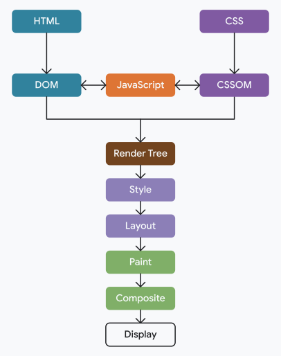
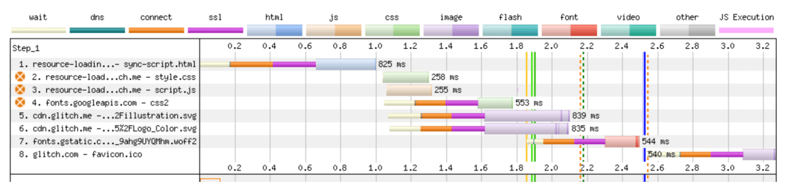
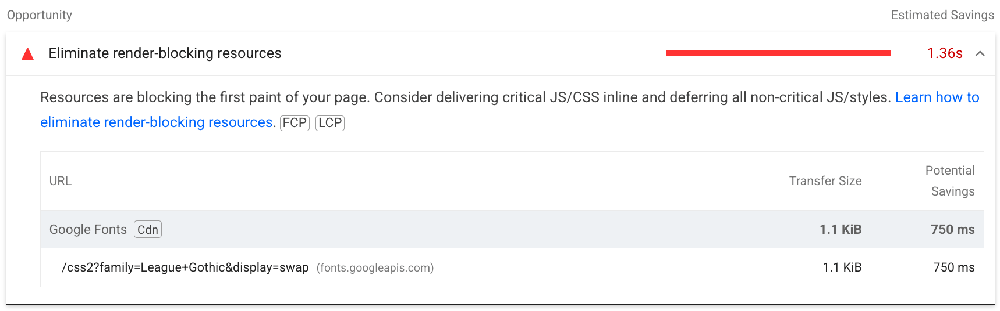
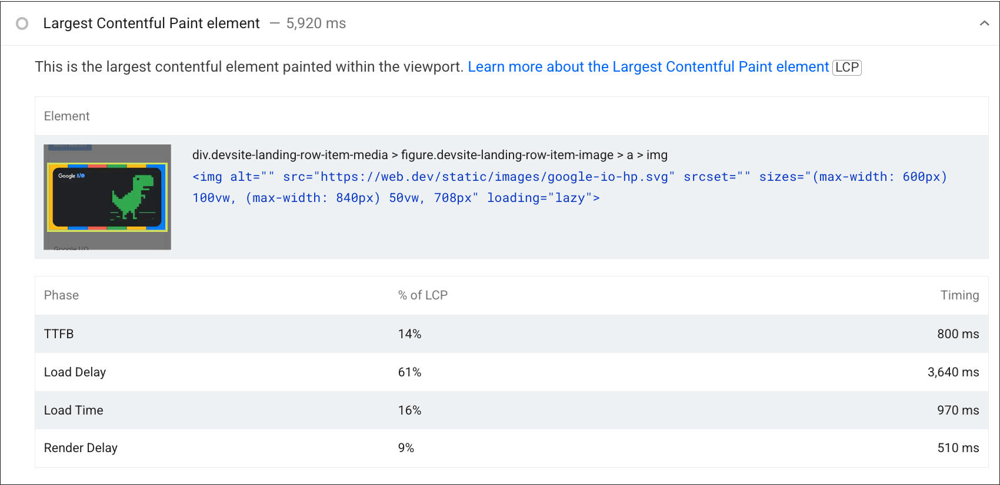
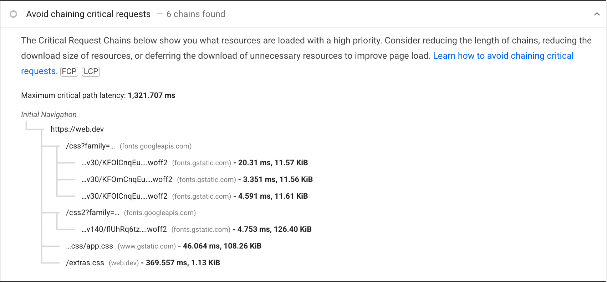
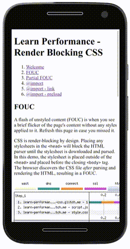
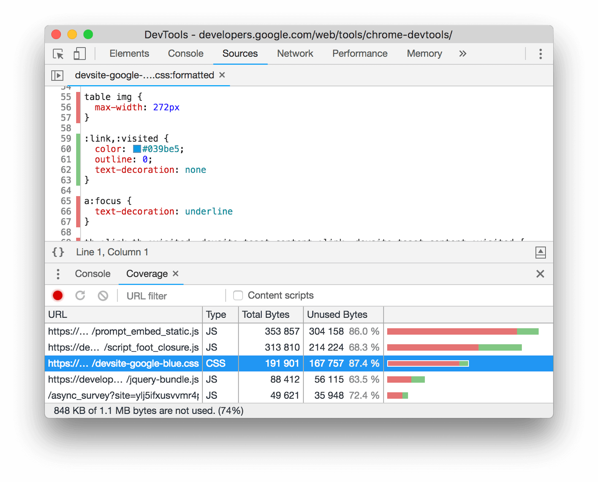
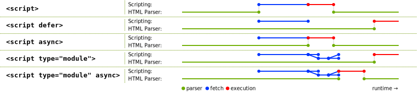

## 性能优化方向

### HTML 性能考虑

每个网站都以 HTML 文档的请求开始，这个请求在你的网站加载速度中起着很大的作用。这个模块涵盖了重要的概念，如**HTML 缓存**，**解析器阻塞**，**渲染阻塞**，等等，所以你可以确保你的网站的 HTML 的第一个请求是正确的。

#### 最小化重定向

1. **HTTP 重定向**：当客户端请求一个资源时，服务器可能会返回一个重定向响应，告诉客户端资源已经被移动到新的位置。重定向有两种类型：永久重定向（301 Moved Permanently）和临时重定向（302 Found）。永久重定向表示资源已经被永久地移动到新的位置，而临时重定向表示资源只是暂时地移动到新的位置。
2. **重定向的影响**：重定向会减慢页面加载速度，因为它需要浏览器在新的位置发起额外的 HTTP 请求来获取资源。
3. **重定向的类型**：有两种类型的重定向：同源重定向和跨源重定向。同源重定向是在你的源（origin）内部发生的，你可以完全控制这种重定向。跨源重定向是由其他源发起的，你通常无法控制这种重定向。
4. **跨源重定向**：跨源重定向通常被广告、URL 缩短服务和其他第三方服务使用。虽然你无法控制跨源重定向，但你仍然应该避免多次重定向，例如，一个广告链接到一个 HTTP 页面，然后该页面又重定向到其 HTTPS 等价物，或者一个跨源重定向到达你的源，但然后触发了一个同源重定向。

常见的同一原始重定向模式是将用户从尾声结尾的 URL 重定向到非拖动斜线等效或 vice-versa，例如，将用户从 example.com/page/重定向到 example.com/page。在页面之间创建内部链接时，需要避免链接到以重定向响应的页面，并直接链接到正确的位置。

**措施：**

1. **避免不必要的重定向**：首先，你应该检查你的网站是否有不必要的重定向。例如，如果你有一个页面 A，它重定向到页面 B，然后页面 B 又重定向到页面 C，那么你应该直接将页面 A 重定向到页面 C，避免中间的重定向。
2. **使用 HTTP/2**：HTTP/2 支持服务器推送，这意味着服务器可以在浏览器请求资源之前就将资源发送给浏览器。这可以减少由于重定向而产生的额外 HTTP 请求。
3. **预加载资源**：你可以使用 `<link rel="preload">` 标签来预加载重定向后的资源。这样，当浏览器遇到重定向时，它已经预加载了重定向后的资源，从而减少了加载时间。
4. **使用 HSTS**：如果你的网站支持 HTTPS，你可以使用 HTTP Strict Transport Security (HSTS) 来避免 HTTP 到 HTTPS 的重定向。HSTS 告诉浏览器只使用 HTTPS 来访问你的网站，从而避免了重定向。
5. **优化广告和第三方服务**：如果你的网站使用了广告或第三方服务，你应该确保它们不会产生不必要的重定向。你可以与这些服务的提供商联系，要求他们优化他们的重定向。

#### 缓存 HTML 响应

缓存**HTML**响应很困难，因为响应可能包括指向其他关键资源（例如**CSS**，**JavaScript**，**图像**和**其他资源**类型）的链接。这些资源可能在其各自的文件名中包含独特的**指纹**，该指纹根据文件的内容更改。这意味着的缓存的 HTML 文档可能会在部署后变成陈旧，因为它将包含对过时的子资源的引用。

尽管如此，较短的缓存生命周期比不缓存更有好处，比如允许在**CDN**上缓存资源，减少来自源服务器和浏览器的请求数量，允许重新验证资源，而不是再次下载资源。此方法最适合在任何上下文中都不会更改的**静态内容**，并且可以将缓存资源的适当时间设置为认为合适的分钟数。5 分钟的静态 HTML 资源是一个安全的赌注，并确保定期更新不会被忽视。

如果页面的 HTML 内容以某种方式**个性化**（例如对身份验证的用户）进行个性化，那么很可能根本不想缓解（安全性和新鲜度）。如果用户的浏览器缓存 HTML 响应，则无法使缓存无效。因此，最好避免在这种情况下完全缓存 HTML。

缓存 HTML 的一种谨慎的方法是使用 ETag 或 Last-Modified 响应头。ETag 也被称为实体标记头，它是唯一表示所请求资源的标识符，通常使用资源内容的散列

每当资源发生变化时，必须生成一个新的 ETag 值。在后续请求中，浏览器通过 If-None-Match 请求头发送 ETag 值。如果服务器上的 ETag 与浏览器发送的 ETag 匹配，则服务器响应 304 Not Modified 响应，浏览器使用缓存中的资源。虽然这仍然会导致网络延迟，但 304 Not Modified 响应比整个 HTML 资源要小得多。

但是，重新验证资源的新鲜度所涉及的网络延迟仍然是它自己的缺点。与 web 开发的许多其他方面一样，权衡和妥协是不可避免的。以这种方式缓存 HTML 的额外努力是否值得，或者最好是保持安全，根本不需要缓存 HTML 内容，这取决于。

#### 测量服务器响应时间

如果未缓存响应，则服务器的响应时间高度依赖于托管服务提供商和后端应用程序堆栈。提供动态生成响应（例如从数据库获取数据）的网页很可能比静态网页具有更高的 TTFB，静态网页可以立即提供，而无需在后端花费大量计算时间。显示加载微调器，然后在客户端获取所有数据，将工作从更可预测的服务器端环境转移到可能不可预测的客户端环境。最小化客户端工作量通常会导致改进以用户为中心的指标。

如果用户在现场遇到缓慢的 TTFB，可以通过使用 `Server-Timing` 响应标头来公开有关在服务器上花费时间的信息：

```bash
Server-Timing: auth;dur=55.5, db;dur=220
```

`Server-Timing` 标头的值可以包含多个指标，以及每个指标的持续时间。然后，可以使用导航计时 API 从现场用户那里收集这些数据，并进行分析以查看用户是否遇到延迟。在前面的代码片段中，响应标头包括两个计时：

- 对用户进行身份验证的时间 （ `auth` ），耗时 55.5 毫秒。
- 数据库访问时间 （ `db` ），耗时 220 毫秒。

> 可以在优化 TTFB 指南中找到有关 `Server-Timing` 响应标头的更多信息。
>
> https://web.dev/articles/optimize-ttfb#understanding_high_ttfb_with_server_timing

可能还想查看的托管基础设施，并确认有足够的资源来处理的网站收到的流量。共享主机提供商通常容易受到高 TTFB 的影响，而提供更快响应时间的专用解决方案可能成本更高。

> 可以在 ismyhostfastyet.com 比较热门托管服务提供商的 TTFB。这些数据由从 Chrome 用户体验报告 （CrUX） 数据集中收集的真实用户体验组成。

#### 压缩

基于文本的响应（如 HTML、JavaScript、CSS 和 SVG 图像）应进行压缩，以减少其在网络上的传输大小，以便更快地下载。使用最广泛的压缩算法是 gzip 和 Brotli。Brotli 比 gzip 提高了大约 15% 到 20%。

压缩通常由大多数网络托管服务提供商自动设置，但如果能够自己配置或调整压缩设置，则需要考虑一些重要事项：

- 尽可能使用 Brotli。如前所述，Brotli 比 gzip 提供了相当明显的改进，并且所有主流浏览器都支持 Brotli。尽可能使用 Brotli，但如果的网站在旧版浏览器上被大量用户使用，请确保使用 gzip 作为后备，因为任何压缩都比完全没有压缩好。
- 文件大小很重要。非常小的资源（小于 1 KiB）不能很好地压缩，有时甚至根本不压缩。任何类型的数据压缩的有效性都取决于压缩算法可以处理的大量数据，以便找到更多可压缩的数据位。文件越大，压缩效果越好，但是，不要仅仅因为可以更有效地压缩资源而提供非常大的资源。大型资源（例如 JavaScript 和 CSS）在浏览器解压缩后需要花费更多时间来解析和评估它们，并且即使它们只是略有变化，也可能会更频繁地更改，因为任何更改都会导致不同的文件哈希
- 了解动态压缩与静态压缩。动态压缩和静态压缩是何时应压缩资源的不同方法。动态压缩在请求资源时压缩资源，有时在每次请求资源时都会压缩资源。另一方面，静态压缩会提前压缩文件，不需要在请求时执行压缩。静态压缩消除了压缩本身所涉及的延迟，在动态压缩的情况下，延迟可能会增加服务器响应时间。静态资源（如 JavaScript、CSS 和 SVG 图像）应静态压缩，而 HTML 资源（尤其是为经过身份验证的用户动态生成的资源）应动态压缩。
- 自行进行压缩具有挑战性，通常最好让内容分发网络 （CDN）（将在下一节中讨论）为处理此问题。但是，了解这些概念可以帮助辨别托管服务提供商是否正确使用压缩。这些知识可以帮助找到改进压缩设置的机会，以便它们为的网站带来最大的好处。

#### 内容分发网络

内容分发网络 （CDN） 是一种分布式服务器网络，用于缓存**源服务器**中的资源，然后从物理上更接近用户的边缘服务器为资源提供服务。与用户的物理距离减少了往返时间 （RTT），而 HTTP/2 或 HTTP/3、缓存和压缩等优化使 CDN 能够比从源服务器获取内容更快地提供内容。在某些情况下，使用 CDN 可以显着改善网站的 TTFB。

### 关键路径

> 本模块涵盖了浏览器**如何渲染网页**背后的一些理论，特别是完成**页面初始渲染**所需的内容

**关键渲染路径**是 web 性能中的一个概念，用于处理页面在浏览器中初始呈现的速度。本模块将介绍关键渲染路径背后的理论，涵盖诸如

- **渲染阻塞**
- **解析器阻塞**

资源等概念，以及它们如何在页面在浏览器中显示的速度中发挥关键作用。

> 关键路径

关键呈现路径是指在网页开始在浏览器中呈现之前所涉及的步骤。要呈现页面，浏览器需要 HTML 文档本身以及呈现该文档所需的所有关键资源。

#### 渐进式渲染

web 本质上是**分布式**的。与使用前安装的本机应用程序不同，浏览器不能依赖于具有呈现页面所需的所有资源的网站。因此，浏览器非常擅长逐步呈现页面。本机应用通常有一个安装阶段，然后是一个运行阶段。但是，对于网页和 Web 应用程序，这两个阶段之间的界限要少得多，并且浏览器在设计时专门考虑到了这一点。

一旦浏览器拥有渲染页面的资源，它通常会开始这样做

- 何时渲染？
- 什么时候为时过早？

如果浏览器在只有一些 HTML 时尽快渲染，但在它没有任何 CSS 或必要的 JavaScript 之前，那么页面将暂时看起来破碎，并在最终渲染中发生很大变化。这比最初在一段时间内呈现空白屏幕更糟糕，直到浏览器拥有提供更好用户体验的初始呈现所需的更多资源。

另一方面，如果浏览器等待所有资源可用，而不是进行任何顺序渲染，那么用户将等待很长时间;

如果页面在更早的时间点可用，则通常不必要

浏览器需要知道它应该等待的**最小资源数**，以避免呈现明显损坏的体验。另一方面，在向用户显示某些内容之前，浏览器也不应等待超过必要的时间。浏览器在执行**初始渲染之前**执行的一系列步骤称为关键渲染路径。

了解关键渲染路径有助于提高 Web 性能，确保不会阻止初始页面呈现超过必要的范围。与此同时，通过从关键渲染路径中删除初始渲染的必要资源，也不要让渲染过早发生，这一点也很重要。

#### 步骤

关键渲染路径的步骤如下：

1. 从 HTML 构造文档对象模型 （DOM）
2. 从 CSS 构造 CSS 对象模型 （CSSOM）
3. 应用任何更改 DOM 或 CSSOM 的 JavaScript
4. 从 DOM 和 CSSOM 构造**渲染树**
5. 在页面上执行**样式**和**布局**操作，以查看哪些元素适合何处
6. **绘制**内存中元素的像素
7. 如果像素中的任何一个重叠，则**合成**像素
8. 将所有生成的像素物理**绘制**到屏幕上

用图表示



只有在完成所有这些步骤后，用户才会在屏幕上看到内容。

> 这些步骤更多详情，移步：https://developer.chrome.com/articles/renderingng-architecture

此渲染过程会发生多次；

初始呈现会调用此过程，但随着更多影响页面呈现的资源可用，浏览器将重新运行此过程（或者可能只是其中的一部分）以更新用户看到的内容；

关键渲染路径侧重于先前为初始渲染概述的过程，并依赖于该过程所需的关键资源。

#### 关键资源

那有哪些关键资源呢？

浏览器需要等待下载一些关键资源，然后才能完成**初始渲染**。这些资源包括：

- HTML 的一部分
- `<head>` 元素中的 CSS（阻塞渲染）
- `<head>` 元素中的 JavaScript（阻塞渲染 ）

一个关键点是浏览器以**流方式**处理 HTML。一旦浏览器获取页面 HTML 的任何部分，浏览器就会开始处理它；

然后，浏览器可以（并且经常这样做）决定在接收页面的其余部分之前很好地呈现它；

重要的是，对于初始渲染，浏览器通常不会等待：

- 所有 HTML
- 字体
- 图像
- `<head>` 元素之外的非渲染阻塞 JavaScript（例如， 放置在 HTML 末尾的`<script>` 元素）
- `<head>` 元素外部的非渲染阻塞 CSS，或属性 `media` 值不适用于当前视口的 CSS

**字体和图像**通常被浏览器视为在后续页面重新呈现期间要**填充**的内容，因此它们不需要保留初始呈现；

但是，这可能意味着在初始渲染中会留下**空白区域**，而文本则隐藏在等待字体上，或者直到图像可用；

更糟糕的是，当没有为某些类型的内容预留足够的空间时（尤其是当 HTML 中没有提供图像尺寸时），页面的布局可能会在稍后加载此内容时发生变化；

用户体验的这一方面通过累积布局偏移 （CLS） 指标来衡量；

`<head>` 元素是处理关键渲染路径的关键；

优化 `<head>` 元素的内容是 Web 性能的一个关键方面。但是，要了解关键呈现路径，只需要知道 `<head>` 元素包含有关页面及其资源的元数据，但用户看不到任何实际内容；

可见内容包含在 `<head>` 元素后面的 `<body>` 元素中。在浏览器可以呈现任何内容之前，它既需要要呈现的内容，也需要有关如何呈现它的元数据；

但是，并非 `<head>` 元素中引用的所有资源对于初始页面呈现都是绝对必需的，因此浏览器只会等待那些资源；

若要确定关键呈现路径中包含哪些资源，需要了解**渲染阻塞**和**解析器阻塞**。

#### 渲染阻塞

某些资源被认为非常重要，以至于浏览器会暂停页面呈现，直到处理完它们。默认情况下，CSS 属于此类别；

当浏览器看到 CSS 时（无论是 `<style>` 元素中的内联 CSS，还是 `<link rel=stylesheet href="...">` 元素指定的外部引用资源），浏览器都会避免呈现更多内容，直到它完成该 CSS 的下载和处理；

> 注意：虽然 CSS 默认情况下是渲染阻塞的，但可以通过更改 `<link>` 元素的 `media` 属性来指定与当前条件不匹配的值，将其转换为非渲染阻塞资源： `<link rel=stylesheet href="..." media=print>` 。这在过去曾被用于允许非关键 CSS 以非渲染阻塞方式加载；

仅仅因为资源阻止渲染并不一定意味着它会阻止浏览器执行任何其他操作。浏览器试图**尽可能高效**，所以当浏览器看到它需要下载一个 CSS 资源时，它会请求它并暂停渲染，但仍然会继续处理其余的 HTML，并寻找其他工作;

渲染阻塞资源（如 CSS），被发现时，会阻塞页面的所有渲染，这意味着某些 CSS 是否被渲染阻塞取决于浏览器**是否发现**了它；

某些浏览器（最初是 Firefox，现在还有 Chrome）仅阻止**渲染阻塞资源**下方的内容渲染，这意味着，对于关键的渲染阻塞路径，我们通常对 `<head>` 中的渲染阻塞资源感兴趣，因为它们有效地阻塞了整个页面的渲染；

最近的一项创新是 `blocking=render` 添加到 Chrome 105 中的属性。这允许开发人员在处理元素之前将 `<link>` 或 `<script>` `<style>` 元素显式标记为渲染阻塞，但仍允许解析器在此期间继续处理文档。

#### 解析器阻塞

**解析器阻塞资源**是那些阻止浏览器通过继续**解析 HTML** 来查找其他工作的资源；

默认情况下，**JavaScript** 是解析器阻塞的（除非明确标记为**异步或延迟**），因为 JavaScript 可以在执行时更改 DOM 或 CSSOM。因此，浏览器不可能继续处理其他资源，直到它知道所请求的 JavaScript 对页面的 HTML 的全部影响。因此，**同步 JavaScript** 会阻止解析器；

解析器阻塞资源实际上也是渲染阻塞，由于解析器在完全处理之前无法继续通过解析阻塞资源，因此它无法访问和渲染其之后的内容；

浏览器可以在等待期间渲染到目前为止收到的任何 HTML，但在关键渲染路径方面，任何解析器阻塞资源 `<head>` 实际上意味着所有页面内容都被阻止渲染；

阻塞解析器可能会产生巨大的性能成本，而不仅仅是阻塞渲染，出于这个原因，浏览器将尝试通过使用称为**预加载扫描程序**的辅助 HTML 解析器来降低此成本，以便在主 HTML 解析器被阻止时下载即将到来的资源；

虽然不如实际解析 HTML 好，但它至少允许浏览器中的网络功能在被阻止的解析器之前工作，这意味着它将来不太可能再次被阻止。

#### 识别阻塞资源

许多**性能审计**工具可识别渲染和解析器阻塞资源。**WebPageTest** 在资源的 URL 左侧用**橙色圆圈**标记呈现阻塞资源：



在开始渲染之前，需要下载并处理所有渲染阻塞资源，瀑布流中的**深绿色**实线表示；

**Lighthouse** 还突出显示了阻塞渲染资源，但方式更微妙，并且仅当资源实际延迟页面渲染时。这有助于避免误报，可以最大程度地减少渲染阻塞。通过 Lighthouse 运行与前面的 WebPageTest 图相同的页面 URL 只会将其中一个样式表标识为渲染阻塞资源；



#### 优化关键渲染路径

优化关键渲染路径涉及：

- 减少接收 HTML 的时间（由上一个模块中详述的首字节时间 （TTFB） 指标表示）
- 减少渲染阻塞资源的影响

很长一段时间以来，**关键渲染路径**一直关注**初始渲染**。然而，已经出现了更多**以用户为中心**的 Web 性能指标，这让人质疑**关键渲染路径**的终点应该是第一次绘制，还是随后的更令人满意的绘制之一。

另一种观点是将时间集中在**最大内容绘制** （LCP） 之前，甚至是**第一个内容绘制** （FCP） - 作为**内容渲染路径**（或其他人可能称之为关键路径）的一部分。在这种情况下，可能需要包含**不一定阻塞**的资源（这是关键渲染路径的典型定义），但对于渲染内容绘制是必需的。

无论对“关键”的确切定义如何，了解是什么阻碍了任何**初始渲染**和**关键内容**都很重要；

第一种绘制测量为用户渲染任何内容的第一个可能机会。理想情况下，这应该是有意义的东西，而不是像背景颜色这样的东西，但即使它是非内容性的，向用户呈现一些东西仍然有价值，这是衡量传统定义的关键渲染路径的论据。同时，衡量主要内容**何时呈现**给用户也有价值；

#### 识别关键渲染路径

许多工具可以识别 **LCP 元素**及其渲染时间。除了 LCP 元素之外，**Lighthouse** 还将帮助识别 LCP 阶段以及每个阶段所花费的时间，以帮助了解优化工作的最佳重点：



对于更复杂的站点，Lighthouse 还在单独的审核中突出显示了关键请求链：



此 Lighthouse 审核会观察以**高优先级**加载的所有资源，因此它包括 Chrome 设置为高优先级资源的 Web 字体和其他内容，即使它实际上并不阻塞渲染。

### 优化资源加载

当页面加载时，它的 HTML 中引用了许多资源，这些资源通过 CSS 提供了页面的外观和布局，并通过 JavaScript 提供了其交互性。在本模块中，将介绍与这些资源相关的一些重要概念，以及它们如何影响页面的加载时间。

#### 渲染阻塞

CSS 是一种渲染阻塞资源，因为它会阻止浏览器渲染任何内容，直到构建 CSS 对象模型 (CSSOM)；

浏览器会阻止渲染以防止出现**无样式内容闪现** (FOUC)，从用户体验的角度来看，这是不可取的。



可以在其中看到没有任何样式的页面。随后，一旦页面的 CSS 完成从网络的加载，就会应用所有样式，并且页面的**无样式版本**立即替换为样式版本;

一般来说，FOUC 是通常看不到的东西，但理解这个概念很重要，这样就可以知道为什么浏览器会阻止页面渲染，直到 CSS 下载并应用到页面为止;

渲染阻塞不一定是不可取的，但可以通过保持 CSS 优化来最大程度地缩短**渲染阻塞**的持续时间；

#### 解析器阻塞

解析器阻塞资源会中断 HTML 解析器，例如没有 `async` 或 `defer` 属性的 `<script>` 元素；

当解析器遇到 `<script>` 元素时，浏览器需要先解析并执行脚本，然后再继续解析 HTML 的其余部分。这是设计使然，因为脚本可能会在 DOM 仍在构建期间修改或访问 DOM；

当使用外部 JavaScript 文件（没有 `async` 或 `defer` ）时，从发现文件到下载、解析和执行该文件，解析器都会被阻止。当使用内联 JavaScript 时，解析器同样会被阻塞，直到内联脚本被解析并执行为止。

> 解析器阻塞 `<script>` 还必须等待任何正在运行的渲染阻塞 CSS 资源到达并被解析，然后浏览器才能执行它。这也是设计使然，因为脚本可以访问渲染阻塞样式表中声明的样式（例如，通过使用 `element.getComputedStyle()` ）

#### 预加载扫描器

预加载扫描器是一种**辅助 HTML 解析器**形式的浏览器优化，它会扫描原始 HTML 响应，以便在主 HTML 解析器发现资源之前查找并推测性获取资源。例如，预加载扫描器将允许浏览器开始下载 `` 元素中指定的资源，即使 HTML 解析器在获取和处理 CSS 和 JavaScript 等资源时被阻止也是如此。

要利用预加载扫描器，关键资源应包含在服务器发送的 **HTML** 标记中。预加载扫描程序无法发现以下资源加载模式：

- CSS 使用 `background-image` 属性加载图像。这些图像引用位于 CSS 中，预加载扫描程序无法发现；
- 使用 JavaScript 注入 DOM 中的 `<script>` 元素标记形式的动态加载脚本或使用动态 `import()` 加载的模块；
- 使用 **JavaScript** 在客户端呈现 HTML。此类标记包含在 JavaScript 资源的字符串中，预加载扫描器无法发现；
- CSS `@import` 声明；

这些资源加载模式都是**后期发现**的资源，因此不会从预加载扫描程序中受益。尽可能避免它们。但是，如果无法避免此类模式，可以使用 `preload` 提示来避免资源发现延迟；
CSS 决定页面的呈现和布局。如前所述，CSS 是一种渲染阻塞资源，因此优化 CSS 可能会对整个页面加载时间产生相当大的影响；

#### CSS

CSS 决定页面的呈现和布局。如前所述，CSS 是一种**渲染阻塞**资源，因此优化 CSS 可能会对整个页面加载时间产生相当大的影响。

##### 压缩

缩小 CSS 文件可以减小 CSS 资源的**文件大小**，从而加快下载速度。这主要是通过从源 CSS 文件中删除内容（例如空格和其他不可见字符）并将结果输出到新优化的文件来完成的：

```bash
/* 未压缩: */

/* Heading 1 */
h1 {
  font-size: 2em;
  color: #000000;
}

/* Heading 2 */
h2 {
  font-size: 1.5em;
  color: #000000;
}
```

```css
/* 压缩后 */
h1,
h2 {
  color: #000;
}
h1 {
  font-size: 2em;
}
h2 {
  font-size: 1.5em;
}
```

> 一些高级 CSS 缩小器可能会采用额外的优化，例如将冗余规则合并到多个选择器中。然而，这种高级 CSS 优化可能存在风险，并且可能无法在所有 CSS 方法或设计系统中正常工作或扩展。

从最基本的形式来看，CSS 缩小是一种有效的优化，可以提高网站的 FCP，在某些情况下甚至可以提高 LCP

**bundlers**等工具可以在生产版本中自动为执行此优化。

##### 删除不使用的 css

在渲染任何内容之前，浏览器需要**下载并解析**所有样式表；

完成解析所需的时间还包括**当前页面未使用的样式**；

如果使用的**bundlers**将所有 CSS 资源组合到一个文件中，用户可能会下载比渲染当前页面所需的更多 CSS；

要发现当前页面未使用的 CSS，请使用 **Chrome DevTools** 中的 **Coverage** 工具；



> _Chrome DevTools 中的**Coverage**工具对于检测当前页面未使用的 CSS（和 JavaScript）非常有用。它可用于将 CSS 文件拆分为多个资源以由不同页面加载，而不是传送可能延迟页面渲染的更大的 CSS 包。_

##### 避免使用 `@import`

虽然看起来很方便，但应该避免在 CSS 中使用 `@import` 声明：

```css
/* Don't do this: */
@import url("style.css");
```

与 HTML 中 `<link>` 元素的工作方式类似，CSS 中的 `@import` 声明允许从样式表中导入**外部 CSS 资源**；

这两种方法之间的主要区别在于 HTML `<link>` 元素是 HTML 响应的一部分，因此比通过 `@import` 声明下载的 CSS 文件发现得**更快**；

为了发现 `@import` 声明，必须首先下载包含它的 CSS 文件；

这会产生所谓的**请求链**，就 CSS 而言，它会**延迟**页面初始渲染所需的时间。另一个缺点是使用 `@import` 声明加载的样式表无法被**预加载扫描器**发现，因此成为后期发现的**渲染阻塞**资源；
在大多数情况下，可以使用 `<link rel="stylesheet">` 元素替换 `@import` 。 `<link>` 元素允许同时下载样式表并减少总体加载时间，这与连续下载样式表的 `@import` 声明相反。

> 注意：如果需要使用 `@import` （例如级联层或第三方样式表），可以通过对导入的样式表使用 `preload` 指令来减轻延迟。此外，CSS 预处理器（例如 SASS 或 LESS）通常使用 `@import` 语法作为开发人员体验改进的一部分，允许单独且更加模块化的源文件。但是，当 CSS 预处理器遇到 `@import` 声明时，引用的文件将被捆绑并写入单个样式表，从而避免 `@import` 在纯 CSS 中导致的连续请求损失。

##### 内联关键 CSS

下载 CSS 文件所需的时间会增加页面的 FCP。在文档 `<head>` 中**内联关键样式**可以消除对 CSS 资源的网络请求，并且如果操作正确，可以在用户的浏览器缓存未准备就绪时缩短初始加载时间；

剩余的 CSS 可以异步加载，或者附加在 `<body>` 元素的末尾。

> 关键词：关键 CSS 是指渲染初始视口中可见内容所需的样式。最初的视口概念有时被称为“首屏”。页面上的其余内容保持无样式，而其余 CSS 则异步加载。

重要提示：提取和维护关键样式可能很困难。

- 应该包含哪些样式？
- 应定位哪个视口？
- 该过程可以自动化吗？
- 如果用户在非关键 CSS 加载之前向下滚动，会发生什么情况？
- 如果用户遇到 FOUC，他们会受到什么影响？

这些都是应该考虑的好问题，因为网站的架构可能会使使用关键 CSS 变得异常困难;

然而，在某些特定情况下，性能优势可能值得付出努力，因此请调查关键 CSS 是否是网站的可行选择！

缺点是，内联大量 CSS 会向初始 HTML 响应添加更多字节;

由于 **HTML 资源**通常无法缓存很长时间（或根本无法缓存），这意味着对于可能在外部样式表中使用相同 CSS 的后续页面，不会缓存内联 CSS;

测试并衡量页面的性能，以确保所做的权衡是值得的。

#### javaScript

JavaScript 驱动了网络上的大部分交互性，但它是有代价的;

传送过多的 JavaScript 可能会使的网页在页面加载期间响应缓慢，甚至可能导致响应速度问题，从而减慢交互速度，这两种情况都会让用户感到沮丧。

当加载不带 `defer` 或 `async` 属性的 `<script>` 元素时，浏览器会阻止解析和渲染，直到下载、解析并执行脚本;

类似地，**内联脚本**会阻塞解析器，直到脚本被解析并执行。

##### async 和 defer

`async` 和 `defer` 允许加载外部脚本而不阻塞 HTML 解析器，而带有 `type="module"` 的脚本（包括内联脚本）会自动延迟。但是， `async` 和 `defer` 有一些需要理解的差异；



使用 `async` 加载的脚本在下载后立即解析并执行，而使用 `defer` 加载的脚本在 HTML 文档解析完成时执行 - 这与浏览器的 `DOMContentLoaded` 事件；

此外， `async` 脚本可能会无序执行，而 `defer` 脚本则按照它们在标记中出现的顺序执行；

默认情况下，使用 `type="module"` 属性加载的脚本会被**延迟**，而通过使用 **JavaScript** 将 `<script>` 标记注入 DOM 来加载的脚本的行为类似于 `async` 脚本；

##### 客户端渲染

一般来说，应该避免使用 **JavaScript** 来呈现任何**关键内容**或页面的 **LCP 元素**。这称为客户端渲染，是单页应用程序 (SPA) 中广泛使用的一种技术；

**JavaScript** 呈现的标记会绕过预加载扫描器，因为客户端呈现的标记中包含的资源无法被它发现。这可能会延迟关键资源的下载，例如 LCP 图像;

浏览器仅在脚本执行后开始下载 LCP 图像，并将元素添加到 DOM。反过来，脚本只有在被发现、下载和解析后才能执行。这被称为**关键请求链**，应该避免;

此外，与响应导航请求而从服务器下载的标记相比，使用 JavaScript 呈现标记更有可能生成较长的任务;

广泛使用 HTML 的客户端呈现会对**交互延迟**产生负面影响。在页面 DOM 非常大的情况下尤其如此，当 JavaScript 修改 DOM 时，这会触发大量的渲染工作。

##### 缩小化

与 CSS 类似，缩小 JavaScript 可以减少脚本资源的**文件大小**。这可以加快下载速度，从而使浏览器**更快**地进入解析和编译 JavaScript 的过程；

当 JavaScript 被缩小时，它不仅会删除**空格**、**制表符**和**注释**等内容，而且源 JavaScript 中的符号也会被缩短；

这个过程有时被称为**丑化**。要查看差异，请获取以下 JavaScript 源代码：

```js
// 丑化前
export function injectScript() {
  const scriptElement = document.createElement("script");
  scriptElement.src = "/js/scripts.js";
  scriptElement.type = "module";

  document.body.appendChild(scriptElement);
}
```

```js
// 丑化后
export function injectScript() {
  const t = document.createElement("script");
  (t.src = "/js/scripts.js"), (t.type = "module"), document.body.appendChild(t);
}
```

在前面的代码片段中，可以看到源码中可读的变量 `scriptElement` 被缩短为 `t` ；

当应用于大量脚本时，节省的空间可能相当可观，而且不会影响网站的生产 JavaScript 提供的功能；

如果使用**bundler**来处理网站的源代码，则通常会在**生产版本**中自动完成丑化；

丑化器（例如 **Terser**）也是高度**可配置**的，它允许调整丑化算法的激进程度以实现最大程度的节省；

然而，任何丑化工具的默认设置通常足以在**输出大小**和**功能保留**之间取得适当的平衡；

### 资源提示

资源提示指示浏览器**提前**执行某些操作，以提高加载性能。资源提示可以执行一些操作，例如执行**早期 DNS 查找**、提前**连接到服务器**，甚至在浏览器通常发现资源之前获取资源；

#### preconnect

- 用途--跨域资源
- 例子--谷歌字体
- 注意--crossorigin

`preconnect` 提示用于建立与获取关键资源的另一个源的连接。例如，可能将图像或资产托管在 **CDN** 或其他跨域上：

```html
<link rel="preconnect" href="https://example.com" />
```

通过使用 `preconnect` ，预计浏览器计划在不久的将来连接到特定的**跨源服务器**，并且浏览器应尽快打开该连接，最好是在等待 **HTML 之前解析器**或**预加载**扫描器来执行此操作；

如果页面上有大量**跨域资源**，请对当前页面最关键的资源使用 `preconnect` ；

`preconnect` 的一个常见用例是 Google 字体。 Google Fonts 建议`preconnect` 访问提供 `@font-face` 声明的 `https://fonts.googleapis.com` 域以及提供字体文件的 `https://fonts.gstatic.com` 域；

`crossorigin` 属性用于指示是否必须使用跨源资源共享 (CORS) 来获取资源。使用 `preconnect` 提示时，如果从源端下载的资源使用 CORS（例如字体文件），则需要将 `crossorigin` 属性添加到 `preconnect` 提示；

> 注意：如果省略“crossorigin”属性，浏览器在下载字体文件时会打开一个新连接，并且不会重用通过“preconnect”提示打开的连接。

#### dns-prefetch

- 用途--dns 查找（不连接），比**preconnect**成本低
- 例子--dnstradamus

虽然尽早打开与**跨域服务器**的连接可以显着缩短初始页面加载时间，但同时建立与许多跨域服务器的连接可能不合理或不可能；

如果担心可能过度使用 `preconnect` ，则成本低得多的资源提示是 `dns-prefetch` 提示；

根据其名称， `dns-prefetch` 不会建立与跨域服务器的连接，而只是提前执行 **DNS 查找**；

当域名解析为其基础 IP 地址时，就会发生 DNS 查找，虽然设备和网络级别的 DNS 缓存层有助于使这一过程总体上快速，但仍然需要一些时间；

DNS 查找相当便宜，并且由于其成本相对较低，因此在某些情况下它们可能是比 `preconnect` 更合适的工具；

特别是，在导航到你认为用户可能会访问的其他网站的链接的情况下，它可能是一个理想的资源提示；

**dnstradamus** 就是这样一种工具，它使用 JavaScript 自动执行此操作，并在指向其他网站的链接滚动到用户视口时使用 Intersection Observer API 将 `dns-prefetch` 提示注入当前页面的 HTML；

#### preload

- 用途--提前获取后期的关键资源
- 例子--字体、css 文件、background-image 资源
- 注意--img、imagesrcset、src、两次

`preload` 指令用于发起对渲染页面所需资源的**早期请求**：

```html
<link rel="preload" href="/lcp-image.jpg" as="image" />
```

`preload` 指令应仅限于后期发现的关键资源，最常见的用例是：

- 字体文件
- 通过 `@import` 声明获取的 CSS 文件
- 可能是最大内容绘制 (LCP) 候选者的 CSS `background-image` 资源

在这种情况下，**预加载扫描程序**不会发现这些文件，因为资源是在外部资源中引用的；

> 注意：如果使用 `preload` 下载由 `` 元素指定的图像（该元素根据用户的视口而变化），请务必将 `imagesrcset` 属性添加到 `preload` 提示下载当前视口的正确图像。还应该排除 `src` 属性，以便不支持响应式预加载的浏览器不会下载后备图像。

与 `preconnect` 类似，如果要预加载 **CORS 资源**（例如字体），则 `preload` 指令需要 `crossorigin` 属性;

如果不添加 `crossorigin` 属性（或为非 CORS 请求添加该属性），则浏览器会下载该资源**两次**，从而浪费了本来可以更好地用于其他资源的带宽;

```html
<link rel="preload" href="/font.woff2" as="font" crossorigin />
```

> 重要提示：如果指令的 `<link>` 元素上缺少 `as` 属性，则 `preload` 指令中指定的资源将被下载两次。

**注意：** `preload` 指令是一种非常强大的性能优化——事实上，它可能被过度使用

使用 `preload` 指令下载的资源实际上是以**高优先级**下载的，并且如果过度使用， `preload` 可能会产生**带宽争用**，从而对页面加载速度产生负面影响;

#### prefetch

- 用途--获取未来导航资源（推测性）
- 例子--导航到某个页面的 css

`prefetch` 指令用于发起对可能用于未来导航的资源的低优先级请求：

```html
<link rel="prefetch" href="/next-page.css" as="style" />
```

该指令很大程度上遵循与 `preload` 指令相同的格式，只是 `<link>` 元素的 `rel` 属性使用 `"prefetch"` 值;

然而，与 `preload` 指令不同， `prefetch` 在很大程度上是**推测性**的，因为你正在为将来可能发生或可能不会发生的导航启动资源获取。

有时 `prefetch` 可能是有益的 - 例如，如果已确定网站上大多数用户都会遵循的用户流程，则 `prefetch` 用于渲染关键资源对于那些未来的页面可以帮助减少它们的加载时间；

> 注意：考虑到 `prefetch` 的推测性，它的使用会带来潜在的缺点，如果用户没有导航到最终需要预取资源的页面，则用于获取资源的数据可能会被闲置。依靠的网站使用模式的分析或其他数据源来自行决定使用 `prefetch` 是否是一个好主意。或者，可以使用 `Save-Data` 提示为已指定减少数据使用首选项的用户选择退出预取。

#### 获取优先级

可以使用 `Fetch Priority API` through its `fetchpriority` 属性来增加资源的优先级；

可以与 `<link>` 、 `` 和 `<script>` 元素一起使用：

```html
<div class="gallery">
  <div class="poster">
    
  </div>
  <div class="thumbnails">
    
    
    
  </div>
</div>
```

> 重要提示：该 `fetchpriority` 属性在用于网页的 LCP 图片时特别有效。通过提高具有此属性的 LCP 图像的优先级，可以以相对较少的工作量提高页面的 LCP。

默认情况下，图像的获取优先级较低;

布局后，如果发现图像在初始视口内，则优先级将增加到高优先级;

在前面的 HTML 代码段中， `fetchpriority` 立即告诉浏览器以高优先级下载较大的 LCP 图像，而以较低优先级下载不太重要的**缩略图**图像;

**现代浏览器**分两个阶段加载资源。第一阶段保留给**关键资源**，并在**下载并执行**所有阻塞脚本后结束，在此阶段，低优先级资源的下载可能会延迟;

通过使用 `fetchpriority="high"` ，可以提高资源的优先级，使浏览器能够在第一阶段下载它;

### 图片

如今，在许多网页上传输的数据中，图像占了很大一部分。本模块涵盖了如何优化图像，以及如何有效地为它们提供服务，以便无论用户的设备如何，都可以最大限度地减少浪费的字节。

图像通常是网络上**最重和最普遍**的资源，因此，优化图像可以显着提高网站的性能；

在大多数情况下，优化图像意味着通过发送**更少的字节**来减少网络时间，但也可以通过提供**适合用户设备大小**的图像来优化发送给用户的字节量；

使用图像的方式：

- img
- picture
- css 的 background-image
- svg

**注意：**

在某些有限的情况下，SVG 图像可以通过将 `<svg>` 标记直接插入到页面的 HTML 中来直接内联到页面中。这允许在 JavaScript 中直接访问 SVG 的子元素；

无论是内联 SVG 还是从 HTML `` 元素加载 SVG，了解何时使用 SVG 图像都会有所帮助；

由于 SVG 是一种矢量图像格式，因此它们在图像内容是**线条艺术**、**图表**和**图表**以及其他没有精细摄影细节的情况下最有用；

如果在网站上使用 SVG 图像，请记住 SVG 格式是基于文本的，因此需要使用缩小和压缩等技术；

使用 **svgo**（一种基于 Node.js 的 SVG 优化工具）也可以进行有损优化；

#### 图像尺寸

在使用图像资源时，可以执行的第一个优化是以正确的大小显示图像 - 在这种情况下，术语大小是指图像的尺寸；

在不考虑其他变量的情况下，在 500 x 500 像素**容器**中显示的图像的最佳大小为 500 x 500 像素；

例如，使用 1000 像素的正方形图像意味着容器也要 1000 像素；

但是，选择合适的图像尺寸涉及许多变量，因此在每种情况下选择合适的图像尺寸的任务都非常复杂；

2010 年，当 iPhone 4 发布时，**屏幕分辨率** （640x960） 是 iPhone 3 （320x480） 的两倍；

然而，iPhone 4 屏幕的物**理尺寸**与 iPhone 3 大致相同；

以更高的分辨率显示所有内容会使文本和图像明显变小 - 准确地说是以前大小的一半；

相反，**1 个像素变成了 2 个设备像素**；

这称为**设备像素比** （DPR），iPhone 4 以及之后发布的许多 iPhone 机型的 DPR 为 2；

如果设备的 DPR 为 2，并且图像显示在 500 x 500 像素的容器中，则 1000 像素的正方形图像（称为固有大小）现在是最佳大小；

同样，如果设备的 DPR 为 3，则 1500 像素的方形图像将是最佳大小；

> 在大多数情况下，人眼无法从 DPR 为 3 中受益，可以使用小于最佳尺寸的图像，而不会对大多数用户造成可察觉的图像质量下降。

##### srcset

该 `` 元素支持该 `srcset` 属性，该属性允许指定浏览器可能使用的图像源列表。指定的每个图像源都必须包含图像 URL 以及宽度或像素密度描述符;

```html

```

前面的 HTML 代码段使用像素密度描述符来提示浏览器在 DPR 为 1 的设备、 `image-1000.jpg` DPR 为 2 的设备以及 `image-1500.jpg` DPR 为 3 的设备上使用 `image-500.png` ;

虽然这一切看起来都很枯燥，但屏幕的 DPR 并不是为给定页面选择最佳图像的唯一考虑因素。页面的布局是另一个考虑因素;

##### sizes

仅当在所有视口上以相同的 CSS 像素大小显示图像时，上述解决方案才有效。在许多情况下，页面的布局以及容器的大小会根据用户的设备而变化;

该 `sizes` 属性允许指定一组源大小，其中每个源大小由一个**媒体条件**和一个**值**组成;

该 `sizes` 属性描述图像的预期显示大小（以 CSS 像素为单位）。当与 `srcset` 宽度描述符结合使用时，浏览器可以选择最适合用户设备的图像源；

```html

```

在前面的 HTML 代码段中，该 `srcset` 属性指定浏览器可以从中选择的候选图像列表，以逗号分隔；

列表中的每个候选项都由图像的 URL 组成，后跟表示图像**固有宽度**的语法。图像的固有大小是其尺寸；

例如，描述 `1000w` 符表示图像的固有宽度为 1000 像素宽；

使用此信息，浏览器将评估属性中的 `sizes` 媒体状况，在本例中，系统会指示设备的视口宽度超过 768 像素，则图像将以 500 像素的宽度显示；

在较小的设备上，图像以 `100vw` - 或完整视口宽度显示（类似三元表达式）；

然后，浏览器可以将此信息与 `srcset` 图像源列表相结合，以找到最佳图像；

例如，如果用户使用的移动设备的屏幕宽度为 320 像素且 DPR 为 3，则图像将显示在 `320 CSS pixels x 3 DPR = 960 device pixels` ；

在此示例中，最接近大小的图像是 `image-1000.jpg` 固有宽度为 1000 像素 （ `1000w` ）；

> 注意： `srcset` 如果没有该 `sizes` 属性，宽度描述符将不起作用。同样，如果省略 `srcset` 宽度描述符，则该 `sizes` 属性不会执行任何操作。

#### 图像格式

浏览器支持几种不同的图像文件格式，**WebP** 和 **AVIF** 等现代图像格式可能提供比 PNG 或 JPEG **更好的压缩**，使图像文件大小更小，因此下载时间更短；

通过以现代格式提供图像，可以减少资源的加载时间，这可能会导致**最大内容绘制** （LCP） 降低；

**WebP** 是一种广泛支持的格式，适用于所有现代浏览器。WebP 通常比 JPEG、PNG 或 GIF 具有更好的压缩，提供**有损**和**无损压缩**；

WebP 还支持 **Alpha 通道透明度**，即使在使用有损压缩时也是如此，这是 JPEG 解码器不提供的功能；

**AVIF** 是一种较新的图像格式，虽然它不像 WebP 那样得到广泛支持，但它确实在浏览器中享有相当不错的支持；

AVIF 支持有损和无损压缩，测试显示，在某些情况下，与 JPEG 相比，节省了 50% 以上。AVIF 还提供**广色域** （WCG） 和**高动态范围** （HDR） 功能；

#### 压缩

- 有损压缩
- 无损压缩

**有损压缩**

工作原理是通过**量化降低图像精度**，并且可以使用**色度子采样**丢弃其他颜色信息；

有损压缩在具有大量噪点和颜色的高密度图像（通常是具有**相似内容**的照片或影像）上最有效；

这是因为在如此详细的图像中，有损压缩产生的**伪影**不太可能被注意到；

但是，对于包含锐利边缘的图像（如线条艺术、类似的鲜明细节或文本），有损压缩可能效果较差；

有损压缩可以应用于 **JPEG、WebP 和 AVIF** 图像；

> 注意：使用有损压缩时，请始终确认压缩图像符合的质量标准，例如，在纯色上包含高对比度彩色文本的图像容易出现色度子采样的伪影；

**无损压缩**

通过压缩图像而**不会丢失数据**来减小文件大小;

无损压缩根据像素与其相邻像素的差异来描述像素;

无损压缩用于 GIF、PNG、WebP 和 AVIF 图像格式;

可以使用 Squoosh、ImageOptim 或图像优化服务压缩图像;

压缩时，没有适合所有情况的通用设置,推荐的方法是尝试不同的压缩级别，直到在图像**质量和文件大小**之间找到一个很好的折衷方案;

一些高级图像优化服务可以自动执行此操作，但可能并非对所有用户在经济上都可行;

#### picture

该 `<picture>` 元素使在指定多个候选图像时具有更大的灵活性：

```html
<picture>
  <source type="image/avif" srcset="image.avif">
  <source type="image/webp" srcset="image.webp">
  
</picture>
```

在 `<picture>` 元素中使用 `<source>` 元素时，可以添加对 AVIF 和 WebP 图像的支持，但如果浏览器不支持新式格式，则回退到更兼容的旧图像格式；

使用此方法，浏览器会选择指定的第一个匹配 `<source>` 元素，如果它可以以该格式呈现图像，则使用该图像；

否则，浏览器将移动到下一个指定的 `<source>` 元素；

在前面的 HTML 代码段中，AVIF 格式优先于 WebP 格式，如果既不支持 AVIF 也不支持 WebP，则回退到 JPEG 格式；

一个 `<picture>` 元素需要嵌套在其内部的 `` 元素。 `width` `height` 无论 `alt` 选择哪个 `<source>` 属性，都定义 `` 在 and 上使用；

该 `<source>` 元素还支持 `media` 、 `srcset` 和 `sizes` 属性。与前面 `` 的示例类似，它们向浏览器指示要在不同视口上选择哪个图像；

> 虽然该 `srcset` 属性为浏览器提供了有关要使用哪个图像的提示，但对元素 `<source>` 的媒体查询是浏览器要遵循的命令。

```html
<picture>
  <source
    media="(min-resolution: 1.5x)"
    srcset="/image-1000.jpg 1000w, /image-1500.jpg 1500w"
    sizes="(min-width: 768px) 500px, 100vw"
  >
  
</picture>
```

该 `media` 属性采用**媒体条件**,在前面的示例中，设备的 DPR 用作媒体条件;

DPR 大于或等于 1.5 的任何设备都将使用第一个 `<source>` 元素,该 `<source>` 元素告诉浏览器，在视口宽度超过 768 像素的设备上，所选候选图像以 500 像素宽显示;

在较小的设备上，这会占用整个视口宽度。通过组合 `media` 和 `srcset` 属性，可以更精细地控制要使用的图像；

下表对此进行了说明，其中评估了多个视口宽度和设备像素比：

| Viewport Width (pixels) | 1 DPR   | 1.5 DPR     | 2 DPR       | 3 DPR       |
| :---------------------- | :------ | :---------- | :---------- | :---------- |
| 320                     | 500.jpg | 500.jpg     | 500.jpg     | 1000-sm.jpg |
| 480                     | 500.jpg | 500.jpg     | 1000-sm.jpg | 1500-sm.jpg |
| 560                     | 500.jpg | 1000-sm.jpg | 1000-sm.jpg | 1500-sm.jpg |
| 1024                    | 500.jpg | 1000.jpg    | 1000.jpg    | 1500.jpg    |
| 1920                    | 500.jpg | 1000.jpg    | 1000.jpg    | 1500.jpg    |

```html
<picture>
  <source
    media="(min-width: 560px)"
    srcset="/image-500.jpg, /image-1000.jpg 2x, /image-1500.jpg 3x"
  >
  <source
    media="(max-width: 560px)"
    srcset="/image-500.jpg 1x, /image-1000.jpg 2x"
  >
  
</picture>
```

DPR 为 1 的设备会下载 `image-500.jpg` 图像，包括大多数桌面用户，他们以 500 像素宽的外部大小查看图像；

另一方面，DPR 为 3 的移动用户下载的可能更大 `image-1500.jpg` ，与 DPR 为 3 的桌面设备上使用的映像相同；

```html
<picture>
  <source
    media="(min-width: 560px) and (min-resolution: 1.5x)"
    srcset="/image-1000.jpg 1000w, /image-1500.jpg 1500w"
    sizes="(min-width: 768px) 500px, 100vw"
  >
  <source
    media="(max-width: 560px) and (min-resolution: 1.5x)"
    srcset="/image-1000-sm.jpg 1000w, /image-1500-sm.jpg 1500w"
    sizes="(min-width: 768px) 500px, 100vw"
  >
  
</picture>
```

在此示例中，该 `<picture>` 元素被调整为包含一个附加 `<source>` 元素，以便对具有高 DPR 的宽设备使用不同的图像：

| Viewport Width (pixels) | 1 DPR   | 1.5 DPR     | 2 DPR 2 朝鲜民主主义人民共和国 | 3 DPR       |
| :---------------------- | :------ | :---------- | :----------------------------- | :---------- |
| 320                     | 500.jpg | 500.jpg     | 500.jpg                        | 1000-sm.jpg |
| 480                     | 500.jpg | 500.jpg     | 1000-sm.jpg                    | 1500-sm.jpg |
| 560                     | 500.jpg | 1000-sm.jpg | 1000-sm.jpg                    | 1500-sm.jpg |
| 1024                    | 500.jpg | 1000.jpg    | 1000.jpg                       | 1500.jpg    |
| 1920                    | 500.jpg | 1000.jpg    | 1000.jpg                       | 1500.jpg    |

通过此附加查询，可以看到它 `image-1000-sm.jpg` 并 `image-1500-sm.jpg` 显示在小视口上；

通过这些额外的信息，可以进一步压缩图像，因为在该大小和密度下，压缩伪影并不明显，同时也不会影响桌面设备上的图像质量；

或者，通过调整 `srcset` and `media` 属性，可以避免在小视口上提供大图像：

在前面的 HTML 代码段中，宽度描述符已被删除，取而代之的是设备像素比描述符。移动设备上提供的图像仅限于 `/image-500.jpg` 或 `/image-1000.jpg` ，即使在 DPR 为 3 的设备上也是如此。

#### 管理复杂性

使用响应式图像时，会发现每个图像都有许多不同的尺寸变化和格式；

在前面的示例中，使用了每种大小的变体，但不包括 AVIF 和 WebP；

应该有多少个变体？像许多工程问题一样，答案往往是“视情况而定”；

另一方面，如果存在许多变体，则每个变体都需要另一个**缓存条目**；

如果变体的缓存条目已过期，并且需要从源服务器再次获取映像，则服务器成本可能会增加，并且可能会降低性能；

除此之外，HTML 文档的大小会随着每个变体而增长。可能会发现自己为每张图像发送了数千字节的 HTML；

##### 根据 `Accept` 请求标头提供图像

`Accept` HTTP 请求标头通知服务器用户的浏览器可以理解哪些内容类型；

服务器可以使用此信息来提供最佳图像格式，而无需向 HTML 响应添加额外的字节；

```js
if (request.headers.accept) {
  if (request.headers.accept.includes('image/avif')) {
    return reply.from('image.avif');
  } else if (request.headers.accept.includes('image/webp')) {
    return reply.from('image.webp');
  }
}

return reply.from('image.jpg');
```

> 重要提示： `Accept` 请求标头通常仅传达 HTML 资源请求中支持的图像类型。如果选择根据此标头的值提供资源，请务必在附加 `Vary` 响应标头中指定它，以便共享缓存（如内容分发网络 （CDN））可以考虑同一 URL 的不同响应。

前面的 HTML 代码段是代码的简化版本，可以将其添加到服务器的 JavaScript 后端，以选择和提供最佳图像格式;

如果请求 `Accept` 标头包含 `image/avif` ，则提供 AVIF 映像;

否则，如果 `Accept` 标头包含 `image/webp` ，则提供 WebP 图像;

如果这两个条件都不成立，则提供 JPEG 图像;

在几乎所有类型的 Web 服务器中，都可以根据 `Accept` 请求标头的内容修改响应 `mod_rewrite` ，例如，可以使用 `Accept` ;

这与在图像内容分发网络 （CDN） 上发现的行为没有什么不同。图像 CDN 是优化图像并根据用户的设备和浏览器发送**最佳格式**的绝佳解决方案;

关键是要找到一个平衡点，生成合理数量的候选图像，并衡量对用户体验的影响;

不同的图像可能会给出不同的结果，应用于每个图像的优化取决于其在页面中的大小和用户使用的设备;

例如，与电子商务商品详情页面上的缩略图相比，全宽主图可能需要更多的款式/规格;

#### 懒加载

当图像出现在视口中时，可以使用该 `loading` 属性告诉浏览器延迟加载图像；

属性值  `lazy` 告诉浏览器在图像位于（或靠近）视口之前不要下载图像；

这样可以节省带宽，使浏览器能够优先处理视口中已有的关键内容所需的资源；

> 要深入了解延迟加载图片，请阅读延迟加载图片和 `<iframe>` 元素模块: https://web.dev/learn/performance/lazy-load-images-and-iframe-elements

#### 译码

该 `decoding` 属性告诉浏览器应如何解码图像；

值 为 `async` 告诉浏览器图像可以**异步解码**，从而可能缩短呈现其他内容的时间；

值 为`sync` 告诉浏览器图像应与其他内容同时显示；

默认值允许 `auto` 浏览器决定什么最适合用户；

> 注意：该 `decoding` 属性的影响可能仅在需要较长时间解码的非常大的高分辨率图像上才能看到。在以编程方式将图像插入 DOM 时，还可以在 JavaScript 中的实例 `HTMLImageElement` 上使用该 `decode` 方法。

### 视频

#### 视频源文件

使用媒体文件时，在操作系统（ `.mp4` 、 `.webm` 等）上识别的文件称为**容器**；

容器包含一个或多个流，在大多数情况下，这将是**视频**和**音频流**；

可以使用编解码器压缩每个流；

例如，a `video.webm` 可以是一个 WebM 容器，其中包含使用 **VP9 压缩**的视频流和使用 **Vordis 压缩**的音频流；

了解容器和编解码器之间的区别很有帮助，因为它可以帮助使用**更少的带宽**来压缩媒体文件；

从而缩短整体页面加载时间，并可能改善页面的最大内容绘制 （LCP），这是一个以用户为中心的指标，也是三个核心 Web 指标之一；

压缩视频文件的一种方法涉及使用 **FFmpeg**：

```bash
ffmpeg -i input.mov output.webm
```

前面的命令（尽管在使用 FFmpeg 时很基本）使用默认的 FFmpeg 选项获取 `input.mov` 文件并输出 `output.webm` 文件；

上述命令输出一个较小的视频文件，该文件适用于所有现代浏览器；

调整 FFmpeg 提供的视频或音频选项可以帮助您进一步减小视频的**文件大小**；

例如，如果要使用元素 `<video>` 替换 GIF，则应删除音轨：

```bash
ffmpeg -i input.mov -an output.webm
```

> 重要提示：该 `-an` 标志会从输出文件中删除所有音频流。如果视频的用例不需要音频（例如，使用视频替换动画 GIF），则这是一项重要的优化，因为删除音频流会减小视频文件的大小，即使源视频文件中已存在的音频流是无声的。

##### 多种文件

在处理视频文件时，指定多种格式可作为不支持所有**新式格式**的浏览器的**备选方案**；

```html
<video>
  <source src="video.webm" type="video/webm">
  <source src="video.mp4" type="video/mp4">
</video>
```

由于所有现代浏览器都支持 H.264 解码器，因此 MP4 可以用作传统浏览器的后备；

WebM 版本可以使用较新的 AV1 编解码器（尚未得到广泛支持）或早期的 VP9 编解码器（比 AV1 得到更好的支持，但通常压缩不如 AV1）；

> 注： 与 `<picture>` 元素类似，在 `<video>` 元素中列出 `<source>` 子元素的顺序决定了浏览器的优先级。如果首先指定 MP4 源，则浏览器会选择该格式，而不考虑它是否支持可能指定的更有效的格式。

#### poster

视频的海报图像是使用 `<video>` 元素上的 `poster` 属性添加的，该属性在开始播放之前向用户提示视频内容可能是什么：

```html
<video poster="poster.jpg">
  <source src="video.webm" type="video/webm">
  <source src="video.mp4" type="video/mp4">
</video>
```

> 注意：过去，没有 `poster` 图像的 `<video>` 元素不是 LCP 候选元素。此后，此问题已得到解决，视频文件的第一帧（绘制后）将被视为 LCP 候选帧。因此，如果的网站大量使用视频文件，请务必在视频未自动播放的情况下使用该 `poster` 属性，或者确保优化视频 LCP 候选版本，以便在未使用该 `poster` 属性时尽快显示。

#### autoplay

根据 HTTP 存档，网络上 20% 的视频都包含该 `autoplay` 属性;

 `autoplay` 在必须立即播放视频时使用，例如用作视频背景或替代动画 GIF 时;

动画 GIF 可能非常大，尤其是当它们有许多具有**复杂细节**的帧时;

动画 GIF 消耗几兆字节的数据并不少见，这可能会严重**消耗带宽**，而带宽最好用于更关键的资源;

通常应避免使用**动画图像**格式，因为 `<video>` 对于此类媒体来说，等效格式的效率要高得多;

如果网站需要自动播放视频，则可以直接在 `<video>` 元素上使用该 `autoplay` 属性：

```html
<video autoplay muted loop playsinline>
  <source src="video.webm" type="video/webm">
  <source src="video.mp4" type="video/mp4">
</video>
```

> 注意： `<video>` 具有指定属性的 `autoplay` 元素会立即开始下载，即使它们位于初始视口之外也是如此。

通过将 `poster` 该属性与 Intersection Observer API 结合使用，可以将页面配置为仅在视频进入视口后下载视频;

图像 `poster` 可能是低质量的图像占位符，例如视频的第一帧;

视频出现在视口中后，浏览器将开始下载视频;

这可以缩短初始视口内内容的加载时间;

不利的一面是，当使用 `poster` 的图像 时 `autoplay` ，用户会收到一个图像，该图像只会短暂显示，直到视频加载并开始播放;

#### 用户启动的播放

通常，一旦 HTML 解析器发现该 `<video>` 元素，浏览器就会开始下载视频文件；

如果有 `<video>` 用户启动播放的元素，则可能不希望在用户与视频交互之前开始下载视频；

可以使用元素 `<video>` 的 `preload` 属性来影响为视频资源下载的内容：

- 设置 `preload="none"` 通知浏览器不应预加载任何视频内容
- 设置 `preload="metadata"` 仅获取视频元数据，例如视频的**持续时间**以及可能的其他粗略信息

如果要加载用户需要启动播放的视频，则设置 `preload="none"` 可能是最理想的情况；

### 网站字体

网页字体是一种常用的网页资源，它们理所当然地为网站的设计增添了其他资源无法比拟的元素。即便如此，网页字体仍然有性能成本。在这个模块中，我们将探讨一些关于 web 字体的性能考虑和技术。

### js 代码切分

有些资源对网页的初始加载并不重要。JavaScript 就是这样一种资源，它可以通过一种称为代码分割的技术延迟到需要的时候。通过这样做，可以通过降低带宽和 CPU 争用来提高性能，这是在启动期间提高初始页面加载速度和输入响应性的关键考虑因素。

### 懒加载图片和 iframe 元素

image 和`<iframe>`元素会消耗大量的带宽和 CPU 处理时间。但是，并不是所有的图像和`<iframe>`元素都需要在初始页面加载期间加载，可以推迟到用户最有可能看到它们的时候。这种技术被称为惰性加载。在本模块中，解释了延迟加载图像和`<iframe>`元素，以便可以更快地加载页面，并且仅在需要时才消耗带宽和处理时间。

### prefetch&prerender&service worker

尽管大部分绩效都涉及可以采取的优化和消除不必要的资源，但建议在需要之前加载某些资源似乎有些自相矛盾。但是，在某些情况下，提前加载某些资源可能是适当的。在此模块中，讨论了预摘要，预处理和服务工作者的探索性能的这一方面。

### web worker

用户在浏览器中看到的大部分内容都在称为主线程的单个线程上发生。但是，可以在某些机会上启动新线程来进行计算昂贵的工作，以便主线程可以容纳重要的用户任务。执行此操作的 API 被称为 Web Worker API，在此模块中，它的基础是涵盖的。

### web worker 用例

现在已经对 web worker 及其功能和限制有了基本的了解，是时候来看看 web worker 的具体用例了。在这个演示中，使用 web worker 获取 JPEG 文件，提取其元数据，并将其发送回主线程，以便用户可以在浏览器中看到它。

### 性能指标

常见：

- `TPM`: 每分钟事务数（**Transactions Per Minute**）
- `FCP`：首次内容绘制（浏览器第第一次开始渲染 dom 节点的时间点）（**First Contentful Paint**）
- `LCP`：最大内容渲染，代表 `viewpoint` 中最大页面元素的加载时间（**Largest Contentful Paint**）
- `FID`：用户首次输入延迟，可以衡量用户首次与网站交互的时间（**First Input Delay**）
- `CLS`：累计布局偏移，一个元素初始时和消失前的数据（**Cumulative Layout Shift**）
- `TTFB`：首字节时间，测量用户浏览器接收页面的第一个字节的时间（可以判断缓慢来自网络请求还是页面加载问题）
- `USER`：`uv` 数字
- `USER MISERY`: 对响应时间难以忍受的用户指标，由 `sentry` 计算出来，阈值可以动态修改

| 指标 | 衡量         |
| ---- | ------------ |
| FCP  | 首次看到内容 |
| FID  | 首次交互     |
| CLS  | 页面稳定性   |

### 用户体验方面

#### prefetch 和 preload

**prefetch**，link 元素的 rel 属性值，提示浏览器用户未来有可能需要加载的目标资源，所以浏览器有可能**事先获取**和**缓存**对应资源，优化用户体验；

**preload**，link 元素的 rel 属性值，表示用户十分有可能需要在当前路由加载目标资源，所以浏览器**必须**预先获取和缓存对应资源，不会阻塞**onload**事件；

### 减少 js 体积

- 使用变量名丑化插件，如 uglify；
- gzip 压缩
- 使用 `webpack-bundle-analyzer` 分析打包体积，**替换**占用较大体积的库，如 `moment` -> `dayjs`
- 使用支持 **Tree-Shaking** 的库，对无引用的库或函数进行删除，如 `lodash` -> `lodash/es`

### 项目中常用的性能优化方式是什么？

- 减少 HTTP 请求
- 静态资源使用 CDN 托管
- 将样式表放在顶部，将脚本放在底部
- 善用缓存，不重复加载相同的资源
- 图片懒加载，滑动到可视区域再加载
- webpack 按需加载代码，提取第三库代码，减少 ES6 转为 ES5 的冗余代码
- 压缩代码（利用插件 js 丑化、html 和 css 也有相应的压缩插件，还有就是 gzip）
- 等等

参考：https://segmentfault.com/a/1190000022205291

### 重排重绘

页面生成的过程：

html 被 html 解析器解析成**DOM**树；

css 被 css 解析器解析成**CSSOM**树；

结合 DOM 树和 CSSOM 树，生成一棵渲染树（**render tree**），这一过程成为 attachment；

生成布局（**flow**），浏览器在屏幕上画出渲染树中所有节点；

将布局绘制（**paint**）在屏幕上，显示出整个页面；

**重排：**

元素布局发生改变，重新排列元素；

**重绘：**

元素外观改变，重新绘制；

元素外观的改变，不会引起元素的布局发生改变；但元素布局改变，将会重新绘制受到此次重排影响的部分，比如元素高度改变，这个元素乃至周边 DOM 节点都需要重新绘制。所以，**重绘不一定重排，但重排一定导致重绘**

下面情况会发生重排：

- 页面初识渲染，开销最大的一次重排
- 添加、删除可见的 DOM 元素
- 改变元素位置
- 改变元素尺寸
- 改变元素内容
- 改变浏览器窗口大小，比如 resize 事件发生时
- 激活 css 伪类（例如：hover）
- **设置 style 属性的值，每一次设置都会触发重排**
- **查询某些属性或者调用某些计算方法：offsetWidth、offsetHeight 等**

**重排优化建议**

- 减少重排范围 （尽量在层级较低的 DOM 节点重排）
- 减少重排次数

**减少重排次数**

- 样式集中改变 （更改类名而不是修改样式）
- 分离读写操作
- 将 DOM 离线
- 使用 absolute 或 fixed 脱离文档流
- 优化动画

**样式集中改变**

```js
// bad
var left = 10;
var top = 10;
el.style.left = left + "px";
el.style.top = top + "px";

// 当top和left的值是动态计算而成时...
// better
el.style.cssText += "; left: " + left + "px; top: " + top + "px;";

// better
el.className += " className";
```

**分离读写操作**

```js
// bad 强制刷新 触发四次重排+重绘
div.style.left = div.offsetLeft + 1 + "px";
div.style.top = div.offsetTop + 1 + "px";
div.style.right = div.offsetRight + 1 + "px";
div.style.bottom = div.offsetBottom + 1 + "px";

// good 缓存布局信息 相当于读写分离 触发一次重排+重绘
var curLeft = div.offsetLeft;
var curTop = div.offsetTop;
var curRight = div.offsetRight;
var curBottom = div.offsetBottom;

div.style.left = curLeft + 1 + "px";
div.style.top = curTop + 1 + "px";
div.style.right = curRight + 1 + "px";
div.style.bottom = curBottom + 1 + "px";
```

浏览器的**渲染队列机制**：当我们修改了元素的几何属性，导致浏览器触发重排或重绘时。它会把该操作放进渲染队列，等到队列中的操作到了一定的数量或者到了一定的时间间隔时，浏览器就会批量执行这些操作。

**将 DOM 离线**

- **使用 display:none**

  一旦我们给元素设置 `display:none` 时（只有一次重排重绘），元素便不会再存在在渲染树中，相当于将其从页面上“拿掉”，我们之后的操作将不会触发重排和重绘，添加足够多的变更后，通过 display 属性显示（另一次重排重绘）。通过这种方式即使**大量变更**也只触发**两次重排**。另外，`visibility : hidden` 的元素只对重绘有影响，不影响重排。

- 通过 [documentFragment](https://link.juejin.cn/?target=https%3A%2F%2Fdeveloper.mozilla.org%2Fzh-CN%2Fdocs%2FWeb%2FAPI%2FDocumentFragment) 创建一个 `dom` 碎片,在它上面批量操作 `dom`，操作完成之后，再添加到文档中，这样只会触发一次重排。

- 复制节点，在副本上工作，然后替换它！

**使用 absolute 或 fixed 脱离文档流**

使用**绝对定位**会使的该元素单独成为渲染树中 `body` 的一个子元素，重排开销比较小，不会对其它节点造成太多影响。当你在这些节点上放置这个元素时，一些其它在这个区域内的节点可能需要重绘，但是不需要重排。

**优化动画**

可以把动画效果应用到 `position`属性为 `absolute` 或 `fixed` 的元素上，这样对其他元素影响较小。

动画效果还应牺牲一些平滑，来换取速度，这中间的度自己衡量： 比如实现一个动画，以 1 个像素为单位移动这样最平滑，但是 Layout 就会过于频繁，大量消耗 CPU 资源，如果以 3 个像素为单位移动则会好很多
