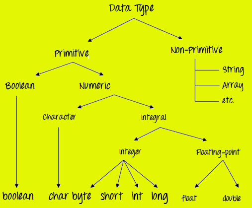
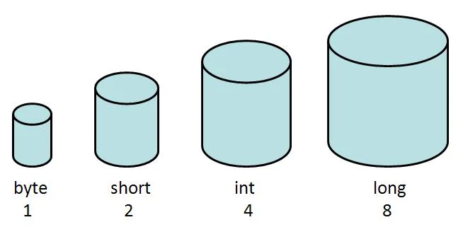
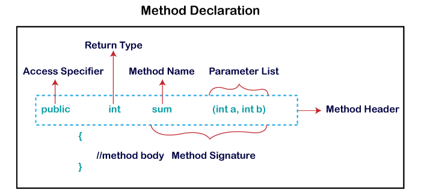

# Java

## 路线

1. 阶段入门
   - 编程基础（java 特点、环境搭建、**基础语法**、数组、**面向对象**、抽象类、接口、枚举、常用类、集合类、泛型、异常处理、多线程、io 流、反射）【韩顺平 30 天零基础】
   - java8（Stream API、lambda 表达式、新日期时间、接口默认方法）【宋红康 java 零基础，java8 部分】
2. 计算机基础
   - 计算机网络（http&https 协议、网络类型、udp/tcp 协议、网络安全、域名解析）
   - 操作系统（进程&线程通讯、调度、状态、死锁、内存管理）
3. 企业开发基础
   - mySQL 数据库（mysql 搭建、语句、约束、索引、事务、设计数据库表、性能优化）【老杜-mysql 基础入门】
   - 开发框架（javaWeb、**Spring5**、**SpringMvc**、**mybatis**、mybatis plus、SpringBoot2、SpringSecurity、Maven）【尚硅谷系列】
   - 开发规范
   - Linux（进程、网络、软件包、服务、日志、linux 内核、常用命令、常用环境搭建、shell 脚本、vim 的使用）【韩顺平 linux】
4. 企业开发进阶
   - 设计模式（创建型、结构型、行为型）
   - 中间件（**Redis 缓存**、**RabbitMQ 消息队列**、**Nginx 网关**）【尚硅谷系列】
   - netty 网络编程（io 模型、channel、buffer、selector、netty 模型、websocket 编程-搭个聊天室）【尚硅谷】
   - 微服务（**dubbo**、**微服务**、**接口管理**）
   - 容器（docker、k8s）【狂神】
   - ci/cd【狂神】
5. java 高级
   - 并发编程
   - JVM【宋红康】
6. 架构设计
   - 分布式
   - 高可用
   - 高并发

> 基础语法

- 数据类型
- 流程控制

> 面向对象

- 方法
- 重载
- 封装
- 继承
- 多态

> Spring5

- IOC
- AOP
- 事务

> SpringMVC

- MVC
- 请求与响应
- restful API
- 拦截器
- 配置
- 执行过程

> mybatis

- 增删改查
- 全局配置
- 动态 SQL
- 缓存
- 逆向工程

> SpringBoot2

- 常用注解
- 资源整合
- 高级特性
- 本地热部署

> redis 缓存

- 数据类型
- 常用操作
- java 操作 redis
- 主从模型搭建
- 哨兵模型搭建
- 日志持久化
- 应用场景

> rabbitMQ 消息队列

- 消息队列的作用
- 生产消费模型
- 交换机模型
- 死信队列
- 延迟队列
- 消息持久化
- java 操作
- 集群搭建

> nginx 网关

- Nginx 作用
- 正向代理
- 反向代理（负载均衡）
- 常用命令
- 动静分离（网站部署）
- 集群搭建

> dubbo

- 框架演进
- RPC
- zookeeper
- 服务提供者
- 服务消费者
- 项目搭建

> 微服务

- 概念
- Spring cloud 框架
- Spring cloud Alibaba

## 基础语法

### 入门

看一段代码

```java
public class Hello {
    public static void main(String[] args) {
        System.out.println("Hello, world!");
    }
}
```

保存为 **Hello.java**

**`public static void main(String[] args)`是 Java 程序的固定入口方法，Java 程序总是从`main`方法开始执行**

#### **如何运行？**

Java 源码本质上是一个文本文件，我们需要先用`javac`把`Hello.java`编译成字节码文件`Hello.class`，然后，用`java`命令执行这个字节码文件：

1. 使用 **javac** 把 **Hello.java** compile 成 **Hello.class**（javac 是编译器）;
2. 使用 **java** execute Hello.class ，run on **JVM**（java 是虚拟机）；

```bash
$ javac Hello.java
```

如果源代码无误，上述命令不会有任何输出，而当前目录下会产生一个`Hello.class`文件

```java
$ ls
Hello.class	Hello.java
```

给**虚拟机**传递的参数`Hello`是我们定义的类名，虚拟机自动查找对应的 class 文件并执行。

```bash
$ java Hello
Hello, world!
```

**Java 11**新增的一个功能，它可以直接运行一个单文件源码！

```bash
$ java Hello.java
Hello, world!
```

需要注意的是，在实际项目中，单个不依赖第三方库的 Java 源码是非常罕见的，所以，绝大多数情况下，我们无法直接运行一个 Java 源码文件，原因是它需要**依赖其他的库**。

#### 小结

- 一个 Java 源码只能定义一个`public`类型的 class，并且 class 名称和文件名要完全一致；
- 使用`javac`可以将`.java`源码编译成`.class`字节码；
- 使用`java`可以运行一个已编译的 Java 程序，参数是类名；

### IDE

IDE 是**集成开发环境**：Integrated Development Environment 的缩写。

使用 IDE 的好处在于，可以把编写代码、组织项目、编译、运行、调试等放到一个环境中运行，能极大地提高开发效率。

IDE 提升开发效率主要靠以下几点：

- 编辑器的**自动提示**，可以大大提高敲代码的速度；
- 代码修改后可以**自动重新编译**，并直接运行；
- 可以方便地进行**断点调试**。

目前，流行的用于 Java 开发的 IDE 有：

- Eclipse
- IntelliJ Idea
- NetBeans

### 程序基本结构

```java
/**
 * 可以用来自动创建文档的注释
 */
public class Hello {
    public static void main(String[] args) {
        // 向屏幕输出文本:
        System.out.println("Hello, world!");
        /* 多行注释开始
        注释内容
        注释结束 */
    }
} // class定义结束
```

这段程序包含

- public，**访问修饰符**，表示该`class`是公开的（不写`public`，也能正确编译，但是这个类将无法从命令行执行。）；
- class，定义类的**关键字**，java 是面向对象的语言，一个程序的基本单位就是`class`；
- static，修饰符，表示静态方法；
- void，返回值类型，表示没有任何返回值；
- main，方法名；
- String[] args，参数类型和参数（Java**入口**程序规定的方法必须是**静态方法**，方法名必须为`main`，括号内的参数必须是**String 数组**）；
- 执行语句，依次顺序执行，每一行语句必须以分号结束；
- 注释，有单行注释、多行注释、文档注释；

### 变量

编程语言中的变量，可以理解为一种容器。

在 Java 中，变量有 3 种类型：

- 局部变量（方法体内声明）
- 实例变量（没有 STATIC 关键字声明+方法体外+特定于对象的）
- 静态变量（初始化一次+实例变量之前初始化）

```java
class var1 {
    static int a = 1; //静态变量
    int data = 99; //实例变量
    void method() {
        int b = 90;//局部变量
    }
}
```

变量被使用之前，需要声明、初始化；

```java
int a; // 声明
a = 1; // 初始化
int a = 1; // 可以结合
```

在 java 中，在声明变量的时候，可以给它一个初始值（不给相当于给它指定了默认值。默认值总是`0`）

### 数据类型

变量有很多类型，主要为两大类：

- 原始数据类型（**布尔类型**和 numeric 类型，**numeric 类型**包括**字符型**、**整型**、**浮点型**）
- 非原始数据类型（**类**、**数组**、**接口**等）



原始数据类型是在 Java 语言中预定义和可用的（**CPU 可以直接进行运算**）。原始值不与其他原始值共享状态；

有 8 种基本类型：byte、short、int、long、char、float、double 和 boolean；

#### 原始数据类型

##### **整数类型**

```
byte (1 byte)
short (2 bytes)
int (4 bytes)
long (8 bytes)
```



计算机内存的**最小存储单元**是字节（**byte**），一个字节就是一个**8 位**二进制数，即 8 个**bit**。

一个字节表示的范围：

- `00000000`~`11111111`（二进制）
- 0~255（十进制）
- `00`~`ff`（十六进制）

一个字节是 1byte，1024 字节是 1K，1024K 是 1M，1024M 是 1G，1024G 是 1T。

不同的**数据类型**占用的**字节数**不一样：

- byte 1
- short 2
- int 4
- long 8
- float 4
- double 8
- char 2

##### 浮点类型

```
float (4 bytes)

double (8 bytes)
```

##### 布尔类型

布尔类型`boolean`只有`true`和`false`两个值

Java 语言对布尔类型的存储并没有做规定，因为理论上存储布尔类型只需要**1 bit**（0 和 1），但是通常 JVM 内部会把`boolean`表示为**4 字节**整数。

```java
boolean b1 = true;
```

##### 字符类型

字符类型`char`表示一个字符。Java 的`char`类型除了可表示标准的**ASCII**外，还可以表示一个**Unicode 字符**：

```java
char a = 'A';
char zh = '中';
```

注意`char`类型使用单引号`'`，且仅有一个字符，要和双引号`"`的字符串类型区分开。

| 数据类型 | 默认值   | 默认字节数 |
| -------- | -------- | ---------- |
| byte     | 0        | 1 byte     |
| short    | 0        | 2 bytes    |
| int      | 0        | 4 bytes    |
| long     | 0L       | 8 bytes    |
| float    | 0.0f     | 4 bytes    |
| double   | 0.0d     | 8 bytes    |
| boolean  | false    | 1 bit      |
| char     | ‘\u0000’ | 2 bytes    |

记住：

- 所有 numeric 类型均带符号 (+/-)
- 数据类型的大小在所有平台上保持相同（标准化）
- Java 中的 char 数据类型是 2 个字节，因为它使用 UNICODE 字符集。凭借它，Java 支持国际化。 UNICODE 是一个字符集，涵盖了世界上所有已知的文字和语言

#### 非原始数据类型

除了上述基本类型的变量，剩下的都是非原始数据类型。例如，引用类型最常用的就是`String`字符串：

```java
String s = "hello";
```

引用类型的变量类似于 C 语言的指针，它内部存储一个“地址”，指向某个对象在内存的位置。

#### 常量

定义变量的时候，如果加上`final`修饰符，这个变量就变成了常量：

```java
final double PI = 3.14; // PI是一个常量
PI = 300; // compile error!
```

常量在定义时进行初始化后就不可再次赋值，再次赋值会导致编译错误。

根据习惯，常量名通常全部大写。

常量的作用是用有意义的变量名来避免魔术数字（Magic number），例如，不要在代码中到处写`3.14`，而是定义一个常量。如果将来需要提高计算精度，我们只需要在常量的定义处修改，例如，改成`3.1416`，而不必在所有地方替换`3.14`。

#### var 关键字

有些时候，类型的名字太长，写起来比较麻烦。例如：

```java
StringBuilder sb = new StringBuilder();
```

这个时候，如果想省略变量类型，可以使用`var`关键字：

```java
var sb = new StringBuilder();
```

编译器会根据**赋值语句**自动推断出变量`sb`的类型是`StringBuilder`。对编译器来说，它还是：

```java
StringBuilder sb = new StringBuilder();
```

仅仅是少写了变量类型

#### 变量的作用域

而在语句块中定义的变量，它有一个作用域，就是**从定义处开始，到语句块结束**。超出了作用域引用这些变量，编译器会报错。

```java
{
    ...
    int i = 0; // 变量i从这里开始定义
    ...
    {
        ...
        int x = 1; // 变量x从这里开始定义
        ...
        {
            ...
            String s = "hello"; // 变量s从这里开始定义
            ...
        } // 变量s作用域到此结束
        ...
        // 注意，这是一个新的变量s，它和上面的变量同名，
        // 但是因为作用域不同，它们是两个不同的变量:
        String s = "hi";
        ...
    } // 变量x和s作用域到此结束
    ...
} // 变量i作用域到此结束
```

定义变量时，要遵循**作用域最小化原则**，尽量将变量定义在尽可能小的作用域，并且，不要重复使用变量名。

### 类型转换

一种类型的**变量**可以接收另一种类型的值：

1）较小容量的变量被分配给另一个较大容量的变量

```java
double d;
int i = 10;
d = i;
```

此过程是自动的，**非显式转换**;

2）较大容量的变量被分配给另一个较小容量的变量

```java
double d = 10;
int i;
i = (int) d;
```

在这种情况下，必须**显式指定**类型转换运算符;

如果没有指定类型转换运算符，编译器给出错误;

由于该规则是由**编译器**强制执行的，因此它使程序员意识到他即将进行的转换可能会导致一些数据丢失，并防止意外丢失；

### 运算

#### 整数运算

- `()`
- `!` `~` `++` `--`
- `*` `/` `%`
- `+` `-`
- `<<` `>>` `>>>`
- `&`
- `|`
- `+=` `-=` `*=` `/=`

整数的数值是精确的，整数运算也是精确的，即使是除法也是精确的，因为两个整数相除只能得到结果的整数部分：

```java
int x = 12345 / 67; // 184
```

##### 溢出

整数由于存在范围限制，如果计算结果超出了范围，就会产生溢出，而溢出*不会出错*，却会得到一个奇怪的结果：

```java
public class Main {
    public static void main(String[] args) {
        int x = 2147483640;
        int y = 15;
        int sum = x + y;
        System.out.println(sum); // -2147483641，（int: -2147483648 ~ 2147483647）
    }
}
```

要解释上述结果，我们把整数`2147483640`和`15`换成二进制做加法：

```ascii
  0111 1111 1111 1111 1111 1111 1111 1000
+ 0000 0000 0000 0000 0000 0000 0000 1111
-----------------------------------------
  1000 0000 0000 0000 0000 0000 0000 0111
```

由于最高位计算结果为`1`，因此，加法结果变成了一个**负数**。

要解决上面的问题，可以把`int`换成`long`类型，由于`long`可表示的整型范围更大，所以结果就不会溢出：

```java
long x = 2147483640;
long y = 15;
long sum = x + y;
System.out.println(sum); // 2147483655
```

#### 移位运算

- `>>`、`<<`
- `>>>`、`<<<`

在计算机中，整数总是以二进制的形式表示。例如，`int`类型的整数`7`使用 4 字节表示的二进制如下：

```ascii
00000000 0000000 0000000 00000111
```

可以对整数进行移位运算。对整数`7`左移 1 位将得到整数`14`，左移两位将得到整数`28`：

```java
int n = 7;       // 00000000 00000000 00000000 00000111 = 7
int a = n << 1;  // 00000000 00000000 00000000 00001110 = 14
int b = n << 2;  // 00000000 00000000 00000000 00011100 = 28
int c = n << 28; // 01110000 00000000 00000000 00000000 = 1879048192
int d = n << 29; // 11100000 00000000 00000000 00000000 = -536870912
```

左移 29 位时，由于最高位变成`1`，因此结果变成了负数。

类似的，对整数 7 进行右移，结果如下：

```java
int n = 7;       // 00000000 00000000 00000000 00000111 = 7
int a = n >> 1;  // 00000000 00000000 00000000 00000011 = 3
int b = n >> 2;  // 00000000 00000000 00000000 00000001 = 1
int c = n >> 3;  // 00000000 00000000 00000000 00000000 = 0
```

如果**对一个负数进行右移，最高位的`1`不动**，结果仍然是一个负数：

```java
int n = -536870912; // 11100000 00000000 00000000 00000000
int a = n >> 1;  // 11110000 00000000 00000000 00000000 = -268435456
int b = n >> 2;  // 11111000 00000000 00000000 00000000 = -134217728
int c = n >> 28; // 11111111 11111111 11111111 11111110 = -2
int d = n >> 29; // 11111111 11111111 11111111 11111111 = -1
```

还有一种无符号的右移运算，使用`>>>`，它的特点是不管符号位，右移后高位总是补`0`，因此，对一个负数进行`>>>`右移，它会变成正数，原因是最高位的`1`变成了`0`：

```java
int n = -536870912;// 11100000 00000000 00000000 00000000
int a = n >>> 1;  // 01110000 00000000 00000000 00000000 = 1879048192
int b = n >>> 2;  // 00111000 00000000 00000000 00000000 = 939524096
int c = n >>> 29; // 00000000 00000000 00000000 00000111 = 7
int d = n >>> 31; // 00000000 00000000 00000000 00000001 = 1
```

对`byte`和`short`类型进行移位时，会首先转换为`int`再进行位移。

仔细观察可发现，左移实际上就是不断地 ×2，右移实际上就是不断地 ÷2。

#### 位运算

位运算是按位进行**与**、**或**、**非**和**异或**的运算。

与运算的规则是，必须两个数同时为`1`，结果才为`1`：

```java
n = 0 & 0; // 0
n = 0 & 1; // 0
n = 1 & 0; // 0
n = 1 & 1; // 1
```

或运算的规则是，只要任意一个为`1`，结果就为`1`：

```java
n = 0 | 0; // 0
n = 0 | 1; // 1
n = 1 | 0; // 1
n = 1 | 1; // 1
```

非运算的规则是，`0`和`1`互换：

```java
n = ~0; // 1
n = ~1; // 0
```

异或运算的规则是，如果两个数不同，结果为`1`，否则为`0`：

```java
n = 0 ^ 0; // 0
n = 0 ^ 1; // 1
n = 1 ^ 0; // 1
n = 1 ^ 1; // 0
```

对两个整数进行位运算，实际上就是按位对齐，然后依次对每一位进行运算。例如：

```java
public class Main {
    public static void main(String[] args) {
        int i = 167776589; // 00001010 00000000 00010001 01001101
        int n = 167776512; // 00001010 00000000 00010001 00000000
        System.out.println(i & n); // 167776512
    }
}
```

##### ？例子

上述**按位与**运算实际上可以看作两个整数表示的 IP 地址`10.0.17.77`和`10.0.17.0`，通过与运算，可以快速判断一个 IP 是否在给定的网段内。（待补充例子）

#### 类型自动提升与强制转型

##### 自动提升

在运算过程中，如果参与运算的两个数类型不一致，那么计算结果为**较大类型**的整型。例如，`short`和`int`计算，结果总是`int`，原因是`short`首先自动被转型为`int`：

```java
public class Main {
    public static void main(String[] args) {
        short s = 1234;
        int i = 123456;
        int x = s + i; // s自动转型为int
        short y = s + i; // 编译错误!
    }
}

```

##### ？强制转型

也可以将结果强制转型，即将**大范围**的整数**转型为小范围**的整数。

强制转型使用`(类型)`，例如，将`int`强制转型为`short`：

```java
int i = 12345;
short s = (short) i; // 12345
```

要注意，**超出范围的强制转型**会得到错误的结果，原因是转型时，`int`的两个高位字节直接被扔掉，仅保留了低位的两个字节：

```java
public class Main {
    public static void main(String[] args) {
        int i1 = 1234567;
        short s1 = (short) i1; // -10617
        System.out.println(s1);
        int i2 = 12345678;
        short s2 = (short) i2; // 24910
        System.out.println(s2);
    }
}
```

因此，强制转型的结果很可能是错的。

##### ？**练习**

计算前 N 个自然数的和

### 流程控制

#### 条件分支

- if
- if-else
- switch

**if**

```java
public class IfExample {
    public static void main(String[] args) {
        int age=20;
        if(age>18){
            System.out.print("Age is greater than 18");
        }
    }
}
```

#### 输出

`println`是 print line 的缩写，表示**输出并换行**。因此，如果输出后不想换行，可以用`print()`：

```java
public class Main {
    public static void main(String[] args) {
        System.out.print("A,");
        System.out.print("B,");
        System.out.println();
        System.out.println("END");
    }
}
```

##### 格式化输出

为什么要格式化输出？因为计算机表示的数据不一定适合人来阅读：

```java
double d = 12900000;
System.out.println(d); // 1.29E7
```

通过使用占位符`%?`，`printf()`可以把后面的参数格式化成指定格式：

```java
double d = 3.1415926;
System.out.printf("%.2f\n", d); // 显示两位小数3.14
System.out.printf("%.4f\n", d); // 显示4位小数3.1416
```

Java 的格式化功能提供了多种占位符，可以把各种数据类型“格式化”成指定的字符串：

| 占位符 | 说明                                 |
| :----- | :----------------------------------- |
| %d     | 格式化输出**整数**                   |
| %x     | 格式化输出**十六进制整数**           |
| %f     | 格式化输出**浮点数**                 |
| %e     | 格式化输出科学计数法表示的**浮点数** |
| %s     | 格式化字符串                         |

注意，由于%表示占位符，因此，连续两个%%表示一个%字符本身。

##### ？例子

一个整数格式化成十六进制，并用 0 补足 8 位：

```java
public class Main {
    public static void main(String[] args) {
        int n = 12345000;
        System.out.printf("n=%d, hex=%08x", n, n); // 注意，两个%占位符必须传入两个数
    }
}
```

详细的格式化参数请参考 JDK 文档[java.util.Formatter](https://docs.oracle.com/en/java/javase/11/docs/api/java.base/java/util/Formatter.html#syntax)

#### 输入

先看一个从控制台读取一个**字符串**和一个**整数**的例子：

```java
import java.util.Scanner;

public class Main {
    public static void main(String[] args) {
        Scanner scanner = new Scanner(System.in); // 创建Scanner对象
        System.out.print("Input your name: "); // 打印提示
        String name = scanner.nextLine(); // 读取一行输入并获取字符串
        System.out.print("Input your age: "); // 打印提示
        int age = scanner.nextInt(); // 读取一行输入并获取整数
        System.out.printf("Hi, %s, you are %d\n", name, age); // 格式化输出
    }
}
```

1. 通过`import`语句导入`java.util.Scanner`；
2. 创建`Scanner`对象并传入`System.in`；（`System.out`代表标准输出流，而`System.in`代表标准输入流。直接使用`System.in`读取用户输入虽然是可以的，但需要更复杂的代码，而通过`Scanner`就可以简化后续的代码。）
3. 要读取用户输入的字符串，使用`scanner.nextLine()`，要读取用户输入的整数，使用`scanner.nextInt()`。（`Scanner`会自动转换数据类型，因此不必手动转换。）

##### ？例子

输入上次考试成绩（int）和本次考试成绩（int），然后输出成绩提高的百分比，保留两位小数位（例如，21.75%）。

### 方法

方法是**代码块或语句**集合，或一组代码组合在一起以执行特定任务或操作；

它用于实现代码的**可重用性**，我们编写一个方法一次，然后多次使用它，我们不需要一遍又一遍地编写代码；

它还提供了代码的轻松修改和可读性，只需添加或删除代码块即可；

只有当我们调用方法时，才会执行方法；

Java 中最重要的方法是 main() 方法;

#### 方法声明

方法由两部分组成：

- 方法头部（访问说明符、返回值类型、方法名、参数列表，其中方法名+参数列表=**方法签名**）
- 方法体



Java 提供了四种类型的**访问说明符**：

- public，**所有类**都可以访问该方法；
- private，该方法只能在**定义它的类**中访问；
- protect，该方法可以被**同一个包内的类**以及**所有子类**访问；
- default，它只能从**同一个包中**可见；

```java
public class User {
    public String username; // 公开访问，任何地方都可以访问
    protected String chatRoomId; // 受保护访问，只有同一个包内的类和所有子类可以访问
    String status; // 默认访问（包访问），只有同一个包内的类可以访问
    private String password; // 私有访问，只有User类内部可以访问

    public User(String username, String password) {
        this.username = username;
        this.password = password;
        this.status = "online"; // 默认状态为在线
    }

    protected void joinChatRoom(String chatRoomId) {
        this.chatRoomId = chatRoomId; // 加入聊天室
    }

    void updateStatus(String status) {
        this.status = status; // 更新状态
    }

    private boolean checkPassword(String password) {
        return this.password.equals(password); // 检查密码是否正确
    }

    public boolean authenticate(String password) {
        return checkPassword(password); // 对外提供的认证方法
    }
}
```

- `username`是`public`的，意味着任何地方都可以直接访问用户的用户名。
- `chatRoomId`是`protected`的，只有`User`类、`User`类的子类或者同一个包内的其他类可以访问用户所在的聊天室 ID。
- `status`没有访问说明符，即默认访问级别，只有同一个包内的类可以访问用户的状态。
- `password`是`private`的，只有`User`类内部的方法可以访问用户的密码。

**返回类型**

返回类型是该方法返回的数据类型。它可能具有**原始数据类型**、**对象**、**集合**、**void** 等。如果该方法没有返回任何内容，则使用 void 关键字；

**方法名称**

它是用于定义方法名称的唯一名称。它必须与方法的功能相对应。假设，如果我们要创建一个减去两个数字的方法，方法名称必须是 subtraction(), 方法按其名称调用;

**参数列表**

它是用逗号分隔并括在一对括号中的参数列表。它包含**数据类型**和**变量名称**。如果该方法没有参数，则将括号留空;

**方法体**

它是方法声明的一部分，它包含要执行的所有操作，它被包裹在一对大括号内；

### 数组

定义一个数组类型的变量，使用数组类型“**类型[]**”，例如，`int[]`。和单个基本类型变量不同，数组变量**初始化**必须使用`new int[5]`表示创建一个可容纳 5 个`int`元素的数组。

Java 的数组有几个特点：

- 数组所有元素初始化为**默认值**，整型都是`0`，浮点型是`0.0`，布尔型是`false`；
- 数组一旦创建后，大小就不可改变。

```java
public class Main {
    public static void main(String[] args) {
        // 5位同学的成绩:
        int[] ns = new int[5];
        System.out.println(ns.length); // 5
    }
}
```

也可以在定义数组时直接指定初始化的元素，这样就不必写出数组大小，而是由编译器**自动推算**数组大小。例如：

```java
int[] ns = new int[] { 68, 79, 91, 85, 62 };
```

还可以进一步简写为：

```java
int[] ns = { 68, 79, 91, 85, 62 };
```

#### 字符串数组

如果数组元素不是基本类型，而是一个**引用类型**，那么，修改数组元素会有哪些不同？

```java
String[] names = {
    "ABC", "XYZ", "zoo"
};
```

对于`String[]`类型的数组变量`names`，它实际上包含 3 个元素，但每个元素都指向某个字符串对象：

```ascii
          ┌─────────────────────────┐
    names │   ┌─────────────────────┼───────────┐
      │   │   │                     │           │
      ▼   │   │                     ▼           ▼
┌───┬───┬─┴─┬─┴─┬───┬───────┬───┬───────┬───┬───────┬───┐
│   │░░░│░░░│░░░│   │ "ABC" │   │ "XYZ" │   │ "zoo" │   │
└───┴─┬─┴───┴───┴───┴───────┴───┴───────┴───┴───────┴───┘
      │                 ▲
      └─────────────────┘
```

对`names[1]`进行赋值，例如`names[1] = "cat";`，效果如下：

```ascii
          ┌─────────────────────────────────────────────────┐
    names │   ┌─────────────────────────────────┐           │
      │   │   │                                 │           │
      ▼   │   │                                 ▼           ▼
┌───┬───┬─┴─┬─┴─┬───┬───────┬───┬───────┬───┬───────┬───┬───────┬───┐
│   │░░░│░░░│░░░│   │ "ABC" │   │ "XYZ" │   │ "zoo" │   │ "cat" │   │
└───┴─┬─┴───┴───┴───┴───────┴───┴───────┴───┴───────┴───┴───────┴───┘
      │                 ▲
      └─────────────────┘
```

这里注意到原来`names[1]`指向的字符串`"XYZ"`并没有改变，仅仅是将`names[1]`的引用从指向`"XYZ"`改成了指向`"cat"`，其结果是字符串`"XYZ"`再也无法通过`names[1]`访问到了。

```java
public class Main {
    public static void main(String[] args) {
        String[] names = {"ABC", "XYZ", "zoo"};
        String s = names[1];
        names[1] = "cat";
        System.out.println(s); // "XYZ"
    }
}
```

#### 数组操作

##### 遍历

- for 循环
- for each

**for 循环**

```java
int[] ns = { 1, 4, 9, 16, 25 };
for (int i=0; i<ns.length; i++) {
    int n = ns[i];
    System.out.println(n);
}
```

**for each**

```java
int[] ns = { 1, 4, 9, 16, 25 };
for (int n : ns) {
    System.out.println(n);
}
```

在`for (int n : ns)`循环中，变量`n`直接拿到`ns`数组的**元素，而不是索引**。

显然`for each`循环更加简洁。但是，`for each`循环无法拿到数组的索引，因此，到底用哪一种`for`循环，取决于我们的需要。

###### 打印数组内容

直接打印数组变量，得到的是数组在 JVM 中的引用地址：

```java
int[] ns = { 1, 1, 2, 3, 5, 8 };
System.out.println(ns); // 类似 [I@7852e922
```

这并没有什么意义，我们希望打印的数组的元素内容。因此，使用`for each`循环来打印它：

```java
int[] ns = { 1, 1, 2, 3, 5, 8 };
for (int n : ns) {
    System.out.print(n + ", ");
}
```

使用`for each`循环打印也很麻烦。幸好 Java 标准库提供了`Arrays.toString()`，可以快速打印数组内容：

```java
import java.util.Arrays;

public class Main {
    public static void main(String[] args) {
        int[] ns = { 1, 1, 2, 3, 5, 8 };
        System.out.println(Arrays.toString(ns));
    }
}
```

###### ？练习

倒序遍历并打印每个元素

##### 排序

看一个冒泡排序

```java
import java.util.Arrays;

public class Main {
    public static void main(String[] args) {
        int[] ns = { 28, 12, 89, 73, 65, 18, 96, 50, 8, 36 };
        // 排序前:
        System.out.println(Arrays.toString(ns));
        for (int i = 0; i < ns.length - 1; i++) {
            for (int j = 0; j < ns.length - i - 1; j++) {
                if (ns[j] > ns[j+1]) {
                    // 交换ns[j]和ns[j+1]:
                    int tmp = ns[j];
                    ns[j] = ns[j+1];
                    ns[j+1] = tmp;
                }
            }
        }
        // 排序后:
        System.out.println(Arrays.toString(ns));
    }
}
```

JDK 提供的`Arrays.sort()`可以排序

```java
public class Main {
    public static void main(String[] args) {
        int[] ns = { 28, 12, 89, 73, 65, 18, 96, 50, 8, 36 };
        Arrays.sort(ns);
        System.out.println(Arrays.toString(ns));
    }
}
```

###### ？练习

对数组进行降序排序

```java
// 降序排序
import java.util.Arrays;

public class Main {
    public static void main(String[] args) {
        int[] ns = { 28, 12, 89, 73, 65, 18, 96, 50, 8, 36 };
        // 排序前:
        System.out.println(Arrays.toString(ns));
        // TODO:

        // 排序后:
        System.out.println(Arrays.toString(ns));
        if (Arrays.toString(ns).equals("[96, 89, 73, 65, 50, 36, 28, 18, 12, 8]")) {
            System.out.println("测试成功");
        } else {
            System.out.println("测试失败");
        }
    }
}
```

#### 多维数组

二维数组就是数组的数组。定义一个二维数组如下：

```java
public class Main {
    public static void main(String[] args) {
        int[][] ns = {
            { 1, 2, 3, 4 },
            { 5, 6, 7, 8 },
            { 9, 10, 11, 12 }
        };
        System.out.println(ns.length); // 3
    }
}
```

因为`ns`包含 3 个数组，因此，`ns.length`为`3`。实际上`ns`在内存中的结构如下：

```ascii
                    ┌───┬───┬───┬───┐
         ┌───┐  ┌──▶│ 1 │ 2 │ 3 │ 4 │
ns ─────▶│░░░│──┘   └───┴───┴───┴───┘
         ├───┤      ┌───┬───┬───┬───┐
         │░░░│─────▶│ 5 │ 6 │ 7 │ 8 │
         ├───┤      └───┴───┴───┴───┘
         │░░░│──┐   ┌───┬───┬───┬───┐
         └───┘  └──▶│ 9 │10 │11 │12 │
                    └───┴───┴───┴───┘
```

如果我们定义一个普通数组`arr0`，然后把`ns[0]`赋值给它：

```java
public class Main {
    public static void main(String[] args) {
        int[][] ns = {
            { 1, 2, 3, 4 },
            { 5, 6, 7, 8 },
            { 9, 10, 11, 12 }
        };
        int[] arr0 = ns[0];
        System.out.println(arr0.length); // 4
    }
}
```

实际上`arr0`就获取了`ns`数组的第 0 个元素。因为`ns`数组的每个元素也是一个数组，因此，`arr0`指向的数组就是`{ 1, 2, 3, 4 }`。在内存中，结构如下：

```ascii
            arr0 ─────┐
                      ▼
                    ┌───┬───┬───┬───┐
         ┌───┐  ┌──▶│ 1 │ 2 │ 3 │ 4 │
ns ─────▶│░░░│──┘   └───┴───┴───┴───┘
         ├───┤      ┌───┬───┬───┬───┐
         │░░░│─────▶│ 5 │ 6 │ 7 │ 8 │
         ├───┤      └───┴───┴───┴───┘
         │░░░│──┐   ┌───┬───┬───┬───┐
         └───┘  └──▶│ 9 │10 │11 │12 │
                    └───┴───┴───┴───┘
```

访问二维数组的某个元素需要使用`array[row][col]`，例如：

```java
System.out.println(ns[1][2]); // 7
```

##### 遍历

- for 循环
- Arrays.deepToString()

要打印一个二维数组，可以使用两层嵌套的 for 循环：

```java
int[][] ns = {
    { 1, 2, 3, 4 },
    { 5, 6 },
    { 7, 8, 9 }
};
for (int[] arr : ns) {
    for (int n : arr) {
        System.out.print(n);
        System.out.print(', ');
    }
    System.out.println();
}
```

或者使用 Java 标准库的`Arrays.deepToString()`：

```java
import java.util.Arrays;

public class Main {
    public static void main(String[] args) {
        int[][] ns = {
            { 1, 2, 3, 4 },
            { 5, 6, 7, 8 },
            { 9, 10, 11, 12 }
        };
        System.out.println(Arrays.deepToString(ns));
    }
}
```

##### 三维数组

可以这么定义一个三维数组：

```java
int[][][] ns = {
    {
        {1, 2, 3},
        {4, 5, 6},
        {7, 8, 9}
    },
    {
        {10, 11},
        {12, 13}
    },
    {
        {14, 15, 16},
        {17, 18}
    }
};
```

它在内存中的结构如下：

```ascii
                              ┌───┬───┬───┐
                   ┌───┐  ┌──▶│ 1 │ 2 │ 3 │
               ┌──▶│░░░│──┘   └───┴───┴───┘
               │   ├───┤      ┌───┬───┬───┐
               │   │░░░│─────▶│ 4 │ 5 │ 6 │
               │   ├───┤      └───┴───┴───┘
               │   │░░░│──┐   ┌───┬───┬───┐
        ┌───┐  │   └───┘  └──▶│ 7 │ 8 │ 9 │
ns ────▶│░░░│──┘              └───┴───┴───┘
        ├───┤      ┌───┐      ┌───┬───┐
        │░░░│─────▶│░░░│─────▶│10 │11 │
        ├───┤      ├───┤      └───┴───┘
        │░░░│──┐   │░░░│──┐   ┌───┬───┐
        └───┘  │   └───┘  └──▶│12 │13 │
               │              └───┴───┘
               │   ┌───┐      ┌───┬───┬───┐
               └──▶│░░░│─────▶│14 │15 │16 │
                   ├───┤      └───┴───┴───┘
                   │░░░│──┐   ┌───┬───┐
                   └───┘  └──▶│17 │18 │
                              └───┴───┘
```

如果我们要访问三维数组的某个元素，例如，`ns[2][0][1]`，只需要顺着定位找到对应的最终元素`15`即可。

理论上，我们可以定义任意的 N 维数组。但在实际应用中，除了二维数组在某些时候还能用得上，更高维度的数组很少使用。

##### 小结

- 二维数组就是数组的数组，三维数组就是二维数组的数组；
- 多维数组的每个数组元素长度都不要求相同；
- 打印多维数组可以使用`Arrays.deepToString()`；
- 最常见的多维数组是二维数组，访问二维数组的一个元素使用`array[row][col]`。

##### ？练习

使用二维数组可以表示一组学生的各科成绩，请计算所有学生的平均分：

```java
public class Main {
    public static void main(String[] args) {
        // 用二维数组表示的学生成绩:
        int[][] scores = {
            { 82, 90, 91 },
            { 68, 72, 64 },
            { 95, 91, 89 },
            { 67, 52, 60 },
            { 79, 81, 85 },
        };

        double average = 0;
        // TODO:
        System.out.println(average);

        if (Math.abs(average - 77.733333) < 0.000001) {
            System.out.println("测试成功");
        } else {
            System.out.println("测试失败");
        }
    }
}
```

## 面向对象

### 概念

- 对象
- 类
- 继承
- 多态
- 抽象
- 封装
- 耦合
- 内聚
- 关联
- 组合

**对象**

任何具有状态和行为的实体都称为对象。例如，椅子、笔、桌子、键盘、自行车等；

对象可以是类的实例。对象包含一个地址，并在内存中占用一些空间；

对象可以在不知道彼此的数据或代码的详细信息的情况下进行通信，唯一必要的是接受的消息类型和对象返回的响应类型；

> 例子

狗是一个对象，因为它具有颜色、名称、品种等状态，以及摇尾巴、吠叫、进食等行为；

对象的集合称为类, 它是一个逻辑实体;

类可以成为创建对象的蓝图，类不占用任何空间；

**继承**

当一个对象获取父对象的所有属性和行为时，它称为继承。它提供了代码的**可重用性**。它用于实现运行时多态性。

**多态**

如果一项任务以**不同的方式**执行，则称为多态性。例如：以不同的方式说服客户，画一些东西，例如形状、三角形、矩形等；

在 Java 中，使用**方法重载**和**方法重写**来实现多态性。

**抽象**

隐藏内部细节并显示功能称为抽象。例如电话，我们不知道内部处理；

**封装**

将**代码和数据**绑定（或包装）到一个单元中称为封装。例如，胶囊，它包裹不同的药物。

java 类是封装的示例。Java bean 是完全封装的类，因为这里的所有数据成员都是私有的。

### 基础

#### 方法

一个`class`可以包含多个`field`，例如，我们给`Person`类就定义了两个`field`：

```java
class Person {
    public String name;
    public int age;
}
```

但是，直接把`field`用`public`暴露给外部可能会破坏封装性：

```java
Person ming = new Person();
ming.name = "Xiao Ming";
ming.age = -99; // age设置为负数
```

显然，直接操作`field`，容易造成逻辑混乱。为了避免外部代码直接去访问`field`，我们可以用`private`修饰`field`，拒绝外部访问：

```java
class Person {
    private String name;
    private int age;
}
```

把`field`从`public`改成`private`，外部代码不能访问这些`field`，那我们定义这些`field`有什么用？怎么才能给它赋值？怎么才能读取它的值？

```java
public class Main {
    public static void main(String[] args) {
        Person ming = new Person();
        ming.setName("Xiao Ming"); // 设置name
        ming.setAge(12); // 设置age
        System.out.println(ming.getName() + ", " + ming.getAge());
    }
}

class Person {
    private String name;
    private int age;

    public String getName() {
        return this.name;
    }

    public void setName(String name) {
        this.name = name;
    }

    public int getAge() {
        return this.age;
    }

    public void setAge(int age) {
        if (age < 0 || age > 100) {
            throw new IllegalArgumentException("invalid age value");
        }
        this.age = age;
    }
}

```

虽然外部代码不能直接修改`private`字段，但是，外部代码可以调用方法`setName()`和`setAge()`来间接修改`private`字段；

在方法内部，我们就有机会检查参数对不对。比如，`setAge()`就会检查传入的参数，参数超出了范围，直接报错。这样，外部代码就没有任何机会把`age`设置成不合理的值。

对`setName()`方法同样可以做检查，例如，不允许传入`null`和空字符串：

```java
public void setName(String name) {
    if (name == null || name.isBlank()) {
        throw new IllegalArgumentException("invalid name");
    }
    this.name = name.strip(); // 去掉首尾空格
}
```

**所以，一个类通过定义方法，就可以给外部代码暴露一些操作的接口，同时，内部自己保证逻辑一致性。**

##### 定义

语法是：

```java
修饰符 方法返回类型 方法名(方法参数列表) {
    若干方法语句;
    return 方法返回值;
}
```

方法返回值通过`return`语句实现，如果没有返回值，返回类型设置为`void`，可以省略`return`。

```java
public class Main {
    public static void main(String[] args) {
        Person ming = new Person();
        ming.setBirth(2008);
        System.out.println(ming.getAge());
    }
}

class Person {
    private String name;
    private int birth;

    public void setBirth(int birth) {
        this.birth = birth;
    }

    public int getAge() {
        return calcAge(2019); // 调用private方法
    }

    // private方法:
    private int calcAge(int currentYear) {
        return currentYear - this.birth;
    }
}

```

这个`Person`类只定义了`birth`字段，没有定义`age`字段，获取`age`时，通过方法`getAge()`返回的是一个实时计算的值，并非存储在某个字段的值；

这说明**方法可以封装一个类的对外接口，调用方不需要知道也不关心`Person`实例在内部到底有没有`age`字段。**

##### this

在方法内部，可以使用一个隐含的变量`this`，它**始终指向当前实例**；

通过`this.field`就可以访问当前实例的字段；

没有命名冲突，可以省略`this`：

```java
class Person {
    private String name;

    public String getName() {
        return name; // 相当于this.name
    }
}
```

但是，如果有局部变量和字段重名，那么局部变量优先级更高，就必须加上`this`：

```java
class Person {
    private String name;

    public void setName(String name) {
        this.name = name; // 前面的this不可少，少了就变成局部变量name了
    }
}
```

##### 可变参数

可变参数用`类型...`定义，可变参数相当于数组类型：

```java
class Group {
    private String[] names;

    public void setNames(String... names) {
        this.names = names;
    }
}
```

调用时，可以这么写：

```java
Group g = new Group();
g.setNames("Xiao Ming", "Xiao Hong", "Xiao Jun"); // 传入3个String
g.setNames("Xiao Ming", "Xiao Hong"); // 传入2个String
g.setNames("Xiao Ming"); // 传入1个String
g.setNames(); // 传入0个String
```

完全可以把可变参数改写为`String[]`类型：

```java
class Group {
    private String[] names;

    public void setNames(String[] names) {
        this.names = names;
    }
}
```

但是，调用方需要自己先构造`String[]`，比较麻烦。例如：

```java
Group g = new Group();
g.setNames(new String[] {"Xiao Ming", "Xiao Hong", "Xiao Jun"}); // 传入1个String[]
```

另一个问题是，调用方可以传入`null`：

```java
Group g = new Group();
g.setNames(null);
```

而可变参数可以保证无法传入`null`，因为传入 0 个参数时，接收到的实际值是一个空数组而不是`null`。

##### 参数绑定

调用方把参数传递给实例方法时，调用时传递的值会按参数位置一一绑定

参数一般有两种：

- 基本类型
- 引用类型

先观察一个基本类型参数的传递：

```java
public class Main {
    public static void main(String[] args) {
        Person p = new Person();
        int n = 15; // n的值为15
        p.setAge(n); // 传入n的值
        System.out.println(p.getAge()); // 15
        n = 20; // n的值改为20
        System.out.println(p.getAge()); // 15还是20?
    }
}

class Person {
    private int age;

    public int getAge() {
        return this.age;
    }

    public void setAge(int age) {
        this.age = age;
    }
}
```

运行代码，从结果可知，修改外部的局部变量`n`，不影响实例`p`的`age`字段，原因是`setAge()`方法获得的参数，复制了`n`的值，因此，`p.age`和局部变量`n`互不影响。

**基本类型参数的传递，是调用方值的复制。**双方各自的后续修改，互不影响。

传递引用参数的例子：

```java
public class Main {
    public static void main(String[] args) {
        Person p = new Person();
        String[] fullname = new String[] { "Homer", "Simpson" };
        p.setName(fullname); // 传入fullname数组
        System.out.println(p.getName()); // "Homer Simpson"
        fullname[0] = "Bart"; // fullname数组的第一个元素修改为"Bart"
        System.out.println(p.getName()); // "Homer Simpson"还是"Bart Simpson"?
    }
}

class Person {
    private String[] name;

    public String getName() {
        return this.name[0] + " " + this.name[1];
    }

    public void setName(String[] name) {
        this.name = name;
    }
}

```

一开始，把`fullname`数组传进去，然后，修改`fullname`数组的内容，结果发现，实例`p`的字段`p.name`也被修改了！

**引用类型参数的传递，调用方的变量，和接收方的参数变量，指向的是同一个对象。**双方任意一方对这个对象的修改，都会影响对方（因为指向同一个对象嘛）。

###### ？练习

```java
public class Main {
    public static void main(String[] args) {
        Person p = new Person();
        String bob = "Bob";
        p.setName(bob); // 传入bob变量
        System.out.println(p.getName()); // "Bob"
        bob = "Alice"; // bob改名为Alice
        System.out.println(p.getName()); // "Bob"还是"Alice"?
    }
}

class Person {
    private String name;

    public String getName() {
        return this.name;
    }

    public void setName(String name) {
        this.name = name;
    }
}

```

##### 构造方法

构造方法有以下特点：

- 名称就是**类名**
- 和普通方法相比，构造方法没有返回值（也没有`void`）
- 调用构造方法，必须用`new`操作符

创建实例的时候，实际上是通过构造方法来初始化实例的。

```java
public class Main {
    public static void main(String[] args) {
        Person p = new Person("Xiao Ming", 15);
        System.out.println(p.getName());
        System.out.println(p.getAge());
    }
}

class Person {
    private String name;
    private int age;

    public Person(String name, int age) {
        this.name = name;
        this.age = age;
    }

    public String getName() {
        return this.name;
    }

    public int getAge() {
        return this.age;
    }
}
```

###### 默认构造方法

一个类没有定义构造方法，编译器会自动为我们生成一个默认构造方法，它没有参数，也没有执行语句，类似这样：

```java
class Person {
    public Person() {
    }
}
```

如果既要能使用**带参数**的构造方法，又想保留**不带参数**的构造方法，那么只能把两个构造方法**都定义**出来：

```java
public class Main {
    public static void main(String[] args) {
        Person p1 = new Person("Xiao Ming", 15); // 既可以调用带参数的构造方法
        Person p2 = new Person(); // 也可以调用无参数构造方法
    }
}

class Person {
    private String name;
    private int age;

    public Person() {
    }

    public Person(String name, int age) {
        this.name = name;
        this.age = age;
    }

    public String getName() {
        return this.name;
    }

    public int getAge() {
        return this.age;
    }
}
```

###### 默认值

没有在构造方法中初始化字段时：

- 引用类型的字段默认是`null`
- `int`类型默认值是`0`（数值类是 0）
- 布尔类型默认值是`false`

```java
class Person {
    private String name; // 默认初始化为null
    private int age; // 默认初始化为0

    public Person() {
    }
}
```

也可以对字段直接进行初始化：

```java
class Person {
    private String name = "Unamed";
    private int age = 10;
}
```

那么问题来了：**既对字段进行初始化，又在构造方法中对字段进行初始化，那`new Person("Xiao Ming", 12)`得到的对象实例，字段的初始值是啥？**

###### 初始化过程

1. 先初始化字段；（int age=10;`表示字段初始化为`10`，`String name;`表示引用类型字段默认初始化为`null`；）
2. 执行构造方法的代码进行初始化。

```java
class Person {
    private String name = "Unamed";
    private int age = 10;

    public Person(String name, int age) {
        this.name = name;
        this.age = age;
    }
}
```

因此，构造方法的代码由于后运行，所以，`new Person("Xiao Ming", 12)`的字段值最终由构造方法的代码确定。

###### 多构造方法

可以定义多个构造方法，在通过`new`操作符调用的时候，编译器通过构造方法的参数数量、位置和类型自动区分：

```java
class Person {
    private String name;
    private int age;

    public Person(String name, int age) {
        this.name = name;
        this.age = age;
    }

    public Person(String name) {
        this.name = name;
        this.age = 12;
    }

    public Person() {
        this("Unnamed"); // 调用另一个构造方法Person(String)
    }
}
```

如果调用`new Person("Xiao Ming", 20);`，会自动匹配到构造方法`public Person(String, int)`。

如果调用`new Person("Xiao Ming");`，会自动匹配到构造方法`public Person(String)`。

如果调用`new Person();`，会自动匹配到构造方法`public Person()`。

一个构造方法可以调用其他构造方法，这样做的目的是便于代码复用。调用其他构造方法的语法是`this(…)`：

##### 重载 overload

方法名相同，但各自的参数不同（注意：方法重载的**返回值类型**通常都是相同的。）

```java
class Hello {
    public void hello() {
        System.out.println("Hello, world!");
    }

    public void hello(String name) {
        System.out.println("Hello, " + name + "!");
    }

    public void hello(String name, int age) {
        if (age < 18) {
            System.out.println("Hi, " + name + "!");
        } else {
            System.out.println("Hello, " + name + "!");
        }
    }
}
```

举个例子，`String`类提供了多个重载方法`indexOf()`，可以查找子串：

- `int indexOf(int ch)`：根据字符的 Unicode 码查找；
- `int indexOf(String str)`：根据字符串查找；
- `int indexOf(int ch, int fromIndex)`：根据字符查找，但指定起始位置；
- `int indexOf(String str, int fromIndex)`根据字符串查找，但指定起始位置。

#### 继承

- 在 OOP 的术语中，我们把`Person`称为**超类**（super class），**父类**（parent class），**基类**（base class），把`Student`称为**子类**（subclass），**扩展类**（extended class）。
- 子类自动获得了父类的所有字段，严禁定义与父类重名的字段！

```java
class Person {
    private String name;
    private int age;

    public String getName() {...}
    public void setName(String name) {...}
    public int getAge() {...}
    public void setAge(int age) {...}
}

class Student extends Person {
    // 不要重复name和age字段/方法,
    // 只需要定义新增score字段/方法:
    private int score;

    public int getScore() { … }
    public void setScore(int score) { … }
}
```

##### 继承树

注意到我们在定义`Person`的时候，没有写`extends`。在 Java 中，没有明确写`extends`的类，编译器会自动加上`extends Object`。所以，任何类，除了`Object`，都会继承自某个类。下图是`Person`、`Student`的继承树：

```ascii
┌───────────┐
│  Object   │
└───────────┘
      ▲
      │
┌───────────┐
│  Person   │
└───────────┘
      ▲
      │
┌───────────┐
│  Student  │
└───────────┘
```

**Java 只允许一个 class 继承自一个类，因此，一个类有且仅有一个父类。只有`Object`特殊，它没有父类。**

##### protected

继承有个特点，就是**子类**无法访问**父类**的`private`字段或者`private`方法：

```java
class Person {
    private String name;
    private int age;
}

class Student extends Person {
    public String hello() {
        return "Hello, " + name; // 编译错误：无法访问name字段
    }
}
```

这使得继承的作用被削弱了。为了让子类可以访问父类的字段，我们需要把`private`改为`protected`：

```java
class Person {
    protected String name;
    protected int age;
}

class Student extends Person {
    public String hello() {
        return "Hello, " + name; // hello，null
    }
}
```

因此，`protected`关键字可以把**字段和方法**的访问权限控制在继承树内部；

一个`protected`字段和方法可以被其子类，以及子类的子类所访问。

##### super

- 任何`class`的**构造方法**，**第一行语句**必须是调用父类的构造方法（如果没有明确地调用父类的构造方法，编译器会帮我们自动加一句`super();`）
- 如果父类没有默认的构造方法，子类就必须**显式调用**`super()`并给出参数（以便让编译器定位到父类的一个合适的构造方法。）
- 子类**_不会继承_**任何父类的构造方法（子类默认的构造方法是**编译器**自动生成的，不是继承的。）

`super`关键字表示父类（超类）。子类引用父类的字段时，可以用`super.fieldName`：

```java
class Student extends Person {
    public String hello() {
        return "Hello, " + super.name;
    }
}
```

实际上，这里使用`super.name`，或者`this.name`，或者`name`，效果都是一样的。编译器会自动定位到父类的`name`字段；

但是，在某些时候，就必须使用`super`：

```java
public class Main {
    public static void main(String[] args) {
        Student s = new Student("Xiao Ming", 12, 89);
    }
}

class Person {
    protected String name;
    protected int age;

    public Person(String name, int age) {
        this.name = name;
        this.age = age;
    }
}

class Student extends Person {
    protected int score;

    public Student(String name, int age, int score) {
        this.score = score;
    }
}
```

运行上面的代码，会得到一个编译错误，大意是在`Student`的构造方法中，无法调用`Person`的构造方法。

因为在 Java 中，任何`class`的**构造方法**，**第一行语句**必须是调用父类的构造方法

如果没有明确地调用父类的构造方法，编译器会帮我们自动加一句`super();`

所以，`Student`类的构造方法实际上是这样：

```java
class Student extends Person {
    protected int score;

    public Student(String name, int age, int score) {
        super(); // 自动调用父类的构造方法，等效Person()
        this.score = score;
    }
}
```

但是，`Person`类并没有无参数的构造方法，因此，编译失败。

解决方法是调用`Person`类存在的某个构造方法：

```java
class Student extends Person {
    protected int score;

    public Student(String name, int age, int score) {
        super(name, age); // 调用父类的构造方法Person(String, int)
        this.score = score;
    }
}
```

因此我们得出结论：**如果父类没有默认的构造方法，子类就必须显式调用`super()`并给出参数以便让编译器定位到父类的一个合适的构造方法。**

这里还顺带引出了另一个问题：即子类*不会继承*任何父类的构造方法。**子类默认的构造方法是编译器自动生成的，不是继承的。**

##### 阻止继承

正常情况下，只要某个 class 没有`final`修饰符，那么任何类都可以从该 class 继承；

从 Java 15 开始，允许使用`sealed`修饰 class，并通过`permits`明确写出能够从该 class 继承的子类名称：

```java
public sealed class Shape permits Rect, Circle, Triangle {
    ...
}
```

上述`Shape`类就是一个`sealed`类，它只允许指定的 3 个类继承它：

```java
public final class Rect extends Shape {...}
```

是没问题的，因为`Rect`出现在`Shape`的`permits`列表中。但是，如果定义一个`Ellipse`就会报错：

```java
public final class Ellipse extends Shape {...}
// Compile error: class is not allowed to extend sealed class: Shape
```

原因是`Ellipse`并未出现在`Shape`的`permits`列表中。这种`sealed`类主要用于一些框架，**防止继承被滥用**。

`sealed`类在 Java 15 中目前是预览状态，要启用它，必须使用参数`--enable-preview`和`--source 15`。

##### 向上转型

如果一个引用变量的类型是`Student`，那么它可以指向一个`Student`类型的实例：

```java
Student s = new Student();
```

如果一个引用类型的变量是`Person`，那么它可以指向一个`Person`类型的实例：

```java
Person p = new Person();
```

如果`Student`是从`Person`继承下来的，那么，一个引用类型为`Person`的变量，能否指向`Student`类型的实例？

```java
Person p = new Student(); // ???
```

经测试，这是允许的！

这是因为`Student`继承自`Person`，因此，它拥有`Person`的全部功能。`Person`类型的变量，如果指向`Student`类型的实例，对它进行操作，是没有问题的！

这种把一个**子类类型安全地变为父类类型**的赋值，被称为**向上转型**（upcasting）。

##### 向下转型

如果把一个父类类型强制转型为子类类型，就是向下转型（downcasting）：

```java
Person p1 = new Student(); // upcasting, ok
Person p2 = new Person();
Student s1 = (Student) p1; // ok
Student s2 = (Student) p2; // runtime error! ClassCastException!
```

`Person`类型`p1`实际指向`Student`实例，`Person`类型变量`p2`实际指向`Person`实例；

在向下转型的时候，把`p1`转型为`Student`会成功，因为`p1`确实指向`Student`实例，把`p2`转型为`Student`会失败，因为`p2`的实际类型是`Person`，不能把父类变为子类，因为子类功能比父类多，多的功能无法凭空变出来；

因此，向下转型很可能会失败。失败的时候，Java 虚拟机会报`ClassCastException`；

为了避免向下转型出错，Java 提供了`instanceof`操作符，可以先判断一个实例究竟是不是某种类型：

```java
Person p = new Person();
System.out.println(p instanceof Person); // true
System.out.println(p instanceof Student); // false

Student s = new Student();
System.out.println(s instanceof Person); // true
System.out.println(s instanceof Student); // true

Student n = null;
System.out.println(n instanceof Student); // false
```

`instanceof`实际上判断一个**变量所指向的实例是否是指定类型**，或者这个类型的子类。如果一个引用变量为`null`，那么对任何`instanceof`的判断都为`false`。

利用`instanceof`，在向下转型前可以先判断：

```java
Person p = new Student();
if (p instanceof Student) {
    // 只有判断成功才会向下转型:
    Student s = (Student) p; // 一定会成功
}
```

从 Java 14 开始，判断`instanceof`后，可以直接转型为指定变量，避免再次强制转型。

对于以下代码：

```java
Object obj = "hello";
if (obj instanceof String) {
    String s = (String) obj;
    System.out.println(s.toUpperCase());
}
```

可以改写如下：

```java
public class Main {
    public static void main(String[] args) {
        Object obj = "hello";
        if (obj instanceof String s) {
            // 可以直接使用变量s:
            System.out.println(s.toUpperCase());
        }
    }
}
```

##### 组合

注意区别继承和组合

比如，`Student`和`Book`的关系是 has 关系。

具有 has 关系不应该使用继承（**is**关系，学生是人），而是使用组合，即`Student`可以持有一个`Book`实例：

```java
class Student extends Person {
    protected Book book;
    protected int score;
}
```

##### ？小结

- 继承是面向对象编程的一种强大的**代码复用**方式；
- Java 只允许**单继承**，所有类最终的根类是`Object`；
- `protected`允许子类访问父类的字段和方法；
- **子类**的构造方法可以通过`super()`调用父类的构造方法；
- 可以安全地**向上转型**为更抽象的类型；
- ？可以强制向下转型，最好借助`instanceof`判断；
- 子类和父类的关系是 is，has 关系不能用继承。

#### 多态

##### 重写（override）

- 方法名一样
- 参数一样
- 返回值一样

在继承关系中，子类如果定义了一个与父类方法完全相同的方法，被称为**重写**（Override）

例如，在`Person`类中，定义了`run()`方法：

```java
class Person {
    public void run() {
        System.out.println("Person.run");
    }
}
```

在子类`Student`中，重写这个`run()`方法：

```java
class Student extends Person {
    @Override
    public void run() {
        System.out.println("Student.run");
    }
}
```

注意：**方法名相同，方法参数相同，但方法返回值不同，也是不同的方法。**在 Java 程序中，出现这种情况，编译器会报错。

加上`@Override`可以让编译器帮助检查是否进行了正确的重写。希望进行重写，但是不小心写错了方法，编译器会报错。

```java
public class Main {
    public static void main(String[] args) {
    }
}

class Person {
    public void run() {}
}

public class Student extends Person {
    @Override // Compile error!
    public void run(String s) {}
}
```

但是`@Override`不是必需的。

引用变量的声明类型可能与其实际类型不符：

```java
Person p = new Student();
```

现在，考虑一种情况，如果子类覆写了父类的方法：

```java
public class Main {
    public static void main(String[] args) {
        Person p = new Student();
        p.run(); // 应该打印Person.run还是Student.run?
    }
}

class Person {
    public void run() {
        System.out.println("Person.run");
    }
}

class Student extends Person {
    @Override
    public void run() {
        System.out.println("Student.run");
    }
}
```

那么，一个实际类型为`Student`，引用类型为`Person`的变量，调用其`run()`方法，调用的是`Person`还是`Student`的`run()`方法？

运行一下上面的代码就可以知道，实际上调用的方法是`Student`的`run()`方法。因此可得出结论：

Java 的实例方法调用是基于**运行时的实际类型**的动态调用，而非变量的声明类型。

这个非常重要的特性在面向对象编程中称之为**多态**。它的英文拼写非常复杂：**Polymorphic**。

##### 多态的意义

多态是指，针对某个类型的方法调用，其真正执行的方法取决于**运行时期实际类型**的方法：

假设我们编写这样一个方法：

```java
public void runTwice(Person p) {
    p.run();
    p.run();
}
```

它传入的参数类型是`Person`，我们是无法知道传入的参数实际类型究竟是`Person`，还是`Student`，还是`Person`的其他子类，因此，也无法确定调用的是不是`Person`类定义的`run()`方法。

这种不确定性的方法调用，究竟有什么作用？

假设我们定义一种收入，需要给它报税，那么先定义一个`Income`类：

```java
class Income {
    protected double income;
    public double getTax() {
        return income * 0.1; // 税率10%
    }
}
```

对于工资收入，可以减去一个基数，那么我们可以从`Income`派生出`Salary`，并重写`getTax()`：

```java
class Salary extends Income {
    @Override
    public double getTax() {
        if (income <= 5000) {
            return 0;
        }
        return (income - 5000) * 0.2;
    }
}
```

如果你享受国务院特殊津贴，那么按照规定，可以全部免税：

```java
class StateCouncilSpecialAllowance extends Income {
    @Override
    public double getTax() {
        return 0;
    }
}
```

对于一个人的所有收入进行报税，可以这么写：

```java
public double totalTax(Income... incomes) {
    double total = 0;
    for (Income income: incomes) {
        total = total + income.getTax();
    }
    return total;
}
```

全部代码

```java
public class Main {
    public static void main(String[] args) {
        // 给一个有普通收入、工资收入和享受国务院特殊津贴的小伙伴算税:
        Income[] incomes = new Income[] {
            new Income(3000),
            new Salary(7500),
            new StateCouncilSpecialAllowance(15000)
        };
        System.out.println(totalTax(incomes));
    }

    public static double totalTax(Income... incomes) {
        double total = 0;
        for (Income income: incomes) {
            total = total + income.getTax();
        }
        return total;
    }
}

class Income {
    protected double income;

    public Income(double income) {
        this.income = income;
    }

    public double getTax() {
        return income * 0.1; // 税率10%
    }
}

class Salary extends Income {
    public Salary(double income) {
        super(income);
    }

    @Override
    public double getTax() {
        if (income <= 5000) {
            return 0;
        }
        return (income - 5000) * 0.2;
    }
}

class StateCouncilSpecialAllowance extends Income {
    public StateCouncilSpecialAllowance(double income) {
        super(income);
    }

    @Override
    public double getTax() {
        return 0;
    }
}
```

利用多态，`totalTax()`方法只需要和`Income`打交道，它完全不需要知道`Salary`和`StateCouncilSpecialAllowance`的存在，就可以正确计算出总的税；

如果我们要新增一种稿费收入，只需要从`Income`派生，然后正确覆写`getTax()`方法就可以。把新的类型传入`totalTax()`，不需要修改任何代码。

可见，多态具有一个非常强大的功能，就是允许添加更多类型的**子类实现功能扩展**，却**不需要修改基于父类的代码。**

##### 重写 Object 方法

所有的`class`最终都继承自`Object`，而`Object`定义了几个重要的方法：

- `toString()`：把 instance 输出为`String`；
- `equals()`：判断两个 instance 是否逻辑相等；
- `hashCode()`：计算一个 instance 的哈希值。

在必要的情况下，我们可以覆写`Object`的这几个方法：

```java
class Person {
    ...
    // 显示更有意义的字符串:
    @Override
    public String toString() {
        return "Person:name=" + name;
    }

    // 比较是否相等:
    @Override
    public boolean equals(Object o) {
        // 当且仅当o为Person类型:
        if (o instanceof Person) {
            Person p = (Person) o;
            // 并且name字段相同时，返回true:
            return this.name.equals(p.name);
        }
        return false;
    }

    // 计算hash:
    @Override
    public int hashCode() {
        return this.name.hashCode();
    }
}
```

在子类的覆写方法中，如果要调用父类的被覆写的方法，可以通过`super`来调用：

```java
class Person {
    protected String name;
    public String hello() {
        return "Hello, " + name;
    }
}

class Student extends Person {
    @Override
    public String hello() {
        // 调用父类的hello()方法:
        return super.hello() + "!";
    }
}
```

##### final

继承可以允许子类覆写父类的方法。如果一个父类不允许子类对它的某个方法进行覆写，可以把该方法标记为`final`。**用`final`修饰的方法不能被`Override`**：

```java
class Person {
    protected String name;
    public final String hello() {
        return "Hello, " + name;
    }
}

class Student extends Person {
    // compile error: 不允许覆写
    @Override
    public String hello() {
    }
}
```

如果一个类不希望任何其他类继承自它，那么可以把这个类本身标记为`final`。**用`final`修饰的类不能被继承：**

```java
final class Person {
    protected String name;
}

// compile error: 不允许继承自Person
class Student extends Person {
}
```

对于一个类的实例字段，同样可以用`final`修饰。用`final`修饰的字段在初始化后不能被修改：

```java
class Person {
    public final String name = "Unamed";
}
```

对`final`字段重新赋值会报错：

```java
Person p = new Person();
p.name = "New Name"; // compile error!
```

可以在构造方法中初始化 final 字段：

```java
class Person {
    public final String name;
    public Person(String name) {
        this.name = name;
    }
}
```

这种方法更为常用，因为可以保证实例一旦创建，其`final`字段就不可修改。

##### 小结

- 子类可以重写父类的方法（Override），重写在子类中改变了父类方法的行为；
- Java 的方法调用总是作用于**运行期**对象的实际类型，这种行为称为多态；
- `final`修饰符有多种作用：
  - `final`修饰的**方法**可以阻止被重写；
  - `final`修饰的**class**可以阻止被继承；
  - `final`修饰的**field**必须在创建对象时初始化，随后不可修改。

#### 抽象类

由于多态的存在，每个子类都可以覆写父类的方法，例如：

```java
class Person {
    public void run() { … }
}

class Student extends Person {
    @Override
    public void run() { … }
}

class Teacher extends Person {
    @Override
    public void run() { … }
}
```

从`Person`类派生的`Student`和`Teacher`都可以覆写`run()`方法。

如果父类`Person`的`run()`方法没有实际意义，能否去掉方法的执行语句？

```java
class Person {
    public void run(); // Compile Error!
}
```

如果父类的方法本身不需要实现任何功能，仅仅是为了定义方法签名，目的是让子类去重写它，那么，可以把父类的方法声明为抽象方法：

```java
class Person {
    public abstract void run();
}
```

把一个方法声明为`abstract`，表示它是一个抽象方法，本身没有实现任何方法语句；

因为这个**抽象方法**本身是无法执行的，所以，`Person`类也**无法被实例化**；

编译器会告诉我们，无法编译`Person`类，因为它包含抽象方法。

必须把`Person`类本身也声明为`abstract`：

```java
abstract class Person {
    public abstract void run();
}
```

**无法实例化的抽象类有什么用？**

因为抽象类本身被设计成**只能用于被继承**，因此，抽象类可以**强迫子类实现**其定义的抽象方法，否则编译会报错。因此，抽象方法实际上相当于定义了**“规范”**。

例如，`Person`类定义了抽象方法`run()`，那么，在实现子类`Student`的时候，就必须重写`run()`方法：

##### 面向抽象编程

- 上层代码只定义规范（例如：`abstract class Person`）；
- 不需要子类就可以实现业务逻辑（正常编译）；
- 具体的业务逻辑由不同的子类实现，调用者并不关心。

当我们定义了抽象类`Person`，以及具体的`Student`、`Teacher`子类的时候，我们可以通过抽象类`Person`类型去引用具体的子类的实例：

```java
Person s = new Student();
Person t = new Teacher();
```

这种引用抽象类的好处在于，我们对其进行方法调用，并**不关心`Person`类型变量的具体子类型**：

```java
s.run();
t.run();
```

同样的代码，如果引用的是一个新的子类，我们仍然不关心具体类型：

```java
// 同样不关心新的子类是如何实现run()方法的：
Person e = new Employee();
e.run();
```

这种**尽量引用高层类型**，**避免引用实际子类型**的方式，称之为**面向抽象编程**。

##### 小结

- 通过`abstract`定义的方法是抽象方法，它**只有定义，没有实现**。抽象方法定义了**子类必须实现**的接口规范；
- 定义了抽象方法的 class 必须被定义为抽象类，从抽象类继承的子类必须实现抽象方法；
- 如果不实现抽象方法，则该子类仍是一个抽象类；
- 面向抽象编程使得调用者只关心抽象方法的定义，不关心子类的具体实现。

##### ？练习

用抽象类给一个有工资收入和稿费收入的小伙伴算税。

#### 接口

如果一个抽象类**没有字段**，所有方法全部都是**抽象方法**：

```java
abstract class Person {
    public abstract void run();
    public abstract String getName();
}
```

就可以把该抽象类改写为接口：`interface`

在 Java 中，使用`interface`可以声明一个接口：

```java
interface Person {
    void run();
    String getName();
}
```

所谓`interface`，就是比抽象类还要抽象的纯抽象接口，因为它连字段都不能有；

因为**接口**定义的所有方法默认都是`public abstract`的，所以这两个修饰符不需要写出来（写不写效果都一样）。

当一个具体的`class`去实现一个`interface`时，需要使用`implements`关键字：

```java
class Student implements Person {
    private String name;

    public Student(String name) {
        this.name = name;
    }

    @Override
    public void run() {
        System.out.println(this.name + " run");
    }

    @Override
    public String getName() {
        return this.name;
    }
}
```

在 Java 中，一个类只能继承自另一个类，不能从多个类继承。但是，一个类可以实现多个`interface`：

```java
class Student implements Person, Hello { // 实现了两个interface
    ...
}
```

##### 接口继承

一个`interface`可以继承自另一个`interface`。`interface`继承自`interface`使用`extends`，它相当于扩展了接口的方法：

```java
interface Hello {
    void hello();
}

interface Person extends Hello {
    void run();
    String getName();
}
```

此时，`Person`接口继承自`Hello`接口，因此，`Person`接口现在实际上有 3 个抽象方法签名，其中一个来自继承的`Hello`接口。

##### 继承关系

合理设计`interface`和`abstract class`的继承关系，可以充分复用代码；

一般来说，公共逻辑适合放在`abstract class`中，具体逻辑放到各个**子类**，而**接口**层次代表抽象程度；

可以参考 Java 的集合类定义的一组接口、抽象类以及具体子类的继承关系：

```ascii
┌───────────────┐
│   Iterable    │
└───────────────┘
        ▲                ┌───────────────────┐
        │                │      Object       │
┌───────────────┐        └───────────────────┘
│  Collection   │                  ▲
└───────────────┘                  │
        ▲     ▲          ┌───────────────────┐
        │     └──────────│AbstractCollection │
┌───────────────┐        └───────────────────┘
│     List      │                  ▲
└───────────────┘                  │
              ▲          ┌───────────────────┐
              └──────────│   AbstractList    │
                         └───────────────────┘
                                ▲     ▲
                                │     │
                                │     │
                     ┌────────────┐ ┌────────────┐
                     │ ArrayList  │ │ LinkedList │
                     └────────────┘ └────────────┘
```

在使用的时候，**实例化**的对象永远只能是某个**具体的子类**

但总是通过**接口**去引用它，因为接口比抽象类更抽象：

```java
List list = new ArrayList(); // 用List接口引用具体子类的实例
Collection coll = list; // 向上转型为Collection接口
Iterable it = coll; // 向上转型为Iterable接口
```

##### ？default 方法

在**接口**中，可以定义`default`方法：

```java
public class Main {
    public static void main(String[] args) {
        Person p = new Student("Xiao Ming");
        p.run();
    }
}

interface Person {
    String getName();
    default void run() {
        System.out.println(getName() + " run");
    }
}

class Student implements Person {
    private String name;

    public Student(String name) {
        this.name = name;
    }

    public String getName() {
        return this.name;
    }
}
```

实现类可以不必覆写`default`方法；

`default`方法的目的是，当我们需要给接口新增一个方法时，会涉及到修改全部子类；

？如果新增的是`default`方法，那么子类就不必全部修改，只需要在需要重写的地方去重写新增方法。

`default`方法和抽象类的**普通方法**是有所不同的：因为`interface`没有字段，`default`方法**无法访问字段**，而抽象类的普通方法可以访问实例字段。

##### 小结

- Java 的接口（interface）定义了纯抽象规范，一个类可以实现多个接口；
- 接口也是数据类型，适用于向上转型和向下转型；
- 接口的所有方法都是抽象方法，接口不能定义实例字段；
- 接口可以定义`default`方法（JDK>=1.8）。

##### ？练习

用接口给一个有工资收入和稿费收入的小伙伴算税。

#### 静态字段&方法

##### 字段

用`static`修饰的字段，称为静态字段：`static field`。

实例字段在每个实例中都有自己的一个独立“空间”，但是静态字段只有一个共享“空间”，所有实例都会共享该字段：

```java
class Person {
    public String name;
    public int age;
    // 定义静态字段number:
    public static int number;
}
```

```java
public class Main {
    public static void main(String[] args) {
        Person ming = new Person("Xiao Ming", 12);
        Person hong = new Person("Xiao Hong", 15);
        ming.number = 88;
        System.out.println(hong.number); // 88
        hong.number = 99;
        System.out.println(ming.number); // 99
    }
}

class Person {
    public String name;
    public int age;

    public static int number;

    public Person(String name, int age) {
        this.name = name;
        this.age = age;
    }
}
```

对于静态字段，无论修改哪个实例的静态字段，效果都是一样的：所有实例的静态字段都被修改了，原因是静态字段并不属于实例：

```ascii
        ┌──────────────────┐
ming ──▶│Person instance   │
        ├──────────────────┤
        │name = "Xiao Ming"│
        │age = 12          │
        │number ───────────┼──┐    ┌─────────────┐
        └──────────────────┘  │    │Person class │
                              │    ├─────────────┤
                              ├───▶│number = 99  │
        ┌──────────────────┐  │    └─────────────┘
hong ──▶│Person instance   │  │
        ├──────────────────┤  │
        │name = "Xiao Hong"│  │
        │age = 15          │  │
        │number ───────────┼──┘
        └──────────────────┘
```

虽然实例可以访问静态字段，但是它们指向的其实都是`Person class`的静态字段。所以，**所有实例共享静态字段。**

不推荐用`实例变量.静态字段`去访问静态字段，因为在 Java 程序中，实例对象并没有静态字段。在代码中，实例对象能访问静态字段只是因为编译器可以根据实例类型自动转换为`类名.静态字段`来访问静态对象。

推荐用**类名来访问**静态字段。可以把静态字段理解为描述`class`本身的字段（非实例字段）。对于上面的代码，更好的写法是：

```java
Person.number = 99;
System.out.println(Person.number);
```

##### 方法

用`static`修饰的方法称为静态方法，通过类名就可以调用

```java
public class Main {
    public static void main(String[] args) {
        Person.setNumber(99);
        System.out.println(Person.number);
    }
}

class Person {
    public static int number;

    public static void setNumber(int value) {
        number = value;
    }
}
```

因为静态方法**属于`class`而不属于实例**，因此，**静态方法内部，无法访问`this`变量，也无法访问实例字段**，它**只能访问静态字段**。

静态方法经常用于**工具类**。例如：

- Arrays.sort()
- Math.random()

静态方法也经常用于**辅助方法**。注意到 Java 程序的入口`main()`也是静态方法。

##### 接口的静态字段

因为`interface`是一个纯抽象类，所以它不能定义实例字段；

但是，`interface`是**可以有静态字段**的，并且静态字段必须为`final`类型：

```java
public interface Person {
    public static final int MALE = 1;
    public static final int FEMALE = 2;
}
```

实际上，因为`interface`的字段只能是`public static final`类型，所以我们可以把这些修饰符都去掉，上述代码可以简写为：

```java
public interface Person {
    // 编译器会自动加上public statc final:
    int MALE = 1;
    int FEMALE = 2;
}
```

编译器会自动把该字段变为`public static final`类型。

##### 小结

- 静态字段属于所有实例“共享”的字段，实际上是属于`class`的字段；
- 调用静态方法不需要实例，无法访问`this`，但可以访问静态字段和其他静态方法；
- 静态方法常用于工具类和辅助方法。

##### ？练习

给`Person`类增加一个静态字段`count`和静态方法`getCount()`，统计实例创建的个数。

#### 包

在 Java 中，使用`package`来解决**名字冲突**；

Java 定义了一种**名字空间**，称之为包：`package`；

一个类总是属于某个包，类名（比如`Person`）只是一个**简写**，真正的完整类名是`包名.类名`；

例如：

小明的`Person`类存放在包`ming`下面，因此，完整类名是`ming.Person`；

小红的`Person`类存放在包`hong`下面，因此，完整类名是`hong.Person`；

在定义`class`的时候，我们需要在第一行声明这个`class`属于哪个包：

```java
package ming; // 申明包名ming

public class Person {
}
```

在 Java 虚拟机执行的时候，JVM 只看**完整类名**，因此，只要包名不同，类就不同；

要特别注意：**包没有父子关系。**java.util 和 java.util.zip 是不同的包，两者没有任何继承关系；

##### 作用域

位于同一个包的类，可以访问**包作用域**的字段和方法；

不用`public`、`protected`、`private`修饰的字段和方法就是包作用域；

例如，`Person`类定义在`hello`包下面：

```java
// Person.java
package hello;

public class Person {
    // 包作用域:
    void hello() {
        System.out.println("Hello!");
    }
}
```

`Main`类也定义在`hello`包下面：

```java
// Main.java
package hello;

public class Main {
    public static void main(String[] args) {
        Person p = new Person();
        p.hello(); // 可以调用，因为Main和Person在同一个包
    }
}
```

##### import

在一个`class`中，我们总会引用其他的`class`;

例如，小明的`ming.Person`类，如果要引用小军的`mr.jun.Arrays`类，他有三种写法：

```java
// Person.java
package ming;

public class Person {
    public void run() {
        mr.jun.Arrays arrays = new mr.jun.Arrays();
    }
}
```

很显然，每次写完整类名比较痛苦。

因此，第二种写法是用`import`语句，导入小军的`Arrays`，然后写简单类名：

```java
// Person.java
package ming;

// 导入完整类名:
import mr.jun.Arrays;

public class Person {
    public void run() {
        Arrays arrays = new Arrays();
    }
}
```

在写`import`的时候，可以使用`*`，表示把这个包下面的所有`class`都导入进来（但不包括子包的`class`）：

```java
// Person.java
package ming;

// 导入mr.jun包的所有class:
import mr.jun.*;

public class Person {
    public void run() {
        Arrays arrays = new Arrays();
    }
}
```

一般不推荐这种写法，因为在导入了多个包后，很难看出`Arrays`类属于哪个包。

还有一种`import static`的语法，它可以导入一个类的**静态字段和静态方法**：

```java
package main;

// 导入System类的所有静态字段和静态方法:
import static java.lang.System.*;

public class Main {
    public static void main(String[] args) {
        // 相当于调用System.out.println(…)
        out.println("Hello, world!");
    }
}
```

##### 编译器识别类的过程

Java 编译器最终编译出的`.class`文件只使用*完整类名*，因此，在代码中，当编译器遇到一个`class`名称时：

- 如果是**完整类名**，就直接根据完整类名查找这个`class`；
- 如果是**简单类名**，按下面的顺序依次查找：
  - 查找当前`package`是否存在这个`class`；
  - 查找`import`的包是否包含这个`class`；
  - 查找`java.lang`包是否包含这个`class`。

如果按照上面的规则还无法确定类名，则编译报错。

看一个例子：

```java
// Main.java
package test;

import java.text.Format;

public class Main {
    public static void main(String[] args) {
        java.util.List list; // ok，使用完整类名 -> java.util.List
        Format format = null; // ok，使用import的类 -> java.text.Format
        String s = "hi"; // ok，使用java.lang包的String -> java.lang.String
        System.out.println(s); // ok，使用java.lang包的System -> java.lang.System
        MessageFormat mf = null; // 编译错误：无法找到MessageFormat: MessageFormat cannot be resolved to a type
    }
}
```

因此，编译 class 的时候，编译器会自动帮我们做两个 import 动作：

- 默认自动`import`当前`package`的其他`class`；
- 默认自动`import java.lang.*`。

  **注意：自动导入的是 java.lang 包，但类似 java.lang.reflect 这些包仍需要手动导入。**

##### 最佳实践

为了避免名字冲突，我们需要确定**唯一的包名**。推荐的做法是使用**倒置的域名**来确保唯一性。例如：

- org.apache
- org.apache.commons.log
- com.liaoxuefeng.sample

**子包**就可以根据功能自行命名。

注意不要和`java.lang`包的类重名，即自己的类不要使用这些名字：

- String
- System
- Runtime
- ...

要注意也不要和 JDK 常用类重名：

- java.util.List
- java.text.Format
- java.math.BigInteger
- ...

##### 编译和运行

假设我们创建了如下的目录结构：

```ascii
work
├── bin
└── src
    └── com
        └── itranswarp
            ├── sample
            │   └── Main.java
            └── world
                └── Person.java
```

其中，`bin`目录用于存放编译后的`class`文件，`src`目录按包结构存放 Java 源码，我们怎么一次性编译这些 Java 源码呢？

首先，确保当前目录是`work`目录，即存放`src`和`bin`的父目录：

```bash
$ ls
bin src
```

然后，编译`src`目录下的所有 Java 文件：

```bash
$ javac -d ./bin src/**/*.java
```

命令行`-d`指定输出的`class`文件存放`bin`目录，后面的参数`src/**/*.java`表示`src`目录下的所有`.java`文件，包括任意深度的子目录。

注意：Windows 不支持`**`这种搜索全部子目录的做法，所以在 Windows 下编译必须依次列出所有`.java`文件：

```bash
C:\work> javac -d bin src\com\itranswarp\sample\Main.java src\com\itranswarp\world\Persion.java
```

如果编译无误，则`javac`命令没有任何输出。可以在`bin`目录下看到如下`class`文件：

```ascii
bin
└── com
    └── itranswarp
        ├── sample
        │   └── Main.class
        └── world
            └── Person.class
```

现在，我们就可以直接运行`class`文件了。根据当前目录的位置确定 classpath，例如，当前目录仍为`work`，则 classpath 为`bin`或者`./bin`：

```bash
$ java -cp bin com.itranswarp.sample.Main
Hello, world!
```

##### 小结

- Java 内建的`package`机制是为了避免`class`命名冲突；
- JDK 的核心类使用`java.lang`包，编译器会自动导入；
- JDK 的其它常用类定义在`java.util.*`，`java.math.*`，`java.text.*`，……；
- 包名推荐使用倒置的域名，例如`org.apache`

#### 作用域

在 Java 中，我们经常看到`public`、`protected`、`private`这些修饰符；

这些修饰符可以用来限定访问作用域；

##### public

定义为`public`的`class`、`interface`可以被其他任何类访问：

```java
package abc;

public class Hello {
    public void hi() {
    }
}
```

上面的`Hello`是`public`，因此，可以被其他包的类访问：

```java
package xyz;

class Main {
    void foo() {
        // Main可以访问Hello
        Hello h = new Hello();
    }
}
```

定义为`public`的`field`、`method`可以被其他类访问，前提是首先有访问`class`的权限：

```java
package abc;

public class Hello {
    public void hi() {
    }
}
```

上面的`hi()`方法是`public`，可以被其他类调用，前提是首先要能访问`Hello`类：

```java
package xyz;

class Main {
    void foo() {
        Hello h = new Hello();
        h.hi();
    }
}
```

##### private

定义为`private`的`field`、`method`无法被其他类访问：

```java
package abc;

public class Hello {
    // 不能被其他类调用:
    private void hi() {
    }

    public void hello() {
        this.hi();
    }
}
```

实际上，确切地说，`private`访问权限被限定在`class`的内部，而且与方法声明顺序*无关*；

推荐把`private`方法放到后面，因为`public`方法定义了类对外提供的功能，阅读代码的时候，应该先关注`public`方法；

由于 Java 支持**嵌套类**，如果一个类内部还定义了嵌套类，那么，嵌套类拥有访问`private`的权限：

```java
public class Main {
    public static void main(String[] args) {
        Inner i = new Inner();
        i.hi();
    }

    // private方法:
    private static void hello() {
        System.out.println("private hello!");
    }

    // 静态内部类:
    static class Inner {
        public void hi() {
            Main.hello();
        }
    }
}
```

定义在一个`class`内部的`class`称为嵌套类（`nested class`）

##### protected

`protected`作用于继承关系。定义为`protected`的字段和方法可以被子类访问，以及子类的子类：

```java
package abc;

public class Hello {
    // protected方法:
    protected void hi() {
    }
}
```

```java
package xyz;

class Main extends Hello {
    void foo() {
        // 可以访问protected方法:
        hi();
    }
}
```

##### package

最后，包作用域是指一个类允许访问同一个`package`的没有`public`、`private`修饰的`class`，以及没有`public`、`protected`、`private`修饰的字段和方法。

```java
package abc;
// package权限的类:
class Hello {
    // package权限的方法:
    void hi() {
    }
}
```

只要在同一个包，就可以访问`package`权限的`class`、`field`和`method`：

```java
package abc;

class Main {
    void foo() {
        // 可以访问package权限的类:
        Hello h = new Hello();
        // 可以调用package权限的方法:
        h.hi();
    }
}
```

##### 局部变量

在**方法内部**定义的变量称为局部变量，局部变量作用域从变量声明处开始到对应的块结束。方法参数也是局部变量。

```java
package abc;

public class Hello {
    void hi(String name) { // ①
        String s = name.toLowerCase(); // ②
        int len = s.length(); // ③
        if (len < 10) { // ④
            int p = 10 - len; // ⑤
            for (int i=0; i<10; i++) { // ⑥
                System.out.println(); // ⑦
            } // ⑧
        } // ⑨
    } // ⑩
}
```

观察上面的`hi()`方法代码：

- 方法参数 name 是局部变量，它的作用域是整个方法，即 ① ～ ⑩；
- 变量 s 的作用域是定义处到方法结束，即 ② ～ ⑩；
- 变量 len 的作用域是定义处到方法结束，即 ③ ～ ⑩；
- 变量 p 的作用域是定义处到 if 块结束，即 ⑤ ～ ⑨；
- 变量 i 的作用域是 for 循环，即 ⑥ ～ ⑧

使用局部变量时，应该尽可能把局部变量的**作用域缩小**，尽可能**延后**声明局部变量。

##### 最佳实践

如果不确定是否需要`public`，就不声明为`public`，即尽可能少地暴露对外的字段和方法；

把**方法**定义为`package`权限有**助于测试**，因为测试类和被测试类只要位于同一个`package`，测试代码就可以访问被测试类的`package`权限方法；

一个`.java`文件只**能包含一个`public`类**，但可以包含多个非`public`类。如果有`public`类，文件名必须和`public`类的名字相同；

##### 小结

- Java 内建的**访问权限**包括`public`、`protected`、`private`和`package`权限；
- Java 在方法内部定义的变量是**局部变量**，局部变量的作用域从变量声明开始，到一个块结束；
- `final`修饰符不是访问权限，它可以修饰`class`、`field`和`method`；
- 一个`.java`文件只能包含一个`public`类，但可以包含多个非`public`类。

#### 内部类

有一种类，它被定义在另一个类的内部，所以称为内部类（Nested Class）；

##### ？Inner Class

如果一个类定义在另一个类的内部，这个类就是 Inner Class：

```java
class Outer {
    class Inner {
        // 定义了一个Inner Class
    }
}
```

上述定义的`Outer`是一个普通类，而`Inner`是一个 Inner Class，它与普通类有个最大的不同，就是**Inner Class 的实例**不能单独存在，必须依附于一个 Outer Class 的实例。示例代码如下：

```java
public class Main {
    public static void main(String[] args) {
        Outer outer = new Outer("Nested"); // 实例化一个Outer
        Outer.Inner inner = outer.new Inner(); // 实例化一个Inner
        inner.hello();
    }
}

class Outer {
    private String name;

    Outer(String name) {
        this.name = name;
    }

    class Inner {
        void hello() {
            System.out.println("Hello, " + Outer.this.name);
        }
    }
}
```

观察上述代码，要实例化一个`Inner`，我们必须首先创建一个`Outer`的实例，然后，调用`Outer`实例的`new`来创建`Inner`实例：

```java
Outer.Inner inner = outer.new Inner();
```

**？这是因为 Inner Class 除了有一个`this`指向它自己，还隐含地持有一个 Outer Class 实例，可以用`Outer.this`访问这个实例。所以，实例化一个 Inner Class 不能脱离 Outer 实例。**

Inner Class 和普通 Class 相比，除了能引用 Outer 实例外，还有一个额外的“特权”，就是可以修改 Outer Class 的`private`字段，因为 Inner Class 的作用域在 Outer Class 内部，所以能访问 Outer Class 的`private`字段和方法。

观察 Java 编译器编译后的`.class`文件可以发现，`Outer`类被编译为`Outer.class`，而`Inner`类被编译为`Outer$Inner.class`。

##### ？Anonymous Class

还有一种定义 Inner Class 的方法，它不需要在 Outer Class 中明确地定义这个 Class，而是在方法内部，通过匿名类（Anonymous Class）来定义：

```java
public class Main {
    public static void main(String[] args) {
        Outer outer = new Outer("Nested");
        outer.asyncHello();
    }
}

class Outer {
    private String name;

    Outer(String name) {
        this.name = name;
    }

    void asyncHello() {
        Runnable r = new Runnable() {
            @Override
            public void run() {
                System.out.println("Hello, " + Outer.this.name);
            }
        };
        new Thread(r).start();
    }
}

```

观察`asyncHello()`方法，我们在方法内部实例化了一个`Runnable`；

`Runnable`本身是**接口**，接口是**不能实例化**的；

**？**所以这里实际上是定义了一个实现了`Runnable`接口的**匿名类**；

并且通过`new`实例化该匿名类，然后转型为`Runnable`；

在定义匿名类的时候就必须实例化它，定义匿名类的写法如下：

```java
Runnable r = new Runnable() {
    // 实现必要的抽象方法...
};
```

匿名类和 Inner Class 一样，可以访问 Outer Class 的`private`字段和方法；

之所以我们要定义匿名类，是因为在这里我们通常**不关心类名**，比直接定义 Inner Class 可以**少写很多代码**；

观察 Java 编译器编译后的`.class`文件可以发现，`Outer`类被编译为`Outer.class`，而匿名类被编译为`Outer$1.class`。如果有多个匿名类，Java 编译器会将每个匿名类依次命名为`Outer$1`、`Outer$2`、`Outer$3`……

除了**接口**外，**匿名类**也完全可以继承自普通类。观察以下代码：

```java
import java.util.HashMap;

public class Main {
    public static void main(String[] args) {
        HashMap<String, String> map1 = new HashMap<>();
        HashMap<String, String> map2 = new HashMap<>() {}; // 匿名类!
        HashMap<String, String> map3 = new HashMap<>() {
            {
                put("A", "1");
                put("B", "2");
            }
        };
        System.out.println(map3.get("A"));
    }
}
```

`map1`是一个普通的`HashMap`实例，但`map2`是一个匿名类实例，只是该匿名类继承自`HashMap`；

`map3`也是一个继承自`HashMap`的匿名类实例，并且添加了`static`代码块来初始化数据；

观察编译输出可发现`Main$1.class`和`Main$2.class`两个匿名类文件；

##### ？Static Nested Class

```java
public class Main {
    public static void main(String[] args) {
        Outer.StaticNested sn = new Outer.StaticNested();
        sn.hello();
    }
}

class Outer {
    private static String NAME = "OUTER";

    private String name;

    Outer(String name) {
        this.name = name;
    }

    static class StaticNested {
        void hello() {
            System.out.println("Hello, " + Outer.NAME);
        }
    }
}
```

用`static`修饰的内部类和 Inner Class 有很大的不同，它不再依附于`Outer`的实例，而是一个完全独立的类，因此无法引用`Outer.this`，但它可以访问`Outer`的`private`静态字段和静态方法。如果把`StaticNested`移到`Outer`之外，就失去了访问`private`的权限。

##### 小结

Java 的内部类可分为 Inner Class、Anonymous Class 和 Static Nested Class 三种：

- Inner Class 和 Anonymous Class 本质上是相同的，都必须依附于 Outer Class 的实例，即隐含地持有`Outer.this`实例，并拥有 Outer Class 的`private`访问权限；
- Static Nested Class 是独立类，但拥有 Outer Class 的`private`访问权限。

#### classpath

`classpath`是 JVM 用到的一个**环境变量**，它用来指示**JVM**如何**搜索**`class`；

因为 Java 是编译型语言，源码文件是`.java`，而编译后的`.class`文件才是真正可以被 JVM 执行的字节码；

因此，JVM 需要知道，如果要加载一个`abc.xyz.Hello`的类，应该去哪搜索对应的`Hello.class`文件；

所以，`classpath`就是一组目录的集合，它设置的搜索路径与**操作系统**相关；

例如，在 Windows 系统上，用`;`分隔，带空格的目录用`""`括起来，可能长这样：

```bash
C:\work\project1\bin;C:\shared;"D:\My Documents\project1\bin"
```

在 Linux 系统上，用`:`分隔，可能长这样：

```basic
/usr/shared:/usr/local/bin:/home/liaoxuefeng/bin
```

##### 查找过程

现在我们假设`classpath`是`.;C:\work\project1\bin;C:\shared`，当 JVM 在加载`abc.xyz.Hello`这个类时，会依次查找：

- 当前目录\abc\xyz\Hello.class
- C:\work\project1\bin\abc\xyz\Hello.class
- C:\shared\abc\xyz\Hello.class

注意到`.`代表**当前目录**。如果 JVM 在某个路径下找到了对应的`class`文件，就不再往后继续搜索。如果所有路径下都没有找到，就报错。

##### 设定方法

`classpath`的设定方法有两种：

- 在**系统环境变量**中设置`classpath`环境变量（不推荐）；
- 在启动 JVM 时设置`classpath`变量（推荐）。

强烈**_不推荐_**在系统环境变量中设置`classpath`，那样会污染整个系统环境。

在启动 JVM 时设置`classpath`才是推荐的做法；

实际上就是给`java`命令传入`-classpath`或`-cp`参数：

```basic
java -classpath .;C:\work\project1\bin;C:\shared abc.xyz.Hello
```

或者使用`-cp`的简写：

```basic
java -cp .;C:\work\project1\bin;C:\shared abc.xyz.Hello
```

没有设置系统环境变量，也没有传入`-cp`参数，那么 JVM**默认**的`classpath`为`.`，即当前目录：

```java
java abc.xyz.Hello
```

这个命令告诉 JVM 只在当前目录搜索`Hello.class`。

在 IDE 中运行 Java 程序，IDE 自动传入的`-cp`参数是当前工程的**`bin`目录**和**引入的 jar 包**；

通常，我们在自己编写的`class`中，会引用 Java 核心库的`class`，例如，`String`、`ArrayList`等。**这些`class`应该上哪去找？**

不要设置`classpath`！默认的当前目录`.`对于绝大多数情况都够用了。（JVM 怎么可能笨到连自己的核心库在哪都不知道？）

```
 不要把任何Java核心库添加到classpath中！JVM根本不依赖classpath加载核心库！
```

##### 小结

- JVM 通过环境变量`classpath`决定搜索`class`的路径和顺序；
- 不推荐设置系统环境变量`classpath`，始终建议通过`-cp`命令传入；

#### jar

如果有很多`.class`文件，**散落**在各层目录中，不便于管理(如果能把目录打一个包，变成一个文件，就方便多了);

jar 包就是用来干这个事的，它可以把`package`组织的目录层级，以及**各个目录下**的所有文件（包括`.class`文件和其他文件）都打成一个 jar 文件，这样一来，无论是备份，还是发给客户，就简单多了。

jar 包实际上就是一个 zip 格式的**压缩文件**，而 jar 包相当于目录;

如果要执行一个 jar 包的`class`，就可以把 jar 包放到`classpath`中：

```basic
java -cp ./hello.jar abc.xyz.Hello
```

这样 JVM 会自动在`hello.jar`文件里去搜索某个类

##### 创建

那么问题来了：如何创建 jar 包？

因为 jar 包就是 zip 包，所以，直接在资源管理器中，找到正确的目录，点击右键，在弹出的快捷菜单中选择“发送到”，“压缩(zipped)文件夹”，就制作了一个 zip 文件。然后，把后缀从`.zip`改为`.jar`，一个 jar 包就创建成功。

假设编译输出的目录结构是这样：

```ascii
package_sample
└─ bin
   ├─ hong
   │  └─ Person.class
   │  ming
   │  └─ Person.class
   └─ mr
      └─ jun
         └─ Arrays.class
```

需要特别注意的是，jar 包里的第一层目录，不能是`bin`，而应该是`hong`、`ming`、`mr`。

如果在 Windows 的资源管理器中看，应该长这样：


如果长这样：


说明打包打得有问题，JVM 仍然无法从 jar 包中查找正确的`class`，原因是`hong.Person`必须按`hong/Person.class`存放，而不是`bin/hong/Person.class`。

##### MANIFEST.MF

jar 包还可以包含一个特殊的`/META-INF/MANIFEST.MF`文件，`MANIFEST.MF`是纯文本，可以指定`Main-Class`和其它信息；

JVM 会自动读取这个`MANIFEST.MF`文件，如果存在`Main-Class`，我们就不必在**命令行指定启动的类名**，而是用更方便的命令：

```basic
java -jar hello.jar
```

在大型项目中，不可能手动编写`MANIFEST.MF`文件，再手动创建 zip 包；

Java 社区提供了大量的开源构建工具，例如[Maven](https://www.liaoxuefeng.com/wiki/1252599548343744/1255945359327200)，可以非常方便地创建 jar 包。

##### 小结

- jar 包相当于目录，可以包含很多`.class`文件，方便下载和使用；
- `MANIFEST.MF`文件可以提供 jar 包的信息，如`Main-Class`，这样可以直接运行 jar 包。

#### class 版本

每个版本的**JVM**，它能执行的**class 文件版本**也不同；

Java 11 对应的 class 文件版本是 55，而 Java 17 对应的 class 文件版本是 61；

如果用 Java 17 编译一个 Java 程序，输出的 class 文件版本默认就是 61，它可以在 Java 17、Java 18 上运行，但不可能在 Java 11 上运行，因为 Java 11 支持的 class 版本最多到 55；

会得到一个`UnsupportedClassVersionError`，错误信息类似：

```bash
java.lang.UnsupportedClassVersionError: Xxx has been compiled by a more recent version of the Java Runtime...
```

##### 指定输出版本

也可以用 Java 17 编译一个 Java 程序，指定输出的 class 版本要兼容 Java 11（即 class 版本 55）；

有两种方式：

- 命令行 release 参数
- 命令行 source 和 target 参数

release 参数：

```bash
$ javac --release 11 Main.java
```

参数`--release 11`表示源码兼容 Java 11，编译的 class 输出版本为 Java 11 兼容，即 class 版本 55；

source 和 target 参数：

```bash
$ javac --source 9 --target 11 Main.java
```

上述命令如果使用 Java 17 的 JDK 编译，它会把源码视为 Java 9 兼容版本，并输出 class 为 Java 11 兼容版本。

##### 潜在问题

然而，指定版本如果**低于**当前的 JDK 版本，会有一些潜在的问题；

用 Java 17 编译`Hello.java`，参数设置`--source 9`和`--target 11`：

```java
public class Hello {
    public static void hello(String name) {
        System.out.println("hello".indent(4));
    }
}
```

用**低于 Java 11**的 JVM 运行`Hello`会得到一个`LinkageError`，因为无法加载`Hello.class`文件；

而用 Java 11 运行`Hello`会得到一个`NoSuchMethodError`，因为`String.indent()`方法是从 Java 12 才添加进来的（Java 11 的`String`版本根本没有`indent()`方法）

因此，如果**运行时**的 JVM 版本是 Java 11，则**编译时**也最好使用 Java 11，而不是用高版本的 JDK 编译输出低版本的 class；

如果使用`javac`编译时**不指定**任何版本参数，那么相当于使用`--release 当前版本`编译，即源码版本和输出版本均为当前版本；

在开发阶段，多个版本的 JDK 可以同时安装，当前使用的 JDK 版本可由`JAVA_HOME`环境变量切换；

##### 源码版本

在编写源代码的时候，我们通常会**预设**一个源码的版本；

在编译的时候，如果用`--source`或`--release`指定源码版本，则使用指定的源码版本检查语法；

例如

使用了**lambda**表达式的源码版本至少要为 8 才能编译；

使用了`var`关键字的源码版本至少要为 10 才能编译；

使用`switch`表达式的源码版本至少要为 12 才能编译（且 12 和 13 版本需要启用`--enable-preview`参数）；

##### 小结

- 高版本的 JDK 可编译输出低版本兼容的 class 文件，但低版本的 JDK**可能不存在**高版本 JDK 添加的类和方法，导致运行时报错；
- 运行时使用哪个 JDK 版本，编译时就尽量使用同一版本编译源码。

#### 模块

从 Java 9 开始，JDK 又引入了模块（Module）；

我们知道，`.class`文件是 JVM 看到的最小可执行文件，而一个大型程序需要编写很多 Class，并生成一堆`.class`文件；

但是这样很**不便于管理**，因此推出`jar`，它就是`class`文件的**容器**；

在 Java 9 之前，一个大型 Java 程序会生成自己的 jar 文件；

同时引用依赖的第三方 jar 文件，而 JVM 自带的 Java 标准库，实际上也是以 jar 文件形式存放的，这个文件叫`rt.jar`，一共有 60 多 M。

如果是自己开发的程序，除了一个自己的`app.jar`以外，还需要一堆第三方的 jar 包，运行一个 Java 程序，一般来说，命令行写这样：

```bash
java -cp app.jar:a.jar:b.jar:c.jar com.liaoxuefeng.sample.Main
```

如果**漏写**了某个运行时需要用到的 jar，那么在运行期极有可能抛出`ClassNotFoundException`。

所以，jar 只是用于存放 class 的容器，它并不关心**class 之间的依赖**；

从 Java 9 开始引入的模块，主要是为了解决“依赖”这个问题；

为了表明 Java 模块化的决心，从 Java 9 开始，原有的 Java 标准库已经由一个单一巨大的`rt.jar`分拆成了几十个模块，这些模块以`.jmod`扩展名标识，可以在`$JAVA_HOME/jmods`目录下找到它们：

- java.base.jmod
- java.compiler.jmod
- java.datatransfer.jmod
- java.desktop.jmod

这些`.jmod`文件每一个都是一个模块，**模块名**就是文件名；

模块之间的**依赖关系**已经被写入到模块内的`module-info.class`文件了；

所有的模块都**直接或间接**地依赖`java.base`模块，只有`java.base`模块不依赖任何模块，它可以被看作是“**根模块**”（好比所有的类都是从`Object`直接或间接继承而来）。

把一堆 class 封装为 jar 仅仅是一个**打包**的过程，而把一堆 class 封装为模块则不但需要打包，还需要写入**依赖关系**（并且还可以包含二进制代码（通常是 JNI 扩展））

此外，模块支持**多版本**，即在同一个模块中可以为不同的 JVM 提供不同的版本；

##### 编写模块

创建模块和原有的创建 Java 项目是完全一样的，以`oop-module`工程为例，它的目录结构如下：

```ascii
oop-module
├── bin
├── build.sh
└── src
    ├── com
    │   └── itranswarp
    │       └── sample
    │           ├── Greeting.java
    │           └── Main.java
    └── module-info.java
```

其中，`bin`目录存放编译后的 class 文件，`src`目录存放源码，按包名的目录结构存放，仅仅在`src`目录下多了一个`module-info.java`这个文件，这就是模块的描述文件。在这个模块中，它长这样：

```java
module hello.world {
	requires java.base; // 可不写，任何模块都会自动引入java.base
	requires java.xml;
}
```

`module`是**关键字**，后面的`hello.world`是模块的名称，它的命名规范与包一致；

`requires xxx;`表示这个模块需要**引用**的其他模块名；

除了`java.base`可以被**自动引入**外，这里引入了一个`java.xml`的模块；

当我们使用模块**声明**了依赖关系后，才能使用引入的模块；

如果把`requires java.xml;`从`module-info.java`中去掉，编译将报错；

首先，我们把工作目录切换到`oop-module`，在当前目录下编译所有的`.java`文件，并存放到`bin`目录下，命令如下：

```bash
$ javac -d bin src/module-info.java src/com/itranswarp/sample/*.java
```

如果编译成功，现在项目结构如下：

```ascii
oop-module
├── bin
│   ├── com
│   │   └── itranswarp
│   │       └── sample
│   │           ├── Greeting.class
│   │           └── Main.class
│   └── module-info.class
└── src
    ├── com
    │   └── itranswarp
    │       └── sample
    │           ├── Greeting.java
    │           └── Main.java
    └── module-info.java
```

需要把 bin 目录下的所有 class 文件先**打包成 jar**，在打包的时候，注意传入`--main-class`参数，让这个 jar 包能自己定位`main`方法所在的类：

```bash
$ jar --create --file hello.jar --main-class com.itranswarp.sample.Main -C bin .
```

现在我们就在当前目录下得到了`hello.jar`这个 jar 包，它和普通 jar 包并无区别，可以直接使用命令`java -jar hello.jar`来运行它；

但是我们的目标是创建模块，所以，继续使用 JDK 自带的`jmod`命令把一个 jar 包转换成模块：

```bash
$ jmod create --class-path hello.jar hello.jmod
```

于是，在当前目录下我们又得到了`hello.jmod`这个模块文件，这就是最后打包出来的传说中的模块！

##### 运行模块

要运行一个 jar，我们使用`java -jar xxx.jar`命令。要运行一个模块，我们只需要指定模块名。试试：

```bash
$ java --module-path hello.jmod --module hello.world
```

结果是一个错误：

```bash
Error occurred during initialization of boot layer
java.lang.module.FindException: JMOD format not supported at execution time: hello.jmod
```

原因是`.jmod`不能被放入`--module-path`中。换成`.jar`就没问题了：

```bash
$ java --module-path hello.jar --module hello.world
Hello, xml!
```

那我们辛辛苦苦创建的`hello.jmod`有什么用？答案是我们可以用它来打包 JRE。

##### 打包 JRE

过去发布一个 Java 应用程序，要运行它，必须下载一个**完整的 JRE**，再运行 jar 包。而完整的 JRE 块头很大，有 100 多 M。怎么给 JRE 瘦身呢？

现在，JRE 自身的标准库已经分拆成了模块，只需要带上程序用到的模块，其他的模块就可以被**裁剪掉**；

并不是说把系统安装的 JRE 给删掉部分模块，而是“复制”一份 JRE，但**只带上用到的模块**。为此，JDK 提供了`jlink`命令来干这件事：

```bash
$ jlink --module-path hello.jmod --add-modules java.base,java.xml,hello.world --output jre/
```

我们在`--module-path`参数指定了我们**自己的**模块`hello.jmod`，然后，在`--add-modules`参数中指定了我们**用到的**3 个模块`java.base`、`java.xml`和`hello.world`，用`,`分隔。最后，在`--output`参数指定输出目录。

现在，在当前目录下，我们可以找到`jre`目录，这是一个完整的并且带有我们自己`hello.jmod`模块的 JRE。

试试直接运行这个 JRE：

```bash
$ jre/bin/java --module hello.world
Hello, xml!
```

##### 访问权限

Java 的 class 访问权限分为**public**、**protected**、**private**和**默认的包**访问权限；

引入模块后，这些访问权限的规则就要稍微做些调整；

确切地说，class 的这些访问权限只在一个模块内有效，模块和模块之间；

例如，a 模块要访问 b 模块的某个 class，必要条件是 b 模块**明确地导出**了可以访问的**包**；

举个例子：我们编写的模块`hello.world`用到了模块`java.xml`的一个类`javax.xml.XMLConstants`，我们之所以能直接使用这个类，是因为模块`java.xml`的`module-info.java`中声明了若干导出：

```java
module java.xml {
    exports java.xml;
    exports javax.xml.catalog;
    exports javax.xml.datatype;
    ...
}
```

只有它声明的导出的包，外部代码才被允许访问；

换句话说，如果外部代码想要访问我们的`hello.world`模块中的`com.itranswarp.sample.Greeting`类，我们必须将其导出：

```java
module hello.world {
    exports com.itranswarp.sample;

    requires java.base;
	requires java.xml;
}
```

因此，模块进一步隔离了代码的访问权限。

##### 小结

- Java 9 引入的模块目的是为了**管理依赖**；
- 使用模块可以**按需打包 JRE**；
- 使用模块对类的访问权限有了**进一步限制**。

##### ？练习

如何打包模块和 JRE。

### 核心类库

#### 字符串处理

在 Java 中，`String`是一个**引用类型**，它本身也是一个`class`；

但是，Java 编译器对`String`有特殊处理，即可以直接用`"..."`来表示一个字符串；

实际上字符串在`String`内部是通过一个`char[]`数组表示的：

```java
String s2 = new String(new char[] {'H', 'e', 'l', 'l', 'o', '!'});
```

因为`String`太常用了，所以 Java 提供了`"..."`这种字符串**字面量**表示方法；

Java 字符串的一个重要特点就是**字符串*不可变***；

这种不可变性是通过内部的`private final char[]`字段，以及没有任何修改`char[]`的方法实现的；

##### 比较

想要比较两个字符串是否相同时，实际上是想比较字符串的**内容**是否相同；

必须使用`equals()`方法而不能用`==`；

```java
public class Main {
    public static void main(String[] args) {
        String s1 = "hello";
        String s2 = "hello";
        System.out.println(s1 == s2);
        System.out.println(s1.equals(s2));
    }
}
```

从表面上看，两个字符串用`==`和`equals()`比较都为`true`；

但实际上那只是 Java 编译器在编译期，会自动把所有**相同的字符串**当作一个对象放入**常量池**，自然`s1`和`s2`的引用就是相同的；

所以，这种`==`比较返回`true`纯属巧合。换一种写法，`==`比较就会失败：

```java
public class Main {
    public static void main(String[] args) {
        String s1 = "hello";
        String s2 = "HELLO".toLowerCase();
        System.out.println(s1 == s2);
        System.out.println(s1.equals(s2));
    }
}

```

要忽略大小写比较，使用`equalsIgnoreCase()`方法。

##### ？搜索子串

```java
// 是否包含子串:
"Hello".contains("ll"); // true
```

？注意到`contains()`方法的参数是`CharSequence`而不是`String`，因为`CharSequence`是`String`实现的一个**接口**。

搜索子串的更多的例子：

```java
"Hello".indexOf("l"); // 2
"Hello".lastIndexOf("l"); // 3
"Hello".startsWith("He"); // true
"Hello".endsWith("lo"); // true
```

##### 提取子串

```java
"Hello".substring(2); // "llo"
"Hello".substring(2, 4); "ll"
```

##### 去除首尾空白符

使用`trim()`方法可以**移除**字符串首尾空白字符。空白字符包括空格，`\t`，`\r`，`\n`：

```java
"  \tHello\r\n ".trim(); // "Hello"
```

注意：`trim()`并没有改变字符串的内容，而是返回了一个**新字符串**。

另一个`strip()`方法也可以移除字符串首尾空白字符，它和`trim()`不同的是，类似**中文的空格字符**`\u3000`也会被移除：

```java
"\u3000Hello\u3000".strip(); // "Hello"
" Hello ".stripLeading(); // "Hello "
" Hello ".stripTrailing(); // " Hello"
```

##### 判断

`String`还提供了`isEmpty()`和`isBlank()`来判断字符串**是否为空**和**空白字符串**：

```java
"".isEmpty(); // true，因为字符串长度为0
"  ".isEmpty(); // false，因为字符串长度不为0
"  \n".isBlank(); // true，因为只包含空白字符
" Hello ".isBlank(); // false，因为包含非空白字符
```

##### 替换子串

- 字符或字符串
- 正则

根据字符或字符串：

```java
String s = "hello";
s.replace('l', 'w'); // "hewwo"，所有字符'l'被替换为'w'
s.replace("ll", "~~"); // "he~~o"，所有子串"ll"被替换为"~~"
```

另一种是通过正则表达式替换：

```java
String s = "A,,B;C ,D";
s.replaceAll("[\\,\\;\\s]+", ","); // "A,B,C,D"
```

把匹配的子串统一替换为`","`

##### 分割

要分割字符串，使用`split()`方法，并且传入的也是正则表达式：

```java
String s = "A,B,C,D";
String[] ss = s.split("\\,"); // {"A", "B", "C", "D"}
```

##### 拼接

拼接字符串使用**静态方法**`join()`，它用指定的字符串连接字符串**数组**：

```java
String[] arr = {"A", "B", "C"};
String s = String.join("***", arr); // "A***B***C"
```

##### 格式化

字符串提供了`formatted()`方法和`format()`**静态方法，**可以传入其他参数，替换**占位符**，然后生成**新的字符串**：

```java
public class Main {
    public static void main(String[] args) {
        String s = "Hi %s, your score is %d!";
        System.out.println(s.formatted("Alice", 80));
        System.out.println(String.format("Hi %s, your score is %.2f!", "Bob", 59.5));
    }
}

```

有几个占位符，后面就传入几个参数。**参数类型要和占位符一致**。我们经常用这个方法来格式化信息。常用的占位符有：

- `%s`：显示字符串；
- `%d`：显示整数；
- `%x`：显示十六进制整数；
- `%f`：显示浮点数。

占位符还可以**带格式**，例如`%.2f`表示显示两位小数；

如果你不确定用啥占位符，那就始终用`%s`，因为`%s`可以显示任何数据类型；

##### 类型转换

- 其它类型转字符串
- 字符串转其它类型

###### 其它类型转字符串

要把任意**基本类型**或**引用类型**转换为字符串，可以使用**静态方法**`valueOf()`。

这是一个**重载**方法，编译器会**根据参数**自动选择合适的方法；

```java
String.valueOf(123); // "123"
String.valueOf(45.67); // "45.67"
String.valueOf(true); // "true"
String.valueOf(new Object()); // 类似java.lang.Object@636be97c
```

###### 转 int

```java
int n1 = Integer.parseInt("123"); // 123
int n2 = Integer.parseInt("ff", 16); // 按十六进制转换，255
```

注意，`Integer`有个`getInteger(String)`方法，它不是将字符串转换为`int`，而是把该字符串对应的系统变量转换为`Integer`：

```java
Integer.getInteger("java.version"); // 版本号，11
```

###### 转 boolean

```java
boolean b1 = Boolean.parseBoolean("true"); // true
boolean b2 = Boolean.parseBoolean("FALSE"); // false
```

###### 转 char[]

`String`和`char[]`类型可以互相转换，方法是：

```java
char[] cs = "Hello".toCharArray(); // String -> char[]
String s = new String(cs); // char[] -> String
```

如果修改了`char[]`数组，`String`并不会改变：

```java
public class Main {
    public static void main(String[] args) {
        char[] cs = "Hello".toCharArray();
        String s = new String(cs);
        System.out.println(s);
        cs[0] = 'X';
        System.out.println(s);
    }
}
```

这是因为通过`new String(char[])`创建新的`String`实例时，它**并不会直接引用**传入的`char[]`数组，而是会**复制一份**;

所以，修改外部的`char[]`数组不会影响`String`实例内部的`char[]`数组，因为这是两个不同的数组。

从`String`的不变性设计可以看出，如果传入的对象有可能改变，我们需要复制而不是直接引用;

##### ？字符编码

- ASCII (早期)
- GB2312 (中文)
- Unicode (统一)
- UTF-8 (灵活节省空间，传输不易出错)

早期的计算机系统中，为了给字符编码，美国国家标准学会（American National Standard Institute：ANSI）制定了一套英文字母、数字和常用符号的编码；

它占用**一个字节**，编码范围从`0`到`127`，最高位始终为`0`，称为`ASCII`编码。例如，字符`'A'`的编码是`0x41`，字符`'1'`的编码是`0x31`；

如果要把汉字也纳入计算机编码，很显然一个字节是不够的；

`GB2312`标准使用**两个字节**表示一个汉字，其中第一个字节的最高位始终为`1`，以便和`ASCII`编码区分开；

例如，汉字`'中'`的`GB2312`编码是`0xd6d0`；

类似的，日文有`Shift_JIS`编码，韩文有`EUC-KR`编码，这些编码因为标准不统一，同时使用，就会产生冲突；

为了**统一**全球所有语言的编码，全球统一码联盟发布了`Unicode`编码，它把世界上主要语言都纳入同一个编码，这样，中文、日文、韩文和其他语言就不会冲突。

`Unicode`编码需要两个或者更多字节表示:

英文字符`'A'`的`ASCII`编码和`Unicode`编码：

```ascii
         ┌────┐
ASCII:   │ 41 │
         └────┘
         ┌────┬────┐
Unicode: │ 00 │ 41 │
         └────┴────┘
```

中文字符`'中'`的`GB2312`编码和`Unicode`编码：

```ascii
         ┌────┬────┐
GB2312:  │ d6 │ d0 │
         └────┴────┘
         ┌────┬────┐
Unicode: │ 4e │ 2d │
         └────┴────┘
```

**那我们经常使用的`UTF-8`又是什么编码呢？**

因为英文字符的`Unicode`编码高字节总是`00`，包含大量英文的文本会**浪费空间**，所以，出现了`UTF-8`编码，它是一种**变长编码**，用来把固定长度的`Unicode`编码变成 1 ～ 4 字节的变长编码；

通过`UTF-8`编码，英文字符`'A'`的`UTF-8`编码变为`0x41`，正好和`ASCII`码一致，而中文`'中'`的`UTF-8`编码为 3 字节`0xe4b8ad`。

`UTF-8`编码的另一个好处是**容错能力强**。如果传输过程中某些字符出错，**不会影响后续字符**；

###### **？**

因为`UTF-8`编码依靠**高字节位**来确定一个字符究竟是几个字节，它经常用来作为**传输编码**；

在 Java 中，`char`类型实际上就是**两个字节**的`Unicode`编码；

如果我们要手动把字符串转换成其他编码，可以这样做：

```java
byte[] b1 = "Hello".getBytes(); // 按系统默认编码转换，不推荐
byte[] b2 = "Hello".getBytes("UTF-8"); // 按UTF-8编码转换
byte[] b2 = "Hello".getBytes("GBK"); // 按GBK编码转换
byte[] b3 = "Hello".getBytes(StandardCharsets.UTF_8); // 按UTF-8编码转换
```

转换编码后，就不再是`char`类型，而是`byte`类型表示的数组。

```java
byte[] b = ...
String s1 = new String(b, "GBK"); // 按GBK转换
String s2 = new String(b, StandardCharsets.UTF_8); // 按UTF-8转换
```

**始终牢记：Java 的`String`和`char`在内存中总是以 Unicode 编码表示**

##### 内存优化

对于不同版本的**JDK**，`String`类在**内存中**有不同的**优化方式**；

具体来说，早期 JDK 版本的`String`总是以`char[]`存储，它的定义如下：

```java
public final class String {
    private final char[] value;
    private final int offset;
    private final int count;
}
```

而较新的 JDK 版本的`String`则以`byte[]`存储；

如果`String`仅包含 ASCII 字符，则每个`byte`存储一个字符，否则，每两个`byte`存储一个字符，这样做的目的是为了**节省内存**，因为大量的长度较短的`String`通常仅包含 ASCII 字符：

```java
public final class String {
    private final byte[] value;
    private final byte coder; // 0 = LATIN1, 1 = UTF16
}
```

对于使用者来说，`String`内部的优化不影响任何已有代码，因为它的`public`方法签名是不变的。

##### ？练习

设计了一个`Score`类保存一组学生的成绩：

```java
public class Main {
    public static void main(String[] args) {
        int[] scores = new int[] { 88, 77, 51, 66 };
        Score s = new Score(scores);
        s.printScores();
        scores[2] = 99;
        s.printScores();
    }
}

class Score {
    private int[] scores;
    public Score(int[] scores) {
        this.scores = scores;
    }

    public void printScores() {
        System.out.println(Arrays.toString(scores));
    }
}

```

观察两次输出，由于`Score`内部**直接引用**了外部传入的`int[]`数组，这会造成外部代码对`int[]`数组的修改，影响到`Score`类的**字段**。

如果外部代码不可信，这就会造成安全隐患。

请修复`Score`的**构造方法**，使得外部代码对数组的修改不影响`Score`实例的`int[]`字段。

##### 小结

- Java 字符串`String`是**不可变对象**；
- 字符串操作**不改变原字符串**内容，而是返回**新字符串**；
- 常用的**字符串操作**：提取子串、查找、替换、大小写转换等；
- Java 使用**Unicode 编码**表示`String`和`char`；
- **转换编码**就是将`String`和`byte[]`转换，需要指定编码；
- 转换为`byte[]`时，始终优先考虑`UTF-8`编码。

#### StringBuilder

Java 编译器对`String`做了特殊处理，使得我们可以直接用`+`拼接字符串；

```java
String s = "";
for (int i = 0; i < 1000; i++) {
    s = s + "," + i;
}
```

虽然可以直接拼接字符串，但是，在循环中，每次循环都会**创建新的**字符串对象，然后扔掉旧的字符串；

这样，绝大部分字符串都是临时对象，不但浪费内存，还会影响 GC 效率；

##### 拼接

为了能高效拼接字符串，Java 标准库提供了`StringBuilder`，它是一个**可变对象**，可以**预分配缓冲区**；

这样，往`StringBuilder`中新增字符时，不会创建新的临时对象：

```java
StringBuilder sb = new StringBuilder(1024);
for (int i = 0; i < 1000; i++) {
    sb.append(',');
    sb.append(i);
}
String s = sb.toString();
```

##### 链式操作

`StringBuilder`还可以进行链式操作：

```java
public class Main {
    public static void main(String[] args) {
        var sb = new StringBuilder(1024);
        sb.append("Mr ")
          .append("Bob")
          .append("!")
          .insert(0, "Hello, ");
        System.out.println(sb.toString());
    }
}
```

如果查看`StringBuilder`的源码，可以发现，进行**链式操作**的关键是，定义的`append()`方法会返回`this`，这样，就可以不断调用自身的其他方法；

仿照`StringBuilder`，也可以设计支持链式操作的类。例如，一个可以不断增加的计数器：

```java
public class Main {
    public static void main(String[] args) {
        Adder adder = new Adder();
        adder.add(3)
             .add(5)
             .inc()
             .add(10);
        System.out.println(adder.value());
    }
}

class Adder {
    private int sum = 0;

    public Adder add(int n) {
        sum += n;
        return this;
    }

    public Adder inc() {
        sum ++;
        return this;
    }

    public int value() {
        return sum;
    }
}
```

**注意：**对于普通的字符串`+`操作，并不需要我们将其改写为`StringBuilder`；

因为 Java 编译器在**编译时**就自动把多个连续的`+`操作编码为`StringConcatFactory`的操作。

在**运行期**，`StringConcatFactory`会自动把**字符串连接操作**优化为**数组复制**或者`StringBuilder`操作；

你可能还听说过`StringBuffer`，这是 Java 早期的一个`StringBuilder`的**线程安全**版本；

##### ？

？通过**同步**来保证多个线程操作`StringBuffer`也是安全的，但是同步会带来执行速度的下降；

`StringBuilder`和`StringBuffer`接口**完全相同**，现在完全没有必要使用`StringBuffer`；

##### 小结

- `StringBuilder`是可变对象，用来高效拼接字符串；
- `StringBuilder`可以支持链式操作，实现链式操作的关键是返回实例本身；
- `StringBuffer`是`StringBuilder`的线程安全版本，现在很少使用；

##### ？练习

使用`StringBuilder`构造一个`INSERT`语句：

```java
public class Main {
    public static void main(String[] args) {
        String[] fields = { "name", "position", "salary" };
        String table = "employee";
        String insert = buildInsertSql(table, fields);
        System.out.println(insert);
        String s = "INSERT INTO employee (name, position, salary) VALUES (?, ?, ?)";
        System.out.println(s.equals(insert) ? "测试成功" : "测试失败");
    }
    static String buildInsertSql(String table, String[] fields) {
        // TODO:
        return "";
    }

}
```

#### StringJoiner

要高效拼接字符串，应该使用`StringBuilder`；

很多时候，我们拼接的字符串像这样：

```java
public class Main {
    public static void main(String[] args) {
        String[] names = {"Bob", "Alice", "Grace"};
        var sb = new StringBuilder();
        sb.append("Hello ");
        for (String name : names) {
            sb.append(name).append(", ");
        }
        // 注意去掉最后的", ":
        sb.delete(sb.length() - 2, sb.length());
        sb.append("!");
        System.out.println(sb.toString());
    }
}
```

类似用**分隔符拼接数组**的需求很常见，所以 Java 标准库还提供了一个`StringJoiner`来干这个事：

```java
import java.util.StringJoiner;
public class Main {
    public static void main(String[] args) {
        String[] names = {"Bob", "Alice", "Grace"};
        var sj = new StringJoiner(", ");
        for (String name : names) {
            sj.add(name);
        }
        System.out.println(sj.toString());
    }
}
```

还需要指定**开头**和**结尾**

```java
import java.util.StringJoiner;
public class Main {
    public static void main(String[] args) {
        String[] names = {"Bob", "Alice", "Grace"};
        var sj = new StringJoiner(", ", "Hello ", "!");
        for (String name : names) {
            sj.add(name);
        }
        System.out.println(sj.toString());
    }
}

```

##### String.join()

`String`还提供了一个静态方法`join()`，这个方法在内部使用了`StringJoiner`来拼接字符串

在不需要指定“开头”和“结尾”的时候，用`String.join()`更方便：

```java
String[] names = {"Bob", "Alice", "Grace"};
var s = String.join(", ", names);
```

##### 小结

- 用指定分隔符拼接字符串数组时，使用`StringJoiner`或者`String.join()`更方便；
- 用`StringJoiner`拼接字符串时，还可以额外附加一个“开头”和“结尾”；

##### ？练习

使用`StringJoiner`构造一个`SELECT`语句：

```java
import java.util.StringJoiner;

public class Main {
    public static void main(String[] args) {
        String[] fields = { "name", "position", "salary" };
        String table = "employee";
        String select = buildSelectSql(table, fields);
        System.out.println(select);
        System.out.println("SELECT name, position, salary FROM employee".equals(select) ? "测试成功" : "测试失败");
    }
    static String buildSelectSql(String table, String[] fields) {
        // TODO:
        return "";
    }
}
```

#### 集合框架

#### 异常处理

**:information_source:背景**

在计算机程序运行的过程中，总是会出现各种各样的错误。

有一些错误是用户造成的，比如，希望用户输入一个`int`类型的年龄，但是用户的输入是`abc`：

```java
// 假设用户输入了abc：
String s = "abc";
int n = Integer.parseInt(s); // NumberFormatException!
```

程序想要读写某个文件的内容，但是用户已经把它删除了：

```java
// 用户删除了该文件：
String t = readFile("C:\\abc.txt"); // FileNotFoundException!
```

还有一些错误是随机出现，并且永远不可能避免的。比如：

- 网络突然断了，连接不到远程服务器；
- 内存耗尽，程序崩溃了；
- 用户点“打印”，但根本没有打印机；

所以，一个**健壮**的程序必须处理各种各样的错误。

所谓错误，就是程序调用某个函数的时候，如果失败了，就表示出错。

调用方如何获知调用失败的信息？有**两种**方法：

方法一：约定返回**错误码**。

例如，处理一个文件，如果返回`0`，表示成功，返回其他整数，表示约定的错误码：

```java
int code = processFile("C:\\test.txt");
if (code == 0) {
    // ok:
} else {
    // error:
    switch (code) {
    case 1:
        // file not found:
    case 2:
        // no read permission:
    default:
        // unknown error:
    }
}
```

因为使用`int`类型的错误码，想要处理就非常麻烦。这种方式常见于底层 C 函数。

方法二：在语言层面上提供一个**异常处理机制**。

:information_source: 异常处理机制

- try catch
- try catch finally

Java 内置了一套异常处理机制，总是使用异常来表示错误。

异常是一种`class`，因此它本身带有类型信息。异常可以在任何地方抛出，但只需要在上层捕获，这样就和方法调用分离了：

```java
try {
    String s = processFile(“C:\\test.txt”);
    // ok:
} catch (FileNotFoundException e) {
    // file not found:
} catch (SecurityException e) {
    // no read permission:
} catch (IOException e) {
    // io error:
} catch (Exception e) {
    // other error:
}
```

它的继承关系如下：

```ascii
                     ┌───────────┐
                     │  Object   │
                     └───────────┘
                           ▲
                           │
                     ┌───────────┐
                     │ Throwable │
                     └───────────┘
                           ▲
                 ┌─────────┴─────────┐
                 │                   │
           ┌───────────┐       ┌───────────┐
           │   Error   │       │ Exception │
           └───────────┘       └───────────┘
                 ▲                   ▲
         ┌───────┘              ┌────┴──────────┐
         │                      │               │
┌─────────────────┐    ┌─────────────────┐┌───────────┐
│OutOfMemoryError │... │RuntimeException ││IOException│...
└─────────────────┘    └─────────────────┘└───────────┘
                                ▲
                    ┌───────────┴─────────────┐
                    │                         │
         ┌─────────────────────┐ ┌─────────────────────────┐
         │NullPointerException │ │IllegalArgumentException │...
         └─────────────────────┘ └─────────────────────────┘
```

从继承关系可知：`Throwable`是异常体系的根，它继承自`Object`；

`Throwable`有两个体系：`Error`和`Exception`，`Error`表示**严重的错误**，程序对此一般无能为力，例如：

- `OutOfMemoryError`：内存耗尽
- `NoClassDefFoundError`：无法加载某个 Class
- `StackOverflowError`：栈溢出

而`Exception`则是运行时的错误，它可以被捕获并处理。

某些异常是应用**程序逻辑处理**的一部分，应该捕获并处理。例如：

- `NumberFormatException`：数值类型的格式错误
- `FileNotFoundException`：未找到文件
- `SocketException`：读取网络失败

还有一些异常是程序**逻辑编写不对**造成的，应该修复程序本身。例如：

- `NullPointerException`：对某个`null`的对象调用方法或字段
- `IndexOutOfBoundsException`：数组索引越界

`Exception`又分为两大类：

1. `RuntimeException`以及它的子类；
2. 非`RuntimeException`（包括`IOException`、`ReflectiveOperationException`等等）

Java 规定：

- 必须捕获的异常，包括`Exception`及其子类，但不包括`RuntimeException`及其子类，（这种类型的异常称为 Checked Exception。）
- 不需要捕获的异常，包括`Error`及其子类，`RuntimeException`及其子类。

##### 捕获异常

- 异常类型

- 捕获
- 小结

###### 异常类型

java 中的异常分为两大类：

- 检查型异常（Checked Exceptions）
- 运行时异常（Runtime Exceptions）

**检查型异常**是那些在**编译**时必须处理的异常，例如 `IOException`;

**运行时异常**是那些在**运行**时可能会出现的异常，例如 `NullPointerException`。

###### 捕获

捕获异常使用`try...catch`语句，把可能发生异常的代码放到`try {...}`中，然后使用`catch`捕获对应的`Exception`及其子类：

```java
import java.io.UnsupportedEncodingException;
import java.util.Arrays;

public class Main {
    public static void main(String[] args) {
        byte[] bs = toGBK("中文");
        System.out.println(Arrays.toString(bs));
    }

    static byte[] toGBK(String s) {
        try {
            // 用指定编码转换String为byte[]:
            return s.getBytes("GBK");
        } catch (UnsupportedEncodingException e) {
            // 如果系统不支持GBK编码，会捕获到UnsupportedEncodingException:
            System.out.println(e); // 打印异常信息
            return s.getBytes(); // 尝试使用用默认编码
        }
    }
}
```

如果我们不捕获`UnsupportedEncodingException`，会出现编译失败的问题：

编译器会报错，错误信息类似：unreported exception UnsupportedEncodingException; must be caught or declared to be thrown，并且准确地指出需要捕获的语句是`return s.getBytes("GBK");`。意思是说，像`UnsupportedEncodingException`这样的 Checked Exception，必须被捕获。

这是因为`String.getBytes(String)`方法定义是：

```java
public byte[] getBytes(String charsetName) throws UnsupportedEncodingException {
    ...
}
```

在方法定义的时候，使用`throws Xxx`表示该方法可能**抛出**的异常类型。调用方在**调用**的时候，必须强制捕获这些异常，否则编译器会报错；

在`toGBK()`方法中，因为调用了`String.getBytes(String)`方法，就必须捕获`UnsupportedEncodingException`；

我们也可以不捕获它，而是在方法定义处用 throws 表示`toGBK()`方法可能会抛出`UnsupportedEncodingException`，就可以让`toGBK()`方法通过编译器检查：

```java
import java.io.UnsupportedEncodingException;
import java.util.Arrays;

public class Main {
    public static void main(String[] args) {
        byte[] bs = toGBK("中文");
        System.out.println(Arrays.toString(bs));
    }

    static byte[] toGBK(String s) throws UnsupportedEncodingException {
        return s.getBytes("GBK");
    }
}
```

上述代码仍然会得到编译错误，但这一次，编译器提示的不是调用`return s.getBytes("GBK");`的问题，而是`byte[] bs = toGBK("中文");`

因为在`main()`方法中，调用`toGBK()`，没有捕获它声明的可能抛出的`UnsupportedEncodingException`；

修复方法是在`main()`方法中捕获异常并处理：

```java
import java.io.UnsupportedEncodingException;
import java.util.Arrays;

public class Main {
    public static void main(String[] args) {
        try {
            byte[] bs = toGBK("中文");
            System.out.println(Arrays.toString(bs));
        } catch (UnsupportedEncodingException e) {
            System.out.println(e);
        }
    }

    static byte[] toGBK(String s) throws UnsupportedEncodingException {
        // 用指定编码转换String为byte[]:
        return s.getBytes("GBK");
    }
}
```

可见，只要是方法声明的 Checked Exception，不在调用层捕获，也必须在更高的调用层捕获。

所有未捕获的异常，最终也必须在`main()`方法中捕获，不会出现漏写`try`的情况。这是由编译器保证的；

`main()`方法也是最后捕获`Exception`的机会；

如果是测试代码，上面的写法就略显麻烦。如果不想写任何`try`代码，可以直接把`main()`方法定义为`throws Exception`：

```java
import java.io.UnsupportedEncodingException;
import java.util.Arrays;

public class Main {
    public static void main(String[] args) throws Exception {
        byte[] bs = toGBK("中文");
        System.out.println(Arrays.toString(bs));
    }

    static byte[] toGBK(String s) throws UnsupportedEncodingException {
        // 用指定编码转换String为byte[]:
        return s.getBytes("GBK");
    }
}
```

因为`main()`方法声明了可能抛出`Exception`，也就声明了可能抛出所有的`Exception`，因此在内部就无需捕获了；

但是代价是一旦发生异常，程序会**立刻退出**；

还有一些童鞋喜欢在`toGBK()`内部“消化”异常：

```java
static byte[] toGBK(String s) {
    try {
        return s.getBytes("GBK");
    } catch (UnsupportedEncodingException e) {
        // 什么也不干
    }
    return null;
}
```

这种捕获后不处理的方式是**非常不好**的，即使真的什么也做不了，也要先把异常**记录下来**：

```java
static byte[] toGBK(String s) {
    try {
        return s.getBytes("GBK");
    } catch (UnsupportedEncodingException e) {
        // 先记下来再说:
        e.printStackTrace();
    }
    return null;
}
```

所有异常都可以调用`printStackTrace()`方法**打印异常栈**，这是一个简单有用的快速打印异常的方法。

###### 小结

- Java 使用异常来表示错误，并通过`try ... catch`捕获异常；
- Java 的异常是`class`，并且从`Throwable`继承；
- `Error`是无需捕获的严重错误，`Exception`是应该捕获的可处理的错误；
- `RuntimeException`无需强制捕获，非`RuntimeException`（Checked Exception）需强制捕获，或者用`throws`声明；
- 不推荐捕获了异常但不进行任何处理。

##### 抛出异常

###### 异常的传播

当某个方法抛出了异常时，如果当前方法没有捕获异常，异常就会被抛到上层调用方法，直到遇到某个`try ... catch`被捕获为止：

```java
public class Main {
    public static void main(String[] args) {
        try {
            process1();
        } catch (Exception e) {
            e.printStackTrace();
        }
    }

    static void process1() {
        process2();
    }

    static void process2() {
        Integer.parseInt(null); // 会抛出NumberFormatException
    }
}

```

通过`printStackTrace()`可以打印出方法的调用栈，类似：

```java
java.lang.NumberFormatException: null
    at java.base/java.lang.Integer.parseInt(Integer.java:614)
    at java.base/java.lang.Integer.parseInt(Integer.java:770)
    at Main.process2(Main.java:16)
    at Main.process1(Main.java:12)
    at Main.main(Main.java:5)
```

`printStackTrace()`对于调试错误非常有用，上述信息表示：`NumberFormatException`是在`java.lang.Integer.parseInt`方法中被抛出的，从下往上看，调用层次依次是：

1. `main()`调用`process1()`；
2. `process1()`调用`process2()`；
3. `process2()`调用`Integer.parseInt(String)`；
4. `Integer.parseInt(String)`调用`Integer.parseInt(String, int)`。

查看`Integer.java`源码可知，抛出异常的方法代码如下(?方法定义为何还要抛出`NumberFormatException`)：

```java
public static int parseInt(String s, int radix) throws NumberFormatException {
    if (s == null) {
        throw new NumberFormatException("null");
    }
    ...
}
```

并且，每层调用均给出了源代码的行号，可直接定位。

###### 抛出

当发生错误时，例如，用户输入了非法的字符，我们就可以抛出异常。

如何抛出异常？参考`Integer.parseInt()`方法，抛出异常分两步：

1. 创建某个`Exception`的实例；
2. 用`throw`语句抛出。

```java
void process2(String s) {
    if (s==null) {
        throw new NullPointerException();
    }
}
```

如果一个方法捕获了某个异常后，又在`catch`子句中抛出新的异常，就相当于把抛出的异常类型“转换”了：

```java
void process1(String s) {
    try {
        process2();
    } catch (NullPointerException e) {
        throw new IllegalArgumentException();
    }
}

void process2(String s) {
    if (s==null) {
        throw new NullPointerException();
    }
}
```

当`process2()`抛出`NullPointerException`后，被`process1()`捕获，然后抛出`IllegalArgumentException()`。

如果在`main()`中捕获`IllegalArgumentException`，我们看看打印的异常栈：

```java
public class Main {
    public static void main(String[] args) {
        try {
            process1();
        } catch (Exception e) {
            e.printStackTrace();
        }
    }

    static void process1() {
        try {
            process2();
        } catch (NullPointerException e) {
            throw new IllegalArgumentException();
        }
    }

    static void process2() {
        throw new NullPointerException();
    }
}
```

打印出的异常栈类似：

```java
java.lang.IllegalArgumentException
    at Main.process1(Main.java:15)
    at Main.main(Main.java:5)
```

这说明新的异常丢失了**原始异常**信息，我们已经看不到原始异常`NullPointerException`的信息了。

为了能追踪到完整的异常栈，在构造异常的时候，把原始的`Exception`实例传进去，新的`Exception`就可以持有原始`Exception`信息。对上述代码改进如下：

```java
public class Main {
    public static void main(String[] args) {
        try {
            process1();
        } catch (Exception e) {
            e.printStackTrace();
        }
    }

    static void process1() {
        try {
            process2();
        } catch (NullPointerException e) {
            throw new IllegalArgumentException(e);
        }
    }

    static void process2() {
        throw new NullPointerException();
    }
}

```

运行上述代码，打印出的异常栈类似：

```java
java.lang.IllegalArgumentException: java.lang.NullPointerException
    at Main.process1(Main.java:15)
    at Main.main(Main.java:5)
Caused by: java.lang.NullPointerException
    at Main.process2(Main.java:20)
    at Main.process1(Main.java:13)
```

注意到`Caused by: Xxx`，说明捕获的`IllegalArgumentException`并不是造成问题的根源，根源在于`NullPointerException`，是在`Main.process2()`方法抛出的。

在代码中获取原始异常可以使用`Throwable.getCause()`方法。如果返回`null`，说明已经是“根异常”了。

有了完整的异常栈的信息，我们才能快速定位并修复代码的问题。

##### try-catch-finally

:question:如果我们在`try`或者`catch`语句块中抛出异常，`finally`语句是否会执行？例如：

```java
public class Main {
    public static void main(String[] args) {
        try {
            Integer.parseInt("abc");
        } catch (Exception e) {
            System.out.println("catched");
            throw new RuntimeException(e);
        } finally {
            System.out.println("finally");
        }
    }
}
```

上述代码执行结果如下：

```java
catched
finally
Exception in thread "main" java.lang.RuntimeException: java.lang.NumberFormatException: For input string: "abc"
    at Main.main(Main.java:8)
Caused by: java.lang.NumberFormatException: For input string: "abc"
    at ...
```

#### 输入/输出流

#### 多线程编程

## 高级特性

### 泛型

### 注解

### 反射

### lambda 表达式和 Stream API

## 网络编程

### Socket 编程

### HTTP 和 HTTPS

### 网络库

## 数据库编程

### JDBC

### JPA 和 Hibernate

## web 开发

### Servlet

### JSP

### Spring 框架

### Spring Boot

## 测试

### 单元测试

### 集成测试

### Mock 测试

## 性能优化

### JVM 调优

### GC 优化

### 代码优化

## 部署和维护

### 打包和部署

### 日志管理

### 监控和诊断

## 疑难杂症

### msys-crypto-1.1.dll

执行 bash ./build.sh -DskipTests

日志有这条信息：D:/devTools/git/Git/usr/bin/rsync.exe: error while loading shared libraries: msys-crypto-1.1.dll: **cannot open shared object file**: No such file or directory

找到这个文件，放到**D:/devTools/git/Git/usr/bin**下就好了
