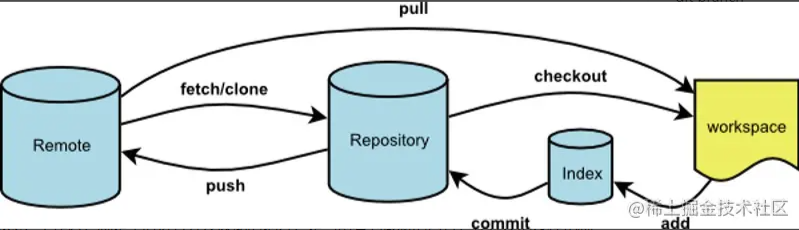

**Workspace：工作区**，就是平时进行开发改动的地方，是当前看到最新的内容，在开发的过程也就是对工作区的操作

**Index：暂存区**，当执行 `git add` 的命令后，工作区的文件就会被移入暂存区，暂存区标记了当前工作区中那些内容是被 Git 管理的，当完成某个需求或者功能后需要提交代码，第一步就是通过 `git add` 先提交到暂存区。

**Repository：本地仓库**，位于自己的电脑上，通过 `git commit` 提交暂存区的内容，会进入本地仓库。

**Remote：远程仓库**，用来托管代码的服务器，远程仓库的内容能够被分布在多个地点的处于协作关系的本地仓库修改，本地仓库修改完代码后通过 `git push` 命令同步代码到远程仓库。

## 工作流程

1.在工作区开发，添加，修改文件。 2.将修改后的文件放入暂存区。 3.将暂存区域的文件提交到本地仓库。 4.将本地仓库的修改推送到远程仓库。

## 基本操作

### git add

添加文件到暂存区

```bash
# 添加某个文件到暂存区，后面可以跟多个文件，以空格区分
git add xxx
# 添加当前更改的所有文件到暂存区。
git add .
```

### git commit

```bash
# 提交暂存的更改，会新开编辑器进行编辑
git commit
# 提交暂存的更改，并记录下备注
git commit -m "you message"
# 等同于 git add . && git commit -m
git commit -am
# 对最近一次的提交的信息进行修改,此操作会修改commit的hash值
git commit --amend

```

### git pull

```bash
# 从远程仓库拉取代码并合并到本地，可简写为 git pull 等同于 git fetch && git merge
git pull <远程主机名> <远程分支名>:<本地分支名>
# 使用rebase的模式进行合并
git pull --rebase <远程主机名> <远程分支名>:<本地分支名>
```

### git fetch

与 `git pull` 不同的是 `git fetch` 操作仅仅只会拉取远程的更改，不会自动进行 merge 操作。对你当前的代码没有影响

```bash
# 获取远程仓库特定分支的更新
git fetch <远程主机名> <分支名>
# 获取远程仓库所有分支的更新
git fetch --all

```

### git branch

```bash
# 新建本地分支，但不切换
git branch <branch-name>
# 查看本地分支
git branch
# 查看远程分支
git branch -r
# 查看本地和远程分支
git branch -a
# 删除本地分支
git branch -D <branch-nane>
# 重新命名分支
git branch -m <old-branch-name> <new-branch-name>
```

### git remote

```bash
# 查看远程占用
git remote -v
# 删除远程占用
git remote rm origin
# 连接远程仓库，origin相当于url的别名，方便后续git操作
git remote add origin url
```

# 合并

合并其他分支的某次提交

> git cherry-pick 该提交的 hash 值

git log 可查看提交 hash 值

# remote 操作

## 修改

先用

```bash
git remote -v
```

检查下现有的远程出库地址

确认之后修改

```bash
git remote set-url origin https://gitee.com/zhai-sifeng/docs.git
```

## 删除

```bash
git remote rm origin
```

## 切换

```bash
git remote set-url origin <new-url>
```

# 其他操作

## 配置相关

```bash
查看全局配置信息：
git config --global --list
这将显示全局配置的所有信息，包括用户名、电子邮件、默认编辑器等。

查看当前仓库的配置信息：
git config --list
在仓库目录下执行此命令，将显示当前仓库的配置信息。

查看特定配置项的值：
git config <key>
将 <key> 替换为要查看的特定配置项的名称，例如：
git config user.name
git config core.editor

设置全局邮箱：
git config --global user.name "xxx"
查看 Git 的所有配置信息：

git config --list --show-origin
此命令将显示所有 Git 配置项及其来源（配置文件和命令行选项等）。
```

## rebase

```bash
查看两个分支的共同祖先
git merge-base branchA branchB
输出是commit的hash
修改分支的基
git rebase branchB
```

## 查找某个文件的删除，在哪一次提交

```bash
git log --diff-filter=D --summary > log.txt
```

将包含文件删除的提交记录，写入`log.txt`文件，然后在文件中搜索文件名，就可以看到相关 commit 的 hash

比如

```bash
commit da76ba676629367b1a067bfb17964b9009969581
Author: xxx
Date:   Tue May 7 16:37:43 2024 +0800

    【EDIT】添加Reddit社媒分享，整合分享组件

 delete mode 100644 src/GG/components/gg/GMobileShareButton.vue
 delete mode 100644 src/GG/components/gg/GPcShareButton.vue
```

> 拓展

- `--summary`显示提交摘要
- `--diff-filter`提交类型，包含
  - `A`：只显示**添加**的文件。
  - `C`：只显示**复制**的文件。
  - `D`：只显示**删除**的文件。
  - `M`：只显示**修改**的文件。
  - `R`：只显示**重命名**的文件。
  - `T`：只显示**更改了文件类型**的文件。

此外，还可以在选项前加上小写字母 `d` 来排除选择。例如，`--diff-filter=dM` 会显示除了修改的文件以外的所有文件。

# 团队协作

私仓+公仓+merge request 模式

1.在公仓那 fork 出来，此时创建了私仓；

2.clone 私仓到本地，添加私仓和公仓的 remote；

```bash
git remote add origin 私仓地址
git remote add upstream 公仓地址
```

tip: origin 和 upstream 命名看团队要求或者个人习惯；

3.执行 `git remote -v` 查看验证；

4.每次负责模块开发完，fetch 公仓的更新，若有 conflict 得解决再 merge；

```bash
git fetch upstream
git merge upstream/分支名
```

5.提交更新到私仓

```bash
git push origin 分支名
```

6.接着去公仓提交 merge request，由项目的 maintainer 合并你的跟新（一般是 developer，当然，优秀的你迟早 maintainer）

# 疑难杂症

## cherry-pick

`Merge branch 'feature/pro/merge-35' of git.cloud2go.cn:cloud/b_d into feature/pro/merge-35`

cherry-pick 这种类型的提交报错：

> error: commit fe3c6a5023c56403aeeff3e7b93f60b71c45b9ab is a merge but no -m option was given.

在 Git 中，合并提交有两个父提交，所以试图 cherry-pick 一个合并提交时，需要使用`-m`选项来指定想要的父提交。

例如，如果你想要 cherry-pick 合并提交`fe3c6a5023c56403aeeff3e7b93f60b71c45b9ab`，并且想要的是第一个父提交，可以这样做：

```bash
git cherry-pick -m 1 fe3c6a5023c56403aeeff3e7b93f60b71c45b9ab
```

## please clean your repository working tree before checkout

暂时到 stash 中

**本地仓库已经新建了很多文件，怎么和新建的 Github 远程仓库建立关联？**

1.添加远程地址

```bash
git remote add origin 远程地址
```

2.获取远程更新并合并

```bash
git fetch origin
```

```bash
git merge origin/master
```

执行 `git merge origin/master` 时会报错提示 `fatal: refusing to merge unrelated histories`

表示 **你尝试将两个没有共同祖先的 Git 仓库历史（unrelated histories）合并**

3.本地分支和远程分支建立关联

```bash
git branch --set-upstream-to=origin/master master
```

然后合并远程分支

```bash
git pull origin master --allow-unrelated-histories
```

之后解决冲突完 commit，接着就可以 push 到远程了

```bash
git push origin master
```

（还有一直方案是新建一个分支，后续若有需要，可以补充）

**这种方案不用新建分支，但是可能会破坏远程分支的内容，需要擦亮眼睛；**

养成好习惯: **先远程新建仓库，再克隆至本地**
