# 数据结构

## 栈

- 受限的线性结构

- 后进先出 LIFO

- 栈定、栈底

基于数组实现

### 属性

**item: []**

### 常见方法

```js
function Stack() {
  // 属性
  this.item = [];

  // push
  Stack.prototype.push = function (element) {
    this.item.push(element);
  };
  // pop
  Stack.prototype.pop = function () {
    return this.item.pop();
  };
  // peek
  Stack.prototype.peek = function () {
    return this.item[this.item.length - 1];
  };
  // isEmpty
  Stack.prototype.isEmpty = function () {
    return this.item.length === 0;
  };
  // size
  Stack.prototype.size = function () {
    return this.item.length;
  };
  // toString
  Stack.prototype.toString = function () {
    let res = "";
    for (let i = 0; i < this.item.length; i++) {
      res += this.item[i] + " ";
    }
    return res;
  };
}
```

### 应用

#### 十进制转二进制

```js
function dec2bin(decNumber) {
  // 栈对象-保存余数
  const stack = new Stack();

  while (decNumber > 0) {
    stack.push(decNumber % 2);

    // 获取商，作为下一次的decNumber
    decNumber = Math.floor(decNumber / 2);
  }
  // 从栈中取出0和1
  let binRes = "";
  while (!stack.isEmpty()) {
    binRes += stack.pop();
  }
  return binRes;
}
```

## 链表

### 数组的缺点

- **连续的内存空间**，大部分编程语言的数组大小固定，当不能满足容量需求时，需要**扩容**，而扩容是非常**消耗性能**
- 在头部或中间**插入数据**，需要进行大量**元素的位移**

### 链表的出现

#### 优点

相对于数组，链表有一些**优点**：

- 内存空间**不必连续**~，灵活
- 不用创建时确定大小
- **插入和删除**，时间复杂度可以达到 O（1）

#### 缺点

而对于数组，链表也有一些**缺点**：

- 访问任何一个元素，都需要**从头开始**

#### 总结

| 侧重查询       | 选数组 |
| -------------- | ------ |
| 侧重插入和删除 | 选链表 |

链表和火车的结构非常相似~

### 实现

#### 单向链表

##### 属性

- head
- length
- node 的 data
- node 的 next

```js
function LinkedList() {
  // 属性
  this.head = null;
  this.length = 0;
  // 内部类 节点
  function Node(data) {
    this.data = data;
    this.next = null;
  }
}
```

##### 常见操作

- append
- insert
- get
- update
- remove
- removeAt
- indexOf
- size
- empty
- toString

> append

1. 创建新节点
2. 添加的是第一个节点？
3. 找出最后节点
4. 长度+1

```js
LinkedList.prototype.append = function (data) {
  // 创建新节点
  const newNode = new Node(data);
  // 添加的是第一个节点？
  if (this.length === 0) {
    this.head = newNode;
  } else {
    // 不是
    // 找出最后节点
    let last = this.head;
    while (last.next) {
      last = last.next;
    }
    // 最后节点指向新加节点
    last.next = newNode;
  }
  // 长度+1
  this.length += 1;
};
```

> toString

```js
LinkedList.prototype.toString = function (params) {
  let current = this.head;
  let res = "";

  // 遍历节点
  while (current) {
    res += current.data + " ";
    current = current.next;
  }

  return res;
};
```

**测试**

```
const list = new LinkedList()

list.append('abc')
list.append('abb')
list.append('ccc')

console.log(list)
```

> insert

- position 越界判断
- 根据 data 创建新节点
- case
- 长度+1

```js
LinkedList.prototype.insert = function (position, data) {
  // position越界判断
  if (position < 0 || position > this.length) {
    return false;
  }

  // 根据data创建新节点
  const newNode = new Node(data);

  // case1 插入position = 0 的位置
  if (position === 0) {
    newNode.next = this.head;
    this.head = newNode;
  } else {
    // case2 插入position > 1 的位置
    // 找到位置
    let index = 0;
    // 记录目标节点
    let current = this.head;
    // 记录目标节点的上一个节点
    let previous = null;
    while (index++ < position) {
      previous = current;
      current = current.next;
    }

    newNode.next = current;
    previous.next = newNode;
  }
  // 长度+1
  this.length += 1;

  return true;
};
```

其中，插入到最后的情况，case2 已经包含，而且，要是想插入到最后，用**append**呗

**测试**

```js
// 测试
const list = new LinkedList();
// append
list.append("abc");
list.append("abb");
list.append("ccc");

// insert
list.insert(0, "zsf");
list.insert(3, "hhh");
list.insert(100, "lll");

console.log(list);
```

> get

1. position 越界判断，=也不行
2. 获取 data

```js
LinkedList.prototype.get = function (position) {
  // position越界判断，=也不行
  if (position < 0 || position >= this.length) {
    return null;
  }

  // 获取data
  let current = this.head;
  let index = 0;
  while (index++ < position) {
    current = current.next;
  }

  return current.data;
};
```

**测试**

```js
const list = new LinkedList();
// append
list.append("abc");
list.append("abb");
list.append("ccc");

// insert
list.insert(0, "zsf");
list.insert(3, "hhh");
list.insert(100, "lll");

// get
console.log(list.get(0));
console.log(list.get(2));
console.log(list.get(9));

console.log(list);
```

> indexOf

```js
LinkedList.prototype.indexOf = function (data) {
  let current = this.head;
  let index = 0;

  while (current) {
    if (current.data === data) {
      return index;
    }
    current = current.next;
    index += 1;
  }

  return -1;
};
```

**测试**

```js
const list = new LinkedList();

console.log(list.indexOf("zsf"));
console.log(list.indexOf("hhh"));
console.log(list.indexOf("ll"));
```

> update

- position 越界判断，=也不行
- 找到目标节点

```js
LinkedList.prototype.update = function (position, data) {
  // position越界判断，=也不行
  if (position < 0 || position >= this.length) {
    return false;
  }
  // 找到目标节点
  let current = this.head;
  let index = 0;
  while (index++ < position) {
    current = current.next;
  }

  current.data = data;
  return true;
};
```

**测试**

```js
const list = new LinkedList();
console.log(list.update(0, "hhh"));
```

> removeAt

position 越界判断，=也不行

1. 第一个节点？
2. 目标节点的上一个节点
3. 长度-1

```js
LinkedList.prototype.removeAt = function (position) {
  // position越界判断，=也不行
  if (position < 0 || position >= this.length) {
    return null;
  }

  // 第一个节点？
  // 目标节点
  let current = this.head;
  if (position === 0) {
    this.head = this.head.next;
  } else {
    // 目标节点的上一个节点
    let previous = null;
    let index = 0;
    while (index++ < position) {
      previous = current;
      current = current.next;
    }

    previous.next = current.next;
  }
  // 长度-1
  this.length -= 1;

  return current.data;
};
```

**测试**

```js
const list = new LinkedList();
console.log(list.removeAt(0));
```

> remove

1. 根据 data 获取位置
2. 根据位置删除

```js
LinkedList.prototype.remove = function (data) {
  // 根据data获取位置
  const position = this.indexOf(data);
  // 根据位置删除
  return this.removeAt(position);
};
```

**测试**

```js
const list = new LinkedList();
console.log(list.remove("abc"));
```

> isEmpty

```js
LinkedList.prototype.isEmpty = function () {
  return this.length === 0;
};
```

> size

```js
LinkedList.prototype.size = function () {
  return this.length;
};
```

##### 反转单链表

```js
/**
 * Definition for singly-linked list.
 * function ListNode(val) {
 *     this.val = val;
 *     this.next = null;
 * }
 */
/**
 * @param {ListNode} head
 * @return {ListNode}
 */
var reverseList = function (head) {
  let temp = null;
  let pre = null;
  let cur = head;
  while (cur) {
    cur = head.next;
    head.next = pre;
    prev = head;
    head = p;
  }

  return pre;
};
```

**示例**

```
输入: 1->2->3->4->5->NULL
输出: 5->4->3->2->1->NULL
```

**复盘：**

**时间复杂度 O(N)**：遍历链表使用线性大小时间。

**空间复杂度 O(1)**：变量 pre 、temp、cur 使用常数大小额外空间。

1.pre 指向 null，cur 指向头节点

```js
pre = null;
cur = head;
```

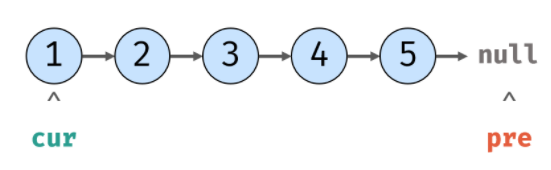

2.暂存后继节点，修改引用指向

```js
temp = cur.next;
cur.next = pre;
```

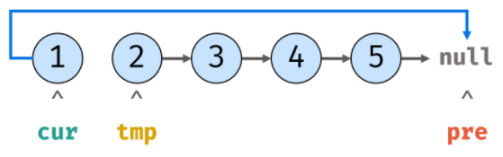

3.暂存当前节点，访问下一节点

```js
pre = cur;
cur = temp;
```

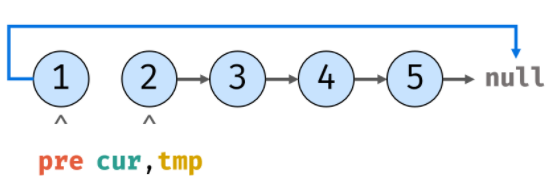

4.循环第 2~3 步

```js
temp = cur.next;
cur.next = pre;
pre = cur;
cur = temp;
```

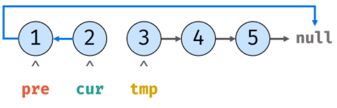

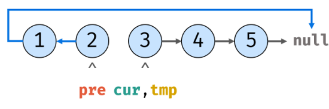

5.循环到最后两步，cur、temp 回收，返回 pre 是新的头节点

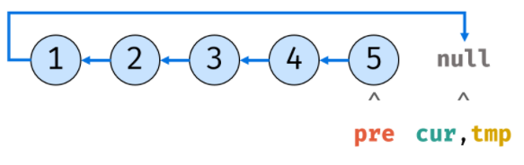

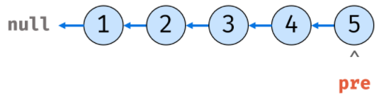

#### 双向链表

单向链表有个明显的**不足**：

**回到前一个节点**

相对于单向链表，双向也有一些**缺点**：

- **插入/删除**某个节点，要处理**4 个引用**
- 一个节点**内存空间**更大

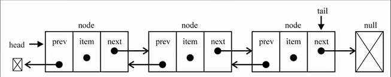

##### 属性

- head
- tail
- length
- node 的 data
- node 的 prev
- node 的 next

```js
function DoublyLinkedList() {
  // 属性
  this.head = null;
  this.tail = null;
  this.length = 0;
  // 内部类 节点
  function Node(data) {
    this.data = data;
    this.prev = null;
    this.next = null;
  }
}
```

##### 常见操作

- append
- insert
- backwrd/forward

> append

```js
DoublyLinkedList.prototype.append = function (data) {
  // 创建新节点
  const newNode = new Node(data);
  // 添加的是第一个节点？
  if (this.length === 0) {
    this.head = newNode;
    this.tail = newNode;
  } else {
    // 不是
    newNode.prev = this.tail;
    this.tail.next = newNode;
    this.tail = newNode;
  }
  // 长度+1
  this.length += 1;
};
```

> insert

```js
DoublyLinkedList.prototype.insert = function (position, data) {
  // position越界判断
  if (position < 0 || position > this.length) {
    return false;
  }

  // 根据data创建新节点
  const newNode = new Node(data);

  // case1 原来链表是否为空
  if (this.length === 0) {
    this.head = newNode;
    this.tail = newNode;
  } else {
    // case2 插入position = 0 的位置
    if (position === 0) {
      this.head.prev = newNode;
      newNode.next = this.head;
      this.head = newNode;
    } else if (position === this.length) {
      // case3 插入position = this.length 的位置
      newNode.prev = this.tail;
      this.tail.next = newNode;
      this.tail = newNode;
    } else {
      let current = this.head;
      let index = 0;
      // 找到目标节点
      while (index++ < position) {
        current = current.next;
      }
      newNode.next = current;
      newNode.prev = current.prev;
      current.prev.next = newNode;
      current.prev = newNode;
    }
  }
  // 长度+1
  this.length += 1;

  return true;
};
```

> backward\forward

```js
// backward向后遍历
DoublyLinkedList.prototype.backward = function (params) {
  let current = this.head;
  while (current) {
    current = current.next;
  }
  return current;
};
// forward
DoublyLinkedList.prototype.forward = function (params) {
  let current = this.tail;
  while (current) {
    current = current.prev;
  }
  return current;
};
```

其它方法类似，就是比单向链表修改多个指向

## 队列

- 先进先出 FIFO
- 前删后增

**应用场景**

线程队列

事件队列

### 实现

- 基于数组
- 基于链表

### 常见操作

- enQueue
- deQueue
- front

```js
function Queue() {
  // 属性
  this.items = [];

  // 方法

  // enQueue
  Queue.prototype.enQueue = function (element) {
    this.item.push(element);
  };

  // deQueue
  Queue.prototype.deQueue = function () {
    return this.items.shift();
  };

  // front
  Queue.prototype.front = function () {
    return this.items[0];
  };
}
```

### 击鼓传花

几个人围成一圈，数到某个数字的人自动淘汰

最后剩下的这个人会获得胜利，问，胜利者原来在哪一个位置

```js
function passGame(nameList, num) {
  // 创建队列
  let queue = new Queue();

  // 将所有人加入队列
  for (let i = 0; i < nameList.length; i++) {
    queue.enQueue(nameList[i]);
  }

  // 数数字
  // 当队列长度不为1时一直循环
  while (queue.size() > 1) {
    // num数字之前的人重新放入队列的末尾
    for (let i = 0; i < num - 1; i++) {
      queue.enQueue(queue.deQueue);
    }
    // num对应的的人，从队列中删除~
    queue.deQueue();
  }

  return nameList.indexof(queue.front());
}
```

### 优先级队列

**插入**一个元素时会考虑该数的**优先级**

**应用**

- 登机
- 急诊科
- 线程

#### 实现

```js
function PriorityQueue() {
  // 属性
  this.items = [];

  function QueueElement(element, priority) {
    this.element = element;
    this.priority = priority;
  }
  // 方法
  // enQueue
  PriorityQueue.prototype.enQueue = function (element, priority) {
    // 创建QueueElement对象
    const queueElement = new QueueElement(element, priority);
    // 判断队列是否为空
    if (this.isEmpty()) {
      this.items.push(queueElement);
    } else {
      // 记录是否有机会添加
      let added = false;
      for (let i = 0; i < this.items.length; i++) {
        if (queueElement.priority < this.items[i].priority) {
          this.items.splice(i, 0, queueElement);
          added = true;
          break;
        }
      }
      // 如果优先级不如队列中其它元素，直接放最后
      if (!added) {
        this.items.push(queueElement);
      }
    }
  };

  // deQueue
  PriorityQueue.prototype.deQueue = function () {
    return this.items.shift();
  };

  // front
  PriorityQueue.prototype.front = function () {
    return this.items[0];
  };
}
```

## 树

### 完美二叉树

除了最后一层的叶子节点外，每层节点都有 2 个子节点，又叫满二叉树

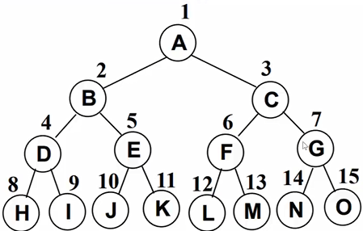

### 完全二叉树

- **除最后一层**外，其它各层的节点数都达到**最大个数**
- 最后一层从左向右的叶节点连续存在，**只缺右侧**若干节点
- 完美二叉树是特殊的完全二叉树

### 二叉搜索树

Binary Search Tree（BST）

#### 特点

- 非空左子树所有的键值小于其根节点的键值
- 非空右子树所有的键值大于其根节点的键值
- 左右子树本身也是二叉搜索树

举个例子

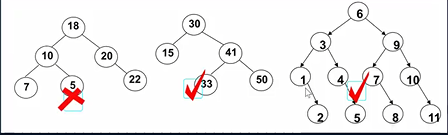

#### 封装

```js
function BinarySeacherTree() {
  function Node(key) {
    this.key = key;
    this.left = null;
    this.right = null;
  }
  // 属性-根结点
  this.root = null;
}
```

#### 常见操作

- insert
- search（优势）
- remove（复杂）
- inOrderTraverse
- preOrderTraverse
- POSTOrderTraverse
- min
- max

> insert

```js
// insert
BinarySeacherTree.prototype.insert = function (key) {
  // 根据key创建节点
  const newNode = Node(key);

  // case1 根结点是否有值
  if ((this.root = null)) {
    this.root = newNode;
  } else {
    this.insertNode(this.root, newNode);
  }
};

// insertNode 用于递归插入
BinarySeacherTree.prototype.insertNode = function (node, newNode) {
  if (newNode.key < node.key) {
    // 向左查找
    if (node.left == null) {
      // 为空？
      node.left = newNode;
    } else {
      this.insertNode(node.left, newNode);
    }
  } else {
    // 向右查找
    if (node.right == null) {
      // 为空？
      node.right = newNode;
    } else {
      this.insertNode(node.right, newNode);
    }
  }
};
```

> 遍历

- 先序遍历（先处理，再找子）
- 中序遍历

**先序遍历**

```js
// preOrderTraversal
BinarySeacherTree.prototype.preOrderTraversal = function (handler) {
  this.preOrderTraversalNode(this.root, handler);
};

// preOrderTraversalNode 用于节点递归遍历
BinarySeacherTree.prototype.preOrderTraversalNode = function (node, handler) {
  if (node != null) {
    // 1.处理经过的节点
    handler(node.key);
    // 2.处理经过节点的左子节点
    this.preOrderTraversalNode(node.left, handler);
    // 3.处理经过节点的右子节点
    this.preOrderTraversalNode(node.right, handler);
  }
};
```

**中序遍历**

```js
// 中序遍历 midOrderTraversal
BinarySeacherTree.prototype.midOrderTraversal = function (handler) {
  this.midOrderTraversalNode(this.root, handler);
};
// preOrderTraversalNode 用于中序节点递归遍历
BinarySeacherTree.prototype.midOrderTraversalNode = function (node, handler) {
  if (node != null) {
    // 1.先处理左子树中的节点
    this.midOrderTraversalNode(node.left, handler);
    // 2.处理节点
    handler(node.key);
    // 3.处理右子树中的节点
    this.midOrderTraversalNode(node.right, handler);
  }
};
```

**后序遍历**

```js
// 后序遍历
BinarySeacherTree.prototype.postOrderTraversal = function (handler) {
  this.postOrderTraversalNode(this.root, handler);
};
// preOrderTraversalNode 用于中序节点递归遍历
BinarySeacherTree.prototype.postOrderTraversalNode = function (node, handler) {
  if (node != null) {
    // 1.先处理左子树中的节点
    this.postOrderTraversalNode(node.left, handler);
    // 2.处理右子树中的节点
    this.postOrderTraversalNode(node.right, handler);
    // 3.处理节点
    handler(node.key);
  }
};
```

> 搜索

- 最大/最小值
- 特定的值

**最值**

```js
// 寻找最值
BinarySeacherTree.prototype.max = function () {
  // 获取根结点
  let node = this.root;
  // 直到节点没右子节点
  while (node.right != null) {
    node = node.right;
  }
  return node.key;
};

BinarySeacherTree.prototype.min = function () {
  // 获取根结点
  let node = this.root;
  // 直到节点没左子节点
  while (node.left != null) {
    node = node.left;
  }
  return node.key;
};
```

**特定值**

```js
// 搜索某个key
BinarySeacherTree.prototype.search = function (key) {
  let node = this.root;

  // 循环搜索
  while (node != null) {
    if (key < node.key) {
      node = node.left;
    } else if (key > node.key) {
      node = node.right;
    } else {
      return true;
    }
  }

  return false;
};
```

> 删除

比较复杂~

1. 找到要删除的节点

2. 分 3 情况：

   - **没有子节点**

   - **有一个子节点**

     左节点？右节点？

     左子节点？右子节点？

   - **有两个子节点**

**找到要删除的节点**

```js
// 1.找到需要删除的节点
let current = this.root;
// 它的父节点
let parent = null;
// 判断是否删除的是左子节点
let isLeftChild = false;

while (current.key != key) {
  parent = current;
  if (key < current.key) {
    isLeftChild = true;
  } else {
    isLeftChild = false;
    current = current.right;
  }
  // 到最后都没找到~
  if (current == null) {
    return false;
  }
}
```

**没有子节点**

```js
if (current.left == null && current.right) {
  if (current == this.root) {
    this.root = null;
  } else if (isLeftChild) {
    parent.left = null;
  } else {
    parent.right = null;
  }
}
```

**有一个子节点**

别忘记考虑删除的是根的情况~

```js
// 删除的是有一个子节点的父节点
    else if (current.right == null) {
      if (current == this.root) {
        this.root = current.left
      } else if (isLeftChild) {
        parent.left = current.left
      } else {
        parent.right = current.left
      }
    } else if (current.left == null) {
      if (current == this.root) {
        this.root = current.right
      } else if (isLeftChild) {
        parent.left = current.right
      } else {
        parent.right = current.right
      }
    }
```

**有两个子节点**

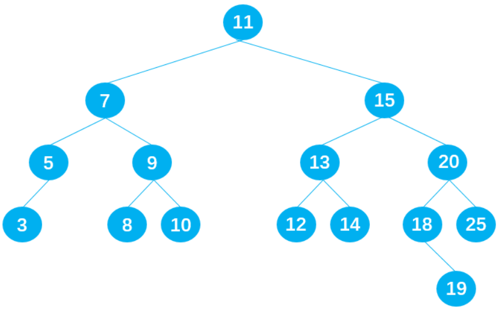

删除后保证还是二叉搜索树

**删除节点 9**

- 替代节点 9，节点**8 符合**；
- 替代节点 9，节点**10 符合**；

**删除节点 7**

- 替代节点 7，节点**5 符合**；
- 替代节点 7，节点**8 符合**；

**删除节点 15**

- 替代节点 15，节点**14 符合**；
- 替代节点 15，节点**18 符合**；

**规律总结：**

若用 current 表示需要删除的节点，则合适的替代节点是：

- current 左子树中比 current**小一点点的节点**，即 current**左子树**中的**最大值**；
- current 右子树中比 current**大一点点的节点**，即 current**右子树**中的**最小值**；

在二叉搜索树中，这两个特殊的节点有特殊的名字：

- **前驱**。比如下图中的节点 5 就是节点 7 的前驱；
- **后继**。比如下图中的节点 8 就是节点 7 的后继；

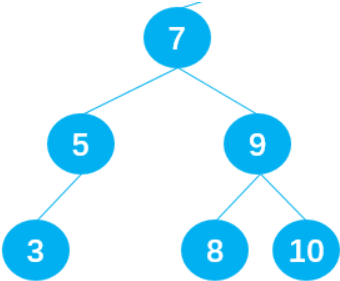

**如何查找前驱和后继？**

**后继**：在 current 的**右子树**中查找**最小值**，即在 current 的**右子树**中一直**向左遍历**查找；

**前驱**：在 current 的**左子树**中查找**最大值**，即在 current 的**左子树**中一直**向右**遍历查找

**后继代码的封装**

```js
//封装查找后继的方法
BinarySearchTree.prototype.getSuccessor = function (delNode) {
  //1.定义变量,保存找到的后继
  let successor = delNode;
  let current = delNode.right;
  let successorParent = delNode;

  //2.循环查找current的右子树节点
  while (current != null) {
    successorParent = successor;
    successor = current;
    current = current.left;
  }

  //3.判断寻找到的后继节点是否直接就是删除节点的right节点
  if (successor != delNode.right) {
    successorParent.left = successor.right;
    successor.right = delNode.right;
  }
  return successor;
};
```

**代码**

```js
else{
          //1.获取后继节点
          let successor = this.getSuccessor(current)

          //2.判断是否根节点
          if (current == this.root) {
            this.root = successor
          }else if (isLeftChild){
            parent.left = successor
          }else{
            parent.right = successor
          }

          //3.将后继的左子节点改为被删除节点的左子节点
          successor.left = current.left
        }
```

# 算法

## 排序

### 选择排序

找最小，放开头；

剩下找最小，放剩下开头，重复这步；

#### 案例 **[2, 3, 5, 4, 1]**

第一轮 13542

第二轮 12543

第三轮 12453 12354

第四轮 12345

```js
/*
 * @Description: 选择排序
 * @Author: SiFeng Zhai
 * @Date: 2022-09-26 19:04:25
 * @LastEditors: SiFeng Zhai
 * @LastEditTime: 2022-09-26 19:19:24
 */
function selectionSort(arr) {
  // 边界
  if (arr === undefined || arr.length < 2) {
    return arr;
  }
  for (let i = 0; i < arr.length - 1; i++) {
    let minIndex = i;
    for (let j = i + 1; j < arr.length; j++) {
      // 一轮比较，更新最小下标
      minIndex = arr[j] < arr[minIndex] ? j : minIndex;
    }
    swap(arr, i, minIndex);
  }
  return arr;
}

function swap(arr, i, j) {
  let temp = arr[i];
  arr[i] = arr[j];
  arr[j] = temp;
}
// 测试
const arr1 = [2, 3, 5, 4, 1];
console.log(selectionSort(arr1));
```

### 冒泡排序

找最大，放尾部

剩下找最大，放剩下尾部，重复

#### 案例 **[2, 3, 5, 4, 1]**

第一轮 23415

第二轮 23145

第三轮 21345

第四轮 12345

```js
/*
 * @Description: 冒泡排序
 * @Author: SiFeng Zhai
 * @Date: 2022-09-26 19:32:47
 * @LastEditors: SiFeng Zhai
 * @LastEditTime: 2022-09-26 19:49:25
 */
function bubbleSort(arr) {
  // 边界
  if (arr === undefined || arr.length < 2) {
    return arr;
  }
  for (let i = arr.length; i > 0; i--) {
    for (let j = 0; j < i; j++) {
      if (arr[j] > arr[j + 1]) {
        swap(arr, j, j + 1);
      }
    }
  }
  return arr;
}
// function swap(arr, i, j) {
//   let temp = arr[i]
//   arr[i] = arr[j]
//   arr[j] = temp
// }
// 交换的另一种写法：异或(有个条件，两者内存要不一样，否则会被洗成0)
function swap(arr, i, j) {
  arr[i] = arr[i] ^ arr[j];
  arr[j] = arr[i] ^ arr[j];
  arr[i] = arr[i] ^ arr[j];
}
// 测试
const arr1 = [2, 3, 5, 4, 1];
console.log(bubbleSort(arr1));
```

### 插入排序

0~0 想有序

0~1 想有序

0~2 想有序

...

0~n 想有序

先排好一部分，当**新元素**进来时从**尾部**开始比较，找到合适位置插入；

```js
function swap(arr, i, j) {
  arr[i] = arr[i] ^ arr[j];
  arr[j] = arr[i] ^ arr[j];
  arr[i] = arr[i] ^ arr[j];
}
function insertSort(arr) {
  if (arr === null || arr.length < 2) {
    return arr;
  }
  // 0~0、0~1、0~n想有序
  for (let i = 1; i < arr.length; i++) {
    for (let j = i - 1; j >= 0; j--) {
      // 插入元素比前一元素小时才会移动
      if (arr[j] > arr[j + 1]) {
        swap(arr, j, j + 1);
      }
    }
  }
  return arr;
}
// 测试数据
const arr = [3, 2, 5, 4, 2, 3, 1];
console.log(insertSort(arr));
```

### 快速排序

1.拿到中间下标，并取到中间值

2.小于中间值放左边，大于放右边

3.递归 1~2 步，

4.当传入数组长度不足 2 时递归结束

5.获取到升序排序的数组

```js
const sortArray = function (nums) {
  // 边界
  if (nums.length <= 1) return nums;
  // 中间下标
  const midIndex = Math.floor(nums.length / 2);
  // 以中间为基准截取
  const midValue = nums.splice(midIndex, 1)[0];

  const left = [];
  const right = [];

  // 分类，大的放基准右边，小的放左边
  nums.forEach((item) => {
    if (item < midValue) {
      left.push(item);
    } else {
      right.push(item);
    }
  });

  // 递归+连接
  return [...sortArray(left), midValue, ...sortArray(right)];
};
```

当然你要是觉得上面花里胡哨，你也可以

```js
const sortArray = function (nums) {
  return nums.sort((a, b) => a - b);
};
```

### 不稳定排序

那些是不稳定排序

```
插入
归并
冒泡
堆、希尔、快速
```

## 贪心

### 思想

全局结果是局部结果的简单求和，且**局部结果互不相干**，因此局部最优的策略也同样是全局最优的策略。

### 455.分发饼干

有一群孩子和一堆饼干；

每个孩子有一个饥饿度；

每个饼干都有一个大小；

每个孩子只能吃 一个饼干；

且只有饼干的大小不小于孩子的饥饿度时，这个孩子才能吃饱；

求解最多有多少孩子 可以吃饱？

**题解**

因为**饥饿度最小**的孩子最容易吃饱，所以我们**先考虑**这个孩子；

给剩余孩子里**最小饥饿度**的孩子分配**最小的能饱腹**的饼干；

这样就能让**更多孩子**饱（体现贪心）；

满足了这个孩子之后，采取同样的策略，考虑剩下孩子里饥饿度最小的孩子，直到 **满足所有小孩**或者**分完所有饼干**；

```js
const findContentChildren = function (g, s) {
  // 饥饿度排升序
  g.sort((a, b) => a - b);
  // 饼干大小排升序
  s.sort((a, b) => a - b);
  let child = 0;
  let cookie = 0;
  // 当满足所有小孩或者分完所有饼干就结束
  while (child < g.length && cookie < s.length) {
    if (g[child] <= s[cookie]) ++child;
    ++cookie;
  }
  return child;
};
```

### 135.分发糖果

一群孩子站成一排；

每个孩子**至少**分配到 **1** 个糖果；

**相邻**两个孩子评分**更高**的孩子会获得**更多**的糖果；

需要准备的最少糖果数目？

**题解**

两次遍历即可；

每个孩子糖果数初识化为 1；

从**左到右**遍历一次，当评分**大于左边**就加糖果；

从**右到左**遍历一次，当评分**大于右边**就加糖果；

每次遍历只考虑相邻**一侧** （体现贪心）

注意：从**右到左**的过程，**相邻差距 2**就不用赋比相邻大 1 的值，**使用原来的**即可，反之赋比相邻大 1 的值

比如 评分 **[1,3,4,5,2]** 糖果数 **[1,2,3,4,1]**

如果只是简单的在相邻基础上糖果+1，那相邻的本来就很少（1），只是+1（2）会比不上另一侧相邻的（原本是 4 才符合）

```js
/**
 * @param {number[]} ratings
 * @return {number}
 */
const candy = function (ratings) {
  // 数组长度小于2
  if (ratings.length < 2) return 1;
  // 所有孩子糖果数初识值为1
  const num = [];
  for (let i = 0; i < ratings.length; i++) {
    num[i] = 1;
  }
  // 左到右
  for (let i = 1; i < ratings.length; i++) {
    if (ratings[i] > ratings[i - 1]) {
      num[i] = num[i - 1] + 1;
    }
  }
  // 右到左
  for (let i = ratings.length - 1; i > 0; i--) {
    if (ratings[i] < ratings[i - 1]) {
      // 如果相邻差距2就不用赋比相邻大1的值，使用原来的即可，反之赋比相邻大1的值
      num[i - 1] = num[i - 1] > num[i] + 1 ? num[i - 1] : num[i] + 1;
    }
  }
  // 统计总数
  let result = num.reduce((preVal, item) => {
    return preVal + item;
  }, 0);
  return result;
};
```

### 435.无重叠区间

给定多个区间；

计算让这些区间互不重叠所需要移除区间的最少个数()；

换句话说，就是在保证区间不重叠的情况下保留**更多的区间**；

起止相连不算重叠；

**题解**

选择的区间**结尾越小**，**余留**给其它区间的**空间越大**，就越能**保留更多**的区间（体现贪心）;

先把区间按照**结尾的大小**进行**增序排序**，每次选择**结尾最小**且和前一个选择的区间**不重叠**的区间;

实时维护区间尾 tail;

如果区间**不重叠则移动 tail**，重叠则不移动（永远以合适的区间尾当做尾，不然不合适的区间会干扰区间尾）;

```js
/**
 * @param {number[][]} intervals
 * @return {number}
 */
const eraseOverlapIntervals = function (intervals) {
  // 边缘1
  if (!intervals.length) return 0;

  // 根据区间尾排升序
  intervals.sort((a, b) => a[1] - b[1]);

  // 实时维护区间尾tail
  let tail = intervals[0][1];
  // 记录不重叠区间个数,第一个一定有效
  let num = 1;
  for (let i = 1; i < intervals.length; i++) {
    // 如果上一个区间尾小于等于下一个区间头，表示不重叠
    if (tail <= intervals[i][0]) {
      num++;
      // 如果区间不重叠则移动tail，重叠则不移动，换下一个比较
      tail = intervals[i][1];
    }
  }
  return intervals.length - num;
};
```

### 剑指 019.最多删除一个字符得到回文

**题解**

```js
/**
 * @param {string} s
 * @return {boolean}
 */
const validPalindrome = function (s) {
  // 开头和结尾
  let start = 0;
  let end = s.length - 1;
  const foo = (left, right) => {
    for (let i = left, j = right; i < j; i++, j--) {
      if (s[i] !== s[j]) return false;
    }
    return true;
  };
  while (start < end) {
    // 如果相等，start+1，end-1
    if (s[start] === s[end]) {
      start++;
      end--;
    } else {
      // 如果不等，start+1或end-1后继续靠拢
      return foo(start + 1, end) || foo(start, end - 1);
    }
  }
  return true;
};
```

## 位运算

一个数组有一个元素出现奇数次，其它元素出现偶数次，找出这个数

```js
function findOddTimesNum(arr) {
  let eor = 0;
  arr.map((item) => {
    eor ^= item;
  });
  return eor;
}
// 测试
const arr1 = [1, 1, 2, 2, 3];
console.log(findOddTimesNum(arr1));
```

一个数组有两个元素出现奇数次，其它元素出现偶数次，找出这两个数

```js
function findOddTimesNum(arr) {
  let eor = 0;
  arr.map((item) => {
    eor ^= item;
  });
  //假设这两个出现奇次元素为ab，那 eor = a ^ b，且a!=b
  // eor != 0，异或也可以看成是无进位相加
  // eor的二进制必然有一个位置是1,假设该位置第3位
  // 隐藏条件：该数组分成了两类数，一是元素二进制数的第3位是1的，二是二进制数的第3位不是1的，并且a和b分别在两边
  const rightOne = eor & (~eor + 1); // 取出eor二进制数最右的1
  let onlyOne = 0; // eor'
  arr.map((item) => {
    if ((item & rightOne) === 1) {
      // 将a或b的同类异或掉，只剩下a或b
      onlyOne ^= item; // 这样异或下来会得出a或者b,再异或eor就可以得到另一个
    }
  });
  console.log(onlyOne, eor ^ onlyOne);
}
// 测试
const arr1 = [1, 1, 2, 2, 3, 4];
findOddTimesNum(arr1);
```

## 二分法

**在一个有序数组中，找某个数是否存在**

常规解法：遍历一次，逐个比较，O(N)

高效解法：二分法，取中间的数作比较，这样可以缩小一半范围，每次缩小一半 O(log2N)

**在一个有序数组中，找>=某个数最左侧的位置**

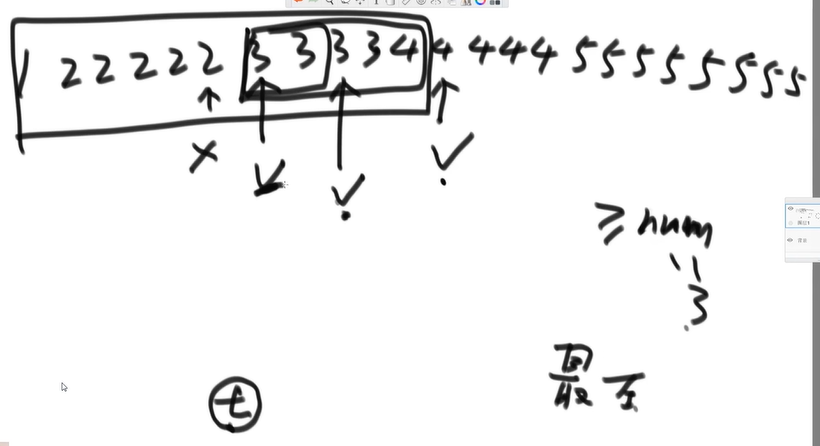

同样可以二分，用 t 记录该位置，不断刷新 t 到最后就是最左侧，O(log2N)

**局部最小值问题**

**在一个无序数组中（相邻的两个元素一定不相等），求一个局部最小的位置**

可以将元素转化成**折线图**，**较低点**就是局部最小；

从中间开始，和附近两元素比较是否是局部最小，若是，则返回位置；

若不是，那 0 到中间必存在局部最小，同样从这段区间中间开始找；

重复下去，一定会找到局部最小；

> 时间复杂度

```c
int foo() {
    if(n <= 1) return 2
    else return foo(n-2)/2
}
```

# 试题

## 哈夫曼树

`{4， 7， 8， 10， 12}`作为叶子节点权值构造哈夫曼树，其带权路径长度为

```
41
100
93
134
```

## 栈、堆区别

对于栈：

**内存空间**是固定的，适合**基础数据类型**；

**存取**效率高，适合**频繁操作**；

栈由系统**自动分配和释放**；

而堆的申请和释放由程序员**手动进行**，容易造成**内存泄漏**；
